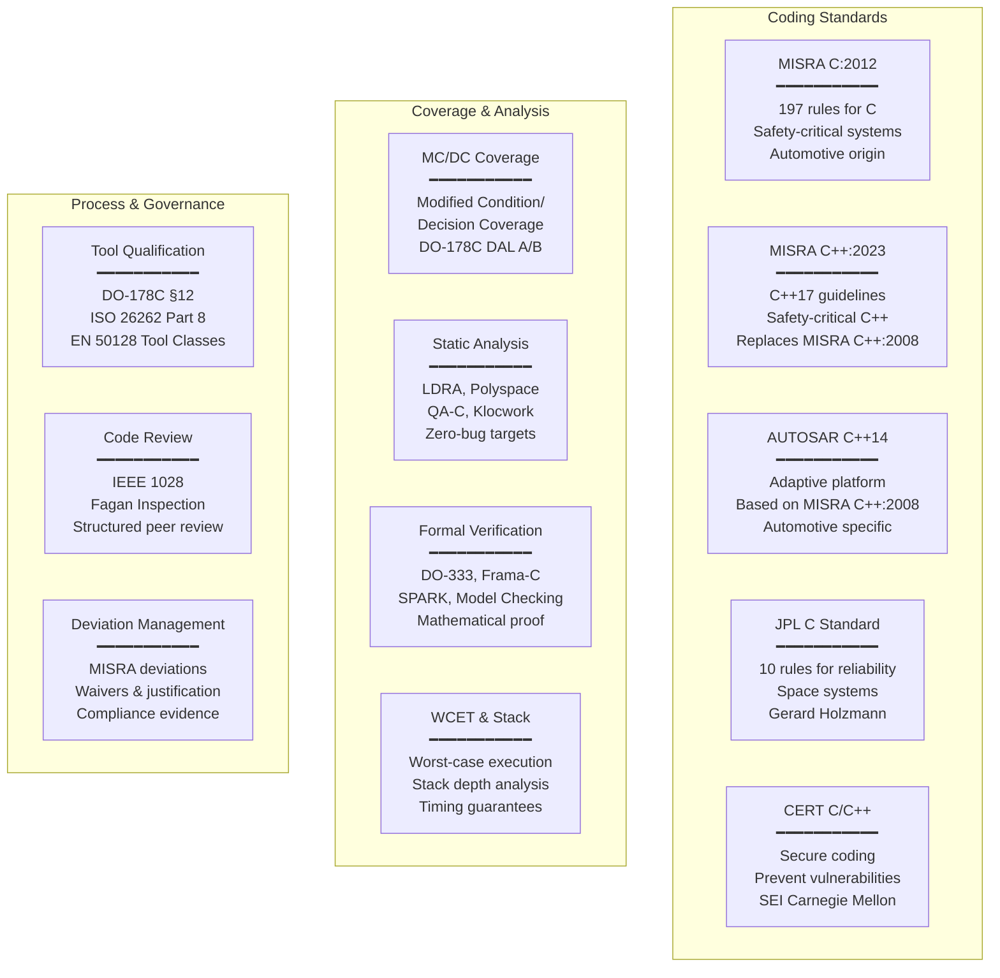

# Embedded Software Quality & Coding Standards — Category Overview

**Category:** 17 — Embedded Software Quality & Coding Standards  
**Mega-Domain:** 8 — Software Quality & DevOps  
**Scope:** MISRA C/C++, AUTOSAR C++14, CERT C/C++, JPL C, MC/DC coverage, static analysis, formal verification, tool qualification, WCET analysis, code review standards  
**Audience:** Embedded software engineers, safety engineers, quality assurance engineers, tool developers, certification authorities, functional safety managers

---

## Category Overview

Embedded software quality standards provide the foundation for developing reliable, safe, and secure software in safety-critical and mission-critical domains including automotive, aerospace, medical devices, industrial automation, and defense. These standards define rules for coding practices, testing coverage, analysis methods, and tool usage that collectively prevent software defects from causing harm.

---

## Standards Landscape

---

## Standards by Domain

| Domain | Primary Coding Standard | Coverage Requirement | Certification |
|:------:|:---:|:---:|:---:|
| **Automotive (ASIL D)** | MISRA C:2012; AUTOSAR C++14 | MC/DC (ISO 26262 Part 6) | ISO 26262 |
| **Aerospace (DAL A)** | MISRA C:2012; DO-178C rules | MC/DC (DO-178C §6.4.4.2) | DO-178C |
| **Medical (Class III)** | MISRA C:2012; CERT C; IEC 62304 | Statement + Branch (minimum) | IEC 62304 |
| **Rail (SIL 4)** | MISRA C:2012; EN 50128 rules | MC/DC (EN 50128) | EN 50128 |
| **Nuclear (Cat A)** | MISRA C; IEC 60880 | MC/DC | IEC 60880 |
| **Industrial (SIL 3)** | MISRA C:2012; CERT C | Branch/Decision | IEC 61508 |
| **Defense/Space** | JSF C++; JPL C; MISRA C | MC/DC; formal verification | MIL-STD / NASA NPR 7150 |

---

## Key Relationships

| Standard | Built On | Required By | Checked By |
|:---:|:---:|:---:|:---:|
| MISRA C:2012 | C99/C11 language | ISO 26262, DO-178C, EN 50128, IEC 61508 | LDRA, Polyspace, QA-C, PC-lint |
| MISRA C++:2023 | C++17 language | ISO 26262, emerging aerospace | Polyspace, Helix QAC, Klocwork |
| AUTOSAR C++14 | MISRA C++:2008 + automotive | AUTOSAR Adaptive Platform projects | Helix QAC, LDRA, Klocwork |
| CERT C | C11 language | Security-critical systems; CWE mapping | Klocwork, CodeSonar, Coverity |
| MC/DC | Boolean logic | DO-178C DAL A/B; ISO 26262 ASIL D | LDRA, VectorCAST, Rapita RVS |
| Tool Qualification | Process evidence | DO-178C §12; ISO 26262-8 §11 | Qualification kit; TQL determination |

---

## Documents in This Category

| # | Document | Key Content |
|:-:|----------|-------------|
| 00 | [Overview](00_Embedded_SW_Quality_Overview.md) | This document; category map; standards landscape |
| 01 | [MISRA C:2012 Rules](01_MISRA_C_2012_Rules.md) | All 197 rules; classification; examples; compliance; automotive & aerospace application |
| 02 | [MISRA C++:2023](02_MISRA_Cpp_2023.md) | New C++17 guidelines; comparison with 2008; safety-critical C++ usage patterns |
| 03 | [AUTOSAR C++14](03_AUTOSAR_Cpp14.md) | Adaptive platform coding rules; relationship to MISRA C++; automotive C++ |
| 04 | [JPL & CERT Coding Standards](04_JPL_CERT_Coding_Standards.md) | JPL's 10 rules; CERT C/C++ secure coding; space and security domains |
| 05 | [Code Coverage & MC/DC](05_Code_Coverage_MC_DC.md) | Coverage metrics hierarchy; MC/DC definition & proof; DO-178C & ISO 26262 requirements |
| 06 | [Static Analysis Tools](06_Static_Analysis_Tools.md) | LDRA, Polyspace, QA-C, Klocwork, CodeSonar; comparison; workflow integration |
| 07 | [Formal Verification](07_Formal_Verification.md) | DO-333; Frama-C; SPARK; model checking; mathematical proof of correctness |
| 08 | [Tool Qualification](08_Tool_Qualification.md) | DO-178C §12 TQL levels; ISO 26262-8 §11; EN 50128 tool classes; qualification process |
| 09 | [WCET & Stack Analysis](09_WCET_Stack_Analysis.md) | Worst-case execution time; stack depth; timing analysis tools; schedulability proof |
| 10 | [Code Review (IEEE 1028)](10_Code_Review_IEEE1028.md) | Formal inspection process; Fagan method; checklists; review metrics |
| 11 | [Deviation Management](11_Deviation_Management.md) | MISRA deviation process; waiver justification; compliance matrices; audit evidence |

---

## Compliance Matrix (Standards → Requirements)

| Coding Standard | Mandatory Rules | Required Rules | Advisory Rules | Total |
|:---:|:---:|:---:|:---:|:---:|
| MISRA C:2012 (+ AMD1+AMD2) | 27 | 139 | 31 | **197** |
| MISRA C++:2023 | TBD (new structure) | TBD | TBD | **~200** |
| AUTOSAR C++14 (R21-11) | — | ~350 (Required) | ~50 (Advisory) | **~400** |
| CERT C | — | 99 Rules + 196 Recs | — | **295** |
| JPL C | — | 10 (all mandatory) | — | **10** |

---

## Tool Ecosystem Quick Reference

| Tool | Vendor | MISRA C | MISRA C++ | AUTOSAR | CERT | MC/DC | Formal |
|:---:|:---:|:---:|:---:|:---:|:---:|:---:|:---:|
| LDRA TBvision | LDRA | ✅ | ✅ | ✅ | ✅ | ✅ | — |
| Polyspace | MathWorks | ✅ | ✅ | ✅ | ✅ | — | ✅ (abstract interpretation) |
| Helix QAC | Perforce | ✅ | ✅ | ✅ | ✅ | — | — |
| Klocwork | Perforce | ✅ | ✅ | ✅ | ✅ | — | — |
| VectorCAST | Vector | ✅ (integration) | ✅ | — | — | ✅ | — |
| CodeSonar | GrammaTech | ✅ | ✅ | — | ✅ | — | ✅ (partial) |
| Frama-C | CEA/INRIA | ✅ (partial) | — | — | — | — | ✅ |
| Astrée | AbsInt | ✅ | — | — | — | — | ✅ (sound) |
| Rapita RVS | Rapita | — | — | — | — | ✅ | — |

---

## Historical Milestones

| Year | Event | Impact |
|------|-------|--------|
| 1975 | McCabe Cyclomatic Complexity | First quantitative code metric |
| 1998 | MISRA C:1998 | Automotive C coding standard born |
| 2004 | MISRA C:2004; JSF C++ | Widely adopted; aerospace C++ |
| 2008 | MISRA C++:2008 | First safety-critical C++ standard |
| 2012 | MISRA C:2012; DO-178C | Major revision; modern avionics |
| 2016 | AUTOSAR C++14 | Automotive adaptive C++ |
| 2017 | Toyota MISRA violations exposed | Industry wake-up on coding standard compliance |
| 2020 | Boeing 737 MAX investigation | Software quality failures in aviation |
| 2023 | MISRA C++:2023 | Modern C++ for safety (C++17) |

---

*End of Document — 00_Embedded_SW_Quality_Overview.md*
