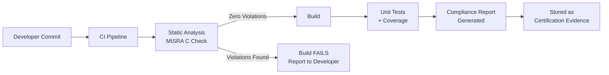
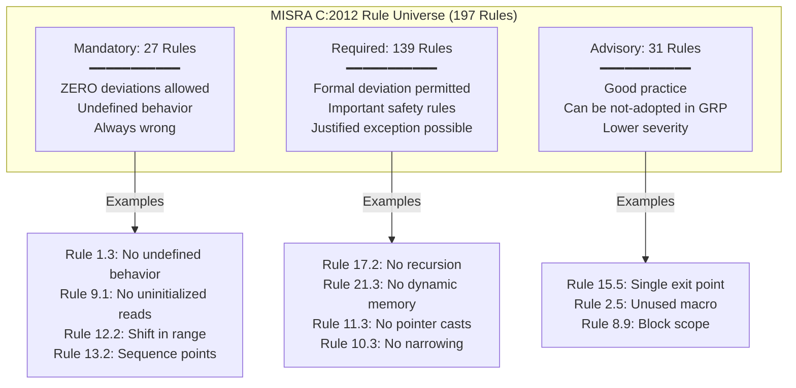
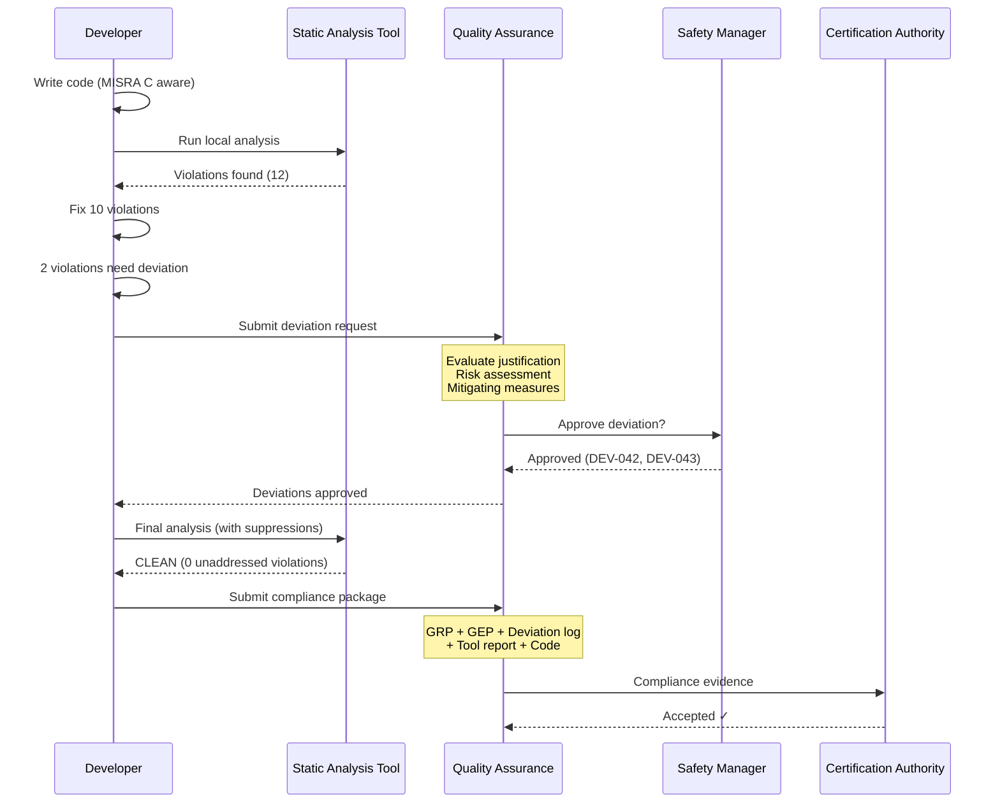

# MISRA C:2012 — Guidelines for the Use of C in Critical Systems

**Standard:** MISRA C:2012 (Third Edition, with AMD1:2016 and AMD2:2020 corrigenda)  
**Full Title:** Guidelines for the Use of the C Language in Critical Systems  
**SDO:** Motor Industry Software Reliability Association (MISRA Consortium)  
**Version:** 3rd Edition (2012); Amendment 1 (2016: C11 support); Amendment 2 (2020: additional rules + corrigenda)  
**Audience:** Embedded C developers, safety engineers, quality assurance engineers, static analysis tool developers, certification auditors  
**Prerequisites:** C programming (C99/C11), embedded systems concepts, functional safety basics (ISO 26262 or DO-178C familiarity helpful)

---

## Chapter 1 — Historical Context & Origin Story

### 1.1 Timeline of MISRA C

| Year | Version | Key Changes |
|------|---------|-------------|
| 1994 | MISRA formed | Motor Industry Software Reliability Association; UK automotive industry consortium |
| 1998 | **MISRA C:1998** (1st Edition) | 127 rules (93 required, 34 advisory); targeted C90; first automotive coding standard |
| 2004 | **MISRA C:2004** (2nd Edition) | 142 rules (121 required, 21 advisory); improved clarity; wider adoption beyond automotive |
| 2012 | **MISRA C:2012** (3rd Edition) | **197 rules** (27 mandatory, 139 required, 31 advisory); new 3-tier classification; C99 support; directives added; decidability concept |
| 2016 | **AMD1** (Amendment 1) | C11 support; 14 additional rules for C11 features (atomics, generics, alignment) |
| 2020 | **AMD2** (Amendment 2) | Additional rules; corrigenda; clarifications; enhanced coverage |
| 2023 | **MISRA C:2012 — Addendum 4** | Security guidelines (mapping to CERT C); addressing CWE |

### 1.2 Why MISRA C Exists

The C language provides low-level hardware access and efficiency required for embedded systems, but also permits constructs that lead to undefined behavior, implementation-defined behavior, and common programming errors. MISRA C restricts the C language to a safer subset by:

1. **Eliminating undefined behavior** — Constructs that the C standard says "anything can happen" (e.g., signed integer overflow, null pointer dereference, buffer overflow)
2. **Avoiding implementation-defined behavior** — Behavior that varies between compilers (e.g., right-shifting signed integers, bit-field layout)
3. **Preventing common errors** — Patterns that frequently lead to bugs (e.g., = vs. ==, dangling else, fall-through in switch)
4. **Improving readability/maintainability** — Consistent coding style; reduced complexity; clear intent

### 1.3 Foundational Incidents

| Incident | Year | MISRA C Relevance |
|----------|------|-------------------|
| Ariane 5 Flight 501 | 1996 | Integer overflow (Ada); motivated need for safe numeric operations |
| Toyota unintended acceleration | 2009-2013 | Expert analysis (Michael Barr) revealed 80,000+ MISRA C violations in Toyota ECU code; single bit-flip in safety-critical variable with no redundancy |
| Therac-25 radiation overdose | 1985-87 | Race conditions; inadequate testing; no defensive coding |
| Boeing 737 MAX MCAS | 2018-19 | Software quality process failures; single-sensor dependency; inadequate code review |

---

## Chapter 2 — Standard Architecture & Structure

### 2.1 Document Structure

| Section | Content |
|:-------:|---------|
| **Scope** | Applicable to all C code in safety-critical, security-critical, and mission-critical systems |
| **Normative References** | ISO/IEC 9899:2011 (C11); ISO/IEC 9899:1999 (C99) |
| **Background** | Philosophy; C language risks; undefined behavior taxonomy |
| **Directives** | 16 directives (high-level guidance; may not be fully statically checkable) |
| **Rules** | 197 rules organized by topic (8.x numbering scheme) |
| **Appendices** | Rule cross-references; undefined behavior list; tool guidance |

### 2.2 Three-Tier Rule Classification

| Category | Count | Definition | Deviation Policy |
|:--------:|:-----:|-----------|:---:|
| **Mandatory** | 27 | C code that uses these constructs is ALWAYS defective; no exceptions; relates to undefined behavior that WILL cause failure | **Never permitted** |
| **Required** | 139 | Important safety rules; violation indicates likely defect or dangerous code | Permitted with formal deviation (documented justification + approval) |
| **Advisory** | 31 | Good practice; recommended but less critical; violation is a code smell | Permitted; should document reasoning if deliberately violated |

### 2.3 Directives vs. Rules

| Aspect | **Directives** | **Rules** |
|:------:|:-----------:|:-----:|
| Count | 16 | 197 |
| Nature | High-level guidance; may require human judgment | Specific, precise, mechanically checkable |
| Decidability | Often undecidable (require interpretation) | Mostly decidable (tools can determine compliance) |
| Tool checking | Partial (tools may flag suspicious code) | Full (static analysis can verify) |
| Example | "Dir 4.1: Run-time failures shall be minimized" | "Rule 17.2: Functions shall not call themselves directly or indirectly" |

### 2.4 Rule Numbering

Rules follow the pattern: **Rule X.Y** where X corresponds to the C language topic area:

| X (Topic) | Area | Example Rules |
|:---------:|------|:---:|
| 1 | Standard C environment | 1.1-1.4 |
| 2 | Unused code | 2.1-2.7 |
| 3 | Comments | 3.1-3.2 |
| 4 | Character sets and lexical conventions | 4.1-4.2 |
| 5 | Identifiers | 5.1-5.9 |
| 6 | Types | 6.1-6.2 |
| 7 | Literals and constants | 7.1-7.4 |
| 8 | Declarations and definitions | 8.1-8.14 |
| 9 | Initialization | 9.1-9.5 |
| 10 | The Essential Type Model | 10.1-10.8 |
| 11 | Pointer type conversions | 11.1-11.9 |
| 12 | Expressions | 12.1-12.5 |
| 13 | Side effects | 13.1-13.6 |
| 14 | Control statement expressions | 14.1-14.4 |
| 15 | Control flow | 15.1-15.7 |
| 16 | Switch statements | 16.1-16.7 |
| 17 | Functions | 17.1-17.8 |
| 18 | Pointers and arrays | 18.1-18.8 |
| 19 | Overlapping storage | 19.1-19.2 |
| 20 | Preprocessing directives | 20.1-20.14 |
| 21 | Standard libraries | 21.1-21.21 |
| 22 | Resources | 22.1-22.10 |

---

## Chapter 3 — Technical Deep Dive: Key Rules

### 3.1 Mandatory Rules (Cannot Be Deviated)

| Rule | Text | Rationale |
|:----:|------|-----------|
| **1.3** | There shall be no occurrence of undefined or critical unspecified behaviour | Core safety rule; undefined behavior means anything can happen |
| **2.2** | There shall be no dead code | Dead code indicates logic error or dead branch; wastes coverage |
| **9.1** | The value of an object with automatic storage duration shall not be read before it has been set | Uninitialized variables: unpredictable behavior |
| **12.2** | The right hand operand of a shift operator shall lie in range 0 to one less than the width of the underlying type | Shift out of range = undefined behavior |
| **13.2** | The value of an expression and its persistent side effects shall be the same under all permitted evaluation orders | Sequence point violations = undefined behavior |
| **17.3** | A function shall not be declared implicitly | Implicit declaration (K&R style) allows argument mismatch |
| **17.6** | The declaration of an array parameter shall not contain the static keyword between the [ ] | C99 static in array parameter has surprising semantics |
| **21.13** | Any value passed to a function in <ctype.h> shall be representable as an unsigned char or be the value EOF | Negative char values cause undefined behavior in ctype |

### 3.2 Critical Required Rules

| Rule | Text | Category | Impact |
|:----:|------|:--------:|--------|
| **8.13** | A pointer should point to a const-qualified type whenever possible | Required | Prevents accidental modification; improves code clarity |
| **10.3** | The value of an expression shall not be assigned to an object with a narrower essential type | Required | Prevents truncation bugs |
| **11.3** | A cast shall not be performed between a pointer to object type and a pointer to a different object type | Required | Strict aliasing; alignment issues |
| **14.3** | Controlling expressions shall not be invariant | Required | Dead code indicator |
| **15.5** | A function should have a single point of exit at the end | Advisory | Readability; single-exit simplifies analysis |
| **17.2** | Functions shall not call themselves, either directly or indirectly | Required | No recursion: stack depth becomes unbounded and unpredictable |
| **18.1** | A pointer resulting from arithmetic on a pointer operand shall address an element of the same array | Required | Buffer overflow prevention |
| **20.4** | A macro shall not be defined with the same name as a keyword | Required | Prevents keyword redefinition confusion |
| **21.3** | The memory allocation and deallocation functions of <stdlib.h> shall not be used | Required | Dynamic memory banned in many safety contexts (fragmentation, exhaustion) |

### 3.3 The Essential Type Model (Rules 10.x)

MISRA C:2012 introduced the **Essential Type Model** — a type system overlaid on C's native types to catch implicit conversions that lose information:

| Essential Type Category | C Types | Width |
|:---:|---|:---:|
| **Boolean** | `_Bool`, expressions used as conditions | 1 bit |
| **signed** | `signed char`, `short`, `int`, `long`, `long long` | Platform-specific |
| **unsigned** | `unsigned char`, `unsigned short`, `unsigned int`, etc. | Platform-specific |
| **floating** | `float`, `double`, `long double` | Platform-specific |
| **character** | `char` (when used as character, not arithmetic) | 8 bits typically |
| **enum** | Named `enum` types | Implementation-defined |

Key Essential Type Rules:

| Rule | Essence | Example Violation |
|:----:|---------|---|
| 10.1 | Operands shall not be of inappropriate essential type | `unsigned int x = -1;` (signed literal to unsigned) |
| 10.3 | No assignment to narrower essential type | `uint8_t x = uint16_var;` (truncation) |
| 10.4 | Both operands of binary operator shall have same essential type category | `signed_var + unsigned_var` (mixing signed/unsigned) |
| 10.5 | Value of expression should not be cast to inappropriate essential type | `(int)boolean_expr` |
| 10.8 | Composite expression value shall not be assigned to wider type | Complex implicit widening |

### 3.4 Pointer Rules (Rules 11.x, 18.x)

| Rule | Concern | Safe Alternative |
|:----:|---------|:---:|
| 11.1 | No function pointer to non-function conversion | Use proper function pointer types |
| 11.3 | No object pointer cast to different object type | Use memcpy for reinterpretation |
| 11.4 | No cast between pointer and integer (except through `(void*)`) | Platform-specific; use `uintptr_t` if needed |
| 11.5 | No cast from `void*` to pointer-to-object | Explicitly type all pointers |
| 18.1 | Pointer arithmetic within array bounds only | Bounds checking; array size tracking |
| 18.4 | `+`, `-`, `+=`, `-=` shall not be applied to pointer (prefer `[]`) | Use array indexing `a[i]` instead of `*(a+i)` |
| 18.6 | Address of automatic object shall not outlive the object | No returning pointers to local variables |

---

## Chapter 4 — Implementation Guide

### 4.1 MISRA C Compliance Process

| Step | Activity | Output |
|:----:|----------|--------|
| 1 | **Adopt MISRA C:2012** — select which rules apply (all mandatory + all required + selected advisory) | Compliance matrix; rule selection rationale |
| 2 | **Configure static analysis tool** — enable selected MISRA C rules in LDRA/Polyspace/QA-C | Tool configuration file; verified rule mapping |
| 3 | **Coding guidelines document** — project-specific interpretations; code examples | Project coding standard |
| 4 | **Training** — all developers trained on MISRA C rules and rationale | Training records |
| 5 | **Development** — write code following MISRA C; run static analysis incrementally | Compliant source code |
| 6 | **Static analysis** — full project analysis; resolve all findings | Zero violations (or formal deviations) |
| 7 | **Peer review** — review code AND static analysis results; verify deviations | Review records |
| 8 | **Deviation management** — document formal deviations for required rules | Deviation records (per MISRA Compliance 2020) |
| 9 | **Compliance evidence** — generate compliance report; GRP (Guideline Re-categorization Plan); deviation log | Compliance package for certification |

### 4.2 Static Analysis Tool Configuration

```c
/* Example: PC-lint Plus configuration for MISRA C:2012 */
// Enable all MISRA C:2012 rules
-misra(all)

// Disable specific advisory rules (documented in GRP)
+misra(disable:rule-15.5)  // Allow multiple return points (project decision)

// Suppress specific instances (with deviation record)
//lint -e{9016}  // Rule 18.4: pointer arithmetic (deviation DEV-042)

/* Example: Polyspace configuration */
// polyspace-begin MISRA-C:2012 Rule 11.3 [Justified] deviation-id:DEV-017
volatile uint32_t *reg = (volatile uint32_t *)0x40021000U;  // Hardware register access
// polyspace-end MISRA-C:2012 Rule 11.3
```

### 4.3 Compliant Code Patterns

| Pattern | Non-Compliant | Compliant | Rule |
|---------|:---:|:---:|:---:|
| Boolean in conditions | `if (x)` | `if (x != 0)` | 14.4 |
| Switch fall-through | Missing `break` | Always `break` or `/* falls through */` comment | 16.3 |
| NULL pointer check | `if (!ptr)` | `if (ptr == NULL)` | 14.4 |
| Function return | Multiple `return` | Single `return` at end | 15.5 (Adv) |
| No recursion | `int fact(int n) { return n * fact(n-1); }` | Iterative implementation | 17.2 |
| Explicit cast | `uint8_t x = large_value;` | `uint8_t x = (uint8_t)(large_value & 0xFFU);` | 10.3 |
| No dynamic memory | `malloc()`, `free()` | Static allocation; memory pools | 21.3 |
| Loop variable | `for (i=0; i<n; i++) { i = i + 2; }` | Don't modify loop counter in body | 14.2 |

### 4.4 Common Deviation Categories

| Category | Rules Often Deviated | Justification Pattern |
|:--------:|:---:|---|
| **Hardware register access** | 11.3, 11.4 | Direct memory-mapped I/O requires pointer-to-integer casts; hardware address is known and fixed |
| **Assembly integration** | 1.1 (Dir) | Inline assembly required for specific hardware operations (interrupt control, cache operations) |
| **Multiple return points** | 15.5 | Early return for error handling improves readability; risk mitigated by short functions + full coverage |
| **Standard library** | 21.6 (no stdio) | Diagnostic/debug builds only; not in production safety code |

---

## Chapter 5 — MISRA Compliance:2020 Framework

### 5.1 Compliance Artifacts

The **MISRA Compliance:2020** document defines the framework for claiming MISRA C compliance:

| Artifact | Purpose | Content |
|:--------:|---------|---------|
| **GRP** (Guideline Re-categorization Plan) | Documents which rules are adopted at which level | For each rule: adopted category (may upgrade Advisory to Required, or rarely downgrade Required to Advisory with STRONG justification) |
| **GER** (Guideline Enforcement Plan) | How each rule is verified | Static analysis tool + specific checks; code review; formal verification |
| **Deviation Record** | Formal documentation when violating a Required rule | Rule ID; location; justification; risk assessment; approver; mitigating measures |
| **Deviation Permit** | Pre-approved deviation for a pattern (reusable) | Pattern description; applicability conditions; approved for all instances matching the pattern |
| **Compliance Report** | Summary of compliance status | Rules analyzed; violations found; deviations approved; outstanding issues; tool used |

### 5.2 Compliance Claim

A project can claim: **"MISRA C:2012 compliant"** when:
1. All **mandatory** rules: ZERO violations (no deviations possible)
2. All **required** rules: ZERO violations OR each violation has a formal deviation record
3. All **advisory** rules: addressed per GRP (may be adopted, downgraded, or not adopted)
4. All code analyzed by a MISRA-capable static analysis tool
5. Compliance evidence documented and available for audit

---

## Chapter 6 — Tool Ecosystem

### 6.1 Static Analysis Tools for MISRA C

| Tool | Vendor | MISRA C:2012 Coverage | Certification Credit | Price Range |
|:---:|:---:|:---:|:---:|:---:|
| **LDRA TBvision** | LDRA | 100% decidable rules | Tool qualified per DO-178C, ISO 26262 | $$$$ |
| **Polyspace Bug Finder + Code Prover** | MathWorks | 100% + formal verification | Qualified; IEC Certification Kit | $$$$ |
| **Helix QAC** (QA-C) | Perforce (PRQA) | 100% decidable rules | Widely used; qualification support | $$$ |
| **Klocwork** | Perforce | ~95% coverage | Enterprise; CI/CD integration | $$$ |
| **PC-lint Plus** | Gimpel | ~90% coverage | Cost-effective; developer desktop | $$ |
| **Coverity** | Synopsys | ~85% MISRA coverage | Enterprise SAST platform | $$$$ |
| **cppcheck** | Open source | ~50% (limited MISRA addon) | Free; not sufficient for certification | Free |
| **Frama-C** | CEA/INRIA | Partial (via plugins) | Research/formal verification focus | Free |

### 6.2 CI/CD Integration Pattern



---

## Chapter 7 — Comparison with Related Standards

### 7.1 MISRA C vs. Other C Coding Standards

| Aspect | **MISRA C:2012** | **CERT C** | **JPL C** | **BARR-C** |
|:------:|:---:|:---:|:---:|:---:|
| Rules count | 197 | 99 rules + 196 recs | 10 | ~150 |
| Focus | Safety | Security | Reliability | Readability + safety |
| Domain | Automotive, aerospace, medical, rail | All (security emphasis) | Space, NASA | Embedded (general) |
| Certification | ISO 26262, DO-178C | CWE mapping; NIST | NASA NPR 7150 | No certification mapping |
| Dynamic memory | **Banned** (Rule 21.3) | Allowed (with restrictions) | **Banned** (Rule 6) | Restricted |
| Recursion | **Banned** (Rule 17.2) | Allowed (careful use) | **Banned** (Rule 1) | Not addressed |
| Tool support | Excellent (all major tools) | Good (Klocwork, CodeSonar) | Limited (manual) | Limited |
| Cost to acquire | ~£300 per copy (paid) | Free (online) | Free (10-page PDF) | Free |
| Compliance mechanism | GRP + deviation records | None formal | Self-assessment | Project-specific |
| Decidability marked | Yes (each rule) | No | N/A (too few rules) | No |

### 7.2 MISRA C:2012 vs. MISRA C:2004

| Aspect | MISRA C:2004 | MISRA C:2012 |
|:------:|:---:|:---:|
| Rules | 142 | 197 |
| Categories | 2 (Required, Advisory) | **3** (Mandatory, Required, Advisory) |
| C version | C90 only | **C99** (AMD1: C11) |
| Directives | None | **16 directives** (new concept) |
| Essential Type Model | No (uses "underlying type") | **Yes** (clearer, more precise) |
| Decidability | Not marked | **Marked per rule** |
| Deviation process | Informal | **Formal** (MISRA Compliance:2020) |
| Recommendation | **Migrate to 2012** | Current version |

---

## Chapter 8 — Mermaid Architecture Diagrams

### 8.1 MISRA C Rule Categories



### 8.2 Compliance Workflow



---

## Chapter 9 — Case Studies & Failure Analysis

### 9.1 Toyota Unintended Acceleration (2009-2013)

| Aspect | Detail |
|--------|--------|
| **Incident** | Toyota vehicles experienced unintended acceleration causing 89 deaths (reported); massive recall; $1.2B fine |
| **Investigation** | NASA engineers + expert witnesses (Michael Barr, Philip Koopman) examined Toyota ECU source code |
| **MISRA C findings** | Over **80,000 MISRA C violations** in throttle control ECU code; including: violations of recursion rules; violations of pointer safety rules; global variables without protection (10,000+ globals); spaghetti code (functions with cyclomatic complexity >100); stack overflow potential (recursive calls + inadequate stack sizing) |
| **Critical failure path** | Single bit-flip in global variable `ETCS_DESIRED_THROTTLE_POSITION` could cause wide-open throttle; no error detection code; no redundancy; no watchdog for this variable; no MISRA C compliance on this safety-critical path |
| **Root cause (software)** | Inadequate coding standards enforcement; no MISRA C compliance requirement; insufficient testing; no independent verification |
| **Outcome** | Toyota required MISRA C compliance for all new ECU development; industry-wide adoption of MISRA C accelerated; ISO 26262 Part 6 mandates coding guidelines (MISRA C is recommended) |
| **Lesson** | MISRA C compliance alone doesn't guarantee safety, but its ABSENCE almost guarantees vulnerabilities in complex safety-critical C code |

### 9.2 Positive Case: Automotive Tier-1 MISRA C Implementation

| Aspect | Detail |
|--------|--------|
| **Organization** | European automotive Tier-1 supplier; ADAS domain controller; ASIL B/D software |
| **Scale** | 2.5 million lines of C code; 300+ source files; 15 developers |
| **Tool** | Polyspace Bug Finder + Code Prover; LDRA TBvision for MC/DC |
| **Process** | Developer runs Polyspace on every commit (pre-push gate); CI pipeline enforces zero MISRA C violations in safety code; weekly formal review of deviation requests |
| **Metrics** | Initial scan (legacy code): 12,000+ violations; after 18 months remediation: zero violations (47 approved deviations for hardware register access); new code: zero violations from start (developers trained) |
| **Certification** | ISO 26262 ASIL D certification achieved; assessor specifically praised MISRA C compliance evidence; audit passed first time |
| **Defect reduction** | Pre-MISRA: 8.2 field defects per KLOC; Post-MISRA: 0.4 field defects per KLOC (95% reduction) |

---

## Chapter 10 — Future Evolution

| Trend | Timeline | Impact |
|-------|----------|--------|
| **MISRA C:2012 AMD3** (potential) | 2024-2025 | Additional rules for C17/C23; enhanced security mapping |
| **MISRA C:202x** (next edition) | 2025-2027 | Full C17/C23 support; may be a new edition rather than amendment |
| **Rust in safety-critical** | 2024-2027 | Rust's memory safety may reduce need for MISRA C in new projects; ISO standardization discussion ongoing |
| **AI-assisted compliance** | 2024-2026 | LLMs suggesting fixes; automated deviation justification; intelligent rule checking beyond pattern matching |
| **Continuous compliance** | 2024-2025 | Real-time MISRA checking in IDE; instant feedback; shift-left to developer desktop |
| **Security integration** | 2024-2026 | Deeper CERT C mapping; CWE coverage analysis; combined safety + security coding standard |
| **Formal verification complement** | 2024-2027 | MISRA C as prerequisite for formal analysis; Polyspace Code Prover proving absence of runtime errors beyond MISRA rule checking |

---

## Chapter 11 — Interview Questions & Career Guide

### Tier 1: Entry-Level (Junior Embedded Developer)

**Q1:** What are the three categories of MISRA C:2012 rules? Give an example of each.

**A:** MISRA C:2012 has three rule categories:

1. **Mandatory (27 rules)** — Code that violates these is ALWAYS defective; NO deviations permitted. Example: *Rule 9.1* — "The value of an object with automatic storage duration shall not be read before it has been set." (Reading uninitialized variables is always wrong — undefined behavior.)

2. **Required (139 rules)** — Important safety rules; violations may be deviated with formal justification. Example: *Rule 17.2* — "Functions shall not call themselves, either directly or indirectly." (No recursion — stack depth becomes unpredictable; but in rare cases, proven-bounded recursion might be deviated.)

3. **Advisory (31 rules)** — Good practice; recommended but lower severity. Example: *Rule 15.5* — "A function should have a single point of exit at the end." (Multiple returns reduce readability but aren't dangerous; project may choose not to adopt.)

**Q2:** Why does MISRA C ban dynamic memory allocation (malloc/free)?

**A:** Rule 21.3 bans `malloc`, `calloc`, `realloc`, and `free` because in safety-critical embedded systems: (1) **Memory fragmentation** — repeated alloc/free creates fragmentation; eventually allocation fails even with free memory available; (2) **Non-deterministic timing** — malloc's execution time is unpredictable (depends on heap state); unacceptable for real-time; (3) **Memory exhaustion** — no guarantee of availability; if malloc returns NULL and code doesn't check, undefined behavior; (4) **Memory leaks** — forgotten free() leads to gradual exhaustion; (5) **Deterministic alternative** — static allocation (compile-time sized arrays, memory pools) guarantees availability and has predictable timing.

### Tier 2: Mid-Level (Safety Software Engineer)

**Q3:** You are joining a project with 500 KLOC of legacy C code that has never been checked against MISRA C. Management wants ISO 26262 ASIL C certification. Describe your approach to achieving MISRA C compliance.

**A:** Phase 1 — **Assessment** (2-4 weeks): Run static analysis (Polyspace or QA-C) on entire codebase; generate baseline violation count; categorize violations by type and severity; identify hotspots (files with most violations); classify code into safety-relevant (must comply) vs. non-safety (lower priority per ISO 26262 Part 6). Phase 2 — **GRP Definition** (1 week): Create Guideline Re-categorization Plan; adopt all Mandatory + Required; select Advisory rules appropriate to project; get safety manager approval. Phase 3 — **Prioritized Remediation** (3-6 months): Fix safety-relevant code first (ASIL C functions); automated fixes where possible (tool-assisted refactoring for simple violations like missing casts, parentheses); manual remediation for complex violations (recursion removal, dynamic memory replacement with pools); each fix: code review + regression test to ensure no behavioral change. Phase 4 — **Deviation Management**: For violations that cannot be fixed (hardware register access casts; assembly; legacy interfaces), create formal deviation records; risk assessment; mitigation documented. Phase 5 — **Ongoing Compliance**: CI/CD gate (zero new violations); developer training; pre-commit checks; weekly compliance reports. Phase 6 — **Certification Evidence**: Compile compliance package (GRP + deviation log + tool reports + code review records); present to ISO 26262 assessor.

### Tier 3: Senior (Principal/Safety Architect)

**Q4:** Discuss the limitations of MISRA C as a safety assurance mechanism. What does MISRA C NOT protect against? How should a safety-critical project complement MISRA C?

**A:** MISRA C limitations: (1) **No semantic/logic correctness** — MISRA C checks syntactic safety (no undefined behavior, no dangerous constructs) but cannot verify that the algorithm is correct; code can be 100% MISRA compliant and still have wrong logic (e.g., `if (speed > 100)` should be `if (speed > 1000)` — MISRA can't catch this). (2) **No concurrency protection** — MISRA C has minimal rules for thread safety; race conditions, deadlocks, priority inversion are not addressed (need RTOS-specific analysis). (3) **No timing verification** — MISRA cannot verify WCET (worst-case execution time) or schedulability; timing failures require separate analysis (AbsInt aiT). (4) **No architectural safety** — Single point of failure; inadequate redundancy; wrong failure mode; MISRA operates at code level, not architecture level. (5) **No requirements traceability** — MISRA doesn't verify code implements the right requirements; traceability requires separate process (DO-178C §5.5). (6) **Tool limitations** — Static analysis has false negatives (decidability limits); some rules are undecidable; tools may miss inter-procedural violations.

**Complements needed**: Unit testing (100% MC/DC for ASIL D); integration testing; formal verification (Polyspace Code Prover proves absence of runtime errors); WCET analysis; architecture analysis (FTA, FMEA); requirements-based testing; code review (human judgment for logic correctness); dynamic analysis (Valgrind, sanitizers in test); safety analysis per ISO 26262 Part 3-4.

---

## Chapter 12 — Cheat Sheet & Quick Reference

### MISRA C:2012 Quick Reference

```
RULE CLASSIFICATION:
  Mandatory (27): NEVER deviate; undefined behavior; always wrong
  Required (139):  Can deviate with FORMAL justification
  Advisory (31):   Good practice; may not adopt (document in GRP)

KEY BANS:
  ✗ No dynamic memory (malloc/free/calloc/realloc)     Rule 21.3
  ✗ No recursion (direct or indirect)                   Rule 17.2
  ✗ No goto (except structured error handling)          Rule 15.1
  ✗ No undefined behavior (ever)                        Rule 1.3 (M)
  ✗ No uninitialized variables                          Rule 9.1 (M)
  ✗ No implicit function declarations                   Rule 17.3 (M)
  ✗ No pointer type casts (object to object)            Rule 11.3
  ✗ No stdio.h in production code                       Rule 21.6
  ✗ No setjmp/longjmp                                   Rule 21.4
  ✗ No signal.h                                         Rule 21.5
  ✗ No <tgmath.h> / <complex.h>                         Rule 21.11

KEY REQUIREMENTS:
  ✓ Essential Type Model compliance (10.x rules)
  ✓ All variables initialized before use
  ✓ Explicit casts for narrowing conversions
  ✓ Consistent pointer use (bounds, lifetime)
  ✓ Switch: default clause + no fall-through
  ✓ All functions: prototype before use
  ✓ Single-entry (mandatory); single-exit (advisory)

ESSENTIAL TYPE MODEL:
  Boolean ──→ Cannot be used in arithmetic
  Signed  ──→ Cannot mix with unsigned without cast
  Unsigned──→ Explicit width in operations
  Floating──→ Cannot compare with ==
  Enum    ──→ Cannot use in arithmetic directly

COMPLIANCE ARTIFACTS (MISRA Compliance:2020):
  GRP:  Guideline Re-categorization Plan (rule adoption)
  GEP:  Guideline Enforcement Plan (how checked)
  Deviation Record: per-instance waiver (justification)
  Deviation Permit: reusable pattern waiver

COMMON DEVIATIONS:
  Hardware register access → Rule 11.3, 11.4 (pointer casts)
  Assembly code            → Directive 4.3
  Multiple returns         → Rule 15.5 (advisory; often not adopted)
  
TOOL SELECTION:
  Certification: LDRA, Polyspace (qualified)
  Enterprise:    Helix QAC, Klocwork
  Cost-effective: PC-lint Plus
  Open source:   cppcheck (limited; not for certification)

COMPLIANCE CLAIM:
  Mandatory: 0 violations (no deviations allowed)
  Required:  0 violations OR formal deviation each
  Advisory:  Per GRP (adopted/not-adopted documented)
  Tool:      Full analysis with MISRA-capable tool
  Evidence:  GRP + GEP + Deviation log + Tool report
```

---

*End of Document — 01_MISRA_C_2012_Rules.md*
