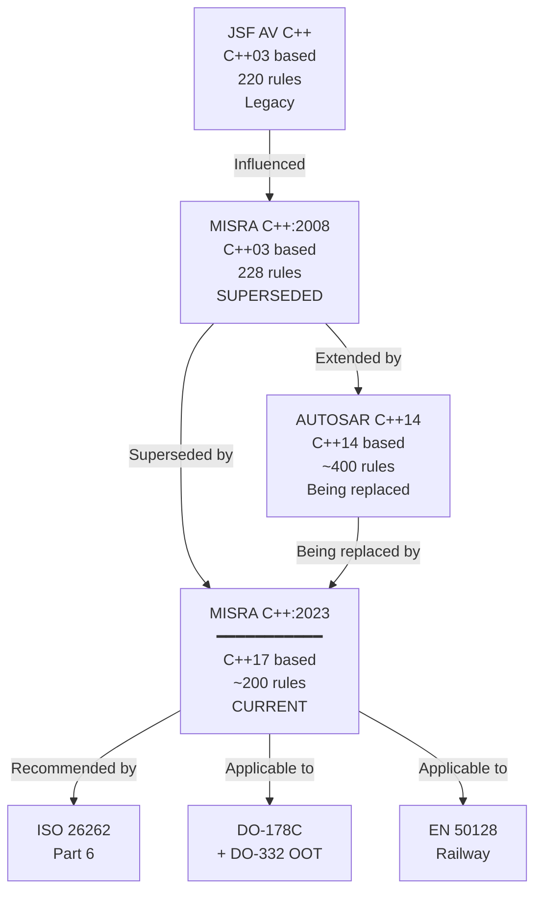
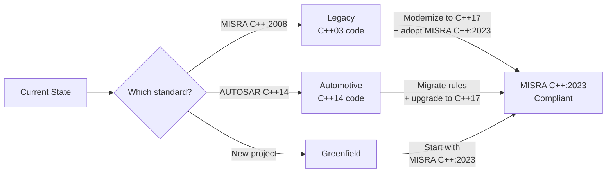
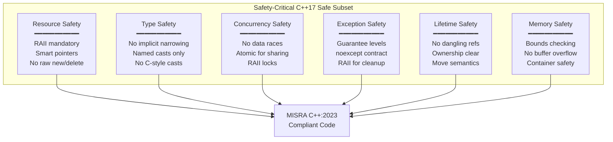
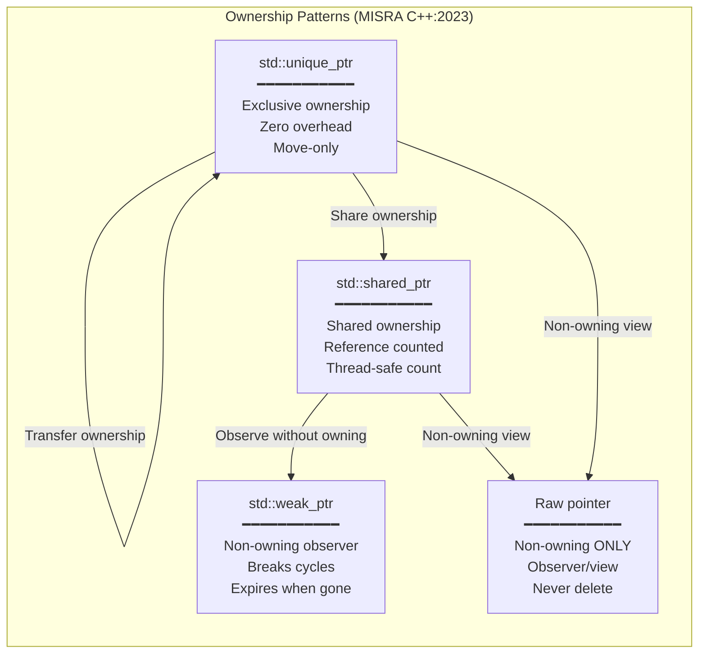

# MISRA C++:2023 — Guidelines for the Use of C++17 in Critical Systems

**Standard:** MISRA C++:2023 (Second Edition)  
**Full Title:** Guidelines for the Use of the C++ Language in Critical Systems  
**SDO:** MISRA Consortium (Motor Industry Software Reliability Association)  
**Base Language:** C++17 (ISO/IEC 14882:2017)  
**Audience:** C++ embedded developers, safety engineers, automotive/aerospace software architects, static analysis tool developers  
**Prerequisites:** C++ programming (C++14/C++17), MISRA C:2012 familiarity, embedded systems concepts, functional safety standards (ISO 26262, DO-178C)

---

## Chapter 1 — Historical Context & Origin Story

### 1.1 Timeline

| Year | Event | Significance |
|------|-------|-------------|
| 1998 | C++ standardization (C++98) | First ISO C++ standard; language too complex for safety analysis |
| 2004 | JSF AV C++ (Lockheed Martin) | Joint Strike Fighter coding rules; first major safety-critical C++ standard; 220 rules |
| 2008 | **MISRA C++:2008** published | First MISRA C++ standard; based on C++03; 228 rules (17 documents, 221 rules) |
| 2011 | C++11 published | Modern C++ revolution (move semantics, lambdas, auto, constexpr); MISRA C++:2008 unable to address |
| 2014 | C++14 published | Minor C++11 refinements; AUTOSAR C++14 based on this |
| 2016 | AUTOSAR C++14 guidelines | Automotive industry needed modern C++ rules; built on MISRA C++:2008 + C++14 features |
| 2017 | C++17 published | Structured bindings, if constexpr, std::optional, parallel algorithms |
| 2020 | C++20 published | Concepts, ranges, coroutines, modules (MISRA C++:2023 does NOT cover C++20) |
| 2023 | **MISRA C++:2023** published | Complete rewrite; C++17 support; new rule structure; replaces MISRA C++:2008 |
| 2024 | Tool support maturing | Polyspace, Helix QAC, LDRA adding MISRA C++:2023 rule checkers |

### 1.2 Why a Complete Rewrite?

MISRA C++:2008 was based on C++03 and became increasingly inadequate:

| Problem with MISRA C++:2008 | Resolution in MISRA C++:2023 |
|---|---|
| Based on C++03; couldn't address C++11/14/17 features | Full C++17 support; rules for modern features |
| Restrictive rules banned useful features (templates, exceptions partially) | Nuanced rules; allow modern C++ where safe |
| No guidance on move semantics, smart pointers, constexpr | Dedicated rules for these critical features |
| AUTOSAR C++14 created as workaround; market confusion | MISRA C++:2023 intended to replace both |
| Rule numbering inconsistent with MISRA C:2012 | New consistent numbering; aligned structure |
| No "Essential Type Model" equivalent | Type safety rules aligned with C++17 type system |

### 1.3 Relationship to Other Standards



---

## Chapter 2 — Standard Architecture & Structure

### 2.1 Rule Organization

MISRA C++:2023 organizes rules by C++ language feature areas:

| Section | Topic | Key Concerns |
|:-------:|-------|-------------|
| **Basic concepts** | Declarations, scoping, lifetime | Object lifetime management; dangling references |
| **Lexical conventions** | Literals, identifiers, keywords | Confusing constructs; implementation-defined behavior |
| **Expressions** | Operators, conversions, evaluation | Undefined behavior in expressions; implicit conversions |
| **Statements** | Control flow, iteration | Unreachable code; infinite loops; switch semantics |
| **Declarations** | Variables, functions, classes | Initialization; const-correctness; specifiers |
| **Classes** | Constructors, inheritance, virtual | Rule of five; slicing; virtual destructor |
| **Templates** | Template arguments, instantiation | SFINAE abuse; template complexity; compile-time safety |
| **Exception handling** | try/catch/throw | Exception safety; resource leaks; exception specifications |
| **Preprocessing** | Macros, includes | Macro hazards; include hygiene |
| **Library** | Standard library usage | Deprecated features; unsafe functions; container misuse |
| **Concurrency** | Threads, atomics, synchronization | Data races; lock ordering; memory model |

### 2.2 Rule Classification (Aligned with MISRA C:2012)

| Category | Definition | Deviation |
|:--------:|-----------|:---------:|
| **Mandatory** | Violation indicates code that is defective (undefined behavior) | **Never** |
| **Required** | Important safety/reliability rule; violation creates significant risk | Formal deviation record |
| **Advisory** | Recommended good practice; project may choose not to adopt | Document in GRP |

### 2.3 Key Philosophical Changes from 2008

| Aspect | MISRA C++:2008 Approach | MISRA C++:2023 Approach |
|:------:|---|---|
| **Exceptions** | Strongly discouraged (many rules restricting) | Permitted with proper exception safety guarantees |
| **Templates** | Restricted (complexity concerns) | Allowed; constexpr and concepts preferred for compile-time safety |
| **Dynamic memory** | Banned (inherited from MISRA C) | Smart pointers (unique_ptr, shared_ptr) allowed; raw new/delete banned |
| **auto keyword** | N/A (C++03) | Permitted where type is obvious; discouraged where it obscures |
| **Lambdas** | N/A (C++03) | Permitted; rules for capture, lifetime, complexity |
| **Move semantics** | N/A (C++03) | Required to be used correctly (Rule of Five; moved-from state) |
| **constexpr** | N/A (C++03) | Strongly encouraged; compile-time computation preferred over macros |
| **RAII** | Implicit | Explicitly mandated pattern for resource management |

---

## Chapter 3 — Technical Deep Dive: Key Rules

### 3.1 Resource Management Rules

| Rule Area | Guidance | Rationale |
|:---------:|----------|-----------|
| **RAII (Resource Acquisition Is Initialization)** | All resources must be managed by RAII objects; no naked `new`/`delete` | Prevents resource leaks; exception-safe; deterministic cleanup |
| **Smart pointers** | Use `std::unique_ptr` (exclusive ownership) or `std::shared_ptr` (shared ownership); never raw owning pointers | Compiler-enforced lifetime management |
| **Rule of Five** | If a class defines any of: destructor, copy constructor, copy assignment, move constructor, move assignment — it should define ALL five | Prevents resource management bugs; move/copy correctness |
| **Moved-from state** | Objects in moved-from state shall only be destroyed or re-assigned | Accessing moved-from object = unspecified behavior |

```cpp
// NON-COMPLIANT: Raw new/delete
void process() {
    Widget* w = new Widget();  // Violates: raw owning pointer
    w->doWork();               // If doWork() throws: LEAK
    delete w;                  // Manual delete: error-prone
}

// COMPLIANT: RAII with unique_ptr
void process() {
    auto w = std::make_unique<Widget>();  // RAII managed
    w->doWork();  // If throws: unique_ptr destructor cleans up automatically
}  // Automatic cleanup; exception-safe
```

### 3.2 Type Safety Rules

| Rule | Concern | Safe Pattern |
|:----:|---------|-------------|
| No implicit narrowing conversions | Data loss | Use `static_cast` with explicit intent; `gsl::narrow` for checked narrowing |
| No C-style casts | Unsafe; can bypass type system | Use `static_cast`, `dynamic_cast`, `const_cast`, `reinterpret_cast` |
| `reinterpret_cast` restricted | Type punning; alignment | Only for hardware register access (deviation); prefer `std::bit_cast` (C++20) |
| `const_cast` restricted | Removing const can cause UB if object was originally const | Avoid; if needed, ensure original object is non-const |
| `dynamic_cast` unrestricted | Safe (returns nullptr/throws) | Preferred for polymorphic type checks |

### 3.3 Initialization Rules

| Rule | Guidance | Example |
|:----:|---------|---------|
| All variables must be initialized at declaration | Prevents uninitialized reads | `int x = 0;` not `int x;` |
| Prefer `{}` initialization | Prevents narrowing | `int x{42};` not `int x = 42.5;` (narrowing detected) |
| Member initializer lists | Initialize all members | Constructor initializer list order = declaration order |
| `constexpr` for compile-time constants | Replaces `#define`; type-safe | `constexpr int MAX_SIZE{100};` |
| In-class member initializers | Default initialization | `int count_{0};` in class body |

### 3.4 Concurrency Rules

| Rule | Concern | Requirement |
|:----:|---------|-------------|
| No data races | Undefined behavior | All shared data protected by mutex OR atomic |
| Lock ordering | Deadlock prevention | Consistent global lock order; use `std::scoped_lock` for multiple locks |
| No `volatile` for synchronization | `volatile` ≠ thread-safe in C++ | Use `std::atomic` for inter-thread communication |
| Thread-safe initialization | Static local init race | `static` local variables are thread-safe in C++11+ (guaranteed) |
| Exception safety in critical sections | Lock not released | RAII lock guards (`std::lock_guard`, `std::unique_lock`) |

### 3.5 Exception Handling Rules

| Rule | Guidance | Rationale |
|:----:|---------|-----------|
| Functions shall specify exception guarantee | noexcept, strong, basic, or none | Clear contract for callers; enables optimization |
| `noexcept` for destructors, move operations | Calling these with potential exceptions is dangerous | Containers require noexcept move; destructors must not throw |
| Catch by const reference | `catch (const std::exception& e)` | Prevents slicing; efficient |
| Don't catch `...` without re-throwing | Swallowing unknown exceptions hides bugs | Log and re-throw; or terminate |
| Exception-neutral code | Library code should propagate, not swallow | RAII ensures cleanup during propagation |

---

## Chapter 4 — Implementation Guide

### 4.1 Migration from MISRA C++:2008 to MISRA C++:2023

| Phase | Activity | Duration (est.) |
|:-----:|----------|:---:|
| **1. Gap Analysis** | Compare current MISRA C++:2008 compliance with new MISRA C++:2023 rules; identify rules that changed, were added, or removed | 2-4 weeks |
| **2. Tool Update** | Update static analysis tool to support MISRA C++:2023 rule set; verify tool coverage; tool vendor may need time | 1-2 months |
| **3. GRP Update** | Create new GRP for MISRA C++:2023; map previous deviations; determine if still needed | 1-2 weeks |
| **4. Code Modernization** | Adopt modern C++ features now permitted (smart pointers replacing raw; constexpr replacing macros; RAII patterns) | 3-6 months |
| **5. New Rule Compliance** | Address new rules (concurrency, move semantics, template safety) that didn't exist in 2008 | 2-4 months |
| **6. Re-baseline** | Full analysis under new rule set; clean baseline; new deviation records | 2-4 weeks |

### 4.2 Modern C++ Patterns (MISRA C++:2023 Compliant)

| Pattern | Implementation | Benefit |
|---------|---------------|---------|
| **Smart pointer ownership** | `std::unique_ptr<Sensor> sensor_;` | No manual delete; exception-safe |
| **Factory functions** | `auto create() -> std::unique_ptr<Base>` | Clear ownership transfer |
| **constexpr computation** | `constexpr auto crc = computeCRC(data);` | Compile-time; no runtime cost; type-safe |
| **std::optional for nullable** | `std::optional<Reading> getReading()` | No null pointer; explicit "no value" |
| **std::variant for type union** | `std::variant<Error, Value> result;` | Type-safe union; no undefined behavior |
| **Structured bindings** | `auto [key, value] = map.find(x);` | Readable; avoids `.first`/`.second` |
| **if constexpr** | `if constexpr (sizeof(T) > 8) {...}` | Compile-time branching; no dead code |
| **RAII lock** | `std::scoped_lock lock{mutex_};` | Exception-safe; automatic unlock |
| **Range-based for** | `for (const auto& item : container)` | Bounds-safe; no off-by-one |

### 4.3 Banned Patterns in MISRA C++:2023

| Pattern | Rule | Reason | Alternative |
|---------|:----:|--------|------------|
| `new` / `delete` (raw) | Required | Leak-prone; exception-unsafe | `std::make_unique`, `std::make_shared` |
| C-style casts `(int)x` | Required | Hides intent; bypasses type system | Named casts (`static_cast`, etc.) |
| `goto` | Required | Unstructured control flow | Loops; functions; RAII cleanup |
| `#define` for constants | Required | No type safety; no scope | `constexpr` variables |
| `#define` for functions | Required | No type checking; side effects | `constexpr` functions; templates; inline |
| `reinterpret_cast` (general) | Required | Type punning undefined behavior | `std::bit_cast` (C++20); memcpy |
| `union` for type punning | Mandatory | Undefined behavior (reading inactive member) | `std::variant`; `std::bit_cast` |
| Implicit conversions (narrowing) | Required | Silent data loss | Explicit cast; `{}` init (compiler error) |
| Exceptions from destructors | Mandatory | `std::terminate` called | `noexcept` destructors |

---

## Chapter 5 — Certification & Safety Standard Integration

### 5.1 ISO 26262 Part 6 — Software Development

| ISO 26262 Requirement | MISRA C++:2023 Contribution |
|---|---|
| §6.4.4: Programming guidelines applied | MISRA C++:2023 as the coding guideline |
| §6.4.5: Design principles for SW unit design | RAII, single responsibility, const-correctness |
| §6.4.6: SW unit implementation (coding guidelines enforced) | Static analysis with MISRA C++:2023 rules |
| §6.4.7: SW unit verification (structural coverage) | MC/DC for ASIL D; MISRA compliance evidence |

### 5.2 DO-178C + DO-332 (Object-Oriented Technology)

| DO-178C/DO-332 Concern | MISRA C++:2023 Coverage |
|---|---|
| §OOT-1: Type consistency | Type safety rules; no implicit narrowing |
| §OOT-2: Memory management | RAII mandate; smart pointers; no manual memory |
| §OOT-3: Dynamic dispatch (virtual) | Rules for virtual destructor; override keyword |
| §OOT-4: Overloading/overriding | Explicit override; no hidden overloads |
| §OOT-5: Template instantiation | Rules for template safety; instantiation verification |
| §OOT-6: Exception handling | Exception safety guarantees; noexcept specification |

### 5.3 C++ in Safety-Critical: Historical Reluctance

| Concern | C++:2008 Era | C++:2023 Era (Resolution) |
|:-------:|---|---|
| **Code bloat (templates)** | Uncontrolled template instantiation; binary size explosion | `constexpr if`; explicit instantiation control; compiler optimizations |
| **Hidden execution (constructors)** | Implicit code execution hard to analyze for WCET | Constexpr constructors; trivial types; explicit control |
| **Exceptions (stack unwinding)** | Unpredictable WCET; complex control flow | `noexcept` annotations; exception-free subsets; static analysis |
| **Dynamic dispatch (vtable)** | Indirect call analysis difficult for WCET/coverage | CRTP (compile-time polymorphism); `final` keyword; devirtualization |
| **Standard library** | Complex; hard to certify; may use dynamic memory | Restricted subset; `constexpr` library functions; certified libraries |
| **Memory management** | `new`/`delete` → fragmentation, non-deterministic | Smart pointers; pool allocators; placement new |

---

## Chapter 6 — Ecosystem & Tooling

### 6.1 Tool Support Status (2024)

| Tool | MISRA C++:2023 Support | Status |
|:---:|---|:---:|
| **Polyspace** (MathWorks) | Full support planned; incremental rule additions | Active development |
| **Helix QAC** (Perforce) | Early support; rule packs being released | Active development |
| **LDRA TBvision** | Support announced; phased rollout | Active development |
| **Klocwork** (Perforce) | Planned; timeline TBD | Announced |
| **Clang-Tidy** | Community MISRA checks (partial; not certified) | Partial/community |
| **SonarQube** | MISRA C++ 2023 rules in progress | Planned |
| **Coverity** | Enterprise support planned | Announced |

### 6.2 Compiler Support Requirements

| C++17 Feature | GCC | Clang | MSVC | Embedded (ARM/GHS) |
|:---:|:---:|:---:|:---:|:---:|
| Structured bindings | 7+ | 4+ | 19.11+ | GHS 2021.1+ |
| `if constexpr` | 7+ | 3.9+ | 19.11+ | GHS 2021.1+ |
| `std::optional` | 7+ | 4+ | 19.10+ | GHS 2021.1+ |
| `std::variant` | 7+ | 4+ | 19.10+ | GHS 2021.1+ |
| Fold expressions | 6+ | 3.6+ | 19.12+ | GHS 2021.1+ |
| Class template arg deduction | 7+ | 5+ | 19.14+ | GHS 2022+ |
| Inline variables | 7+ | 3.9+ | 19.12+ | GHS 2021.1+ |

---

## Chapter 7 — Comparison: MISRA C++:2023 vs. AUTOSAR C++14

| Aspect | **MISRA C++:2023** | **AUTOSAR C++14 (R21-11)** |
|:------:|:---:|:---:|
| Base language | **C++17** | C++14 |
| Rule count | ~200 | ~400 |
| Organization | MISRA Consortium | AUTOSAR Consortium |
| Scope | All safety-critical domains | Automotive (AUTOSAR Adaptive Platform) |
| Exceptions | Allowed (with rules) | Allowed (restricted) |
| Templates | Allowed (with constraints) | Allowed (AUTOSAR-specific patterns) |
| Smart pointers | Mandated | Recommended |
| Dynamic memory | Via smart pointers only | Restricted (AUTOSAR allocators) |
| Rule severity | Mandatory/Required/Advisory | Required/Advisory only |
| Deviation process | MISRA Compliance:2020 | AUTOSAR-specific |
| Tool support | Growing (2024+) | Mature (Helix QAC, LDRA) |
| Future direction | **Primary standard going forward** | Will converge toward MISRA C++:2023 |
| Cost | Paid (~£300) | Free (AUTOSAR website) |
| Certification mapping | ISO 26262, DO-178C, EN 50128 | ISO 26262 primarily |

### 7.1 Migration Path



---

## Chapter 8 — Mermaid Architecture Diagrams

### 8.1 MISRA C++:2023 Rule Domains



### 8.2 Ownership Model



---

## Chapter 9 — Case Studies

### 9.1 Automotive ADAS: Migration from AUTOSAR C++14 to MISRA C++:2023

| Aspect | Detail |
|--------|--------|
| **Organization** | German automotive OEM; ADAS domain controller; perception pipeline |
| **Initial state** | 1.2M LOC C++14; AUTOSAR C++14 compliant; ISO 26262 ASIL B certified |
| **Motivation** | Needed C++17 features (std::optional for nullable sensor readings; if constexpr for compile-time platform adaptation; structured bindings for readability); AUTOSAR C++14 being phased out in favor of MISRA C++:2023 |
| **Migration approach** | Phase 1: Upgrade compiler to C++17 (GHS 2022.1); verify no regressions. Phase 2: Map AUTOSAR rules to MISRA C++:2023 equivalents; identify gaps. Phase 3: Adopt new MISRA C++:2023 rules incrementally (10 rules per sprint). Phase 4: Modernize code to use C++17 features (optional, variant, constexpr). Phase 5: Re-certify with updated compliance evidence |
| **Challenges** | Tool support: Helix QAC only had 60% MISRA C++:2023 coverage at project start → phased adoption as tool caught up; some AUTOSAR rules had no direct MISRA C++:2023 equivalent → project-specific supplementary rules; training: 15 developers needed C++17 upskilling |
| **Outcome** | Migration completed in 9 months; code reduced 8% (removal of boilerplate replaced by modern patterns); 12 fewer runtime defects in first 6 months (smart pointers eliminated memory bugs); assessor accepted MISRA C++:2023 for ISO 26262 re-certification |

### 9.2 Aerospace: DO-178C DAL B with MISRA C++:2023

| Aspect | Detail |
|--------|--------|
| **Organization** | Avionics system integrator; display management system (DO-178C DAL B) |
| **Challenge** | New project; C++ selected for productivity + modern patterns; DO-178C + DO-332 (OOT supplement) compliance required; certification authority (EASA) needed confidence in C++ safety |
| **Approach** | MISRA C++:2023 as coding standard; additional project rules: no exceptions (project decision for WCET determinism — allowed by MISRA C++:2023 but project chose noexcept everywhere); no dynamic memory (not even smart pointers — static allocation only for DAL B avionics); no RTTI (dynamic_cast banned; compile-time polymorphism via CRTP). Tool: Polyspace Bug Finder + MISRA C++:2023 checker; Code Prover for absence-of-runtime-error proof |
| **DO-332 compliance** | MISRA C++:2023 rules directly addressed DO-332 OOT objectives: type consistency (named casts), memory management (no dynamic = addressed), dynamic dispatch (CRTP = no vtable), templates (constexpr + explicit instantiation = analyzable) |
| **Certification result** | DER (Designated Engineering Representative) accepted approach; MISRA C++:2023 + project supplements met DO-178C §6.3 coding standards objective; certification achieved first attempt |

---

## Chapter 10 — Future Evolution

| Trend | Timeline | Impact |
|-------|----------|--------|
| **C++20/23 support** | 2025-2027 | MISRA C++:2023 Amendment for concepts, ranges, modules, coroutines; significant rule additions |
| **Convergence with AUTOSAR** | 2024-2026 | AUTOSAR expected to adopt MISRA C++:2023 as base; supplement with automotive-specific rules only |
| **Formal verification integration** | 2025-2027 | MISRA C++:2023 compliant code as prerequisite for formal analysis; abstract interpretation of C++17 |
| **Rust interop rules** | 2026-2028 | Rules for C++/Rust FFI; mixed-language safety-critical systems |
| **Compiler-enforced subset** | 2025-2027 | Custom compiler modes that enforce MISRA C++:2023 at compile time (beyond separate tool) |
| **AI-assisted compliance** | 2024-2026 | Automated refactoring to achieve compliance; intelligent deviation suggestions |
| **Safety profiles (ISO C++)** | 2025-2027 | ISO C++ committee "Safety Profile" proposals may align with MISRA C++:2023 philosophy |

---

## Chapter 11 — Interview Questions & Career Guide

### Tier 1: Entry-Level

**Q1:** What is the difference between MISRA C++:2008 and MISRA C++:2023? Why was a complete rewrite needed?

**A:** MISRA C++:2008 was based on C++03 (a 20+ year old language version) and couldn't address modern C++ features introduced in C++11/14/17. Key differences: (1) **Language version**: 2008 = C++03; 2023 = C++17. (2) **Modern features**: 2023 has rules for move semantics, smart pointers, constexpr, lambdas, optional, variant — none existed in 2008. (3) **Philosophy**: 2008 was highly restrictive (ban features); 2023 allows modern C++ where safe (smart pointers REPLACE raw pointers rather than banning all heap use). (4) **Memory management**: 2008 banned dynamic memory entirely; 2023 mandates RAII with smart pointers (safer approach). (5) **Exceptions**: 2008 strongly discouraged; 2023 allows with proper exception safety guarantees. A complete rewrite was needed because the gap between C++03 and C++17 was too large for amendments; the rule philosophy fundamentally changed from "ban modern features" to "use modern features safely."

### Tier 2: Mid-Level

**Q2:** Explain the MISRA C++:2023 approach to resource management. How does it differ from both MISRA C:2012 and traditional C++ coding?

**A:** MISRA C++:2023 mandates the **RAII pattern** (Resource Acquisition Is Initialization) as the primary resource management mechanism. This means: (1) All resources (memory, files, locks, hardware) must be wrapped in objects whose destructors release the resource. (2) `std::unique_ptr` for exclusive ownership (preferred); `std::shared_ptr` for shared ownership. (3) Raw `new`/`delete` are **banned** — always use `make_unique`/`make_shared`. (4) Raw pointers are permitted only as **non-owning observers** (viewing, not managing lifetime).

**Difference from MISRA C:2012**: C:2012 bans ALL dynamic memory (Rule 21.3) because C has no automatic cleanup — every malloc needs a corresponding free, and C has no destructors or exception handling to guarantee cleanup. MISRA C++:2023 allows heap allocation BECAUSE C++ has destructors + RAII that guarantee cleanup even during exceptions.

**Difference from traditional C++**: Traditional C++ allows raw new/delete, manual resource management, and provides no enforcement. MISRA C++:2023 mandates that the type system + RAII are used to PREVENT resource bugs at compile time rather than finding them at runtime.

### Tier 3: Senior

**Q3:** Your team is building a safety-critical C++17 system (ASIL D). The certification assessor is concerned about the following C++ features: templates, exceptions, and the standard library. How do you address each concern while remaining MISRA C++:2023 compliant?

**A:** **Templates**: Concern is code bloat (unpredictable binary size) and analysis difficulty (infinite instantiation). Mitigation: (1) Use `if constexpr` to eliminate dead branches at compile time (reduced instantiations). (2) Explicit template instantiation (`template class Foo<int>;`) to control which instantiations exist. (3) CRTP for compile-time polymorphism (no vtable overhead; fully analyzable). (4) Static analysis verifies all instantiations; coverage analysis covers instantiated code. (5) WCET analysis includes template-generated code. Present evidence: controlled instantiation list; binary size bounded; all paths analyzed.

**Exceptions**: Concern is unpredictable WCET (stack unwinding time varies); untested paths (exceptional control flow); complex analysis. Mitigation: Two legitimate approaches under MISRA C++:2023: **Option A** (allow exceptions): Mandate exception safety guarantees per function (`noexcept` where possible; basic or strong guarantee otherwise); RAII ensures cleanup; test exceptional paths (fault injection); WCET budget includes worst-case unwinding. **Option B** (ban exceptions): Project-specific restriction (MISRA C++:2023 allows this as a stricter subset); mark all functions `noexcept`; use `std::optional`/`std::expected` for error handling; no stack unwinding complexity. For ASIL D, Option B is often chosen for deterministic timing.

**Standard library**: Concern is complexity; potential dynamic memory use; not certified. Mitigation: (1) Use only the "freestanding" subset + specific approved headers. (2) Avoid containers that allocate (or use custom deterministic allocators). (3) `constexpr` library functions preferred (compile-time; zero runtime risk). (4) Create an "approved library functions" list (project supplement to MISRA C++:2023). (5) For certification: treat standard library as qualified software component per ISO 26262-8 §12 (software component qualification); or use a certified C++ standard library (e.g., Dinkumware safety-qualified).

---

## Chapter 12 — Cheat Sheet & Quick Reference

```
MISRA C++:2023 — QUICK REFERENCE

BASE LANGUAGE: C++17 (ISO/IEC 14882:2017)
REPLACES: MISRA C++:2008 (superseded); AUTOSAR C++14 (being replaced)

RULE CATEGORIES:
  Mandatory: Never deviate (undefined behavior)
  Required:  Formal deviation record needed
  Advisory:  Good practice; adopt in GRP

═══════════════════════════════════════════
MANDATED PATTERNS:
  ✓ RAII for ALL resources (no naked new/delete)
  ✓ Smart pointers (unique_ptr, shared_ptr)
  ✓ Named casts (static_cast, dynamic_cast)
  ✓ constexpr for compile-time computation
  ✓ {} initialization (prevents narrowing)
  ✓ Range-based for (bounds safety)
  ✓ const-correctness everywhere
  ✓ override keyword for virtual overrides
  ✓ noexcept for destructors + move ops

═══════════════════════════════════════════
BANNED PATTERNS:
  ✗ Raw new / delete
  ✗ C-style casts: (int)x
  ✗ #define for constants (use constexpr)
  ✗ #define for functions (use templates/constexpr)
  ✗ goto
  ✗ union for type punning
  ✗ reinterpret_cast (except hardware access)
  ✗ Implicit narrowing conversions
  ✗ Throwing from destructors

═══════════════════════════════════════════
MODERN C++ SAFE PATTERNS:
  std::optional<T>     → Nullable without pointers
  std::variant<A,B>    → Type-safe union
  std::unique_ptr<T>   → Exclusive ownership
  std::shared_ptr<T>   → Shared ownership
  constexpr            → Compile-time computation
  if constexpr         → Compile-time branching
  auto                 → Where type is obvious
  [[nodiscard]]        → Prevent ignoring returns
  structured bindings  → Clean destructuring

═══════════════════════════════════════════
OWNERSHIP MODEL:
  unique_ptr  → I own it exclusively (move to transfer)
  shared_ptr  → We share ownership (ref counted)
  weak_ptr    → I observe it (may expire)
  raw T*      → I look at it (NEVER own; NEVER delete)
  T&          → I borrow it (must outlive me)

═══════════════════════════════════════════
EXCEPTION SAFETY LEVELS:
  noexcept     → Guaranteed no throw (abort if violated)
  Strong       → Succeeds completely OR no effect (rollback)
  Basic        → No leaks; invariants maintained; state valid
  None         → No guarantees (FORBIDDEN in MISRA C++:2023)

═══════════════════════════════════════════
VS MISRA C++:2008:
  2008: C++03; ban modern features; 228 rules
  2023: C++17; USE modern features safely; ~200 rules
  Migration: Modernize code + map rules + update tools

VS AUTOSAR C++14:
  AUTOSAR: C++14; automotive; ~400 rules; free
  MISRA:   C++17; all domains; ~200 rules; paid
  Future:  AUTOSAR adopting MISRA C++:2023 as base
```

---

*End of Document — 02_MISRA_Cpp_2023.md*
