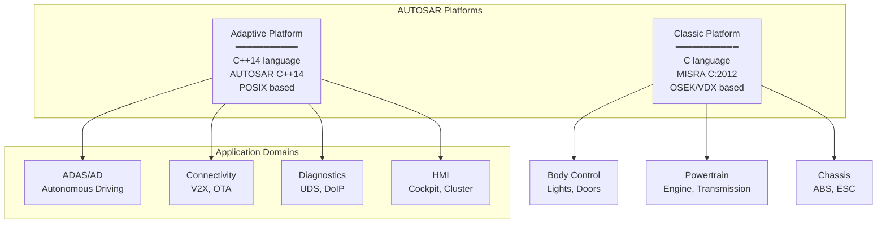
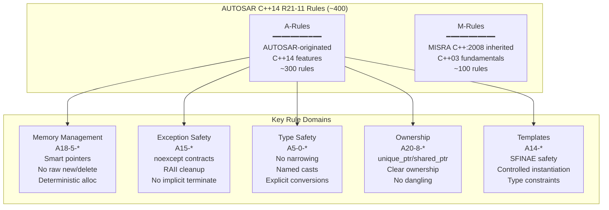
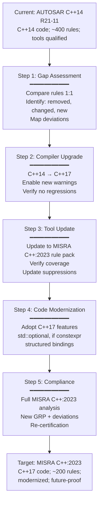

# AUTOSAR C++14 Coding Guidelines

**Standard:** AUTOSAR C++14 Coding Guidelines (Release R21-11, November 2021)  
**Full Title:** Guidelines for the Use of the C++14 Language in Critical and Safety-Related Systems  
**SDO:** AUTOSAR (AUTomotive Open System ARchitecture) Consortium  
**Base Language:** C++14 (ISO/IEC 14882:2014)  
**Audience:** Automotive embedded C++ developers, AUTOSAR Adaptive Platform developers, safety engineers, tool vendors  
**Prerequisites:** C++11/14 programming, AUTOSAR architecture (Classic & Adaptive), MISRA C++:2008 familiarity, ISO 26262

---

## Chapter 1 — Historical Context & Origin Story

### 1.1 Timeline

| Year | Event | Significance |
|------|-------|-------------|
| 2003 | AUTOSAR Consortium founded | Standardize automotive ECU software architecture (initially Classic Platform — C language) |
| 2008 | MISRA C++:2008 published | Only C++03; automotive needed more |
| 2011 | C++11 revolution | Move semantics, lambdas, smart pointers — transformative for embedded |
| 2014 | C++14 published | Refinement of C++11; good stability point |
| 2015 | AUTOSAR Adaptive Platform initiative | New platform for autonomous driving, connectivity; C++ based (not C) |
| 2016 | **AUTOSAR C++14 Guidelines v1.0** | First release; ~340 rules; C++14 for safety-critical automotive |
| 2017 | Release 17-03 | Major expansion; tooling support begins |
| 2018 | Release 18-10 | Refinement; better examples; industry adoption |
| 2019 | Release 19-11 | Additional rules; errata; ASIL mapping |
| 2021 | **Release R21-11** (final major) | ~400 rules; mature; widely adopted; last major release before MISRA C++:2023 convergence |
| 2023 | MISRA C++:2023 published | AUTOSAR C++14 expected to converge toward MISRA C++:2023 |
| 2024+ | Transition period | Projects migrating; both standards co-exist |

### 1.2 Why AUTOSAR Created Their Own C++ Standard

| Reason | Detail |
|--------|--------|
| **MISRA C++:2008 was outdated** | Based on C++03; couldn't address C++11/14 features critical for Adaptive Platform |
| **Adaptive Platform needs** | Service-oriented architecture; complex middleware; needs modern C++ (templates, smart pointers, move semantics) |
| **Automotive domain specifics** | Rules for automotive patterns (signal handling, diagnostic interfaces, software update) |
| **Timeline** | MISRA C++:2023 wasn't available until 2023; industry needed guidelines from 2016 |
| **Free availability** | AUTOSAR guidelines freely downloadable (vs. MISRA paid); enabled wider adoption |

### 1.3 Scope of Application



---

## Chapter 2 — Standard Architecture & Structure

### 2.1 Rule Organization

| Chapter | Topic | Rule Count (approx.) |
|:-------:|-------|:---:|
| A0 | Language-independent issues | ~20 |
| A1 | General | ~15 |
| A2 | Lexical conventions | ~20 |
| A3 | Basic concepts | ~15 |
| A4 | Standard conversions | ~10 |
| A5 | Expressions | ~40 |
| A6 | Statements | ~10 |
| A7 | Declarations | ~30 |
| A8 | Declarators | ~20 |
| A9 | Classes | ~10 |
| A10 | Derived classes | ~10 |
| A11 | Member access control | ~5 |
| A12 | Special member functions | ~15 |
| A13 | Overloading | ~10 |
| A14 | Templates | ~15 |
| A15 | Exception handling | ~20 |
| A16 | Preprocessing | ~15 |
| A17 | Library introduction | ~10 |
| A18 | Language support library | ~30 |
| A19-A27 | Various library topics | ~50 |
| M-rules | Inherited from MISRA C++:2008 | ~100 |

### 2.2 Rule Classification

| Category | Definition | Enforcement |
|:--------:|-----------|:-----------:|
| **Required** | Shall be followed; deviations need formal justification | Static analysis; code review |
| **Advisory** | Should be followed; good practice | Static analysis; may be waived by project |
| **Autosar-specific (A-rules)** | New rules created by AUTOSAR (not in MISRA C++:2008) | A-prefix |
| **MISRA-inherited (M-rules)** | Rules carried forward from MISRA C++:2008 | M-prefix |

### 2.3 Rule Naming Convention

```
Rule A<chapter>-<section>-<number>
  A = AUTOSAR-originated rule
  M = MISRA C++:2008 inherited rule

Examples:
  A12-8-1: Move and copy constructors shall move and respectively copy base classes
  M6-2-1:  Assignment operators shall not be used in sub-expressions
  A18-5-1: Functions malloc, calloc, realloc and free shall not be used
```

---

## Chapter 3 — Technical Deep Dive: Key Rules

### 3.1 Memory Management Rules

| Rule | Text | Category |
|:----:|------|:--------:|
| **A18-5-1** | Functions `malloc`, `calloc`, `realloc` and `free` shall not be used | Required |
| **A18-5-2** | Non-placement `new` or `delete` expressions shall not be used | Required |
| **A18-5-3** | The form of `delete` expression shall match the form of `new` expression used to allocate memory | Required |
| **A18-5-4** | If a project has a size-limited heap, then the allocating form of `operator new` shall not be used | Required |
| **A18-5-5** | Memory management functions shall ensure deterministic behavior | Required |
| **A18-5-8** | Objects that do not outlive a function shall have automatic storage duration | Required |
| **A18-5-9** | Custom implementations of dynamic memory allocation shall only be provided through `operator new` and `operator delete` | Required |
| **A18-5-10** | Placement `new` shall be used only with properly aligned storage of sufficient size | Required |
| **A18-5-11** | `operator new` and `operator delete` shall be defined together | Required |

**Key Approach**: AUTOSAR C++14 does NOT ban dynamic memory entirely (unlike MISRA C:2012). Instead:
- Raw `malloc`/`free` banned (C-style; no constructor/destructor)
- Raw `new`/`delete` banned (leak-prone; exception-unsafe)
- Smart pointers (`unique_ptr`, `shared_ptr`) recommended
- Custom allocators (pool allocators, deterministic allocators) strongly recommended for real-time

### 3.2 Exception Handling Rules

| Rule | Text | Rationale |
|:----:|------|-----------|
| **A15-0-1** | A function shall not exit with an exception if it is able to complete its task | Don't use exceptions for normal flow |
| **A15-1-1** | Only instances of types derived from `std::exception` shall be thrown | Catchable; has what() |
| **A15-1-2** | An exception object shall not be a pointer | Ownership confusion |
| **A15-2-1** | Constructors that are not `noexcept` shall not be invoked before program startup | Static initialization + exception = terminate |
| **A15-3-3** | Main function and task main functions shall use try/catch | Top-level handlers |
| **A15-4-2** | If a function is declared to be `noexcept`, `noexcept(true)`, or `noexcept(<true condition>)`, then it shall not exit with an exception | `std::terminate` called otherwise |
| **A15-5-1** | All user-provided class destructors, deallocation functions, move constructors, move assignment operators, and swap functions shall not exit with an exception | Prevents terminate during stack unwinding |
| **A15-5-3** | The `std::terminate()` function shall not be called implicitly | No unexpected termination |

### 3.3 Smart Pointer & Ownership Rules

| Rule | Text | Pattern |
|:----:|------|---------|
| **A20-8-1** | An already-owned pointer value shall not be stored in an unrelated smart pointer | Double-free prevention |
| **A20-8-2** | A `std::unique_ptr` shall be used to represent exclusive ownership | Clear ownership |
| **A20-8-3** | A `std::shared_ptr` shall be used to represent shared ownership | Reference counting |
| **A20-8-4** | A `std::unique_ptr` shall be used over `std::shared_ptr` if ownership sharing is not required | Efficiency; clearer semantics |
| **A20-8-5** | `std::make_unique` shall be used to construct objects owned by `std::unique_ptr` | Exception safety; single allocation |
| **A20-8-6** | `std::make_shared` shall be used to construct objects owned by `std::shared_ptr` | Single allocation; exception safety |

### 3.4 Concurrency & Threading Rules

| Rule | Text | Category |
|:----:|------|:--------:|
| **A18-0-1** | The C library functions shall not be used | Required (use C++ equivalents) |
| **A5-1-1** | Literal values shall not be used apart from type initialization unless they are constant expressions | Required |
| **A15-0-2** | At least the basic guarantee for exception safety shall be ensured for each function | Required |
| **A0-1-6** | There should be no unused type declarations | Advisory |

### 3.5 Template Rules

| Rule | Guidance | Rationale |
|:----:|---------|-----------|
| **A14-1-1** | A template should check if a specific template argument is suitable | SFINAE/concepts for safety |
| **A14-5-1** | A template constructor shall not participate in overload resolution for a single argument of the enclosing class type | Prevents template constructor hijacking copy/move |
| **A14-7-1** | A type used as a template argument shall provide all members required by the template | Compile-time safety |
| **A14-8-2** | Explicit specializations of function templates shall not be used | Overloading preferred (unexpected selection) |

---

## Chapter 4 — Implementation Guide

### 4.1 AUTOSAR Adaptive Platform Architecture Context

```mermaid
graph TB
    subgraph "AUTOSAR Adaptive Platform (C++14)"
        APP[Application Layer<br/>━━━━━━━━━━━<br/>ADAS algorithms<br/>User applications<br/>AUTOSAR C++14 compliant]
        
        ARA[ARA (AUTOSAR Runtime)<br/>━━━━━━━━━━━<br/>ara::com (communication)<br/>ara::exec (execution)<br/>ara::diag (diagnostics)<br/>ara::per (persistency)]
        
        OS[Operating System<br/>━━━━━━━━━━━<br/>POSIX PSE51<br/>Linux / QNX<br/>Real-time capable]
    end
    
    APP --> ARA
    ARA --> OS
```

### 4.2 Compliant Code Examples

```cpp
// AUTOSAR C++14 Compliant Pattern: Service Communication
// Using ara::com with RAII and smart pointers

#include <ara/com/types.h>
#include <memory>
#include <optional>

class RadarService final {
public:
    // A12-1-1: Constructors shall explicitly initialize all members
    explicit RadarService(std::uint16_t instanceId)
        : instanceId_{instanceId},
          proxy_{nullptr},
          lastReading_{std::nullopt} {}
    
    // A15-5-1: Destructor noexcept (implicit, but explicit is clearer)
    ~RadarService() noexcept = default;
    
    // A12-8-1: Rule of Five (or Rule of Zero)
    RadarService(const RadarService&) = delete;
    RadarService& operator=(const RadarService&) = delete;
    RadarService(RadarService&&) noexcept = default;
    RadarService& operator=(RadarService&&) noexcept = default;
    
    // A15-4-2: noexcept if cannot throw
    [[nodiscard]] std::optional<RadarReading> getLatestReading() const noexcept {
        return lastReading_;  // A20-8-4: optional instead of nullable pointer
    }
    
    // A0-1-1: Non-void function returns value on all paths
    [[nodiscard]] bool initialize() noexcept {
        // A18-5-5: Deterministic allocation
        proxy_ = std::make_unique<RadarProxy>(instanceId_);
        return (proxy_ != nullptr);
    }

private:
    std::uint16_t instanceId_;                     // A7-1-1: constexpr/const where possible
    std::unique_ptr<RadarProxy> proxy_;            // A20-8-4: unique_ptr for exclusive ownership
    std::optional<RadarReading> lastReading_;      // No raw pointer; explicit "no value"
};
```

### 4.3 Common Rule Violations and Fixes

| Violation | Rule | Non-Compliant | Compliant |
|-----------|:----:|:---:|:---:|
| Raw new | A18-5-2 | `Foo* p = new Foo();` | `auto p = std::make_unique<Foo>();` |
| C-style cast | A5-2-2 | `int x = (int)y;` | `auto x = static_cast<int>(y);` |
| Implicit conversion | A5-0-3 | `uint8_t a = uint16_var;` | `auto a = static_cast<uint8_t>(uint16_var);` |
| Missing noexcept | A15-4-2 | `~MyClass() {}` | `~MyClass() noexcept = default;` |
| Unused parameter | A0-1-4 | `void f(int x) {}` | `void f([[maybe_unused]] int x) {}` |
| Magic number | A5-1-1 | `if (speed > 120)` | `constexpr auto MAX_SPEED{120}; if (speed > MAX_SPEED)` |
| Missing override | A10-3-1 | `void foo() {}` | `void foo() override {}` |
| Macro constant | A16-0-1 | `#define MAX 100` | `constexpr auto MAX{100};` |

### 4.4 Project Configuration (Helix QAC Example)

```
# AUTOSAR C++14 R21-11 Configuration
# Helix QAC compliance module

-module autosar_cpp14_r21_11

# Enable all Required rules
-enable required

# Enable selected Advisory rules
-enable advisory A0-1-6  # Unused type declarations
-enable advisory A7-1-5  # auto usage
-enable advisory A8-4-7  # Parameter passing

# Deviation: Hardware register access
-suppress A5-2-4 file:hw_registers.cpp  # reinterpret_cast for MMIO
# Deviation record: DEV-001 (approved by safety manager 2024-01-15)

# Project-specific stricter rules
-error A18-5-2  # Treat as error (not just warning): no raw new
-error A15-5-1  # Treat as error: no throwing destructors
```

---

## Chapter 5 — ISO 26262 Integration

### 5.1 AUTOSAR C++14 and ISO 26262 Part 6

| ISO 26262 Part 6 Clause | AUTOSAR C++14 Contribution |
|---|---|
| **§6.4.3** Modeling and coding guidelines | AUTOSAR C++14 as the coding guideline |
| **§6.4.4** Use of language subsets | C++14 restricted by AUTOSAR rules = safe subset |
| **§6.4.5** Design principles | RAII, SOLID, const-correctness (AUTOSAR rules enforce) |
| **§6.4.6** Naming conventions | A3-1-* rules (identifier naming) |
| **§6.4.7** Types | Essential type usage; A5-0-* rules |
| **Table 1** Strong type checking | A5-0-3, A5-0-4 (no implicit narrowing) |
| **Table 1** Use of language subsets | All AUTOSAR C++14 rules collectively |
| **Table 1** Defensive implementation | A15-* (exception safety); A0-1-2 (assertions) |
| **Table 1** No dynamic objects | A18-5-* (controlled memory) |
| **Table 1** Limited use of pointers | A20-8-* (smart pointers only) |

### 5.2 ASIL-Dependent Rule Application

| ASIL Level | Minimum Compliance | Coverage Required |
|:----------:|---|:---:|
| **QM** | Advisory (recommended) | Statement |
| **ASIL A** | Required rules enforced | Decision (branch) |
| **ASIL B** | Required + selected advisory | Decision + Statement |
| **ASIL C** | Full Required + advisory | MC/DC (recommended) |
| **ASIL D** | Full Required + all advisory | **MC/DC** (mandatory) |

---

## Chapter 6 — Ecosystem & Tools

### 6.1 Tool Support

| Tool | AUTOSAR C++14 Support | Version | Notes |
|:---:|:---:|:---:|---|
| **Helix QAC** (Perforce) | Full R21-11 | 2023.x+ | Industry standard for AUTOSAR C++14 |
| **LDRA TBvision** | Full | 10.x+ | Integrated with coverage analysis |
| **Klocwork** (Perforce) | Full | 2023.x+ | Enterprise CI/CD integration |
| **Polyspace** (MathWorks) | Full | R2023a+ | Combined with formal verification |
| **Axivion** (Qt Group) | Full | 7.x+ | Architecture analysis + coding rules |
| **SonarQube** | Partial | Enterprise+ | CI/CD friendly; not complete coverage |
| **Clang-Tidy** | Partial (community) | 15+ | Free; not qualified; development only |
| **Parasoft C/C++test** | Full | 2023.x+ | Includes test generation |

### 6.2 AUTOSAR Adaptive Platform Libraries

| Library | Purpose | AUTOSAR C++14 Relevance |
|:-------:|---------|---|
| **ara::com** | Service-oriented communication (SOME/IP) | Template-heavy; rules for template safety critical |
| **ara::exec** | Execution management (process lifecycle) | Exception handling rules; noexcept requirements |
| **ara::diag** | Diagnostics (UDS over DoIP) | Error handling patterns; optional return types |
| **ara::per** | Persistency (file/key-value storage) | RAII for file handles; error reporting |
| **ara::crypto** | Cryptographic services | Const-correctness; secure memory handling |
| **ara::log** | Logging | No exceptions from logging; fire-and-forget |

---

## Chapter 7 — Comparison with Related Standards

| Aspect | **AUTOSAR C++14** | **MISRA C++:2008** | **MISRA C++:2023** | **JSF AV C++** |
|:------:|:---:|:---:|:---:|:---:|
| Year | 2016-2021 | 2008 | 2023 | 2004 |
| C++ version | C++14 | C++03 | **C++17** | C++03 |
| Rule count | ~400 | 228 | ~200 | 220 |
| Domain | Automotive | All safety | All safety | Aerospace |
| Dynamic memory | Smart pointers OK | Banned | Smart pointers OK | Banned |
| Exceptions | Allowed (restricted) | Discouraged | Allowed (guaranteed) | Banned |
| Templates | Allowed | Restricted | Allowed | Restricted |
| Free availability | **Yes** (free download) | Paid (~£300) | Paid (~£300) | Free (PDF) |
| Active development | Ending (→ MISRA C++:2023) | Superseded | **Active** | Archived |
| Tool support | Excellent | Good (legacy) | Growing | Limited |
| AUTOSAR platform | Mandatory | N/A | Future adoption | N/A |

---

## Chapter 8 — Mermaid Architecture Diagrams

### 8.1 AUTOSAR C++14 Rule Categories



### 8.2 Migration Path from AUTOSAR C++14



---

## Chapter 9 — Case Studies

### 9.1 ADAS Domain Controller: Full AUTOSAR C++14 Implementation

| Aspect | Detail |
|--------|--------|
| **Organization** | Tier-1 automotive supplier; ADAS domain controller (sensor fusion + path planning) |
| **Hardware** | Qualcomm SA8540P (Snapdragon Ride); 8-core ARM; QNX RTOS |
| **Software** | 800 KLOC C++14; AUTOSAR Adaptive Platform (ara::com, ara::exec); ISO 26262 ASIL B |
| **AUTOSAR C++14 adoption** | Full R21-11 Required rules + 80% Advisory rules; project GRP documented |
| **Tool chain** | Helix QAC (static analysis); VectorCAST (unit test + MC/DC); Lauterbach TRACE32 (debug) |
| **Key decisions** | (1) Smart pointers mandatory (unique_ptr for sensor data pipelines; shared_ptr for shared perception objects). (2) Exceptions allowed (ASIL B; not DAL A — acceptable for automotive). (3) Custom allocator for real-time path (pool allocator: deterministic; no fragmentation; O(1) alloc/dealloc). (4) No RTTI (dynamic_cast banned for performance; used CRTP + std::variant for polymorphism) |
| **Metrics** | Initial scan: 2,400 violations; 6-month remediation; final: 0 violations (23 approved deviations for hardware register access and legacy C library calls). Developer training: 3-day AUTOSAR C++14 course for all 20 developers. Defect rate post-adoption: 40% reduction in integration defects |
| **Certification** | ISO 26262 ASIL B achieved; TÜV SÜD assessor specifically reviewed AUTOSAR C++14 compliance evidence; approved |

### 9.2 Failure Case: Ignoring Memory Rules

| Aspect | Detail |
|--------|--------|
| **Incident** | ADAS camera module; intermittent crash after 4-6 hours of driving; sporadic nullptr dereference |
| **Root cause** | Violation of A20-8-1: raw pointer stored in two different `shared_ptr` instances (double ownership). After first `shared_ptr` deleted the object, second `shared_ptr` held dangling pointer. Use-after-free triggered by specific timing in camera frame processing |
| **Rule violated** | A20-8-1: "An already-owned pointer value shall not be stored in an unrelated smart pointer" — the raw pointer was passed to `shared_ptr` constructor twice instead of using `shared_from_this()` or copying the existing `shared_ptr` |
| **Detection** | Static analysis (Helix QAC) had flagged this pattern; finding was suppressed by developer ("false positive" — it was NOT). Review process failed to verify suppression justification |
| **Impact** | 3-week investigation; OTA recall for 50,000 vehicles; field failure during highway driving (ASIL B safety impact) |
| **Corrective action** | All suppressions reviewed; mandatory second-person approval for any AUTOSAR C++14 suppression; AddressSanitizer added to CI for debug builds; `shared_from_this` pattern mandated for all shared objects |

---

## Chapter 10 — Future Evolution

| Trend | Timeline | Impact |
|-------|----------|--------|
| **Convergence with MISRA C++:2023** | 2024-2026 | AUTOSAR expected to adopt MISRA C++:2023 as base; add automotive-specific supplement |
| **C++17 upgrade** | 2024-2025 | Projects migrating to C++17 compiler; AUTOSAR guidelines need update |
| **Rust in AUTOSAR** | 2025-2028 | AUTOSAR exploring Rust for safety-critical components; Rust coding guidelines emerging |
| **AUTOSAR Adaptive R24** | 2024 | Platform update; may reference MISRA C++:2023 |
| **Formal verification** | 2024-2027 | AUTOSAR rules as prerequisite for abstract interpretation (Polyspace Code Prover on Adaptive Platform code) |
| **SDV (Software-Defined Vehicle)** | 2024-2027 | More C++ in automotive; higher complexity; coding guidelines even more critical |
| **AI/ML integration** | 2025-2028 | Coding guidelines for C++ ML inference code (TensorRT, ONNX Runtime); new rules needed |

---

## Chapter 11 — Interview Questions & Career Guide

### Tier 1: Entry-Level

**Q1:** What is the difference between A-rules and M-rules in AUTOSAR C++14?

**A:** AUTOSAR C++14 has two categories of rule origin: **A-rules** (AUTOSAR-originated): New rules created by AUTOSAR specifically for C++14 features and automotive patterns. These cover modern C++ features like smart pointers (A20-8-*), move semantics (A12-8-*), constexpr (A5-1-1), and templates (A14-*) that didn't exist when MISRA C++:2008 was written. About 300 rules. **M-rules** (MISRA-inherited): Rules carried forward from MISRA C++:2008 that remain relevant and valid for C++14. These cover fundamental C++ safety (no goto, proper initialization, no implicit conversions, etc.). About 100 rules, with the "M" prefix preserved to indicate their origin. Together they form the complete AUTOSAR C++14 rule set of approximately 400 rules.

### Tier 2: Mid-Level

**Q2:** Explain the AUTOSAR C++14 approach to dynamic memory management. Why is it different from MISRA C:2012's complete ban?

**A:** AUTOSAR C++14 takes a nuanced approach: (1) **Raw C-style** (`malloc`/`free`): **Banned** (A18-5-1) — no destructor calls; type-unsafe. (2) **Raw C++ `new`/`delete`**: **Banned** (A18-5-2) — leak-prone; exception-unsafe; ownership unclear. (3) **Smart pointers**: **Allowed and recommended** — `std::unique_ptr` (exclusive; A20-8-2), `std::shared_ptr` (shared; A20-8-3); constructed via `make_unique`/`make_shared` (A20-8-5, A20-8-6). (4) **Custom allocators**: **Encouraged** for real-time (pool allocators with deterministic O(1) behavior; no fragmentation).

This differs from MISRA C:2012 (which bans ALL dynamic memory — Rule 21.3) because: (a) C has no destructors — every `malloc` needs explicit `free`; easy to leak; no automatic cleanup during error paths. (b) C has no exception handling — no stack unwinding; manual cleanup required. (c) C++ with RAII guarantees cleanup: `unique_ptr` destructor ALWAYS frees; even during exceptions. (d) The AUTOSAR Adaptive Platform (complex middleware; service-oriented) REQUIRES dynamic memory for practical implementation — but SAFELY managed through smart pointers and custom allocators.

### Tier 3: Senior

**Q3:** You are the software architect for an AUTOSAR Adaptive Platform project. The project currently uses AUTOSAR C++14 R21-11. Management wants to migrate to MISRA C++:2023. What is your migration strategy, what are the risks, and how do you maintain ISO 26262 certification continuity?

**A:** **Strategy**: Phase 1 — Impact Assessment (4 weeks): Rule-by-rule mapping between AUTOSAR C++14 R21-11 and MISRA C++:2023; identify: (a) rules that map directly (majority); (b) AUTOSAR rules with no MISRA equivalent (need project supplement); (c) new MISRA rules not in AUTOSAR (need code changes); (d) conflicting guidance (rare but exists). Phase 2 — Compiler upgrade C++14 → C++17 (2-4 weeks): Enable C++17 mode; fix compilation issues; run full regression; no MISRA compliance yet. Phase 3 — Tool migration (4-6 weeks): Update Helix QAC/Polyspace to MISRA C++:2023 rule pack; re-baseline; map existing suppressions/deviations. Phase 4 — Code modernization (3-6 months): Adopt C++17 features where beneficial (std::optional replacing error codes + out-parameters; if constexpr for platform abstraction; structured bindings for clarity). Phase 5 — Compliance (2-4 weeks): Full MISRA C++:2023 analysis; new GRP; new deviation records; compliance package.

**Risks**: (1) Tool support gap — MISRA C++:2023 tool coverage may not be 100% in 2024; mitigate by phased rule adoption as tool catches up. (2) AUTOSAR-specific rules lost — some A-rules (specific to ara:: libraries) have no MISRA equivalent; mitigate by creating project supplement. (3) Developer training — new rules + new C++17 features; budget 2-3 days training. (4) Regression — code changes during modernization could introduce bugs; mitigate by comprehensive test suite + MC/DC coverage preserved.

**Certification continuity** (ISO 26262): (1) Change management per ISO 26262 Part 8 clause 8 (configuration management); document the transition as planned change. (2) Impact analysis per Part 8 clause 9; show that the coding standard change improves safety (MISRA C++:2023 is more comprehensive). (3) Regression testing at system level; demonstrate no safety regression. (4) Update safety case; reference new coding standard. (5) Inform assessor early; get agreement on transition plan before starting. The certification itself does NOT expire due to tool/standard change, but the safety case evidence must remain valid.

---

## Chapter 12 — Cheat Sheet & Quick Reference

```
AUTOSAR C++14 R21-11 — QUICK REFERENCE

BASE LANGUAGE: C++14 (ISO 14882:2014)
SCOPE: AUTOSAR Adaptive Platform; all automotive C++14 projects
AVAILABILITY: FREE download from autosar.org
FUTURE: Converging toward MISRA C++:2023

═══════════════════════════════════════════
RULE NAMING:
  A<ch>-<sec>-<num>  = AUTOSAR-originated rule
  M<ch>-<sec>-<num>  = MISRA C++:2008 inherited rule
  Required / Advisory = severity classification

═══════════════════════════════════════════
KEY BANS (Required):
  ✗ malloc/calloc/realloc/free     (A18-5-1)
  ✗ Raw new / delete               (A18-5-2)
  ✗ C-style casts                  (A5-2-2)
  ✗ #define for constants           (A16-0-1)
  ✗ goto                           (M6-6-1)
  ✗ Implicit narrowing             (A5-0-3)
  ✗ Missing override               (A10-3-1)
  ✗ Throwing destructors           (A15-5-1)
  ✗ Unused code                    (A0-1-1 through A0-1-6)

═══════════════════════════════════════════
KEY MANDATES (Required):
  ✓ Smart pointers for ownership   (A20-8-*)
  ✓ make_unique / make_shared      (A20-8-5, A20-8-6)
  ✓ noexcept on destructors/moves  (A15-5-1, A15-4-2)
  ✓ constexpr for constants        (A5-1-1)
  ✓ Named casts only               (A5-2-2)
  ✓ All members initialized        (A12-1-1)
  ✓ override keyword               (A10-3-1)
  ✓ explicit constructors          (A12-1-4)
  ✓ const-correctness              (A7-1-1, A7-1-2)

═══════════════════════════════════════════
MEMORY MODEL:
  BANNED:   malloc/free, new/delete (raw)
  ALLOWED:  std::unique_ptr (exclusive ownership)
            std::shared_ptr (shared ownership)
            Pool allocators (deterministic; real-time)
            Placement new (with proper alignment)

═══════════════════════════════════════════
EXCEPTION MODEL:
  ALLOWED:  Exceptions for error handling
  REQUIRED: noexcept on destructors, moves, swap
  REQUIRED: Catch by const reference
  REQUIRED: Top-level try/catch in main/tasks
  BANNED:   Throwing from destructors
  BANNED:   catch(...) without re-throw

═══════════════════════════════════════════
VS MISRA C++:2023 (Migration target):
  AUTOSAR: C++14; ~400 rules; automotive only; free; ending
  MISRA:   C++17; ~200 rules; all domains; paid; active
  Action:  Plan migration; upgrade compiler; update tools

═══════════════════════════════════════════
TOOL SUPPORT:
  Helix QAC:  Full (industry standard)
  LDRA:       Full
  Polyspace:  Full (+ formal verification)
  Klocwork:   Full
  Clang-Tidy: Partial (dev-time only; not qualified)

═══════════════════════════════════════════
ISO 26262 MAPPING:
  QM:     Advisory (recommended)
  ASIL A: Required rules
  ASIL B: Required + selected advisory
  ASIL C: Full Required + advisory; MC/DC recommended
  ASIL D: Full rules + MC/DC mandatory
```

---

*End of Document — 03_AUTOSAR_Cpp14.md*
