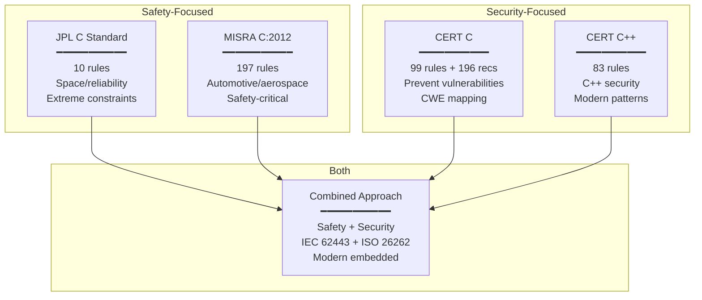
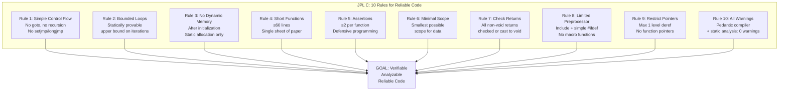
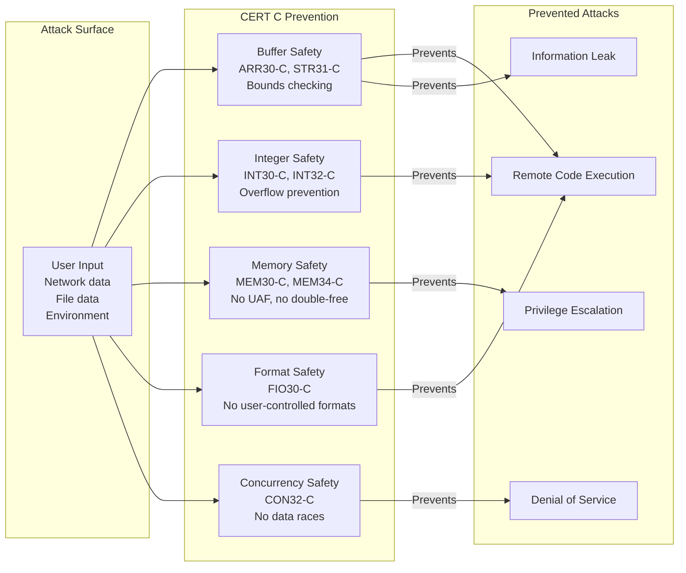

# JPL C Coding Standard & CERT C/C++ Secure Coding

**Standards:** JPL Institutional Coding Standard for the C Programming Language (2009); SEI CERT C Coding Standard (2016); SEI CERT C++ Coding Standard (2016)  
**SDOs:** NASA Jet Propulsion Laboratory (JPL/Caltech); Software Engineering Institute (SEI), Carnegie Mellon University  
**Audience:** Space systems engineers, security-focused embedded developers, safety-critical software engineers, firmware developers  
**Prerequisites:** C/C++ programming, embedded systems, understanding of undefined behavior, basic security concepts

---

## Chapter 1 — Historical Context & Origin Story

### 1.1 JPL C Coding Standard

| Year | Event | Significance |
|------|-------|-------------|
| 1997 | Mars Pathfinder priority inversion incident | Real-time bug on Mars; Sojourner rover; highlighted need for strict coding practices |
| 2000 | Mars Climate Orbiter loss | Metric/imperial unit confusion; software quality process failure; $193M loss |
| 2004 | Spirit/Opportunity rovers | Successful missions with rigorous coding standards |
| 2006 | Gerard Holzmann (Bell Labs → JPL) | Brought formal methods thinking; began codifying JPL coding rules |
| 2009 | **JPL Institutional Coding Standard for C** published | "The Power of 10" — 10 rules for reliable C code; adopted as JPL institutional standard |
| 2012 | Mars Science Laboratory (Curiosity) | 2.5 million lines of C; JPL standard applied; flawless autonomous landing |
| 2021 | Mars 2020 (Perseverance + Ingenuity) | Helicopter autonomous flight software; JPL C standard; Linux on Mars |

**Gerard Holzmann's Philosophy**: "If the rules seem extreme, consider the alternative: trying to debug a program running on a spacecraft millions of miles away from the nearest debugger."

### 1.2 CERT C/C++ Coding Standards

| Year | Event | Significance |
|------|-------|-------------|
| 1988 | CERT/CC founded (Morris Worm response) | Computer Emergency Response Team; Carnegie Mellon; security focus |
| 2006 | CERT Secure Coding Initiative | Began developing language-specific secure coding rules |
| 2008 | **CERT C Coding Standard** (first edition) | 89 rules; 132 recommendations; security-focused C coding |
| 2014 | **CERT C Coding Standard** (2nd edition, SEI) | 99 rules; 196 recommendations; CWE mapping |
| 2016 | **CERT C++ Coding Standard** | 83 rules; C++ security coding |
| 2016 | CERT C (2016 edition — ISO/IEC TS 17961) | Technical specification; international recognition |
| 2020 | Continuous wiki updates | Living document; community contributions; new vulnerability mappings |

### 1.3 Relationship Between Standards



---

## Chapter 2 — JPL C: The Power of 10

### 2.1 The 10 Rules

| # | Rule | Rationale |
|:-:|------|-----------|
| **1** | **Restrict all code to very simple control flow constructs** — no `goto`, `setjmp`/`longjmp`, direct or indirect recursion | Verifiable control flow; bounded stack; analyzable; no infinite loops possible if also bounded |
| **2** | **All loops must have a fixed upper-bound** — it must be trivially possible for a checking tool to prove statically that a preset upper-bound on the number of iterations cannot be exceeded | Guarantees termination; enables WCET analysis; prevents runaway loops |
| **3** | **Do not use dynamic memory allocation after initialization** — no `malloc`/`free` after system initialization phase | No fragmentation; no memory exhaustion; deterministic behavior at runtime |
| **4** | **No function should be longer than what can be printed on a single sheet of paper** — roughly 60 lines | Comprehensible; reviewable; testable; limits complexity |
| **5** | **The assertion density of the code should average a minimum of two assertions per function** — assertions check for anomalous conditions that should NEVER happen | Runtime verification; fail-fast; catch bugs early; defensive programming |
| **6** | **Data objects must be declared at the smallest possible level of scope** | Minimizes state; reduces coupling; easier to verify; less error-prone |
| **7** | **The return value of non-void functions must be checked by each calling function, OR explicitly cast to `(void)`** | No silent failures; every error condition handled or explicitly acknowledged as ignored |
| **8** | **The use of the preprocessor must be limited to file inclusion and simple conditional compilation** — no macros for functions, no token pasting, no variable-argument macros | Macros bypass type system; hide code; resist analysis; source of bugs |
| **9** | **The use of pointers should be restricted** — specifically, no more than one level of dereferencing (`*p` OK; `**p` forbidden); function pointers banned except for specific OS interfaces | Reduces complexity; prevents pointer confusion; analyzable memory access |
| **10** | **All code must be compiled from the first day of development with all compiler warnings enabled at the most pedantic level** — all warnings must be addressed before or during each code review; static analysis tool with zero warnings | Maximum tool assistance; catch issues early; no "noise" warnings |

### 2.2 JPL Rules — Detailed Analysis

| Rule | Static Checkability | WCET Impact | Formal Verification |
|:----:|:---:|:---:|:---:|
| 1 (No recursion/goto) | ✅ Fully (call graph analysis) | Enables bounded stack proof | Enables model checking |
| 2 (Bounded loops) | ✅ (with annotations) | Enables WCET calculation | Required for termination proof |
| 3 (No dynamic memory post-init) | ✅ (lifetime analysis) | Deterministic timing | Removes heap state from model |
| 4 (60-line functions) | ✅ (LOC counter) | Indirect (simpler = faster analysis) | Reduces proof complexity |
| 5 (2 assertions/function) | ✅ (density count) | Minimal runtime cost | Assertions become proof obligations |
| 6 (Minimal scope) | ✅ (scope analysis) | N/A | Reduces variable interference |
| 7 (Check return values) | ✅ (data flow) | Minimal | Verifies error path completeness |
| 8 (Minimal preprocessor) | ✅ (preprocessor analysis) | N/A | Analyzable source (what you see = what runs) |
| 9 (Pointer restriction) | ✅ (pointer analysis) | Enables alias analysis | Simplifies memory model |
| 10 (All warnings; static analysis) | ✅ (tool output) | N/A | Prerequisite for any verification |

### 2.3 JPL's Real-World Application

| Mission | Lines of Code | Language | JPL Rules Applied | Outcome |
|---------|:---:|:---:|:---:|:---:|
| Spirit/Opportunity | ~500K | C | Early version | 14+ years operation (designed for 90 days) |
| MSL Curiosity | 2.5M | C | Full standard | Flawless EDL; still operating (2012+) |
| Mars Helicopter (Ingenuity) | ~350K | C (+ Linux) | Full standard (flight SW) | 72 successful flights; first powered flight on another planet |
| Europa Clipper | TBD | C | Full standard | En route (launched 2024) |

---

## Chapter 3 — CERT C: Security-Focused Rules

### 3.1 CERT C Organization

| Section | Topic | Rule Count | Key Concerns |
|:-------:|-------|:---:|---|
| **PRE** | Preprocessor | 7 rules | Macro safety; include guards; conditional compilation |
| **DCL** | Declarations | 11 rules | Scope; type; initialization; const |
| **EXP** | Expressions | 16 rules | Evaluation order; side effects; type conversion |
| **INT** | Integers | 9 rules | Overflow; signedness; width; wrapping |
| **FLP** | Floating-point | 6 rules | Precision; comparison; domain errors |
| **ARR** | Arrays | 6 rules | Bounds; pointer arithmetic; flexible arrays |
| **STR** | Strings | 8 rules | Buffer overflow; null termination; encoding |
| **MEM** | Memory management | 6 rules | Allocation; deallocation; use-after-free; double-free |
| **FIO** | File I/O | 8 rules | Path traversal; race conditions; file operations |
| **ENV** | Environment | 5 rules | Environment variables; system(); signals |
| **SIG** | Signals | 5 rules | Signal handling; async-signal-safety |
| **ERR** | Error handling | 4 rules | Error checking; errno; longjmp |
| **CON** | Concurrency | 6 rules | Data races; locks; thread safety |
| **MSC** | Miscellaneous | 2 rules | Dead code; assertions |

### 3.2 Critical CERT C Rules (Most Commonly Violated)

| Rule | Title | CWE Mapping | Severity |
|:----:|-------|:---:|:---:|
| **ARR30-C** | Do not form or use out-of-bounds pointers or array subscripts | CWE-119 (Buffer overflow) | HIGH |
| **ARR38-C** | Guarantee that library functions do not form invalid pointers | CWE-119 | HIGH |
| **STR31-C** | Guarantee that storage for strings has sufficient space for data and null terminator | CWE-120 (Buffer copy without size check) | HIGH |
| **INT30-C** | Ensure that unsigned integer operations do not wrap | CWE-190 (Integer overflow) | HIGH |
| **INT32-C** | Ensure that operations on signed integers do not result in overflow | CWE-190 | HIGH |
| **MEM30-C** | Do not access freed memory (use-after-free) | CWE-416 | HIGH |
| **MEM34-C** | Only free memory allocated dynamically | CWE-761 (Free pointer not at start) | HIGH |
| **MEM35-C** | Allocate sufficient memory for an object | CWE-131 (Incorrect buffer size) | HIGH |
| **EXP33-C** | Do not read uninitialized memory | CWE-457 | HIGH |
| **EXP34-C** | Do not dereference null pointers | CWE-476 | HIGH |
| **FIO30-C** | Exclude user input from format strings | CWE-134 (Format string) | HIGH |
| **CON32-C** | Prevent data races when accessing bit-fields from multiple threads | CWE-362 | MEDIUM |

### 3.3 CERT C Rule Template

Each CERT C rule contains:

| Section | Content |
|:-------:|---------|
| **Rule** | Precise statement of the rule |
| **Description** | Explanation of the vulnerability |
| **Noncompliant Code Example** | Code that violates the rule (with explanation) |
| **Compliant Solution** | Corrected code |
| **Risk Assessment** | Severity × Likelihood × Remediation Cost → Priority |
| **Related Vulnerabilities** | CVEs that could have been prevented |
| **Related Guidelines** | Mappings to CWE, MISRA C, ISO/IEC TS 17961 |
| **Bibliography** | References |

### 3.4 CERT C Risk Assessment Matrix

$$\text{Priority} = \text{Severity} \times \text{Likelihood} \times \text{Remediation Cost}$$

| Factor | Value 1 (Low) | Value 2 (Medium) | Value 3 (High) |
|:------:|:---:|:---:|:---:|
| **Severity** | DoS/data loss | System compromise | Arbitrary code execution |
| **Likelihood** | Unlikely | Probable | Likely |
| **Remediation Cost** | High (major redesign) | Medium (moderate effort) | Low (simple fix) |

Priority Levels:

| Priority Range | Level | Action |
|:-:|:---:|---|
| 1-4 | L3 (Low) | Fix in next major release |
| 6-9 | L2 (Medium) | Fix in next minor release |
| 12-27 | L1 (High) | Fix immediately; security patch |

---

## Chapter 4 — Implementation Guide

### 4.1 Implementing JPL C Standard

| Phase | Activity | Tool/Method |
|:-----:|----------|------------|
| 1 | Enforce Rule 10 first (all warnings; static analysis) | `-Wall -Wextra -Werror -pedantic` (GCC); Polyspace/QA-C |
| 2 | Add assertion framework | Custom `ASSERT()` macro; abort on violation; log location |
| 3 | Eliminate recursion (Rule 1) | Call graph analysis (LDRA, cflow); refactor to iteration |
| 4 | Bound all loops (Rule 2) | Loop bound annotations; tool verification |
| 5 | Remove post-init dynamic memory (Rule 3) | Static allocation; memory pools initialized at startup |
| 6 | Limit function length (Rule 4) | Code metrics tool; refactor large functions |
| 7 | Add assertions (Rule 5) | 2+ assertions per function; pre/post conditions |
| 8 | Minimize scope (Rule 6) | Block-scope variables; remove globals |
| 9 | Check all return values (Rule 7) | Static analysis; compiler warnings (`-Wunused-result`) |
| 10 | Restrict preprocessor (Rule 8) | Macro audit; replace with `static inline` and `enum` |
| 11 | Restrict pointers (Rule 9) | Pointer depth analysis; eliminate `**p` |

### 4.2 Implementing CERT C

| Priority | Rules to Implement First | Rationale |
|:--------:|---|---|
| **Immediate** | ARR30-C, STR31-C, MEM30-C, EXP34-C | Buffer overflows + use-after-free = most exploited vulnerabilities |
| **High** | INT30-C, INT32-C, FIO30-C | Integer overflow + format string = critical attack vectors |
| **Medium** | CON32-C, ERR33-C, EXP33-C | Concurrency + error handling + uninitialized reads |
| **Standard** | All remaining rules | Complete coverage for secure code |

### 4.3 Combined JPL + CERT C + MISRA C Approach

| Rule Domain | JPL C | MISRA C:2012 | CERT C | Combined Policy |
|:-----------:|:-----:|:---:|:---:|---|
| Recursion | **Banned** (#1) | **Banned** (17.2) | Not addressed | **BANNED** |
| Dynamic memory | **Banned post-init** (#3) | **Banned** (21.3) | Rules for safe use (MEM*) | **Banned** (or static pools) |
| Goto | **Banned** (#1) | Restricted (15.1) | Not addressed | **BANNED** |
| Loop bounds | **Required** (#2) | Not explicit | Not addressed | **REQUIRED** (JPL-style) |
| Assertions | **2/function min** (#5) | Not required | MSC11-C (test assertions) | **REQUIRED** (2/function) |
| Return value check | **Required** (#7) | Directive 4.7 | ERR33-C | **REQUIRED** |
| Buffer overflow | Implied (#9 pointers) | Rules 18.* | ARR30-C, STR31-C | **Multiple layers** |
| Integer overflow | Not explicit | Rule 12.2 (shift) | INT30-C, INT32-C | **CERT rules** |
| Preprocessor | **Restricted** (#8) | Rules 20.* | PRE30-C through PRE32-C | **Minimal macros** |

---

## Chapter 5 — CWE Mapping & Vulnerability Prevention

### 5.1 CERT C → CWE → CVE Chain

| CERT Rule Violated | CWE | Example CVE | Impact |
|:---:|:---:|:---:|---|
| ARR30-C (out-of-bounds) | CWE-119 | CVE-2014-0160 (Heartbleed) | Buffer over-read in OpenSSL; leaked private keys |
| STR31-C (buffer overflow) | CWE-120 | CVE-2017-9805 (Struts) | Stack buffer overflow; RCE |
| INT32-C (signed overflow) | CWE-190 | CVE-2014-1266 (Apple goto fail) | Integer overflow in SSL verification |
| MEM30-C (use-after-free) | CWE-416 | CVE-2021-4034 (PwnKit) | Polkit use-after-free; local privilege escalation |
| EXP34-C (null deref) | CWE-476 | Multiple kernel CVEs | Denial of service; potential code execution |
| FIO30-C (format string) | CWE-134 | CVE-2012-0809 (sudo) | Format string vulnerability in sudo |

### 5.2 Top 10 CWEs Prevented by Combined Standards

| CWE | Name | Prevention |
|:---:|------|---|
| CWE-119 | Buffer overflow | CERT ARR30-C; MISRA 18.1; JPL Rule 9 |
| CWE-120 | Buffer copy without size check | CERT STR31-C; MISRA 21.* (banned functions) |
| CWE-190 | Integer overflow | CERT INT30-C/INT32-C; MISRA 12.2, 10.* |
| CWE-416 | Use-after-free | CERT MEM30-C; MISRA 21.3 (no dynamic memory) |
| CWE-476 | NULL pointer dereference | CERT EXP34-C; MISRA 1.3 (no UB) |
| CWE-362 | Race condition | CERT CON32-C; (not well covered by MISRA C) |
| CWE-457 | Uninitialized variable | CERT EXP33-C; MISRA 9.1 (Mandatory) |
| CWE-134 | Format string | CERT FIO30-C; MISRA 21.6 (no stdio) |
| CWE-415 | Double-free | CERT MEM34-C; MISRA 21.3 (no dynamic memory) |
| CWE-787 | Out-of-bounds write | CERT ARR30-C; MISRA 18.1; JPL Rule 9 |

---

## Chapter 6 — Tool Ecosystem

### 6.1 CERT C Checking Tools

| Tool | CERT C Coverage | CWE Mapping | Integration |
|:---:|:---:|:---:|---|
| **Klocwork** (Perforce) | 85%+ rules | Full CWE | CI/CD; IDE plugins; enterprise |
| **CodeSonar** (GrammaTech) | 80%+ rules | Full CWE | Deep analysis; binary analysis |
| **Coverity** (Synopsys) | 75%+ rules | Full CWE | Enterprise SAST; CI/CD |
| **Polyspace** (MathWorks) | CERT C checker module | CWE mapping | Formal verification complement |
| **Helix QAC** (Perforce) | CERT C module | CWE mapping | MISRA + CERT combined |
| **Fortify** (Micro Focus) | Security focus | Full CWE | AppSec pipeline |
| **cppcheck** | Partial (~30%) | Limited | Free; developer desktop |
| **Clang Static Analyzer** | Partial | Limited | Free; LLVM ecosystem |
| **PVS-Studio** | Good coverage | CWE mapping | Cross-platform; affordable |

### 6.2 JPL C Checking

| Rule | Automated Check Method |
|:----:|---|
| Rule 1 (no recursion) | Call graph analysis (LDRA, Polyspace, custom script) |
| Rule 2 (bounded loops) | Static analysis with loop bound annotations (Astrée, Polyspace) |
| Rule 3 (no post-init malloc) | Lifetime analysis; link-time check for malloc calls outside init |
| Rule 4 (function length) | Metrics tool (LDRA, SonarQube, custom) |
| Rule 5 (assertion density) | Custom metric (assertions per function count) |
| Rule 6 (minimal scope) | Static analysis (QA-C, LDRA) |
| Rule 7 (check return values) | `-Wunused-result`; CERT ERR33-C checkers |
| Rule 8 (limited preprocessor) | Preprocessor analysis (LDRA, custom lint) |
| Rule 9 (pointer restriction) | Pointer depth analysis (custom tool; LDRA) |
| Rule 10 (all warnings) | Compiler flags; CI gate on zero warnings |

---

## Chapter 7 — Comparison

### 7.1 JPL C vs. MISRA C vs. CERT C

| Aspect | **JPL C** | **MISRA C:2012** | **CERT C** |
|:------:|:---:|:---:|:---:|
| **Rule count** | 10 | 197 | 99 rules + 196 recommendations |
| **Focus** | Reliability/verifiability | Safety | Security |
| **Domain** | Space; NASA | Automotive; aerospace; medical | All (security emphasis) |
| **Philosophy** | Extreme simplicity; provability | Comprehensive safety; language safety | Vulnerability prevention |
| **Dynamic memory** | Banned (post-init) | Banned (entirely) | Allowed (with safety rules) |
| **Recursion** | Banned | Banned | Not addressed |
| **Assertions** | 2/function minimum | Not required | Recommended (MSC11-C) |
| **Loop bounds** | Required | Not explicit | Not addressed |
| **Preprocessor** | Severely restricted | Restricted (20.*) | Security restrictions (PRE*) |
| **Cost** | Free (10-page PDF) | Paid (~£300) | Free (online wiki) |
| **Tooling** | Custom/general tools | Excellent (all vendors) | Good (security tools) |
| **Decidability** | All rules tool-checkable | Marked per rule | Varies |
| **Certification** | NASA NPR 7150 | ISO 26262, DO-178C | IEC 62443; CWE compliance |
| **Format** | 10 rules (brief PDF) | 460+ page document | Online wiki; hundreds of pages |

### 7.2 When to Use Which

| Scenario | Primary Standard | Supplementary |
|----------|:---:|:---:|
| Space/NASA mission | **JPL C** | + MISRA C for comprehensive coverage |
| Automotive (ASIL D) | **MISRA C:2012** | + CERT C for security (connected vehicles) |
| Medical device (Class III) | **MISRA C:2012** | + CERT C for cybersecurity (IEC 62443) |
| IoT security device | **CERT C** | + MISRA C for reliability |
| Military/defense | **JPL C + MISRA C** | + CERT C (complete coverage) |
| Connected automotive | **MISRA C:2012** | + CERT C (mandatory: UN R155 cybersecurity) |
| Critical infrastructure | **CERT C** | + MISRA C for reliability |

---

## Chapter 8 — Mermaid Architecture Diagrams

### 8.1 JPL "Power of 10" Visualization



### 8.2 CERT C Vulnerability Prevention Chain



---

## Chapter 9 — Case Studies

### 9.1 Mars Curiosity Rover: JPL C in Practice

| Aspect | Detail |
|--------|--------|
| **Mission** | Mars Science Laboratory (Curiosity); launched 2011; landed 2012; still operating 2024 |
| **Software** | 2.5 million lines of C; VxWorks RTOS (Wind River); RAD750 processor (200 MHz; radiation-hardened PowerPC) |
| **JPL C application** | All 10 rules enforced; custom static analysis tooling; formal review process |
| **Rule 2 example** | All loops have explicit upper bounds; timeout on every I/O wait; watchdog timer on every critical loop |
| **Rule 3 example** | All memory allocated during initialization (first 30 seconds of boot); after that, zero dynamic allocation; memory budget per subsystem statically assigned |
| **Rule 5 example** | Every function has pre-condition assertions (parameter validation) + post-condition assertions (result validation); assertion violations trigger safe mode (spacecraft points antenna at Earth; waits for commands) |
| **Outcome** | Zero software-caused mission failures; autonomous EDL ("7 minutes of terror") worked first time; 12+ years continuous operation; software updates uploaded from Earth successfully |
| **Lesson** | "Simple code that you can prove correct beats clever code that you hope is correct." — JPL software team |

### 9.2 Heartbleed (CVE-2014-0160): CERT C Violation

| Aspect | Detail |
|--------|--------|
| **Vulnerability** | OpenSSL TLS heartbeat extension; buffer over-read; leaked up to 64KB of server memory per request |
| **CERT C rule violated** | **ARR30-C**: "Do not form or use out-of-bounds pointers or array subscripts" — the code read `payload_length` from the TLS message (attacker-controlled) and used it as memcpy length WITHOUT validating against actual received data length |
| **Root cause code** | `memcpy(bp, pl, payload);` where `payload` was attacker-supplied length; no bounds check against actual buffer size |
| **Compliant fix** | `if (payload + 1 + 2 + payload > s->s3->rrec.length) return 0;` — validate before use |
| **Impact** | Affected ~17% of all HTTPS servers; private keys, passwords, session tokens leaked; affected for 2+ years before discovery |
| **Prevention** | If OpenSSL followed CERT C ARR30-C (validate all buffer access against actual bounds), Heartbleed would have been prevented at the source code level |

---

## Chapter 10 — Future Evolution

| Trend | Timeline | Impact |
|-------|----------|--------|
| **CERT C + MISRA C convergence** | 2024-2026 | MISRA Addendum 4 maps to CERT C; combined safety+security |
| **Rust as alternative** | 2024-2028 | Rust's memory safety eliminates entire classes of CERT C rules; JPL evaluating Rust for future missions |
| **IEC 62443 + CERT C** | 2024-2026 | Industrial cybersecurity standard requiring secure coding; CERT C as recommended standard |
| **AI-assisted vulnerability detection** | 2024-2026 | ML models finding CERT C violations beyond pattern matching |
| **CERT C for embedded** | 2024-2025 | Growing adoption in automotive (UN R155 cybersecurity) and medical (FDA cybersecurity guidance) |
| **JPL standard update** | 2025-2027 | Potential update for modern C (C17/C23); formal methods integration |
| **Supply chain security** | 2024-2026 | CERT C compliance as part of SBOM; supply chain attestation |

---

## Chapter 11 — Interview Questions & Career Guide

### Tier 1: Entry-Level

**Q1:** List the JPL "Power of 10" rules and explain why Rule 2 (bounded loops) is critical for space software.

**A:** The 10 rules: (1) Simple control flow (no goto/recursion); (2) Bounded loops; (3) No dynamic memory after init; (4) Short functions (≤60 lines); (5) ≥2 assertions per function; (6) Minimal scope; (7) Check all return values; (8) Limited preprocessor; (9) Restrict pointers; (10) All warnings enabled + static analysis.

**Rule 2 is critical because**: In space software, you cannot attach a debugger to a spacecraft millions of miles away. If a loop runs forever (infinite loop), the system hangs and the mission may be lost. Bounded loops guarantee: (a) **Termination** — every loop WILL exit; the system cannot hang. (b) **WCET calculability** — if every loop has a known maximum iteration count, you can calculate the worst-case execution time of every function, proving the system meets its real-time deadlines. (c) **Watchdog compatibility** — if you know the maximum time any code path takes, you can set a watchdog timer appropriately; an unbounded loop would trigger the watchdog and reset. (d) **Static analysis** — tools like AbsInt aiT can prove timing properties only if loops are bounded. Example: `for (int i = 0; i < MAX_RETRIES; i++) { ... }` where `MAX_RETRIES` is a compile-time constant (e.g., 5). The tool can prove this executes at most 5 times.

### Tier 2: Mid-Level

**Q2:** Explain how CERT C rule INT32-C ("Ensure that operations on signed integers do not result in overflow") would be implemented in practice. What are the checking strategies?

**A:** Signed integer overflow is **undefined behavior** in C (unlike unsigned, which wraps). This means the compiler can assume it never happens and optimize accordingly — leading to unexpected behavior. Implementation strategies:

**Strategy 1 — Pre-condition testing** (check BEFORE operation):
```c
#include <limits.h>
// Before addition:
if (((b > 0) && (a > (INT_MAX - b))) ||
    ((b < 0) && (a < (INT_MIN - b)))) {
    // OVERFLOW would occur — handle error
} else {
    int result = a + b;  // Safe
}
```

**Strategy 2 — Use wider type** (if available):
```c
int32_t a, b;
int64_t result = (int64_t)a + (int64_t)b;
if (result > INT32_MAX || result < INT32_MIN) {
    // Overflow — handle error
}
```

**Strategy 3 — Compiler built-ins** (GCC/Clang):
```c
int result;
if (__builtin_add_overflow(a, b, &result)) {
    // Overflow occurred
}
```

**Strategy 4 — Safe integer library** (SafeInt, safe_iop):
```c
int result;
if (!safe_add(&result, a, b)) {
    // Overflow
}
```

In practice, for safety-critical embedded systems, Strategy 1 (pre-condition) is most common because it has no dependencies and is fully portable. For security-focused code, Strategy 3 (compiler built-ins) is most efficient. Tools like Klocwork and Polyspace can detect potential overflow paths statically.

### Tier 3: Senior

**Q3:** Design a coding standard strategy for a safety-critical connected vehicle ECU that must satisfy both ISO 26262 ASIL C (safety) and UN R155 (cybersecurity). How do you combine MISRA C, CERT C, and JPL C principles?

**A:** **Architecture**: The ECU has safety-critical functions (ASIL C: braking assistance) AND connectivity (Bluetooth, OTA updates — attack surface). The coding standard must prevent both safety failures AND security breaches.

**Combined standard approach**:

**Layer 1 — Foundation (all code)**: MISRA C:2012 (full Required + Mandatory). This provides the safety baseline: no undefined behavior, type safety, controlled pointers, no dynamic memory. This satisfies ISO 26262 Part 6 coding guidelines requirement.

**Layer 2 — Security overlay (connectivity code)**: CERT C (full). Applied to all code handling external input (Bluetooth stack, OTA parser, diagnostic interfaces, CAN message handlers). Focus on: ARR30-C (buffer bounds), INT32-C (integer overflow), STR31-C (string safety), MEM30-C (use-after-free). This satisfies UN R155 secure coding requirement and maps to ISO/SAE 21434 (automotive cybersecurity engineering).

**Layer 3 — High-reliability (ASIL C safety functions)**: JPL C Rules 1-5 (critical subset): Rule 1 (no recursion — bounded stack), Rule 2 (bounded loops — WCET), Rule 3 (no dynamic memory — deterministic), Rule 5 (assertions — runtime verification). Applied to braking-related functions only (highest criticality).

**Implementation**: (1) Static analysis tool (Polyspace or LDRA) configured with combined rule set: MISRA C:2012 + CERT C + custom JPL-inspired rules. (2) Code partitioned: safety-critical (ASIL C) uses all three layers; connectivity code uses Layer 1+2; non-critical (comfort) uses Layer 1 only. (3) Freedom from interference: memory protection (MPU) between partitions ensures security breach in connectivity code cannot affect safety functions. (4) Certification evidence: single compliance report showing MISRA + CERT + JPL coverage; mapped to ISO 26262 and UN R155 requirements.

**Practical challenge**: Rule conflicts are rare (the standards are complementary), but resource constraints exist. The main challenge is developer training (three standards) and tool configuration (combined rule set). Solution: create project-specific "unified coding standard" document that merges the three into a single coherent rule set organized by topic.

---

## Chapter 12 — Cheat Sheet & Quick Reference

```
═══════════════════════════════════════════
JPL C — "POWER OF 10" QUICK REFERENCE
═══════════════════════════════════════════
Rule 1:  No goto, no recursion, no setjmp/longjmp
Rule 2:  All loops bounded (provably finite)
Rule 3:  No malloc/free after initialization
Rule 4:  Functions ≤ 60 lines
Rule 5:  ≥ 2 assertions per function
Rule 6:  Smallest possible scope for data
Rule 7:  Check ALL non-void return values
Rule 8:  Preprocessor: #include + simple #ifdef ONLY
Rule 9:  Max 1 level pointer deref; no function pointers
Rule 10: All compiler warnings ON; zero warnings allowed

Use: Space/NASA missions; highest-reliability systems
Cost: FREE (10-page PDF)

═══════════════════════════════════════════
CERT C — TOP SECURITY RULES
═══════════════════════════════════════════
BUFFERS:
  ARR30-C: No out-of-bounds access
  STR31-C: Sufficient space for strings + null
  
INTEGERS:
  INT30-C: No unsigned wrap (if relied upon)
  INT32-C: No signed overflow (undefined behavior!)
  
MEMORY:
  MEM30-C: No use-after-free
  MEM34-C: Only free dynamically allocated memory
  MEM35-C: Allocate sufficient memory
  
INPUT:
  FIO30-C: No user input in format strings
  EXP34-C: No null pointer dereference
  EXP33-C: No uninitialized memory reads

CONCURRENCY:
  CON32-C: No data races on shared data

═══════════════════════════════════════════
CERT C RISK = Severity × Likelihood × Remediation
  L1 (12-27): Fix immediately
  L2 (6-9):  Fix next release
  L3 (1-4):  Fix next major release

═══════════════════════════════════════════
COMBINED STRATEGY (Safety + Security):
  MISRA C:2012  → Safety baseline (all code)
  CERT C        → Security overlay (external interfaces)
  JPL C         → Ultra-reliability (critical functions)

═══════════════════════════════════════════
CWE PREVENTION MAP:
  CWE-119 (Buffer overflow)  → ARR30-C + MISRA 18.1
  CWE-190 (Integer overflow) → INT32-C + MISRA 12.2
  CWE-416 (Use-after-free)   → MEM30-C + MISRA 21.3
  CWE-476 (NULL deref)       → EXP34-C + MISRA 1.3
  CWE-134 (Format string)    → FIO30-C + MISRA 21.6

═══════════════════════════════════════════
TOOL SUPPORT:
  JPL C:  Custom tools + LDRA + Polyspace (partial)
  CERT C: Klocwork, CodeSonar, Coverity, Polyspace
  Both:   Combined rule configuration in enterprise tools
```

---

*End of Document — 04_JPL_CERT_Coding_Standards.md*
