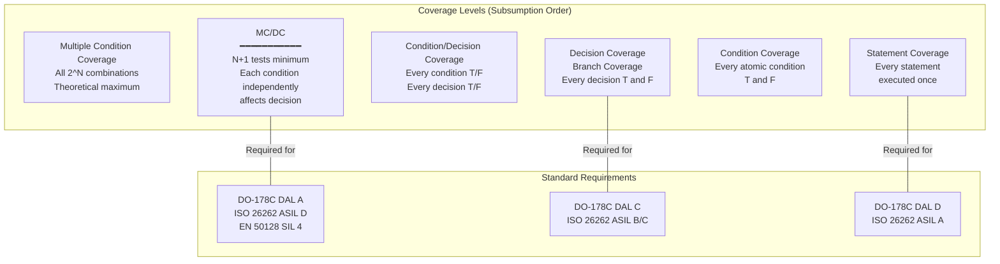
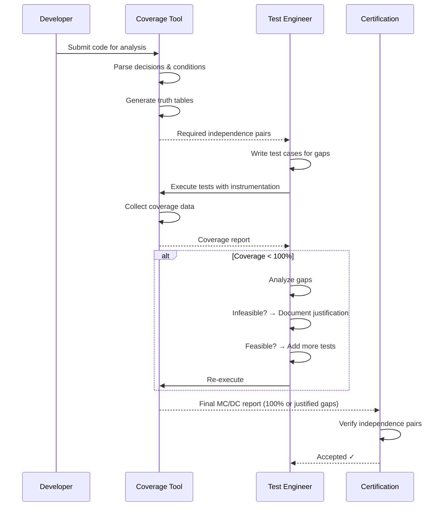

# Code Coverage Metrics & MC/DC (Modified Condition/Decision Coverage)

**Standard:** DO-178C (§6.4.4.2 — Structural Coverage); ISO 26262 Part 6 (Table 9 — Structural Coverage); EN 50128 (Table A.12); MC/DC defined in RTCA/DO-178B (1992) and refined in DO-178C (2011)  
**SDO:** RTCA (DO-178C); ISO TC 22 (ISO 26262); CENELEC (EN 50128); FAA/EASA (regulatory enforcement)  
**Audience:** Safety engineers, test engineers, verification engineers, certification authorities, tool developers  
**Prerequisites:** Boolean algebra, programming fundamentals, functional safety basics, understanding of decision/condition logic

---

## Chapter 1 — Historical Context & Origin Story

### 1.1 Timeline

| Year | Event | Significance |
|------|-------|-------------|
| 1976 | McCabe cyclomatic complexity | First quantitative metric for code paths |
| 1979 | Basis path testing (McCabe) | Testing guided by control flow structure |
| 1985 | Chilenski & Miller define MC/DC | Boeing engineers create MC/DC for avionics |
| 1992 | **DO-178B** published | MC/DC required for Level A (most critical) avionics software |
| 1994 | FAA AC 20-115B | Advisory Circular accepting DO-178B; MC/DC becomes regulatory requirement |
| 2001 | Hayhurst et al. (NASA) | Formal analysis of MC/DC; unique-cause vs. masking MC/DC clarification |
| 2005 | ISO 26262 development begins | Automotive: MC/DC considered for highest ASIL |
| 2011 | **DO-178C** published | Updates DO-178B; MC/DC requirement unchanged; supplements added (DO-330 to DO-333) |
| 2011 | **ISO 26262:2011** | MC/DC highly recommended for ASIL D; required at branch level for ASIL C |
| 2018 | ISO 26262:2018 (2nd ed.) | Confirmed MC/DC for ASIL D; table 9 unchanged |
| 2020 | Tool maturity | VectorCAST, LDRA, Rapita RVS, Testwell CTC++ all support MC/DC |
| 2023 | Automated test generation | AI-assisted MC/DC test generation; reducing manual effort |

### 1.2 Why MC/DC Was Created

In 1980s avionics, boolean expressions controlling safety-critical decisions were often complex (multiple conditions combined with AND/OR). Traditional branch coverage (decision coverage) only required True/False for the entire expression — it didn't ensure each individual condition was actually tested. MC/DC was invented at Boeing to ensure that:

1. Every **condition** in a decision is tested True and False
2. Every **decision** evaluates to True and False  
3. Each condition **independently** affects the decision outcome

This catches bugs where individual conditions are dead (never affect outcome) or incorrect (wrong boolean logic).

---

## Chapter 2 — Coverage Hierarchy

### 2.1 Structural Coverage Levels

| Level | Name | Definition | Strength |
|:-----:|------|-----------|:--------:|
| **SC** | Statement Coverage | Every executable statement executed at least once | Weakest |
| **DC** | Decision Coverage (Branch) | Every decision (if/while/for) evaluates True AND False | ↓ |
| **CC** | Condition Coverage | Every condition in a decision evaluates True AND False | ↓ |
| **C/DC** | Condition/Decision Coverage | Both CC and DC simultaneously | ↓ |
| **MC/DC** | Modified Condition/Decision Coverage | Each condition independently affects decision outcome | ↓ |
| **MCC** | Multiple Condition Coverage | Every combination of condition values tested | Strongest (exponential) |

### 2.2 Coverage Subsumption

```mermaid
graph BT
    SC[Statement Coverage<br/>Weakest]
    DC[Decision Coverage<br/>Branch Coverage]
    CC[Condition Coverage]
    CDC[Condition/Decision<br/>Coverage]
    MCDC[MC/DC<br/>━━━━━━━━━━━<br/>Modified Condition/<br/>Decision Coverage]
    MCC[Multiple Condition<br/>Coverage<br/>Strongest (exponential)]
    
    SC --> DC
    DC --> CDC
    CC --> CDC
    CDC --> MCDC
    MCDC --> MCC
```

Note: MC/DC subsumes C/DC, which subsumes both DC and CC independently. DC and CC do NOT subsume each other (CC can satisfy all conditions without covering all decision outcomes).

### 2.3 Test Case Count Comparison

For a decision with **N** conditions:

| Coverage | Minimum Test Cases | For N=4 | For N=8 |
|:--------:|:--:|:--:|:--:|
| Statement | 1 | 1 | 1 |
| Decision | 2 | 2 | 2 |
| Condition | 2 | 2 | 2 |
| **MC/DC** | **N+1** | **5** | **9** |
| Multiple Condition | $2^N$ | **16** | **256** |

$$\text{MC/DC tests} = N + 1 \text{ (minimum; often achievable)}$$

$$\text{Multiple Condition tests} = 2^N \text{ (exponential; impractical for large N)}$$

MC/DC provides strong coverage (each condition tested independently) with **linear** test growth — the key insight making it practical for complex avionics decisions.

---

## Chapter 3 — MC/DC Technical Deep Dive

### 3.1 Formal Definition

For MC/DC, each condition must be shown to independently affect the decision outcome. This means:

**For each condition C_i in a decision:**
- There exist two test cases where:
  - C_i changes value (True → False or False → True)
  - All other conditions remain fixed
  - The decision outcome CHANGES

This proves that C_i is "relevant" — it actually affects the result.

### 3.2 Example: Simple Decision

**Decision:** `if (A && B)`

| Test | A | B | Decision | Purpose |
|:----:|:-:|:-:|:--------:|---------|
| T1 | T | T | **T** | A's independence pair: T1 & T3 (A changes; B fixed at T; decision changes) |
| T2 | T | F | **F** | B's independence pair: T1 & T2 (B changes; A fixed at T; decision changes) |
| T3 | F | T | **F** | A's independence pair partner |

**MC/DC achieved with 3 tests** (N+1 = 2+1 = 3 ✓)

- **A's independence**: T1(A=T,B=T→decision=T) vs T3(A=F,B=T→decision=F) — A changed; B fixed; decision changed ✓
- **B's independence**: T1(A=T,B=T→decision=T) vs T2(A=T,B=F→decision=F) — B changed; A fixed; decision changed ✓

### 3.3 Example: Complex Decision

**Decision:** `if (A && (B || C))`

Truth table:

| A | B | C | B\|\|C | A && (B\|\|C) |
|:-:|:-:|:-:|:------:|:-------------:|
| T | T | T | T | **T** |
| T | T | F | T | **T** |
| T | F | T | T | **T** |
| T | F | F | F | **F** |
| F | T | T | T | **F** |
| F | T | F | T | **F** |
| F | F | T | T | **F** |
| F | F | F | F | **F** |

MC/DC test set (N+1 = 3+1 = 4 tests):

| Test | A | B | C | Decision | Independence Pairs |
|:----:|:-:|:-:|:-:|:--------:|---|
| T1 | T | T | F | T | A: T1 vs T4 (A=T→F; B=T,C=F fixed; decision T→F) |
| T2 | T | F | T | T | B: T2 vs T3 (B=F→F; wait — need B to change) |
| T3 | T | F | F | F | B: T1 vs T3 (B=T→F; A=T,C=F fixed; decision T→F) ✓ |
| T4 | F | T | F | F | C: T2 vs T3 (C=T→F; A=T,B=F fixed; decision T→F) ✓ |

Independence pairs:
- **A**: T1(T,T,F→T) vs T4(F,T,F→F) — A changes; B=T,C=F fixed; decision changes ✓
- **B**: T1(T,T,F→T) vs T3(T,F,F→F) — B changes; A=T,C=F fixed; decision changes ✓
- **C**: T2(T,F,T→T) vs T3(T,F,F→F) — C changes; A=T,B=F fixed; decision changes ✓

### 3.4 MC/DC Variants

| Variant | Definition | Standard |
|:-------:|-----------|:--------:|
| **Unique-Cause MC/DC** | The independence pair for each condition must hold ALL other conditions constant (literally fixed values) | Original DO-178B interpretation |
| **Masking MC/DC** | Independence can be shown through "masking" — if a condition is masked (its value doesn't matter due to short-circuit), it can vary | DO-178C/FAA Position Paper 2001; accepted as equivalent |
| **Unique-Cause + Masking** | Combines both; allows masking for strongly-coupled conditions | FAA accepted; most practical |

**Masking MC/DC** is important because for coupled conditions (where conditions share variables, e.g., `(A > 0) && (A < 100)`), unique-cause MC/DC may be impossible to achieve. Masking MC/DC resolves this.

### 3.5 Mathematical Properties

For a decision $D = f(c_1, c_2, ..., c_n)$:

MC/DC requires for each $c_i$:
$$\exists \text{ test cases } t_1, t_2 : c_i(t_1) \neq c_i(t_2) \land \forall_{j \neq i} c_j(t_1) = c_j(t_2) \land D(t_1) \neq D(t_2)$$

Minimum test cases: $n + 1$ (for non-coupled conditions)

For strongly-coupled conditions, masking MC/DC relaxes to:
$$\exists \text{ test cases } t_1, t_2 : c_i(t_1) \neq c_i(t_2) \land D(t_1) \neq D(t_2) \land \text{other conditions are masked or fixed}$$

---

## Chapter 4 — Standards Requirements

### 4.1 DO-178C Structural Coverage

| DAL | Statement | Decision | MC/DC | Required? |
|:---:|:---------:|:--------:|:-----:|:---------:|
| **DAL A** (Catastrophic) | ✅ | ✅ | ✅ | **Yes** — §6.4.4.2(c) |
| **DAL B** (Hazardous) | ✅ | ✅ | ✅ | **Yes** — §6.4.4.2(c) |
| **DAL C** (Major) | ✅ | ✅ | ❌ | Decision only |
| **DAL D** (Minor) | ✅ | ❌ | ❌ | Statement only |
| **DAL E** (No Effect) | ❌ | ❌ | ❌ | No structural coverage |

### 4.2 ISO 26262 Part 6 (Table 9)

| ASIL | Statement | Branch | MC/DC | Method |
|:----:|:---------:|:------:|:-----:|:------:|
| **ASIL A** | ++ (highly recommended) | + (recommended) | — | Unit testing |
| **ASIL B** | ++ | ++ | + (recommended) | Unit testing |
| **ASIL C** | ++ | ++ | + (recommended) | Unit testing |
| **ASIL D** | ++ | ++ | ++ (highly recommended) | Unit testing |

Legend: ++ = highly recommended (shall unless justified); + = recommended; — = no recommendation

### 4.3 EN 50128 (Railway)

| SIL | Statement | Branch | MC/DC | Method |
|:---:|:---------:|:------:|:-----:|:------:|
| SIL 0 | — | — | — | No requirement |
| SIL 1 | R | — | — | Recommended |
| SIL 2 | R | R | — | Recommended |
| SIL 3 | HR | HR | R | Highly recommended; MC/DC recommended |
| SIL 4 | HR | HR | HR | **MC/DC highly recommended** |

---

## Chapter 5 — Achieving MC/DC in Practice

### 5.1 Process for Achieving 100% MC/DC

| Step | Activity | Tool |
|:----:|----------|------|
| 1 | Instrument code for coverage | VectorCAST, LDRA, Rapita, Testwell CTC++ |
| 2 | Run existing test suite | Test framework (Google Test, Unity, CppUTest) |
| 3 | Analyze coverage report | Coverage tool; identify uncovered conditions |
| 4 | Identify independence pairs needed | Manual analysis or tool-generated (VectorCAST) |
| 5 | Write additional test cases targeting gaps | Test engineer; guided by independence pair analysis |
| 6 | Re-run and verify 100% MC/DC | Coverage tool verification |
| 7 | Analyze dead code / infeasible paths | Justify any <100% (dead code must be explained per DO-178C) |
| 8 | Generate coverage report for certification | Formal evidence; per standard requirements |

### 5.2 Common Challenges

| Challenge | Description | Solution |
|:---------:|-------------|----------|
| **Coupled conditions** | `(x > 0 && x < 100)` — changing x affects both conditions simultaneously | Use masking MC/DC; FAA accepted |
| **Dead code** | Code that cannot be reached (defensive programming; unused branches) | Justify per DO-178C §6.4.4.3 (deactivated code analysis) |
| **Complex boolean** | Decisions with 10+ conditions; many test cases needed | Refactor: split complex decisions into simpler sub-decisions |
| **Short-circuit evaluation** | `if (A && B)` — if A is False, B never executes | Must still achieve MC/DC for B (instrument before short-circuit OR test with A=True) |
| **Infeasible combinations** | Certain condition combinations impossible due to data constraints | Document; exclude from MC/DC requirement with justification |
| **Coverage tool accuracy** | Different tools give different coverage numbers | Use qualified tool (DO-330 TQL-5); validate with known test sets |

### 5.3 MC/DC for Defensive Programming

| Scenario | Problem | Resolution |
|:--------:|---------|-----------|
| `if (ptr != NULL)` defensive check | In normal operation, ptr is NEVER NULL; defensive check can't be tested both ways | DO-178C §6.4.4.3: analyze as deactivated code; document why the False branch exists (defensive) but cannot be reached in normal operation |
| Assertion: `ASSERT(x >= 0)` | Assertion should never fire; True branch always taken | Justify: assertion is a defensive mechanism; False path is error path; may test with fault injection |
| Error handler never reached | Safety monitors prevent error condition from occurring | Structural coverage analysis documents this; no test gap |

---

## Chapter 6 — Tools & Instrumentation

### 6.1 Coverage Analysis Tools

| Tool | Vendor | MC/DC Support | Qualification | Price |
|:---:|:---:|:---:|:---:|:---:|
| **VectorCAST** | Vector | Full (automated test generation for MC/DC) | DO-178C TQL-5; ISO 26262 | $$$$ |
| **LDRA TBvision** | LDRA | Full | DO-178C; ISO 26262; EN 50128 | $$$$ |
| **Rapita RVS** (RapiCover) | Rapita Systems | Full (target-based coverage) | DO-178C TQL-5 | $$$$ |
| **Testwell CTC++** | Testwell/Verifysoft | Full | ISO 26262 | $$$ |
| **Cantata** | QA Systems | Full | DO-178C; ISO 26262 | $$$ |
| **BullseyeCoverage** | Bullseye | Decision + Condition (not full MC/DC) | Not qualified | $$ |
| **gcov/lcov** | GCC | Statement + Branch only (no MC/DC) | Not qualified | Free |
| **llvm-cov** | LLVM | Branch (no MC/DC) | Not qualified | Free |

### 6.2 Instrumentation Approaches

| Approach | Description | Pros | Cons |
|:--------:|-------------|------|------|
| **Source instrumentation** | Tool inserts probes into source code before compilation | Portable; precise; compiler-independent | Modified binary ≠ production binary; timing impact |
| **Object instrumentation** | Probes inserted at object/binary level | Production compiler used; closer to real binary | Compiler-dependent; less portable |
| **Hardware-assisted** | Use CPU trace (ARM ETM, PowerPC Nexus) for coverage | Zero overhead; production binary; real hardware | Expensive hardware; limited to supported CPUs |
| **Simulation-based** | Run on simulator/emulator with built-in coverage | No target hardware needed; early testing | May not match real hardware behavior |

### 6.3 Target vs. Host-Based Coverage

| Aspect | Host-Based (PC) | Target-Based |
|:------:|:---:|:---:|
| Speed | Fast; immediate results | Slow; hardware-in-loop |
| Certification | Accepted if processor equivalence shown | Gold standard for DO-178C |
| Hardware access | Cannot test real hardware interfaces | Tests actual I/O, interrupts, timing |
| Recommended by | ISO 26262 (unit test on host acceptable) | DO-178C (prefers target; host requires justification) |
| Cost | Low (developer PC) | High (target boards; JTAG; trace) |

---

## Chapter 7 — Comparison of Coverage Standards Across Domains

### 7.1 Coverage Requirements Matrix

| Standard | Domain | Highest Level | Coverage Required at Top |
|:--------:|:------:|:---:|---|
| **DO-178C** | Aerospace | DAL A | Statement + Decision + **MC/DC** |
| **ISO 26262** | Automotive | ASIL D | Statement + Branch + **MC/DC** (highly recommended) |
| **EN 50128** | Railway | SIL 4 | Statement + Branch + **MC/DC** (highly recommended) |
| **IEC 62304** | Medical | Class C | Statement + Branch (MC/DC not explicitly required) |
| **IEC 61508** | Industrial | SIL 3/4 | Statement + Branch + MC/DC (recommended) |
| **NASA NPR 7150** | Space | Class A | Per DO-178C equivalence (MC/DC) |

### 7.2 Coverage Level Effectiveness

| Coverage Type | Bug Detection | Test Effort | Practical Value |
|:---:|:---:|:---:|---|
| Statement | Low (~20% bugs found) | Low | Minimum; ensures all code executed |
| Branch/Decision | Medium (~35% bugs found) | Low-Medium | Good baseline; catches untested branches |
| **MC/DC** | High (~60% bugs found) | Medium | Best cost/benefit; catches condition logic errors |
| Multiple Condition | Very High (~75%) | Very High ($2^N$) | Impractical for complex decisions; overkill |
| Path Coverage | Theoretical max | Infinite (for loops) | Not achievable; used as theoretical reference |

---

## Chapter 8 — Mermaid Architecture Diagrams

### 8.1 Coverage Hierarchy with Standards Mapping



### 8.2 MC/DC Test Generation Process



---

## Chapter 9 — Case Studies

### 9.1 Avionics: Achieving MC/DC for Flight Control Law

| Aspect | Detail |
|--------|--------|
| **System** | Fly-by-wire flight control computer; DO-178C DAL A; control law algorithm |
| **Code** | 150 KLOC C; 2,400 decisions; 8,200 conditions; complex boolean logic (fault detection, mode selection, envelope protection) |
| **Challenge** | Initial test suite (requirements-based testing) achieved: Statement 95%, Decision 88%, MC/DC **62%** — significant gap to close |
| **Approach** | (1) VectorCAST analysis identified 3,100 untested independence pairs. (2) Automated test generation covered 2,200 pairs (VectorCAST auto-generate). (3) Manual test design for remaining 900 pairs (complex coupled conditions; hardware-dependent paths). (4) Dead code analysis: 47 conditions identified as truly infeasible (defensive code; hardware-impossible states) — documented with formal justification. |
| **Result** | 100% MC/DC achieved (minus 47 justified exclusions); 4,800 test cases total; 6-month effort by 3 test engineers |
| **Certification** | DER accepted MC/DC evidence; commented that dead code justification was thorough; DAL A certification achieved |
| **Lesson** | Requirements-based testing alone typically achieves 60-80% MC/DC; remaining 20-40% requires structural coverage analysis and targeted test design; dead code must be formally analyzed and justified |

### 9.2 Automotive: ISO 26262 ASIL D MC/DC

| Aspect | Detail |
|--------|--------|
| **System** | Electric power steering (EPS) controller; ISO 26262 ASIL D; torque calculation algorithm |
| **Code** | 45 KLOC C (MISRA C:2012 compliant); 800 decisions; model-generated code (Simulink → Embedded Coder) |
| **Advantage of model-generated code** | Code is structured; no dead code (model drives generation); conditions map 1:1 to model logic; MC/DC achievable more easily than hand-written code |
| **Challenge** | Model coverage (Simulink Coverage) showed 100% decision; but generated C code MC/DC was only 91% (code generation adds defensive checks not visible in model) |
| **Gap analysis** | 9% gap was: (1) Saturation blocks generating min/max defensive code (5%); (2) Type conversion checks from code generator (3%); (3) Genuinely untested model path (1% — model coverage tool had a limitation) |
| **Resolution** | (1) Saturation + type conversion → justified as defensive (code generator artifact; not reachable under normal model inputs). (2) 1% model gap → added test case at model level → regenerated code → gap closed. (3) Final: 100% MC/DC (with justified exclusions documented) |
| **Tool** | Testwell CTC++ for target coverage; Simulink Coverage for model level; traceability between model and code coverage |

---

## Chapter 10 — Future Evolution

| Trend | Timeline | Impact |
|-------|----------|--------|
| **AI-generated test cases for MC/DC** | 2024-2026 | ML models generating optimal test inputs to achieve MC/DC; reducing manual effort by 50%+ |
| **Continuous coverage in CI/CD** | 2024-2025 | Every commit measured for coverage impact; regression detection for coverage drops |
| **Formal proof as coverage replacement** | 2024-2027 | DO-333 allows formal methods to replace structural coverage; if you mathematically prove correctness, coverage is redundant |
| **Coverage for ML/AI code** | 2025-2028 | New metrics beyond MC/DC for neural networks; neuron coverage; adversarial coverage |
| **Hardware-assisted coverage (no overhead)** | 2024-2026 | ARM CoreSight, RISC-V trace standard; production binary coverage with zero instrumentation overhead |
| **MC/DC for C++/Rust** | 2024-2027 | Tool support maturing for modern languages; template instantiation coverage; trait-based coverage |
| **Coverage-guided fuzzing** | 2024-2025 | Fuzzing tools (AFL++, libFuzzer) using MC/DC as guidance metric; automated vulnerability + coverage |

---

## Chapter 11 — Interview Questions & Career Guide

### Tier 1: Entry-Level

**Q1:** Explain the difference between statement coverage, decision coverage, and MC/DC. Why is MC/DC stronger?

**A:** **Statement coverage**: Every executable line of code runs at least once. This is the weakest metric — it only ensures code exists and is reachable, but doesn't verify logic correctness. Example: `if (A && B) { x=1; } else { x=2; }` — one test with A=True, B=True executes the if-branch (statement covered) but never tests the else.

**Decision coverage (branch coverage)**: Every decision (if/while/for condition) evaluates to both True AND False. Stronger than statement — ensures both branches are taken. Example: need one test where `(A && B)` is True, and one where it's False. But this doesn't ensure BOTH A and B are individually tested.

**MC/DC**: Each condition in a decision must be shown to **independently** affect the outcome. For `if (A && B)`: must prove A alone can change the result (holding B constant), AND B alone can change the result (holding A constant). This catches bugs like: code says `A && B` but should be `A || B` — decision coverage might pass (both True/False tested), but MC/DC would reveal B never independently affects the outcome under the wrong operator.

**Why MC/DC is stronger**: It requires N+1 test cases (linear growth) while achieving near the detection power of multiple condition coverage (2^N tests, exponential). It's the sweet spot between thoroughness and practicality — hence mandated for the highest safety levels (DAL A, ASIL D).

### Tier 2: Mid-Level

**Q2:** Given the decision `if ((A > 0) && (B < 10) || (C == 5))`, determine the minimum MC/DC test set. Show independence pairs for each condition.

**A:** First, parse the decision with operator precedence: `((A > 0) && (B < 10)) || (C == 5)`. Let's name conditions: P = (A > 0), Q = (B < 10), R = (C == 5). Decision = (P && Q) || R.

Truth table (relevant rows):

| # | P | Q | R | P&&Q | (P&&Q)\|\|R | Notes |
|:-:|:-:|:-:|:-:|:----:|:-----------:|---|
| 1 | T | T | F | T | **T** | |
| 2 | T | F | F | F | **F** | |
| 3 | F | T | F | F | **F** | |
| 4 | T | T | T | T | **T** | |
| 5 | F | F | T | F | **T** | |
| 6 | T | F | T | F | **T** | |
| 7 | F | T | T | F | **T** | |
| 8 | F | F | F | F | **F** | |

MC/DC test set (N+1 = 4 tests minimum):

**Tests selected**: {1, 2, 3, 5}

**Independence pairs**:
- **P**: Test 1 (P=T,Q=T,R=F → T) vs Test 3 (P=F,Q=T,R=F → F) — P changes; Q=T,R=F fixed; decision changes ✓
- **Q**: Test 1 (P=T,Q=T,R=F → T) vs Test 2 (P=T,Q=F,R=F → F) — Q changes; P=T,R=F fixed; decision changes ✓
- **R**: Test 2 (P=T,Q=F,R=F → F) vs Test 6 (P=T,Q=F,R=T → T) OR Test 5 (P=F,Q=F,R=T → T) vs Test 8 (P=F,Q=F,R=F → F) — R changes; P,Q fixed; decision changes ✓

Choosing {1, 2, 3, 5}: P pair (1,3); Q pair (1,2); R pair (5,8) — but 8 isn't in our set. Alternative: {1, 2, 3, 6} gives P(1,3), Q(1,2), R(2,6) — 4 tests ✓.

### Tier 3: Senior

**Q3:** Your team has achieved 94% MC/DC on a DAL A avionics project. The remaining 6% appears infeasible. How do you handle this for DO-178C certification?

**A:** DO-178C §6.4.4.3 addresses this directly. The process:

**Step 1 — Classify each uncovered condition**: (a) **Dead code** (truly unreachable): Code that cannot execute under any input (e.g., defensive assertion never triggered; hardware state impossible). (b) **Deactivated code** (reachable only in specific configurations): Code for other variants/options not active in this configuration. (c) **Infeasible condition combination**: The specific True/False combination required for independence cannot occur due to data coupling or physical constraints.

**Step 2 — For each category**: 

*Dead code (§6.4.4.3a)*: Must justify WHY it exists (defensive programming? code generator artifact?). If it serves no purpose, it must be removed. If defensive, document: "This code is defensive protection against [scenario]; under normal operation, [variable] is always [value] because [reason]; removing it would reduce robustness." The DER must agree.

*Deactivated code*: Document which configuration activates it; show that in the active configuration, it cannot execute; provide evidence that when activated (other configuration), it IS covered.

*Infeasible combinations*: Provide formal argument (or static analysis proof) that the specific condition combination required for the independence pair cannot physically occur. Example: "Condition A is (speed > 100) and Condition B is (speed < 50); for unique-cause MC/DC of A, we need B fixed at True while A changes — but speed cannot simultaneously be > 100 and < 50." Use Polyspace or manual proof.

**Step 3 — Documentation**: Create a "structural coverage analysis" document (DO-178C §6.4.4.3 output): for each gap, provide the category, justification, and evidence. This becomes part of the certification package.

**Step 4 — DER review**: The Designated Engineering Representative reviews justifications. Common acceptance criteria: justification is sound; evidence is objective (tool output, not just engineer opinion); remaining code is not safety-relevant (or is provably correct through other means like formal verification per DO-333).

**Practical tip**: 5-10% infeasible is normal for complex avionics code. Higher than 10% suggests: overly complex boolean logic (refactor), dead code that should be removed, or inadequate test design (not all feasible paths explored). Tools like VectorCAST can prove infeasibility for some cases automatically using constraint solving.

---

## Chapter 12 — Cheat Sheet & Quick Reference

```
═══════════════════════════════════════════
MC/DC — MODIFIED CONDITION/DECISION COVERAGE
═══════════════════════════════════════════

DEFINITION:
  Each condition independently affects the decision outcome
  = For each condition C:
    ∃ two tests where C changes, others fixed, decision changes

MINIMUM TESTS: N + 1 (where N = number of conditions)
  2 conditions:  3 tests
  4 conditions:  5 tests
  8 conditions:  9 tests
  vs. Multiple Condition: 2^N (4→16, 8→256)

═══════════════════════════════════════════
COVERAGE HIERARCHY (weakest → strongest):
  Statement → Decision → Condition/Decision → MC/DC → Multiple Condition
  
  Each level subsumes all below it

═══════════════════════════════════════════
WHEN REQUIRED:
  DO-178C:  DAL A + DAL B (mandatory)
  ISO 26262: ASIL D (highly recommended = practically mandatory)
  EN 50128:  SIL 4 (highly recommended)
  IEC 61508: SIL 3/4 (recommended)

═══════════════════════════════════════════
MC/DC VARIANTS:
  Unique-Cause:  All other conditions literally fixed
  Masking:       Masked conditions may vary (more practical)
  Unique-Cause + Masking: Combined (FAA accepted)
  
  Use Masking MC/DC for coupled conditions

═══════════════════════════════════════════
QUICK EXAMPLE: if (A && B)
  Test 1: A=T, B=T → Decision=T  (A's pair: 1&3; B's pair: 1&2)
  Test 2: A=T, B=F → Decision=F
  Test 3: A=F, B=T → Decision=F
  → 3 tests (N+1 = 2+1 ✓)

═══════════════════════════════════════════
INFEASIBLE COVERAGE (DO-178C §6.4.4.3):
  1. Classify: dead code / deactivated / infeasible
  2. Justify: formal proof or tool evidence
  3. Document: structural coverage analysis report
  4. DER approval required
  Normal: 5-10% infeasible is typical
  >10%: suggests code complexity issue

═══════════════════════════════════════════
TOOLS:
  VectorCAST:  Full MC/DC + auto-generate tests ($$$)
  LDRA:        Full MC/DC + qualification kit ($$$)
  Rapita RVS:  Target-based MC/DC (hardware trace) ($$$)
  Testwell CTC++: Full MC/DC ($$)
  gcov/lcov:   Statement + Branch ONLY (no MC/DC) (free)

═══════════════════════════════════════════
COMMON PITFALLS:
  • Short-circuit: if (A && B) — B may not execute if A=False
    → Must still test B's independence (when A=True)
  • Coupled conditions: (x>0 && x<100) — can't fix one
    → Use Masking MC/DC
  • Model-generated code: defensive checks add conditions
    → Justify as code generator artifact
  • Coverage ≠ correctness: 100% MC/DC ≠ no bugs
    → Still need requirements-based testing
```

---

*End of Document — 05_Code_Coverage_MC_DC.md*
