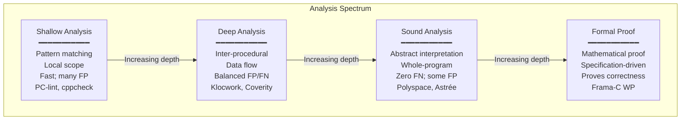
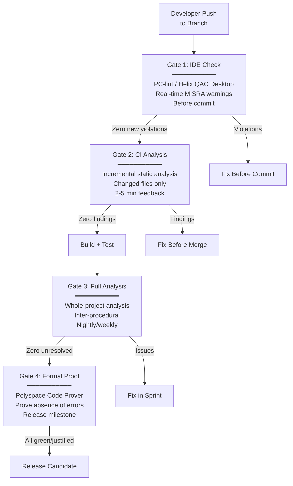
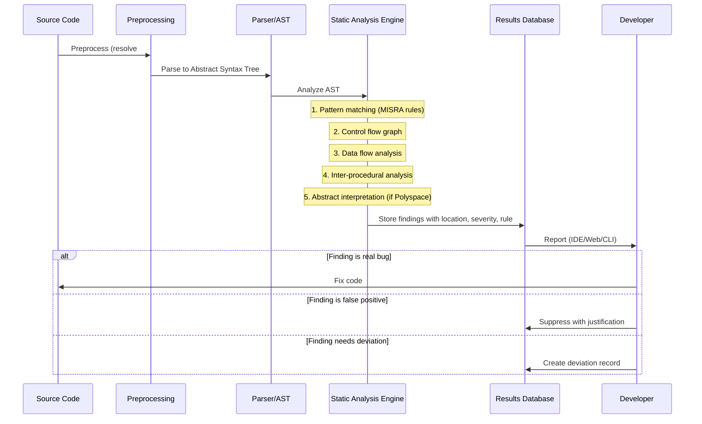

# Static Analysis Tools for Safety-Critical Software

**Topic:** Static analysis tools for MISRA C/C++, AUTOSAR, CERT compliance; abstract interpretation; data flow analysis; tool comparison and selection  
**Tools Covered:** LDRA TBvision, Polyspace (MathWorks), Helix QAC (Perforce/PRQA), Klocwork, CodeSonar, PC-lint Plus, Coverity, Astrée, Frama-C, cppcheck  
**SDO Context:** DO-178C §12 (Tool Qualification), ISO 26262-8 §11, EN 50128 §6.7.4  
**Audience:** Embedded software engineers, quality engineers, safety managers, DevOps/CI engineers, tool administrators  
**Prerequisites:** C/C++ programming, MISRA C/C++ basics, CI/CD concepts, functional safety lifecycle understanding

---

## Chapter 1 — Historical Context & Origin Story

### 1.1 Timeline

| Year | Event | Significance |
|------|-------|-------------|
| 1977 | lint (Stephen Johnson, Bell Labs) | First C static analysis tool; found type errors, unreachable code |
| 1985 | PC-lint (Gimpel Software) | Commercial lint for PC; MISRA checking added later |
| 1988 | LDRA founded | First tool specifically for safety-critical software analysis |
| 1995 | Polyspace (originally Aonix) | Abstract interpretation for C/Ada; proving absence of runtime errors |
| 1999 | QA-C (Programming Research Ltd / PRQA) | MISRA C:1998 focused; became industry standard for MISRA checking |
| 2002 | Coverity (Stanford spin-off) | Enterprise SAST; false-positive optimization; large codebase focus |
| 2003 | Klocwork (originally Klocwork Solutions) | Enterprise static analysis; later acquired by Perforce |
| 2005 | Astrée (AbsInt / ENS Paris) | Sound static analyzer; zero false negatives for runtime errors; used on Airbus A380 |
| 2008 | CodeSonar (GrammaTech) | Binary analysis + source analysis; NASA adoption |
| 2008 | Frama-C (CEA LIST / INRIA) | Open-source formal analysis framework for C |
| 2012 | MathWorks acquires Polyspace | Integration with MATLAB/Simulink ecosystem |
| 2015 | Perforce acquires PRQA (QA-C) | Renamed "Helix QAC" |
| 2018 | Perforce acquires Klocwork | Combined portfolio |
| 2020 | Synopsys acquires Coverity portfolio | Part of Application Security Testing suite |
| 2023 | AI-assisted analysis | ML-augmented pattern detection; intelligent false-positive suppression |

### 1.2 Static Analysis Categories

| Category | Technique | Examples | Finds |
|:--------:|-----------|---------|-------|
| **Pattern-based** | AST pattern matching; rule checking | PC-lint, Helix QAC, cppcheck | Coding standard violations; common bug patterns |
| **Data flow analysis** | Track data flow through program; reach/use analysis | Klocwork, Coverity, CodeSonar | Null deref; use-after-free; uninitialized reads |
| **Abstract interpretation** | Over-approximate all possible executions; mathematical proof | **Polyspace Code Prover, Astrée** | Absence of runtime errors (division by zero, overflow, out-of-bounds) |
| **Model checking** | Exhaustive state space exploration | SPIN, CBMC, CPAchecker | Protocol violations; assertion failures; deadlocks |
| **Formal verification** | Mathematical proof of correctness | **Frama-C WP**, SPARK | Prove program satisfies specification |

---

## Chapter 2 — Tool Architecture & Approaches

### 2.1 Analysis Depth Comparison



### 2.2 Soundness vs. Completeness

| Property | Definition | Tool Example |
|:--------:|-----------|:---:|
| **Sound** (no false negatives) | If the tool says "no bugs", there ARE no bugs; may report false positives | Polyspace Code Prover, Astrée |
| **Complete** (no false positives) | Everything reported IS a real bug; may miss some bugs (false negatives) | Not achievable in general (Rice's theorem) |
| **Unsound + Incomplete** | May have both FP and FN; optimized for practical use | Klocwork, Coverity, CodeSonar |
| **Sound + Incomplete** | Guarantees finding all bugs of a class; may over-report | Polyspace (abstract interpretation) |

**Key trade-off**: Sound analysis is mathematically guaranteed but produces more false positives (orange/unknown results in Polyspace). Unsound analysis is more practical for developers but may miss bugs.

---

## Chapter 3 — Major Tools Deep Dive

### 3.1 LDRA TBvision

| Aspect | Detail |
|--------|--------|
| **Vendor** | LDRA Ltd (Liverpool, UK; founded 1975) |
| **Capability** | Full lifecycle tool: static analysis + dynamic analysis + coverage + requirements tracing |
| **Standards** | MISRA C:2012, MISRA C++:2008/2023, AUTOSAR C++14, CERT C/C++, CWE, JSF AV C++ |
| **Coverage** | Statement, branch, MC/DC, condition, path coverage |
| **Qualification** | Pre-qualified for DO-178C (all TQL levels), ISO 26262, EN 50128, IEC 61508, IEC 62304 |
| **Unique strength** | Combined static + dynamic + coverage in single tool; requirements traceability; certification evidence generation |
| **CI/CD** | Jenkins, GitLab CI, Azure DevOps integration |
| **Target support** | Cross-compilation support; target instrumentation; VxWorks, QNX, INTEGRITY, bare metal |
| **Price** | Enterprise ($$$$ — typically $30K-100K+ per seat/year depending on modules) |

### 3.2 Polyspace (MathWorks)

| Aspect | Detail |
|--------|--------|
| **Products** | **Bug Finder** (pattern-based; MISRA checking; fast) + **Code Prover** (abstract interpretation; proves absence of errors) |
| **Technique** | Bug Finder: data flow + pattern matching; Code Prover: abstract interpretation (sound analysis) |
| **Standards** | MISRA C:2012, MISRA C++:2023, AUTOSAR C++14, CERT C/C++, CWE, ISO/IEC TS 17961 |
| **Unique strength** | Code Prover can PROVE absence of runtime errors (green = proven safe; red = proven error; orange = potential issue); no other tool provides this level of mathematical guarantee for C/C++ |
| **Color coding** | 🟢 Green (proven safe) / 🔴 Red (proven error) / 🟠 Orange (potential error; cannot prove safe) / ⚫ Gray (dead/unreachable code) |
| **Integration** | MATLAB/Simulink ecosystem; Embedded Coder verification; model-to-code traceability |
| **Qualification** | IEC Certification Kit (ISO 26262, DO-178C, IEC 61508, EN 50128) |
| **CI/CD** | Polyspace Access (web server); Jenkins; CI/CD pipeline integration; incremental analysis |
| **Price** | Enterprise ($$$$; Bug Finder + Code Prover license significant investment) |

### 3.3 Helix QAC (Perforce/PRQA)

| Aspect | Detail |
|--------|--------|
| **History** | Originally QA-C (PRQA); industry standard for MISRA C checking since 1999 |
| **Capability** | Static analysis focused on coding standard compliance (MISRA, AUTOSAR, CERT) |
| **Standards** | MISRA C:2012 (100% decidable rules), MISRA C++:2008/2023, AUTOSAR C++14, CERT, CWE, HIC++ |
| **Unique strength** | Deepest MISRA compliance checking; messages reference rule text directly; compliance reports with deviation tracking; MISRA-recognized tool |
| **Analysis** | Inter-procedural data flow; metric calculation (cyclomatic, Halstead); coding standard checking |
| **Metrics** | McCabe complexity, Halstead, maintainability index, fan-in/fan-out, call depth |
| **CI/CD** | QAC Dashboard (web); Jenkins plugin; command-line integration |
| **Price** | Enterprise ($$$; per-user or per-project licensing) |

### 3.4 Klocwork (Perforce)

| Aspect | Detail |
|--------|--------|
| **Capability** | Enterprise SAST for C/C++/Java/C#; deep inter-procedural analysis; large codebase scalability |
| **Standards** | MISRA C:2012, MISRA C++, AUTOSAR C++14, CERT C/C++, CWE Top 25 |
| **Unique strength** | Scales to millions of LOC; incremental analysis (re-analyze only changed files); low false positive rate; developer-friendly IDE integration |
| **Analysis** | Inter-procedural; whole-program; path-sensitive; constraint-based |
| **IDE** | Eclipse, Visual Studio, IntelliJ IDEA plugins |
| **CI/CD** | Native CI/CD integration; differential analysis; build system integration |
| **Price** | Enterprise ($$$; per-developer or per-project) |

### 3.5 CodeSonar (GrammaTech)

| Aspect | Detail |
|--------|--------|
| **Capability** | Deep static analysis for C/C++; binary analysis (no source needed); concurrency analysis |
| **Unique strength** | **Binary analysis** (can analyze third-party libraries without source); interprocedural path analysis; concurrency defect detection (races, deadlocks); NASA/DoD adoption |
| **Standards** | MISRA C, CERT C, CWE; DO-178C qualified |
| **Analysis** | Whole-program; abstract interpretation elements; binary + source combined |
| **Use case** | Aerospace/defense; analyzing COTS (commercial off-the-shelf) without source; supply chain security |
| **Price** | Enterprise ($$$$ — aerospace/defense pricing) |

### 3.6 Astrée (AbsInt)

| Aspect | Detail |
|--------|--------|
| **Capability** | **Sound** static analyzer for C; guaranteed zero false negatives for runtime errors |
| **Technique** | Abstract interpretation; over-approximation; mathematical proof of absence of errors |
| **Unique strength** | If Astrée says "no runtime errors", there are NONE; used for Airbus A340/A380 fly-by-wire; highest confidence level |
| **Proven properties** | No division by zero; no buffer overflow; no integer overflow; no invalid pointer; no data race (concurrent version) |
| **Limitation** | Only C (not C++); may produce orange/unproven results (over-approximation); requires annotation for precision |
| **Certification** | Airbus qualification; aerospace standard |
| **Price** | Enterprise ($$$$$; aerospace/defense pricing) |

### 3.7 Tool Summary Comparison

| Tool | MISRA C | MISRA C++ | AUTOSAR | Formal | Coverage | Qualification | Price |
|:---:|:---:|:---:|:---:|:---:|:---:|:---:|:---:|
| **LDRA** | ✅ Full | ✅ | ✅ | — | ✅ MC/DC | DO/ISO/EN | $$$$ |
| **Polyspace** | ✅ Full | ✅ | ✅ | ✅ (Code Prover) | — | DO/ISO/EN | $$$$ |
| **Helix QAC** | ✅ Full (best) | ✅ | ✅ | — | — | ISO 26262 | $$$ |
| **Klocwork** | ✅ ~95% | ✅ | ✅ | — | — | ISO 26262 | $$$ |
| **CodeSonar** | ✅ | ✅ | — | Partial | — | DO-178C | $$$$ |
| **Astrée** | Partial | — | — | ✅ (Sound) | — | Airbus qual | $$$$$ |
| **PC-lint Plus** | ✅ ~90% | ✅ ~85% | — | — | — | Not qualified | $$ |
| **cppcheck** | ~50% (addon) | ~30% | — | — | — | Not qualified | Free |
| **Frama-C** | Partial | — | — | ✅ (WP) | — | Research | Free |

---

## Chapter 4 — Implementation Guide

### 4.1 Tool Selection Decision Matrix

| Factor | Weight | Consider |
|:------:|:------:|---------|
| **Certification standard** | High | DO-178C needs qualified tool; ISO 26262 needs tool confidence level assessment |
| **Coding standard** | High | Which MISRA/AUTOSAR/CERT version? Full coverage needed? |
| **Codebase size** | Medium | Millions of LOC need scalable tool (Klocwork); small = any tool |
| **CI/CD integration** | Medium | Incremental analysis? Jenkins/GitLab? Developer IDE? |
| **False positive rate** | Medium | Developer acceptance; alarm fatigue at >30% FP |
| **Formal proof needed?** | High | Code Prover if "prove absence of errors"; standard analysis otherwise |
| **Budget** | Medium | Open source (cppcheck) → low-end (PC-lint) → enterprise (LDRA/Polyspace) |
| **Language** | High | C-only vs. C++ vs. mixed |
| **Target platform** | Low | Cross-compilation support; RTOS integration |

### 4.2 CI/CD Pipeline Integration



### 4.3 Practical Deployment Strategy

| Phase | Duration | Activity | Outcome |
|:-----:|:--------:|----------|---------|
| **1. Pilot** | 2-4 weeks | Install tool; analyze small module; evaluate FP rate; assess usability | Go/no-go decision |
| **2. Baseline** | 1-2 weeks | Run full analysis on entire codebase; establish current violation count | Baseline metrics |
| **3. Triage** | 2-4 weeks | Review all findings; classify: real bug / coding standard violation / false positive / won't fix | Categorized backlog |
| **4. Suppress legacy** | 1 week | Suppress existing violations in legacy code (baseline suppression); zero new violations policy starts | Clean baseline |
| **5. CI integration** | 1-2 weeks | Add to CI pipeline; block merge on new violations; incremental analysis | Automated gate |
| **6. Remediation** | 3-12 months | Gradually fix legacy violations; sprint allocation; priority by severity | Approaching zero |
| **7. Steady state** | Ongoing | Zero new violations (CI gate); periodic legacy reduction; tool updates | Clean codebase |

---

## Chapter 5 — Tool Qualification

### 5.1 DO-178C Tool Qualification (§12)

| Tool Classification | Description | Qualification Need |
|:---:|---|:---:|
| **Criteria 1** (output is part of airborne SW) | Tool output becomes part of the executable (compiler) | TQL-1 (highest) |
| **Criteria 2** (automates verification; could fail to detect error) | Tool could fail to detect an error that manual verification would find (static analysis, test coverage) | TQL-4 or TQL-5 |
| **Criteria 3** (cannot introduce error; can only fail to detect) | Coverage tool; if wrong, test is less thorough but no error introduced | TQL-5 (lowest) |

Static analysis tools are typically **Criteria 2** or **Criteria 3**:
- If used as the SOLE means of detecting a class of errors → Criteria 2 → TQL-4 qualification
- If used alongside other verification (review + testing) → Criteria 3 → TQL-5 qualification

### 5.2 ISO 26262-8 §11 Tool Confidence Level

| Factor | Values | Description |
|:------:|--------|-------------|
| **Tool Impact (TI)** | TI1 (can introduce/mask error) / TI2 (cannot) | Can the tool introduce an error into the software? |
| **Tool Error Detection (TD)** | TD1 (high confidence) / TD2 (medium) / TD3 (low confidence of detection) | How likely are tool errors to be detected by subsequent activities? |

| TI | TD | Required TCL | Qualification Method |
|:--:|:--:|:---:|---|
| TI1 | TD1 | TCL1 | Increased confidence from use |
| TI1 | TD2 | TCL2 | Validation of the tool |
| TI1 | TD3 | TCL3 | Development per safety standard |
| TI2 | any | TCL1 | Increased confidence from use |

For static analysis tools (typically TI1+TD1 or TI2 depending on usage): **TCL1** usually sufficient → "increased confidence from use" → document: tool version, known issues, usage experience, comparison with other tools on known code.

---

## Chapter 6 — Polyspace Deep Dive (Abstract Interpretation)

### 6.1 Polyspace Color Semantics

| Color | Meaning | Action |
|:-----:|---------|--------|
| 🟢 **Green** | **Proven safe** — mathematically guaranteed no runtime error can occur on this operation for ANY input | No action; this IS the proof |
| 🔴 **Red** | **Proven error** — this operation WILL fail for at least one reachable input; definite bug | **Fix immediately** |
| 🟠 **Orange** | **Unproven** — cannot prove safe; might be an error OR might be safe with insufficient precision | Investigate; refine; or justify |
| ⚫ **Gray** | **Unreachable/dead** — code proven to never execute | Remove or justify (defensive code) |

### 6.2 What Polyspace Code Prover Proves

| Runtime Error Class | Check | CWE |
|:---:|---|:---:|
| Division by zero | All division operations | CWE-369 |
| Array index out of bounds | All array access | CWE-119 |
| Integer overflow/underflow | All arithmetic operations | CWE-190/191 |
| Invalid shift | Shift amount ≥ width or negative | CWE-682 |
| Null pointer dereference | All pointer dereferences | CWE-476 |
| Uninitialized variable use | All variable reads | CWE-457 |
| Invalid pointer arithmetic | Pointer beyond allocated bounds | CWE-119 |
| Non-termination | Infinite loops detected | — |
| Stack overflow | Computed stack usage exceeds limit | CWE-121 |
| Unreachable code | Code that cannot execute | — |

### 6.3 Abstract Interpretation Concept

Abstract interpretation analyzes ALL possible execution paths simultaneously by abstracting concrete values to mathematical domains:

| Concrete | Abstract Domain | Example |
|:--------:|:---:|---|
| `x = 42` | Interval: [42, 42] | Exactly known |
| `x = input()` | Interval: [INT_MIN, INT_MAX] | Unknown (full range) |
| `if (x > 0) { ... }` | Inside if: [1, INT_MAX] | Narrowed by condition |
| `x = a + b` where a∈[1,10], b∈[5,20] | x∈[6, 30] | Over-approximation (safe) |

The key: over-approximation means if Polyspace says "safe", it IS safe. But it may say "orange" (cannot prove) when the code is actually safe but the abstraction isn't precise enough.

---

## Chapter 7 — Comparison: Static Analysis Approaches

| Aspect | Pattern-Based | Data Flow | Abstract Interpretation | Formal Proof |
|:------:|:---:|:---:|:---:|:---:|
| **Representative tool** | PC-lint, Helix QAC | Klocwork, Coverity | Polyspace, Astrée | Frama-C WP |
| **Analysis time** | Fast (minutes) | Medium (hours) | Slow (hours-days) | Very slow (days-weeks) |
| **False positives** | Medium-High | Low-Medium | Medium (orange) | Zero (if proof succeeds) |
| **False negatives** | High (many missed) | Medium | **Zero** (sound) | Zero (if specification complete) |
| **Scalability** | Excellent (MLOC) | Good (MLOC) | Medium (100K-1M) | Poor (KLOC scale) |
| **Developer effort** | Low (run & fix) | Low-Medium | Medium (annotations for precision) | High (write specifications) |
| **Certification credit** | Supports compliance checking | Supports defect detection | **Proves absence of errors** | **Proves correctness** |
| **Best for** | Coding standard compliance | Finding real bugs efficiently | Safety-critical proof of no runtime errors | Formally verifying critical algorithms |

---

## Chapter 8 — Mermaid Architecture Diagrams

### 8.1 Static Analysis Tool Landscape

```mermaid
graph TB
    subgraph "Enterprise Safety-Critical"
        LDRA[LDRA TBvision<br/>Full lifecycle<br/>Static + Dynamic + Coverage<br/>All certifications]
        POLY[Polyspace<br/>Bug Finder + Code Prover<br/>Abstract interpretation<br/>Proves absence of errors]
        QAC[Helix QAC<br/>MISRA specialist<br/>Best coding standard checker<br/>Compliance reporting]
    end
    
    subgraph "Enterprise Security/Quality"
        KLOC[Klocwork<br/>Deep data flow<br/>Scalable to MLOC<br/>Low false positives]
        COV[Coverity<br/>Enterprise SAST<br/>Pattern + data flow<br/>CI/CD native]
        CS[CodeSonar<br/>Binary analysis<br/>Concurrency defects<br/>Aerospace/defense]
    end
    
    subgraph "Formal/Research"
        ASTREE[Astrée<br/>Sound analysis<br/>Zero false negatives<br/>Airbus qualified]
        FRAMA[Frama-C<br/>Open source<br/>Formal proof (WP)<br/>Research/academic]
    end
    
    subgraph "Cost-Effective"
        LINT[PC-lint Plus<br/>Desktop analysis<br/>Good MISRA coverage<br/>Affordable]
        CPP[cppcheck<br/>Open source<br/>Limited MISRA<br/>Free]
    end
```

### 8.2 Analysis Pipeline



---

## Chapter 9 — Case Studies

### 9.1 Airbus A380: Astrée for Fly-by-Wire

| Aspect | Detail |
|--------|--------|
| **System** | A380 flight control primary computer; DO-178B Level A; most critical avionics |
| **Challenge** | Must prove ABSENCE of all runtime errors in 132,000 lines of C code; human review insufficient for this guarantee |
| **Tool** | Astrée (abstract interpretation); sound analyzer; if it says "no errors", there are none |
| **Approach** | (1) Run Astrée on flight control code; (2) Initial run: many orange (unproven) results due to imprecise abstractions; (3) Add annotations to guide abstract domains (variable ranges from requirements, hardware constraints); (4) Iterative refinement until all checks are either green (proven safe) or justified |
| **Result** | All runtime error checks proven safe (green); 100% coverage of division, overflow, bounds, pointer, initialization checks; zero runtime errors possible in any execution path |
| **Certification impact** | Accepted by EASA as replacement for significant portion of testing effort; mathematical proof > exhaustive testing for runtime error absence |
| **Lesson** | Sound static analysis is the gold standard for proving absence of a CLASS of errors; complements (doesn't replace) functional testing |

### 9.2 Automotive Tier-1: Multi-Tool Strategy

| Aspect | Detail |
|--------|--------|
| **Organization** | Automotive Tier-1; ADAS + body electronics; 5M LOC C/C++; 150 developers |
| **Strategy** | Multi-tool layered approach: Helix QAC (MISRA compliance) + Polyspace Bug Finder (defect detection) + Polyspace Code Prover (critical modules only) |
| **Layer 1 (all code)** | Helix QAC: MISRA C:2012 Required + Mandatory; CI gate; zero new violations policy; configured in Jenkins; runs on every PR; 3-minute incremental analysis |
| **Layer 2 (all code)** | Polyspace Bug Finder: defect detection (null deref, overflow, buffer overflow); weekly full scan; triage meeting; 12 high-priority findings per week average |
| **Layer 3 (ASIL D only)** | Polyspace Code Prover: prove absence of runtime errors in 50 KLOC ASIL D braking code; monthly run; 3-day analysis time; objective: 100% green |
| **Results after 2 years** | MISRA violations: 45,000 (baseline) → 1,200 (97% reduction); runtime errors in field: 0 (ASIL D code); Polyspace green coverage: 94% (6% justified orange); defects found before integration: 340/year (previously found in test: 180/year = earlier detection) |
| **Cost** | Total tooling: ~$500K/year (licenses + infrastructure + administration); ROI calculated: $2.1M/year saved in reduced field defects + faster certification |

---

## Chapter 10 — Future Evolution

| Trend | Timeline | Impact |
|-------|----------|--------|
| **AI-augmented analysis** | 2024-2026 | ML models reducing false positives; suggesting fixes; learning from developer decisions |
| **Continuous analysis (real-time IDE)** | 2024-2025 | Instant feedback as developer types (not just on save/commit); LSP-integrated analysis |
| **Cloud-based analysis** | 2024-2026 | Analysis as a service; no local installation; scalable compute; SaaS model |
| **SBOM + analysis** | 2024-2026 | Static analysis of dependencies; supply chain security; open-source component analysis |
| **Rust static analysis** | 2024-2027 | MISRA Rust (under development); safety-critical Rust tools; Rust's type system reduces need |
| **Binary + source combined** | 2024-2026 | Analyze compiled binary alongside source; catch compiler bugs; verify optimization safety |
| **Formal + ML hybrid** | 2025-2027 | Abstract interpretation guided by ML for precision; automated annotation generation |

---

## Chapter 11 — Interview Questions & Career Guide

### Tier 1: Entry-Level

**Q1:** What is the difference between static analysis and dynamic analysis? Give examples of each.

**A:** **Static analysis** examines source code WITHOUT executing it. It analyzes the code structure, data flow, and patterns to find potential bugs and coding standard violations. Examples: MISRA C checking with Helix QAC (finds rule violations); Polyspace Bug Finder (finds potential null dereferences); cppcheck (finds memory leaks). Advantages: finds bugs before any test runs; covers all code paths (not just tested ones); no runtime overhead. Limitations: may produce false positives (reporting bugs that aren't real); cannot find issues that depend on runtime state (exact values from user input).

**Dynamic analysis** examines code DURING execution. It instruments the running program to detect errors at runtime. Examples: Valgrind (detects memory leaks, use-after-free, buffer overflows at runtime); AddressSanitizer (ASan — compile-time instrumentation for memory errors); coverage tools (measure which code executes during tests). Advantages: no false positives (if it reports an error, it happened); finds timing-dependent bugs. Limitations: only finds bugs in EXECUTED paths (coverage-dependent); runtime overhead; needs test inputs that trigger the bug.

**Best practice**: Use BOTH. Static analysis finds potential bugs across all code; dynamic analysis confirms real bugs and finds issues static analysis misses (timing, hardware interaction).

### Tier 2: Mid-Level

**Q2:** Explain the difference between Polyspace Bug Finder and Polyspace Code Prover. When would you use each?

**A:** **Bug Finder**: Fast pattern-based + data flow analysis. Finds: null dereferences, buffer overflows, dead code, MISRA violations, uninitialized reads. Speed: minutes to analyze large codebases. False positives: moderate (like other commercial tools). False negatives: yes (can miss bugs). Best for: daily development; CI/CD gates; all code; fast feedback.

**Code Prover**: Abstract interpretation (sound analysis). Proves: ABSENCE of ALL runtime errors of specific classes. For every check point (division, array access, arithmetic), it produces GREEN (proven safe) or ORANGE (cannot prove) or RED (proven error). Speed: hours to days for large code. False positives: orange results may be false positives (over-approximation). False negatives: **ZERO** — if it says green, it IS safe (mathematical guarantee). Best for: safety-critical code (ASIL D, DAL A); proving absence of errors; certification evidence; final verification before release.

**When to use each**: Use Bug Finder on ALL code in CI/CD (fast, practical, catches most issues). Use Code Prover on CRITICAL code only (ASIL C/D; DAL A/B) where you need mathematical proof of no runtime errors. Typical ratio: Bug Finder covers 100% of codebase; Code Prover covers 10-20% (highest-criticality modules). They complement each other — Bug Finder finds bugs quickly; Code Prover proves absence of classes of bugs mathematically.

### Tier 3: Senior

**Q3:** Design a static analysis strategy for a 3M LOC automotive platform with mixed ASIL levels (QM through ASIL D). Consider tool selection, pipeline architecture, developer workflow, false positive management, and certification evidence generation.

**A:** **Tool selection** (multi-tool layered): (1) **Helix QAC** — MISRA C/C++ compliance for all code (strongest MISRA checker); in developer IDE + CI gate. (2) **Polyspace Bug Finder** — defect detection for all code; CI nightly; security-focused (CERT, CWE). (3) **Polyspace Code Prover** — ASIL C/D modules only (~300K LOC); proves absence of runtime errors; monthly + release milestone. (4) **PC-lint Plus** — developer desktop (fast; instant feedback; affordable for all developers).

**Pipeline architecture**: 
- *Pre-commit (developer desktop)*: PC-lint real-time in IDE; Helix QAC desktop check (2-3 min). Zero new findings before push.
- *PR/Merge gate (CI)*: Helix QAC incremental (changed files; MISRA check); Polyspace Bug Finder incremental (changed files). Blocks merge on new findings. 3-5 minute feedback.
- *Nightly (CI)*: Full Polyspace Bug Finder on entire codebase; full Helix QAC. Report trends; new findings assigned to owners.
- *Release milestone*: Polyspace Code Prover on ASIL C/D modules; full inter-procedural analysis; 100% green target (or justified orange).

**ASIL-differentiated approach**:
- QM code: PC-lint + Helix QAC MISRA Advisory (minimum bar); no hard gate
- ASIL A/B: Helix QAC MISRA Required (CI gate); Polyspace Bug Finder (nightly)
- ASIL C: Above + Polyspace Bug Finder (CI gate); Code Prover (release)
- ASIL D: Above + Polyspace Code Prover (CI weekly); 100% green target; formal deviation for any orange

**False positive management**: (1) Baseline suppression: existing legacy code gets frozen baseline; only new violations blocked. (2) Triage process: weekly review meeting; classify each finding; security team for CERT/CWE findings. (3) Suppression with justification: mandatory reason + approver for each suppression; tracked in tool database; auditable. (4) FP reporting to vendor: systematic false positives reported for tool improvement.

**Certification evidence**: Tool generates: MISRA compliance report (per ISO 26262 Part 6); Code Prover verification report (proves absence of errors — accepted as verification evidence); deviation records for justified suppressions; trend reports showing continuous improvement. Package per module for assessor review.

---

## Chapter 12 — Cheat Sheet & Quick Reference

```
═══════════════════════════════════════════
STATIC ANALYSIS TOOL SELECTION GUIDE
═══════════════════════════════════════════

NEED: MISRA C compliance checking
  → Helix QAC (best MISRA checker)
  → LDRA TBvision (+ coverage + dynamic)
  → Polyspace Bug Finder (+ defect detection)
  → PC-lint Plus (cost-effective)

NEED: Prove ABSENCE of runtime errors
  → Polyspace Code Prover (abstract interpretation)
  → Astrée (aerospace; sound; zero FN)

NEED: Enterprise security (SAST)
  → Klocwork (scalable; low FP)
  → Coverity (mature; CI/CD native)
  → CodeSonar (+ binary analysis)

NEED: Formal correctness proof
  → Frama-C WP (open source; C only)
  → SPARK (Ada; commercial)

NEED: Free / open source
  → cppcheck (basic; limited MISRA)
  → Frama-C (formal; research)
  → Clang Static Analyzer (good for bugs)

═══════════════════════════════════════════
ANALYSIS DEPTH:
  Shallow: Pattern matching (fast; many FP/FN)
  Medium:  Data flow (balanced; practical)
  Deep:    Abstract interpretation (sound; no FN)
  Formal:  Mathematical proof (strongest; slow)

═══════════════════════════════════════════
POLYSPACE COLOR CODE:
  🟢 Green:  PROVEN safe (no error possible)
  🔴 Red:    PROVEN error (definite bug — FIX)
  🟠 Orange: Cannot prove (investigate or justify)
  ⚫ Gray:   Unreachable / dead code

═══════════════════════════════════════════
CI/CD INTEGRATION PATTERN:
  Pre-commit:  PC-lint (instant; developer desktop)
  PR Gate:     Helix QAC + Bug Finder (incremental; 3-5 min)
  Nightly:     Full analysis (entire codebase)
  Release:     Code Prover (ASIL D; mathematical proof)

═══════════════════════════════════════════
TOOL QUALIFICATION:
  DO-178C: Criteria 2/3 → TQL-4/5
  ISO 26262: TI + TD → TCL 1-3
  Most tools provide qualification kits

═══════════════════════════════════════════
FALSE POSITIVE MANAGEMENT:
  1. Baseline suppression (legacy)
  2. Zero new findings policy (CI gate)
  3. Triage: real/FP/won't-fix/deviation
  4. Suppression requires justification + approval
  5. Report to vendor for tool improvement

═══════════════════════════════════════════
COST/BENEFIT:
  ROI typically 5-10× (cost avoidance):
  - $50-500K/year tooling
  - Prevents: field defects ($1-10M each automotive recall)
  - Faster certification (evidence auto-generated)
  - Earlier defect detection (10× cheaper than test)
```

---

*End of Document — 06_Static_Analysis_Tools.md*
