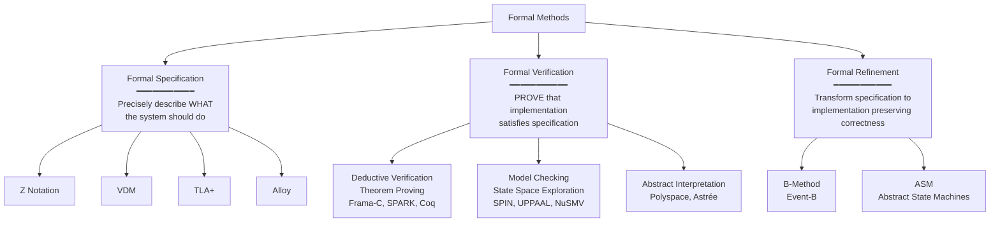
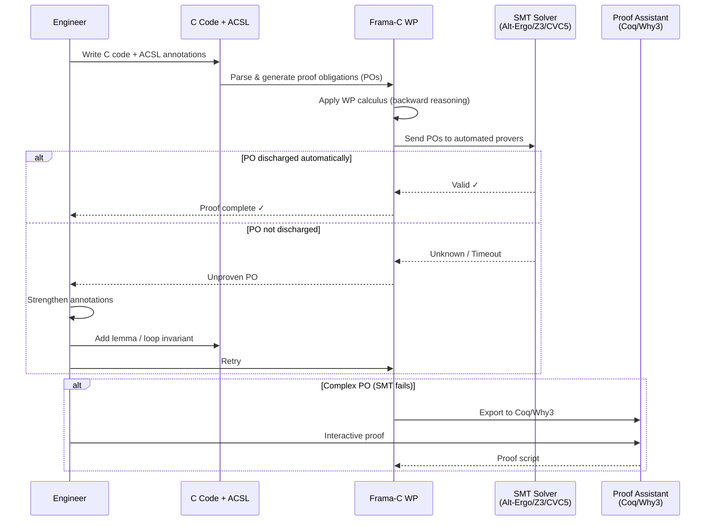
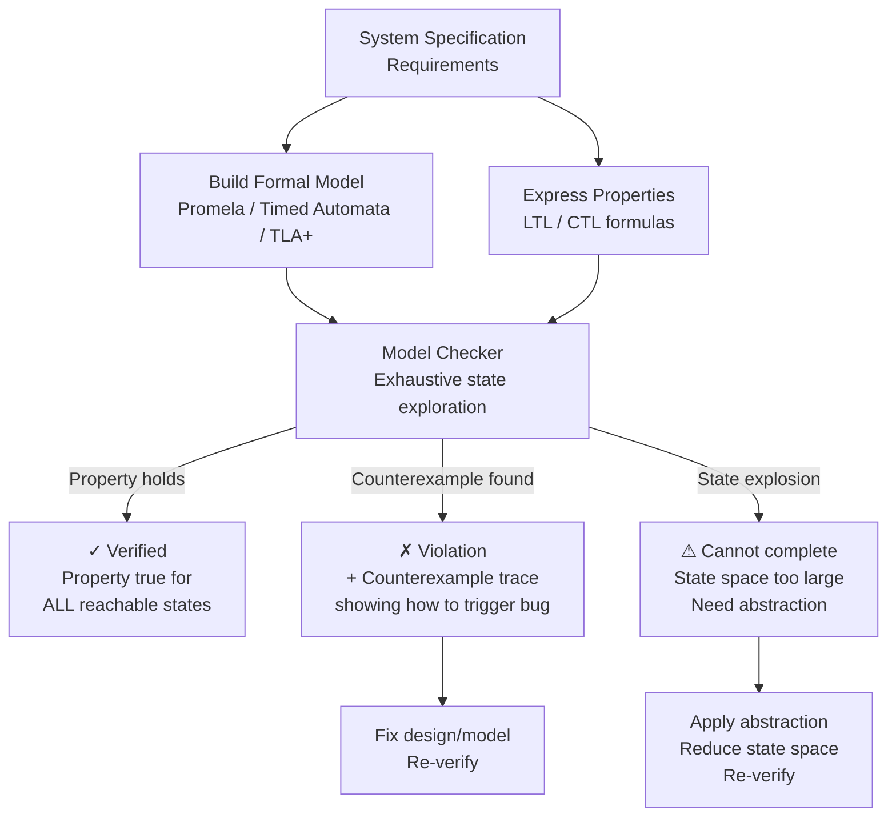
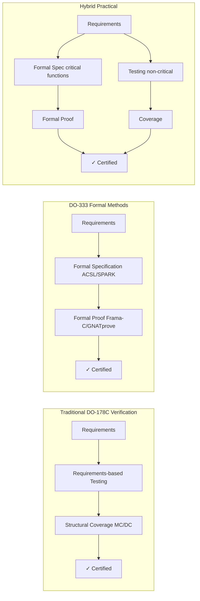

# Formal Verification for Safety-Critical Software

**Topic:** Formal methods for proving software correctness; DO-333 (Formal Methods Supplement to DO-178C); Frama-C; SPARK Ada; Model Checking; Theorem Proving; CompCert; TLA+  
**Standards:** DO-333 (Formal Methods Supplement), DO-178C §6.3, ISO 26262-6 Table 7 (Method 1c), EN 50128 (Formal Methods — Highly Recommended SIL 3/4)  
**SDO:** RTCA (DO-333); ISO TC 22; CENELEC; ACM/IEEE (academic)  
**Audience:** Verification engineers, safety architects, certification authorities, formal methods specialists, research engineers  
**Prerequisites:** Mathematical logic (propositional + first-order), programming fundamentals, safety lifecycle understanding, basic set theory

---

## Chapter 1 — Historical Context & Origin Story

### 1.1 Timeline

| Year | Event | Significance |
|------|-------|-------------|
| 1949 | Alan Turing: "Checking a Large Routine" | First paper on program verification |
| 1967 | Floyd: "Assigning Meanings to Programs" | Flowchart verification; precondition/postcondition |
| 1969 | **Hoare Logic** published (C.A.R. Hoare) | Foundation of formal verification: {P} S {Q} triples |
| 1975 | Dijkstra: "Guarded Commands" | Weakest precondition calculus |
| 1977 | Lamport: "Proving Sequential Programs" | Temporal logic for concurrent programs |
| 1981 | Clarke & Emerson: Model Checking | Automatic verification of finite-state systems |
| 1983 | SPARK Ada (first version) | First industrially-used formally verified programming language |
| 1986 | Leslie Lamport: TLA (Temporal Logic of Actions) | Specification language for concurrent/distributed systems |
| 1991 | Coq proof assistant (INRIA) | Interactive theorem prover; Curry-Howard correspondence |
| 1993 | SPIN model checker (Bell Labs) | LTL model checking for distributed protocols |
| 1997 | Isabelle/HOL (Cambridge/Munich) | General-purpose proof assistant |
| 2002 | Frama-C project begins (CEA LIST) | Open-source formal analysis framework for C |
| 2005 | CompCert C compiler (Xavier Leroy) | First formally verified optimizing C compiler; proved correct in Coq |
| 2008 | Frama-C first public release | WP plugin: deductive verification of C programs |
| 2011 | **DO-333** published | Formal Methods supplement to DO-178C; allows formal proofs to replace testing |
| 2014 | seL4 microkernel verified | First formally verified general-purpose OS kernel (Isabelle/HOL) |
| 2016 | SPARK 2014 (AdaCore) | Modern SPARK; integrated with GPS IDE; contracts in source |
| 2019 | AWS formal verification (TLA+) | Amazon uses TLA+ for S3, DynamoDB, EBS protocols |
| 2022 | Ferrocene (Rust qualified compiler) | ISO 26262/IEC 61508 qualified Rust toolchain |
| 2023 | AI-assisted formal proofs | LLM-generated specifications; automated lemma discovery |

### 1.2 Why Formal Verification Matters

| Problem | Testing Approach | Formal Verification Approach |
|---------|:---:|:---:|
| "No buffer overflow in any execution" | Test many inputs; hope to find overflow; never 100% certain | PROVE mathematically that overflow CANNOT occur for ANY input |
| "Protocol never deadlocks" | Run for hours; if no deadlock observed, assume safe | Exhaustively check all states; PROVE deadlock impossible |
| "Division by zero cannot happen" | Test with various values; miss the one that causes divide-by-zero | Prove algebraically that denominator is ALWAYS non-zero |
| "Algorithm always terminates" | Run with many inputs; observe termination | Prove termination via well-founded ordering (ranking function) |

**Testing can show the presence of bugs, never their absence.** — Edsger Dijkstra

Formal verification **proves absence of bugs** for specific properties.

---

## Chapter 2 — Formal Methods Taxonomy

### 2.1 Categories of Formal Methods



### 2.2 Method Comparison

| Method | Automation | Scalability | Properties Verified | Tool Examples |
|:------:|:---:|:---:|---|---|
| **Model Checking** | Fully automatic | Limited (state explosion for large systems) | Temporal properties; safety; liveness; deadlock freedom | SPIN, UPPAAL, NuSMV, CBMC |
| **Deductive Verification** | Semi-automatic (human writes annotations/proofs) | Good (modular; function-by-function) | Functional correctness; memory safety; absence of errors | Frama-C WP, SPARK, Dafny, KeY |
| **Abstract Interpretation** | Fully automatic | Good (scales to industrial code) | Absence of runtime errors (sound; over-approximation) | Polyspace, Astrée |
| **Theorem Proving** | Manual (proof assistant helps) | Unlimited (any mathematics) | Any expressible property; full functional correctness | Coq, Isabelle/HOL, HOL4, Lean |
| **Bounded Model Checking** | Automatic (bounded depth) | Medium (bounded; not complete) | Assertion violations; buffer overflows (up to depth k) | CBMC, ESBMC, KLEE |

---

## Chapter 3 — DO-333: Formal Methods Supplement

### 3.1 DO-333 Overview

DO-333 is the formal methods supplement to DO-178C. It defines how formal methods can be used as an alternative or complement to traditional verification methods (testing, review, analysis).

| Aspect | Detail |
|--------|--------|
| **Full title** | DO-333: Formal Methods Supplement to DO-178C and DO-278A |
| **Published** | December 2011 (same time as DO-178C) |
| **Purpose** | Define objectives, activities, and guidance for using formal methods in airborne software verification |
| **Key benefit** | Formal proofs can REPLACE testing for specific objectives; may reduce test cases significantly |
| **Not a standalone** | Must be used WITH DO-178C; supplements but doesn't replace the base standard |

### 3.2 What DO-333 Allows

| DO-178C Objective | Traditional Method | DO-333 Alternative |
|:---:|---|---|
| §6.3.1 — Requirements-based testing | Execute tests on target | Prove implementation satisfies requirements via formal proof |
| §6.3.2 — Robustness testing | Test abnormal inputs | Prove code handles all inputs correctly (including abnormal) |
| §6.4.4.2 — Structural coverage (MC/DC) | Measure coverage during test | If formal proof covers all paths, coverage is inherently achieved |
| §6.3.3 — Compatible with target | Test on target hardware | Formal proof must account for target-specific behavior (or separate argument) |

### 3.3 DO-333 Key Requirements

| Requirement | Description |
|:-----------:|-------------|
| **FM.1** | Formal methods MUST be shown to be sound (no false claim of proof) |
| **FM.2** | Specifications must be validated (correct formalization of requirements) |
| **FM.3** | Proof tools must be qualified (per DO-330) OR results independently verified |
| **FM.4** | Formal specification language must have well-defined semantics |
| **FM.5** | The link from requirements to formal specification must be traceable |
| **FM.6** | Any automation tool used in proof must be assessed for correctness |
| **FM.7** | When formal proof replaces testing, proof coverage must be shown to be at least as thorough |
| **FM.8** | Assumptions made in the formal model must be documented and justified |

### 3.4 Proof vs. Testing Comparison (DO-333 Context)

| Aspect | Testing (DO-178C base) | Formal Proof (DO-333) |
|:------:|:---:|:---:|
| **Coverage** | Tests specific inputs; extrapolates | Covers ALL inputs (mathematical proof) |
| **Confidence** | High (if coverage achieved) | Highest (mathematical certainty) |
| **Effort** | Write tests + execute + coverage analysis | Write specifications + annotations + discharge proofs |
| **Maintenance** | Tests must track code changes | Proof obligations track automatically (tool-generated) |
| **Target dependency** | Must test on target (or justify host) | Proof independent of hardware (but must address target-specific behavior separately) |
| **Cost** | Lower for simple code; higher for complex logic | Higher initial; lower maintenance; highest for complex algorithms |
| **Limitation** | Cannot test all inputs (combinatorial explosion) | Cannot address hardware interactions; timing; environmental factors |

---

## Chapter 4 — Frama-C Deep Dive

### 4.1 Architecture

| Component | Purpose |
|:---------:|---------|
| **Kernel** | C parser; AST; normalization; plugin coordination |
| **WP Plugin** | Weakest Precondition calculus; deductive verification; generates proof obligations |
| **Eva Plugin** | Evolved Value Analysis (abstract interpretation; like Polyspace) |
| **PathCrawler** | Test generation (complement to formal proof) |
| **E-ACSL** | Executable ACSL contracts (runtime assertion checking) |
| **ACSL** | ANSI/ISO C Specification Language — annotation language for C |

### 4.2 ACSL (ANSI/ISO C Specification Language)

ACSL annotations are written as special comments in C code:

```c
/*@ requires \valid(a) && \valid(b);
    requires *a >= 0 && *b >= 0;
    assigns *a, *b;
    ensures *a == \old(*b);
    ensures *b == \old(*a);
*/
void swap(int *a, int *b) {
    int tmp = *a;
    *a = *b;
    *b = tmp;
}
```

| ACSL Clause | Meaning |
|:-----------:|---------|
| `requires` | Precondition (must be true when function is called) |
| `ensures` | Postcondition (guaranteed true when function returns) |
| `assigns` | Frame condition (only these locations modified) |
| `\valid(p)` | Pointer p is dereferenceable |
| `\old(x)` | Value of x at function entry |
| `\result` | Return value of function |
| `loop invariant` | Property maintained across loop iterations |
| `loop variant` | Decreasing expression (proves termination) |
| `assert` | Must be true at this program point |

### 4.3 WP (Weakest Precondition) Plugin Workflow



### 4.4 What Frama-C WP Can Prove

| Property | ACSL | Example |
|:--------:|------|---------|
| **Functional correctness** | `ensures \result == max(a,b)` | Return value equals mathematical max |
| **Memory safety** | `requires \valid(p+(0..n-1))` | No buffer overflow; valid pointer access |
| **Absence of overflow** | `requires a + b <= INT_MAX` (or RTE plugin auto-generates) | No integer overflow |
| **Termination** | `loop variant n - i` | Loop terminates (decreasing variant) |
| **Absence of division by zero** | `assert d != 0` (auto-generated by RTE) | Denominator always non-zero |
| **Data flow properties** | `assigns \nothing` (pure function) | Function has no side effects |
| **Protocol compliance** | State-machine contracts | Function called in correct order |

---

## Chapter 5 — SPARK Ada

### 5.1 Overview

| Aspect | Detail |
|--------|--------|
| **What** | Formally verifiable subset of Ada; contracts + tool support for proof |
| **Vendor** | AdaCore (commercial); GNAT Community (open-source) |
| **Language** | Ada 2012+ with SPARK contracts (aspects: Pre, Post, Global, Depends) |
| **Tool** | GNATprove (formal verification engine; uses Why3 + SMT solvers) |
| **Unique strength** | Verification integrated into the programming language; write-once, verify-automatically; most mature industrial formal verification ecosystem |
| **Used by** | Airbus, Thales, NVIDIA (GPU firmware), Altran/Capgemini, Rolls-Royce |

### 5.2 SPARK Contract Examples

```ada
function Max (A, B : Integer) return Integer
  with Pre  => A /= Integer'First and B /= Integer'First,
       Post => Max'Result >= A and Max'Result >= B
               and (Max'Result = A or Max'Result = B)
is
begin
   if A >= B then
      return A;
   else
      return B;
   end if;
end Max;
```

### 5.3 SPARK Verification Levels

| Level | Name | Properties Proved | Effort |
|:-----:|------|---|:---:|
| **Stone** | Valid SPARK | Code compiles as SPARK; no SPARK violations | Low |
| **Bronze** | Initialization + data flow | All variables initialized before use; data flows correctly | Low |
| **Silver** | Absence of runtime errors | No overflow, no range violations, no division by zero | Medium |
| **Gold** | Functional correctness | Code satisfies its contracts (Pre/Post) | High |
| **Platinum** | Full verification | Complete mathematical proof of all properties | Very High |

**Silver level** is achievable on most code with reasonable effort and eliminates entire classes of bugs.

### 5.4 SPARK vs. MISRA C Comparison

| Aspect | MISRA C:2012 + Static Analysis | SPARK |
|:------:|:---:|:---:|
| **Approach** | Rules to avoid dangerous patterns | Prove absence of errors mathematically |
| **Guarantee** | Reduces probability of errors | **Eliminates** classes of errors (proven) |
| **False positives** | Static analysis has FP | Proof is definitive (no FP for proven properties) |
| **Language** | C (with restrictions) | Ada (with SPARK contracts) |
| **Effort** | Low (follow rules; run tool) | Medium-High (write contracts; discharge proofs) |
| **Industry** | Automotive, aerospace, industrial | Aerospace, defense, railway, security-critical |
| **Certification** | Evidence: MISRA compliance report | Evidence: mathematical proof |

---

## Chapter 6 — Model Checking

### 6.1 Key Model Checkers

| Tool | Domain | Language | Properties | Use Case |
|:---:|---|---|---|---|
| **SPIN** | Distributed protocols | Promela | LTL (safety + liveness) | Communication protocols; concurrent algorithms |
| **UPPAAL** | Real-time systems | Timed automata | Reachability; deadlock; timing constraints | Real-time scheduling; CAN protocol timing |
| **NuSMV** | Hardware/protocol | SMV | CTL/LTL | Hardware verification; protocol validation |
| **CBMC** | C/C++ programs | C/C++ | Assertion; bounds; overflow | Bounded verification of C code |
| **TLA+/TLC** | Distributed systems | TLA+ | Safety + Liveness | Amazon AWS protocols; consensus algorithms |
| **PRISM** | Probabilistic systems | PRISM | Probabilistic CTL | Reliability analysis; fault tolerance |

### 6.2 Model Checking Process



### 6.3 State Explosion Problem

The fundamental challenge of model checking:

$$\text{State space} = \prod_{i=1}^{n} |S_i|$$

Where $S_i$ is the state space of component $i$. For $n$ concurrent processes each with $k$ states:

$$\text{Total states} = k^n$$

Example: 10 processes, each with 100 states → $100^{10} = 10^{20}$ states — infeasible.

**Mitigation techniques:**
| Technique | Description |
|:---------:|-------------|
| Partial order reduction | Avoid exploring equivalent interleavings |
| Symmetry reduction | Exploit symmetry in identical processes |
| Abstraction | Reduce state space by abstracting details |
| Bounded model checking | Check up to depth k only (SAT-based) |
| Compositional verification | Verify components separately; compose results |

---

## Chapter 7 — CompCert and Verified Toolchains

### 7.1 CompCert Verified C Compiler

| Aspect | Detail |
|--------|--------|
| **What** | Formally verified optimizing C compiler (C → PowerPC/ARM/x86 assembly) |
| **Author** | Xavier Leroy (INRIA); Coq proof |
| **Proof** | Compiler correctness theorem: compiled code has SAME observable behavior as source C program |
| **Language** | Compiles C99 (with some restrictions) |
| **Optimizations** | Instruction scheduling, register allocation, constant propagation, CSE, dead code elimination — ALL proven correct |
| **Significance** | First industrial-strength formally verified compiler; eliminates compiler bugs from certification argument |
| **Use in DO-178C** | If using CompCert, no need to verify object code vs. source code (compiler is PROVEN correct); simplifies §6.4.4 structural coverage at object code level |
| **Price** | Commercial (AbsInt distributes); research license available |

### 7.2 Why Compiler Verification Matters

Traditional certification (DO-178C without CompCert):
- Must analyze compiler-generated code for correctness
- Structural coverage at object code level may be needed
- Compiler bugs could introduce errors invisible in source
- Must maintain validated compiler version

With CompCert:
- Compiler is MATHEMATICALLY PROVEN to preserve semantics
- Source-level verification sufficient (no object code analysis needed)
- Any optimization applied is proven to be semantics-preserving
- Eliminates an entire class of certification activities

### 7.3 TLA+ for Protocol Verification

| Aspect | Detail |
|--------|--------|
| **What** | Formal specification language for concurrent/distributed systems |
| **Author** | Leslie Lamport (Turing Award winner) |
| **Tool** | TLC (model checker for TLA+); TLAPS (proof system) |
| **Used by** | Amazon (S3, DynamoDB, EBS, SQS); Microsoft (Cosmos DB); Intel; Elastic |
| **Strength** | Excellent for protocol-level verification; catches design bugs before implementation |
| **Application** | Consensus protocols (Paxos, Raft); cache coherence; distributed transactions |

---

## Chapter 8 — Mermaid Diagrams

### 8.1 Formal Methods Landscape

```mermaid
graph TB
    subgraph "Specification Languages"
        TLA[TLA+<br/>Temporal Logic of Actions<br/>Distributed protocols]
        Z[Z / Event-B<br/>Set theory<br/>State machines]
        ACSL[ACSL<br/>C annotations<br/>Frama-C]
        SPARK_C[SPARK Contracts<br/>Ada aspects<br/>Pre/Post/Global]
    end
    
    subgraph "Deductive Verification"
        FRAMA[Frama-C WP<br/>C programs<br/>ACSL → proof obligations]
        GNAT[GNATprove<br/>Ada/SPARK<br/>Contracts → proof]
        DAFNY[Dafny<br/>Research<br/>Verified programs]
    end
    
    subgraph "Model Checking"
        SPIN_T[SPIN<br/>Protocols<br/>LTL]
        UPPAAL_T[UPPAAL<br/>Real-time<br/>Timed automata]
        CBMC_T[CBMC<br/>C programs<br/>Bounded verification]
    end
    
    subgraph "Theorem Provers"
        COQ[Coq<br/>Constructive logic<br/>CompCert, seL4 (partial)]
        ISA[Isabelle/HOL<br/>Classical HOL<br/>seL4 kernel]
        LEAN[Lean 4<br/>Modern prover<br/>Math + CS]
    end
    
    subgraph "Abstract Interpretation"
        POLY[Polyspace<br/>Code Prover<br/>Industrial]
        AST[Astrée<br/>Sound analysis<br/>Aerospace]
    end
```

### 8.2 Certification with Formal Methods



---

## Chapter 9 — Case Studies

### 9.1 seL4 Microkernel: Full Functional Correctness

| Aspect | Detail |
|--------|--------|
| **System** | seL4: formally verified general-purpose microkernel; 10,000 lines of C |
| **Proof** | Full functional correctness: C implementation proven to satisfy abstract specification; security properties proven from spec |
| **Tool** | Isabelle/HOL theorem prover; ~200,000 lines of proof |
| **Properties proven** | (1) Functional correctness (implementation = specification). (2) Integrity (no memory corruption). (3) Confidentiality (information flow). (4) Availability (if scheduled, kernel always returns) |
| **Effort** | 20 person-years for initial proof; ~2× implementation effort for maintenance |
| **Impact** | Used in DARPA HACMS project (unhackable military helicopter); basis for high-assurance systems; showed full verification IS possible for real code |
| **Lesson** | Full formal verification possible for ~10 KLOC; cost is ~20× development; appropriate for highest-assurance kernels/hypervisors |

### 9.2 Paris Métro Line 14: B-Method

| Aspect | Detail |
|--------|--------|
| **System** | Paris Métro Line 14 (Meteor): driverless automatic train control; SIL 4 |
| **Method** | B-Method (Event-B): formal refinement from specification to implementation |
| **Tool** | Atelier B (proof tool) |
| **Code** | 86,000 lines of Ada; auto-generated from B specification |
| **Verification** | 27,800 proof obligations; 92% discharged automatically; 8% interactive proof |
| **Result** | Zero safety-critical bugs found in 25+ years of operation (since 1998); most successful large-scale formal methods deployment in railway |
| **Lesson** | B-Method works exceptionally well for state-machine-based control systems; auto-generation from formal spec eliminates implementation bugs entirely |

### 9.3 Amazon Web Services: TLA+

| Aspect | Detail |
|--------|--------|
| **Organization** | Amazon Web Services |
| **Systems** | S3 (replication protocol), DynamoDB (fault tolerance), EBS (volume management), SQS (message ordering) |
| **Method** | TLA+ formal specifications + TLC model checking |
| **Bugs found** | 2 critical bugs in S3's replication protocol; 1 in DynamoDB's fault tolerance; all found BEFORE production deployment |
| **Scale** | 7 teams; 10+ TLA+ specifications; 14 significant protocol-level bugs caught |
| **Quote** | "In every case TLA+ has added significant value, either finding subtle bugs that we are sure would not have been found until they caused real problems, or giving us enough understanding and confidence to make aggressive performance optimizations" — Newcombe et al. 2015 |
| **Lesson** | Formal methods at DESIGN level (not code level) have exceptional ROI for distributed systems; catches protocol bugs that no amount of testing would find |

---

## Chapter 10 — Future Evolution

| Trend | Timeline | Impact |
|-------|----------|--------|
| **AI-assisted proof** | 2024-2027 | LLMs generating invariants, lemmas, proof scripts; reducing human effort by 50%+ |
| **Auto-active verification** | 2024-2026 | Tools like Dafny, Viper making verification more automated; better SMT solvers |
| **Rust formal verification** | 2024-2027 | Creusot (WP for Rust), Prusti, Kani (bounded model checking); Rust's type system simplifies verification |
| **Verified compilation for safety** | 2024-2026 | CompCert extended; Ferrocene (qualified Rust); LLVM formal verification |
| **Formal methods in automotive** | 2024-2028 | ASIL D increasingly using formal proof (supplements to ISO 26262-6); Frama-C adoption growing |
| **Neural network verification** | 2025-2028 | Formal verification for AI/ML models (Marabou, α-β-CROWN); safety assurance for autonomous driving perception |
| **Continuous verification** | 2024-2026 | Proof obligations checked in CI/CD; incremental re-verification on code change; Frama-C/SPARK in DevOps |

---

## Chapter 11 — Interview Questions & Career Guide

### Tier 1: Entry-Level

**Q1:** What is formal verification and how does it differ from testing?

**A:** **Formal verification** uses mathematical methods to PROVE that software satisfies its specification for ALL possible inputs. It provides a mathematical guarantee — if the proof succeeds, the verified property holds in every execution.

**Testing** executes the software with specific inputs and checks expected outputs. It can show bugs EXIST (when a test fails) but can NEVER prove bugs don't exist (you can't test all possible inputs for real software).

**Key differences**: Testing is concrete (specific inputs); formal verification is universal (all inputs). Testing finds bugs; formal verification proves absence of bugs. Testing is practical and fast; formal verification is expensive but provides mathematical certainty.

**Analogy**: Testing is like checking 1000 random phone numbers from a directory — you might find some errors. Formal verification is like mathematically proving the entire directory follows a consistent pattern — you KNOW all entries are correct.

In safety-critical systems (DO-178C DAL A, ISO 26262 ASIL D), formal verification can REPLACE testing for certain objectives (per DO-333), because a mathematical proof provides stronger assurance than any finite number of tests.

### Tier 2: Mid-Level

**Q2:** Explain Hoare Logic and how Frama-C WP uses it to verify C programs. What is a "proof obligation"?

**A:** **Hoare Logic** (1969) provides rules for reasoning about program correctness using triples: `{P} S {Q}` meaning "if precondition P holds before executing statement S, then postcondition Q holds after." This is the foundation of deductive verification.

**Frama-C WP** implements the **Weakest Precondition** calculus (Dijkstra 1975): given a postcondition Q and statement S, compute the WEAKEST precondition P such that {P} S {Q} is valid. WP works BACKWARDS from the postcondition through each statement.

**Process**: (1) Engineer writes ACSL annotations: `requires` (precondition), `ensures` (postcondition), `loop invariant`. (2) WP plugin processes the code backward, generating **proof obligations** (POs) — mathematical formulas that must be TRUE for the specification to hold. (3) POs are sent to SMT solvers (Alt-Ergo, Z3, CVC5) for automatic discharge. (4) If solver proves the PO → property verified. If not → engineer strengthens annotations or uses interactive prover.

**Proof obligation example**: For code `/*@ ensures \result >= a && \result >= b */ int max(int a, int b) { if (a >= b) return a; else return b; }` — WP generates: "Is it true that when `a >= b`, the return value `a` satisfies `a >= a && a >= b`?" (Yes, trivially). "Is it true that when `!(a >= b)`, the return value `b` satisfies `b >= a && b >= b`?" (Yes, since a < b implies b > a).

### Tier 3: Senior

**Q3:** You're the verification lead on a DAL A avionics project. The safety team proposes using formal methods (DO-333) for the flight management system's navigation algorithm (5 KLOC C). Design the verification strategy combining formal methods with traditional testing.

**A:** **Hybrid strategy** (formal proof for algorithm correctness; testing for integration and target behavior):

**Formal verification scope** (DO-333): (1) Core navigation algorithm (pure computation; no I/O) — use Frama-C WP to prove: functional correctness (outputs match mathematical specification); absence of ALL runtime errors (overflow, division-by-zero, buffer overflow); termination of all loops. (2) Write ACSL contracts for every function: preconditions (valid input ranges from ICD), postconditions (output matches nav equations), loop invariants (convergence). (3) Tool qualification: Frama-C + SMT solvers qualified per DO-330 (TQL-5 for Criteria 3; or verify proof results independently as alternative to tool qualification).

**Testing scope** (traditional DO-178C): (1) Integration testing: navigation algorithm with actual I/O interfaces (sensor input, display output); formal proof doesn't cover hardware interaction. (2) Real-time behavior: timing verification on target (WCET); formal proof doesn't address timing. (3) Environmental effects: verify behavior under sensor noise, degraded GPS, etc. (test with simulated scenarios). (4) Robustness: while formal proof handles invalid inputs mathematically, test with actual hardware fault injection.

**Structural coverage**: Per DO-333, if formal proof covers all code paths (which WP inherently does for proven functions), MC/DC structural coverage objective is MET without separate test coverage measurement. Document: "Formal proof of function X implicitly achieves 100% structural coverage because the proof considers all feasible execution paths."

**Certification package**: (1) Formal specification document (ACSL contracts) — this IS the formal requirement. (2) Proof report (list of proof obligations; all discharged; tool output). (3) Specification validation evidence (traceability: system requirement → ACSL contract; review evidence that ACSL correctly captures intent). (4) Assumptions document (range constraints on inputs; hardware behavior assumptions). (5) Testing evidence (integration, timing, environmental — traditional). (6) Tool qualification data (DO-330 TQL assessment for Frama-C + solvers; OR independent proof review).

**ROI justification**: 5 KLOC formal verification ≈ 6-12 person-months. Traditional testing for same: ≈ 4-8 person-months (writing tests + achieving MC/DC + coverage analysis + dead code justification). Formal approach slightly higher initial cost BUT: maintenance cost lower (proofs auto-check on code changes); higher confidence (mathematical guarantee vs. finite test set); eliminates structural coverage gap analysis entirely; no dead code justification needed (proof accounts for all paths).

---

## Chapter 12 — Cheat Sheet & Quick Reference

```
═══════════════════════════════════════════
FORMAL VERIFICATION — QUICK REFERENCE
═══════════════════════════════════════════

CORE IDEA:
  Testing: Shows PRESENCE of bugs (finite samples)
  Formal: Proves ABSENCE of bugs (mathematical certainty)

═══════════════════════════════════════════
METHOD SELECTION:

  Need to verify C code (safety-critical):
    → Frama-C WP (deductive; ACSL annotations)
    → Polyspace Code Prover (abstract interpretation; automatic)

  Need to verify Ada code:
    → SPARK / GNATprove (mature; industrial; contracts in language)

  Need to verify protocol/design:
    → TLA+ (distributed systems; Amazon uses it)
    → SPIN (communication protocols; Promela)
    → UPPAAL (real-time systems; timed automata)

  Need to verify C programs bounded:
    → CBMC (SAT-based; bounded model checking; no annotations needed)

  Need full mathematical proof:
    → Coq / Isabelle / Lean (theorem provers; maximum strength)

═══════════════════════════════════════════
DO-333 KEY POINTS:
  • Formal proof CAN REPLACE testing for specific DO-178C objectives
  • Proof covers all inputs → stronger than any test suite
  • Formal spec must be VALIDATED (not just verified)
  • Tool must be qualified (DO-330) OR results independently verified
  • Works alongside traditional methods (hybrid approach)
  • Must address target-specific behavior separately

═══════════════════════════════════════════
FRAMA-C / ACSL:
  requires:  Precondition (caller must satisfy)
  ensures:   Postcondition (function guarantees)
  assigns:   Frame condition (modified locations)
  \valid(p): Pointer is dereferenceable
  \old(x):   Value at function entry
  \result:   Return value
  loop invariant: Loop property (preserved each iteration)
  loop variant:   Decreasing expression (proves termination)

═══════════════════════════════════════════
SPARK LEVELS:
  Stone:    Valid SPARK (compiles)
  Bronze:   Data flow + initialization (catches 70% bugs)
  Silver:   No runtime errors (overflow, range, etc.)
  Gold:     Functional correctness (contracts satisfied)
  Platinum: Complete verification (all properties proved)

═══════════════════════════════════════════
MODEL CHECKING:
  Automatic but limited by state explosion: k^n states
  Mitigation: partial order, symmetry, abstraction, bounded
  Best for: protocol-level properties (safety, liveness, deadlock)
  NOT for: large code (use deductive verification instead)

═══════════════════════════════════════════
VERIFIED TOOLCHAINS:
  CompCert: Proven-correct C compiler (Coq proof)
    → Eliminates compiler bugs from certification
    → Source-level coverage sufficient
  Ferrocene: Qualified Rust compiler (ISO 26262)
  seL4: Verified microkernel (Isabelle/HOL)

═══════════════════════════════════════════
PRACTICAL TIPS:
  • Start with Silver-level SPARK or Polyspace (automatic; high ROI)
  • Full deductive proof (Gold/Platinum) only for most critical code
  • Model checking for design-level protocols (before coding)
  • Hybrid approach: formal for algorithms; testing for integration
  • DO-333 requires specification validation (formal spec must be correct!)
  • Biggest cost: writing specifications, not running provers
```

---

*End of Document — 07_Formal_Verification.md*
