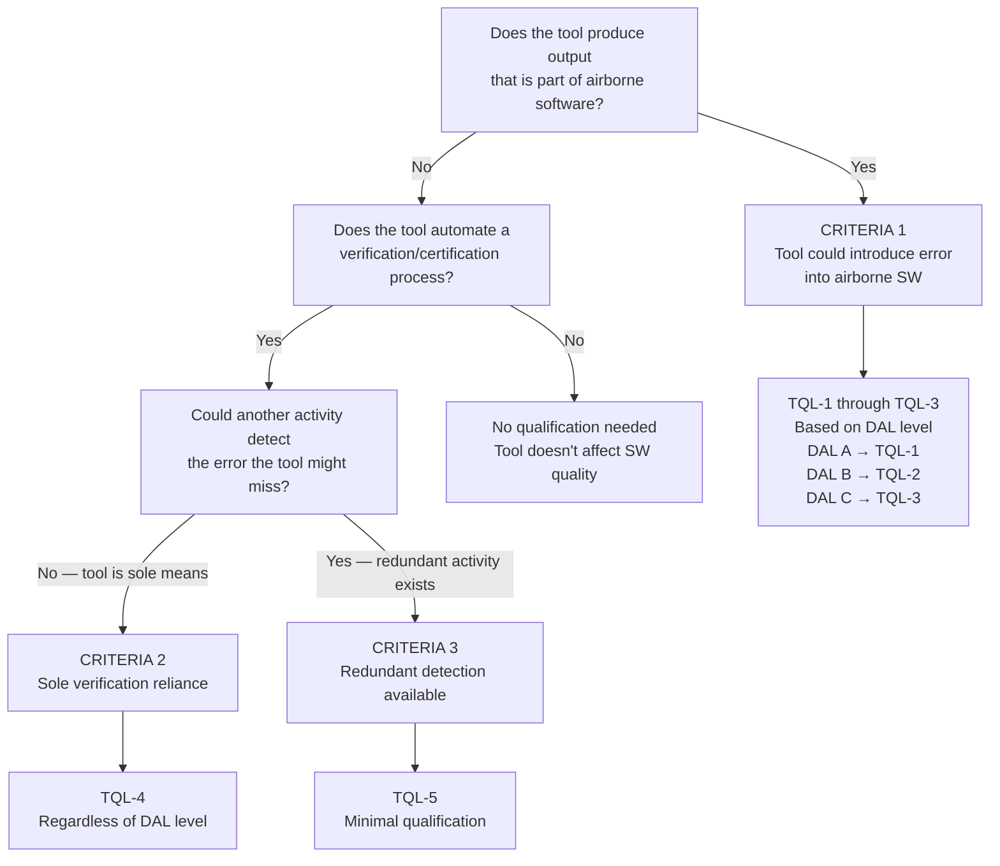
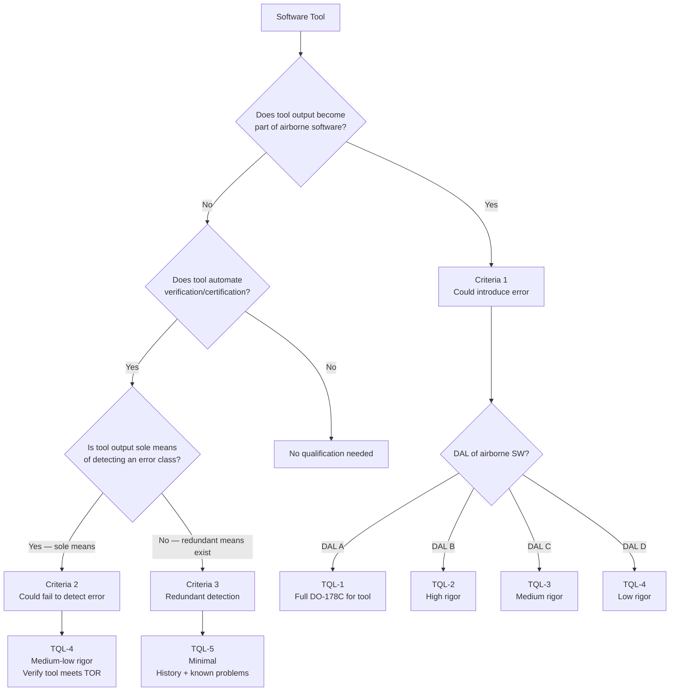

# Tool Qualification for Safety-Critical Software

**Topic:** Tool qualification processes for software development and verification tools; DO-178C §12 / DO-330; ISO 26262-8 §11; EN 50128 §6.7.4; IEC 61508-3 §7.4.4  
**Standards:** DO-330 (Software Tool Qualification Considerations), DO-178C §12, ISO 26262-8:2018 Clause 11, EN 50128:2011 §6.7.4, IEC 61508-3:2010  
**SDO:** RTCA (DO-330), ISO TC 22, CENELEC, IEC  
**Audience:** Tool qualification engineers, safety managers, certification authorities, tool vendors, QA managers  
**Prerequisites:** Safety lifecycle understanding, DO-178C or ISO 26262 basics, software tool familiarity

---

## Chapter 1 — Historical Context & Origin Story

### 1.1 Timeline

| Year | Event | Significance |
|------|-------|-------------|
| 1992 | DO-178B published | §12.2: tool qualification mentioned but minimal guidance |
| 1998 | FAA Order 8110.49 | First detailed tool qualification guidance for DO-178B |
| 2003 | CAST-18 (Certification Authorities SW Team) | Position paper on tool qualification; clarified criteria |
| 2005 | ISO 26262 development begins | Includes tool confidence level concept from start |
| 2008 | DO-330 draft | Dedicated tool qualification standard (supplement to DO-178C) |
| 2011 | **DO-330** published | First standalone standard for software tool qualification |
| 2011 | **DO-178C** published | §12 references DO-330 as the qualification standard |
| 2011 | **ISO 26262:2011** | Part 8 §11: Software tool qualification; TCL concept |
| 2011 | EN 50128:2011 | §6.7.4: Tools and their validation (T1/T2/T3 classification) |
| 2014 | First DO-330 qualified tools | VectorCAST, LDRA certified tool qualification kits |
| 2018 | ISO 26262:2018 (2nd ed.) | Part 8 §11 unchanged; more clarity on TCL assessment |
| 2020 | Tool qualification kits mature | Most safety-critical tool vendors provide pre-packaged qualification |
| 2023 | AI/ML tools | Emerging challenge: how to qualify AI-assisted development tools |

### 1.2 Why Tool Qualification Exists

If a tool is used in the development or verification of safety-critical software, and that tool has a bug, the tool's bug could:

1. **Introduce an error** into the software (e.g., buggy compiler generates wrong code)
2. **Fail to detect an error** that would be found manually (e.g., buggy static analysis misses a real bug)

If either occurs, the safety-critical software may contain undetected errors → potential safety hazard.

**Tool qualification** provides confidence that the tool functions correctly for its intended use, OR that any tool malfunction would be detected by other activities in the development process.

---

## Chapter 2 — DO-330 Architecture

### 2.1 DO-330 Overview

| Aspect | Detail |
|--------|--------|
| **Full title** | DO-330: Software Tool Qualification Considerations |
| **Published** | December 2011 |
| **Purpose** | Define processes and objectives for qualifying software tools used in DO-178C/DO-278A projects |
| **Scope** | All software tools that could affect airborne software quality |
| **Key concepts** | Tool Qualification Level (TQL 1-5); Tool Operational Requirements (TOR); Tool Qualification Plan |
| **Relationship** | DO-178C §12 says "use DO-330"; DO-330 provides the detailed process |

### 2.2 DO-178C §12 Tool Classification Criteria

| Criteria | Definition | Risk | Example |
|:--------:|-----------|:----:|---------|
| **Criteria 1** | Tool output is part of airborne software AND could introduce an error | Highest — tool bug → SW error | Compiler, linker, auto-code generator |
| **Criteria 2** | Tool automates verification/certification process AND could fail to detect an error | Medium — missed detection | Static analysis tool, test coverage tool, requirements management tool |
| **Criteria 3** | Tool automates verification AND failure to detect error would be caught by another verification activity | Low — redundant detection | Code review support tool, documentation generator (if reviewed) |

If a tool doesn't meet ANY criteria (e.g., text editor — output is reviewed by developer), it needs NO qualification.

### 2.3 Tool Qualification Levels (TQL)

| TQL | SW Level | Criteria | Rigor | Analogy to DAL |
|:---:|:--------:|:--------:|:-----:|:--------------:|
| **TQL-1** | DAL A | Criteria 1 | Highest (full DO-178C-like process for the tool) | DAL A |
| **TQL-2** | DAL B | Criteria 1 | High | DAL B |
| **TQL-3** | DAL C | Criteria 1 | Medium | DAL C |
| **TQL-4** | DAL A/B | Criteria 2 | Medium-Low | DAL D |
| **TQL-5** | DAL A/B/C | Criteria 3 | Lowest (minimal) | DAL E+ |
| — | DAL C | Criteria 2 | TQL-5 equivalent | Minimal |

### 2.4 TQL Determination Decision Tree



---

## Chapter 3 — DO-330 Qualification Process

### 3.1 Qualification Process Overview

| Phase | Activity | Output |
|:-----:|----------|--------|
| **Planning** | Define Tool Qualification Plan; identify TOR; determine TQL | Tool Qualification Plan (TQP) |
| **Development** (TQL-1 to TQL-3 only) | Develop tool to DO-178C-equivalent rigor | Tool source code; design docs |
| **Verification** | Verify tool meets TOR; test tool; review tool | Tool Verification Results; test cases |
| **Assessment** | Assess tool qualification data completeness | Tool Accomplishment Summary (TAS) |
| **Submission** | Submit to certification authority | Qualification package |

### 3.2 Tool Operational Requirements (TOR)

TOR define WHAT the tool must do correctly. They are the "requirements" for the tool.

| TOR Type | Description | Example |
|:--------:|-------------|---------|
| **Functional TOR** | What the tool does | "The compiler shall correctly translate C99 source to ARM Cortex-M4 machine code" |
| **Performance TOR** | Timing, capacity | "The tool shall analyze up to 500 KLOC within 4 hours" |
| **Interface TOR** | Input/output format | "The tool shall accept MISRA C:2012 configuration files in XML format" |
| **Environmental TOR** | Platform requirements | "The tool shall operate on Windows 10 64-bit with 16GB RAM minimum" |

### 3.3 Qualification Activities by TQL

| Activity | TQL-1 | TQL-2 | TQL-3 | TQL-4 | TQL-5 |
|:--------:|:-----:|:-----:|:-----:|:-----:|:-----:|
| Tool Qualification Plan | ✅ | ✅ | ✅ | ✅ | ✅ |
| Tool Operational Requirements | Full | Full | Full | Full | Minimal |
| Tool Requirements | Full | Full | Partial | — | — |
| Tool Design | Full | Partial | — | — | — |
| Tool Source Code | Controlled | Controlled | — | — | — |
| Tool Verification (testing) | Full | Partial | Partial | ✅ | Minimal |
| Tool Configuration Management | Full | Full | Partial | Partial | Minimal |
| Tool QA | Full | Full | Partial | — | — |
| Problem Reporting | Full | Full | Full | Partial | Minimal |

### 3.4 TQL-5 (Minimal — Most Common)

Most verification tools (static analysis, coverage tools) used alongside other verification methods qualify at **TQL-5**. This requires:

1. **Tool Qualification Plan** — document describing the qualification approach
2. **Tool Operational Requirements** — minimal; what the tool must do
3. **Tool Verification** — test cases showing tool works for its intended use
4. **History of use** — evidence of successful use on similar projects
5. **Known problem list** — documented known issues and workarounds
6. **Configuration identification** — exact tool version, platform, configuration

This is achievable in weeks, not months. Most tool vendors provide pre-packaged TQL-5 qualification kits.

---

## Chapter 4 — ISO 26262-8 §11: Tool Confidence Level

### 4.1 ISO 26262 Approach

ISO 26262 uses a different (simpler) approach than DO-330:

| Factor | Values | Question |
|:------:|--------|----------|
| **Tool Impact (TI)** | TI1: Possible to introduce/mask error<br/>TI2: Cannot introduce/mask error | Can this tool introduce or fail to detect a safety-relevant error? |
| **Tool Error Detection (TD)** | TD1: High confidence of detection<br/>TD2: Medium confidence<br/>TD3: Low confidence of detection | If the tool has a bug, will subsequent activities detect it? |

### 4.2 TCL Determination Table (ISO 26262-8 Table 4)

| TI \ TD | TD1 | TD2 | TD3 |
|:-------:|:---:|:---:|:---:|
| **TI1** | TCL1 | TCL2 | TCL3 |
| **TI2** | TCL1 | TCL1 | TCL1 |

### 4.3 Qualification Methods by TCL

| TCL | Required Method | Description | Effort |
|:---:|:---:|---|:---:|
| **TCL1** | 1a: Increased confidence from use | Document: tool version, usage history, known bugs, validation by experience | Low |
| **TCL2** | 1b: Evaluation of the tool development process + 1a | Assess vendor's development process; validate tool against requirements | Medium |
| **TCL3** | 1c: Validation of the software tool + 1b + 1a | Validate tool per safety-standard-like process; most rigorous | High |

### 4.4 Practical TCL Assessment

| Tool | Typical TI | Typical TD | TCL | Method |
|:---:|:---:|:---:|:---:|---|
| **Compiler** (production code) | TI1 (introduces errors if buggy) | TD1 (testing detects wrong output) | TCL1 | Increased confidence from use |
| **Code generator** (Simulink → C) | TI1 (generates code; could be wrong) | TD2 (back-to-back test may miss subtle bugs) | TCL2 | Evaluate development process + validate |
| **Static analysis** (sole verification) | TI1 (may fail to detect error) | TD3 (if sole means, no backup detection) | **TCL3** | Full validation |
| **Static analysis** (with testing redundancy) | TI1 | TD1 (testing also verifies; catches tool misses) | TCL1 | Increased confidence from use |
| **Unit test framework** | TI1 (buggy test = false confidence) | TD1 (integration tests catch unit test errors) | TCL1 | Increased confidence from use |
| **Requirements management tool** | TI2 (doesn't affect code content) | — | TCL1 | Increased confidence from use |
| **Text editor** | TI2 | — | TCL1 (or no qualification) | N/A (no impact on safety) |

---

## Chapter 5 — EN 50128 Tool Classification (Railway)

### 5.1 EN 50128 Tool Classes

| Class | Definition | Qualification | Example |
|:-----:|-----------|:---:|---------|
| **T1** | Tool generates no output that directly or indirectly contributes to executable code | No qualification needed | Text editor, project management tool |
| **T2** | Tool supports testing/verification; malfunction may fail to reveal error but cannot introduce one | Validated (proven in use or documented evidence) | Test coverage tool, static analysis (when redundant), debugger |
| **T3** | Tool generates output that directly or indirectly contributes to executable code for SIL ≥ 1 | Full validation required (equivalent to SW development per EN 50128) | Compiler, code generator, linker, auto-test generator |

### 5.2 EN 50128 §6.7.4 Requirements

| SIL | T1 | T2 | T3 |
|:---:|:---:|:---:|:---:|
| SIL 0 | — | — | — |
| SIL 1 | — | Validation (evidence of correctness) | Validation (SW lifecycle equivalent) |
| SIL 2 | — | Validation | Validation |
| SIL 3 | — | Validation (HR) | Validation (HR — per EN 50128 lifecycle) |
| SIL 4 | — | Validation (HR) | Validation (HR — per EN 50128 lifecycle) |

---

## Chapter 6 — Practical Tool Qualification

### 6.1 Qualification Kit Contents (Typical Vendor Package)

| Component | Purpose |
|:---------:|---------|
| **Tool Qualification Plan (TQP)** | Describes qualification approach, TQL rationale, reference to TOR |
| **Tool Operational Requirements (TOR)** | Requirements specifying what the tool does (functional, environmental) |
| **Tool Verification Cases & Procedures** | Test cases proving tool works correctly for each TOR |
| **Tool Verification Results** | Evidence of test execution (pass/fail; traceability to TOR) |
| **Tool Accomplishment Summary (TAS)** | Summary document referencing all qualification artifacts |
| **Known Problem Report** | List of known bugs/limitations; impact assessment; workarounds |
| **Configuration Index** | Exact version, patches, OS, configuration files used |
| **User Manual** | How to use the tool within its qualified envelope |
| **Deployment Guide** | Installation and configuration instructions for qualified setup |

### 6.2 Project-Specific Adaptation

Even with a vendor qualification kit, the project must:

| Activity | Why |
|:--------:|-----|
| **Document tool version** | Exact version used (patch level, service pack) |
| **Document configuration** | Compiler flags, analysis settings, enabled/disabled checks |
| **Document environment** | OS version, host hardware, file system |
| **Assess known problems** | Do any known bugs affect THIS project's code? |
| **Validate on project code** | Run qualification tests or demonstrate correct operation on representative project code |
| **Gap analysis** | Does vendor kit cover this project's use case? Any gaps? |
| **Problem reporting** | Establish process to report new tool problems found during project |

### 6.3 Qualification vs. Certification

| Aspect | Qualification | Certification |
|:------:|:---:|:---:|
| **What** | Tool is shown suitable for its intended use | Product (aircraft, car, train) meets safety standard |
| **Who performs** | Tool user (applicant) with vendor support | Applicant (OEM/Tier-1) with authority review |
| **Authority role** | Reviews and accepts qualification | Grants type certificate / homologation |
| **Scope** | Single tool on single project | Entire product lifecycle |
| **Reuse** | Qualification MAY be reusable across projects (if same TOR, config, version) | Not transferable |

---

## Chapter 7 — Comparison Across Standards

### 7.1 Cross-Standard Comparison

| Aspect | DO-330 (Aerospace) | ISO 26262-8 §11 (Auto) | EN 50128 (Railway) | IEC 61508-3 (Industrial) |
|:------:|:---:|:---:|:---:|:---:|
| **Classification** | Criteria 1/2/3 | TI (1/2) × TD (1/2/3) | Class T1/T2/T3 | Based on §7.4.4 |
| **Levels** | TQL 1-5 | TCL 1-3 | SIL-dependent | SIL-dependent |
| **Rigor at top** | TQL-1 (full DO-178C for tool) | TCL3 (validate per safety standard) | T3 + SIL 4 (full EN 50128) | §7.4.4.2 (validate) |
| **Most common** | TQL-5 (minimal) | TCL1 (increased confidence) | T2 (validated in use) | Proven in use |
| **Dedicated standard** | **Yes** — DO-330 (standalone) | **No** — part of ISO 26262-8 | **No** — part of EN 50128 | **No** — part of IEC 61508-3 |
| **Complexity** | High (most detailed process) | Medium (practical; well-defined tables) | Medium-Low | Low |

### 7.2 Tool Type Mapping Across Standards

| Tool | DO-330 | ISO 26262 | EN 50128 |
|:---:|:---:|:---:|:---:|
| **Compiler** | Criteria 1 → TQL-1/2/3 | TI1+TD1 → TCL1 (usually) | T3 |
| **Code generator** | Criteria 1 → TQL-1/2/3 | TI1+TD2 → TCL2 | T3 |
| **Static analysis (sole)** | Criteria 2 → TQL-4 | TI1+TD3 → **TCL3** | T2 (validation HR) |
| **Static analysis (redundant)** | Criteria 3 → TQL-5 | TI1+TD1 → **TCL1** | T2 (validation) |
| **Coverage tool** | Criteria 3 → TQL-5 | TI1+TD1 → TCL1 | T2 |
| **Test framework** | Criteria 2/3 → TQL-4/5 | TI1+TD1 → TCL1 | T2 |
| **Requirements tool** | No criteria → none | TI2 → TCL1 | T1 (none) |
| **Text editor** | No criteria → none | TI2 → TCL1 (or none) | T1 (none) |

---

## Chapter 8 — Mermaid Architecture Diagrams

### 8.1 DO-330 TQL Determination



### 8.2 ISO 26262 Tool Confidence Level Process

```mermaid
sequenceDiagram
    participant ENG as Safety Engineer
    participant TOOL as Tool Under Assessment
    participant VENDOR as Tool Vendor
    participant AUD as Assessor
    
    ENG->>TOOL: Identify tool in safety plan
    ENG->>ENG: Determine Tool Impact (TI1 or TI2)
    
    Note over ENG: TI1: Can introduce/mask error?<br/>TI2: Cannot affect safety?
    
    ENG->>ENG: Determine Tool Error Detection (TD1/TD2/TD3)
    
    Note over ENG: TD1: High — testing will catch tool errors<br/>TD2: Medium — some detection<br/>TD3: Low — tool is sole means
    
    ENG->>ENG: Look up TCL (TI × TD table)
    
    alt TCL1 — Increased confidence from use
        ENG->>VENDOR: Request usage history, known bugs
        VENDOR-->>ENG: Version info, bug database, user base
        ENG->>ENG: Document "increased confidence from use"
    else TCL2 — Evaluate development process
        ENG->>VENDOR: Request development process evidence
        VENDOR-->>ENG: QMS, testing process, release process
        ENG->>ENG: Evaluate + validate tool on project
    else TCL3 — Validate the tool
        ENG->>VENDOR: Request validation kit / qualification package
        VENDOR-->>ENG: Qualification kit (TOR, tests, results)
        ENG->>ENG: Execute validation; verify against TOR
    end
    
    ENG->>AUD: Submit tool qualification evidence
    AUD-->>ENG: Accepted ✓
```

---

## Chapter 9 — Case Studies

### 9.1 DO-178C DAL A: Qualifying a Compiler (TQL-1)

| Aspect | Detail |
|--------|--------|
| **Tool** | Custom GCC cross-compiler for PowerPC target; modified for avionics (custom optimizations disabled; safety flags enforced) |
| **Project** | Flight control computer; DO-178C DAL A |
| **TQL** | TQL-1 (Criteria 1 — compiler output IS the airborne software; DAL A) |
| **Challenge** | TQL-1 requires developing the tool to DO-178C-equivalent rigor; impractical for GCC (millions of LOC; open source; not developed per DO-178C) |
| **Alternative approach** | (1) Use compiler with all optimizations disabled (reduces risk of optimization bugs). (2) Object code verification: manually/tool-verify that assembly matches C semantics for critical functions. (3) Object code structural coverage (DO-178C §6.4.4.2 Additional Verification at object level). (4) This reduces effective TQL: compiler IS Criteria 1, but additional verification activity (object code review) provides error detection → effectively reduces to TQL-4/5 equivalent effort |
| **Alternative 2** | Use CompCert (formally verified compiler): mathematically proven correct → no qualification needed for the translation step (correctness is proven) |
| **Industry practice** | Most DAL A projects use option (1): standard compiler + object code verification + structural coverage at object level. Very few projects actually do full TQL-1 for the compiler. |
| **Lesson** | TQL-1 for a compiler is essentially impractical; industry uses alternative means (object code verification, CompCert) to provide equivalent assurance |

### 9.2 ISO 26262: Qualifying Static Analysis Tool (TCL1)

| Aspect | Detail |
|--------|--------|
| **Tool** | Helix QAC v2023.1; MISRA C:2012 checking |
| **Project** | Automotive braking system; ASIL D; 200 KLOC C |
| **Assessment** | TI1 (could fail to detect MISRA violation → coding error remains) + TD1 (code review + unit testing also verify the code → redundant detection) = **TCL1** |
| **Qualification method** | "Increased confidence from use" |
| **Evidence package** | (1) Tool identification: Helix QAC v2023.1 on Windows 10, MISRA C:2012 amendment 2 checker configuration. (2) Vendor documentation: 20+ years of use in automotive industry; used by 15+ OEMs. (3) Known bugs: vendor bug database reviewed; 3 known issues — none affect this project's code patterns. (4) Project experience: used on 5 prior ASIL D projects by this team without incorrect results. (5) Validation evidence: ran tool on 50 synthetic test cases (known MISRA violations + known compliant code); 100% correct detection rate. |
| **Effort** | ~2 person-days (documentation + synthetic test execution) |
| **Result** | Assessor accepted TCL1 evidence; tool qualified for project use |

### 9.3 Automotive Code Generator: Simulink Embedded Coder (TCL2)

| Aspect | Detail |
|--------|--------|
| **Tool** | MathWorks Embedded Coder (code generation from Simulink models) |
| **Project** | Electric motor controller; ASIL C; model-based development |
| **Assessment** | TI1 (generates code; bug in generator → wrong code) + TD2 (back-to-back testing provides medium detection; subtle timing bugs may not be caught) = **TCL2** |
| **Qualification method** | "Evaluation of development process" + validation |
| **Evidence** | (1) MathWorks IEC Certification Kit (vendor-provided): development process description (ISO 9001 + automotive process); traceability from requirements to implementation; known limitations document. (2) Project validation: back-to-back testing (model simulation vs. generated code on target) for representative test scenarios; all results match within tolerance. (3) Process assessment: reviewed MathWorks' V&V process; inspected test infrastructure; assessed bug reporting/fix cycle. |
| **Effort** | ~4 person-weeks (process assessment + back-to-back test campaign + documentation) |
| **Additional measure** | MISRA C:2012 compliance checking on generated code (Helix QAC); any MISRA violations in generated code are reported to MathWorks as code generator issues |

---

## Chapter 10 — Future Evolution

| Trend | Timeline | Impact |
|-------|----------|--------|
| **AI tool qualification** | 2024-2028 | How to qualify ML-based tools (AI code assistants, AI test generators)? Non-deterministic output challenges traditional qualification |
| **Continuous qualification** | 2024-2026 | Tool updates in CI/CD pipelines; need rapid re-qualification on tool version change; DevOps vs. traditional waterfall qualification |
| **Tool qualification as a service** | 2024-2027 | Cloud-based tool qualification; automated evidence generation; SaaS tools qualification |
| **Open-source tool qualification** | 2024-2027 | Community-maintained qualification packages for open tools (GCC, clang, cppcheck); shared qualification data |
| **Harmonization across domains** | 2025-2030 | DO-330 / ISO 26262 / EN 50128 convergence; single qualification accepted across domains |
| **Qualified Rust toolchain** | 2024-2027 | Ferrocene (ISO 26262 + IEC 61508); rustc qualification for safety-critical |

---

## Chapter 11 — Interview Questions & Career Guide

### Tier 1: Entry-Level

**Q1:** Why do tools used in safety-critical software development need to be qualified? Give an example.

**A:** Tools need qualification because a bug in a tool could compromise the safety of the final software product. There are two risks: (1) A tool could **introduce** an error (e.g., a compiler bug that generates wrong machine code from correct C source — the programmer wrote correct code, but the compiled binary behaves incorrectly). (2) A tool could **fail to detect** an error (e.g., a static analysis tool has a bug that causes it to miss a real MISRA violation or buffer overflow — the engineer relies on the tool's "clean" report but the bug exists).

**Example**: A compiler optimization bug transforms `if (x != NULL) { *x = 5; }` into `*x = 5;` (removing the NULL check due to an optimizer bug). In safety-critical avionics, this could cause a null pointer dereference → system crash. Compiler qualification ensures we have confidence the compiler works correctly, OR we have other activities (like object code review) that would catch such errors.

Tool qualification doesn't mean the tool is perfect — it means we have appropriate confidence that the tool works correctly for our specific use, and/or that any tool errors would be caught by other verification activities.

### Tier 2: Mid-Level

**Q2:** Explain the difference between DO-330 TQL-4 and TQL-5. When would each apply? How do you determine which level a static analysis tool needs?

**A:** **TQL-4** applies to tools classified as **Criteria 2**: the tool automates a verification process, and it is the **sole means** of verifying a particular property. If the tool has a bug and fails to detect an error, no other activity in the process would catch that error. This requires more rigorous qualification: full Tool Operational Requirements (TOR), tool verification testing against TOR, documented verification results.

**TQL-5** applies to tools classified as **Criteria 3**: the tool automates verification, but there are **other redundant activities** that would catch the error if the tool missed it. The tool is "one of many" verification layers. Minimal qualification: history of use, known problems, basic verification.

**For static analysis**: The key question is "Is this tool the ONLY thing checking for this type of error?"

- If static analysis is the **sole** verification for MISRA compliance (no code review for MISRA, no other MISRA checker) → **Criteria 2 → TQL-4**. Must fully test the tool against its operational requirements.
- If static analysis runs alongside code review where reviewers ALSO check MISRA rules → **Criteria 3 → TQL-5**. Because even if the tool misses a violation, the reviewer should catch it (redundant detection).

**Practical tip**: Most projects argue for TQL-5 by ensuring redundant verification exists. This is why many organizations maintain code review as a parallel activity — it provides the redundancy that allows tools to qualify at TQL-5 instead of TQL-4, dramatically reducing qualification effort.

### Tier 3: Senior

**Q3:** Your project uses: (1) GCC compiler for ARM target, (2) Polyspace Bug Finder for MISRA checking, (3) Polyspace Code Prover for proving no runtime errors, (4) VectorCAST for unit test + MC/DC coverage, (5) DOORS for requirements management. The project is DO-178C DAL A. Determine the TQL for each tool and outline the qualification strategy.

**A:**

**(1) GCC Compiler** → **Criteria 1, TQL-1** (output IS the airborne software; DAL A → TQL-1). However, TQL-1 for GCC is impractical (millions of LOC; not developed per DO-178C). **Strategy**: Do NOT attempt TQL-1 for GCC. Instead: (a) Perform additional verification of object code (DO-178C §6.4.4.2c — structural coverage at source-to-object level); (b) Review compiler-generated assembly for critical functions; (c) Disable aggressive optimizations (-O0 or -O1 with specific safe flags); (d) Document this as "alternative means of compliance" with object code verification providing equivalent confidence. DER must agree. Alternative: Use CompCert for critical modules (proven correct → no qualification needed for translation).

**(2) Polyspace Bug Finder (MISRA)** → Classification depends on usage: If Bug Finder is the SOLE MISRA verification → Criteria 2 → **TQL-4**. If Bug Finder + Helix QAC + code review all check MISRA → Criteria 3 → **TQL-5**. **Strategy**: Ensure code review also checks MISRA (or add Helix QAC as second checker) → argue TQL-5. Provide: vendor qualification kit (MathWorks IEC Certification Kit includes DO qualification data); known limitations; version identification; project-specific validation tests.

**(3) Polyspace Code Prover** → If used as sole proof of no runtime errors (replacing testing for these properties per DO-333) → **Criteria 2 → TQL-4**. If used alongside runtime testing that also verifies these properties → **Criteria 3 → TQL-5**. **Strategy for TQL-4**: MathWorks provides DO-330 TQL-4/5 qualification kit. Execute vendor-provided verification test suite. Document TOR: "Polyspace Code Prover shall correctly classify runtime error checks as green/red/orange for C99 code compiled with [specific compiler flags]." Run on project representative code and independently verify a sample of results.

**(4) VectorCAST (unit test + MC/DC)** → Criteria 2/3 depending on usage. Test framework that executes tests: if a bug in VectorCAST could cause a test to pass when it should fail → Criteria 2 → **TQL-4**. BUT: integration testing on target would also catch functional errors → Criteria 3 → **TQL-5**. **Strategy**: VectorCAST provides DO-330 TQL-5 qualification kit. Use vendor kit; validate on project code; document version and configuration.

**(5) DOORS (requirements)** → No criteria met (DOORS doesn't produce airborne code, doesn't automate verification in the DO-178C sense; requirements are REVIEWED by humans regardless) → **No qualification needed**. Document in tool qualification plan: "DOORS is used for requirements management; output (requirements text) is reviewed by engineers; tool does not automate any verification activity; no qualification required per DO-330."

**Summary table for this project**:
| Tool | Criteria | TQL | Effort |
|:---:|:---:|:---:|---|
| GCC | 1 (mitigated) | TQL-1 → object code verification alternative | Medium (object code review) |
| Polyspace Bug Finder | 3 (with review redundancy) | TQL-5 | Low (vendor kit) |
| Polyspace Code Prover | 2 (sole proof) or 3 | TQL-4 or TQL-5 | Medium (vendor kit + validation) |
| VectorCAST | 3 | TQL-5 | Low (vendor kit) |
| DOORS | None | None | None |

---

## Chapter 12 — Cheat Sheet & Quick Reference

```
═══════════════════════════════════════════
TOOL QUALIFICATION — QUICK REFERENCE
═══════════════════════════════════════════

DO-330 CRITERIA:
  Criteria 1: Tool output IS part of airborne SW (compiler, code gen)
  Criteria 2: Tool automates verification; SOLE means of detection
  Criteria 3: Tool automates verification; REDUNDANT detection exists
  No criteria: Tool doesn't affect SW quality (text editor, DOORS)

═══════════════════════════════════════════
DO-330 TQL LEVELS:
  TQL-1: Criteria 1 + DAL A (full DO-178C for tool — rarely done)
  TQL-2: Criteria 1 + DAL B (high rigor)
  TQL-3: Criteria 1 + DAL C (medium rigor)
  TQL-4: Criteria 2 any DAL (verify tool meets TOR)
  TQL-5: Criteria 3 any DAL (minimal: history + known bugs)

═══════════════════════════════════════════
ISO 26262-8 §11:
  TI1 × TD1 = TCL1 (increased confidence from use)
  TI1 × TD2 = TCL2 (evaluate development process)
  TI1 × TD3 = TCL3 (validate the tool)
  TI2 × any = TCL1 (no safety impact)

═══════════════════════════════════════════
EN 50128 CLASSES:
  T1: No contribution to executable (no qualification)
  T2: Verification support; cannot introduce error (validate)
  T3: Contributes to executable (full validation per SIL)

═══════════════════════════════════════════
PRACTICAL STRATEGY:
  • Add redundant verification → Criteria 3 → TQL-5 (saves effort)
  • Use vendor qualification kits (pre-packaged evidence)
  • Compiler: use object code verification OR CompCert
  • Document exact version + configuration + OS
  • Assess known bugs against YOUR code
  • Re-qualify on version change (or justify equivalence)

═══════════════════════════════════════════
COMMON TOOL CLASSIFICATIONS:

  Compiler:        Criteria 1 → TQL-1/2/3 (mitigated via obj code)
  Code generator:  Criteria 1 → TQL-1/2/3
  Static analysis: Criteria 2 or 3 → TQL-4 or TQL-5
  Coverage tool:   Criteria 3 → TQL-5 (usually)
  Test framework:  Criteria 2 or 3 → TQL-4 or TQL-5
  Req. mgmt tool:  No criteria → none
  IDE/editor:      No criteria → none

═══════════════════════════════════════════
QUALIFICATION KIT CONTENTS (from vendor):
  1. Tool Qualification Plan (TQP)
  2. Tool Operational Requirements (TOR)
  3. Test cases + procedures
  4. Test results (evidence)
  5. Known problem report
  6. Configuration index (version/platform)
  7. Tool Accomplishment Summary (TAS)
  8. User manual (qualified usage envelope)

═══════════════════════════════════════════
KEY INSIGHT:
  Qualification ≠ "tool is bug-free"
  Qualification = "confidence tool works for OUR use"
                + "if it doesn't, we'd detect it"
```

---

*End of Document — 08_Tool_Qualification.md*
