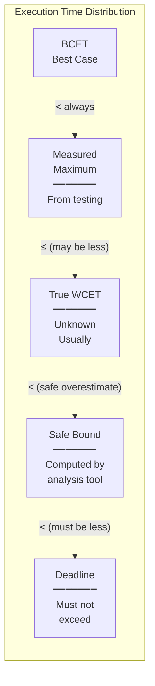
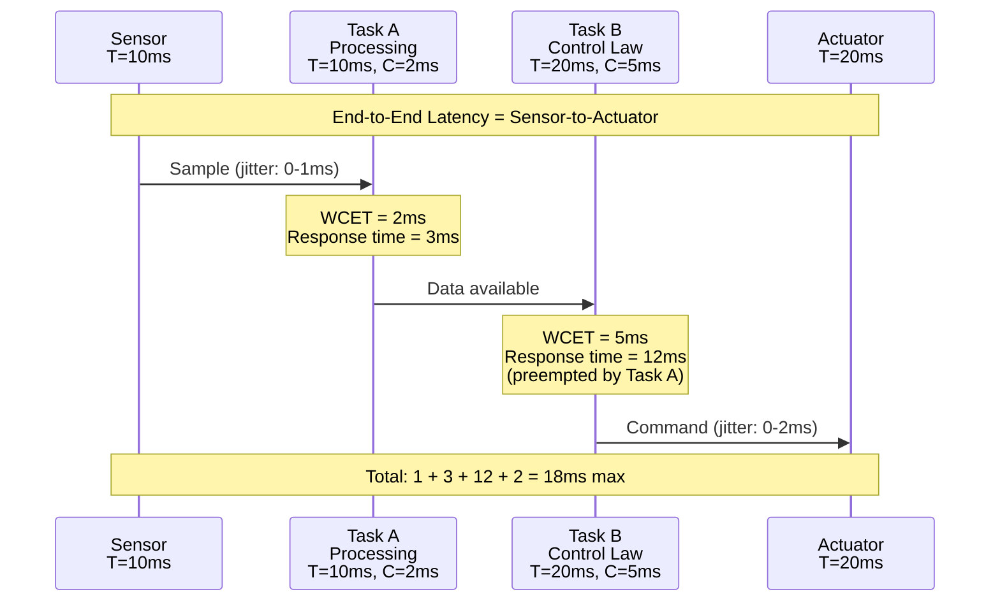
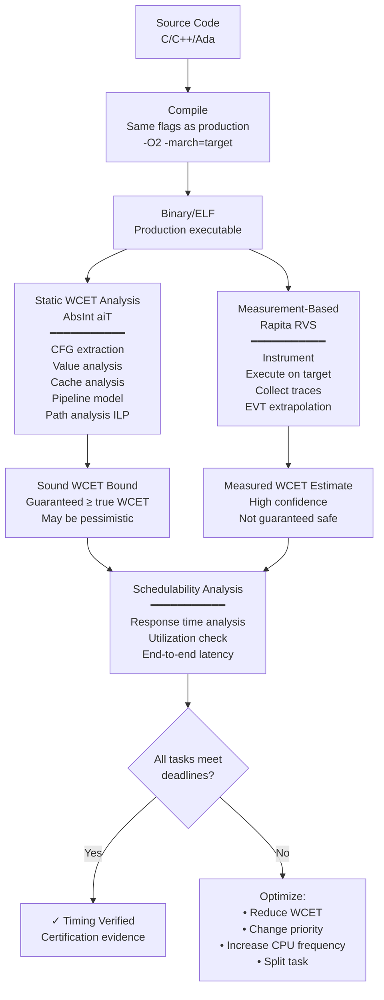
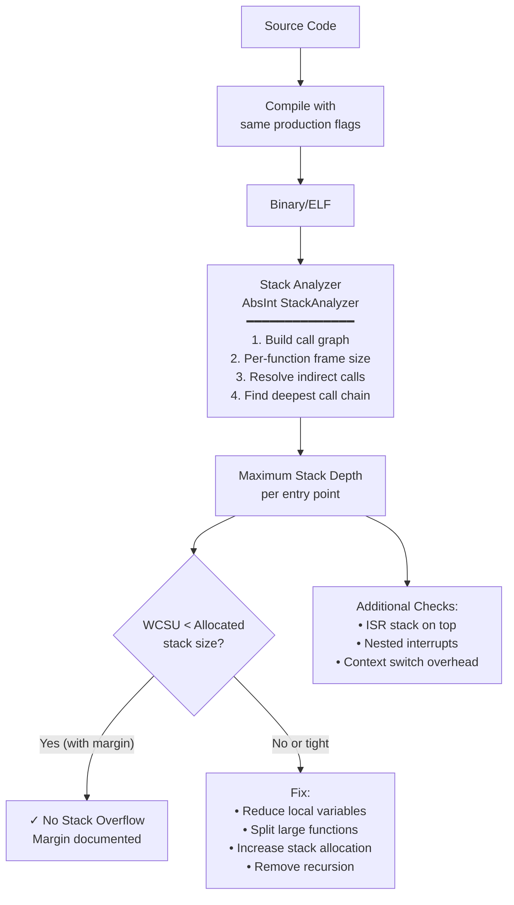

# WCET & Stack Analysis for Safety-Critical Software

**Topic:** Worst-Case Execution Time (WCET) analysis; stack depth analysis (WCSU); timing verification; schedulability proof; tools (AbsInt aiT, Rapita RVS, LDRA)  
**Standards:** DO-178C §6.3.4 (Timing and Memory), ISO 26262-6 §9.4.2, AUTOSAR Timing Extensions, ARINC 653 (Time Partitioning), OSEK timing protection  
**SDO:** RTCA, ISO TC 22, AUTOSAR, ARINC, OSEK/VDX  
**Audience:** Real-time systems engineers, RTOS developers, safety engineers, schedulability analysts, timing verification engineers  
**Prerequisites:** Real-time operating systems, scheduling theory, CPU architecture, cache/pipeline understanding, stack frame concepts

---

## Chapter 1 — Historical Context & Origin Story

### 1.1 Timeline

| Year | Event | Significance |
|------|-------|-------------|
| 1973 | Liu & Layland: Rate Monotonic Analysis | Foundation of real-time scheduling theory |
| 1985 | Puschner & Koza: first WCET paper | Formalizing worst-case execution time as analysis problem |
| 1993 | AbsInt founded (Saarbrücken) | Commercial WCET analysis (later: aiT) |
| 1995 | Joseph & Pandya: response time analysis | Exact schedulability analysis for fixed-priority |
| 1997 | ARINC 653 published | Time partitioning for integrated modular avionics |
| 2000 | AbsInt aiT first release | First commercial sound WCET analyzer (abstract interpretation) |
| 2001 | Rapita Systems founded (York, UK) | Measurement-based WCET analysis; hybrid approach |
| 2003 | Wilhelm et al.: WCET survey paper | Landmark paper defining WCET analysis state-of-art |
| 2006 | Worst-Case Stack Usage (WCSU) | Dedicated static stack analysis tools emerge |
| 2008 | AbsInt StackAnalyzer released | Sound static stack analysis for safety-critical |
| 2011 | DO-178C §6.3.4 | Timing and memory verification explicitly required |
| 2015 | Multi-core WCET challenge | Multi-core interference makes WCET dramatically harder |
| 2017 | CAST-32A: Multi-Core Certification | Guidance for multi-core timing in DO-178C projects |
| 2020 | AUTOSAR adaptive timing | Modern automotive timing requirements for AUTOSAR Adaptive |
| 2023 | AI-assisted WCET estimation | ML-based prediction of WCET bounds; probabilistic approaches |

### 1.2 Why WCET Matters

In real-time safety-critical systems, **missing a deadline IS a system failure**:

| Domain | Consequence of Missing Deadline |
|:------:|------|
| **Aerospace** | Flight control law not computed in time → actuator command delayed → aircraft instability → catastrophic |
| **Automotive** | ABS/ESC braking algorithm misses 10ms deadline → braking force incorrect → vehicle loss of control → fatal |
| **Railway** | Signaling decision delayed → conflicting routes → train collision |
| **Medical** | Pacemaker stimulus delayed → cardiac arrhythmia → patient death |
| **Industrial** | Safety PLC misses scan cycle → protective shutdown delayed → equipment damage / injury |

**WCET analysis** proves that tasks ALWAYS complete within their deadline, for ALL possible inputs and ALL possible execution scenarios.

---

## Chapter 2 — WCET Analysis Fundamentals

### 2.1 Definitions

| Term | Definition | Symbol |
|:----:|-----------|:------:|
| **BCET** | Best-Case Execution Time — minimum time a task takes | $C_{min}$ |
| **WCET** | Worst-Case Execution Time — maximum time a task takes | $C_{max}$ or $C$ |
| **Measured Maximum** | Longest observed execution during testing | $C_{meas}$ |
| **WCET Bound** | Proven upper bound on execution time (≥ true WCET) | $\hat{C}$ |
| **Deadline** | Maximum allowed execution time for a task | $D$ |
| **Period** | Time between successive task activations | $T$ |
| **Response Time** | Time from activation to completion (includes preemption) | $R$ |
| **Slack** | Time remaining between WCET and deadline: $D - C$ | — |
| **Utilization** | Fraction of CPU time used: $U = \frac{C}{T}$ | $U$ |

### 2.2 The WCET Problem



**Key relationships:**
$$C_{min} \leq C_{meas} \leq C_{max} \leq \hat{C} < D$$

The true WCET ($C_{max}$) is generally **undecidable** (halting problem). We compute a **safe upper bound** ($\hat{C}$) such that the real WCET never exceeds it. The bound must be less than the deadline.

### 2.3 Why Testing Alone Cannot Determine WCET

| Reason | Explanation |
|:------:|-------------|
| **Input space** | Cannot test all possible inputs (combinatorial explosion) |
| **Cache state** | Initial cache state affects timing; testing may never hit worst-case cache scenario |
| **Pipeline state** | Branch prediction history, pipeline stalls depend on execution history |
| **Preemption** | Interrupt/preemption timing varies; testing may not trigger worst-case preemption pattern |
| **Multi-core interference** | Shared bus/memory contention depends on other cores' behavior; hard to replicate worst case |
| **Observation gap** | Measured max is ALWAYS ≤ true WCET; gap may be 10-50% or more |

**Standards requirement**: DO-178C §6.3.4 requires demonstration that tasks execute within time and memory budgets. Testing alone is insufficient evidence for the highest DALs.

---

## Chapter 3 — WCET Analysis Methods

### 3.1 Static WCET Analysis

| Aspect | Description |
|--------|-------------|
| **Approach** | Analyze program WITHOUT executing it; compute safe upper bound mathematically |
| **Technique** | Abstract interpretation of (1) program flow (paths) and (2) hardware behavior (cache, pipeline, bus) |
| **Tools** | **AbsInt aiT**, Bound-T, OTAWA, Chronos |
| **Guarantee** | **Sound** — computed bound is ALWAYS ≥ true WCET (safe overestimate) |
| **Advantage** | Covers ALL execution paths; no test vectors needed; mathematical guarantee |
| **Disadvantage** | Over-estimation (pessimism) due to infeasible paths; requires accurate hardware model; limited to supported processors |

**Two-phase approach:**

| Phase | Analysis | Purpose |
|:-----:|----------|---------|
| **Value analysis** | Abstract interpretation of data flow; determine variable ranges | Used to resolve branch conditions; loop bounds |
| **Control flow analysis** | Determine possible execution paths; build control flow graph | Identify loops; compute IPET (Implicit Path Enumeration) |
| **Cache analysis** | Classify each memory access as: Always Hit / Always Miss / Unknown | Determine cache-related timing |
| **Pipeline analysis** | Model pipeline behavior; stalls; forwarding | Determine pipeline-related timing |
| **Path analysis** | Find longest path through CFG with timing annotations | Final WCET bound computation (ILP solver) |

### 3.2 Measurement-Based WCET Analysis

| Aspect | Description |
|--------|-------------|
| **Approach** | Execute program on real hardware; measure execution time; apply statistical/analytical methods to estimate WCET |
| **Tools** | **Rapita RVS (RapiTime)**, LDRA TBvision (timing), Lauterbach TRACE32 |
| **Technique** | Run many test cases; record execution times; apply Extreme Value Theory (EVT) to extrapolate worst case |
| **Advantage** | No hardware model needed; works on ANY processor; accounts for real hardware behavior |
| **Disadvantage** | Not sound (measured max may be less than true WCET); statistical confidence only; needs good test coverage |
| **Certification** | Accepted by DO-178C when combined with analysis arguments; Rapita RVS qualified for DO-178C |

### 3.3 Hybrid Analysis

| Aspect | Description |
|--------|-------------|
| **Approach** | Combine static analysis (for structure) with measurements (for hardware timing) |
| **How** | Static analysis provides path structure and loop bounds; measurements provide per-block execution times on real hardware |
| **Tools** | Rapita RVS (hybrid mode), AbsInt aiT + measurements |
| **Advantage** | More accurate than pure static (uses real hardware timing); more complete than pure measurement (covers all paths) |
| **Accepted by** | DO-178C, ISO 26262 (most practical approach for modern complex processors) |

### 3.4 Method Comparison

| Aspect | Pure Static | Measurement-Based | Hybrid |
|:------:|:---:|:---:|:---:|
| **Soundness** | ✅ Guaranteed safe | ❌ Statistical only | Partial (path coverage sound) |
| **Accuracy** | Pessimistic (10-50% over) | Optimistic (may underestimate) | Balanced |
| **Hardware model needed** | Yes (detailed; expensive to develop) | No | Partial |
| **Processor support** | Limited (must be modeled) | Any | Any (with measurement) |
| **Multi-core** | Very difficult | Feasible (measure interference) | Practical |
| **Certification** | DO-178C preferred | DO-178C accepted (with arguments) | DO-178C accepted |
| **Representative tool** | AbsInt aiT | Rapita RapiTime | Rapita RVS (hybrid) |

---

## Chapter 4 — Stack Analysis (WCSU)

### 4.1 Stack Depth Problem

Each function call uses stack space for: local variables, return address, saved registers, parameter passing.

If the stack grows beyond allocated size → **stack overflow** → memory corruption → unpredictable behavior → catastrophic failure.

$$\text{WCSU} = \max_{\text{all paths}} \left( \sum_{\text{call chain}} \text{frame\_size}(f_i) + \text{interrupt\_stack} \right)$$

### 4.2 What Stack Analysis Determines

| Property | Analysis |
|:--------:|---------|
| **Maximum stack depth** | Worst-case call chain from entry point through all possible function calls |
| **Per-function stack usage** | Frame size of each function (locals + temporaries + alignment) |
| **Call graph** | Complete call graph (including indirect calls via function pointers) |
| **Recursion detection** | Identify recursive calls (often forbidden in safety-critical: MISRA C Rule 17.2) |
| **Interrupt stack** | Additional stack needed when interrupts nest on top of normal execution |
| **Stack margin** | Remaining stack space at worst case (slack between WCSU and allocated stack) |

### 4.3 Stack Analysis Tools

| Tool | Vendor | Approach | Qualification |
|:---:|:---:|---|:---:|
| **AbsInt StackAnalyzer** | AbsInt | Static analysis of binary; sound; resolves indirect calls | DO-178C qualified |
| **LDRA TBvision** | LDRA | Static stack analysis; call graph; max depth calculation | DO-178C qualified |
| **GCC -fstack-usage** | GCC | Compiler reports per-function stack usage (not call graph) | Not qualified |
| **arm-none-eabi-gcc -Wstack-usage=N** | GCC ARM | Warning if function exceeds N bytes stack | Not qualified |
| **Polyspace** | MathWorks | Reports stack overflow risk (orange/red) via abstract interpretation | ISO 26262 qualified |

### 4.4 Stack Analysis Challenges

| Challenge | Description | Mitigation |
|:---------:|-------------|-----------|
| **Indirect calls** | Function pointer calls: which function is called? | Static analysis of pointer targets; manual annotation; restrict to known set (MISRA Rule 17.7) |
| **Recursion** | Unbounded stack growth | **Forbid recursion** (MISRA C Rule 17.2; AUTOSAR; JPL Rule 1) |
| **Dynamic allocation** | `alloca()`, variable-length arrays (VLA) | **Forbid VLA and alloca** (MISRA C Rule 18.8) |
| **Interrupt nesting** | Interrupt on top of interrupt on top of task | Define maximum nesting depth; allocate per interrupt level |
| **Compiler optimization** | Inlining changes stack usage; optimization level affects frame size | Analyze at same optimization level as production build |
| **Multi-core** | Per-core stack analysis | Analyze each core independently |

---

## Chapter 5 — Standards Requirements

### 5.1 DO-178C §6.3.4 (Timing and Memory)

| Requirement | Description |
|:-----------:|-------------|
| §6.3.4 | "Verification of memory and timing... shall confirm that memory is not exceeded (stack overflow is not possible) and that the executable object code will execute within the specified time limits" |
| Evidence required | Demonstrate: (1) No stack overflow for any execution path. (2) All tasks meet their deadlines. (3) Memory usage within allocated budgets. |
| Method | Analysis, testing, or combination |

### 5.2 ISO 26262-6 §9.4.2

| ASIL | Resource Usage Analysis | Timing Verification |
|:----:|:---:|:---:|
| A | Recommended (+) | Recommended (+) |
| B | Highly recommended (++) | Highly recommended (++) |
| C | Highly recommended (++) | Highly recommended (++) |
| D | Highly recommended (++) | Highly recommended (++) |

ISO 26262-6 Table 10: "Verification of resource usage" — includes stack usage, heap usage, execution time budget.

### 5.3 AUTOSAR Timing Requirements

| Concept | Description |
|:-------:|-------------|
| **Timing Protection** | OS enforces execution time budgets; kills task if WCET exceeded |
| **Execution Budget** | Maximum CPU time allowed per task activation (configured in OS) |
| **Inter-Arrival Time** | Minimum time between successive task activations |
| **Lock Budget** | Maximum time a task can hold a resource lock |
| **Time Frame** | Periodic window for OS enforcement |

---

## Chapter 6 — AbsInt aiT Deep Dive

### 6.1 aiT Architecture

| Component | Function |
|:---------:|---------|
| **Binary reader** | Reads compiled binary (ELF); disassembles; builds CFG from machine code |
| **Value analysis** | Abstract interpretation: computes possible values of registers/memory at each program point |
| **Loop bound analysis** | Determines maximum loop iteration counts (from value analysis or user annotation) |
| **Cache analysis** | Classifies each memory access: Always Hit (AH), Always Miss (AM), Not Classified (NC) |
| **Pipeline analysis** | Models processor pipeline; computes execution time per basic block accounting for stalls, forwarding, branch prediction |
| **Path analysis** | IPET (Implicit Path Enumeration Technique) using ILP solver; finds longest path through CFG |
| **Result** | **Sound WCET upper bound** in clock cycles (convertible to time via clock frequency) |

### 6.2 Supported Processors

| Processor | Pipeline | Cache | Used In |
|:---------:|:--------:|:-----:|---------|
| ARM Cortex-M (0/3/4/7) | In-order | Simple/None | Automotive ECU, industrial |
| ARM Cortex-A (7/9/15/53) | In-order/Out-of-order | Multi-level | ADAS, infotainment gateway |
| PowerPC e500/e6500 | In-order (dual-issue) | L1+L2 | Avionics (Freescale/NXP) |
| LEON3/4 (SPARC) | In-order | L1 | Space (ESA) |
| TriCore (Infineon) | Dual-pipeline | Scratchpad + cache | Automotive ECU (AUTOSAR) |
| Renesas RH850 | In-order | L1 | Automotive (Japan) |

### 6.3 Annotation Requirements

| Annotation Type | When Needed | Example |
|:---:|---|---|
| **Loop bound** | Compiler cannot determine max iterations | `/* @loop bound 100 */` |
| **Flow constraint** | Infeasible path elimination | `/* @flow a + b <= 5 */` |
| **Recursion bound** | If recursion exists (rare in safety-critical) | `/* @recursion depth 3 */` |
| **Call target** | Indirect call via function pointer | `/* @targets func_a, func_b */` |
| **Context** | Context-sensitive analysis (calling context affects timing) | Different WCET for same function depending on caller |

---

## Chapter 7 — Schedulability Analysis

### 7.1 Rate Monotonic Analysis (RMA)

For N periodic tasks with fixed priorities (rate monotonic assignment: shortest period = highest priority):

**Utilization bound test** (sufficient but not necessary):

$$U = \sum_{i=1}^{N} \frac{C_i}{T_i} \leq N(2^{1/N} - 1)$$

| N | Bound | Converges to |
|:--:|:-----:|:---:|
| 1 | 1.000 | ln(2) ≈ 0.693 |
| 2 | 0.828 | |
| 3 | 0.780 | |
| 5 | 0.743 | |
| ∞ | 0.693 | ln(2) |

If $U \leq N(2^{1/N} - 1)$: **schedulable** (guaranteed).
If $U > 1$: **NOT schedulable** (overloaded).
If $N(2^{1/N}-1) < U \leq 1$: inconclusive; use exact response time analysis.

### 7.2 Response Time Analysis (Exact)

For task $\tau_i$ with fixed priority $i$ (higher number = higher priority):

$$R_i = C_i + \sum_{j \in hp(i)} \left\lceil \frac{R_i}{T_j} \right\rceil C_j$$

Where $hp(i)$ = set of tasks with higher priority than $\tau_i$.

Solved iteratively:
1. Start: $R_i^{(0)} = C_i$
2. Iterate: $R_i^{(n+1)} = C_i + \sum_{j \in hp(i)} \lceil R_i^{(n)} / T_j \rceil \cdot C_j$
3. Stop when $R_i^{(n+1)} = R_i^{(n)}$ (convergence) or $R_i^{(n)} > D_i$ (missed deadline)

**Schedulable** iff $R_i \leq D_i$ for ALL tasks.

### 7.3 End-to-End Response Time



---

## Chapter 8 — Mermaid Architecture Diagrams

### 8.1 WCET Analysis Workflow



### 8.2 Stack Analysis Process



---

## Chapter 9 — Case Studies

### 9.1 Avionics: WCET for Flight Control (AbsInt aiT)

| Aspect | Detail |
|--------|--------|
| **System** | Fly-by-wire primary flight computer; DO-178C DAL A; PowerPC e500 (single core); 10ms control cycle |
| **Tasks** | (1) Sensor acquisition (T=5ms, deadline=5ms); (2) Control law (T=10ms, deadline=8ms); (3) Actuator output (T=10ms, deadline=10ms); (4) Built-in-test (T=100ms, deadline=100ms) |
| **Tool** | AbsInt aiT for PowerPC e500; configured with exact cache sizes, pipeline parameters |
| **Challenge** | Control law task: measured max execution 3.2ms; aiT initial analysis: 12.4ms (extreme overestimation; doesn't fit in 8ms deadline!) |
| **Root cause of pessimism** | (1) Infeasible paths: aiT considers all CFG paths including impossible combinations. (2) Cache analysis: many "Not Classified" cache accesses (conservative = Always Miss assumption). (3) Loop bounds: complex iterator; aiT couldn't auto-detect bound. |
| **Resolution** | (1) Added 47 flow annotations to eliminate infeasible paths. (2) Lock critical data in cache (cache locking eliminates uncertainty). (3) Added explicit loop bound annotations (from requirements: max 200 iterations). (4) After annotations: aiT WCET = 5.8ms (deadline 8ms; margin 27%) |
| **Certification evidence** | aiT report showing: WCET bound = 5.8ms < deadline 8ms; annotations list with justification; schedulability proof (RMA + response time analysis showing all tasks meet deadlines) |
| **Lesson** | Initial aiT pessimism is NORMAL (3-4× over-estimation typical for complex code); annotations are part of the process; final result (after annotation) is typically within 50-100% of measured max |

### 9.2 Automotive: Stack Analysis for AUTOSAR ECU

| Aspect | Detail |
|--------|--------|
| **System** | Body controller ECU; ISO 26262 ASIL B; Infineon TriCore TC397; AUTOSAR Classic 4.4; 50 AUTOSAR SWCs |
| **Stack configuration** | 15 OS tasks; 8 Category 2 ISRs; stack per task (AUTOSAR requirement); total RAM for stacks: 128KB |
| **Tool** | AbsInt StackAnalyzer (for production binary) + AUTOSAR OS stack monitoring (runtime check) |
| **Initial analysis** | Total WCSU across all tasks + ISRs: 142KB > 128KB available → **stack overflow risk** |
| **Root causes** | (1) Three SWCs using large local arrays (4KB each; should be global/static). (2) Deep call chains in diagnostic routines (12 levels; stack frames accumulate). (3) Category 2 ISR preempting task with deep call chain → worst case = task stack + ISR stack at maximum. |
| **Resolution** | (1) Moved large arrays to static allocation (zero stack cost; acceptable for single-threaded access). (2) Refactored diagnostic: split into smaller functions with explicit state; max call depth reduced from 12 to 6. (3) Optimized ISR handlers: minimal stack usage; deferred processing to OS task. (4) Final WCSU: 98KB (23% margin to 128KB limit). |
| **Runtime protection** | AUTOSAR OS StackMonitoring: runtime check of stack pointer against allocated boundary; immediate ProtectionHook() if exceeded; catches any residual stack overflow (defense-in-depth) |
| **Lesson** | Stack analysis MUST be done on production binary (optimization affects frame sizes); AUTOSAR stack monitoring provides defense-in-depth but cannot replace static analysis (by the time it triggers, corruption may have occurred) |

---

## Chapter 10 — Future Evolution

| Trend | Timeline | Impact |
|-------|----------|--------|
| **Multi-core WCET** | 2024-2027 | Shared resource interference modeling; bus contention; CAST-32A compliance; exponentially harder than single-core |
| **Probabilistic WCET (pWCET)** | 2024-2026 | Statistical approaches for complex processors (multi-core, cache); confidence levels instead of hard bounds |
| **AI-estimated WCET** | 2025-2028 | ML models predicting WCET from code features; early estimation before hardware available |
| **Time-predictable architectures** | 2024-2027 | Processors designed for WCET analyzability (PATMOS, T-CREST); lockstep pipeline; no speculation |
| **RISC-V WCET** | 2024-2027 | WCET tools expanding to RISC-V cores; open architecture simplifies hardware modeling |
| **Hybrid measurement + ML** | 2024-2026 | ML augmenting measurement-based approaches; better extrapolation of worst case |

---

## Chapter 11 — Interview Questions & Career Guide

### Tier 1: Entry-Level

**Q1:** What is WCET and why can't you determine it by simply running tests and measuring execution time?

**A:** **WCET (Worst-Case Execution Time)** is the maximum time a piece of code can take to execute, considering ALL possible inputs, ALL possible initial hardware states (cache, pipeline, branch predictor), and ALL possible interference (interrupts, preemptions, bus contention).

Testing cannot determine true WCET because: (1) **Input space**: You can't test all possible inputs (billions of combinations). The worst-case input might be one you never tested. (2) **Hardware state**: Cache state, branch prediction history, pipeline state all affect timing. Getting the worst-case combination during testing requires enormous luck. (3) **Interference**: The exact timing of interrupts and other tasks preempting your code varies; testing may never trigger the worst-case pattern. (4) **Observation gap**: The longest time you measured is almost certainly LESS than the true WCET. Studies show measured maximum is typically 20-50% below the actual worst case.

For safety-critical systems, the consequence of missing a deadline can be catastrophic. If a flight control algorithm takes longer than expected and misses its 10ms deadline, the aircraft could become unstable. We need PROOF (mathematical or high-confidence analysis) that the deadline is ALWAYS met, not just "we tested it 10,000 times and it was always fast enough."

### Tier 2: Mid-Level

**Q2:** Explain the difference between static WCET analysis (AbsInt aiT) and measurement-based approaches (Rapita RVS). When would you use each?

**A:** **Static WCET analysis (aiT)**: Analyzes the binary WITHOUT executing it. Uses abstract interpretation to model: (1) all possible execution paths through the program; (2) cache behavior (classify each access as hit/miss); (3) pipeline timing (stalls, forwarding, branch misprediction penalty); (4) path analysis (find longest path via ILP solver). Result: a SOUND upper bound — guaranteed ≥ true WCET. The bound may be pessimistic (overestimate), but it's SAFE.

**Measurement-based (Rapita RVS)**: Instruments the code, runs on REAL hardware with many test inputs, measures execution times. Uses techniques like Extreme Value Theory (EVT) to extrapolate from measured maximum to a statistical WCET estimate. Result: a high-confidence estimate based on observed behavior. NOT guaranteed to be ≥ true WCET (could underestimate), but based on real hardware behavior.

**When to use each**:
- **aiT**: Use when processor is supported by aiT; when mathematical guarantee is needed (highest DAL/ASIL); when hardware behavior is predictable (single-core, in-order pipeline). Best for: avionics DAL A on PowerPC/ARM Cortex-M; railway SIL 4.
- **Rapita RVS**: Use when processor is too complex for static modeling (modern multi-core; out-of-order; speculation); when aiT doesn't support your processor; when pragmatic approach is acceptable (with safety arguments). Best for: automotive ASIL C/D on complex SoCs; avionics with well-argued safety case.
- **Hybrid**: Many projects use BOTH — aiT for tight loops and critical functions; Rapita for overall system timing verification on target.

### Tier 3: Senior

**Q3:** You have a safety-critical multi-core ECU (4 cores; shared L2 cache; shared memory bus). WCET analysis on single-core is straightforward, but multi-core introduces interference. How do you handle WCET for multi-core certification (CAST-32A)?

**A:** Multi-core WCET is the most challenging problem in timing verification today. CAST-32A (2016) provides guidance for DO-178C multi-core certification.

**The interference problem**: When multiple cores execute simultaneously, they compete for shared resources (L2 cache, memory bus, interconnect). A function that takes 5µs on an idle core might take 50µs when other cores are hammering the shared bus. The interference is UNBOUNDED unless constrained.

**Strategy 1 — Temporal isolation (ARINC 653 / time partitioning)**: Only one core is "active" at a time for shared resource access; other cores are idle or using local resources only. WCET = single-core WCET (no interference). Simple but wastes multi-core performance (often 25% utilization).

**Strategy 2 — Resource partitioning**: Partition shared L2 cache (lock cache ways per core); use separate memory banks per core; configure bus arbiter for time-division. Then each core's WCET is independent. AbsInt aiT supports cache partitioning analysis. Practical; achieves 60-80% utilization.

**Strategy 3 — Interference analysis**: Compute WCET WITH worst-case interference. For each memory access on Core 0, add maximum delay due to other cores (bus blocking time). $WCET_{multi} = WCET_{single} + N_{accesses} \times \Delta_{max}$, where $\Delta_{max}$ is maximum per-access delay. This is extremely pessimistic (every access assumes worst-case contention).

**Strategy 4 — Measurement with interference injection**: Run target code while other cores execute "interference generators" (programs that maximize bus/cache pressure). Measure execution time under maximum stress. This gives realistic worst-case approximation.

**CAST-32A compliance package**: (1) Identify all shared resources (MCP configuration). (2) Describe interference channels (bus, cache, scratchpad, interrupts). (3) For each interference channel, demonstrate mitigation: either isolation (architectural/OS), analysis (proven bound with interference), or testing (with interference injection). (4) Provide robust partitioning justification (explain why interference is bounded). (5) Document residual risks (what happens if unforeseen interference).

**My recommendation**: Use **Resource partitioning** (Strategy 2) for safety-critical tasks (DAL A/B): partition cache; use local memory; minimize shared resource access. Use **Interference injection testing** (Strategy 4) for system-level validation: proves real behavior matches analysis. Combine with monitoring: hardware performance counters detect excessive bus contention at runtime (defense-in-depth).

---

## Chapter 12 — Cheat Sheet & Quick Reference

```
═══════════════════════════════════════════
WCET & STACK ANALYSIS — QUICK REFERENCE
═══════════════════════════════════════════

WCET RELATIONSHIP:
  BCET ≤ Measured Max ≤ True WCET ≤ Safe Bound < Deadline
  
  Testing gives: Measured Max (always ≤ true WCET)
  Static analysis gives: Safe Bound (always ≥ true WCET)

═══════════════════════════════════════════
ANALYSIS METHODS:
  Static (aiT):     Sound; guaranteed bound; may be pessimistic
  Measurement (RVS): Realistic; not guaranteed; any processor
  Hybrid:           Combines both; practical for complex processors

═══════════════════════════════════════════
TOOLS:
  WCET:
    AbsInt aiT:      Static; sound; PowerPC/ARM/TriCore/LEON
    Rapita RVS:      Measurement + hybrid; any processor; DO-178C
    LDRA TBvision:   Timing analysis; integrated with coverage
    Bound-T:         Static; Tidorum; ARM/PowerPC
  
  Stack:
    AbsInt StackAnalyzer: Static; sound; binary analysis
    GCC -fstack-usage:    Per-function; not qualified
    Polyspace:            Runtime error detection includes stack

═══════════════════════════════════════════
SCHEDULABILITY:
  RMA Utilization Test (sufficient):
    U = Σ(Ci/Ti) ≤ N(2^(1/N) - 1) → schedulable
    Limit: ~69.3% for large N (ln(2))
  
  Response Time Analysis (exact):
    Ri = Ci + Σ⌈Ri/Tj⌉ × Cj  (for higher priority j)
    Schedulable iff Ri ≤ Di for all i

═══════════════════════════════════════════
STACK SAFETY RULES:
  • No recursion (MISRA C Rule 17.2)
  • No VLA / alloca (MISRA C Rule 18.8)
  • Limit call depth (design constraint)
  • Account for ISR nesting on top of task stack
  • Analyze at PRODUCTION optimization level
  • Maintain ≥20% stack margin (industry practice)

═══════════════════════════════════════════
MULTI-CORE (CAST-32A):
  Challenge: Shared resource interference (cache, bus, memory)
  Strategies:
    1. Temporal isolation (one core active at a time)
    2. Resource partitioning (cache/memory split per core)
    3. Interference analysis (add worst-case delay per access)
    4. Interference injection testing (stress other cores)
  Must demonstrate: all interference channels identified + mitigated

═══════════════════════════════════════════
ANNOTATION TIPS (for static WCET tools):
  • Loop bounds: ALWAYS annotate if tool can't auto-detect
  • Infeasible paths: annotate to reduce pessimism
  • Indirect calls: provide target list
  • Expect 50-100% overestimation without annotations
  • Expect 20-50% overestimation WITH good annotations
  • Initial pessimism is NORMAL — iterative refinement

═══════════════════════════════════════════
STANDARDS REQUIREMENTS:
  DO-178C §6.3.4: Tasks meet time budgets; no stack overflow
  ISO 26262-6: Resource usage verification (ASIL B-D: ++)
  AUTOSAR: Timing protection (OS enforces budgets)
  CAST-32A: Multi-core interference demonstrated
```

---

*End of Document — 09_WCET_Stack_Analysis.md*
