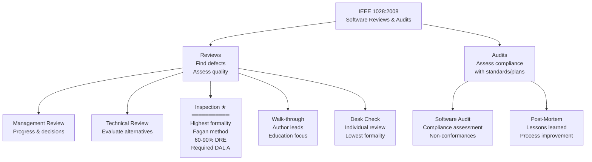

# Code Review & IEEE 1028 (Software Reviews and Audits)

**Standard:** IEEE 1028:2008 — Software Reviews and Audits  
**Related:** DO-178C §6.3 (Reviews and Analyses), ISO 26262-6 §10, EN 50128 §6.5, CMMI (Verification), Fagan Inspection Method (1976)  
**SDO:** IEEE Computer Society  
**Audience:** Software engineers, quality engineers, project managers, team leads, safety assessors  
**Prerequisites:** Software development lifecycle understanding, reading code, basic quality assurance concepts

---

## Chapter 1 — Historical Context & Origin Story

### 1.1 Timeline

| Year | Event | Significance |
|------|-------|-------------|
| 1972 | Weinberg: "The Psychology of Computer Programming" | First discussion of egoless programming and code review culture |
| 1976 | **Michael Fagan: Formal Inspection** (IBM) | Invented structured inspection process; data showing 60-90% defect removal |
| 1979 | Fagan: "Design and Code Inspections..." | Landmark IBM Systems Journal paper with quantitative data |
| 1986 | Gilb & Graham: "Software Inspection" | Expanded Fagan's work; industry adoption |
| 1989 | IEEE 1028-1988 (first edition) | First standard for software reviews |
| 1993 | IEEE 1028-1993 | Revised; added audit types |
| 1997 | DO-178B review requirements | Formalized code review for avionics certification |
| 2000 | Lightweight reviews emerge | Agile/XP: pair programming; less formal than Fagan |
| 2005 | Tool-assisted review | Crucible, ReviewBoard; asynchronous review |
| 2008 | **IEEE 1028:2008** (current edition) | Comprehensive standard: 5 review types + 2 audit types |
| 2011 | DO-178C (reviews & analysis) | §6.3 explicitly requires reviews as verification activity |
| 2013 | GitHub Pull Request reviews | Democratized code review; every developer does it |
| 2018 | Google study: code review at scale | Data on review effectiveness; time investment; developer satisfaction |
| 2020 | AI-assisted review | Static analysis + ML suggestions during review (CodeGuru, DeepCode) |
| 2023 | LLM-assisted review | GitHub Copilot for Pull Requests; AI reviewers as first pass |

### 1.2 Fagan Inspection — The Foundation

Michael Fagan (IBM, 1976) invented the formal inspection process:

| Key Insight | Impact |
|:-----------:|--------|
| "Defects found early cost 10-100× less to fix than defects found in test" | Economic justification for reviews |
| Structured process with defined roles | Repeatable, measurable, controllable |
| Data collection (defect rates, effort) | Process improvement through metrics |
| 60-90% defect removal effectiveness | Higher than any testing method alone |
| Finding defects, NOT fixing them (in the meeting) | Keeps meetings focused and efficient |

---

## Chapter 2 — IEEE 1028:2008 Architecture

### 2.1 Standard Overview

| Aspect | Detail |
|--------|--------|
| **Full title** | IEEE 1028-2008: Standard for Software Reviews and Audits |
| **Scope** | Defines 5 types of reviews + 2 types of audits for software products |
| **Applies to** | Any software lifecycle product (requirements, design, code, test plans, documentation) |
| **Key principle** | Reviews find defects; audits assess compliance; both are verification activities |

### 2.2 Seven Defined Types

| # | Type | Formality | Purpose | Output |
|:-:|:----:|:---------:|---------|--------|
| 1 | **Management Review** | Low-Medium | Assess progress; make decisions | Action items; decisions |
| 2 | **Technical Review** | Medium | Evaluate technical approach; alternatives | Technical assessment; recommendations |
| 3 | **Inspection** | **High** (most formal) | Find defects; measure quality | Defect list; metrics; rework assignments |
| 4 | **Walk-through** | Low-Medium | Present material; educate; find defects | Comments; defect list |
| 5 | **Desk Check** | Low | Individual review by assigned reviewer | Written comments |
| 6 | **Software Audit** | High | Assess compliance with standards/plans | Audit report; findings; non-conformances |
| 7 | **Post-mortem** | Low-Medium | Learn from experience after milestone | Lessons learned; process improvements |

### 2.3 Inspection vs. Walk-Through vs. Desk Check

| Aspect | Inspection (Fagan) | Walk-through | Desk Check |
|:------:|:---:|:---:|:---:|
| **Formality** | Highest | Medium | Lowest |
| **Meeting** | Required (structured) | Required (informal) | Not required |
| **Roles** | Defined (moderator, reader, author, reviewers, recorder) | Author leads; reviewers attend | Single reviewer |
| **Preparation** | Required (reviewers study material before meeting) | Optional | Required (entire review is preparation) |
| **Author role** | PASSIVE (does not lead; does not defend) | ACTIVE (presents; explains; leads) | Not present |
| **Metrics** | Defect rate, preparation rate, meeting rate collected | Optional | None |
| **Rework verification** | Formal re-inspection or moderator sign-off | Informal | Author discretion |
| **Effectiveness** | 60-90% defect removal | 20-60% | 20-40% |
| **Cost** | High (5-8 person-hours per 200 LOC) | Medium (2-4 person-hours) | Low (1-2 person-hours) |

---

## Chapter 3 — Formal Inspection Process (Fagan Method)

### 3.1 Roles

| Role | Responsibility |
|:----:|---------------|
| **Moderator** | Leads meeting; ensures process followed; tracks pace; collects metrics; NOT the author; trained in inspection |
| **Author** | Created the work product; answers questions ONLY when asked; does NOT lead or defend |
| **Reader** | Paraphrases/presents the work product line-by-line (NOT the author); reading forces understanding |
| **Reviewer(s)** | Identify defects; ask questions; suggest issues; 2-5 reviewers typical |
| **Recorder** | Documents all defects found; classification; location; does not participate in finding |

### 3.2 Inspection Phases

```mermaid
flowchart TD
    PLAN[1. Planning<br/>━━━━━━━━━━━<br/>Moderator:<br/>• Select material (200-400 LOC)<br/>• Assign roles<br/>• Schedule meeting<br/>• Distribute material + checklists]
    
    OVERVIEW[2. Overview<br/>━━━━━━━━━━━<br/>Author presents context<br/>• Purpose of code<br/>• Architecture context<br/>• 15-30 minutes<br/>• Optional if team knows context]
    
    PREP[3. Preparation<br/>━━━━━━━━━━━<br/>Each reviewer individually:<br/>• Studies material<br/>• Uses checklists<br/>• Notes potential defects<br/>• Records time spent<br/>• Typical: 1-2 hours per 200 LOC]
    
    MEETING[4. Inspection Meeting<br/>━━━━━━━━━━━<br/>• Reader paraphrases code<br/>• Reviewers raise issues<br/>• Recorder logs defects<br/>• Moderator controls pace<br/>• Author answers questions<br/>• 1-2 hours maximum<br/>• Rate: ~150-200 LOC/hour]
    
    REWORK[5. Rework<br/>━━━━━━━━━━━<br/>Author fixes all defects<br/>• Address each logged defect<br/>• Document disposition]
    
    FOLLOWUP[6. Follow-Up<br/>━━━━━━━━━━━<br/>Moderator verifies:<br/>• All defects addressed<br/>• Fixes are correct<br/>• Re-inspection if >5% change<br/>• Sign-off]
    
    PLAN --> OVERVIEW --> PREP --> MEETING --> REWORK --> FOLLOWUP
```

### 3.3 Entry and Exit Criteria

| Criteria | Rule |
|:--------:|------|
| **Entry — Ready for inspection** | (1) Material is complete (compiles; no known obvious errors). (2) Material distributed ≥ 2 days before meeting. (3) Reviewers have prepared (moderator verifies preparation time). (4) Supporting documents available (requirements, design). |
| **Exit — Inspection complete** | (1) All material reviewed. (2) All defects logged. (3) Defect metrics recorded. (4) Decision: Accept / Accept with rework / Re-inspect. |
| **Re-inspection trigger** | If rework changes > 5% of inspected material; OR if critical defects indicate systematic problems |

### 3.4 Inspection Metrics

| Metric | Definition | Industry Benchmark |
|:------:|-----------|:---:|
| **Preparation rate** | Pages (or LOC) per hour studied by reviewer | 100-200 LOC/hour (C code) |
| **Inspection rate** | LOC per hour during meeting | 150-200 LOC/hour (C code) |
| **Defect density** | Defects found per KLOC inspected | 5-15 major defects/KLOC (before test) |
| **Defect removal effectiveness (DRE)** | Defects found by inspection / total defects | 60-90% (high-quality inspection) |
| **ROI** | Cost of inspection vs. cost of defects found later | 4:1 to 10:1 (defects found early are cheaper) |

---

## Chapter 4 — Review Checklists

### 4.1 Code Review Checklist (Safety-Critical)

| Category | Check Items |
|:--------:|-------------|
| **Logic** | Correct algorithm? Off-by-one errors? Boundary conditions? Boolean logic correct? |
| **Data** | Variables initialized? Correct types? Range violations possible? Overflow? |
| **Control flow** | All paths lead to valid state? Unreachable code? Loop termination guaranteed? |
| **Interfaces** | Parameters correct (order, type, units)? Return values checked? Null checks? |
| **Memory** | Buffer sizes correct? No out-of-bounds access? Stack usage acceptable? No memory leaks? |
| **Concurrency** | Race conditions? Shared data protected (mutex/semaphore)? Deadlock possible? Priority inversion? |
| **Error handling** | All error returns checked? Failure modes handled? Defensive programming? |
| **MISRA compliance** | Any MISRA violations? Deviations properly justified? |
| **Requirements traceability** | Code implements specified requirement? No extra (gold-plating) functionality? |
| **Naming & clarity** | Meaningful names? Consistent style? Comments accurate (not misleading)? |
| **Safety** | Division by zero possible? Pointer validity? Cast safety? Volatile for HW registers? |
| **Standards** | Coding standard followed? Naming conventions? File structure? |

### 4.2 MISRA-Specific Review Items

| Item | Check |
|:----:|-------|
| Rule 8.9 | Local declaration when global needed? (Or vice versa — scope minimization) |
| Rule 10.x | Implicit type conversions? Narrowing? Loss of precision? |
| Rule 11.x | Pointer casts appropriate? `void*` conversions safe? |
| Rule 14.x | Control flow: unreachable code? Dead code after return? |
| Rule 17.x | Functions: recursion? Return on all paths? Parameter validation? |
| Rule 18.x | Pointer arithmetic safe? Array bounds? |
| Rule 21.x | Forbidden standard library functions (strcpy → strncpy_s)? |

---

## Chapter 5 — Reviews in Safety Standards

### 5.1 DO-178C Review Requirements

| Section | Activity | Level |
|:-------:|----------|:-----:|
| §6.3.1 | Reviews of source code | All DALs (scaled by rigor) |
| §6.3.2 | Reviews ensure conformance to requirements | DAL A-C |
| §6.3.4 | Reviews of timing/memory usage | DAL A-C |
| Table A-7 | "Review... and analyze the source code" | DAL A: required; DAL D: review OR analysis |
| Independence | Review by person OTHER than developer | DAL A: **required** (independent reviewer); DAL B-D: recommended |

**DO-178C DAL A independence requirement**: The person reviewing code for a DAL A system CANNOT be the person who wrote it. This is the formal inspection model — author ≠ reviewer.

### 5.2 ISO 26262-6 §10 (Verification)

| ASIL | Walk-through | Inspection | Semi-formal Verification |
|:----:|:---:|:---:|:---:|
| A | ++ (highly recommended) | + (recommended) | — |
| B | ++ | ++ | + |
| C | ++ | ++ | + |
| D | + | ++ (highly recommended) | ++ |

ISO 26262 strongly recommends **formal inspection** for ASIL C/D code. Walk-throughs are acceptable for ASIL A/B but insufficient alone for ASIL D.

### 5.3 EN 50128 §6.5

| SIL | Review Requirement |
|:---:|---|
| SIL 0 | No formal review required |
| SIL 1/2 | Verification by walk-through or review (HR) |
| SIL 3/4 | Formal review (inspection); independent reviewer; metrics collection (HR) |

---

## Chapter 6 — Modern Review Practices

### 6.1 Tool-Assisted Review (Modern Industry)

| Tool | Type | Use Case |
|:---:|:---:|---|
| **Gerrit** | Pre-merge review | Linux kernel; Android/AOSP; code must pass review before merge |
| **GitHub PRs** | Pull request review | Open source; commercial; integrated with CI |
| **GitLab MRs** | Merge request review | DevOps integrated; pipeline-linked |
| **Crucible** | Formal review | Enterprise; Atlassian; traceability |
| **Collaborator** | Formal + lightweight | SmartBear; safety-critical workflows; audit trail |
| **Reviewable** | Advanced PR review | Detailed commenting; disposition tracking |
| **Phabricator** | Pre-merge review | Meta; large-scale; automated checks |

### 6.2 Bridging Formal Inspection with Modern Tools

For safety-critical projects that need IEEE 1028 compliance but want modern tooling:

| IEEE 1028 Requirement | Modern Tool Implementation |
|:---:|---|
| Roles assigned | Reviewer assignment in PR; moderator = tech lead; recorder = tool (auto-logged) |
| Preparation before meeting | PR created; reviewers review asynchronously BEFORE synchronous meeting |
| Defect logging | Comments on specific lines in tool; each comment = defect |
| Metrics | Tool metrics: time-to-review; comments per KLOC; iterations to approval |
| Sign-off | Formal approval in tool (LGTM + approval checkbox) |
| Rework verification | Re-review after author pushes fixes; moderator final approval |
| Audit trail | Complete git history + review tool history; tamper-evident |

### 6.3 Review Effectiveness Data (Industry Studies)

| Study | Finding |
|:-----:|---------|
| IBM Fagan (1976) | Inspections remove 60-90% of defects before testing |
| Capers Jones (1996) | Formal inspections: 65% DRE; testing: 30% DRE; combined: 95% DRE |
| Google (2018) | Code review finds 15% of production bugs; primary value is knowledge sharing + code quality |
| Microsoft (2015) | Code review catches 15% of bugs; also improves design, readability, mentoring |
| SmartBear (2006) | 200-400 LOC per hour optimal review rate; >500 LOC/hour = declining effectiveness |
| Cisco (2006) | 60-90 minutes optimal meeting length; longer meetings lose focus |

---

## Chapter 7 — Comparison of Review Types

| Aspect | Fagan Inspection | Agile Code Review | Pair Programming |
|:------:|:---:|:---:|:---:|
| **Formality** | Very high (structured process; roles; metrics) | Low-Medium (PR-based; asynchronous) | Low (continuous; real-time) |
| **Timing** | After code complete; before integration | Before merge (PR gate) | During coding (simultaneous) |
| **Defect finding** | Primary goal (highest DRE: 60-90%) | Secondary (15-30%); primary: knowledge sharing | Lower defect finding; prevents defects |
| **Compliance** | DO-178C DAL A; ISO 26262 ASIL D; EN 50128 SIL 4 | ISO 26262 ASIL A/B (walk-through equivalent) | Not sufficient for high-SIL alone |
| **Cost** | High (5-10 person-hours / 200 LOC) | Low (1-3 person-hours / 200 LOC) | Continuous (2× development time; offset by fewer bugs) |
| **Documentation** | Full (defect log, metrics, sign-off) | Tool-based (PR history; comments) | Minimal (no explicit record) |
| **Best for** | Safety-critical; highest assurance; audit evidence | Commercial software; agile teams; fast iteration | Pairing on complex/unfamiliar code; knowledge transfer |
| **Scalability** | Low (resource-intensive; bottleneck) | High (asynchronous; distributed teams) | Medium (requires co-located or synchronized) |

---

## Chapter 8 — Mermaid Architecture Diagrams

### 8.1 IEEE 1028 Review Types Hierarchy



### 8.2 Inspection Process Flow

```mermaid
sequenceDiagram
    participant MOD as Moderator
    participant AUTH as Author
    participant REV as Reviewers (3-5)
    participant REC as Recorder
    
    Note over MOD,REC: Phase 1: PLANNING
    MOD->>MOD: Select material (200-400 LOC)
    MOD->>REV: Assign roles; distribute material
    MOD->>MOD: Schedule meeting (2+ days ahead)
    
    Note over MOD,REC: Phase 2: OVERVIEW (optional)
    AUTH->>REV: Present context (15-30 min)
    
    Note over MOD,REC: Phase 3: PREPARATION
    REV->>REV: Individual study (1-2 hours)
    REV->>REV: Use checklists; note defects
    REV->>MOD: Confirm preparation complete
    
    Note over MOD,REC: Phase 4: INSPECTION MEETING
    MOD->>MOD: Verify all prepared
    loop Line by line (150-200 LOC/hr)
        MOD->>REV: Reader paraphrases code
        REV->>REC: Raise defect
        REC->>REC: Log: location, type, severity
        AUTH->>REV: Answer questions (when asked)
    end
    MOD->>MOD: Decision: Accept/Rework/Re-inspect
    
    Note over MOD,REC: Phase 5: REWORK
    AUTH->>AUTH: Fix all logged defects
    AUTH->>MOD: Submit fixes
    
    Note over MOD,REC: Phase 6: FOLLOW-UP
    MOD->>MOD: Verify all defects addressed
    MOD->>MOD: Sign-off (or trigger re-inspection)
```

---

## Chapter 9 — Case Studies

### 9.1 IBM: Original Fagan Inspection Results

| Aspect | Detail |
|--------|--------|
| **Study** | Michael Fagan, IBM Systems Journal 1976; code inspections at IBM Rochester |
| **Code** | OS/370 kernel code; assembly + PL/I |
| **Finding** | Design inspections found 38% more defects than code inspections alone |
| **DRE** | Formal inspection removed **67%** of all defects before machine test |
| **Cost** | Inspection cost: 15% of development effort; savings: 25% reduction in test time + 25% fewer field defects |
| **Key metric** | 23 defects per KLOC found during inspection (high density = effective) |
| **Quote** | "The inspection process... is now the most cost-effective approach to error detection in software development" — Fagan, 1986 |
| **Industry impact** | Established code review as mandatory practice; inspired IEEE 1028; directly influenced DO-178B/C review requirements |

### 9.2 Avionics: DO-178C DAL A Independent Review

| Aspect | Detail |
|--------|--------|
| **System** | Engine controller (FADEC); DO-178C DAL A; 80 KLOC C |
| **Review process** | Formal inspection per IEEE 1028; 4 inspectors + moderator per session; 200-300 LOC per 2-hour session |
| **Independence** | DO-178C §6.3.6 requires independence for DAL A verification; reviewers from independent V&V team (not the development team) |
| **Results** | 400 inspection sessions over 18 months; 1,247 major defects found; 3,400 minor defects; defect density: 15.6 major/KLOC; 42.5 minor/KLOC |
| **Categories of defects found** | Logic errors (23%), interface mismatches (18%), missing requirements (15%), data errors (14%), control flow (12%), documentation (10%), timing (5%), other (3%) |
| **Comparison with testing** | System testing found additional 89 defects NOT found during inspection (primarily timing and hardware interaction issues); inspection found 1,247 defects NOT reproducible in testing (dead code logic errors; extreme input combinations never tested) |
| **DRE** | Inspection DRE = 93% (of all defects found before delivery, 93% were found by inspection; 7% by testing) |
| **Certification** | DER commented: "Inspection records demonstrate thorough verification; defect trends show effective process" — DAL A certification achieved |
| **Lesson** | For highest-criticality code, formal inspection is the MOST effective defect removal method; testing catches different (but fewer) defects; both are needed |

---

## Chapter 10 — Future Evolution

| Trend | Timeline | Impact |
|-------|----------|--------|
| **AI-assisted code review** | 2024-2026 | LLMs as first-pass reviewer; catches common issues; frees humans for design-level review |
| **Automated MISRA review** | 2024-2025 | Static analysis replaces manual MISRA checking in review; reviewer focuses on logic and design |
| **Continuous inspection** | 2024-2026 | Reviews integrated into every commit (micro-reviews); long formal inspections become rare |
| **Review analytics** | 2024-2025 | ML analyzing review patterns; predicting which code needs more review; reviewer effectiveness metrics |
| **Remote formal inspection** | 2024 (now) | Video-conferenced Fagan inspections; screen sharing; tool-based defect logging (pandemic-accelerated) |
| **Review ↔ formal verification** | 2025-2027 | Properties found during review expressed as formal specifications; verified automatically |

---

## Chapter 11 — Interview Questions & Career Guide

### Tier 1: Entry-Level

**Q1:** What is the difference between a code review and a code inspection (Fagan inspection)? Which is more effective at finding defects?

**A:** A **code review** (in modern practice) is typically an informal or semi-formal process where one or more developers examine code, usually via a pull request tool (GitHub, GitLab). The author explains the code; reviewers comment on issues. It's asynchronous, relatively fast (minutes to hours), and primarily catches obvious issues + improves code quality and knowledge sharing. Typical defect removal: 15-30%.

A **code inspection (Fagan inspection)** is a highly formal, structured process with defined roles (moderator, reader, reviewer, recorder), mandatory preparation, a timed meeting where a reader paraphrases code line-by-line (NOT the author), and formal metrics collection. The author is PASSIVE — cannot lead or defend. The focus is SOLELY on finding defects. Typical defect removal: 60-90%.

The formal inspection is **3-6× more effective** at finding defects because: (1) mandatory preparation means reviewers study code deeply BEFORE the meeting; (2) the reader paraphrasing forces understanding (you can't fake having read it); (3) structured pace (150-200 LOC/hour) prevents rushing; (4) author passivity prevents "explaining away" issues; (5) metrics enable process improvement.

However, formal inspections are expensive (5-10 person-hours per 200 LOC) and don't scale well. Industry practice: use formal inspections for highest-criticality code (DAL A, ASIL D) and lightweight reviews for everything else.

### Tier 2: Mid-Level

**Q2:** How would you implement IEEE 1028-compliant inspections in a team using Git/GitHub? What adaptations are needed?

**A:** **Bridge IEEE 1028 formality with modern tooling**:

**Planning phase**: Moderator creates a "review package" (could be a special PR label or JIRA issue). Package includes: code to review (PR diff), requirements document, checklist link, reviewer assignments, scheduled meeting time. Material must be available 2+ days before meeting.

**Preparation**: Reviewers perform offline review in GitHub PR (leave draft comments); log preparation time in time-tracking tool. Moderator verifies all reviewers have prepared (check: comments exist; or preparation time logged).

**Meeting**: Conduct via video call. Screen share the code (not the PR diff — the actual source file for context). Reader paraphrases; reviewers raise issues. Recorder logs defects in a shared document (or directly as GitHub PR comments with a "DEFECT:" prefix + classification).

**Key adaptations**: (1) **Separate defect comments from suggestions**: PR comments marked as "defect" (must fix) vs. "suggestion" (optional). (2) **Metrics**: Track manually or via tool plugin: preparation hours, meeting hours, defects found, LOC reviewed. (3) **Sign-off**: Use GitHub "Approve" + explicit moderator sign-off comment: "Inspection complete. X defects found. All addressed in commit [hash]." (4) **Audit trail**: PR history + meeting minutes + defect log provide complete traceability for ISO 26262 / DO-178C auditor.

**What you lose vs. traditional**: Paper trail may not be as formal; tool doesn't enforce "author is passive" (must be disciplined); metrics collection requires extra effort.

**What you gain**: Asynchronous preparation integrated with development tool; automatic history; diff highlighting; CI results alongside review.

### Tier 3: Senior

**Q3:** Design a review strategy for a mixed-ASIL automotive platform (QM through ASIL D) that balances thoroughness with development velocity. Include metrics targets and process tailoring.

**A:** **Tiered review strategy by ASIL**:

**ASIL D (highest)** — Formal Inspection (IEEE 1028):
- Process: Full Fagan; moderator + 3 reviewers + recorder; 200 LOC/session max
- Independence: At least 1 reviewer from independent safety team (ISO 26262-6 §10.4.2)
- Preparation: Mandatory; 1-2 hours; verified by moderator
- Metrics targets: Preparation rate ≤ 200 LOC/hour; inspection rate ≤ 200 LOC/hour; defect density > 5/KLOC (if less, investigate if reviewers are effective)
- Checklist: Full safety checklist (memory, timing, concurrency, MISRA, requirements traceability)
- Tool: Collaborator (SmartBear) or Crucible — provides audit trail + metrics

**ASIL B/C** — Structured Review:
- Process: 2 mandatory reviewers + 1 optional domain expert; asynchronous PR review + 30-min synchronous discussion for complex changes
- Independence: Reviewer ≠ author (different developer; same team acceptable)
- Preparation: Expected (PR exists ≥ 1 day before approval)
- Metrics: Review turnaround < 2 business days; defect density tracked (target > 3/KLOC)
- Checklist: Abbreviated safety checklist (critical items only)
- Tool: GitHub/GitLab PRs with required approvals

**ASIL A / QM** — Lightweight Review:
- Process: 1 mandatory reviewer; asynchronous PR approval; no synchronous meeting required
- Independence: Any team member (including same team)
- Metrics: Review turnaround < 1 business day; optional defect tracking
- Checklist: Basic coding standard check (automated by CI tools)
- Tool: GitHub PRs with auto-checks (linting, MISRA via Helix QAC in CI)

**Cross-cutting**:
- ALL code passes automated static analysis (Helix QAC MISRA check) regardless of ASIL — this is the baseline gate
- Review training: all ASIL D reviewers must complete inspection training (moderator certification)
- Quarterly metrics review: inspect inspection effectiveness; adjust if DRE drops below 60%
- Escalation: if testing finds >3 defects in ASIL D code that inspection missed → root cause analysis → process adjustment

---

## Chapter 12 — Cheat Sheet & Quick Reference

```
═══════════════════════════════════════════
CODE REVIEW / IEEE 1028 — QUICK REFERENCE
═══════════════════════════════════════════

IEEE 1028 REVIEW TYPES:
  Inspection: Highest formality; Fagan; 60-90% DRE
  Walk-through: Author leads; moderate formality; 20-60% DRE
  Technical Review: Evaluate approach; alternatives
  Management Review: Progress; decisions
  Desk Check: Individual; lowest formality

═══════════════════════════════════════════
FAGAN INSPECTION PROCESS:
  1. Planning     → Select 200-400 LOC; assign roles; schedule
  2. Overview     → Author presents context (optional; 15 min)
  3. Preparation  → Reviewers study individually (1-2 hours)
  4. Meeting      → Reader paraphrases; defects logged (2 hours max)
  5. Rework       → Author fixes all defects
  6. Follow-up    → Moderator verifies; sign-off

═══════════════════════════════════════════
INSPECTION ROLES:
  Moderator: Leads; ensures process; NOT the author
  Author:    Created code; PASSIVE in meeting; answers when asked
  Reader:    Paraphrases code (NOT author); drives understanding
  Reviewer:  Finds defects; domain expertise
  Recorder:  Logs defects; classification; metrics

═══════════════════════════════════════════
OPTIMAL RATES (industry data):
  Preparation:  100-200 LOC/hour
  Inspection:   150-200 LOC/hour
  Session:      60-90 minutes (max 2 hours)
  Material:     200-400 LOC per session
  Reviewers:    3-5 (plus moderator + recorder)

═══════════════════════════════════════════
DEFECT REMOVAL EFFECTIVENESS:
  Formal inspection:  60-90% (best single activity)
  Structured review:  30-60%
  Desk check:         20-40%
  Unit testing:       25-50%
  Integration test:   25-40%
  COMBINED (all):     95%+ achievable

═══════════════════════════════════════════
SAFETY STANDARD REQUIREMENTS:
  DO-178C DAL A: Independent review REQUIRED (§6.3.6)
  DO-178C DAL B-D: Review required (independence recommended)
  ISO 26262 ASIL D: Formal inspection (highly recommended)
  ISO 26262 ASIL A/B: Walk-through (highly recommended)
  EN 50128 SIL 3/4: Formal review with independent reviewer

═══════════════════════════════════════════
ENTRY/EXIT CRITERIA:
  Entry:
    □ Code compiles without errors
    □ Material distributed 2+ days ahead
    □ Reviewers confirmed preparation
    □ Supporting docs available (requirements, design)
  
  Exit:
    □ All material reviewed
    □ All defects logged with severity
    □ Decision recorded: Accept / Rework / Re-inspect
    □ Metrics collected (prep time, meeting time, defects)
    □ Re-inspect if >5% material changed by rework

═══════════════════════════════════════════
KEY PRINCIPLES:
  • Find defects, NOT fix them (in meeting)
  • Author is PASSIVE (never leads/defends)
  • Review the PRODUCT, not the PERSON
  • Preparation is MANDATORY (not optional)
  • Metrics enable improvement (no metrics = no improvement)
  • 200-400 LOC is optimal chunk size
  • >500 LOC/hour → declining effectiveness
```

---

*End of Document — 10_Code_Review_IEEE1028.md*
