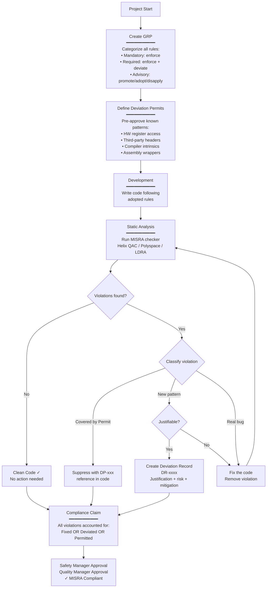
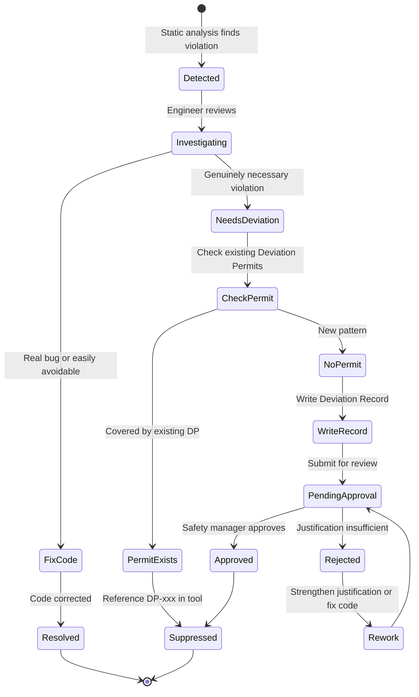

# Deviation Management & MISRA Compliance

**Topic:** MISRA deviation process; coding standard waivers; justification documentation; compliance matrices; MISRA Compliance:2020 framework; audit evidence generation  
**Standards:** MISRA Compliance:2020, MISRA C:2012 (Appendix I — Deviation), ISO 26262-6 §9, DO-178C §6.3 (Analysis of violations), EN 50128 §6.5  
**SDO:** MISRA (Motor Industry Software Reliability Association), ISO TC 22, RTCA  
**Audience:** Software engineers, quality managers, safety managers, assessors, MISRA compliance officers  
**Prerequisites:** MISRA C/C++ rule knowledge, functional safety basics, coding standards awareness, quality management systems

---

## Chapter 1 — Historical Context & Origin Story

### 1.1 Timeline

| Year | Event | Significance |
|------|-------|-------------|
| 1998 | MISRA C:1998 (first edition) | 127 rules; deviation concept introduced but minimal guidance |
| 2004 | MISRA C:2004 | 142 rules; deviation record process defined more clearly |
| 2008 | MISRA C++:2008 | C++ rules with deviation process aligned to C:2004 |
| 2012 | **MISRA C:2012** | 16 Directives + 159 Rules; Mandatory/Required/Advisory categories; formal deviation process in Appendix I |
| 2016 | MISRA C:2012 Amendment 1 | Additional rules; security focus |
| 2020 | **MISRA Compliance:2020** | Standalone document defining compliance framework; GRP; deviation; compliance claim |
| 2020 | MISRA C:2012 Amendment 2 | More rules; MISRA Compliance:2020 referenced |
| 2023 | MISRA C++:2023 | New C++ standard; references MISRA Compliance:2020 for deviation process |
| 2023 | MISRA C:2012 Revision 4 | Third amendment; security rules; maintains deviation framework |

### 1.2 Why Deviations Are Necessary

MISRA rules are designed for GENERAL safety-critical software. However:

| Scenario | Why Deviation Needed |
|:--------:|----------------------|
| **Hardware register access** | Accessing memory-mapped registers requires casts (Rule 11.x); unavoidable in embedded |
| **Performance critical code** | Some rules (e.g., goto restriction) may need deviation for specific performance-critical loops |
| **Third-party libraries** | Library headers may violate MISRA; project cannot modify them |
| **Legacy code adoption** | Existing code being brought under MISRA compliance; cannot rewrite immediately |
| **Compiler intrinsics** | Built-in functions (e.g., `__builtin_clz`) violate rules but are necessary for optimal code |
| **Assembly inline** | Safety-critical low-level code sometimes needs inline assembly (Rule 1.2 — language extensions) |

**Key principle**: Deviations are NOT about ignoring rules. They are a CONTROLLED, DOCUMENTED process for acknowledging and managing specific rule violations with proper justification and risk mitigation.

---

## Chapter 2 — MISRA Compliance:2020 Framework

### 2.1 Overview

| Aspect | Detail |
|--------|--------|
| **Document** | MISRA Compliance:2020 |
| **Purpose** | Define a framework for claiming and demonstrating MISRA compliance |
| **Key concept** | Compliance does NOT mean zero violations; it means ALL violations are properly managed (suppressed or deviated) |
| **Components** | Guideline Re-categorization Plan (GRP), Deviation permits, Deviation records, Compliance claim |

### 2.2 Rule Categories

| Category | Enforcement | Deviation Allowed? |
|:--------:|-------------|:---:|
| **Mandatory** | MUST be followed; no deviation possible | ❌ **No** — always enforced |
| **Required** | Must be followed unless formally deviated | ✅ Yes — with proper justification |
| **Advisory** | Recommended; may be followed or not adopted | ✅ Yes — may choose not to adopt |

### 2.3 MISRA Compliance:2020 Components

```mermaid
graph TB
    MC[MISRA Compliance:2020<br/>Framework]
    
    MC --> GRP[Guideline Re-categorization<br/>Plan (GRP)<br/>━━━━━━━━━━━<br/>Promote Advisory → Required<br/>or Demote Advisory → Disapplied<br/>Cannot demote Required/Mandatory]
    
    MC --> DP[Deviation Permits<br/>━━━━━━━━━━━<br/>Pre-approved deviations<br/>for known patterns<br/>Project-wide justification]
    
    MC --> DR[Deviation Records<br/>━━━━━━━━━━━<br/>Per-instance documentation<br/>Each specific violation<br/>Justification + risk]
    
    MC --> CC[Compliance Claim<br/>━━━━━━━━━━━<br/>Final declaration<br/>What standard used<br/>All deviations listed]
    
    GRP --> ADOPTION[Adoption: Which rules<br/>apply to this project?<br/>All Mandatory + Required<br/>+ adopted Advisory]
    
    DP --> GENERIC[Generic justification<br/>for repeated patterns<br/>e.g., all HW register accesses]
    
    DR --> SPECIFIC[Specific justification<br/>for THIS instance<br/>THIS file, THIS line]
```

---

## Chapter 3 — Guideline Re-categorization Plan (GRP)

### 3.1 GRP Rules

| Original Category | Can Promote To | Can Demote To | Can Disapply? |
|:-:|:-:|:-:|:-:|
| **Mandatory** | — (already highest) | **No** (cannot demote) | **No** |
| **Required** | — (already required) | **No** (cannot demote to advisory) | **No** |
| **Advisory** | Required (promote ✅) | Disapplied (don't adopt ✅) | Yes (justified) |

**Key constraint**: Mandatory and Required rules CANNOT be demoted or disapplied. The GRP can only:
1. **Promote** Advisory rules to Required (making them stricter)
2. **Disapply** Advisory rules (choosing not to adopt them)

### 3.2 GRP Example

| Rule | Original | GRP Decision | Rationale |
|:---:|:---:|:---:|---|
| Dir 4.4 (comment code) | Advisory | **Promote → Required** | Our safety standard (ISO 26262) requires commenting code to be explained |
| Rule 2.7 (unused params) | Advisory | **Promote → Required** | Unused parameters indicate design issues; enforce |
| Rule 8.7 (internal linkage) | Advisory | Adopt as Advisory | Good practice; advisory violations reviewed but not blocked |
| Rule 15.5 (single exit) | Advisory | **Disapply** | Team uses early-return pattern; this rule doesn't suit our coding style; safety argument: early return reduces nesting → easier to verify |

### 3.3 GRP Documentation Template

```
GUIDELINE RE-CATEGORIZATION PLAN
Project: [Project name]
Standard: MISRA C:2012 Amendment 2 + TC2
Date: [Date]
Approved by: [Safety manager]

1. ALL Mandatory rules: Enforced (no exception)
2. ALL Required rules: Enforced (deviation via permit/record only)
3. Advisory rules re-categorization:
   - Promoted to Required: [list with rationale for each]
   - Adopted as Advisory: [list — violations reviewed, not blocked]
   - Disapplied: [list with rationale for each]

Justification for disapplied rules: [For each disapplied rule,
   explain why it does not apply to this project and
   why disapplying does not compromise safety]
```

---

## Chapter 4 — Deviation Permits

### 4.1 Concept

A **Deviation Permit** is a pre-approved justification for a CATEGORY of deviations. It covers a known pattern that occurs multiple times in the codebase.

| Aspect | Detail |
|--------|--------|
| **Purpose** | Avoid writing the same justification 200 times for the same pattern |
| **Scope** | Project-wide (or organizational); covers all instances of a specific pattern |
| **Approval** | Approved once by safety authority; referenced by individual deviation records |
| **Content** | Rule violated; pattern description; safety argument; mitigation; conditions for use |

### 4.2 Example Deviation Permits

**Permit #1: Hardware Register Access Casts**

| Field | Content |
|:-----:|---------|
| **Permit ID** | DP-001 |
| **Rule** | Rule 11.4 (A conversion should not be performed between a pointer to object and an integer type) |
| **Pattern** | Accessing memory-mapped hardware registers requires casting integer address to pointer |
| **Justification** | Hardware register addresses are defined by silicon vendor in datasheet; cast is necessary for hardware interaction; no alternative mechanism in C |
| **Risk assessment** | Risk: incorrect address → access to wrong register. Mitigation: addresses taken from verified datasheet/header (vendor-provided); tested on target hardware; register access validated in hardware integration test |
| **Conditions** | (1) Register address from official MCU header file. (2) Access size matches register width. (3) Volatile qualifier used. (4) Only in hardware abstraction layer (HAL) |
| **Approved by** | [Safety Manager], [Date] |

**Permit #2: Third-Party Library Headers**

| Field | Content |
|:-----:|---------|
| **Permit ID** | DP-002 |
| **Rules** | Multiple MISRA rules violated in third-party headers |
| **Pattern** | `#include` of third-party/vendor library headers that are not MISRA-compliant |
| **Justification** | Third-party headers cannot be modified (vendor IP; warranty void); violations are in header code not executed by our application (declarations/macros only) |
| **Risk assessment** | Risk: macro expansion could introduce violation into our code. Mitigation: wrapper headers isolate third-party includes; our code using these APIs is fully MISRA-checked |
| **Conditions** | (1) Third-party header identified in approved vendor list. (2) Project code using the API is MISRA-compliant. (3) Header wrapped in approved wrapper pattern. |
| **Approved by** | [Safety Manager], [Date] |

---

## Chapter 5 — Deviation Records

### 5.1 Deviation Record Structure

For each specific violation that is not covered by a Deviation Permit, a Deviation Record documents the individual instance:

| Field | Description | Example |
|:-----:|-------------|---------|
| **DR-ID** | Unique identifier | DR-2024-0042 |
| **File/Line** | Exact location of violation | `src/hal/gpio.c:128` |
| **Rule** | MISRA rule violated | Rule 11.6 (Required) |
| **Category** | Mandatory/Required/Advisory | Required |
| **Violation** | What the code does that violates the rule | Cast of integer literal `0x4002'0000` to `GPIO_TypeDef*` |
| **Justification** | Why this violation is necessary and acceptable | Hardware register base address per STM32 reference manual RM0433; no alternative for memory-mapped I/O |
| **Risk** | What could go wrong | Wrong address → access to wrong peripheral → unpredictable behavior |
| **Mitigation** | How risk is controlled | Address verified against datasheet; hardware test confirms register read/write; HAL isolated module |
| **Permit reference** | If covered by a Deviation Permit | DP-001 |
| **Approved by** | Approver name + date | J. Smith (Safety Engineer), 2024-03-15 |

### 5.2 Deviation Record Quality Criteria

| Criterion | Good Deviation Record | Bad Deviation Record |
|:---------:|---|---|
| **Justification** | "Hardware register access requires cast per silicon vendor datasheet STM32F4 RM0090 §8.3" | "We need this cast" |
| **Risk assessment** | "Incorrect address would access wrong peripheral register, potentially corrupting adjacent peripheral state" | "Low risk" |
| **Mitigation** | "Address validated against datasheet; hardware integration test reads register ID confirming correct peripheral" | "Code reviewed" |
| **Scope** | "This specific instance in gpio.c:128 only" | "All casts in the project" |
| **Approval** | Named person with authority + date | Unsigned; no date |

---

## Chapter 6 — Compliance Claim

### 6.1 MISRA Compliance Claim Structure

The final declaration of MISRA compliance for a product/release:

```
MISRA COMPLIANCE CLAIM
═══════════════════════

Product:        [Product name, version]
Standard:       MISRA C:2012 (including Amendments 1, 2, 3; TC2)
Framework:      MISRA Compliance:2020
Date:           [Release date]
Tool:           Helix QAC v2023.3 (MISRA C:2012 Module)
Configuration:  [Config file reference]

GRP Reference:  [Document ID of Guideline Re-categorization Plan]

COMPLIANCE STATUS:
  Mandatory rules (25):     All compliant — zero violations
  Required rules (128):     Compliant (X violations — all with
                            approved Deviation Permit or Record)
  Adopted Advisory (30):    Compliant (Y violations — all with
                            approved Deviation Record or reviewed)
  Disapplied Advisory (26): Not adopted (per GRP justification)

DEVIATIONS:
  Deviation Permits active: [N permits — referenced by ID]
  Deviation Records:        [M individual records — referenced by ID]
  Total violations:         [X + Y] — all managed

TOOL ANALYSIS:
  Files analyzed:           [count]
  Lines analyzed:           [count]
  Zero findings (clean):    [percentage]%
  Suppressed (with DR/DP):  [count]
  Residual (under review):  0

APPROVED BY:
  Software Lead:    [Name, Date]
  Safety Manager:   [Name, Date]
  Quality Manager:  [Name, Date]
```

### 6.2 Compliance vs. Conformance

| Term | Meaning | MISRA Usage |
|:----:|---------|:-----------:|
| **Compliance** | ALL rules addressed: either followed OR properly deviated | ✅ This is what MISRA requires |
| **Conformance** | ALL rules followed; zero violations; no deviations | Unrealistic for real embedded projects |

**"MISRA compliant" ≠ "zero MISRA violations"**. It means: all violations are identified, justified, risk-assessed, mitigated, and documented via the proper deviation framework.

---

## Chapter 7 — Cross-Standard Deviation Comparison

### 7.1 Deviation in Different Standards

| Standard | Term | Process | Approval |
|:--------:|:----:|---------|:--------:|
| **MISRA C/C++** | Deviation (Permit + Record) | Document justification + risk + mitigation per instance or pattern | Safety manager / Quality |
| **DO-178C** | "Analysis of non-conformance" | Document why standard/plan was not followed; show equivalent assurance | DER (certification authority) |
| **ISO 26262** | Tailoring of work products (Part 2) | Rationale required for tailoring any method | Assessor review |
| **AUTOSAR C++14** | Deviation (aligned with MISRA) | Same framework as MISRA; per-rule deviation | Project authority |
| **CERT C/C++** | N/A (recommendations, not mandates) | No formal deviation needed (not mandatory) | — |
| **IEC 61508** | Non-conformance justification (§7.1.2) | Equivalent safety argument | Assessor |

### 7.2 Mapping MISRA Deviations to ISO 26262

| ISO 26262 Requirement | MISRA Compliance:2020 Fulfillment |
|:---:|---|
| Part 6 §9: "Coding guidelines shall be applied" | GRP defines which MISRA rules apply |
| Part 6 §9: "Violations shall be documented and justified" | Deviation Records document and justify each violation |
| Part 6 §9: "Proof of compliance with coding guidelines" | Compliance Claim + tool report + deviation log = proof |
| Part 8 §9: "Confirmation review" | Quality manager approval of compliance claim |

---

## Chapter 8 — Mermaid Architecture Diagrams

### 8.1 MISRA Compliance:2020 Process



### 8.2 Deviation Lifecycle



---

## Chapter 9 — Case Studies

### 9.1 Automotive Tier-1: MISRA Compliance Journey

| Aspect | Detail |
|--------|--------|
| **Organization** | Tier-1 automotive supplier; powertrain ECU; ASIL C; 300 KLOC C |
| **Starting point** | Legacy codebase (10 years old); never analyzed for MISRA; initial scan: **18,400 MISRA C:2012 violations** |
| **Tool** | Helix QAC with MISRA C:2012 module |
| **Phase 1 — GRP (2 weeks)** | (1) Adopted all Mandatory + Required rules. (2) Promoted 15 Advisory rules to Required (team consensus). (3) Disapplied 8 Advisory rules with justification. (4) Remaining Advisory: adopted but not blocking. |
| **Phase 2 — Deviation Permits (1 week)** | Created 12 Deviation Permits for known patterns: HW register casts (DP-001); OS API usage (DP-002); pragma usage (DP-003); third-party headers (DP-004); ISR naming (DP-005); etc. These covered ~6,200 violations (34% of total). |
| **Phase 3 — Baseline suppression (2 weeks)** | Remaining 12,200 violations in legacy code: triaged. 4,100 = false positives (tool configuration issues → fixed config). 5,800 = real violations that need code fix (backlog). 2,300 = individual Deviation Records needed (legitimate violations in legacy patterns). |
| **Phase 4 — Zero-new policy (ongoing)** | CI gate: zero new MISRA violations from this point. All new/modified code must be clean (or have approved deviation). Legacy backlog: 400 violations fixed per sprint. |
| **Phase 5 — Compliance claim (12 months later)** | Legacy violations reduced from 5,800 to 340. Deviation Records: 2,300 individual records created. Deviation Permits: 12 permits covering ~6,200 instances. Total managed violations: ~8,840 (all with DR or DP). 340 remaining → sprint plan to fix. |
| **Assessor feedback** | "Compliance framework well-structured; GRP justified; deviation permits appropriate for embedded domain; records are thorough; ASIL C evidence accepted." |
| **Lesson** | 100% clean MISRA on legacy code is unrealistic short-term; MISRA Compliance:2020 framework ALLOWS this reality — compliance means ALL violations managed, not zero violations. The journey matters more than day-one perfection. |

### 9.2 Aerospace: Deviation for DO-178C DAL A

| Aspect | Detail |
|--------|--------|
| **System** | Flight management system; DO-178C DAL A; MISRA C:2012 adopted as coding standard |
| **Rule** | Rule 17.2 (Required): "Functions shall not call themselves, either directly or indirectly" (recursion prohibited) |
| **Situation** | Navigation algorithm uses a well-known iterative refinement that converges in 3-5 iterations; mathematically PROVEN convergence. Original implementation used recursion (natural for the math). |
| **Question** | Deviate Rule 17.2 (allow recursion) OR refactor to iterative loop? |
| **Analysis** | (1) Recursion risk: stack overflow if convergence fails → catastrophic. (2) Convergence proof exists (mathematical) → guarantees max 7 iterations. (3) BUT: formal proof depends on floating-point properties that may differ on target. (4) Stack analysis with recursion: adds 7 × 64 bytes = 448 bytes worst case → fits within budget. |
| **Decision** | **Refactor to iterative** (do NOT deviate). Rationale: The cost of refactoring is 2 days engineering. The cost of maintaining a DAL A deviation for recursion is: (1) ongoing justification maintenance, (2) additional scrutiny from DER, (3) must prove convergence for EVERY future code change to the algorithm. Iterative version eliminates all of this risk and ongoing cost. |
| **Counter-example** | If the algorithm COULD NOT be made iterative (some graph algorithms), the deviation record would include: (1) Mathematical proof of bounded recursion depth. (2) Static stack analysis showing sufficient margin at max depth. (3) Runtime stack monitoring (defense-in-depth). (4) DER concurrence documented. |
| **Lesson** | In highest-DAL/ASIL, prefer REMOVING the violation over deviating it — even if refactoring costs engineering time. Deviations carry ongoing compliance burden. Rule: "If it costs less than 1 person-week to fix, fix it; deviate only truly unfixable patterns (hardware access, compiler behavior)." |

---

## Chapter 10 — Future Evolution

| Trend | Timeline | Impact |
|-------|----------|--------|
| **Automated deviation justification** | 2024-2026 | AI-generated justification text from code context; human approves but doesn't write from scratch |
| **Deviation databases (shared)** | 2024-2027 | Industry-shared deviation permits for common MCU families; pre-approved patterns for STM32, Renesas, Infineon |
| **MISRA Compliance:2025** (expected) | 2025-2026 | Updated compliance framework; potentially stricter on Advisory rule handling; AI tool guidance |
| **Continuous compliance monitoring** | 2024-2025 | Real-time compliance dashboard; drift detection; alerts when new code introduces unmanaged violation |
| **Traceability to safety case** | 2024-2027 | Direct link from deviation record → safety case argument; automated safety argument impact analysis when deviation added |
| **Regulatory harmonization** | 2025-2030 | ISO 26262 + DO-178C convergence on deviation handling; common framework across domains |

---

## Chapter 11 — Interview Questions & Career Guide

### Tier 1: Entry-Level

**Q1:** What is a MISRA deviation and why is it needed? Does having deviations mean the code is not MISRA-compliant?

**A:** A **MISRA deviation** is a documented, justified, approved exception to a MISRA rule. It acknowledges that a specific piece of code violates a MISRA rule, but explains: (1) WHY the violation is necessary (justification); (2) WHAT risk it creates (risk assessment); (3) HOW the risk is mitigated (controls).

Deviations are needed because some MISRA rules are impossible to follow in certain embedded scenarios. For example, accessing memory-mapped hardware registers REQUIRES casting an integer address to a pointer (violating Rule 11.4/11.6) — there is no alternative mechanism in C for hardware register access.

**Having deviations does NOT mean non-compliant.** MISRA Compliance:2020 explicitly states: "Compliance" means all violations are **managed** — either fixed, covered by a Deviation Permit (pre-approved pattern), or documented in a Deviation Record (individual justification). A project with 200 deviations (all properly documented and justified) is MISRA compliant. A project with 1 undocumented violation is NOT compliant.

Think of it like a safety regulation that says "no sharp edges" on a product. If a knife blade MUST be sharp (it's a knife!), you don't claim non-compliance — you document: "this edge is intentionally sharp; risk is mitigated by the handle design and blade guard." That's a deviation.

### Tier 2: Mid-Level

**Q2:** Explain the MISRA Compliance:2020 framework components (GRP, Deviation Permits, Deviation Records, Compliance Claim) and how they work together.

**A:** The four components form a hierarchical compliance framework:

**1. GRP (Guideline Re-categorization Plan)**: Defines WHICH rules apply to the project. All Mandatory and Required rules MUST be enforced (cannot be removed). Advisory rules can be: promoted to Required (stricter), adopted as Advisory (violations noted but not blocking), or disapplied (not adopted, with justification). The GRP is set at project start and rarely changes.

**2. Deviation Permits**: Pre-approved justifications for KNOWN PATTERNS that recur frequently. Example: "All memory-mapped hardware register accesses will cast integer addresses to pointers (violating Rule 11.4). This is justified because [hardware interaction; no alternative in C]. Risk is mitigated by [using vendor-provided headers; validated by HW test]." Created once; covers ALL instances of that pattern project-wide. Saves writing the same justification 500 times.

**3. Deviation Records**: Per-INSTANCE documentation for violations NOT covered by a Permit. Each record documents: exact location (file:line), rule violated, justification, risk, mitigation, approval. Used for one-off situations that don't recur frequently enough to warrant a Permit.

**4. Compliance Claim**: The final declaration that the project IS MISRA-compliant. States: standard version, GRP reference, list of all Permits and Records, confirmation that ALL violations are accounted for (either fixed or deviated). Signed by appropriate authorities (SW lead, safety manager).

**How they work together**: GRP defines scope → Development writes code → Static analysis finds violations → Each violation is either fixed (best), covered by a Permit (common pattern), or given a Record (unique case) → Compliance Claim confirms everything is managed → Project is MISRA COMPLIANT.

### Tier 3: Senior

**Q3:** Your team has 450 MISRA violations remaining in a 200 KLOC ASIL D automotive project nearing release. The assessor is coming in 8 weeks. Design a strategy to achieve MISRA compliance in time.

**A:** **Triage-first approach** (not all violations are equal):

**Week 1-2: Classify all 450 violations**:
- **Category A — Must Fix** (~30%): Violations in ASIL D code (safety-critical functions); Required rules; no justifiable reason for deviation; relatively easy to fix without regression risk.
- **Category B — Deviation Permit** (~40%): Known patterns (HW access, OS API, compiler intrinsics); write 5-10 new Permits covering multiple instances each; significant reduction in "open" items.
- **Category C — Individual Deviation Record** (~20%): Unique violations that genuinely need per-instance justification; complex legacy code where fix introduces regression risk.
- **Category D — False Positive** (~10%): Tool misconfiguration or tool bugs; fix tool config; these disappear from count.

**Week 1: Quick wins**: Fix Category D (false positives — tool config; instant reduction of ~45 violations). Create Deviation Permits for Category B patterns (5-10 permits covering ~180 violations). Net reduction: 45 + 180 = 225 violations resolved. Remaining: ~225.

**Week 2-5: Fix Category A** (135 violations): Prioritize by risk; fix highest-ASIL code first; run regression tests after each fix batch. Target: 30-40 fixes/week (realistic for careful safety-critical changes with testing).

**Week 3-6: Write Category C Deviation Records** (90 violations): Assign to 3 engineers; 5-6 records per engineer per week; quality review by safety engineer. Each record takes ~30 minutes to write properly.

**Week 7: Compliance packaging**: Write Compliance Claim; compile GRP (should already exist); organize all Permits and Records; generate final tool report; cross-reference everything.

**Week 8: Assessor preparation**: Internal pre-audit; verify all documentation complete; brief team on assessor questions; prepare presentation showing compliance journey (from 18,400 to 0 unmanaged violations).

**Risk mitigation**: (1) If Category A fixes risk regression → write Deviation Record instead (safer than breaking working code near release). (2) Have safety manager pre-approve Deviation Permits early (Week 1) to avoid bottleneck. (3) Assessor engagement: brief assessor early on approach; assessors prefer transparency ("we have 450 managed deviations with clear justification") over surprises.

**Key principle for assessor**: Present the FRAMEWORK, not just numbers. Show: GRP (systematic rule adoption); Permits (efficient management of patterns); Records (thorough individual justification). Assessors evaluate the PROCESS quality, not just the violation count.

---

## Chapter 12 — Cheat Sheet & Quick Reference

```
═══════════════════════════════════════════
DEVIATION MANAGEMENT — QUICK REFERENCE
═══════════════════════════════════════════

MISRA COMPLIANCE:2020 FRAMEWORK:
  GRP → Deviation Permits → Deviation Records → Compliance Claim

  Compliant = ALL violations MANAGED (fixed or deviated)
  Compliant ≠ ZERO violations

═══════════════════════════════════════════
RULE CATEGORIES:
  Mandatory:  ALWAYS enforced; NO deviation possible
  Required:   Enforced; deviation WITH justification
  Advisory:   GRP decides: promote / adopt / disapply

═══════════════════════════════════════════
GRP (GUIDELINE RE-CATEGORIZATION PLAN):
  • Define at project start
  • Mandatory: cannot change (always enforced)
  • Required: cannot demote (always enforced; can deviate)
  • Advisory: can promote to Required OR disapply

═══════════════════════════════════════════
DEVIATION PERMIT (pattern-level):
  Use when: Same violation pattern recurs many times
  Content: Rule + Pattern + Justification + Risk + Mitigation
  Scope: All instances matching the pattern
  Approval: Once (covers all instances)
  Example: HW register casts, third-party headers

═══════════════════════════════════════════
DEVIATION RECORD (instance-level):
  Use when: Unique violation; no matching Permit
  Content: File:Line + Rule + Justification + Risk + Mitigation
  Scope: Single specific instance
  Approval: Per-record by safety authority
  Quality: Clear justification; specific risk; concrete mitigation

═══════════════════════════════════════════
COMPLIANCE CLAIM:
  States: Standard version, GRP reference, all deviations listed
  Confirms: ALL violations accounted for
  Signed by: SW Lead + Safety Manager + Quality Manager
  Accompanies: Tool analysis report (zero unmanaged findings)

═══════════════════════════════════════════
COMMON DEVIATION PERMIT PATTERNS:
  DP-001: Memory-mapped HW register access (Rule 11.x casts)
  DP-002: Third-party library headers (multiple rules)
  DP-003: Compiler intrinsics/extensions (Rule 1.2)
  DP-004: RTOS/OS API patterns (various rules)
  DP-005: Inline assembly wrappers (Rule 1.2)
  DP-006: Diagnostic/debug code (conditional compilation)

═══════════════════════════════════════════
DEVIATION QUALITY CRITERIA:
  ✓ Specific (not generic "we need this")
  ✓ Risk identified (what could go wrong)
  ✓ Mitigation concrete (how risk is controlled)
  ✓ Approved by named authority with date
  ✓ Traceable to exact code location
  ✗ "Low risk" without explanation
  ✗ "Code reviewed" as sole mitigation
  ✗ Unsigned / undated

═══════════════════════════════════════════
TOOL SUPPRESSION PATTERN:
  In code (tool-specific):
    /* polyspace<RTE:OVFL:Not a defect:Justified>
       DR-2024-0042: overflow impossible because x ∈ [0,100] */
    
    // PRQA S 0303 1 // DP-001: HW register access
    
    /* LDRA_DEVIATIONS DISABLE 11.4 - DP-001 */

═══════════════════════════════════════════
ASSESSOR EXPECTATIONS:
  1. GRP documented and justified
  2. Deviation Permits well-reasoned (not rubber-stamp)
  3. Individual Records specific and risk-aware
  4. Zero UNMANAGED violations in tool report
  5. Compliance Claim signed by appropriate authority
  6. PROCESS demonstrated (not just end-state)
```

---

*End of Document — 11_Deviation_Management.md*
