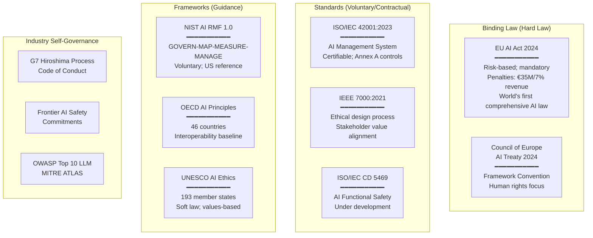
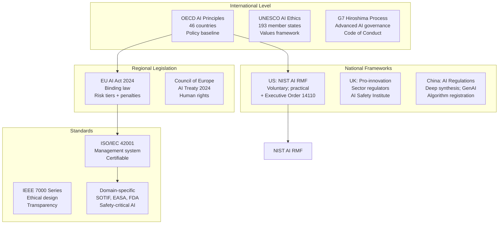
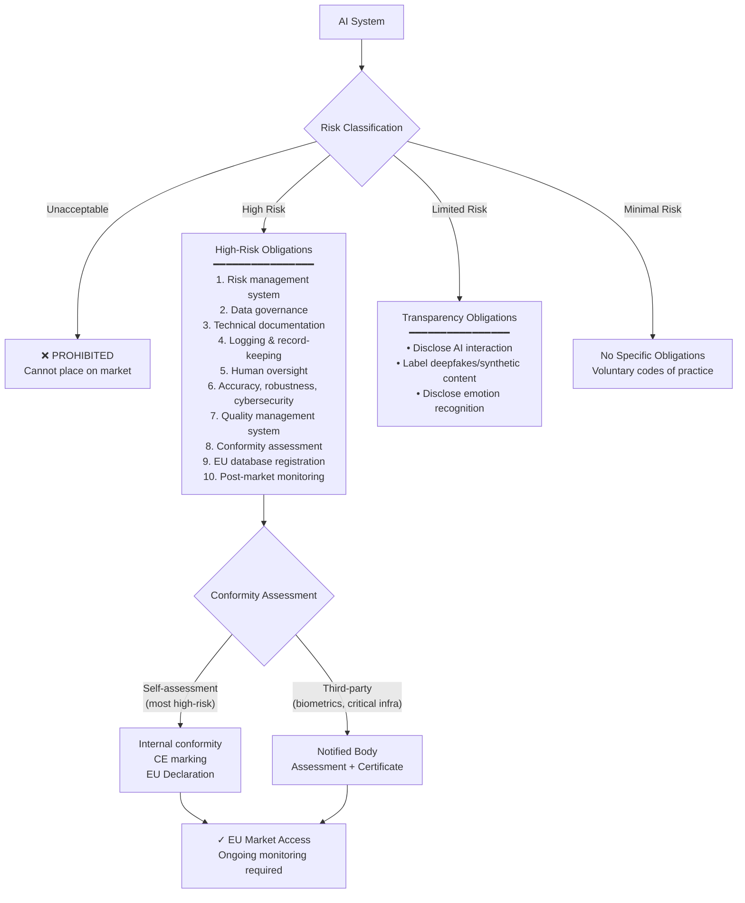

# AI & ML Governance Landscape Overview

**Topic:** Comprehensive overview of AI/ML governance standards, regulations, and frameworks globally  
**Key Frameworks:** EU AI Act (2024), ISO/IEC 42001:2023, NIST AI RMF 1.0, OECD AI Principles, IEEE 7000 Series, EASA AI Roadmap  
**Audience:** AI/ML engineers, compliance officers, product managers, policy makers, safety engineers, legal teams  
**Prerequisites:** Basic AI/ML concepts, regulatory awareness, software lifecycle understanding

---

## Chapter 1 — Historical Context & Origin Story

### 1.1 Timeline

| Year | Event | Significance |
|------|-------|-------------|
| 1950 | Turing: "Computing Machinery and Intelligence" | First formal discussion of machine intelligence |
| 1956 | Dartmouth Conference | "Artificial Intelligence" term coined; field established |
| 1986 | Backpropagation (Rumelhart, Hinton, Williams) | Enabled deep neural network training |
| 1997 | Deep Blue beats Kasparov | AI demonstrates superhuman performance in narrow domain |
| 2012 | AlexNet wins ImageNet | Deep learning revolution begins; GPU-accelerated training |
| 2016 | AlphaGo defeats Lee Sedol | Reinforcement learning achieves world-champion level |
| 2017 | Transformer architecture (Vaswani et al.) | "Attention is All You Need" — foundation of modern LLMs |
| 2018 | BERT (Google); GPT-1 (OpenAI) | Language model pre-training; foundation model paradigm |
| 2019 | OECD AI Principles adopted (42 countries) | First international AI governance principles |
| 2019 | GPT-2 (OpenAI) | Responsible disclosure debate; "too dangerous to release" |
| 2020 | GPT-3 (175B parameters) | Scale breakthrough; emergent capabilities; governance urgency |
| 2021 | EU AI Act proposed (April 2021) | First comprehensive AI legislation globally |
| 2021 | IEEE 7000:2021 published | Model process for ethical AI system design |
| 2021 | UNESCO AI Ethics Recommendation | 193 member states adopt ethical AI framework |
| 2022 | ChatGPT released (November) | Public AI governance crisis; acceleration of regulation |
| 2023 | GPT-4; Claude; NIST AI RMF 1.0 | Multi-modal AI; US framework published |
| 2023 | EU AI Act political agreement | Final text agreed (Dec 2023) |
| 2023 | ISO/IEC 42001:2023 published | First ISO management system standard for AI |
| 2023 | G7 Hiroshima AI Process | International code of conduct for advanced AI |
| 2023 | UK AI Safety Summit (Bletchley Park) | International AI safety commitments |
| 2024 | **EU AI Act** published (August 2024) | World's first comprehensive AI law; Regulation 2024/1689 |
| 2024 | NIST AI 600-1: GenAI Profile | Specific guidance for generative AI risks |
| 2024 | Council of Europe AI Treaty | Framework Convention on AI and Human Rights |

### 1.2 The AI Governance Problem

| Challenge | Why It's Hard |
|:---------:|---------------|
| **Pace of innovation** | AI capabilities advance faster than regulation can respond |
| **Opacity** | Deep learning models are inherently difficult to explain ("black box") |
| **Scale** | Single AI system may affect millions of people simultaneously |
| **Dual-use** | Same model can be beneficial (medical diagnosis) or harmful (deepfakes) |
| **Cross-border** | AI deployed globally; national regulation insufficient alone |
| **Emergent behavior** | Large models exhibit capabilities not designed or predicted |
| **Accountability gap** | When AI makes harmful decision, who is responsible? Developer? Deployer? User? |
| **Measurement** | How to quantify fairness, transparency, safety for AI systems? |

---

## Chapter 2 — Global Governance Architecture

### 2.1 Regulatory Landscape Map



### 2.2 Regulatory Comparison

| Dimension | EU AI Act | NIST AI RMF | ISO 42001 | OECD Principles |
|:---------:|:---------:|:-----------:|:---------:|:---------------:|
| **Type** | Law (binding) | Framework (voluntary) | Standard (certifiable) | Principles (soft law) |
| **Geography** | EU (extraterritorial) | US (voluntary global) | International | 46 countries |
| **Approach** | Risk-based tiering | Risk management | Management system | Values-based |
| **Enforcement** | Fines (€35M/7%) | None (voluntary) | Certification audit | Peer review |
| **Scope** | All AI in EU market | US organizations | Any organization | Government policy |
| **Published** | August 2024 | January 2023 | December 2023 | May 2019 |
| **Key innovation** | Risk categories + conformity assessment | Four core functions | Annex A AI controls | International consensus |

---

## Chapter 3 — EU AI Act Overview

### 3.1 Risk Tiers

| Tier | Risk Level | Examples | Obligations |
|:----:|:----------:|---------|-------------|
| **Unacceptable** | Banned | Social scoring by governments; real-time biometric surveillance in public (exceptions); subliminal manipulation; exploitation of vulnerabilities | **Prohibited** — cannot be placed on EU market |
| **High Risk** | Strictly regulated | Medical devices with AI; vehicle safety components; recruitment/HR AI; credit scoring; law enforcement; border control; infrastructure management | Full compliance: QMS, conformity assessment, logging, human oversight, accuracy, robustness |
| **Limited Risk** | Transparency | Chatbots; emotion recognition; deepfake generators; AI-generated content | Disclosure obligations (user must know they interact with AI) |
| **Minimal Risk** | Unrestricted | Spam filters; AI in video games; recommendation systems (non-manipulative) | No specific obligations (voluntary codes of practice) |

### 3.2 High-Risk Obligations

| Obligation | EU AI Act Article | Requirement |
|:---:|:---:|---|
| Risk management | Art. 9 | Continuous risk management system; identify and mitigate risks |
| Data governance | Art. 10 | Training data quality; bias examination; relevance; representativeness |
| Technical documentation | Art. 11 | Complete documentation before market placement (Annex IV) |
| Record-keeping | Art. 12 | Automatic logging of AI system operation; auditability |
| Transparency | Art. 13 | Clear instructions for deployers; limitations; intended purpose |
| Human oversight | Art. 14 | Effective human oversight mechanisms; ability to override/stop |
| Accuracy + robustness + cybersecurity | Art. 15 | Appropriate levels declared; resilient to errors and attacks |
| Quality management | Art. 17 | QMS covering risk management, data governance, documentation, monitoring |
| Conformity assessment | Art. 43 | Self-assessment or third-party (depends on Annex) |
| EU database registration | Art. 49 | Register high-risk AI before market placement |
| Post-market monitoring | Art. 72 | Continuous monitoring after deployment; incident reporting |

### 3.3 Timeline (Enforcement)

| Date | What Becomes Applicable |
|:----:|---|
| **February 2, 2025** | Prohibited AI practices (ban in force) |
| **August 2, 2025** | GPAI model obligations; governance structure; penalties |
| **August 2, 2026** | High-risk AI obligations; full enforcement |
| **August 2, 2027** | Certain AI systems in Annex I (existing EU legislation) |

---

## Chapter 4 — Key Standards Deep Dive

### 4.1 ISO/IEC 42001:2023 (AI Management System)

| Aspect | Detail |
|--------|--------|
| **Type** | Management System Standard (MSS); certifiable; audit-based |
| **Structure** | Clauses 4-10 (ISO High Level Structure) + Annex A (AI-specific controls) + Annex B (guidance) |
| **Aligns with** | ISO 9001 (Quality); ISO 27001 (Security); ISO 14001 (Environment) |
| **Annex A areas** | AI policy, roles, risk assessment, data management, AI system development, performance evaluation, third-party management |
| **Certification** | Third-party audit (ISO/IEC 17021); certifiable from 2024 |
| **Key benefit** | Demonstrates responsible AI governance to regulators, customers, public |

### 4.2 NIST AI RMF 1.0 (AI Risk Management Framework)

| Core Function | Purpose | Key Activities |
|:---:|---|---|
| **GOVERN** | Organizational culture + governance for AI risk | Policies, roles, accountability, legal compliance, stakeholder engagement |
| **MAP** | Context and risk identification | Intended use, AI system characteristics, stakeholder impacts, legal requirements |
| **MEASURE** | Quantify and track AI risks | Metrics, evaluation criteria, bias measurement, performance monitoring |
| **MANAGE** | Prioritize and act on risks | Risk treatment, response actions, communication, continuous improvement |

### 4.3 OECD AI Principles (2019)

| Principle | Description |
|:---------:|-------------|
| **Inclusive growth** | AI should benefit people and planet; sustainable development |
| **Human-centred values** | Respect human rights, diversity, autonomy, privacy |
| **Transparency & explainability** | Meaningful information about AI systems; understandable |
| **Robustness, security, safety** | Function appropriately; risk management throughout lifecycle |
| **Accountability** | Organizations and individuals accountable for proper functioning |

---

## Chapter 5 — AI Safety in Safety-Critical Domains

### 5.1 Domain-Specific AI Standards

| Domain | Standard/Guidance | Focus |
|:------:|:-----------------:|-------|
| **Automotive** | ISO/SAE 21448 (SOTIF) | Safety of intended functionality; ML perception limits |
| **Automotive** | ISO TR 4804 | Safety and cybersecurity for automated driving |
| **Automotive** | ISO/IEC CD 5469 | AI functional safety (under development) |
| **Aviation** | EASA AI Roadmap 2.0 (2023) | Concept of Learning Systems (CoLS); ML certification |
| **Aviation** | DO-178C + EASA guidance | ML supplement considerations (no formal supplement yet) |
| **Medical** | EU MDR + AI Act | AI in medical devices (dual regulation) |
| **Medical** | FDA AI/ML SaMD guidance | Software as Medical Device with AI/ML |
| **Railway** | IEC TR 63317 | AI in functional safety systems (guidance) |
| **Industrial** | IEC 61508 + AI considerations | AI for safety-instrumented systems |

### 5.2 The SOTIF Challenge for AI

ISO/SAE 21448 (SOTIF) specifically addresses AI/ML perception failures:

| Scenario | Risk |
|:--------:|------|
| Object misclassification | Camera-based AI classifies pedestrian as post → no braking |
| Edge cases | Rain/fog/night degrades perception AI below safety threshold |
| Adversarial inputs | Modified traffic sign fools AI classifier |
| Distribution shift | Training data doesn't represent real-world diversity |
| Confidence calibration | AI says 99% confident but is wrong (poorly calibrated) |

---

## Chapter 6 — AI Security (MITRE ATLAS / OWASP)

### 6.1 MITRE ATLAS Attack Taxonomy

| Attack Category | Description | Example |
|:---:|---|---|
| **Evasion** | Input modified to cause misclassification at inference time | Adversarial patch on stop sign → AI sees speed limit |
| **Poisoning** | Training data corrupted to create backdoor or degrade model | Inject mislabeled data → model fails on specific trigger |
| **Model extraction** | Query model to steal architecture/weights | API queries to reconstruct proprietary model |
| **Model inversion** | Recover training data from model responses | Reconstruct faces from face recognition model |
| **Prompt injection** | Manipulate LLM via crafted prompts | Override system instructions via user input |
| **Supply chain** | Compromise ML pipeline components | Malicious pre-trained model weights; poisoned dataset |

### 6.2 OWASP Top 10 for LLM Applications (2023)

| # | Vulnerability | Description |
|:-:|:---:|---|
| LLM01 | **Prompt Injection** | Direct or indirect manipulation of LLM via prompts |
| LLM02 | **Insecure Output Handling** | Insufficient validation of LLM outputs before use |
| LLM03 | **Training Data Poisoning** | Manipulated training data corrupting model behavior |
| LLM04 | **Model Denial of Service** | Resource exhaustion attacks on LLM inference |
| LLM05 | **Supply Chain Vulnerabilities** | Third-party datasets, models, plugins compromised |
| LLM06 | **Sensitive Information Disclosure** | LLM revealing private/proprietary data from training |
| LLM07 | **Insecure Plugin Design** | LLM plugins with inadequate access control |
| LLM08 | **Excessive Agency** | LLM granted too many permissions; takes harmful actions |
| LLM09 | **Overreliance** | Users trusting LLM output without verification |
| LLM10 | **Model Theft** | Unauthorized access to proprietary LLM models |

---

## Chapter 7 — Comparison of Major Frameworks

| Aspect | EU AI Act | ISO 42001 | NIST AI RMF | IEEE 7000 | OECD |
|:------:|:---------:|:---------:|:-----------:|:---------:|:----:|
| **Binding?** | Yes (law) | Voluntary (contractual) | Voluntary | Voluntary | Soft law |
| **Scope** | EU market (extraterritorial) | Any organization | US + global | System design | National policy |
| **Focus** | Compliance + safety | Management system | Risk management | Ethical design | Principles |
| **Risk approach** | 4 tiers (unacceptable→minimal) | Annex A controls | GOVERN-MAP-MEASURE-MANAGE | Value-sensitive design | 5 principles |
| **Certification** | Conformity assessment (CE marking) | ISO audit certification | Self-assessment | Process standard | N/A |
| **Penalties** | €35M / 7% revenue | Contractual (B2B requirement) | None | None | None |
| **Maturity** | New (2024) | New (2023) | Published (2023) | Published (2021) | Established (2019) |
| **Best for** | Legal compliance (EU market) | Organizational governance | US market; practical approach | Design-phase ethics | Policy alignment |

---

## Chapter 8 — Mermaid Architecture Diagrams

### 8.1 AI Governance Ecosystem



### 8.2 EU AI Act Compliance Flow



---

## Chapter 9 — Case Studies

### 9.1 Automotive: ADAS Perception AI Under SOTIF + EU AI Act

| Aspect | Detail |
|--------|--------|
| **System** | Camera-based pedestrian detection for AEB (Autonomous Emergency Braking); ASIL D; deep learning model |
| **Challenge** | How to certify ML perception when: (1) model behavior not fully deterministic; (2) edge cases are infinite; (3) no traditional testing can prove safety; (4) EU AI Act classifies this as high-risk AI |
| **Regulatory stack** | ISO 26262 (functional safety) + ISO 21448 SOTIF (intended functionality safety) + EU AI Act (AI governance) + UNECE R157 (automated driving) |
| **Approach** | (1) SOTIF: identify triggering conditions (rain, fog, occlusion, unusual pedestrian appearance); estimate residual risk; demonstrate acceptable by field testing. (2) EU AI Act compliance: data governance (training data documented; bias assessment per demographics); technical documentation (model architecture, training process, performance metrics); human oversight (driver must remain attentive; system alerts on low confidence). (3) ISO 26262: safety concept with AI; degradation modes defined; redundancy (radar + camera fusion reduces single-point AI failure). |
| **Lesson** | AI in safety-critical automotive requires TRIPLE compliance: functional safety + SOTIF + EU AI Act. No single standard covers all aspects. |

### 9.2 Enterprise: Achieving ISO 42001 Certification

| Aspect | Detail |
|--------|--------|
| **Organization** | Mid-size SaaS company; AI-powered recruitment platform (CV screening, candidate ranking) |
| **Motivation** | EU AI Act classifies recruitment AI as HIGH-RISK; ISO 42001 demonstrates compliance readiness; customer requirement |
| **Implementation** | (1) Gap analysis against Annex A (12 months before target). (2) AI Policy established (board-approved; covers responsible AI principles). (3) AI Risk Assessment framework (aligned to NIST AI RMF MAP function). (4) Data governance: training data provenance; bias testing per demographic group. (5) AI impact assessment for each AI feature (aligned to EU AI Act Art. 9). (6) Human oversight: all final hiring decisions require human confirmation; AI only recommends. (7) Monitoring: model performance dashboard; drift detection; fairness metrics tracked monthly. |
| **Certification** | Third-party ISO 42001 audit; 4 minor non-conformities (documentation gaps; all closed within 3 months); certification awarded |
| **Impact** | Won 3 enterprise contracts that required "responsible AI" evidence; positioned for EU AI Act compliance (Aug 2026 deadline); marketing advantage |

---

## Chapter 10 — Future Evolution

| Trend | Timeline | Impact |
|-------|----------|--------|
| **EU AI Act full enforcement** | Aug 2026 | All high-risk AI must comply; conformity assessments required; first penalties |
| **ISO 5469 (AI Functional Safety)** | 2025-2026 | First international standard for AI in safety-critical systems; automotive/industrial adoption |
| **AI liability directive (EU)** | 2025-2026 | Complementing AI Act; shifting burden of proof for AI harm to providers |
| **Global convergence** | 2025-2030 | Mutual recognition of AI standards; OECD → ISO → EU alignment |
| **Foundation model regulation** | 2025-2027 | GPAI obligations under EU AI Act; model cards; systemic risk assessment |
| **AI auditing profession** | 2024-2027 | New profession: AI auditors (similar to financial auditors); certification programs |
| **Real-time AI governance** | 2025-2028 | Continuous compliance monitoring; automated governance dashboards |

---

## Chapter 11 — Interview Questions & Career Guide

### Tier 1: Entry-Level

**Q1:** What are the four risk tiers in the EU AI Act? Give an example of each.

**A:** The EU AI Act classifies AI systems into four risk levels with proportional obligations:

(1) **Unacceptable Risk (Banned)**: AI practices considered unacceptable and prohibited. Examples: government social scoring systems that rank citizens for privileges/punishment; real-time remote biometric identification in public spaces (with limited law enforcement exceptions); AI that exploits vulnerabilities of specific groups (children, elderly); subliminal manipulation techniques.

(2) **High Risk (Heavily Regulated)**: AI used in sensitive areas where errors could cause significant harm. Examples: AI in medical devices (diagnostic AI); AI for recruitment/hiring decisions; AI in vehicle safety systems (ADAS); credit scoring AI; AI in law enforcement (predictive policing). These must comply with extensive obligations: risk management, data governance, transparency, human oversight, accuracy, conformity assessment.

(3) **Limited Risk (Transparency)**: AI systems that interact with people or generate content. Examples: chatbots (user must be told they're talking to AI); deepfake generators (content must be labeled as AI-generated); emotion recognition systems (must disclose). Main obligation: TELL the user it's AI.

(4) **Minimal Risk (No specific obligations)**: Most AI falls here. Examples: spam filters; AI in video games; content recommendation (non-manipulative); industrial optimization. Free to deploy with no AI-specific regulatory requirements. Voluntary codes of practice encouraged.

### Tier 2: Mid-Level

**Q2:** How do ISO 42001, NIST AI RMF, and the EU AI Act relate to each other? Can compliance with one help with the others?

**A:** They are complementary layers serving different purposes:

**EU AI Act** = WHAT you must do (legal compliance; mandatory for EU market). **ISO 42001** = HOW to organize your AI governance (management system; certifiable). **NIST AI RMF** = HOW to manage AI risks practically (risk management process; US-focused).

**Synergies**: ISO 42001 was designed with EU AI Act awareness — implementing ISO 42001's Annex A controls provides strong evidence for EU AI Act compliance (especially Art. 9 risk management, Art. 17 quality management). NIST AI RMF's four functions (GOVERN, MAP, MEASURE, MANAGE) map to ISO 42001's Plan-Do-Check-Act cycle and EU AI Act's risk management obligations.

**Practical approach**: (1) Adopt NIST AI RMF as your INTERNAL risk management methodology (flexible, practical, well-documented playbook). (2) Implement ISO 42001 as your MANAGEMENT SYSTEM (provides structure, certification, audit trail). (3) MAP both to EU AI Act requirements for LEGAL COMPLIANCE documentation.

This way: NIST gives you the practical "how-to"; ISO 42001 gives you the organizational structure and certification; together they provide robust evidence for EU AI Act conformity assessment. Many organizations are pursuing all three simultaneously because 80%+ of the work overlaps.

### Tier 3: Senior

**Q3:** You are the AI governance lead for a company deploying an ML-based diagnostic system in EU hospitals. Design the compliance architecture covering EU AI Act, MDR, ISO 42001, and NIST AI RMF.

**A:** This is dual-regulated: EU AI Act (high-risk AI — healthcare) AND EU Medical Device Regulation (MDR) as Software as Medical Device (SaMD). Must satisfy both simultaneously.

**Regulatory mapping**: EU AI Act classifies AI medical devices as high-risk (Annex I, Section A, point 22). MDR (2017/745) classifies SaMD separately (Rule 11). The AI Act Art. 6(1) states: if the AI system is already a regulated product under Annex I legislation (MDR), the conformity assessment per that legislation covers AI Act requirements (single assessment for medical devices). Key: the MDR Notified Body assessment incorporates AI Act requirements.

**Architecture**:

*Layer 1 — Management System (ISO 42001)*: Certifiable AI governance; covers: AI policy, AI risk assessment process, data governance, development lifecycle, monitoring, incident management, third-party AI management. Aligned with existing ISO 13485 (medical device QMS).

*Layer 2 — Risk Management (NIST AI RMF + ISO 14971)*: GOVERN: AI governance committee; roles (AI risk officer; clinical safety officer; data privacy officer). MAP: Clinical use case documentation; patient populations; intended conditions of use; AI system characteristics (model type, training data demographics, performance boundaries). MEASURE: Clinical performance metrics (sensitivity, specificity, AUC); fairness metrics across demographics; robustness to input variation; calibration. MANAGE: Risk treatment (human-in-the-loop for critical diagnoses; confidence thresholds for referral; model update governance).

*Layer 3 — EU AI Act High-Risk Compliance*: Art. 9: Risk management (covered by NIST MAP+MANAGE + ISO 14971). Art. 10: Data governance (training data protocol; annotation quality; bias assessment; consent for patient data per GDPR). Art. 11: Technical documentation (per Annex IV; model card format). Art. 12: Logging (all inference decisions logged with patient ID, confidence score, clinician action). Art. 13: Transparency (IFU for clinicians; AI limitations clearly stated; instructions on oversight). Art. 14: Human oversight (AI provides recommendation; physician makes final decision; escalation pathway if AI confidence < threshold). Art. 15: Accuracy/robustness/cybersecurity (clinical validation study; adversarial robustness testing; OWASP/ATLAS security assessment).

*Layer 4 — MDR Compliance*: Clinical evaluation per MDCG guidance; CE marking via Notified Body; post-market clinical follow-up (PMCF); periodic safety update report (PSUR). Model updates: any significant model retrain = potential substantial change → may need new conformity assessment.

*Layer 5 — Monitoring & Continuous Compliance*: Performance drift detection; automated fairness monitoring; incident reporting (serious incidents within 15 days per MDR); model lifecycle governance (change control for retraining; validation before deployment).

---

## Chapter 12 — Cheat Sheet & Quick Reference

```
═══════════════════════════════════════════
AI/ML GOVERNANCE — QUICK REFERENCE
═══════════════════════════════════════════

EU AI ACT RISK TIERS:
  Unacceptable: BANNED (social scoring, subliminal manipulation)
  High Risk:    Full compliance (healthcare, safety, HR, law enforcement)
  Limited:      Transparency (chatbots, deepfakes must disclose)
  Minimal:      No obligations (spam filters, games)

PENALTIES: €35M or 7% global revenue (for prohibited violations)
           €15M or 3% (for other violations)

TIMELINE:
  Feb 2025: Prohibited AI banned
  Aug 2025: GPAI obligations
  Aug 2026: HIGH-RISK fully enforced

═══════════════════════════════════════════
KEY STANDARDS:
  EU AI Act:   Law; binding; EU market; risk-based
  ISO 42001:   Management system; certifiable; organizational governance
  NIST AI RMF: Framework; voluntary; GOVERN-MAP-MEASURE-MANAGE
  OECD:        Principles; 46 countries; policy baseline
  IEEE 7000:   Design process; ethical; stakeholder values

═══════════════════════════════════════════
NIST AI RMF CORE FUNCTIONS:
  GOVERN:  Policies, accountability, culture for AI risk
  MAP:     Context, stakeholders, impacts, system characteristics
  MEASURE: Metrics, evaluation, monitoring, bias detection
  MANAGE:  Treatment, response, communication, improvement

═══════════════════════════════════════════
ISO 42001 STRUCTURE:
  Clauses 4-10: High Level Structure (same as 27001/9001)
  Annex A:      AI-specific controls (organizational AI objectives,
                risk, data, development, performance, third-party)
  Annex B:      Implementation guidance
  Certification: Third-party audit (ISO 17021)

═══════════════════════════════════════════
AI SAFETY-CRITICAL:
  Automotive: ISO 21448 SOTIF + ISO 26262 + EU AI Act
  Aviation:   EASA AI Roadmap + DO-178C + EU AI Act
  Medical:    EU MDR + EU AI Act + ISO 14971
  Railway:    IEC TR 63317 + EN 50128 + EU AI Act
  Industrial: IEC 61508 + IEC TR 63317 + EU AI Act

═══════════════════════════════════════════
AI SECURITY (MITRE ATLAS):
  Evasion:     Adversarial inputs fool model at inference
  Poisoning:   Corrupted training data creates backdoor
  Extraction:  Steal model via API queries
  Inversion:   Recover training data from model
  Prompt Injection: Manipulate LLM instructions

═══════════════════════════════════════════
COMPLIANCE STRATEGY:
  1. NIST AI RMF → internal risk management process
  2. ISO 42001 → management system + certification
  3. Map both → EU AI Act requirements for legal compliance
  4. Domain standard → SOTIF / EASA / MDR as applicable
  
  80%+ work overlaps between frameworks
  Implement once; map to multiple standards
```

---

*End of Document — 00_AI_Governance_Landscape.md*
