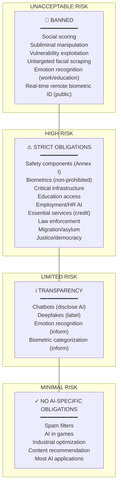

# EU AI Act 2024 (Regulation 2024/1689)

**Topic:** European Union Artificial Intelligence Act — comprehensive AI legislation; risk-based framework; conformity assessment; GPAI obligations; enforcement and penalties  
**Standard:** EU AI Act — Regulation (EU) 2024/1689 of the European Parliament and of the Council  
**Published:** Official Journal of the EU, August 1, 2024; Entry into force: August 1, 2024  
**SDO:** European Parliament & Council of the European Union  
**Audience:** AI developers, deployers, compliance officers, product managers, legal counsel, conformity assessment bodies  
**Prerequisites:** Basic EU regulatory framework knowledge, AI/ML fundamentals, CE marking process awareness

---

## Chapter 1 — Historical Context & Origin Story

### 1.1 Legislative Timeline

| Date | Event | Significance |
|------|-------|-------------|
| 2018 | EU High-Level Expert Group on AI established | 52 experts; foundations for AI strategy |
| April 2018 | EU AI Strategy published | €20B+ investment target; ethical AI principles |
| April 2019 | Ethics Guidelines for Trustworthy AI | 7 key requirements; assessment list (ALTAI) |
| Feb 2020 | White Paper on AI | Public consultation; regulatory options explored |
| **April 21, 2021** | **EU AI Act proposal** (COM/2021/206) | European Commission proposes first comprehensive AI law globally |
| Nov 2021 | Slovenian Council Presidency text | First Council amendments |
| June 2022 | Council general approach | Member states agree negotiating position |
| June 2023 | European Parliament vote | Parliament adopts amendments (499-28-93) |
| Dec 2023 | **Political agreement** (trilogue) | Parliament + Council + Commission agree final text |
| March 2024 | Parliament final vote | 523-46-49; formally adopted |
| May 2024 | Council final adoption | Unanimous approval |
| **Aug 1, 2024** | **Published in Official Journal** | Regulation (EU) 2024/1689; enters into force |
| Feb 2, 2025 | Prohibited practices apply | First enforcement date |
| Aug 2, 2025 | GPAI + governance + penalties apply | Second enforcement date |
| **Aug 2, 2026** | **Full application** | High-risk AI obligations in force |
| Aug 2, 2027 | Annex I AI systems (existing legislation) | Certain embedded AI systems |

### 1.2 Why the EU AI Act Was Necessary

| Problem | EU AI Act Solution |
|:-------:|:------------------:|
| AI opacity ("black box") | Transparency obligations (Art. 13); explainability requirements |
| Algorithmic discrimination | Data governance (Art. 10); bias testing; fundamental rights impact assessment |
| Safety risks | Risk management system (Art. 9); accuracy, robustness requirements (Art. 15) |
| Accountability gaps | Clear roles: providers, deployers, importers, distributors (Chapter III) |
| Regulatory fragmentation | Single EU-wide regulation (directly applicable; no national transposition) |
| Global competitiveness | Harmonized rules; single market for AI; "Brussels effect" |
| Existing law gaps | GDPR covers data privacy but NOT AI-specific risks (safety, bias, manipulation) |

### 1.3 Relationship to Other EU Legislation

```mermaid
graph TB
    AI_ACT[EU AI Act 2024<br/>━━━━━━━━━━━<br/>AI-specific regulation<br/>Risk classification<br/>Conformity assessment]
    
    GDPR[GDPR 2016/679<br/>━━━━━━━━━━━<br/>Personal data protection<br/>Art. 22: automated decisions<br/>Data minimization]
    
    MDR[EU MDR 2017/745<br/>━━━━━━━━━━━<br/>Medical Devices<br/>SaMD classification<br/>Clinical evaluation]
    
    MACH[EU Machinery Reg<br/>(EU) 2023/1230<br/>━━━━━━━━━━━<br/>Safety components<br/>Replaces 2006/42/EC]
    
    PLD[Product Liability Dir<br/>Proposed revision<br/>━━━━━━━━━━━<br/>Liability for AI harm<br/>Burden of proof shift]
    
    DSA[Digital Services Act<br/>(EU) 2022/2065<br/>━━━━━━━━━━━<br/>Platform obligations<br/>Recommender transparency]
    
    AI_ACT --> |"Coordinates with"| GDPR
    AI_ACT --> |"Annex I legislation"| MDR
    AI_ACT --> |"Annex I legislation"| MACH
    AI_ACT --> |"Complemented by"| PLD
    AI_ACT --> |"Coordinates with"| DSA
```

---

## Chapter 2 — Standard Architecture & Structure

### 2.1 EU AI Act Structure

| Title | Articles | Content |
|:-----:|:--------:|---------|
| **I: General provisions** | Art. 1-4 | Subject matter, scope, definitions |
| **II: Prohibited AI practices** | Art. 5 | 8 categories of banned AI |
| **III: High-risk AI** | Art. 6-49 | Classification, requirements, obligations, conformity assessment |
| **IV: Transparency for certain AI** | Art. 50 | Limited-risk obligations (chatbots, deepfakes, emotion recognition) |
| **V: General-purpose AI (GPAI)** | Art. 51-56 | GPAI model obligations; systemic risk |
| **VI: Governance** | Art. 64-68 | AI Office, AI Board, national authorities |
| **VII: EU database** | Art. 71 | Registration of high-risk AI systems |
| **VIII: Post-market monitoring** | Art. 72-73 | Monitoring, reporting, market surveillance |
| **IX: Codes of practice** | Art. 56 | Voluntary codes for GPAI compliance |
| **X: Penalties** | Art. 99-101 | Fines structure and enforcement |
| **Annexes I-XIII** | — | Technical annexes (high-risk list, conformity, documentation) |

### 2.2 Key Definitions (Art. 3)

| Term | Definition (simplified) |
|:----:|---|
| **AI system** | Machine-based system that operates with varying levels of autonomy, that may exhibit adaptiveness, and that infers how to generate outputs (predictions, content, recommendations, decisions) from input |
| **Provider** | Natural or legal person that develops an AI system or has it developed AND places it on market/into service under own name/trademark |
| **Deployer** | Natural or legal person using an AI system under its authority (except personal non-professional use) |
| **High-risk AI system** | AI system referred to in Art. 6 (safety component or Annex III use case) |
| **General-purpose AI model** | AI model trained using large-scale self-supervision on broad data; can be adapted to wide range of tasks |
| **Placing on the market** | First making available on EU market |
| **Putting into service** | Supply for first use directly to deployer or for own use in EU |

---

## Chapter 3 — Technical Deep Dive: Risk Classification

### 3.1 Prohibited AI Practices (Art. 5)

| # | Prohibited Practice | Why Banned |
|:-:|---|---|
| 1 | **Subliminal manipulation** — AI deploying subliminal techniques beyond person's consciousness causing harm | Undermines human autonomy; consent impossible |
| 2 | **Exploiting vulnerabilities** — AI exploiting age, disability, social/economic situation causing harm | Preys on vulnerable groups |
| 3 | **Social scoring** — AI evaluating/classifying persons based on social behavior leading to detrimental treatment | Totalitarian surveillance; chilling effects |
| 4 | **Predictive policing (individual)** — AI predicting individual criminal offending solely based on profiling/personality traits | Prejudice; no right to be treated as presumed criminal |
| 5 | **Untargeted facial image scraping** — Creating facial recognition databases from untargeted internet/CCTV scraping | Mass surveillance without consent |
| 6 | **Emotion recognition at work/education** — Inferring emotions in workplace/educational settings (exceptions for safety) | Privacy; power imbalance; unreliable science |
| 7 | **Biometric categorization (sensitive attributes)** — Categorizing persons by race, political opinions, trade union, religion, sex life from biometrics | Discrimination; fundamental rights |
| 8 | **Real-time remote biometric identification in public** — Law enforcement use in publicly accessible spaces (narrow exceptions for terrorism, missing persons) | Mass surveillance; chilling effect on freedoms |

### 3.2 High-Risk Classification (Art. 6)

Two pathways to high-risk:

**Pathway 1 — Safety component** (Art. 6(1)):
- AI system IS a safety component of a product covered by EU harmonization legislation (Annex I)
- OR AI system IS ITSELF such a product
- AND the product requires third-party conformity assessment under that legislation

**Pathway 2 — Annex III use cases** (Art. 6(2)):

| Area | Examples |
|:----:|---------|
| Biometrics | Remote biometric identification (non-prohibited); biometric categorization |
| Critical infrastructure | AI managing road traffic, water, gas, electricity, heating |
| Education | AI determining access to education; evaluating students; adaptive learning (affecting access) |
| Employment | AI for recruitment; CV screening; job advertising targeting; monitoring/evaluating workers |
| Essential services | AI for credit scoring; insurance pricing; emergency services dispatch |
| Law enforcement | AI for polygraph/deception; evidence reliability assessment; crime analytics |
| Migration/asylum | AI for border patrol; visa applications; residence permit decisions |
| Justice/democratic processes | AI assisting judges; influencing elections |

### 3.3 High-Risk Requirements (Articles 8-15)

| Article | Requirement | Key Details |
|:-------:|:-----------:|---|
| **Art. 9** | Risk management system | Continuous, iterative; identify + analyze + estimate + evaluate risks; testing + residual risk communication |
| **Art. 10** | Data governance | Training/validation/test data quality; examination for bias; data relevance, representativeness, correctness |
| **Art. 11** | Technical documentation | BEFORE market placement; Annex IV template; system description, design, development methodology, accuracy metrics |
| **Art. 12** | Record-keeping (logging) | Automatic logging; enable traceability; appropriate to intended purpose; retention period |
| **Art. 13** | Transparency | Instructions for deployers; system capabilities + limitations; intended purpose; human oversight measures; accuracy metrics |
| **Art. 14** | Human oversight | Designed for effective human oversight; measures built into system OR identified by provider for deployer; ability to override/stop |
| **Art. 15** | Accuracy, robustness, cybersecurity | Appropriate accuracy levels (declared); resilient to errors, faults, inconsistencies; protected against adversarial attacks |

---

## Chapter 4 — Implementation Guide

### 4.1 Provider Compliance Roadmap

```mermaid
flowchart TD
    START[Determine if AI system<br/>in scope of EU AI Act]
    
    START --> SCOPE{In scope?}
    SCOPE -->|"No<br/>(military, research,<br/>personal non-professional)"| OUT[Outside scope<br/>No obligations]
    SCOPE -->|"Yes"| CLASS{Classify risk level}
    
    CLASS -->|"Unacceptable"| STOP[❌ STOP<br/>Cannot deploy in EU]
    CLASS -->|"High risk"| HIGH_PATH[High-Risk Compliance Path]
    CLASS -->|"Limited"| TRANS[Implement transparency<br/>obligations (Art. 50)]
    CLASS -->|"Minimal"| VOL[Voluntary code of practice<br/>No mandatory obligations]
    
    HIGH_PATH --> QMS[1. Quality Management System<br/>Art. 17]
    QMS --> RISK[2. Risk Management System<br/>Art. 9 — continuous, iterative]
    RISK --> DATA[3. Data Governance<br/>Art. 10 — bias, quality, provenance]
    DATA --> DOC[4. Technical Documentation<br/>Art. 11, Annex IV]
    DOC --> LOG[5. Logging Capability<br/>Art. 12 — automatic records]
    LOG --> HUMAN[6. Human Oversight Design<br/>Art. 14 — override, stop, interpret]
    HUMAN --> PERF[7. Accuracy, Robustness, Security<br/>Art. 15 — declared levels, tested]
    PERF --> TRANS2[8. Transparency + Instructions<br/>Art. 13 — clear for deployers]
    
    TRANS2 --> CONFORM[9. Conformity Assessment<br/>Art. 43]
    CONFORM -->|"Most: self-assessment"| SELF[Internal Assessment<br/>Annex VI procedure]
    CONFORM -->|"Biometrics, critical"| NB[Notified Body Assessment<br/>Annex VII procedure]
    
    SELF --> CE[10. CE Marking + EU Declaration<br/>Art. 47-48]
    NB --> CE
    CE --> REG[11. Register in EU Database<br/>Art. 49, 71]
    REG --> MARKET[✓ Place on EU Market<br/>Post-market monitoring begins]
```

### 4.2 Conformity Assessment: Self vs. Third-Party

| Aspect | Self-Assessment (Annex VI) | Third-Party (Annex VII) |
|:------:|:-:|:-:|
| **When** | Most high-risk AI systems | Real-time remote biometric ID; critical infrastructure (in some cases) |
| **Who conducts** | Provider (internal) | Notified Body (accredited by national authority) |
| **Output** | EU Declaration of Conformity; affix CE marking | Certificate of conformity; EU Declaration; CE marking |
| **Process** | Verify compliance with Chapter III requirements; document evidence; QMS in place | Submit technical documentation; NB reviews + tests; may audit QMS |
| **Cost** | Internal effort | External audit fees |
| **Validity** | Continuous (self-monitored) | Certificate typically 5 years; surveillance audits |

### 4.3 Technical Documentation (Annex IV)

| Section | Required Content |
|:-------:|---|
| 1 | General description: intended purpose, provider identity, version, previous versions |
| 2 | Detailed system description: architecture, computational resources, inputs/outputs, design choices |
| 3 | Development methodology: design specifications, computing infrastructure, data requirements, training approach |
| 4 | Data: training/validation/testing datasets; data governance measures; origin, scope, characteristics; labeling methodology; biases identified |
| 5 | Testing: validation and testing procedures; metrics used; test against specific persons/groups; testing dates; accuracy levels |
| 6 | Risk management measures: risks identified; measures taken; residual risk acceptable vs. benefit |
| 7 | Changes: record of changes during lifecycle |
| 8 | Quality management: compliance with Art. 17 |
| 9 | Harmonized standards applied (if any) |
| 10 | EU Declaration of Conformity |

---

## Chapter 5 — General-Purpose AI (GPAI) Models

### 5.1 GPAI Obligations (Chapter V)

| Obligation | All GPAI Models | + Systemic Risk GPAI |
|:---:|---|---|
| **Technical documentation** (Art. 53) | Model capabilities, limitations, training methodology, evaluation results | Same + adversarial testing details |
| **Copyright policy** (Art. 53) | Sufficiently detailed summary of training data content (copyright compliance) | Same |
| **EU AI Office engagement** | Cooperation with AI Office | Same + additional reporting |
| **Downstream provider obligations** | Provide information for high-risk system compliance | Same |
| **Model evaluation** | — | Adversarial testing; risk assessment |
| **Serious incident reporting** | — | Report to AI Office without delay |
| **Cybersecurity** | — | Ensure adequate cybersecurity protection |
| **Energy consumption** | Report known/estimated energy consumption of training | Same |

### 5.2 Systemic Risk Determination

A GPAI model has **systemic risk** if:
- Training compute > $10^{25}$ FLOPs (current threshold); OR
- European Commission designates it (based on capability assessments)

Current models potentially above threshold (as of 2024): GPT-4, Claude 3 Opus, Gemini Ultra, Llama 3 405B.

### 5.3 Codes of Practice (Art. 56)

| Aspect | Detail |
|--------|--------|
| **Purpose** | Provide detailed compliance guidance for GPAI obligations |
| **Development** | AI Office coordinates; industry, civil society, academia participate |
| **Status** | Codes being developed (2024-2025); final by Aug 2025 |
| **Effect** | Adherence creates presumption of GPAI compliance; non-binding but strong signal |
| **Alternative** | If no code exists/followed, provider demonstrates compliance by other means |

---

## Chapter 6 — Governance & Enforcement

### 6.1 Governance Structure

| Body | Role | Composition |
|:----:|------|:-----------:|
| **European AI Office** | Oversee GPAI rules; coordinate enforcement; develop guidance | Commission body; AI expertise |
| **AI Board** | Advise Commission; coordinate national authorities; ensure consistent application | One representative per Member State |
| **National Competent Authorities** | Market surveillance; enforcement; complaints; Annex III high-risk oversight | Designated by each Member State |
| **Notified Bodies** | Conformity assessment (third-party); Annex VII procedures | Accredited by national accreditation bodies |
| **Advisory Forum** | Stakeholder input; technical advice to Board/Commission | Industry, SMEs, civil society, academia |
| **Scientific Panel** | Independent experts; support AI Office on GPAI/systemic risk evaluation | Expert nomination |

### 6.2 Penalties (Art. 99)

| Violation Type | Maximum Fine |
|:-:|:-:|
| Prohibited AI practices (Art. 5) | **€35 million** or **7%** global annual turnover (whichever higher) |
| High-risk AI non-compliance + GPAI non-compliance | **€15 million** or **3%** global annual turnover |
| Supplying incorrect/misleading information to authorities | **€7.5 million** or **1%** global annual turnover |
| **SME/startup reduction** | Proportional limits apply (lower of absolute amount vs. percentage) |

### 6.3 Fundamental Rights Impact Assessment (Art. 27)

Deployers of high-risk AI in public sector (or private entities providing public services) must conduct FRIA:

| Step | Activity |
|:----:|----------|
| 1 | Describe deployer's processes where AI system will be used |
| 2 | Describe period/frequency of use |
| 3 | Categories of persons/groups potentially affected |
| 4 | Specific risks of harm to identified groups |
| 5 | Human oversight measures |
| 6 | Measures if risks materialize (complaint mechanisms, redress) |

---

## Chapter 7 — Comparison with Other AI Regulations

### 7.1 EU AI Act vs. Other Jurisdictions

| Aspect | EU AI Act | US (Executive Order 14110 + state laws) | UK (Pro-Innovation) | China |
|:------:|:---------:|:---:|:---:|:---:|
| **Approach** | Horizontal regulation; risk-based | Sectoral; NIST framework; no comprehensive federal law | Sector regulators; principles-based; no new AI law | Algorithm registration; deep synthesis; GenAI regulations |
| **Binding** | Yes (Regulation; directly applicable) | EO non-binding for private sector; state laws vary | Guidance; existing regulators | Yes (multiple regulations) |
| **Risk classification** | 4 tiers (explicit) | None (sector-specific) | Context-dependent (regulators decide) | Registration-based |
| **GPAI/Foundation models** | Chapter V specific obligations | NIST AI 600-1 (voluntary) | AI Safety Institute (evaluation) | GenAI Administrative Measures |
| **Penalties** | Up to €35M/7% | Sector-dependent | Sector-dependent | Fines + service suspension |
| **Extraterritorial** | Yes (any AI affecting EU persons/market) | Limited | No | Limited |
| **Innovation provisions** | AI regulatory sandboxes (Art. 57-63) | Sector sandboxes (informal) | Regulatory sandboxes | Regulatory sandboxes |
| **Timeline** | 2024-2027 phased | Ongoing (fragmented) | Ongoing (evolving) | 2022-2024 (already enforced) |

### 7.2 EU AI Act vs. GDPR

| Dimension | GDPR (2016/679) | EU AI Act (2024/1689) |
|:---------:|:---:|:---:|
| **Focus** | Personal data protection | AI system safety, rights, transparency |
| **Scope** | Any processing of personal data | AI systems on EU market (broader than data) |
| **Risk approach** | DPIA for high-risk processing | Four risk tiers with obligations |
| **Relevant AI provision** | Art. 22: automated decision-making rights | Art. 14: human oversight; Art. 13: transparency |
| **Interaction** | AI processing personal data must comply with BOTH | Explicit coordination provisions |
| **Authority** | DPAs (national data protection authorities) | National AI authorities + AI Office |

---

## Chapter 8 — Mermaid Architecture Diagrams

### 8.1 EU AI Act Risk Pyramid



### 8.2 Provider vs. Deployer Obligations

```mermaid
graph LR
    subgraph "PROVIDER (Developer)"
        P1[Risk management system]
        P2[Data governance]
        P3[Technical documentation]
        P4[Conformity assessment]
        P5[CE marking + registration]
        P6[Quality management system]
        P7[Post-market monitoring]
        P8[Serious incident reporting]
    end
    
    subgraph "DEPLOYER (User Organization)"
        D1[Use in accordance with<br/>instructions for use]
        D2[Human oversight<br/>measures implemented]
        D3[Input data relevant<br/>to intended purpose]
        D4[Monitor operation<br/>per instructions]
        D5[Inform workers<br/>about AI use]
        D6[Fundamental Rights<br/>Impact Assessment<br/>(public sector)]
        D7[Keep logs<br/>(auto-generated)]
        D8[Report incidents<br/>to provider + authority]
    end
```

### 8.3 GPAI Model Lifecycle

```mermaid
flowchart TD
    DEV[GPAI Model Development]
    
    DEV --> TRAIN[Training<br/>━━━━━━━━━━━<br/>Data collection<br/>Compute: measure FLOPs<br/>Training methodology]
    
    TRAIN --> ASSESS{Systemic Risk?<br/>FLOP > 10²⁵<br/>or Commission designates}
    
    ASSESS -->|"No (below threshold)"| GPAI_STD[Standard GPAI Obligations:<br/>• Technical documentation<br/>• Copyright data summary<br/>• Cooperation with AI Office<br/>• Downstream info to providers]
    
    ASSESS -->|"Yes (systemic risk)"| GPAI_SYS[Systemic Risk GPAI:<br/>All standard obligations PLUS:<br/>• Model evaluation<br/>• Adversarial testing<br/>• Serious incident reporting<br/>• Cybersecurity protection<br/>• Energy reporting]
    
    GPAI_STD --> DEPLOY[Downstream: integrated into<br/>high-risk AI system by<br/>another provider]
    
    GPAI_SYS --> DEPLOY
    
    DEPLOY --> HIGHRISK[High-risk system provider<br/>responsible for overall<br/>system compliance<br/>(uses GPAI model info)]
```

---

## Chapter 9 — Case Studies

### 9.1 High-Risk AI: Recruitment Platform (Employment Domain)

| Aspect | Detail |
|--------|--------|
| **System** | AI-powered CV screening + candidate ranking for Fortune 500 company; deployed EU-wide |
| **Classification** | HIGH-RISK per Annex III, Area 4 (Employment): "AI systems intended to be used for recruitment, CV screening, evaluation of candidates" |
| **Compliance requirements** | Full Chapter III obligations (Art. 8-15) |
| **Implementation** | *Art. 9 (Risk management)*: Identified risks: gender bias (historical hiring data skewed male for tech roles); racial bias (name-based inference); age bias (graduation year as proxy). Mitigation: bias testing per demographic; fairness metrics (equal opportunity, demographic parity); continuous monitoring. *Art. 10 (Data governance)*: Training data audit: 500K CVs reviewed for demographic balance; under-represented groups up-sampled; PII minimized; data provenance documented. *Art. 13 (Transparency)*: Deployer documentation: how system ranks candidates; what features used; limitations (not suitable for senior executive roles); accuracy by role type. *Art. 14 (Human oversight)*: AI presents TOP 20 candidates (ranked); recruiter makes ALL interview decisions; AI cannot reject without human review; low-confidence (<60%) flagged for manual review. |
| **Conformity** | Self-assessment (Annex VI); internal verification; QMS documented per Art. 17; EU Declaration of Conformity filed; registered in EU database |
| **Outcome** | Compliant deployment; quarterly bias audits show equal opportunity ratio within 0.8-1.25 band (EEOC standard); 30% reduction in time-to-shortlist; no discrimination complaints |

### 9.2 GPAI Model Provider: Foundation Model with Systemic Risk

| Aspect | Detail |
|--------|--------|
| **System** | Large language model (LLM); 200B+ parameters; trained with >10²⁵ FLOPs; deployed via API globally |
| **Classification** | GPAI with SYSTEMIC RISK (training compute exceeds threshold) |
| **Obligations** | Art. 51-56 (all GPAI + systemic risk additional) |
| **Technical documentation** | Model card: architecture (transformer decoder); training data summary (web crawl + licensed data; ~3T tokens); capabilities (language understanding, generation, reasoning); limitations (hallucination, bias, factual errors); evaluation results (benchmarks: MMLU, HumanEval, etc.) |
| **Copyright compliance** | Sufficiently detailed summary of training data: data sources categorized; opt-out mechanism provided (per EU copyright directive); records maintained |
| **Adversarial testing** | Red-teaming: external red team (50+ testers); categories tested: harmful content generation, bias amplification, privacy leakage, CBRN information, cybersecurity exploit generation. Results: mitigations applied (RLHF, content filters, refusal training) |
| **Incident reporting** | Procedure established: if deployed system causes serious incident attributable to model behavior → report to AI Office within 72 hours; root cause analysis within 30 days |
| **Cybersecurity** | Model weights protected (access control, encryption at rest); inference API hardened (rate limiting, prompt injection detection, output filtering); supply chain security (training pipeline integrity) |
| **Energy reporting** | Training: ~10 GWh estimated; inference: metrics per query published; efficiency improvements tracked |

---

## Chapter 10 — Future Evolution

| Trend | Timeline | Impact |
|-------|----------|--------|
| **Full high-risk enforcement** | Aug 2026 | First wave of compliance deadlines; market surveillance begins; first investigations |
| **First penalties/enforcement actions** | 2026-2027 | EU precedent-setting cases; €millions in fines for egregious violations |
| **Harmonized standards** | 2025-2027 | CEN/CENELEC developing AI standards for presumption of conformity; ISO 42001 mapped |
| **GPAI codes of practice** | 2025 | Finalized; provide safe harbor for GPAI compliance; industry-developed |
| **AI Liability Directive** | 2025-2026 | Complements AI Act; burden of proof shift for AI harm; national transposition |
| **Delegated/implementing acts** | 2024-2027 | Commission refines technical details; compute thresholds; documentation templates |
| **Global "Brussels effect"** | 2025-2030 | Other jurisdictions adopt similar risk-based approaches; de facto global standard |
| **AI regulatory sandboxes** | 2025+ | Member States establish sandboxes (Art. 57); real-world testing under supervision |
| **Compute threshold review** | 2025+ | Commission reviews 10²⁵ FLOP threshold annually; may adjust |

---

## Chapter 11 — Interview Questions & Career Guide

### Tier 1: Entry-Level

**Q1:** What is the EU AI Act and when does it apply? What are the main risk categories?

**A:** The EU AI Act (Regulation 2024/1689) is the world's first comprehensive AI legislation, published August 2024. It creates a horizontal, risk-based regulatory framework for AI systems placed on the EU market or affecting EU persons.

**Application timeline**: Prohibited AI banned from Feb 2025; GPAI rules from Aug 2025; full high-risk enforcement from Aug 2026.

**Risk categories**: (1) Unacceptable (banned): social scoring, subliminal manipulation, facial image scraping, emotion recognition at work. (2) High-risk: safety components, biometrics, critical infrastructure, education, employment, essential services, law enforcement, migration, justice — requires full compliance (risk management, data governance, transparency, human oversight, conformity assessment). (3) Limited risk: chatbots, deepfakes — must disclose AI use. (4) Minimal risk: no specific obligations (spam filters, games).

Key principle: obligations are PROPORTIONAL to risk. Most AI (minimal risk) has NO specific regulatory burden.

### Tier 2: Mid-Level

**Q2:** Explain the difference between a Provider and a Deployer under the EU AI Act. What are their respective obligations for a high-risk AI system?

**A:** 

**Provider** = the entity that develops the AI system (or commissions its development) and places it on the market or puts it into service under its own name/trademark. Think: the company that BUILDS the AI product.

**Deployer** = the entity that USES the AI system under its own authority in a professional context. Think: the company that DEPLOYS the AI in its operations.

**Provider obligations** (heavier): Risk management system design; data governance (training data quality, bias testing); technical documentation; ensuring logging capability; building human oversight mechanisms; achieving accuracy/robustness/cybersecurity levels; conducting conformity assessment; CE marking; EU database registration; post-market monitoring; serious incident reporting to authorities.

**Deployer obligations** (lighter but significant): Use AI per provider's instructions for use; implement human oversight measures as specified; ensure input data is relevant to intended purpose; monitor AI operation (per provider's instructions); inform workers/representatives about AI use; keep auto-generated logs; conduct Fundamental Rights Impact Assessment (if public sector); report incidents to provider + authority.

**Key distinction**: Provider designs FOR safety/compliance; Deployer ensures OPERATION remains safe/compliant. If a Deployer substantially modifies the system or puts it to a new purpose → becomes a Provider (with full Provider obligations).

### Tier 3: Senior

**Q3:** You lead AI compliance for a multinational deploying AI across EU and non-EU markets. Design a compliance architecture that addresses extraterritorial application, multi-jurisdiction coordination, and operationalizes the EU AI Act requirements efficiently at scale.

**A:**

**Challenge**: EU AI Act applies extraterritorially — even if provider is outside EU, obligations apply if AI system output is used within EU (Art. 2(1)(c)). Must handle: (1) Systems developed outside EU but deployed in EU. (2) Systems deployed globally with some EU users. (3) Different jurisdictions with different (or no) AI regulation.

**Architecture**:

*Layer 1 — Global AI Governance Framework*: Adopt ISO 42001 as organizational management system (global). This provides baseline governance applicable everywhere. Map ISO 42001 Annex A controls to: EU AI Act requirements (Chapter III); NIST AI RMF functions (US market); sector requirements (MDR, automotive, financial).

*Layer 2 — Risk Classification Engine*: Automated system to classify each AI deployment: (a) Determine regulatory jurisdictions (where is it deployed? EU? US? Both?); (b) Determine EU AI Act risk tier (Annex III matching); (c) Determine additional regulatory overlaps (GDPR, MDR, financial services, etc.); (d) Output: compliance requirements checklist per AI system per jurisdiction.

*Layer 3 — Compliance by Design Pipeline*: CI/CD integration: (a) Data governance checks (training data documentation, bias testing) automated in ML pipeline; (b) Technical documentation generated semi-automatically from model training artifacts; (c) Performance/fairness monitoring dashboards (continuous Art. 15 compliance); (d) Logging architecture (Art. 12) built into inference layer (not retrofitted); (e) Human oversight interfaces designed per-domain (not one-size-fits-all).

*Layer 4 — Multi-Jurisdiction Coordination*: "Highest common denominator" approach: design to EU AI Act standard globally (strictest), then document where requirements diverge. Benefits: single governance process; no need for separate EU vs. non-EU systems; competitive advantage (demonstrate responsible AI everywhere). Exception: where EU requirements conflict with local law (e.g., China's algorithm registration may reveal trade secrets required to be documented for EU).

*Layer 5 — Operationalization*: Roles: Central AI Compliance Officer (global); Regional AI compliance leads (EU/US/APAC); AI Risk Champions embedded in product teams (first line); Internal AI audit function (third line). Tools: Compliance management platform (maps controls → evidence → regulations); automated bias monitoring; model risk management system; incident management workflow (serious incident → AI Office reporting within 72h). Reporting: Board-level AI risk dashboard; quarterly compliance status to regulators (where required); annual conformity re-assessment for each high-risk system.

---

## Chapter 12 — Cheat Sheet & Quick Reference

```
═══════════════════════════════════════════
EU AI ACT (2024/1689) — QUICK REFERENCE
═══════════════════════════════════════════

RISK TIERS:
  UNACCEPTABLE (Art. 5): BANNED → social scoring, manipulation,
                          facial scraping, emotion@work, biometric ID
  HIGH RISK (Art. 6):    Full compliance → safety, biometrics,
                          infrastructure, education, HR, credit, police
  LIMITED (Art. 50):      Transparency → chatbots, deepfakes
  MINIMAL:               No obligations → spam filters, games, most AI

═══════════════════════════════════════════
ENFORCEMENT TIMELINE:
  Feb 2, 2025:  Prohibited AI practices (ban in force)
  Aug 2, 2025:  GPAI obligations; governance; penalties
  Aug 2, 2026:  HIGH-RISK FULLY ENFORCED
  Aug 2, 2027:  Annex I AI systems (existing EU law products)

═══════════════════════════════════════════
PENALTIES:
  Prohibited AI violations:    €35M or 7% global turnover
  High-risk / GPAI violations: €15M or 3% global turnover
  Incorrect info to authorities:€7.5M or 1% global turnover
  (SMEs: lower of absolute vs. percentage)

═══════════════════════════════════════════
HIGH-RISK OBLIGATIONS (Art. 8-15):
  Art. 9:  Risk management system (continuous)
  Art. 10: Data governance (quality, bias, representativeness)
  Art. 11: Technical documentation (before market)
  Art. 12: Logging (automatic, traceable)
  Art. 13: Transparency (clear instructions to deployers)
  Art. 14: Human oversight (override, stop, interpret)
  Art. 15: Accuracy + robustness + cybersecurity

═══════════════════════════════════════════
CONFORMITY ASSESSMENT:
  Most high-risk: Self-assessment (Annex VI)
  Biometrics/critical: Third-party Notified Body (Annex VII)
  Output: CE marking + EU Declaration + Database registration

═══════════════════════════════════════════
GPAI MODELS:
  All GPAI: documentation, copyright summary, cooperation
  Systemic risk (>10²⁵ FLOP): + adversarial testing,
      incident reporting, cybersecurity, energy reporting
  Codes of practice: safe harbor for compliance

═══════════════════════════════════════════
KEY ROLES:
  Provider:   Develops AI → full compliance responsibility
  Deployer:   Uses AI → operational compliance + monitoring
  Importer:   Brings non-EU AI to EU market → verify compliance
  Distributor: Makes AI available → verify CE + documentation

═══════════════════════════════════════════
GOVERNANCE:
  AI Office (Commission):      GPAI oversight + guidance
  AI Board (Member States):    Coordination + consistency
  National Authorities:        Enforcement + surveillance
  Notified Bodies:             Conformity assessment (3rd party)

═══════════════════════════════════════════
QUICK DECISION TREE:
  Is it AI? (Art. 3 definition) → Yes
  └─ Prohibited practice? (Art. 5) → STOP
  └─ Safety component OR Annex III? → HIGH RISK
  └─ Interacts with persons / generates content? → LIMITED
  └─ Otherwise → MINIMAL (no specific obligations)
```

---

*End of Document — 01_EU_AI_Act_2024.md*
