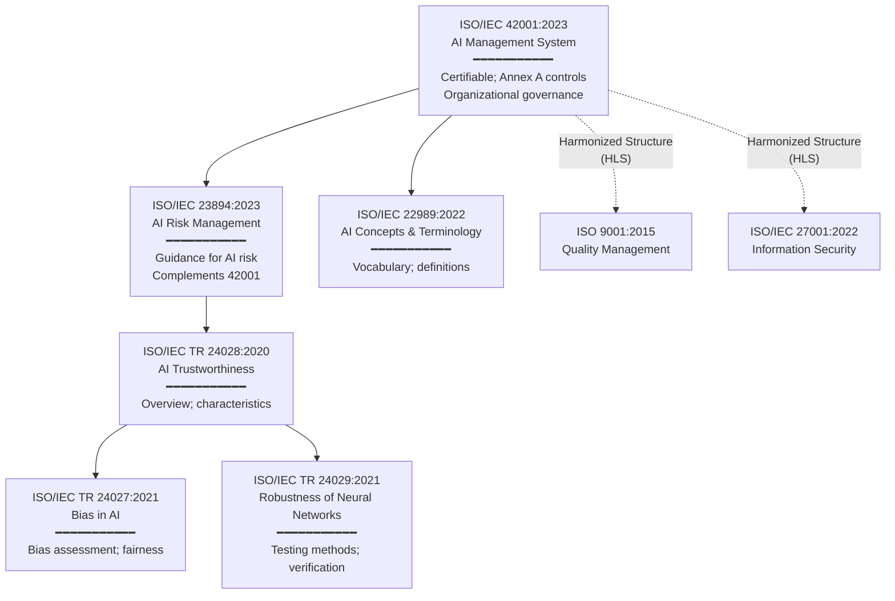
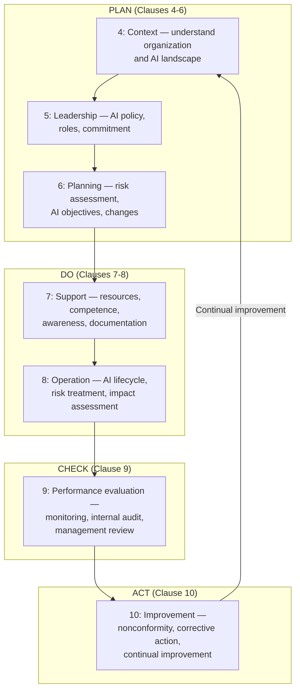

# ISO/IEC 42001:2023 — AI Management System (AIMS)

**Topic:** AI Management System standard; organizational governance for AI; Annex A controls; certification; responsible AI implementation  
**Standard:** ISO/IEC 42001:2023 — Information technology — Artificial intelligence — Management system  
**Published:** December 2023  
**SDO:** ISO/IEC JTC 1/SC 42 (Artificial Intelligence)  
**Audience:** AI governance teams, compliance officers, quality managers, CISOs, CTOs, auditors, certification bodies  
**Prerequisites:** ISO management system concepts (9001, 27001), AI/ML lifecycle understanding, organizational governance

---

## Chapter 1 — Historical Context & Origin Story

### 1.1 Timeline

| Year | Event | Significance |
|------|-------|-------------|
| 2017 | ISO/IEC JTC 1/SC 42 established | Dedicated AI standardization subcommittee |
| 2018 | SC 42 working groups formed | WG1: Foundational standards; WG2: Big data; WG3: Trustworthiness; WG4: Use cases |
| 2019 | ISO/IEC TR 24028 (Trustworthiness) | Technical report on AI trustworthiness concepts |
| 2020 | ISO/IEC 23894 work begins | AI Risk Management guidance (complement to 42001) |
| 2021 | ISO/IEC 42001 work item approved | New Work Item Proposal (NWIP) for AI Management System |
| 2022 | Committee Draft (CD) circulated | Industry review; 200+ comments addressed |
| 2023 | DIS (Draft International Standard) | Near-final text; ballot approval |
| **Dec 2023** | **ISO/IEC 42001:2023 published** | First ISO management system standard for AI |
| 2024 | First organizations certified | Early adopters achieve ISO 42001 certification |
| 2024 | ISO/IEC 23894:2023 published | AI Risk Management (guidance companion to 42001) |
| 2024 | Mapped to EU AI Act | Industry mapping documents connect 42001 controls to EU AI Act obligations |

### 1.2 Why ISO 42001 Was Needed

| Gap | What Existed | What ISO 42001 Adds |
|:---:|---|---|
| AI governance | No certifiable standard for AI organizations | Certifiable management system; third-party audit |
| Responsible AI | Ethical principles documents (non-auditable) | Auditable controls with evidence requirements |
| Trust signal | Self-declaration of AI ethics | Third-party certification = independent verification |
| Cross-domain | Domain-specific guidance only (automotive, medical) | Universal framework for ANY organization using/developing AI |
| Integration | AI governance siloed from existing management systems | Aligns with ISO 9001, 27001, 14001 (High Level Structure) |
| Regulatory evidence | EU AI Act demands QMS for high-risk AI (Art. 17) | ISO 42001 provides presumption of compliance for QMS requirement |

### 1.3 ISO 42001 in the Standards Family



---

## Chapter 2 — Standard Architecture & Structure

### 2.1 Document Structure

| Section | ISO HLS Clause | Content |
|:-------:|:--------------:|---------|
| **Clause 4** | Context of the organization | Internal/external issues; interested parties; scope; AIMS |
| **Clause 5** | Leadership | Top management commitment; AI policy; roles/responsibilities |
| **Clause 6** | Planning | Risk/opportunity assessment; AI objectives; change management |
| **Clause 7** | Support | Resources; competence; awareness; communication; documented information |
| **Clause 8** | Operation | AI system lifecycle; risk assessment; AI impact assessment |
| **Clause 9** | Performance evaluation | Monitoring; measurement; internal audit; management review |
| **Clause 10** | Improvement | Nonconformity; corrective action; continual improvement |
| **Annex A** | AI controls | 38 controls in 9 groups (normative; Statement of Applicability required) |
| **Annex B** | Guidance | Implementation guidance for Annex A controls |
| **Annex C** | AI-specific objectives | Organizational AI objectives reference |
| **Annex D** | Use of AIMS across domains | Guidance for different sectors |

### 2.2 Annex A Control Groups

| Group | ID Range | Topic | # Controls |
|:-----:|:--------:|-------|:----------:|
| **A.2** | A.2.x | AI Policies | 2 |
| **A.3** | A.3.x | Internal Organization | 3 |
| **A.4** | A.4.x | Resources for AI Systems | 5 |
| **A.5** | A.5.x | Assessing Impacts of AI Systems | 4 |
| **A.6** | A.6.x | AI System Lifecycle | 8 |
| **A.7** | A.7.x | Data for AI Systems | 5 |
| **A.8** | A.8.x | Information for Interested Parties | 4 |
| **A.9** | A.9.x | Use of AI Systems | 4 |
| **A.10** | A.10.x | Third-Party and Customer Relationships | 3 |

### 2.3 Harmonized Level Structure (HLS) Integration

| ISO Standard | Clause 4 | Clause 5 | Clause 6 | Clause 7 | Clause 8 | Clause 9 | Clause 10 |
|:---:|:---:|:---:|:---:|:---:|:---:|:---:|:---:|
| **ISO 42001 (AI)** | Context | Leadership | Planning | Support | Operation | Performance | Improvement |
| **ISO 27001 (Security)** | Context | Leadership | Planning | Support | Operation | Performance | Improvement |
| **ISO 9001 (Quality)** | Context | Leadership | Planning | Support | Operation | Performance | Improvement |
| **ISO 14001 (Environment)** | Context | Leadership | Planning | Support | Operation | Performance | Improvement |

**Benefit**: Integrated Management System (IMS) — organizations already certified to ISO 27001 or 9001 can extend to 42001 with minimal structural changes. The HLS clauses are IDENTICAL in structure; only domain-specific content differs.

---

## Chapter 3 — Annex A Controls Deep Dive

### 3.1 A.2 — AI Policies

| Control | Requirement | Implementation |
|:-------:|---|---|
| **A.2.2** | AI policy | Establish, communicate, maintain AI policy reflecting organizational objectives; approved by top management |
| **A.2.3** | Internal use | Define principles and constraints for internal AI use |

### 3.2 A.4 — Resources for AI Systems

| Control | Requirement |
|:-------:|---|
| **A.4.2** | AI system resources allocation and planning |
| **A.4.3** | AI knowledge (ensure competence for AI development/deployment) |
| **A.4.4** | Data resources (availability, quality, governance for AI) |
| **A.4.5** | AI tools and frameworks (selection, maintenance, security) |
| **A.4.6** | Computing resources (infrastructure for AI workloads) |

### 3.3 A.5 — Assessing Impacts

| Control | Requirement |
|:-------:|---|
| **A.5.2** | AI risk assessment (systematic identification and treatment of AI-specific risks) |
| **A.5.3** | Responsible AI (ethical considerations; societal impact; bias; fairness) |
| **A.5.4** | AI impact assessment (assess impact on individuals, groups, society) |
| **A.5.5** | AI system value and utility (demonstrate value proposition of AI; justify AI use vs. alternatives) |

### 3.4 A.6 — AI System Lifecycle

| Control | Requirement |
|:-------:|---|
| **A.6.2** | AI system lifecycle management (define stages; governance at each stage) |
| **A.6.3** | Requirements and design (specify intended behavior; performance criteria) |
| **A.6.4** | Data acquisition and preparation (quality, provenance, labeling, bias testing) |
| **A.6.5** | AI model development (training, tuning, validation methodology) |
| **A.6.6** | AI system verification and validation (testing; performance evaluation) |
| **A.6.7** | AI system deployment (production deployment governance; change management) |
| **A.6.8** | AI system operation and monitoring (continuous monitoring; drift detection) |
| **A.6.9** | AI system retirement (decommissioning; data handling; documentation archival) |

### 3.5 A.7 — Data for AI Systems

| Control | Requirement |
|:-------:|---|
| **A.7.2** | Data management (data lifecycle governance) |
| **A.7.3** | Data quality for AI (completeness, accuracy, consistency, timeliness) |
| **A.7.4** | Data provenance (origin tracking; lineage; consent) |
| **A.7.5** | Data preparation (preprocessing; feature engineering; documentation) |
| **A.7.6** | Data for responsible AI (bias assessment; representativeness; protected attributes handling) |

---

## Chapter 4 — Implementation Guide

### 4.1 Implementation Roadmap

```mermaid
flowchart TD
    START[Decision to pursue ISO 42001]
    
    START --> GAP[Phase 1: Gap Analysis<br/>━━━━━━━━━━━<br/>• Current AI governance maturity<br/>• Existing ISO certifications (9001/27001)<br/>• AI system inventory<br/>• Gap against Annex A controls<br/>Duration: 2-4 weeks]
    
    GAP --> SCOPE[Phase 2: Scope & Policy<br/>━━━━━━━━━━━<br/>• Define AIMS scope (which AI systems)<br/>• Draft AI policy (top management)<br/>• Assign roles (AI governance officer)<br/>• Establish objectives<br/>Duration: 2-4 weeks]
    
    SCOPE --> RISK[Phase 3: Risk & Impact Assessment<br/>━━━━━━━━━━━<br/>• AI risk assessment methodology<br/>• AI impact assessment per system<br/>• Statement of Applicability (SoA)<br/>• Risk treatment plan<br/>Duration: 4-8 weeks]
    
    RISK --> CONTROLS[Phase 4: Implement Controls<br/>━━━━━━━━━━━<br/>• Data governance (A.7)<br/>• Lifecycle management (A.6)<br/>• Third-party management (A.10)<br/>• Responsible AI processes (A.5.3)<br/>Duration: 8-16 weeks]
    
    CONTROLS --> OPERATE[Phase 5: Operate & Monitor<br/>━━━━━━━━━━━<br/>• Run AIMS for 3+ months<br/>• Collect evidence (records, logs)<br/>• Monitoring dashboards<br/>• Incident management<br/>Duration: 3-6 months]
    
    OPERATE --> AUDIT_INT[Phase 6: Internal Audit<br/>━━━━━━━━━━━<br/>• Full internal audit against all clauses<br/>• Annex A controls audit<br/>• Nonconformities identified + corrected<br/>Duration: 2-4 weeks]
    
    AUDIT_INT --> MR[Phase 7: Management Review<br/>━━━━━━━━━━━<br/>• Top management reviews AIMS<br/>• Performance data presented<br/>• Decisions on improvement<br/>Duration: 1 day]
    
    MR --> CERT[Phase 8: Certification Audit<br/>━━━━━━━━━━━<br/>• Stage 1: documentation review<br/>• Stage 2: on-site/remote audit<br/>• Finding resolution<br/>• Certificate issued<br/>Duration: 2-6 weeks]
```

### 4.2 Statement of Applicability (SoA)

| Annex A Control | Applicable? | Justification | Implementation Status |
|:---:|:---:|---|:---:|
| A.2.2 AI Policy | Yes | Required for all | Implemented |
| A.4.4 Data resources | Yes | Organization develops ML models | Implemented |
| A.5.4 AI impact assessment | Yes | High-risk AI deployed | In progress |
| A.6.5 Model development | Yes | Internal model training | Implemented |
| A.6.9 System retirement | No | No AI systems retired yet | N/A — will apply when needed |
| A.7.6 Data for responsible AI | Yes | Fairness requirements | Implemented |
| A.10.2 Third-party AI | Yes | Using third-party AI APIs | Implemented |

### 4.3 Integration with Existing Certifications

| Existing Certification | Integration Strategy |
|:---:|---|
| **ISO 9001** (Quality) | Extend existing QMS scope to include AI-specific processes; reuse document control, management review, internal audit infrastructure |
| **ISO 27001** (Information Security) | AI data handling covered by ISMS; extend risk assessment to AI-specific threats; AI model security = information asset |
| **ISO 14001** (Environment) | AI energy consumption (training compute) → environmental impact; extend environmental objectives |
| **None** | Implement ISO 42001 standalone; consider gap to other standards for future integration |

---

## Chapter 5 — Certification & Audit

### 5.1 Certification Process

| Stage | Activity | Duration |
|:-----:|----------|:--------:|
| **Pre-audit** (optional) | Informal assessment; readiness check; identify major gaps | 1-2 days |
| **Stage 1** | Documentation review; scope verification; readiness for Stage 2 | 1-2 days |
| **Stage 2** | On-site/remote audit; evidence review; interviews; process verification | 2-5 days (depends on scope) |
| **Finding resolution** | Address any nonconformities; provide evidence of correction | 30-90 days |
| **Certification decision** | Certification body reviews audit report; issues certificate | 2-4 weeks |
| **Surveillance** | Annual surveillance audit (subset of controls) | Years 1, 2 |
| **Recertification** | Full audit every 3 years | Year 3 |

### 5.2 Audit Evidence Examples

| Control | Evidence Expected by Auditor |
|:-------:|---|
| A.2.2 (AI Policy) | Documented policy; board/exec approval record; communication evidence; version control |
| A.5.2 (Risk assessment) | Risk register; methodology document; risk assessment records per AI system; treatment plans |
| A.5.4 (Impact assessment) | Impact assessment reports for each in-scope AI system; stakeholder consultation records |
| A.6.4 (Data acquisition) | Data provenance records; quality metrics; bias assessment reports; consent records (where applicable) |
| A.6.6 (Verification/Validation) | Test plans; test results; performance metrics; validation reports |
| A.6.8 (Monitoring) | Monitoring dashboards/screenshots; drift detection alerts; model performance logs |
| A.7.3 (Data quality) | Data quality KPIs; measurement methodology; improvement actions |
| A.10.2 (Third-party) | Vendor assessment records; AI-specific due diligence; contract requirements |

### 5.3 Common Nonconformities

| Finding | Type | Root Cause |
|:-------:|:----:|---|
| AI policy not communicated to all staff | Minor | Communication gap; awareness training not completed |
| No AI impact assessment for deployed system | Major | Process defined but not applied to all in-scope systems |
| Data provenance incomplete for training data | Major | Legacy ML models lacked documentation; not retrospectively documented |
| No evidence of management review of AI risks | Major | Management review agenda didn't include AI-specific items |
| Third-party AI model used without due diligence | Major | Procurement process didn't include AI-specific assessment |
| Monitoring not established for production model | Major | Model deployed before monitoring infrastructure ready |

---

## Chapter 6 — Mapping ISO 42001 to EU AI Act

### 6.1 Control-to-Article Mapping

| ISO 42001 Control | EU AI Act Requirement | Coverage |
|:---:|:---:|:---:|
| A.2.2 (AI Policy) | Art. 17 (Quality Management System) | Partial — QMS requires governance; policy is foundation |
| A.5.2 (AI Risk Assessment) | Art. 9 (Risk Management System) | Strong — risk methodology + treatment covers Art. 9 |
| A.5.4 (AI Impact Assessment) | Art. 27 (FRIA for deployers) | Partial — impact assessment aligns; FRIA has specific requirements |
| A.6.2 (Lifecycle management) | Art. 17(1)(h) (Development lifecycle) | Strong — lifecycle governance matches |
| A.6.4 (Data acquisition) | Art. 10 (Data Governance) | Strong — data quality, bias, provenance align |
| A.6.6 (Verification/Validation) | Art. 9(7) (Testing) + Art. 15 (Accuracy) | Partial — need specific accuracy metrics per Art. 15 |
| A.6.8 (Monitoring) | Art. 72 (Post-market monitoring) | Strong — continuous monitoring matches |
| A.7.3 (Data quality) | Art. 10(2-3) (Data quality) | Strong — quality criteria align |
| A.7.6 (Data for responsible AI) | Art. 10(2)(f) (Bias examination) | Strong — bias assessment aligns |
| A.8.2 (Information to users) | Art. 13 (Transparency) | Partial — Art. 13 has specific format/content requirements |
| A.10.2 (Third-party) | Art. 25 (Supply chain) | Partial — AI Act has specific supply chain obligations |

### 6.2 Gap Analysis: ISO 42001 vs. EU AI Act

| EU AI Act Requirement | ISO 42001 Coverage | Gap |
|:---:|:---:|---|
| Art. 11 (Technical documentation, Annex IV) | No specific equivalent | **GAP**: Must create Annex IV documentation separately |
| Art. 12 (Automatic logging) | A.6.8 (Monitoring) — partial | **GAP**: Specific logging format/retention not prescribed |
| Art. 14 (Human oversight) | Not explicitly covered | **GAP**: Must design human oversight mechanisms per Art. 14 |
| Art. 43 (Conformity assessment) | Clause 9 (Performance evaluation) — different scope | **GAP**: Conformity assessment ≠ ISO audit; need separate CE process |
| Art. 49 (EU database registration) | Not applicable | **GAP**: Registration is regulatory; not an organizational process |

**Conclusion**: ISO 42001 provides ~60-70% of the foundation for EU AI Act high-risk compliance. Specific technical requirements (logging format, human oversight design, conformity assessment, EU registration) require additional work beyond ISO 42001.

---

## Chapter 7 — Comparison with Related Standards

| Dimension | ISO 42001 (AI) | ISO 27001 (Security) | ISO 9001 (Quality) | NIST AI RMF |
|:---------:|:-:|:-:|:-:|:-:|
| **Focus** | AI governance | Information security | Product/service quality | AI risk management |
| **Type** | Management system (certifiable) | Management system (certifiable) | Management system (certifiable) | Framework (not certifiable) |
| **Annex** | Annex A: 38 AI controls | Annex A: 93 security controls | None (process-based) | Subcategories in 4 functions |
| **SoA required** | Yes | Yes | No | No (voluntary profiles) |
| **Certification** | Third-party audit (ISO 17021) | Third-party audit | Third-party audit | Self-assessment only |
| **AI-specific** | YES (purpose-built for AI) | No (but AI data = information asset) | No (but AI quality = product quality) | YES (AI risk focus) |
| **Risk method** | AI risk assessment (A.5.2) | Information security risk | Process approach; risk-based thinking | GOVERN-MAP-MEASURE-MANAGE |
| **Data governance** | Explicit (A.7 group) | Data classification + protection | N/A (product requirements) | MAP function (data context) |

---

## Chapter 8 — Mermaid Architecture Diagrams

### 8.1 ISO 42001 PDCA Cycle



### 8.2 Annex A Control Architecture

```mermaid
graph TB
    AIMS[ISO 42001 AIMS<br/>Management System]
    
    AIMS --> GOV[A.2-3: Governance<br/>━━━━━━━━━━━<br/>AI Policy (A.2.2)<br/>Internal use (A.2.3)<br/>Roles (A.3.2)<br/>Accountability (A.3.3)<br/>Reporting (A.3.4)]
    
    AIMS --> RES[A.4: Resources<br/>━━━━━━━━━━━<br/>Planning (A.4.2)<br/>Knowledge (A.4.3)<br/>Data (A.4.4)<br/>Tools (A.4.5)<br/>Compute (A.4.6)]
    
    AIMS --> IMPACT[A.5: Impact Assessment<br/>━━━━━━━━━━━<br/>Risk assessment (A.5.2)<br/>Responsible AI (A.5.3)<br/>Impact assessment (A.5.4)<br/>Value/utility (A.5.5)]
    
    AIMS --> LIFECYCLE[A.6: Lifecycle<br/>━━━━━━━━━━━<br/>Lifecycle mgmt (A.6.2)<br/>Requirements (A.6.3)<br/>Data acquisition (A.6.4)<br/>Model development (A.6.5)<br/>V&V (A.6.6)<br/>Deployment (A.6.7)<br/>Monitoring (A.6.8)<br/>Retirement (A.6.9)]
    
    AIMS --> DATA[A.7: Data<br/>━━━━━━━━━━━<br/>Management (A.7.2)<br/>Quality (A.7.3)<br/>Provenance (A.7.4)<br/>Preparation (A.7.5)<br/>Responsible AI data (A.7.6)]
    
    AIMS --> INFO[A.8-9: Transparency & Use<br/>━━━━━━━━━━━<br/>User information (A.8.2)<br/>Stakeholder comms (A.8.3)<br/>Documentation (A.8.4-5)<br/>AI use governance (A.9)]
    
    AIMS --> THIRD[A.10: Third Party<br/>━━━━━━━━━━━<br/>Supply chain (A.10.2)<br/>Customer provision (A.10.3)<br/>Third-party monitoring (A.10.4)]
```

---

## Chapter 9 — Case Studies

### 9.1 Technology Company: First ISO 42001 Certification

| Aspect | Detail |
|--------|--------|
| **Organization** | Mid-size AI platform company (~500 employees); provides ML-as-a-Service to enterprises; multiple AI products (NLP, computer vision, predictive analytics) |
| **Motivation** | (1) EU AI Act preparedness (customers asking "are you compliant?"). (2) Differentiation from competitors. (3) Internal governance maturity (had ad-hoc AI practices). (4) Enterprise customer requirement (RFP asking for responsible AI evidence). |
| **Starting point** | ISO 27001 already certified (3 years); no formal AI governance framework; ethical AI principles documented but not auditable; no data provenance tracking; model monitoring partial. |
| **Scope** | All AI products and services developed and operated by the organization (broad scope). |
| **Timeline** | Month 1-2: Gap analysis (leveraged 27001 infrastructure). Month 2-3: AI policy + objectives + roles. Month 3-5: Risk + impact assessment for all 8 AI products. Month 5-9: Implement Annex A controls (heaviest: A.6 lifecycle + A.7 data governance). Month 9-12: Operate; collect evidence; internal audit. Month 12: Stage 1 audit. Month 13: Stage 2 audit. Month 14: Certificate issued. |
| **Key challenges** | (1) Data provenance: legacy models trained on scraped data with no documentation → retrospective documentation expensive. Solution: documented what was known; flagged gaps in SoA; created process for all new models. (2) Impact assessment: no template existed → developed internal template based on Annex B guidance + EU AI Act FRIA format. (3) Auditor competence: early ISO 42001 audits had limited auditor AI expertise → requested auditor with ML background. |
| **Investment** | ~6 person-months dedicated effort (1 governance lead + fractional contributions from 10 teams). Certification body fees: €25K (Stage 1 + Stage 2). Ongoing: 0.5 FTE for AIMS maintenance + annual surveillance. |
| **Business impact** | Won 5 enterprise contracts in first year post-certification (ISO 42001 was selection criterion). Reduced customer security questionnaire burden by 40% (certificate serves as evidence). Internal: improved model documentation; 3 AI risks identified and mitigated that were previously unknown. |

### 9.2 Healthcare Organization: ISO 42001 + MDR Integration

| Aspect | Detail |
|--------|--------|
| **Organization** | Medical AI company; develops AI-powered diagnostic imaging (radiology); SaMD (Software as Medical Device); EU market |
| **Regulatory stack** | EU MDR (Class IIb SaMD) + EU AI Act (high-risk) + ISO 13485 (medical device QMS) + ISO 42001 (AI governance) |
| **Integration challenge** | How to maintain ISO 13485 (medical QMS) + ISO 42001 (AI QMS) without duplication? |
| **Solution** | Integrated Management System (IMS): Single QMS with two scopes. ISO 13485 covers medical device lifecycle. ISO 42001 covers AI-specific governance. Shared: document control, management review, internal audit, corrective action, training. Distinct: ISO 13485 → clinical evaluation, post-market surveillance. ISO 42001 → AI risk assessment, data governance, model lifecycle, bias testing. |
| **Audit approach** | Combined audit: Stage 2 covers both standards simultaneously (saves cost; reduces disruption). Auditor team: 1 medical device auditor + 1 AI auditor. |
| **Benefit** | Single management system meeting MDR + EU AI Act + ISO certifications. Evidence generated once; used for multiple regulatory submissions. Cost saving: ~30% compared to separate implementations. |

---

## Chapter 10 — Future Evolution

| Trend | Timeline | Impact |
|-------|----------|--------|
| **Mass certification wave** | 2024-2026 | Thousands of organizations seeking ISO 42001 as EU AI Act deadline (Aug 2026) approaches |
| **Harmonized standard under EU AI Act** | 2025-2027 | ISO 42001 may become harmonized standard → gives presumption of conformity for QMS requirement |
| **ISO 42001 Amendment/Revision** | 2026-2028 | Lessons learned from early implementations; alignment updates for EU AI Act final text |
| **Sector-specific extensions** | 2025-2027 | ISO 42001 profiles for healthcare, automotive, financial services (similar to ISO 27001 sector standards) |
| **Integration with AI safety** | 2025-2028 | ISO/IEC CD 5469 (AI functional safety) will reference 42001 for management system component |
| **Automated compliance evidence** | 2025-2027 | Tools generating ISO 42001 audit evidence from ML pipelines (model cards → A.6.5; data lineage → A.7.4) |

---

## Chapter 11 — Interview Questions & Career Guide

### Tier 1: Entry-Level

**Q1:** What is ISO/IEC 42001 and why does it matter for AI organizations?

**A:** ISO/IEC 42001:2023 is the first international management system standard for artificial intelligence. It provides a certifiable framework for organizations to govern their AI activities responsibly.

Key points: (1) It's a management system standard (like ISO 27001 for security or ISO 9001 for quality) — meaning it defines PROCESSES and CONTROLS an organization must implement, maintain, and continuously improve. (2) It's certifiable — a third-party auditor can verify compliance and issue a certificate, providing independent assurance. (3) It covers the full AI lifecycle: policy, risk assessment, impact assessment, data governance, model development, deployment, monitoring, and retirement. (4) It uses Annex A controls (38 controls in 9 groups) — organizations must produce a Statement of Applicability explaining which controls apply and how they're implemented.

Why it matters: The EU AI Act (Art. 17) requires a quality management system for high-risk AI. ISO 42001 is the most natural fit for this requirement and may become a "harmonized standard" — meaning certification gives presumption of EU AI Act QMS compliance. Additionally, enterprise customers increasingly require responsible AI evidence; ISO 42001 certification is becoming a procurement criterion.

### Tier 2: Mid-Level

**Q2:** How does ISO 42001's Annex A compare to ISO 27001's Annex A? What are the AI-specific controls that have no equivalent in 27001?

**A:** Both standards use Annex A controls with a Statement of Applicability, but the control domains are fundamentally different:

**ISO 27001 Annex A**: 93 controls focused on INFORMATION SECURITY — access control, cryptography, network security, physical security, incident management, business continuity. These protect CONFIDENTIALITY, INTEGRITY, AVAILABILITY of information.

**ISO 42001 Annex A**: 38 controls focused on AI GOVERNANCE — AI policy, impact assessment, data quality, model development, responsible AI, system monitoring. These address TRUSTWORTHINESS, FAIRNESS, TRANSPARENCY, SAFETY of AI systems.

**AI-specific controls with NO 27001 equivalent**:
- A.5.3 (Responsible AI): Ethical considerations, societal impact, fairness — security has no equivalent concept.
- A.5.4 (AI impact assessment): Assessing impact on individuals/groups — different from security risk assessment.
- A.6.5 (Model development): Training methodology, hyperparameter selection, validation — pure AI.
- A.7.3 (Data quality): Training data completeness, accuracy, representativeness — security doesn't address data QUALITY (only protection).
- A.7.6 (Data for responsible AI): Bias assessment in training data — entirely AI-specific.
- A.6.9 (System retirement): AI decommissioning considerations (model disposal, data deletion, dependency management).

**Overlap areas**: Documentation control (both); risk assessment (both, but different risks); third-party management (both); monitoring (both, but different metrics).

**Integration**: Organizations with ISO 27001 can leverage ~40% of existing infrastructure for 42001 (management review, internal audit, document control, corrective action processes).

### Tier 3: Senior

**Q3:** Design an integrated implementation approach for an organization needing ISO 42001, ISO 27001, and EU AI Act high-risk compliance simultaneously. How do you avoid duplicating effort while ensuring all requirements are met?

**A:**

**Architecture: Single Integrated Management System (IMS)**

*Core principle*: One system; multiple scopes; shared processes where possible; dedicated processes where required.

**Shared layer (applicable to ALL three)**:
- Document control and records management (single system)
- Internal audit program (combined audits; auditors qualified for both domains)
- Management review (single review covering all scopes; AI+security+EU AI Act items on agenda)
- Corrective action process (one procedure; classify by domain)
- Competence management (training records; awareness programs cover AI governance + security)
- Risk assessment methodology (shared framework; different risk catalogs per domain)

**ISO 27001-specific layer**:
- Information security risk assessment (Annex A: 93 controls; SoA)
- Security controls implementation (access, crypto, network, physical)
- Security incident management + reporting
- Business continuity planning

**ISO 42001-specific layer**:
- AI risk assessment (Annex A: 38 controls; separate SoA)
- AI impact assessment per system
- Data governance (quality, provenance, bias) — extends 27001 data classification
- AI lifecycle management (development, V&V, deployment, monitoring, retirement)
- Responsible AI processes (fairness testing, transparency documentation)

**EU AI Act-specific layer** (BEYOND what ISO standards provide):
- Risk classification per AI system (Art. 6; Annex III mapping)
- Technical documentation per Annex IV format (structured document; goes beyond general documentation)
- Automatic logging implementation (Art. 12; technical requirement)
- Human oversight design (Art. 14; UI/UX + operational procedures)
- Conformity assessment execution (self-assessment or Notified Body; CE marking)
- EU database registration (Art. 49)
- Post-market monitoring system (Art. 72; feeds back into ISO 42001 A.6.8)

**Efficiency gains**:
- Data governance: implement ONCE (covers ISO 42001 A.7 + EU AI Act Art. 10 + ISO 27001 data classification)
- Risk assessment: one methodology, three risk catalogs (AI risks, security risks, EU AI Act risks)
- Monitoring: one platform tracking model performance (42001), security events (27001), and incident reporting (EU AI Act)
- Audit: combined audits possible (reduces organizational disruption; some certification bodies offer combined certificates)

**Implementation sequence**: (1) ISO 27001 first (if not already certified) — provides infrastructure. (2) ISO 42001 scope extension (leverages existing IMS). (3) EU AI Act gap analysis against combined ISO certifications. (4) Fill EU AI Act gaps (technical documentation, logging, human oversight, conformity assessment). (5) Combined surveillance covering all three.

---

## Chapter 12 — Cheat Sheet & Quick Reference

```
═══════════════════════════════════════════
ISO/IEC 42001:2023 — QUICK REFERENCE
═══════════════════════════════════════════

WHAT: First certifiable AI Management System standard
WHO:  Any organization developing, providing, or using AI
WHY:  Demonstrate responsible AI; EU AI Act QMS; trust signal

═══════════════════════════════════════════
STRUCTURE (ISO High Level Structure):
  Clause 4:  Context of the organization
  Clause 5:  Leadership (AI policy, commitment)
  Clause 6:  Planning (risk, objectives)
  Clause 7:  Support (resources, competence)
  Clause 8:  Operation (AI lifecycle, risk treatment)
  Clause 9:  Performance evaluation (audit, review)
  Clause 10: Improvement (corrective action)
  Annex A:   38 AI-specific controls (SoA required)
  Annex B:   Implementation guidance

═══════════════════════════════════════════
ANNEX A CONTROL GROUPS:
  A.2:  AI Policies (policy + internal use)
  A.3:  Internal Organization (roles, accountability)
  A.4:  Resources (knowledge, data, tools, compute)
  A.5:  Impact Assessment (risk, responsible AI, impact)
  A.6:  AI Lifecycle (requirements → retirement)
  A.7:  Data (management, quality, provenance, bias)
  A.8:  Information (transparency, documentation)
  A.9:  Use of AI Systems (governance of use)
  A.10: Third-Party (supply chain, customers)

═══════════════════════════════════════════
CERTIFICATION PATH:
  1. Gap analysis (2-4 weeks)
  2. Scope + policy + roles (2-4 weeks)
  3. Risk + impact assessment (4-8 weeks)
  4. Implement controls (8-16 weeks)
  5. Operate + collect evidence (3-6 months)
  6. Internal audit (2-4 weeks)
  7. Management review (1 day)
  8. Certification audit Stage 1 + 2 (2-6 weeks)
  Total: ~12-18 months (typical)

═══════════════════════════════════════════
KEY DOCUMENTS:
  • AI Policy (A.2.2)
  • Statement of Applicability (SoA)
  • AI Risk Assessment + Treatment Plan
  • AI Impact Assessment (per AI system)
  • Data Governance Procedures (A.7)
  • AI System Lifecycle Procedures (A.6)
  • Internal Audit Reports
  • Management Review Minutes

═══════════════════════════════════════════
EU AI ACT MAPPING:
  42001 A.5.2 → Art. 9 (Risk management)     ✓ Strong
  42001 A.6.4 → Art. 10 (Data governance)     ✓ Strong
  42001 A.7.6 → Art. 10 (Bias examination)    ✓ Strong
  42001 A.6.8 → Art. 72 (Post-market)         ✓ Strong
  GAPS: Art. 11 (Annex IV docs), Art. 12 (logging),
        Art. 14 (human oversight), Art. 43 (conformity)

═══════════════════════════════════════════
INTEGRATION WITH OTHER ISO:
  ISO 27001: Share IMS infrastructure; extend to AI
  ISO 9001:  Quality processes apply to AI quality
  ISO 13485: Medical AI (dual scope: medical + AI)
  Shared: PDCA, document control, audit, management review

═══════════════════════════════════════════
QUICK AUDIT CHECKLIST:
  □ AI policy approved by top management?
  □ AI risk assessment completed for all in-scope systems?
  □ Statement of Applicability documented?
  □ Data provenance tracked for training data?
  □ Bias assessment performed?
  □ Model validation evidence available?
  □ Monitoring active for deployed models?
  □ Third-party AI due diligence completed?
  □ Internal audit conducted?
  □ Management review held?
```

---

*End of Document — 02_ISO_IEC_42001_2023.md*
