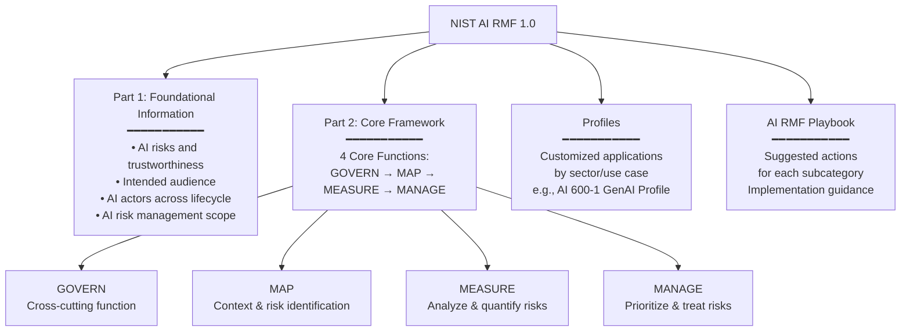
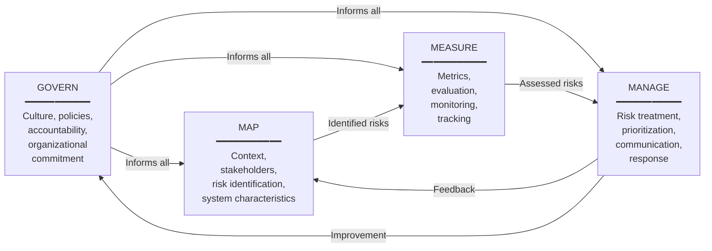
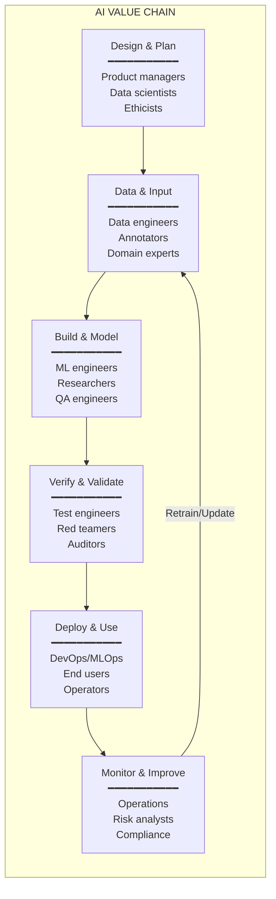

# NIST AI Risk Management Framework (AI RMF 1.0)

**Topic:** NIST AI Risk Management Framework; GOVERN-MAP-MEASURE-MANAGE core functions; AI risk profiles; practical implementation; GenAI profile (AI 600-1)  
**Standard:** NIST AI RMF 1.0 (AI 100-1, January 2023); NIST AI 600-1 (GenAI Profile, July 2024)  
**SDO:** National Institute of Standards and Technology (NIST), U.S. Department of Commerce  
**Audience:** AI developers, risk managers, product managers, CISOs, policy officers, compliance teams  
**Prerequisites:** AI/ML fundamentals, risk management concepts, organizational governance

---

## Chapter 1 — Historical Context & Origin Story

### 1.1 Timeline

| Year | Event | Significance |
|------|-------|-------------|
| 2019 | NIST begins AI standards work | Directed by Congress (National AI Initiative Act discussions) |
| 2019 | NIST Plan for Federal Engagement in AI Standards | Roadmap for US AI standardization strategy |
| 2021 | National AI Initiative Act signed | Directs NIST to develop AI risk management framework |
| Jan 2021 | NIST AI RMF concept paper | Initial framework direction; public comment |
| March 2022 | NIST AI RMF Initial Draft | Public workshop; 150+ organizations commented |
| Aug 2022 | NIST AI RMF Second Draft | Refined based on 400+ comments |
| **Jan 26, 2023** | **NIST AI RMF 1.0 published** (AI 100-1) | Final framework released |
| Jan 2023 | NIST AI RMF Playbook released | Suggested actions for each subcategory |
| 2022 | NIST SP 1270 (Bias in AI) | Companion document on bias identification/management |
| Oct 2023 | Executive Order 14110 (Safe AI) | References NIST AI RMF; directs NIST for additional guidance |
| **July 2024** | **NIST AI 600-1 (GenAI Profile)** | Specific risk profile for generative AI/foundation models |
| 2024 | NIST AI 100-2E (Adversarial ML) | Taxonomy of adversarial ML attacks |

### 1.2 Design Philosophy

| Principle | Description |
|:---------:|-------------|
| **Voluntary** | Not mandatory (unlike EU AI Act); designed to be broadly adoptable |
| **Risk-based** | Proportional to AI system risk; not one-size-fits-all |
| **Outcome-focused** | Describes WHAT to achieve, not HOW (technology-agnostic) |
| **Iterative** | Continuous improvement; not point-in-time compliance |
| **Inclusive** | Multi-stakeholder; considers all affected parties |
| **Flexible** | Adaptable to any organization size, sector, or AI type |
| **Aligned** | Compatible with OECD AI Principles; ISO standards; EU AI Act concepts |

---

## Chapter 2 — Framework Architecture

### 2.1 AI RMF Structure



### 2.2 Four Core Functions

| Function | Purpose | Key Question |
|:--------:|---------|:------------:|
| **GOVERN** | Cultivate organizational culture and governance for AI risk management | "Does our organization have the culture, structures, and policies to manage AI risk?" |
| **MAP** | Identify context, stakeholders, and AI-specific risks | "What are the characteristics of our AI system and who is affected?" |
| **MEASURE** | Employ quantitative and qualitative methods to assess AI risks | "How do we track, evaluate, and monitor AI risks?" |
| **MANAGE** | Allocate resources and prioritize risk response actions | "How do we act on identified risks and communicate decisions?" |

### 2.3 Function Relationship



**GOVERN is cross-cutting**: It applies across all other functions. You cannot MAP, MEASURE, or MANAGE effectively without governance in place.

---

## Chapter 3 — Core Functions Deep Dive

### 3.1 GOVERN Function (6 Categories)

| Category | ID | Focus | Key Activities |
|:---:|:---:|---|---|
| **Policies & governance** | GOVERN 1 | Legal, regulatory, organizational policies for AI risk | Policies defined; compliance mapped; ethical principles established |
| **Accountability** | GOVERN 2 | Roles, responsibilities, accountability structures | AI risk roles assigned; RACI defined; escalation paths |
| **Workforce** | GOVERN 3 | AI workforce diversity, competence, awareness | Training programs; diverse teams; AI literacy |
| **Organizational culture** | GOVERN 4 | Culture of responsible AI risk management | Risk-aware culture; reward structure; psychological safety |
| **Stakeholder engagement** | GOVERN 5 | Engagement with interested parties across AI lifecycle | External stakeholder input; community feedback; impact documentation |
| **Supply chain** | GOVERN 6 | Third-party AI risk management in value chain | Vendor assessment; contractual requirements; monitoring |

### 3.2 MAP Function (5 Categories)

| Category | ID | Focus |
|:---:|:---:|---|
| **Context establishment** | MAP 1 | Intended purpose; context of use; legal/regulatory requirements; deployment context |
| **AI categorization** | MAP 2 | AI system classification; task type; technical characteristics; autonomy level |
| **Benefits and costs** | MAP 3 | Benefits assessment; cost analysis; impact on individuals and communities |
| **Risk identification** | MAP 4 | Risks to individuals, groups, organizations, ecosystems; negative impacts |
| **Impact characterization** | MAP 5 | Likelihood and severity of identified risks; affected populations; vulnerability assessment |

### 3.3 MEASURE Function (4 Categories)

| Category | ID | Focus |
|:---:|:---:|---|
| **Appropriate metrics** | MEASURE 1 | Measurement approaches for identified risks; metric selection; quantitative + qualitative |
| **AI evaluation** | MEASURE 2 | System evaluation: performance, fairness, safety, security, privacy, explainability, robustness |
| **Continuous monitoring** | MEASURE 3 | Tracking risks post-deployment; drift detection; performance degradation; emerging risks |
| **Feedback mechanisms** | MEASURE 4 | Stakeholder feedback integration; user reporting; impact monitoring |

### 3.4 MANAGE Function (4 Categories)

| Category | ID | Focus |
|:---:|:---:|---|
| **Risk prioritization** | MANAGE 1 | Risk ranking; treatment priority based on severity and likelihood |
| **Risk response** | MANAGE 2 | Treatment strategies: mitigate, transfer, avoid, accept; residual risk documentation |
| **Risk communication** | MANAGE 3 | Communication to stakeholders; transparency; incident disclosure |
| **Continuous improvement** | MANAGE 4 | Regular review of risk management effectiveness; lessons learned; process improvement |

---

## Chapter 4 — AI Trustworthiness Characteristics

### 4.1 Seven Characteristics of Trustworthy AI

NIST AI RMF defines seven characteristics that AI systems should exhibit:

| # | Characteristic | Description | Measurement Examples |
|:-:|:---:|---|---|
| 1 | **Valid & Reliable** | AI performs as intended under expected conditions; consistent results | Accuracy metrics; error rates; reproducibility testing |
| 2 | **Safe** | AI does not endanger human life, health, property, or environment | Safety testing; failure mode analysis; worst-case scenarios |
| 3 | **Secure & Resilient** | AI resists attacks and recovers from disruptions | Adversarial testing; penetration testing; recovery procedures |
| 4 | **Accountable & Transparent** | AI decisions can be explained; responsibility is clear | Explainability methods; audit logs; decision records |
| 5 | **Explainable & Interpretable** | AI outputs can be understood by relevant stakeholders | SHAP values; feature importance; model cards |
| 6 | **Privacy-Enhanced** | AI respects privacy; minimizes data exposure | Differential privacy; data minimization; privacy impact assessment |
| 7 | **Fair — with Harmful Bias Managed** | AI does not discriminate unfairly; bias identified and mitigated | Demographic parity; equalized odds; fairness audits |

### 4.2 Tensions Between Characteristics

| Characteristic A | Characteristic B | Tension |
|:---:|:---:|---|
| Explainability | Performance (Accuracy) | Most explainable models (linear) are less accurate than black-box models (DNN) |
| Privacy | Fairness | Protecting demographic data (privacy) makes it harder to measure/mitigate bias (fairness) |
| Security | Transparency | Revealing model details (transparency) may enable attacks (security) |
| Safety | Innovation speed | Thorough safety testing slows deployment |

**Key insight**: Trustworthiness requires BALANCING these characteristics for the specific context. There is no universal optimum — the appropriate balance depends on the use case, risk level, and stakeholders.

---

## Chapter 5 — NIST AI RMF Playbook

### 5.1 Playbook Structure

The Playbook provides **suggested actions** for each subcategory within the four core functions:

| Component | Description |
|:---------:|-------------|
| **Subcategory** | Specific outcome statement (e.g., "GOVERN 1.1: Legal and regulatory requirements involving AI are understood") |
| **Suggested actions** | Concrete activities to achieve the subcategory outcome |
| **Transparency notes** | Communication/documentation requirements |
| **AI actor tasks** | Who in the AI lifecycle is responsible (developer, deployer, operator) |

### 5.2 Example Playbook Entries

**GOVERN 1.1**: Legal and regulatory requirements involving AI are understood, managed, and documented.

| Suggested Action | Detail |
|:---:|---|
| G1.1-001 | Establish a process to identify applicable AI-related laws, regulations, and standards (EU AI Act, sector regulations, GDPR, etc.) |
| G1.1-002 | Map identified requirements to AI systems in portfolio |
| G1.1-003 | Monitor regulatory landscape for changes; assign responsibility for updates |
| G1.1-004 | Document compliance status per AI system per requirement |

**MAP 2.1**: The AI system's intended use, context of use, and capabilities are documented.

| Suggested Action | Detail |
|:---:|---|
| M2.1-001 | Document intended purpose (what the AI system is designed to do) |
| M2.1-002 | Document NOT-intended uses (foreseeable misuse scenarios) |
| M2.1-003 | Characterize operational environment (where deployed; user population) |
| M2.1-004 | Document AI system limitations and known failure modes |

**MEASURE 2.6**: AI system performance or assurance criteria (fairness, bias) are measured and documented.

| Suggested Action | Detail |
|:---:|---|
| ME2.6-001 | Define fairness metrics appropriate to context (demographic parity, equalized odds, individual fairness) |
| ME2.6-002 | Measure model performance disaggregated by demographic group |
| ME2.6-003 | Document acceptable threshold ranges for fairness metrics |
| ME2.6-004 | Implement automated fairness monitoring with alerts for threshold breaches |

---

## Chapter 6 — GenAI Profile (NIST AI 600-1)

### 6.1 Overview

Published July 2024, NIST AI 600-1 extends the AI RMF specifically for **Generative AI** (foundation models, LLMs, image generators):

| Aspect | Detail |
|--------|--------|
| **Title** | Artificial Intelligence Risk Management Framework: Generative Artificial Intelligence Profile |
| **Purpose** | Address unique risks of generative AI not fully covered by base AI RMF |
| **Structure** | Maps GenAI risks to AI RMF functions; provides GenAI-specific suggested actions |
| **Scope** | Foundation models (LLMs, multimodal); generative applications; GAI-enabled systems |

### 6.2 GenAI-Specific Risks

| Risk Category | Description | Examples |
|:---:|---|---|
| **CBRN Information** | AI generates dangerous content (chemical, biological, radiological, nuclear) | Synthesis instructions; weaponization guidance |
| **Confabulation (Hallucination)** | AI generates plausible but false information | False citations; invented facts; fictitious entities |
| **Data Privacy** | Training data memorization; privacy leakage in outputs | PII in responses; training data extraction attacks |
| **Environmental** | Energy consumption of training and inference | Carbon footprint; water usage for cooling |
| **Harmful Bias & Homogenization** | Amplified biases; cultural homogenization | Stereotypical outputs; monoculture of AI-generated content |
| **Human-AI Configuration** | Over-reliance; anthropomorphization; automation bias | Users trust AI over their own judgment; treat AI as sentient |
| **Information Integrity** | Deepfakes; misinformation at scale; erosion of trust | AI-generated fake news; synthetic media for deception |
| **Information Security** | Prompt injection; model extraction; adversarial attacks | Jailbreaking; data poisoning; supply chain attacks |
| **Intellectual Property** | Copyright in training data; IP in outputs | Training on copyrighted material; generating derivative works |
| **Obscene/Degrading Content** | Generation of harmful content (CSAM, hate, violence) | Abusive content generation despite filters |
| **Value Chain** | Third-party dependencies; supply chain risks | Reliance on single foundation model provider; vendor lock-in |

### 6.3 GenAI Profile Mapping to AI RMF

| AI RMF Function | GenAI-Specific Considerations |
|:---:|---|
| **GOVERN** | Policies for GAI use (acceptable use); incident response for GAI failures; board-level GAI risk reporting; GAI-specific workforce training |
| **MAP** | Document GAI model provenance; characterize hallucination rates; identify affected populations for GAI outputs; map dual-use risks |
| **MEASURE** | Hallucination metrics; toxicity measurement; bias testing for generative outputs; copyright detection; red-teaming exercises |
| **MANAGE** | Content filtering; RLHF/safety training; watermarking; human-in-the-loop for high-risk generations; incident response for viral misinformation |

---

## Chapter 7 — Comparison with Other Frameworks

| Dimension | NIST AI RMF | EU AI Act | ISO 42001 | ISO 31000 |
|:---------:|:-:|:-:|:-:|:-:|
| **Type** | Framework (voluntary) | Regulation (mandatory) | Standard (certifiable) | Standard (guidance) |
| **Structure** | 4 functions + categories | Risk tiers + articles | HLS clauses + Annex A | Principles + framework + process |
| **AI-specific** | Yes (purpose-built) | Yes (AI regulation) | Yes (AI management) | No (generic risk management) |
| **Prescriptive** | Low (outcomes; not methods) | Medium (specific requirements) | Medium (controls with flexibility) | Low (principles) |
| **Certification** | No (self-assessment) | Conformity assessment (CE) | Third-party audit (ISO 17021) | No |
| **Geography** | US (global adoption encouraged) | EU (extraterritorial) | International | International |
| **GenAI coverage** | Yes (AI 600-1 profile) | Yes (Chapter V GPAI) | General (not GAI-specific) | N/A |
| **Enforcement** | None (voluntary) | Fines (€35M/7%) | Contractual (B2B/procurement) | None |
| **Playbook** | Yes (detailed actions) | Implementing acts pending | Annex B (guidance) | ISO 31010 (techniques) |

### 7.1 NIST AI RMF vs. NIST Cybersecurity Framework (CSF)

| Aspect | NIST AI RMF | NIST CSF |
|:------:|:-:|:-:|
| **Domain** | AI risk management | Cybersecurity risk management |
| **Functions** | GOVERN, MAP, MEASURE, MANAGE | IDENTIFY, PROTECT, DETECT, RESPOND, RECOVER, GOVERN |
| **Relationship** | AI RMF GOVERN inspired by CSF GOVERN; complementary frameworks | CSF for security; AI RMF for AI-specific trustworthiness risks |
| **Integration** | AI system security → use CSF; AI-specific risks (bias, hallucination) → use AI RMF | May reference AI RMF for AI asset protection |

---

## Chapter 8 — Mermaid Architecture Diagrams

### 8.1 NIST AI RMF Implementation Flow

```mermaid
flowchart TD
    START[Organization decides to adopt<br/>NIST AI RMF]
    
    START --> G[GOVERN: Establish Foundation<br/>━━━━━━━━━━━━━━━━<br/>• Define AI governance policies<br/>• Assign AI risk roles (RACI)<br/>• Establish risk tolerance levels<br/>• Align with legal requirements<br/>• Create AI ethics principles<br/>• Build risk-aware culture]
    
    G --> M[MAP: Identify & Contextualize<br/>━━━━━━━━━━━━━━━━<br/>• Inventory all AI systems<br/>• Document intended purpose/limitations<br/>• Identify stakeholders affected<br/>• Characterize system (model type, data)<br/>• Identify risks per system<br/>• Assess impact on individuals/groups]
    
    M --> ME[MEASURE: Quantify & Track<br/>━━━━━━━━━━━━━━━━<br/>• Select appropriate metrics<br/>• Measure performance (accuracy, fairness)<br/>• Evaluate trustworthiness characteristics<br/>• Establish baselines & thresholds<br/>• Implement continuous monitoring<br/>• Collect stakeholder feedback]
    
    ME --> MA[MANAGE: Act & Respond<br/>━━━━━━━━━━━━━━━━<br/>• Prioritize risks (severity × likelihood)<br/>• Select treatment (mitigate/transfer/accept/avoid)<br/>• Implement controls & safeguards<br/>• Communicate risks to stakeholders<br/>• Document residual risks<br/>• Establish incident response]
    
    MA --> IMPROVE[Continuous Improvement<br/>━━━━━━━━━━━━━━━━<br/>• Review effectiveness of controls<br/>• Update risk assessments<br/>• Incorporate lessons learned<br/>• Adapt to new risks/regulations<br/>• Report to governance body]
    
    IMPROVE -->|"Feedback loop"| G
```

### 8.2 AI Actors Across the Lifecycle



---

## Chapter 9 — Case Studies

### 9.1 Financial Services: AI RMF Implementation for Credit Scoring

| Aspect | Detail |
|--------|--------|
| **Organization** | US national bank; AI-powered credit scoring model; 10M+ decisions annually |
| **Regulation** | ECOA (Equal Credit Opportunity Act); FCRA (Fair Credit Reporting Act); OCC guidance on model risk management (SR 11-7); NIST AI RMF (voluntary adoption) |
| **GOVERN implementation** | (1) AI Risk Committee (board-level; quarterly review). (2) Model Risk Management Policy updated for AI-specific risks. (3) Fair lending officer integrated into AI governance. (4) Risk appetite defined: "No more than 5% disparate impact ratio deviation from benchmark." |
| **MAP implementation** | (1) AI system inventory: 14 AI models in production (credit scoring, fraud detection, marketing). (2) Credit scoring model: gradient boosted trees; 2.5M training samples; 50 features; serves applicants across demographics. (3) Risks identified: disparate impact (race, age, gender); over-reliance on proxy variables; data quality drift. (4) Affected populations: credit applicants (disproportionate impact on minority communities in training data underrepresentation). |
| **MEASURE implementation** | (1) Performance: AUC 0.82 overall. (2) Fairness: Equalized odds measured across race, gender, age. (3) Finding: 8% higher false-positive rate for minority applicants (unfair denial). (4) Monitoring: monthly fairness dashboard; automated alerts when disparity >5%. (5) Explainability: SHAP values for individual decisions (adverse action notices). |
| **MANAGE implementation** | (1) Risk treatment: retrained model with debiased features; removed proxy variables (zip code encoding modified). (2) After retrain: disparate impact reduced to 2.3% (within tolerance). (3) Human oversight: all applications denied AND within top 10% of model uncertainty reviewed by human underwriter. (4) Communication: model card published internally; adverse action notices include feature explanations. (5) Incident response: if disparate impact exceeds 5% in monthly check → model flagged for review within 48 hours. |
| **Outcome** | AI RMF adoption improved: (1) regulatory examination readiness (OCC examiners noted structured approach). (2) Fair lending compliance (ECOA/FCRA). (3) Model documentation maturity (model cards for all 14 AI systems). (4) Stakeholder trust (consumer complaints about credit decisions reduced 15%). |

### 9.2 Healthcare: NIST AI RMF for Clinical Decision Support

| Aspect | Detail |
|--------|--------|
| **System** | AI-powered sepsis prediction model; hospital EHR-integrated; alerts clinicians 6 hours before onset |
| **GOVERN** | (1) Clinical AI Committee established (CMO, CMIO, data science lead, nursing informatics, patient advocate). (2) Policy: "AI tools provide decision SUPPORT only; all clinical decisions made by licensed clinicians." (3) Risk tolerance: "Model must maintain >85% sensitivity with <20% false positive rate to remain in production." |
| **MAP** | (1) Intended use: alert nurses/physicians to sepsis risk; NOT autonomous treatment. (2) Limitations: model trained on adult ICU patients; NOT validated for pediatric, obstetric, or ED patients. (3) Risks: alert fatigue (too many false positives → ignored alerts → missed real sepsis); bias (model may perform differently across racial groups due to training data demographics); automation bias (clinicians over-relying on AI). (4) Affected: ICU patients; clinical staff. |
| **MEASURE** | (1) Performance tracked: sensitivity 88%, specificity 82% overall. (2) Disaggregated: sensitivity for Black patients 82% vs. White patients 90% (8% gap — concerning). (3) Alert fatigue: 1.2 alerts/nurse/hour baseline; target <2/hour. (4) Clinician override rate: 35% (healthy — clinicians use judgment). (5) Monthly: receive feedback from nursing on alert quality. |
| **MANAGE** | (1) Disparate performance: added race-stratified monitoring; investigating training data gaps for minority patients; plan: collect additional minority patient data + retrain. (2) Alert fatigue: threshold tuned from 60% → 70% probability (reduced alerts 30% while maintaining sensitivity >85%). (3) Communication: monthly clinical AI report to department; patient-facing FAQ about AI tools. (4) Incident protocol: if sepsis missed after model alert suppressed → root cause analysis within 72 hours. |

---

## Chapter 10 — Future Evolution

| Trend | Timeline | Impact |
|-------|----------|--------|
| **NIST AI RMF 2.0** | 2025-2026 | Incorporates lessons from EO 14110 implementation; aligns closer to EU AI Act concepts; expanded GenAI coverage |
| **Sector-specific profiles** | 2024-2026 | Healthcare AI profile; financial services AI profile; critical infrastructure AI profile |
| **Alignment with EU AI Act** | 2025-2027 | Crosswalk document: NIST AI RMF → EU AI Act mapping (facilitate dual compliance) |
| **Automated assessment tools** | 2024-2026 | Tools that evaluate AI systems against AI RMF categories automatically; continuous compliance |
| **AI RMF certification/conformity** | 2026+ | Potential for NIST to define conformity assessment program (like NIST CSF has CMMC for DoD) |
| **International harmonization** | 2025-2030 | NIST AI RMF ↔ ISO 42001 ↔ EU AI Act alignment; mutual recognition discussions |

---

## Chapter 11 — Interview Questions & Career Guide

### Tier 1: Entry-Level

**Q1:** What are the four core functions of the NIST AI RMF? Briefly describe each.

**A:** The NIST AI Risk Management Framework has four core functions: GOVERN, MAP, MEASURE, and MANAGE.

**GOVERN** is the cross-cutting function that establishes organizational governance for AI risk. It covers: policies, roles and accountability, workforce competence, organizational culture, stakeholder engagement, and supply chain risk. GOVERN enables and informs all other functions.

**MAP** identifies and contextualizes AI risks. It answers: "What is our AI system? Who does it affect? What could go wrong?" Activities include: documenting intended purpose, identifying stakeholders, characterizing the AI system technically, and listing potential risks to individuals and groups.

**MEASURE** quantifies and tracks identified risks. It answers: "How bad are the risks? Are they getting better or worse?" Activities include: selecting appropriate metrics (accuracy, fairness, robustness), evaluating AI systems against those metrics, continuous monitoring post-deployment, and collecting stakeholder feedback.

**MANAGE** prioritizes risks and takes action. It answers: "What do we do about these risks?" Activities include: ranking risks by severity, selecting treatment strategies (mitigate, avoid, transfer, accept), implementing controls, communicating residual risks, and establishing incident response.

The functions are not sequential — they interact continuously. GOVERN underpins everything; MAP feeds MEASURE; MEASURE informs MANAGE; MANAGE feedback improves MAP and GOVERN.

### Tier 2: Mid-Level

**Q2:** How does the NIST AI RMF Playbook work? Give an example of how you'd use it to implement fairness monitoring for a production AI system.

**A:** The AI RMF Playbook provides **suggested actions** (concrete activities) for each subcategory within the four functions. It translates abstract outcomes into practical steps.

**Example: Implementing fairness monitoring** using MEASURE 2.6 ("AI system performance or assurance criteria — fairness — are measured and documented"):

Step 1 — **Select fairness metrics** (Playbook action ME2.6-001): Choose metrics appropriate to context. For a hiring AI: demographic parity (selection rates equal across groups). For a criminal risk AI: equalized odds (false positive/negative rates equal across groups). For a loan AI: predictive parity (precision equal across groups). Context determines which metric is most relevant (there is no universal "fairness metric").

Step 2 — **Disaggregate performance** (ME2.6-002): Don't just measure overall accuracy; break it down by protected attributes (race, gender, age). Example: model accuracy 90% overall, but 93% for majority group and 82% for minority group — reveals hidden disparity.

Step 3 — **Set thresholds** (ME2.6-003): Define acceptable fairness boundaries. Example: "Disparate impact ratio must remain within 0.8-1.25 (four-fifths rule)" or "False positive rate difference <5% between any two demographic groups."

Step 4 — **Automate monitoring** (ME2.6-004): Implement continuous measurement in production. Dashboard tracks fairness metrics weekly. Automated alert when threshold breached. Monthly report to AI governance committee.

Step 5 — **Respond to issues** (transitions to MANAGE): When threshold breached → trigger investigation → root cause analysis (data drift? population shift? feature interaction?) → treatment (retrain, adjust threshold, add features, human review for edge cases).

This shows how the Playbook makes the abstract ("manage fairness risk") into operational ("measure these specific metrics on this schedule with these thresholds and this escalation path").

### Tier 3: Senior

**Q3:** Your organization operates in both the US and EU. Design an integrated risk management approach using NIST AI RMF as the operational framework while ensuring EU AI Act compliance. Address the specific challenges of mapping a voluntary US framework to mandatory EU regulation.

**A:**

**Challenge**: NIST AI RMF is voluntary, outcome-focused, and doesn't prescribe specific documentation formats. EU AI Act is mandatory, prescriptive (Annex IV documentation; specific articles), and enforced with penalties. How to use NIST AI RMF internally while producing EU AI Act compliance externally?

**Architecture: "NIST Inside, EU AI Act Outside"**

*Principle*: Use NIST AI RMF as the INTERNAL operational risk management methodology (it's more practical and flexible). Produce EU AI Act compliance ARTIFACTS as outputs of the NIST process (mapping layer).

**Layer 1 — GOVERN → EU AI Act Governance Requirements**:
- GOVERN 1 (policies) → Art. 17 QMS (quality management system)
- GOVERN 2 (accountability) → Art. 17(1)(a) (compliance strategy) + Art. 16 (provider obligations)
- GOVERN 5 (stakeholders) → Art. 27 FRIA (fundamental rights impact assessment for deployers)
- GOVERN 6 (supply chain) → Art. 25 (obligations of importers/distributors); Art. 28 (deployer obligations)

**Layer 2 — MAP → EU AI Act Classification & Documentation**:
- MAP 1 (context) → Art. 6 (risk classification; determine if high-risk)
- MAP 2 (AI characterization) → Art. 11 + Annex IV (technical documentation); specifically: system description, architecture, intended purpose, limitations
- MAP 3 (benefits/costs) → Annex IV §6 (risk management measures vs. benefits)
- MAP 4/5 (risk identification) → Art. 9 (risk management system; identify risks; estimate likelihood/severity)

**Layer 3 — MEASURE → EU AI Act Performance Requirements**:
- MEASURE 2 (evaluation) → Art. 15 (accuracy, robustness, cybersecurity — declared levels; measured)
- MEASURE 2.6 (fairness) → Art. 10(2)(f) (bias examination in training data)
- MEASURE 3 (monitoring) → Art. 72 (post-market monitoring)
- MEASURE 4 (feedback) → Art. 72(2) (collect and review experience from use)

**Layer 4 — MANAGE → EU AI Act Compliance Outputs**:
- MANAGE 1 (prioritization) → Art. 9(2) (risk management proportional to severity)
- MANAGE 2 (treatment) → Art. 9(4) (residual risk communication to deployers)
- MANAGE 3 (communication) → Art. 13 (transparency and provision of information)
- MANAGE 4 (improvement) → Art. 9(1) ("continuous iterative process")

**Practical implementation**:
1. Internal teams work with NIST AI RMF Playbook (more practical; better guidance; more flexible).
2. Compliance team maintains a "mapping workbook": for each AI system, each NIST subcategory maps to specific EU AI Act article + required evidence.
3. EU AI Act artifacts GENERATED from NIST process outputs: Technical documentation (Annex IV) = compilation of MAP outputs. Risk management system (Art. 9) = NIST MAP + MEASURE + MANAGE combined. Monitoring system (Art. 72) = MEASURE 3 implementation.
4. For US-only AI systems: NIST AI RMF provides governance without EU regulatory burden.
5. For EU-deployed AI systems: same NIST process; additional documentation layer maps outputs to EU requirements.

**Gap management** (where NIST alone is insufficient for EU AI Act):
- Conformity assessment (Art. 43): Not in NIST; must add CE marking process
- EU database registration (Art. 49): Not in NIST; must add registration step
- Human oversight design (Art. 14): NIST mentions accountability but doesn't prescribe UI/UX mechanisms; must add explicit human oversight engineering
- Specific logging format (Art. 12): NIST says "monitor"; EU says "automatic logging" with specific retention; must add technical logging layer

---

## Chapter 12 — Cheat Sheet & Quick Reference

```
═══════════════════════════════════════════
NIST AI RMF 1.0 — QUICK REFERENCE
═══════════════════════════════════════════

DOCUMENT: NIST AI 100-1 (January 2023)
TYPE:     Voluntary risk management framework
SCOPE:    Any organization developing/deploying AI

═══════════════════════════════════════════
FOUR CORE FUNCTIONS:
  GOVERN:  Culture, policies, accountability, workforce
           (Cross-cutting — informs all other functions)
  MAP:     Context, stakeholders, risks, system characterization
  MEASURE: Metrics, evaluation, monitoring, feedback
  MANAGE:  Prioritization, treatment, communication, improvement

═══════════════════════════════════════════
SUBCATEGORY COUNT:
  GOVERN:  6 categories, 22 subcategories
  MAP:     5 categories, 16 subcategories
  MEASURE: 4 categories, 13 subcategories
  MANAGE:  4 categories, 13 subcategories
  TOTAL:   19 categories, 64 subcategories

═══════════════════════════════════════════
7 TRUSTWORTHINESS CHARACTERISTICS:
  1. Valid & Reliable
  2. Safe
  3. Secure & Resilient
  4. Accountable & Transparent
  5. Explainable & Interpretable
  6. Privacy-Enhanced
  7. Fair (Harmful Bias Managed)

═══════════════════════════════════════════
COMPANION DOCUMENTS:
  AI RMF 1.0 (AI 100-1):      Core framework
  AI RMF Playbook:             Suggested actions per subcategory
  AI 600-1 (GenAI Profile):    Generative AI specific risks
  SP 1270 (Bias):              Bias identification and management
  AI 100-2E (Adversarial ML):  Adversarial attack taxonomy

═══════════════════════════════════════════
GENAI PROFILE (AI 600-1) KEY RISKS:
  • CBRN information generation
  • Confabulation (hallucination)
  • Data privacy (memorization)
  • Environmental (energy/compute)
  • Harmful bias & homogenization
  • Human-AI configuration (over-reliance)
  • Information integrity (deepfakes)
  • Information security (prompt injection)
  • Intellectual property (copyright)
  • Obscene/degrading content
  • Value chain & supply chain

═══════════════════════════════════════════
IMPLEMENTATION TIPS:
  • Start with GOVERN (without governance, other functions fail)
  • Inventory AI systems first (MAP 1-2)
  • Select FEW metrics per system (avoid metric overload)
  • Integrate with existing ERM (enterprise risk management)
  • Use Playbook for concrete actions (not just outcomes)
  • Iterate: don't aim for perfection on first pass

═══════════════════════════════════════════
NIST AI RMF ↔ EU AI ACT MAPPING:
  GOVERN → Art. 17 (QMS) + Art. 16 (provider obligations)
  MAP    → Art. 6 (classification) + Art. 9 (risk ID) + Art. 11 (docs)
  MEASURE → Art. 15 (accuracy/robustness) + Art. 72 (monitoring)
  MANAGE → Art. 9 (treatment) + Art. 13 (transparency)
  GAPS:  Art. 43 (conformity); Art. 49 (registration);
         Art. 14 (human oversight design); Art. 12 (logging)

═══════════════════════════════════════════
KEY DIFFERENCES FROM EU AI ACT:
  Voluntary vs. Mandatory
  Outcome-focused vs. Prescriptive
  No penalties vs. €35M/7% fines
  Self-assessment vs. Conformity assessment
  US-centric vs. EU extraterritorial
  Framework vs. Regulation
  BUT: complementary — use together for dual US/EU compliance
```

---

*End of Document — 03_NIST_AI_RMF_1_0.md*
