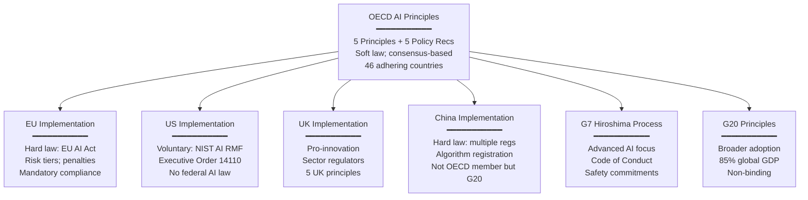
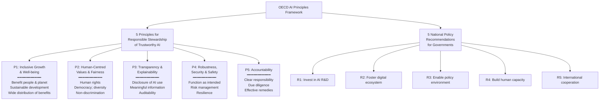

# OECD AI Principles & International AI Governance

**Topic:** OECD Recommendation on Artificial Intelligence; five AI principles; policy recommendations; OECD AI Policy Observatory; G7/G20 alignment; international AI governance coordination  
**Standard:** OECD Recommendation on AI (OECD/LEGAL/0449, May 2019; updated 2024)  
**SDO:** Organisation for Economic Co-operation and Development (OECD) — 38 member countries + partners  
**Audience:** Policy makers, AI governance professionals, international relations specialists, compliance officers, corporate strategy  
**Prerequisites:** International policy frameworks, AI fundamentals, multi-stakeholder governance concepts

---

## Chapter 1 — Historical Context & Origin Story

### 1.1 Timeline

| Year | Event | Significance |
|------|-------|-------------|
| 2016 | OECD begins AI policy work | Technology policy directorate initiates AI governance research |
| 2018 | OECD Expert Group on AI (AIGO) formed | 50+ experts from 20+ countries; multi-stakeholder |
| Nov 2018 | AIGO delivers recommendations | Draft principles presented to OECD Digital Policy Committee |
| **May 22, 2019** | **OECD AI Principles adopted** | OECD Council Recommendation; 42 countries endorse |
| June 2019 | G20 adopts "G20 AI Principles" | Based on OECD Principles; extended to non-OECD G20 members |
| 2020 | OECD AI Policy Observatory (OECD.AI) launched | Platform tracking AI policies in 60+ countries |
| 2021 | OECD Recommendation on Children in Digital Environment | Includes AI-specific children's rights |
| 2022 | OECD Framework for Classification of AI Systems | Standardized AI system taxonomy |
| 2023 | OECD updates monitoring of AI Principles implementation | Country progress reports |
| 2023 | G7 Hiroshima AI Process | Advanced AI governance; code of conduct; builds on OECD |
| **May 2024** | **OECD AI Principles updated** | First revision; generative AI considerations; strengthened |
| 2024 | 46 countries adhering to updated principles | Expanded from original 42 |

### 1.2 Why International Principles Matter

| Challenge | OECD Approach |
|:---------:|:-------------:|
| AI is borderless; regulation is national | International consensus on VALUES (principles); national implementation flexibility |
| Different countries have different legal traditions | Principles are technology-neutral and law-agnostic; each country implements differently |
| Need common language for interoperability | OECD defines shared vocabulary; enables mutual recognition |
| Risk of regulatory fragmentation | Common principles reduce divergence; facilitate trade in AI services |
| Developing countries need guidance | OECD.AI platform provides resources accessible to all nations |

---

## Chapter 2 — The Five OECD AI Principles

### 2.1 Principles for Responsible Stewardship of Trustworthy AI

| # | Principle | Core Statement |
|:-:|:---------:|----------------|
| **1** | **Inclusive growth, sustainable development, and well-being** | AI should benefit people and planet; contribute to inclusive growth; sustainable development; well-being |
| **2** | **Human-centred values and fairness** | AI must respect rule of law, human rights, democratic values, diversity; include safeguards for fair society |
| **3** | **Transparency and explainability** | Commit to transparency and responsible disclosure about AI systems; meaningful information to foster understanding |
| **4** | **Robustness, security, and safety** | AI systems must function appropriately; not pose unreasonable safety risk; security throughout lifecycle |
| **5** | **Accountability** | Organizations and individuals developing/deploying AI should be accountable for proper functioning in line with above principles |

### 2.2 Detailed Principle Breakdown

#### Principle 1: Inclusive Growth, Sustainable Development, and Well-being

| Aspect | Requirement |
|:------:|-------------|
| **Benefit** | AI should benefit people broadly (not just developers/deployers) |
| **Planet** | AI should contribute to environmental sustainability |
| **Inclusive** | Benefits of AI should be widely distributed; not increase inequality |
| **SDGs** | AI should advance UN Sustainable Development Goals |
| **Augmentation** | AI should augment human capabilities (not just replace) |

#### Principle 2: Human-Centred Values and Fairness

| Aspect | Requirement |
|:------:|-------------|
| **Human rights** | Respect international human rights norms |
| **Democracy** | AI should not undermine democratic processes |
| **Diversity** | Respect cultural diversity; prevent discrimination |
| **Autonomy** | Human autonomy preserved; informed choice |
| **Labour** | Fair transition for workers affected by AI |
| **Fairness** | AI should not create or reinforce unfair bias |

#### Principle 3: Transparency and Explainability

| Aspect | Requirement |
|:------:|-------------|
| **Disclosure** | People should know when they interact with AI |
| **Information** | Meaningful information about AI system capabilities and limitations |
| **Explainability** | AI outcomes should be explainable (appropriate to context and audience) |
| **Auditability** | AI systems should be auditable (by appropriate authorities) |
| **Documentation** | AI lifecycle documented; design choices recorded |

#### Principle 4: Robustness, Security, and Safety

| Aspect | Requirement |
|:------:|-------------|
| **Functionality** | AI should function as intended under normal and exceptional conditions |
| **Safety** | AI should not pose unreasonable safety risks |
| **Security** | Protected against adversarial attacks and manipulation |
| **Traceability** | Enable analysis of outcomes; understanding of behavior |
| **Risk management** | Systematic risk management throughout AI lifecycle |
| **Resilience** | AI should be resilient to errors, failures, and unexpected inputs |

#### Principle 5: Accountability

| Aspect | Requirement |
|:------:|-------------|
| **Responsibility** | Clear responsibility for AI system outcomes |
| **Redress** | Affected parties should have access to effective remedies |
| **Due diligence** | AI actors should apply due diligence in line with their role |
| **Reporting** | Accountability mechanisms should be proportionate to risk |
| **Governance** | Internal and external accountability structures |

---

## Chapter 3 — Policy Recommendations for Governments

### 3.1 Five Policy Recommendations

Beyond the principles for AI actors, OECD provides five recommendations for GOVERNMENTS:

| # | Recommendation | Key Actions |
|:-:|:---:|---|
| **1** | Investing in AI R&D | Public investment in AI research; long-term vision; open data/tools; interdisciplinary research |
| **2** | Fostering digital ecosystem for AI | Digital infrastructure; data access frameworks; interoperability; competition policy |
| **3** | Shaping enabling policy environment | Regulatory approaches that are proportionate and flexible; experimentation (sandboxes); standards |
| **4** | Building human capacity and preparing for labour market transition** | Education/training for AI era; skills anticipation; social safety nets; worker transition support |
| **5** | International cooperation for trustworthy AI | Multi-stakeholder dialogue; share AI policy research; interoperability of governance frameworks |

### 3.2 OECD.AI Policy Observatory

| Feature | Description |
|:-------:|-------------|
| **Purpose** | Track AI policies globally; provide evidence-based analysis; share best practices |
| **Coverage** | 60+ countries; 800+ AI policy initiatives cataloged |
| **Resources** | AI policy database; AI Incidents Monitor; AI workforce analysis; country reviews |
| **Tools** | AI system classification framework; policy comparison tools; trend analysis |
| **Users** | Governments; researchers; civil society; private sector |

---

## Chapter 4 — 2024 Update & Generative AI

### 4.1 What Changed in 2024 Update

| Original (2019) | Updated (2024) | Reason |
|:---:|:---:|---|
| "AI systems" general | Explicit mention of **generative AI and foundation models** | GenAI emerged as major governance challenge post-2022 |
| Principle 4: robustness/security | Added: **content provenance, watermarking, transparency of AI-generated content** | Deepfakes and synthetic media require traceability |
| Principle 3: transparency | Strengthened: **transparency about training data and model limitations** | Foundation model opacity is a specific concern |
| Policy rec 5: international cooperation | Added: **interoperability of AI governance approaches** | Regulatory fragmentation between EU, US, China |
| General scope | Added: **environmental sustainability considerations** (energy, compute) | Training large models has significant environmental impact |
| Accountability | Strengthened: **across AI value chain** (not just deployer) | Foundation model providers → application builders → deployers |

### 4.2 G7 Hiroshima AI Process (2023)

Built on OECD Principles; adds specific guidance for **advanced AI systems**:

| Component | Content |
|:---------:|---------|
| **Guiding Principles** | 11 principles for developers of advanced AI systems |
| **Code of Conduct** | Voluntary commitments for organizations developing/deploying frontier AI |
| **Key additions** | Pre-deployment safety testing; responsible disclosure of capabilities/limitations; watermarking/provenance; information sharing on safety incidents |

### 4.3 G20 AI Principles

| Aspect | Detail |
|--------|--------|
| **Adopted** | June 2019 (Osaka G20 Summit) |
| **Basis** | OECD AI Principles (endorsed; non-OECD G20 members also adopted) |
| **Additional members** | Argentina, Brazil, China, India, Indonesia, Saudi Arabia, South Africa, Russia |
| **Significance** | Extended OECD principles to economies representing 85% of global GDP |
| **Limitation** | Non-binding; no enforcement; implementation varies widely across G20 |

---

## Chapter 5 — National Implementations of OECD Principles

### 5.1 How Countries Implemented

| Country/Region | Approach | How OECD Principles Influenced |
|:---:|:---:|---|
| **EU** | Legislation (EU AI Act) | EU AI Act preamble references OECD; risk-based approach aligns with Principle 4; transparency (P3) → Art. 13; accountability (P5) → governance structure |
| **US** | Framework (NIST AI RMF) + Executive Order | NIST AI RMF explicitly aligns with OECD trustworthiness; EO 14110 references OECD principles |
| **UK** | Sector regulation + principles | UK "5 principles for AI regulation" directly derived from OECD: safety, transparency, fairness, accountability, contestability |
| **Canada** | Directive on Automated Decision-Making | One of first national implementations; transparency and accountability requirements for government AI |
| **Japan** | Social Principles of Human-Centric AI | Aligned with OECD P2 (human-centred); voluntary; sector-specific guidelines |
| **Singapore** | Model AI Governance Framework | Practical framework for organizations; principles closely mirror OECD |
| **Australia** | AI Ethics Principles (8 principles) | Expanded OECD 5 into 8 national principles; voluntary |
| **Korea** | National AI Ethics Guidelines | Based on OECD; includes digital inclusion specific to Korean context |

### 5.2 Implementation Comparison



---

## Chapter 6 — OECD AI System Classification Framework

### 6.1 Purpose

Published 2022, provides a standardized way to CLASSIFY AI systems across dimensions — enabling consistent policy application:

| Dimension | Question | Categories |
|:---------:|----------|:----------:|
| **People & Planet** | Who/what is affected? | Individuals; groups; environment; organizations |
| **Economic Context** | In what sector? | Healthcare, finance, transport, education, etc. |
| **Data & Input** | What data does it use? | Personal/non-personal; static/dynamic; sourcing |
| **AI Model** | What type of AI? | Rule-based; ML; DL; hybrid; RL; generative |
| **Task & Output** | What does it produce? | Classification; prediction; recommendation; generation; decision |
| **Autonomy** | How autonomous? | Human decides (AI advises) → AI decides (human monitors) → Full autonomy |

### 6.2 Classification Example

| Dimension | Credit Scoring AI | Autonomous Vehicle |
|:---------:|:-:|:-:|
| People & Planet | Individual applicants; financial inclusion | Road users; passengers; pedestrians |
| Economic Context | Financial services | Transport |
| Data & Input | Personal financial data; credit history | Sensor data; maps; real-time environment |
| AI Model | Gradient boosted trees (ML) | Deep learning (perception) + RL (planning) |
| Task & Output | Risk score (prediction) + decision | Actions (steering, braking) |
| Autonomy | AI recommends; human reviews (some) | AI decides; human can override (some) |

---

## Chapter 7 — Comparison with Other International Frameworks

| Dimension | OECD AI Principles | UNESCO AI Ethics | Council of Europe AI Treaty | G7 Hiroshima |
|:---------:|:---:|:---:|:---:|:---:|
| **Year** | 2019 (updated 2024) | 2021 | 2024 | 2023 |
| **Members** | 46 countries (OECD + adherents) | 193 member states | 46 signatories (CoE) | 7 nations |
| **Type** | Recommendation (soft law) | Recommendation (soft law) | Treaty (hard law when ratified) | Political commitment |
| **Binding** | No | No | Yes (for ratifying states) | No (voluntary) |
| **Focus** | Trustworthy AI + economic policy | Ethical AI + human rights + values | Human rights + rule of law + democracy | Advanced/frontier AI safety |
| **Principles** | 5 principles + 5 policy recs | 4 values + 10 principles | Rights-based + obligations for states | 11 guiding principles + code |
| **Innovation-friendly** | Yes (balanced) | Less (values-first) | Moderate (exceptions for security/defense) | Yes (pro-innovation) |
| **GenAI coverage** | Yes (2024 update) | Limited (2021) | General (technology-neutral) | Primary focus |
| **Monitoring** | OECD.AI Observatory | UNESCO reporting | Treaty monitoring mechanism | Annual progress report |
| **Enforcement** | Peer review | Self-reporting | State accountability | None |

---

## Chapter 8 — Mermaid Architecture Diagrams

### 8.1 OECD AI Principles Architecture



### 8.2 From Principles to Practice

```mermaid
flowchart TD
    INTL[International Level<br/>━━━━━━━━━━━<br/>OECD AI Principles<br/>G20/G7 endorsement<br/>Consensus values]
    
    INTL --> NATIONAL[National Level<br/>━━━━━━━━━━━<br/>Legislation (EU AI Act)<br/>Frameworks (NIST AI RMF)<br/>Strategies (National AI Plans)]
    
    NATIONAL --> STANDARDS[Standards Level<br/>━━━━━━━━━━━<br/>ISO 42001 (management)<br/>IEEE 7000 (ethics process)<br/>Sector standards (SOTIF, EASA)]
    
    STANDARDS --> ORG[Organization Level<br/>━━━━━━━━━━━<br/>AI policies; governance<br/>Risk management<br/>Impact assessments]
    
    ORG --> PRACTICE[Practice Level<br/>━━━━━━━━━━━<br/>Model cards; fairness testing<br/>Monitoring dashboards<br/>Incident response<br/>Human oversight]
    
    PRACTICE --> OUTCOME[Outcomes<br/>━━━━━━━━━━━<br/>Trustworthy AI deployed<br/>Rights protected<br/>Innovation flourishing<br/>Public trust maintained]
```

---

## Chapter 9 — Case Studies

### 9.1 Canada: First National Implementation of OECD Principles

| Aspect | Detail |
|--------|--------|
| **Initiative** | Directive on Automated Decision-Making (2019); Treasury Board of Canada |
| **Alignment** | Directly implements OECD Principles 3 (transparency) and 5 (accountability) for government AI |
| **Mechanism** | Algorithmic Impact Assessment (AIA) tool: online questionnaire determines impact level of automated decision system |
| **Impact levels** | Level I (low): little/no impact on individuals. Level II: moderate. Level III: high. Level IV: very high (decisions significantly affecting rights/health/economic situation). |
| **Requirements by level** | Level I: notice to users. Level II: + peer review. Level III: + open source requirements; external audit. Level IV: + mandatory human-in-the-loop; ongoing monitoring; external review. |
| **OECD principle mapping** | Transparency → mandatory notice and explanation of automated decisions. Accountability → clear responsibility; impact assessment before deployment. Fairness → bias testing required at Levels III-IV. |
| **Lesson** | Practical, proportionate approach; first government to translate OECD principles into mandatory operational requirements. Influenced many other national approaches. |

### 9.2 Singapore: Model AI Governance Framework

| Aspect | Detail |
|--------|--------|
| **Initiative** | Model AI Governance Framework (2019; v2 2020); Personal Data Protection Commission (PDPC) |
| **Alignment** | Explicitly references and implements OECD AI Principles |
| **Structure** | (1) Internal governance structures. (2) Determining AI decision-making model (human-in/on/out of loop). (3) Operations management (risk, data, model). (4) Stakeholder interaction and communication. |
| **Innovation** | "AI Verify" testing framework: open-source tool organizations use to VERIFY their AI systems against governance principles (fairness, explainability, robustness testing) |
| **Practical focus** | Industry-oriented; case studies included; progressive approach (start small, expand); voluntary but encouraged for government procurement |
| **OECD mapping** | P1 (well-being) → societal benefit assessment. P3 (transparency) → explainability testing. P4 (safety) → robustness testing via AI Verify. P5 (accountability) → governance structures. |
| **Lesson** | Small country, big influence: Singapore's practical tooling approach (AI Verify) showed how principles can become testable. Now part of OECD.AI resources. |

---

## Chapter 10 — Future Evolution

| Trend | Timeline | Impact |
|-------|----------|--------|
| **OECD AI Principles v3** | 2026-2027 | Further updates for autonomous systems, multimodal AI, AI agents |
| **Convergence with EU AI Act** | 2025-2027 | OECD principles mapped formally to EU AI Act; facilitates mutual understanding |
| **Expanded adherence** | 2024-2030 | 60+ countries adhering (including more Global South nations) |
| **AI governance interoperability** | 2025-2030 | OECD as broker for mutual recognition between jurisdictions (EU↔US↔Japan↔etc.) |
| **OECD.AI enhanced monitoring** | 2024-2026 | Real-time tracking of principle implementation; AI incident database |
| **Sector-specific guidance** | 2025-2027 | OECD sector guidance (healthcare AI, financial AI) building on base principles |
| **OECD AI Governance Metrics** | 2025-2028 | Standardized metrics for measuring national AI governance maturity |

---

## Chapter 11 — Interview Questions & Career Guide

### Tier 1: Entry-Level

**Q1:** What are the OECD AI Principles? Why are they significant in the global AI governance landscape?

**A:** The OECD AI Principles (adopted May 2019, updated 2024) are the first international consensus on AI governance, endorsed by 46 countries representing the majority of the world's advanced economies.

The five principles are: (1) **Inclusive growth & well-being** — AI should benefit people and planet. (2) **Human-centred values & fairness** — respect human rights, democracy, non-discrimination. (3) **Transparency & explainability** — people should know about AI use; outcomes should be understandable. (4) **Robustness, security & safety** — AI should function correctly and safely. (5) **Accountability** — clear responsibility; access to remedies.

They're significant because: They were adopted by G20 (85% of global GDP); they directly influenced the EU AI Act, NIST AI RMF, and UK AI principles; they established a common vocabulary for international AI policy discussions; they enabled the OECD.AI Policy Observatory (tracking AI policies in 60+ countries). They're "soft law" (not legally binding) but extremely influential as the international consensus baseline that harder regulations build upon.

### Tier 2: Mid-Level

**Q2:** How do the OECD AI Principles translate into practice for an organization? What's the gap between international principles and operational governance?

**A:** The OECD Principles are VALUES-LEVEL statements. They tell you WHAT trustworthy AI looks like but not HOW to achieve it. The translation path is:

**Principles → Policies → Standards → Practices**

(1) **OECD Principles** (international): "AI should be transparent" (Principle 3). (2) **National regulation** (country): EU AI Act Art. 13: "High-risk AI systems shall be designed to enable deployers to interpret outputs." (3) **Standard** (organization): ISO 42001 A.8.2: "Information about AI systems provided to users." (4) **Practice** (engineering): Model card published; SHAP explainability implemented; decision explanations in UI.

**Key gaps between principles and practice**:
- **Measurement**: Principles say "fair" but don't define fairness metrics. Organizations must choose (demographic parity? equalized odds? individual fairness?).
- **Trade-offs**: Principles list all desirable properties (transparent AND safe AND private) but don't prioritize when they conflict.
- **Context-dependence**: "Appropriate" transparency for a spam filter ≠ transparency for a sentencing AI.
- **Enforcement**: Principles have no teeth without legislation or contractual requirements.

**Practical implementation path**: (1) Map OECD principles to organizational AI policy. (2) Use standards (ISO 42001, NIST AI RMF) as operational frameworks. (3) Define context-specific metrics per AI system. (4) Implement monitoring and governance structures. (5) Prepare for regulatory compliance (EU AI Act builds directly on OECD principles; early alignment = easier compliance later).

### Tier 3: Senior

**Q3:** You advise a government that wants to develop national AI governance aligned with OECD Principles while preserving competitiveness. Design a governance strategy that balances all five principles with innovation needs.

**A:**

**Design philosophy**: "Trust enables adoption; adoption drives innovation." Governance is not the OPPOSITE of innovation — it's the FOUNDATION for sustained innovation (AI companies in well-governed markets have MORE public trust, MORE data access, MORE adoption than those in ungoverned spaces).

**Architecture: Proportionate Risk-Based Governance**

*Pillar 1 — Enabling Policy Environment* (OECD Recommendation 3):
- Regulatory sandboxes for AI innovation (supervised experimentation; real-world testing without full compliance burden during development). Learn from EU AI Act Art. 57.
- Sector-based approach: identify which sectors need hard rules (healthcare, safety, HR) vs. which can self-regulate (entertainment, internal tools).
- "Right to explanation" framework scaled to impact: low-impact AI → minimal transparency; high-impact → full explainability + auditability + human oversight.

*Pillar 2 — Investing in Trustworthy AI* (OECD Recommendation 1):
- National AI R&D fund (including responsible AI research: fairness, explainability, safety).
- Public AI infrastructure: national compute facility; high-quality open datasets; evaluation benchmarks for local context.
- AI safety institute (like UK AISI): evaluate frontier AI models before deployment; share findings internationally.

*Pillar 3 — Human Capacity* (OECD Recommendation 4):
- AI literacy programs for all citizens (not just technical). Workers: reskilling programs for AI-displaced roles.
- University programs in "AI governance" (new profession: AI auditors, AI ethicists, AI policy).
- Government workforce: AI capability within regulators (can't regulate what you don't understand).

*Pillar 4 — Implementation Mechanism*:
- NOT a single AI regulator (avoid bureaucratic bottleneck). Instead: sector regulators empowered with AI expertise (healthcare regulator handles healthcare AI; financial regulator handles credit AI).
- Central AI coordination body: sets national AI principles (based on OECD); coordinates sector regulators; avoids contradictions.
- Graduated enforcement: (1) Year 1-2: guidance-only period (industry adopts voluntarily). (2) Year 2-3: mandatory registration for high-risk AI. (3) Year 3+: full requirements with enforcement for high-risk; continued voluntary for low-risk.

*Pillar 5 — International Cooperation* (OECD Recommendation 5):
- Adhere to OECD AI Principles (signal alignment to international community).
- Participate in OECD.AI governance network; share policy experience.
- Seek mutual recognition agreements for AI conformity assessment (avoid organizations needing to certify separately in each country).
- Contribute to international standards (ISO 42001 national mirror committee; participate in standard development).

---

## Chapter 12 — Cheat Sheet & Quick Reference

```
═══════════════════════════════════════════
OECD AI PRINCIPLES — QUICK REFERENCE
═══════════════════════════════════════════

ADOPTED: May 2019 (Updated May 2024)
TYPE:    OECD Recommendation (soft law; non-binding)
SCOPE:   46 adhering countries + G20 endorsement

═══════════════════════════════════════════
5 PRINCIPLES FOR TRUSTWORTHY AI:
  P1: Inclusive Growth & Well-being
      → AI benefits people & planet
  P2: Human-Centred Values & Fairness
      → Human rights; democracy; non-discrimination
  P3: Transparency & Explainability
      → Disclosure; information; auditability
  P4: Robustness, Security & Safety
      → Function correctly; resist attacks; manage risk
  P5: Accountability
      → Clear responsibility; access to remedies

═══════════════════════════════════════════
5 POLICY RECOMMENDATIONS FOR GOVERNMENTS:
  R1: Invest in AI R&D
  R2: Foster digital ecosystem for AI
  R3: Shape enabling policy environment
  R4: Build human capacity; prepare labour market
  R5: International cooperation for trustworthy AI

═══════════════════════════════════════════
2024 UPDATE — KEY ADDITIONS:
  • Generative AI & foundation models explicitly addressed
  • Content provenance & watermarking
  • Training data transparency
  • Environmental sustainability (energy/compute)
  • Accountability across AI VALUE CHAIN
  • AI governance interoperability

═══════════════════════════════════════════
ADOPTION/INFLUENCE:
  OECD:  46 countries directly adhere
  G20:   All G20 adopted (2019); extends to non-OECD G20
  EU:    EU AI Act built on OECD principles
  US:    NIST AI RMF aligns with OECD trustworthiness
  UK:    5 UK AI principles derived from OECD
  G7:    Hiroshima Process builds on OECD for advanced AI
  ISO:   ISO 42001 aligns with OECD principles

═══════════════════════════════════════════
OECD.AI POLICY OBSERVATORY:
  Purpose:   Track global AI policies; share evidence
  Coverage:  60+ countries; 800+ AI policy initiatives
  Tools:     AI system classification framework
  Access:    https://oecd.ai (public)

═══════════════════════════════════════════
RELATED INTERNATIONAL INSTRUMENTS:
  OECD AI Principles (2019/2024): 46 countries
  G20 AI Principles (2019): 85% global GDP
  UNESCO AI Ethics (2021): 193 member states
  G7 Hiroshima Process (2023): 7 nations; advanced AI
  Council of Europe AI Treaty (2024): binding treaty
  Bletchley Declaration (2023): AI safety summit

═══════════════════════════════════════════
PRINCIPLE → STANDARD/REGULATION MAPPING:
  P1 (Inclusive) → EU AI Act (well-being focus)
  P2 (Fairness)  → NIST AI RMF (fairness measurement)
  P3 (Transparency) → EU AI Act Art. 13; ISO 42001 A.8
  P4 (Safety)    → ISO 42001 A.5.2; EU AI Act Art. 9
  P5 (Accountability) → EU AI Act Art. 16-28; ISO 42001 A.3

═══════════════════════════════════════════
KEY INSIGHT:
  OECD Principles = international VALUES consensus
  They answer WHAT trustworthy AI looks like
  They DON'T answer HOW to implement
  Implementation path: Principles → Policy → Standards → Practice
```

---

*End of Document — 04_OECD_AI_Principles.md*
