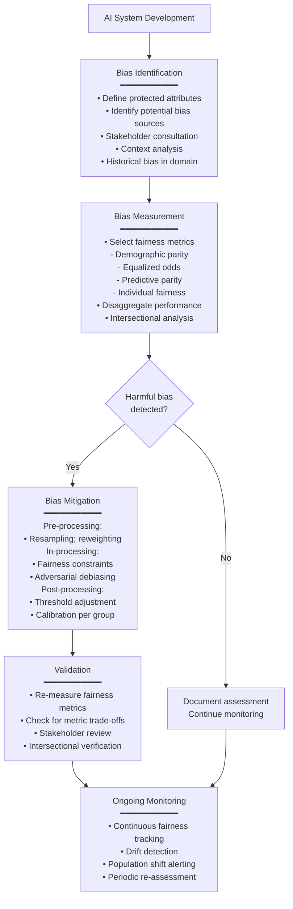
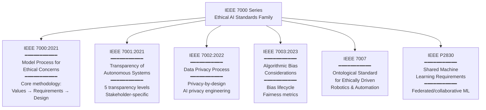
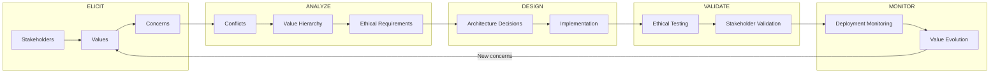

# IEEE 7000 Series — Ethical AI & Autonomous Systems Standards

**Topic:** IEEE standards for ethical AI system design; transparency of autonomous systems; algorithmic bias; data privacy; IEEE 7000 model process; value-sensitive design  
**Standards:** IEEE 7000:2021, IEEE 7001:2021, IEEE 7002:2022, IEEE 7003:2023, IEEE 7007, IEEE P2830  
**SDO:** IEEE Standards Association (IEEE-SA); IEEE Global Initiative on Ethics of Autonomous and Intelligent Systems  
**Audience:** Systems engineers, AI architects, product managers, ethics officers, compliance teams, UX designers  
**Prerequisites:** Systems engineering lifecycle, stakeholder analysis, AI/ML fundamentals, ethical reasoning concepts

---

## Chapter 1 — Historical Context & Origin Story

### 1.1 Timeline

| Year | Event | Significance |
|------|-------|-------------|
| 2016 | IEEE Global Initiative on Ethics of A/IS launched | 700+ experts; "Ethically Aligned Design" (EAD) v1 |
| 2017 | EAD Version 2 published | Comprehensive vision for ethical autonomous systems |
| 2019 | EAD First Edition | Final public document; basis for IEEE 7000 series |
| 2019 | IEEE P7000 working group begins | Standard development process initiated |
| **2021** | **IEEE 7000:2021 published** | Model Process for Addressing Ethical Concerns During System Design |
| **2021** | **IEEE 7001:2021 published** | Transparency of Autonomous Systems |
| **2022** | **IEEE 7002:2022 published** | Data Privacy Process |
| **2023** | **IEEE 7003:2023 published** | Algorithmic Bias Considerations |
| 2023 | IEEE 7007 (draft) | Ontological Standard for Ethically Driven Robotics |
| 2023 | IEEE P2830 (development) | Technical Requirements for Shared Machine Learning |

### 1.2 The IEEE 7000 Series Vision

The IEEE 7000 series creates a FAMILY of standards that together address ethical AI from different angles:

| Standard | Focus | Key Innovation |
|:--------:|-------|:-:|
| **7000** | Process for ethical design | Value-sensitive design methodology; stakeholder values → system requirements |
| **7001** | Transparency of autonomous systems | Measurable transparency levels; stakeholder-specific explanations |
| **7002** | Data privacy | Privacy-by-design process; privacy impact engineering |
| **7003** | Algorithmic bias | Bias assessment methodology; fairness engineering |
| **7007** | Ethical robotics ontology | Common vocabulary for robot ethics |
| **P2830** | Shared/federated ML | Technical requirements for collaborative ML without data sharing |

---

## Chapter 2 — IEEE 7000:2021 — Model Process for Addressing Ethical Concerns

### 2.1 Overview

| Aspect | Detail |
|--------|--------|
| **Full title** | IEEE Standard — Model Process for Addressing Ethical Concerns During System Design |
| **Purpose** | Provide a systematic, repeatable process for translating ethical values into system requirements |
| **Type** | Process standard (not product standard); defines WHAT to do at each lifecycle stage |
| **Key concept** | Value-Sensitive Design (VSD): identify stakeholder values → analyze conflicts → translate to requirements → verify in design |
| **Scope** | Any autonomous or intelligent system; not limited to AI |

### 2.2 Process Structure

| Phase | Name | Activities |
|:-----:|------|-----------|
| **1** | Concept of Operations (ConOps) | Define system context; identify stakeholders; document operational scenarios |
| **2** | Ethical Values Elicitation | Identify values relevant to stakeholders; prioritize; document ethical concerns |
| **3** | Ethical Requirements Definition | Translate values into engineering requirements; define ethical requirements specifications |
| **4** | Design & Development | Design system architecture addressing ethical requirements; trade-off analysis |
| **5** | Verification & Validation | Verify ethical requirements met; validate with stakeholders; ethical assessment |
| **6** | Monitoring & Evolution | Post-deployment monitoring of ethical impacts; adaptation when context changes |

### 2.3 Key Concepts

| Concept | Definition | Example |
|:-------:|-----------|---------|
| **Stakeholder** | Person or group affected by or affecting the system | Users, bystanders, operators, society, future generations |
| **Value** | What matters to a stakeholder; what they consider good/right | Privacy, safety, fairness, autonomy, dignity, transparency |
| **Value conflict** | When satisfying one value compromises another | Privacy (hide data) vs. Fairness (need data to detect bias) |
| **Ethical requirement** | Testable specification derived from a value | "System shall not use gender as input feature for loan decisions" |
| **Value hierarchy** | Prioritization of values when conflicts exist | Safety > Privacy > Convenience (for autonomous vehicle) |

### 2.4 Process Flow

```mermaid
flowchart TD
    START[System Concept]
    
    START --> STAKE[Phase 1: Stakeholder Identification<br/>━━━━━━━━━━━<br/>• Direct users<br/>• Indirect stakeholders (affected non-users)<br/>• Vulnerable groups<br/>• Future generations<br/>• Environment]
    
    STAKE --> VALUES[Phase 2: Value Elicitation<br/>━━━━━━━━━━━<br/>• What values do stakeholders hold?<br/>• What ethical concerns exist?<br/>• What harms could occur?<br/>• Prioritize values per stakeholder group<br/>• Identify value tensions/conflicts]
    
    VALUES --> ANALYZE[Phase 3: Value Analysis<br/>━━━━━━━━━━━<br/>• Map values to system features<br/>• Identify conflicts between values<br/>• Define resolution strategies<br/>• Create value hierarchy<br/>• Translate values → requirements]
    
    ANALYZE --> DESIGN[Phase 4: Ethical Design<br/>━━━━━━━━━━━<br/>• Architecture decisions informed by values<br/>• Trade-off documentation<br/>• Design patterns for ethical requirements<br/>• Implement ethical requirements<br/>• Document design rationale]
    
    DESIGN --> VV[Phase 5: Verification & Validation<br/>━━━━━━━━━━━<br/>• Test ethical requirements met<br/>• Stakeholder validation workshops<br/>• Ethical impact assessment<br/>• Residual ethical risks documented<br/>• Sign-off by ethics authority]
    
    VV --> DEPLOY[Phase 6: Monitoring & Evolution<br/>━━━━━━━━━━━<br/>• Monitor ethical impact in operation<br/>• Stakeholder feedback collection<br/>• Adapt when context changes<br/>• Periodic ethical review<br/>• Value drift assessment]
    
    DEPLOY -->|"Context changes"| VALUES
```

---

## Chapter 3 — IEEE 7001:2021 — Transparency of Autonomous Systems

### 3.1 Overview

| Aspect | Detail |
|--------|--------|
| **Purpose** | Define measurable transparency levels for autonomous systems; specify what transparency means for different stakeholders |
| **Key insight** | Transparency is NOT one-size-fits-all: a developer needs different transparency than a user, regulator, or affected person |
| **Innovation** | 5 levels of transparency; stakeholder-specific transparency requirements |

### 3.2 Five Transparency Levels

| Level | Name | What's Disclosed | Audience |
|:-----:|:----:|---|:--------:|
| **0** | None | No transparency; black box | — |
| **1** | Basic | System capabilities; intended purpose; known limitations | All |
| **2** | Operational | How system works (high-level); decision factors; confidence levels | Users, operators |
| **3** | Detailed | Algorithm type; training data characteristics; performance metrics; validation results | Regulators, auditors |
| **4** | Full | Source code; complete training data; model weights; full audit trail | Certification bodies, researchers (access-controlled) |

### 3.3 Stakeholder-Specific Transparency

| Stakeholder | Appropriate Level | What They Need to Know |
|:-----------:|:-:|---|
| **General public** | 1-2 | What the system does; that it IS AI; its limitations; how to seek recourse |
| **Direct users** | 2-3 | How to interpret outputs; confidence levels; when not to trust AI; override options |
| **Operators** | 2-3 | System behavior parameters; failure modes; monitoring points; escalation criteria |
| **Affected individuals** | 2 | That AI was used in decision about them; key factors; how to contest |
| **Regulators** | 3-4 | Full documentation; testing results; incident history; compliance evidence |
| **Auditors** | 3-4 | Detailed technical access; data provenance; decision logs; source code (if needed) |
| **Researchers** | 3-4 | Methodology; reproducibility information; evaluation details |

---

## Chapter 4 — IEEE 7002:2022 — Data Privacy Process

### 4.1 Overview

| Aspect | Detail |
|--------|--------|
| **Purpose** | Systematic process for engineering privacy into AI/autonomous systems from design phase |
| **Approach** | Privacy-by-design engineering process; not just compliance but ENGINEERING privacy |
| **Aligns with** | GDPR data protection by design; ISO 27701; NIST Privacy Framework |

### 4.2 Privacy Engineering Process

| Phase | Activities |
|:-----:|-----------|
| **Data Inventory** | Catalog all personal data used by system; data flows; storage; access |
| **Privacy Risk Assessment** | Identify privacy risks: re-identification, inference, profiling, surveillance |
| **Privacy Requirements** | Define privacy requirements from stakeholder analysis + regulatory requirements |
| **Privacy Architecture** | Design data handling: minimization, anonymization, pseudonymization, encryption, access control |
| **Implementation** | Build privacy controls: consent mechanisms, data retention, deletion, portability |
| **Verification** | Test privacy requirements; privacy penetration testing; de-anonymization resistance |
| **Monitoring** | Ongoing privacy monitoring; breach detection; data subject request handling |

### 4.3 Privacy Considerations for AI/ML

| AI-Specific Privacy Issue | IEEE 7002 Approach |
|:---:|---|
| Model memorization (training data in model weights) | Privacy assessment must include inference attacks; differential privacy in training |
| Feature engineering revealing sensitive attributes | Assess proxy variable privacy risk; sensitive attribute inference |
| Federated learning privacy | Even without sharing data, model updates can leak information |
| Explanation/XAI privacy | Explanations may reveal private data about other individuals in training set |
| Data provenance | Track consent chain: did training data subjects consent to AI training? |

---

## Chapter 5 — IEEE 7003:2023 — Algorithmic Bias Considerations

### 5.1 Overview

| Aspect | Detail |
|--------|--------|
| **Purpose** | Methodology for identifying, assessing, and mitigating algorithmic bias in AI/autonomous systems |
| **Key distinction** | Bias is not always harmful; IEEE 7003 focuses on HARMFUL bias leading to unfair outcomes |
| **Approach** | Lifecycle-based: bias can enter at data collection, labeling, model design, training, deployment, or use |

### 5.2 Types of Bias

| Bias Type | Source | Example |
|:---------:|--------|---------|
| **Historical** | Training data reflects past inequity | Hiring AI trained on historical hires (male-dominated tech industry) → discriminates against women |
| **Representation** | Training data under-represents groups | Medical AI trained primarily on light skin → worse performance on dark skin |
| **Measurement** | Features are proxies for protected attributes | Zip code as proxy for race in lending |
| **Aggregation** | One model applied to diverse populations | Single diabetes prediction model for all ethnicities (biology differs) |
| **Evaluation** | Metrics don't capture fairness | Model "accurate" overall but fails for minority subgroups |
| **Deployment** | Context of use introduces bias | AI designed for one culture deployed in another without adaptation |
| **Automation** | Human over-relies on AI; stops checking | AI flags minority applicants; humans rubber-stamp without review |

### 5.3 Bias Assessment Process (IEEE 7003)



---

## Chapter 6 — Implementation Guide

### 6.1 Implementing IEEE 7000 in Product Development

| Sprint/Phase | IEEE 7000 Activity | Output |
|:---:|---|---|
| **Concept phase** | Stakeholder mapping; value elicitation workshops; ethical risk brainstorming | Stakeholder map; value register; ethical risk log |
| **Requirements** | Value-to-requirement translation; ethical requirements specification; conflict resolution | Ethical requirements specification (ERS); value priority matrix |
| **Architecture** | Design for values; transparency architecture; privacy architecture; bias prevention patterns | Architecture decision records (ADR) with ethical rationale |
| **Development** | Implement ethical requirements; transparency interfaces; bias testing in CI/CD | Ethical requirement implementation evidence |
| **Testing** | Ethical verification (requirements met?); stakeholder validation; bias testing; privacy testing | Ethics test report; stakeholder feedback; fairness audit |
| **Deployment** | Ethical impact assessment; transparency documentation; monitoring setup | Pre-deployment ethics review; monitoring dashboard |
| **Operations** | Continuous ethical monitoring; stakeholder feedback; periodic review | Monthly ethics metrics; incident reports; review records |

### 6.2 Combining IEEE 7000 Series

| If building... | Use these standards together |
|:---:|---|
| **AI recommendation system** | 7000 (ethical design) + 7001 (explain recommendations) + 7003 (fairness of recommendations) |
| **Autonomous vehicle** | 7000 (stakeholder values → safety requirements) + 7001 (transparency for passengers, regulators) + 7002 (location privacy) |
| **HR/recruitment AI** | 7000 (values: fairness, dignity) + 7002 (candidate data privacy) + 7003 (hiring bias assessment) |
| **Healthcare AI** | 7000 (patient values) + 7001 (explain to clinicians) + 7002 (patient privacy) + 7003 (demographic fairness) |
| **Smart city AI** | 7000 (citizen values) + 7001 (public transparency) + 7002 (surveillance privacy) + 7003 (equitable service) |

---

## Chapter 7 — Comparison with Other Ethical AI Approaches

| Dimension | IEEE 7000 Series | EU AI Act (Ethics) | ISO 42001 (Ethics) | NIST AI RMF (Ethics) |
|:---------:|:---:|:---:|:---:|:---:|
| **Type** | Process standards | Legal requirements | Management controls | Framework functions |
| **Approach** | Value-sensitive design | Risk-based regulation | Organizational governance | Risk management |
| **Focus** | HOW to engineer ethics | WHAT ethical obligations | WHAT controls to have | WHAT outcomes to achieve |
| **Stakeholders** | Central (values FROM stakeholders) | Considered (fundamental rights) | Considered (interested parties) | Considered (affected communities) |
| **Bias** | IEEE 7003 (dedicated standard) | Art. 10 (data governance) | A.7.6 (data for responsible AI) | MEASURE 2.6 (fairness) |
| **Transparency** | IEEE 7001 (dedicated standard) | Art. 13 (transparency) | A.8.2 (user information) | Trustworthiness characteristic |
| **Privacy** | IEEE 7002 (dedicated standard) | GDPR coordination | A.7.4 (data provenance) | Privacy-enhanced (characteristic) |
| **Innovation** | Engineering methodology (practical) | Legal obligation (defensive) | Governance structure (organizational) | Risk-based (proportionate) |
| **Certification** | Conformity assessment possible | CE marking | ISO audit | Self-assessment |

---

## Chapter 8 — Mermaid Architecture Diagrams

### 8.1 IEEE 7000 Series Family



### 8.2 Value-Sensitive Design (IEEE 7000) Process



---

## Chapter 9 — Case Studies

### 9.1 Autonomous Vehicle: IEEE 7000 Value Elicitation

| Aspect | Detail |
|--------|--------|
| **System** | SAE Level 4 autonomous vehicle; urban deployment; ride-sharing service |
| **IEEE 7000 applied** | Full model process for ethical design |
| **Phase 1 — Stakeholders** | Passengers, pedestrians, cyclists, other drivers, emergency services, city government, insurance companies, the environment, future generations |
| **Phase 2 — Values elicited** | Passengers: safety, comfort, privacy (don't track me), predictability. Pedestrians: safety (prioritize my life), visibility (I can see the car sees me), predictability (moves like human driver). City: traffic efficiency, emission reduction, accessibility, public safety. Emergency services: right-of-way compliance, accident scene behavior. Insurance: liability clarity, incident data availability, risk predictability. |
| **Phase 3 — Conflicts** | (1) Safety of passenger vs. safety of pedestrian (trolley problem scenarios). (2) Privacy (don't record) vs. Safety (need camera data) vs. Accountability (need incident records). (3) Efficiency (take shortest route) vs. Fairness (avoid disproportionate traffic through low-income neighborhoods). (4) Transparency (explain decisions) vs. Security (don't reveal vulnerability). |
| **Resolution** | Value hierarchy established: (1) Safety of all (paramount; no trade-off against convenience). (2) Fairness (equitable risk distribution; no discrimination in routing). (3) Privacy (minimize; delete when purpose fulfilled; consent-based beyond minimum). (4) Transparency (appropriate to stakeholder; full to regulators). (5) Efficiency (optimize within constraints of values above). |
| **Phase 4 — Ethical Requirements** | ER-001: "System shall not discriminate in safety behavior based on apparent characteristics of road users." ER-002: "All sensor data recording shall be automatically deleted within 72 hours unless involved in incident." ER-003: "System shall provide real-time indication to pedestrians that it has detected them (external display)." ER-004: "Routing algorithms shall not route disproportionately through any demographic area without traffic justification." |
| **Outcome** | 23 ethical requirements specified; 18 implemented in first version; 5 deferred with documented rationale; ongoing stakeholder advisory board reviews quarterly |

### 9.2 Healthcare: IEEE 7003 Bias Assessment for Diagnostic AI

| Aspect | Detail |
|--------|--------|
| **System** | Dermatology AI: classifies skin lesions from photographs; assists dermatologists |
| **IEEE 7003 applied** | Algorithmic bias assessment |
| **Protected attributes identified** | Skin tone (Fitzpatrick scale I-VI); age; gender; body location |
| **Bias assessment findings** | (1) Training data: 80% Fitzpatrick I-III (light skin); 20% Fitzpatrick IV-VI (dark skin). (2) Performance: AUC 0.95 for light skin; AUC 0.78 for dark skin (17% gap — SEVERE). (3) Root cause: representation bias (dermatology textbooks historically over-represent light skin). (4) Impact: missed melanoma on dark skin = potentially fatal misdiagnosis |
| **Mitigation** | (1) Data augmentation: partnered with hospitals serving diverse populations; expanded dark skin training data 5x. (2) Evaluation: separate performance reporting by Fitzpatrick scale. (3) Technical: oversampled dark skin in training; added skin tone as conditioning variable. (4) Operational: system outputs confidence score; low confidence on dark skin → mandatory human review. |
| **Post-mitigation** | AUC gap reduced from 17% to 4% (0.95 vs. 0.91); commitment to continue improving; ongoing monitoring by skin tone |
| **IEEE 7003 documentation** | Bias assessment report documenting: protected attributes, metrics used, findings, mitigation actions, residual bias, monitoring plan |

---

## Chapter 10 — Future Evolution

| Trend | Timeline | Impact |
|-------|----------|--------|
| **IEEE 7000 series expansion** | 2024-2027 | Additional standards: AI agents (7008?); emotional AI (P7014); children and AI |
| **ISO/IEEE alignment** | 2025-2027 | IEEE 7000 series referenced by ISO 42001; potential dual-logo standards |
| **EU AI Act harmonization** | 2025-2027 | IEEE 7000 series may become harmonized standards under EU AI Act for ethical design |
| **Conformity assessment programs** | 2025-2028 | Certification programs against IEEE 7001 (transparency) and IEEE 7003 (bias) |
| **Tooling** | 2024-2027 | Software tools implementing IEEE 7003 bias assessment methodology; automated transparency level assessment |
| **GenAI ethics** | 2024-2026 | IEEE standards for generative AI ethics (content attribution, synthetic media, AI agent ethics) |
| **Global adoption** | 2025-2030 | IEEE 7000 series adopted in procurement requirements; government mandates reference |

---

## Chapter 11 — Interview Questions & Career Guide

### Tier 1: Entry-Level

**Q1:** What is IEEE 7000:2021 and how does it differ from other AI governance standards like ISO 42001?

**A:** IEEE 7000:2021 is a process standard for addressing ethical concerns during system design. It provides a systematic methodology for translating stakeholder VALUES into engineering REQUIREMENTS.

Key difference from ISO 42001: ISO 42001 is a MANAGEMENT SYSTEM standard (organizational governance: policies, roles, audits). IEEE 7000 is a DESIGN PROCESS standard (engineering methodology: how to identify values, resolve conflicts, specify ethical requirements, and verify them).

Think of it this way: ISO 42001 asks "Does your ORGANIZATION have AI governance?" IEEE 7000 asks "Does your DESIGN PROCESS systematically consider ethics?"

IEEE 7000's unique contribution: (1) Value-Sensitive Design methodology — structured process for eliciting what stakeholders value. (2) Value conflict resolution — when stakeholders want contradictory things, how do you decide? IEEE 7000 provides a framework. (3) Ethical requirements specification — "AI should be fair" (vague) → "System shall maintain equalized odds within 5% across demographic groups" (testable ethical requirement).

They're complementary: An ISO 42001-certified organization would benefit from using IEEE 7000 methodology within their AI development lifecycle (ISO 42001 A.6.3 "requirements and design" could reference IEEE 7000 process).

### Tier 2: Mid-Level

**Q2:** Explain IEEE 7001's transparency levels. How would you apply them to a credit scoring AI?

**A:** IEEE 7001 defines 5 levels of transparency (0-4), and critically, different stakeholders need DIFFERENT levels:

For a **credit scoring AI**:

**Level 1 (Basic) → Applicants (all)**: "This loan decision was assisted by an automated scoring system. It evaluates your creditworthiness based on financial history, income, and other factors." Purpose: people KNOW AI was used.

**Level 2 (Operational) → Denied applicants**: "Your application scored below our threshold. Key factors in your score: (1) credit utilization 85% (high); (2) accounts in collections: 2; (3) length of credit history: 2 years (short). To improve: reduce utilization below 30%; resolve collections." Purpose: ACTIONABLE explanation; specific to their situation.

**Level 2-3 (Operational-Detailed) → Loan officers**: "Applicant score: 620 (threshold: 680). Model confidence: 72% (below 80% → recommend manual review). Feature importance: credit utilization (35%), payment history (25%), total debt (20%), credit age (15%), inquiry count (5%). Similar approved applicants had utilization <40%." Purpose: enable INFORMED HUMAN OVERSIGHT.

**Level 3-4 (Detailed-Full) → Regulators/auditors**: "Model type: XGBoost with 250 trees. Training data: 2M applications (2018-2023); demographic distribution: [breakdown]. Fairness audit results: demographic parity ratio 0.85 (within regulatory threshold). Validation: 5-fold cross-validation; holdout test AUC 0.82. Feature engineering: 45 features derived from [list]. No prohibited features used (race, gender, national origin). Adverse action generation: SHAP-based top-5 factors per decision." Purpose: verify compliance; audit fairness; investigate complaints.

**Level 4 (Full) → Certification body (if required)**: Complete model code, full training pipeline, all data documentation, hyperparameter selection rationale, A/B test results, historical performance by cohort. Access-controlled; under NDA.

Key insight: transparency is not "all or nothing." Giving applicants Level 4 (model weights) would be meaningless. Giving regulators only Level 1 would be insufficient. IEEE 7001's innovation is recognizing this stakeholder-specificity.

### Tier 3: Senior

**Q3:** Design an "Ethics-by-Design" engineering process that integrates IEEE 7000 (values), 7001 (transparency), 7002 (privacy), and 7003 (bias) into a modern ML development lifecycle (MLOps). How do you make ethics ENGINEERING rather than just governance?

**A:**

**Architecture: "Ethics-as-Code" — making ethical requirements testable, automated, and part of CI/CD**

*Phase 1: Value Specification (IEEE 7000) — integrated into Product Requirements*

During product discovery/specification: (1) Stakeholder mapping workshop (part of product kick-off; not separate "ethics meeting"). (2) Value cards exercise: each stakeholder role gets "value cards" — team sorts them into Must/Should/Nice (same as MoSCoW for features). (3) Value conflicts documented in ADR (Architecture Decision Record) format: "We chose X over Y because [value priority reasoning]." (4) Ethical requirements specified AS user stories: "As a [stakeholder], I value [value], so the system must [testable requirement]." They go into the same backlog as functional stories.

*Phase 2: Privacy Engineering (IEEE 7002) — integrated into Data Pipeline*

(1) Data privacy assessment automated in data ingestion pipeline: new data source? → automated check: "Does this contain PII? Has consent been obtained for AI training? Is minimization applied?" (2) Privacy-preserving ML techniques as default: differential privacy budget tracked per model training run. If DP budget exceeded → pipeline fails (like a test failure). (3) Data retention enforcement: automated deletion based on retention schedule. (4) De-identification testing: regular attack simulation (re-identification attempts) as part of security testing.

*Phase 3: Bias Testing (IEEE 7003) — integrated into CI/CD*

```
# In CI/CD pipeline (pseudocode):
fairness_report = evaluate_fairness(
    model=trained_model,
    test_data=holdout_with_demographics,
    protected_attrs=["race", "gender", "age"],
    metrics=["demographic_parity", "equalized_odds"],
    thresholds={"demographic_parity": 0.8, "equalized_odds": 0.05}
)

if not fairness_report.passes_all():
    pipeline.fail("Fairness gate FAILED: " + fairness_report.summary())
    # Model CANNOT be deployed if unfair — same as failing unit tests
```

This makes bias testing a HARD GATE in the deployment pipeline. Not a checkbox; not a review meeting; an automated gate that blocks deployment.

*Phase 4: Transparency Implementation (IEEE 7001) — built into inference layer*

(1) Every model inference logged with: input features, prediction, confidence, top-N contributing features (SHAP). (2) Explanation generation service: given a decision + log → generates stakeholder-appropriate explanation (Level 1 for users; Level 2-3 for operators). (3) Transparency level configured per deployment context (healthcare = Level 3 mandatory; internal tool = Level 1 sufficient).

*Phase 5: Monitoring (all standards) — ethical observability*

(1) Fairness dashboard: real-time fairness metrics by demographic group; alerts on drift. (2) Privacy monitoring: data access patterns; anomaly detection on PII queries. (3) Value alignment tracking: periodic stakeholder survey comparing system behavior to value specifications. (4) Ethics incident management: when ethical issue detected → same incident response as security incident (triage, investigate, resolve, document, improve).

**Key principle**: Ethics is not a separate activity done BY ethicists. It's engineering practice embedded in the same pipeline that handles quality, security, and performance. Automated where possible; human-in-the-loop for judgment calls.

---

## Chapter 12 — Cheat Sheet & Quick Reference

```
═══════════════════════════════════════════
IEEE 7000 SERIES — QUICK REFERENCE
═══════════════════════════════════════════

IEEE 7000:2021 — Ethical Design Process
  • Value-Sensitive Design methodology
  • Stakeholders → Values → Requirements → Design → Verify
  • Addresses value conflicts systematically

IEEE 7001:2021 — Transparency
  • 5 levels: None → Basic → Operational → Detailed → Full
  • Stakeholder-specific (user ≠ regulator ≠ auditor)
  • Measurable transparency requirements

IEEE 7002:2022 — Data Privacy
  • Privacy-by-design engineering process
  • AI-specific: memorization, inference attacks, consent
  • Aligns with GDPR/NIST Privacy Framework

IEEE 7003:2023 — Algorithmic Bias
  • Bias lifecycle: data → model → deployment → use
  • Assessment: identify → measure → mitigate → monitor
  • Metrics: demographic parity, equalized odds, etc.

═══════════════════════════════════════════
IEEE 7000 VALUE-SENSITIVE DESIGN PHASES:
  1. Stakeholder identification
  2. Value elicitation
  3. Value analysis & conflict resolution
  4. Ethical requirements → design
  5. Verification & validation
  6. Monitoring & evolution

═══════════════════════════════════════════
IEEE 7001 TRANSPARENCY LEVELS:
  Level 0: None (black box)
  Level 1: Basic (what it does; that it's AI)
  Level 2: Operational (how it works; decision factors)
  Level 3: Detailed (algorithms; data; metrics; validation)
  Level 4: Full (source code; training data; weights)

═══════════════════════════════════════════
IEEE 7003 BIAS TYPES:
  Historical:     Training data reflects past inequity
  Representation: Under-represented groups in data
  Measurement:    Proxy features for protected attributes
  Aggregation:    One model for diverse populations
  Evaluation:     Metrics miss subgroup failures
  Deployment:     Context introduces bias
  Automation:     Humans over-rely on biased AI

═══════════════════════════════════════════
COMBINING THE STANDARDS:
  Recommendation AI:  7000 + 7001 + 7003
  Autonomous vehicle: 7000 + 7001 + 7002
  Healthcare AI:      7000 + 7001 + 7002 + 7003
  HR/Recruitment AI:  7000 + 7002 + 7003
  Smart city AI:      7000 + 7001 + 7002 + 7003

═══════════════════════════════════════════
KEY DIFFERENTIATOR:
  IEEE 7000 = Design PROCESS (how to engineer ethics)
  ISO 42001 = Management SYSTEM (organizational governance)
  NIST AI RMF = Risk FRAMEWORK (risk management methodology)
  EU AI Act = REGULATION (legal compliance obligations)
  
  All complementary; use together for comprehensive approach
```

---

*End of Document — 05_IEEE_7000_Series.md*
