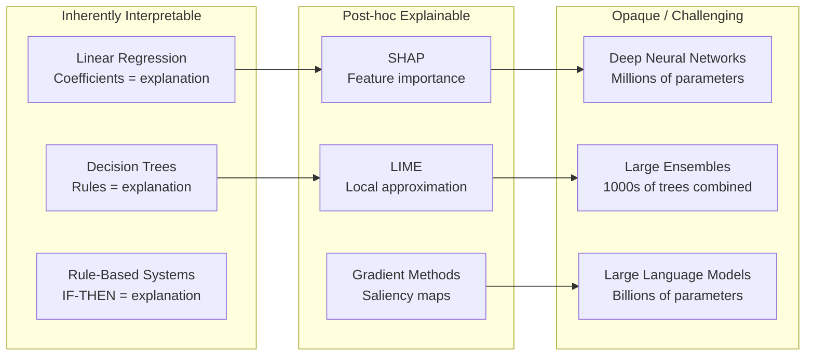
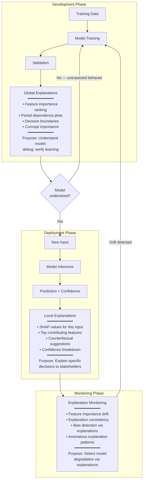

# Explainable AI (XAI) Standards & Methods

**Topic:** Explainability and interpretability of AI systems; DARPA XAI program; EU AI Act Article 13 transparency; explanation methods (SHAP, LIME, attention); ISO/IEC TR 24028; NIST explainability  
**Standards:** ISO/IEC TR 24028:2020, EU AI Act Art. 13, NIST SP 1270, IEEE 7001:2021, ISO/IEC 22989:2022  
**SDO:** ISO/IEC JTC 1/SC 42, NIST, IEEE-SA, European Commission  
**Audience:** ML engineers, AI architects, product managers, regulators, UX designers, compliance officers  
**Prerequisites:** Machine learning fundamentals, model architectures (trees, DNNs, transformers), statistical concepts, EU AI Act basics

---

## Chapter 1 — Historical Context & Origin Story

### 1.1 Timeline

| Year | Event | Significance |
|------|-------|-------------|
| 1980s | Expert systems with rule traces | Early explainability: IF-THEN rules are inherently interpretable |
| 2012 | Deep learning revolution | Shift to opaque models; performance vs. interpretability trade-off intensifies |
| 2016 | **LIME published** (Ribeiro et al.) | Local Interpretable Model-agnostic Explanations |
| 2016 | EU GDPR adopted (Art. 22) | "Right to meaningful information about logic involved" — legal impetus for XAI |
| 2017 | **DARPA XAI program** launched | $75M program; systematized XAI research |
| 2017 | **SHAP published** (Lundberg & Lee) | SHapley Additive exPlanations; game-theoretic foundation |
| 2018 | GDPR enforcement begins | Companies scramble for "right to explanation" compliance |
| 2020 | **ISO/IEC TR 24028** published | Trustworthiness in AI; includes interpretability taxonomy |
| 2020 | Attention-based explanations debate | "Attention is not Explanation" (Jain & Wallace) vs. "Attention is Explanation" debate |
| 2021 | **IEEE 7001:2021** | Transparency levels for autonomous systems |
| 2021 | **EU AI Act proposed** | Art. 13: Transparency for high-risk AI |
| 2023 | EU AI Act finalized | Art. 13 requirements confirmed; mandatory for high-risk systems |
| 2024 | Concept completeness methods | Beyond feature importance: concept-based explanations for complex models |
| 2024+ | LLM explainability | New challenge: explaining generative AI outputs; chain-of-thought as explanation |

### 1.2 The XAI Spectrum



---

## Chapter 2 — Regulatory & Standards Landscape

### 2.1 EU AI Act — Article 13: Transparency

| Requirement | Detail |
|:-----------:|--------|
| **Scope** | ALL high-risk AI systems (Annex III) |
| **Art. 13(1)** | "High-risk AI systems shall be designed and developed in such a way that their operation is sufficiently transparent to enable deployers to interpret the system's output and use it appropriately" |
| **Art. 13(2)** | Accompanied by instructions for use including: (a) characteristics, capabilities, limitations; (b) performance metrics and limitations; (c) foreseeable misuses and risks; (d) human oversight measures |
| **Art. 13(3)** | Information appropriate to nature of system; considering deployers' needs |
| **Key phrase** | "Interpret the system's output" — implies explanation capability |

### 2.2 ISO/IEC TR 24028:2020 — Trustworthiness in AI

| Aspect | Detail |
|--------|--------|
| **Type** | Technical Report (guidance) |
| **Section on explainability** | Defines interpretability, transparency, explainability as trust characteristics |
| **Taxonomy** | Distinguishes: inherent interpretability vs. post-hoc explainability; global vs. local; model-specific vs. model-agnostic |

### 2.3 NIST SP 1270 — Towards a Standard for Identifying and Managing Bias

| XAI-Related Content | Detail |
|:-:|---|
| Explainability for bias detection | Use explanation methods to identify biased features and decision patterns |
| Transparency for accountability | Stakeholders need to understand WHY a decision was made to detect unfairness |
| Explanation quality criteria | Meaningful, actionable, appropriate to audience |

---

## Chapter 3 — Technical Deep Dive: XAI Methods

### 3.1 Taxonomy of Explanation Methods

| Dimension | Categories |
|:---------:|-----------|
| **Scope** | Global (explain entire model behavior) vs. Local (explain single prediction) |
| **Model dependency** | Model-agnostic (any model) vs. Model-specific (e.g., tree-specific, gradient-based) |
| **Output type** | Feature importance; rules; examples; counterfactuals; concepts; natural language |
| **Timing** | Ante-hoc (build interpretable model) vs. Post-hoc (explain after training) |
| **Audience** | Technical (developers) vs. Non-technical (users, regulators) |

### 3.2 SHAP (SHapley Additive exPlanations)

| Aspect | Detail |
|--------|--------|
| **Foundation** | Shapley values from cooperative game theory (1953) |
| **Principle** | Each feature is a "player"; its contribution is the average marginal effect across all possible coalitions |
| **Properties** | (1) Local accuracy; (2) Missingness; (3) Consistency — ONLY method with all 3 (theoretical guarantee) |
| **Formula** | $\phi_i = \sum_{S \subseteq N \setminus \{i\}} \frac{|S|!(|N|-|S|-1)!}{|N|!} [f(S \cup \{i\}) - f(S)]$ |
| **Variants** | KernelSHAP (model-agnostic; sampling), TreeSHAP (exact for trees; O(TL²D)), DeepSHAP (approximation for DNNs), GradientSHAP |
| **Output** | Per-feature attribution for each prediction; sums to difference from base value |
| **Strengths** | Theoretically grounded; consistent; additive; local + global |
| **Weaknesses** | Expensive (exponential without approximation); assumes feature independence; can be slow for large models |

### 3.3 LIME (Local Interpretable Model-agnostic Explanations)

| Aspect | Detail |
|--------|--------|
| **Principle** | Approximate complex model LOCALLY with simple interpretable model (linear; decision tree) |
| **Process** | (1) Perturb input; (2) Get model predictions on perturbations; (3) Weight by proximity to original; (4) Fit interpretable model on (perturbation, prediction) pairs |
| **Output** | Feature importance for THIS specific prediction |
| **Strengths** | Model-agnostic; intuitive; fast; works for any model |
| **Weaknesses** | Instability (different runs → different explanations); kernel width choice arbitrary; no theoretical guarantees; can be unfaithful to true model behavior |

### 3.4 Gradient-Based Methods (for Neural Networks)

| Method | Approach | Quality |
|:------:|----------|:-------:|
| **Vanilla gradient** | $\frac{\partial f}{\partial x_i}$ | Simple; noisy; saturated gradients problem |
| **Gradient × Input** | $x_i \cdot \frac{\partial f}{\partial x_i}$ | Better signal; still noisy |
| **Integrated Gradients** | $\int_0^1 \frac{\partial f(x' + \alpha(x-x'))}{\partial x_i} d\alpha$ | Axiomatic (satisfies completeness + sensitivity); path integral |
| **SmoothGrad** | Average of gradients with noise-added inputs | Reduces noise; clearer visualizations |
| **Grad-CAM** | Gradients of class w.r.t. conv feature maps | Spatial localization for CNNs; coarse |
| **Layer-wise Relevance Propagation (LRP)** | Backpropagate relevance scores layer by layer | Decomposition; total relevance conserved |

### 3.5 Counterfactual Explanations

| Aspect | Detail |
|--------|--------|
| **Principle** | "What minimal change to input would change the decision?" |
| **Example** | "Your loan was denied. If your income were €5,000 higher OR your credit utilization were below 30%, the loan would be approved." |
| **Strengths** | Actionable; human-friendly; no model access needed (black-box); GDPR-friendly ("meaningful information about logic") |
| **Methods** | DiCE (Diverse Counterfactual Explanations); Wachter et al. (2017); FACE (Feasible Actionable Counterfactual Explanations) |
| **Challenges** | Multiple valid counterfactuals; feasibility (can the person actually change that feature?); causal validity |

---

## Chapter 4 — Implementation Guide

### 4.1 Choosing Explanation Methods

| Model Type | Recommended Primary | Recommended Secondary | Avoid |
|:----------:|:---:|:---:|:---:|
| **Linear/logistic regression** | Coefficients (inherent) | — | Over-engineering |
| **Decision tree / rule-based** | Tree structure (inherent) | Feature importance | — |
| **Random Forest / XGBoost** | TreeSHAP (exact, fast) | Feature importance; partial dependence | LIME (SHAP superior for trees) |
| **Deep neural network (tabular)** | DeepSHAP / KernelSHAP | Integrated Gradients; Counterfactuals | Vanilla gradient (noisy) |
| **CNN (image)** | Grad-CAM; Integrated Gradients | SHAP (pixel); LIME (superpixel) | Vanilla gradient |
| **Transformer (NLP)** | Attention weights (with caveats); Integrated Gradients | SHAP (token-level); LIME | Raw attention alone |
| **LLM (generative)** | Chain-of-thought; self-explanation | Attention visualization; probing | Treating CoT as faithful (may not be) |

### 4.2 Explanation Quality Criteria

| Criterion | Definition | How to Measure |
|:---------:|-----------|:-:|
| **Fidelity** | Does explanation accurately reflect model's reasoning? | Perturbation test: change important features → prediction should change |
| **Stability** | Same/similar inputs → same/similar explanations? | Run explanation multiple times; check variance; check on similar inputs |
| **Comprehensibility** | Can the audience understand it? | User studies; task completion time; decision accuracy with explanation |
| **Actionability** | Can the subject ACT on the explanation? | Does it suggest feasible changes? (Counterfactuals > feature importance) |
| **Completeness** | Does it cover all important factors? | Compare explanation features to true decision factors (if known) |
| **Compactness** | Is it concise enough to be useful? | Number of features shown; cognitive load assessment |

### 4.3 Implementation Architecture

```mermaid
flowchart LR
    subgraph "Model Inference"
        INPUT[Input Data]
        MODEL[ML Model]
        PRED[Prediction]
        INPUT --> MODEL --> PRED
    end
    
    subgraph "Explanation Layer"
        PRED --> EXPLAIN[Explanation Engine<br/>━━━━━━━━━━━<br/>• SHAP (default)<br/>• Counterfactuals<br/>• Feature importance<br/>• Attention (if applicable)]
        
        MODEL --> EXPLAIN
        INPUT --> EXPLAIN
    end
    
    subgraph "Audience Adaptation"
        EXPLAIN --> TECH[Technical Explanation<br/>━━━━━━━━━━━<br/>SHAP values; feature weights;<br/>confidence intervals; model metrics]
        
        EXPLAIN --> USER_EX[User Explanation<br/>━━━━━━━━━━━<br/>"Key factors in this decision:<br/>1. Your income (positive)<br/>2. Credit history (negative)<br/>3. Debt ratio (negative)"]
        
        EXPLAIN --> REG[Regulatory Explanation<br/>━━━━━━━━━━━<br/>Full audit trail; fairness metrics;<br/>data provenance; model validation]
        
        EXPLAIN --> CF[Counterfactual<br/>━━━━━━━━━━━<br/>"To change this decision,<br/>you would need to:<br/>• Reduce debt by €5K OR<br/>• Increase income by €10K"]
    end
```

---

## Chapter 5 — DARPA XAI Program

### 5.1 Program Overview

| Aspect | Detail |
|--------|--------|
| **Duration** | 2017-2021 ($75M+ funding) |
| **Goal** | Create AI systems that can explain their reasoning to human users |
| **Approach** | 11 research teams; 3 technical areas: interpretable models, explanation interfaces, psychological understanding |
| **Legacy** | Established XAI as a field; produced methods, evaluation frameworks, and user study methodologies |

### 5.2 DARPA XAI Technical Areas

| Area | Focus | Key Outputs |
|:----:|-------|-------------|
| **TA1: Modified ML** | Develop ML techniques that are inherently more interpretable without sacrificing accuracy | Attention mechanisms; concept-bottleneck models; self-explaining networks |
| **TA2: Explanation Interface** | Design interfaces that effectively communicate AI reasoning to humans | Explanation UX patterns; natural language generation from model internals; visual explanations |
| **TA3: Psychological Models** | Understand how humans process explanations; what makes explanation "good" | User study frameworks; cognitive load measurements; trust calibration metrics |

### 5.3 Key Findings

| Finding | Implication |
|:-------:|------------|
| Accuracy-interpretability trade-off is NOT always necessary | Well-designed interpretable models can match opaque ones in many domains |
| Users don't always want "more" explanation | Too much detail → cognitive overload → worse decisions |
| Trust calibration matters most | Users should trust AI appropriately — not over-trust, not under-trust |
| Explanation fidelity is testable | Can measure whether explanation matches actual model reasoning |
| Different users need different explanations | Developers, operators, affected individuals have different needs |

---

## Chapter 6 — Domain-Specific XAI Requirements

### 6.1 Sector-Specific Needs

| Domain | Explanation Need | Method | Regulatory Driver |
|:------:|---|---|:---:|
| **Healthcare** | Why did AI suggest this diagnosis? | Feature importance (which symptoms/tests); similar case examples; attention on medical image | EU MDR; FDA guidance on AI/ML SaMD |
| **Finance/Credit** | Why was loan denied? What can I change? | Counterfactual (actionable); top contributing factors | ECOA; GDPR Art. 22; EU AI Act |
| **Criminal justice** | Why was this risk score assigned? | Feature importance; comparison to similar cases; fairness audit | Due process; COMPAS controversy |
| **Autonomous driving** | Why did car brake/not brake? | Sensor visualization; object detection confidence; decision tree for action | ISO 21448 SOTIF; safety investigation |
| **HR/Recruitment** | Why was candidate rejected? | Top factors; counterfactual; bias audit | Employment discrimination law; EU AI Act high-risk |
| **Insurance** | Why this premium? | Feature contribution; comparison to peers; regulatory explanation | Insurance regulation; anti-discrimination |

### 6.2 Explanation for Safety Investigation

| Scenario | Required Explanation | Standard |
|:--------:|---|:---:|
| Vehicle accident | What did perception AI see/miss? Confidence at each timestep? Decision logic? | ISO 21448 SOTIF |
| Medical misdiagnosis | What features led to wrong conclusion? Was confidence appropriate? | IEC 62304 + regulatory guidance |
| Industrial safety incident | Did AI anomaly detection fire? Why/why not? What was confidence? | IEC 61508 / IEC TR 63317 |

---

## Chapter 7 — Comparison: XAI Methods

| Method | Scope | Model Dependency | Faithfulness | Speed | Comprehensibility | Theoretical Guarantee |
|:------:|:-----:|:---:|:---:|:---:|:---:|:---:|
| **SHAP** | Local + Global | Agnostic (+ tree-specific) | High | Moderate (exact) / Fast (tree) | Moderate | ✅ Shapley axioms |
| **LIME** | Local | Agnostic | Moderate (unstable) | Fast | High | ❌ None |
| **Integrated Gradients** | Local | Gradient models | High | Fast | Moderate | ✅ Completeness + Sensitivity |
| **Grad-CAM** | Local | CNN only | Moderate | Fast | High (visual) | ❌ Limited |
| **Counterfactuals** | Local | Agnostic | High (different angle) | Moderate | Very high | Varies by method |
| **Attention** | Local | Attention models | Debated (controversial) | Fast | Moderate | ❌ Contested |
| **Decision rules (ANCHORS)** | Local | Agnostic | High (within anchor) | Moderate | Very high | ✅ Precision guarantee |
| **PDP / ICE** | Global | Agnostic | High | Moderate | High | — |
| **Concept-based (TCAV)** | Global | DNN | High (concept level) | Moderate | Very high | Partial |

---

## Chapter 8 — Mermaid Architecture Diagrams

### 8.1 XAI in the AI Lifecycle



### 8.2 Multi-Stakeholder Explanation Architecture

```mermaid
graph TB
    PREDICTION[Model Prediction:<br/>Loan DENIED<br/>Score: 580 / 700 threshold]
    
    PREDICTION --> ENGINE[Explanation Engine]
    
    ENGINE --> DEV[Developer View<br/>━━━━━━━━━━━<br/>SHAP values: income=-0.3,<br/>debt_ratio=+0.4, credit_history=-0.2,<br/>employment_length=-0.1<br/>Confidence: 0.87<br/>Model: XGBoost v3.2<br/>Nearest decision boundary: 0.13]
    
    ENGINE --> APPLICANT[Applicant View<br/>━━━━━━━━━━━<br/>"Your application was not approved.<br/>Main factors:<br/>1. High debt-to-income ratio<br/>2. Short credit history<br/>What would help:<br/>• Reduce total debt by €8,000 OR<br/>• Wait 18 months (history length)"]
    
    ENGINE --> OFFICER[Loan Officer View<br/>━━━━━━━━━━━<br/>Score: 580 (threshold: 700)<br/>Top negative factors:<br/>• Debt ratio: 62% (max: 40%)<br/>• Credit age: 2.1 years (min: 3)<br/>• Recent inquiries: 5 (flag: >3)<br/>Confidence: HIGH<br/>Similar approved: 12% at this profile<br/>Override risk: ELEVATED]
    
    ENGINE --> REGULATOR[Regulator/Auditor View<br/>━━━━━━━━━━━<br/>Model: XGBoost 500 trees<br/>Features used: [22 features listed]<br/>Prohibited features: NONE used<br/>Proxy analysis: zip_code corr<br/>with race = 0.31 (monitor)<br/>Fairness audit: DPR = 0.82<br/>Denial rate by group: [table]<br/>SHAP consistency: stable (σ<0.02)]
```

---

## Chapter 9 — Case Studies

### 9.1 Healthcare: XAI for Clinical Decision Support

| Aspect | Detail |
|--------|--------|
| **System** | AI-assisted radiology: chest X-ray abnormality detection (pneumonia, nodules, fractures) |
| **Problem** | Radiologists wouldn't use AI without understanding WHY it flagged an image |
| **XAI implementation** | (1) Grad-CAM: heat map overlay on X-ray showing which regions drove the detection. (2) Confidence score: "87% confidence: pneumonia in right lower lobe." (3) Similar cases: show 3 most similar confirmed cases from training set. (4) Feature explanation: "Detection triggered by: consolidation pattern (contribution: 45%), air bronchograms (35%), pleural effusion (20%)." |
| **Outcome** | (1) Radiologist adoption increased from 23% to 78% (trust through understanding). (2) Disagreement resolution faster: when radiologist disagrees with AI, explanation helps identify if AI saw something radiologist missed (true positive) or if AI was confused by artifact (false positive). (3) Error reduction: combined human+AI with XAI → 12% fewer missed findings than either alone. (4) Training value: junior radiologists learned from AI explanations (educational benefit). |
| **Lessons** | Grad-CAM alone insufficient (shows WHERE, not WHY). Combination of spatial explanation + confidence + similar cases + feature description → effective. Explanation must match clinical reasoning language (medical concepts, not pixel values). |

### 9.2 Finance: GDPR Right to Explanation

| Aspect | Detail |
|--------|--------|
| **System** | Automated credit scoring for consumer loans (EU market; GDPR Art. 22 applies) |
| **Regulatory requirement** | "Right to meaningful information about the logic involved" + "right to obtain human intervention" |
| **Challenge** | Model is gradient-boosted ensemble (600 trees; 45 features) — opaque |
| **XAI solution** | (1) SHAP-based feature importance per decision (top 5 factors shown). (2) Counterfactual: "Your loan would be approved if [specific change]." (3) Automated adverse action notice generation (US ECOA equivalent adapted for EU). (4) Audit trail: every decision logged with SHAP values → regulators can audit. |
| **Implementation details** | TreeSHAP runs in <50ms per decision (production-viable). Top-5 factors generated and stored. Natural language generation: SHAP values → human-readable sentences. Counterfactual generated using DiCE (constrained to feasible changes; no "change your age" suggestions). |
| **Regulatory outcome** | Data Protection Authority (DPA) inspection: reviewed XAI system; accepted as meeting Art. 22 "meaningful information" requirement. Key factor: counterfactual explanations were specifically praised — "tells the data subject what they can DO." |

---

## Chapter 10 — Future Evolution

| Trend | Timeline | Impact |
|-------|----------|--------|
| **LLM self-explanation** | 2024-2027 | Chain-of-thought; faithful reasoning traces; mechanistic interpretability |
| **Concept-based explanations** | 2024-2026 | Move from "feature 47 is important" to "the concept of 'inflammation' drives this diagnosis" |
| **Causal explanations** | 2025-2028 | Go beyond correlation: explain CAUSAL mechanisms of decisions |
| **Formal XAI guarantees** | 2025-2028 | Provably faithful explanations; certified explanation fidelity |
| **Multimodal explanations** | 2024-2027 | Explain vision+language models; cross-modal attribution |
| **Real-time XAI** | 2024-2026 | Sub-millisecond explanations for safety-critical (autonomous driving) |
| **Standardized benchmarks** | 2025-2027 | ISO/IEC standards for XAI quality measurement; standardized evaluation |
| **Regulatory hardening** | 2025-2028 | EU AI Act enforcement → specific technical standards for "sufficient transparency" |

---

## Chapter 11 — Interview Questions & Career Guide

### Tier 1: Entry-Level

**Q1:** What is the difference between interpretability and explainability? Give examples of each.

**A:** **Interpretability** = the model itself is understandable (ante-hoc; built-in). **Explainability** = a separate method provides understanding of an opaque model (post-hoc; added after).

Interpretable models (you can read the logic directly):
- Linear regression: `prediction = 0.3*income + 0.5*credit_score - 0.2*debt`. You can READ the formula; coefficients directly tell you the relationship.
- Decision tree: IF income > 50K AND credit_score > 700 THEN approve. The tree IS the explanation.
- Rule lists: THEN-ELSE rules; logic is the model.

Explainable (opaque model + explanation method):
- Neural network + SHAP: NN is opaque (millions of weights); SHAP provides post-hoc feature importance for each prediction.
- XGBoost + LIME: 500-tree ensemble is not directly interpretable; LIME approximates it locally with a simple model.
- CNN + Grad-CAM: CNN image classifier is opaque; Grad-CAM highlights which image regions mattered.

Key distinction: Interpretable models don't NEED a separate explanation method — they ARE the explanation. Explainability is what you add WHEN you use an opaque model.

Trade-off (historical view): interpretable models were thought to be less accurate. DARPA XAI and recent research shows this is often false — well-designed interpretable models can match opaque ones for many tasks. The trade-off is more about complexity of learned representations than raw accuracy.

### Tier 2: Mid-Level

**Q2:** Compare SHAP and LIME. When would you choose one over the other?

**A:**

| Dimension | SHAP | LIME |
|:---------:|:----:|:----:|
| **Foundation** | Game theory (Shapley values; 1953) | Local linear approximation (perturbation sampling) |
| **Guarantee** | Satisfies 3 axioms: local accuracy, missingness, consistency | No theoretical guarantees |
| **Stability** | Deterministic (for TreeSHAP); more stable | Stochastic; different runs → different results |
| **Speed** | TreeSHAP: O(TL²D) exact and fast. KernelSHAP: O(2^n) → sampling | Generally fast (sampling-based) |
| **Scope** | Local explanations + aggregates to global | Local only (by design) |
| **Additivity** | ✅ SHAP values sum to prediction - base value | ❌ Not guaranteed to sum correctly |
| **Feature interaction** | SHAP interaction values available | Not natively |

**Choose SHAP when**: (1) Tree-based models (TreeSHAP is exact + fast; no reason to use LIME). (2) You need theoretical guarantees (regulatory context; need to justify why explanation is "correct"). (3) You need both local AND global explanations. (4) Feature interaction analysis needed. (5) Consistency matters (same input always gets same explanation).

**Choose LIME when**: (1) Model is very expensive to query (LIME needs fewer model calls than KernelSHAP for non-tree models). (2) You want explanation as RULES (LIME can use decision tree as local approximation → rules). (3) Rapid prototyping (LIME is simpler to implement). (4) The model type is unusual/exotic and SHAP has no optimized variant.

**In practice**: For tree models (XGBoost, Random Forest, LightGBM) → TreeSHAP dominates (faster, exact, theoretically grounded). For deep learning → Integrated Gradients or DeepSHAP (gradient access available). For true black-box API → KernelSHAP or LIME (both sampling-based; SHAP preferred for guarantees).

### Tier 3: Senior

**Q3:** Design an XAI system for a high-risk AI application under the EU AI Act. How do you ensure explanations are "sufficient" per Article 13? How do you validate explanation quality?

**A:**

**Context**: EU AI Act Art. 13 requires high-risk AI to be "sufficiently transparent to enable deployers to interpret the system's output and use it appropriately." No technical standard yet defines "sufficiently" — we must construct a defensible interpretation.

**Design framework: "Explanation Sufficiency Assessment"**

*Step 1: Define stakeholder explanation needs (per IEEE 7001 levels)*

| Stakeholder | What they need to interpret | Minimum level |
|:---:|---|:---:|
| Deployer (organization using AI) | System behavior; performance bounds; when NOT to trust; monitoring guidance | Level 2-3 |
| End user (affected individual) | Key factors; how to contest; what can change outcome | Level 2 |
| Human overseer (operator) | Confidence; anomalies; when to override; decision factors | Level 2-3 |
| Regulator (market surveillance) | Full model documentation; fairness evidence; validation results | Level 3-4 |

*Step 2: Technical implementation*

- **Layer 1 — Global model documentation**: Feature importance ranking; partial dependence plots; model card; performance by subgroup; known limitations. This satisfies Art. 13(2) "characteristics, capabilities, limitations."
- **Layer 2 — Per-prediction explanation**: SHAP top-5 factors + counterfactual ("what would change the outcome") + confidence with calibration. This satisfies "interpret the system's output."
- **Layer 3 — Audit infrastructure**: Full decision log with SHAP values; fairness metrics over time; explanation consistency metrics. This supports Art. 13 compliance demonstration.

*Step 3: Validate explanation quality (the hard part)*

(1) **Fidelity testing**: Remove the top-3 SHAP features → does prediction change significantly? If yes: explanation is faithful. If no: explanation is misleading. Metric: fidelity score = correlation between attributed importance and actual prediction change when feature removed. Target: fidelity > 0.85.

(2) **Stability testing**: Generate explanations for 1000 similar inputs (small perturbations). Measure variance of top-5 features. If variance is high → explanations are unreliable. Target: top-3 features consistent in >90% of near-neighbors.

(3) **User study validation**: Give human overseer explanation + ask them to predict model behavior on new input. If they can predict accurately → explanation enables understanding. Measure: human simulatability (can human predict model with explanation vs. without). Target: >80% correct prediction of model behavior with explanation.

(4) **Counterfactual validity**: Test counterfactuals by actually changing inputs per suggestion. Does prediction change as claimed? Metric: counterfactual accuracy = % of generated counterfactuals that actually flip prediction when applied. Target: >95%.

*Step 4: Documentation for compliance*

- Explanation methodology documented (SHAP v. X.Y; TreeSHAP variant; parameters)
- Fidelity test results (quantitative; per model version)
- User study results (human subjects; task-based evaluation)
- Monitoring: explanation quality metrics tracked in production

**"Sufficient" = defensible combination of**: documented methodology + quantitative fidelity evidence + user validation + ongoing monitoring. Until harmonized standards define exact thresholds, this demonstrates due diligence.

---

## Chapter 12 — Cheat Sheet & Quick Reference

```
═══════════════════════════════════════════
EXPLAINABLE AI (XAI) — QUICK REFERENCE
═══════════════════════════════════════════

INTERPRETABLE vs. EXPLAINABLE:
  Interpretable: Model IS the explanation (linear, tree, rules)
  Explainable:   Explanation added to opaque model (SHAP, LIME)

═══════════════════════════════════════════
TOP XAI METHODS — DECISION GUIDE:

  Tree models (XGBoost, RF):     → TreeSHAP (fast, exact)
  Deep learning (tabular):       → DeepSHAP or KernelSHAP
  CNN (images):                  → Grad-CAM + Integrated Gradients
  NLP (transformers):            → Integrated Gradients + Attention
  True black-box API:            → KernelSHAP or LIME
  User-facing explanation:       → Counterfactuals (actionable)
  Regulatory compliance:         → SHAP (axiomatic guarantees)

═══════════════════════════════════════════
SHAP vs. LIME:
  SHAP: Theoretically grounded; consistent; additive; stable
  LIME: Fast; intuitive; rule-based; but unstable; no guarantees
  
  Winner for most cases: SHAP (especially TreeSHAP for trees)

═══════════════════════════════════════════
EU AI ACT ART. 13 REQUIREMENTS:
  □ System capabilities & limitations documented
  □ Performance metrics & known failure modes
  □ Interpretable output (explain each decision)
  □ Foreseeable misuses & residual risks
  □ Human oversight measures specified

═══════════════════════════════════════════
EXPLANATION QUALITY METRICS:
  Fidelity:          Does explanation match real model reasoning?
  Stability:         Similar inputs → similar explanations?
  Comprehensibility: Can audience understand?
  Actionability:     Can subject act on it?
  Completeness:      All important factors covered?
  Compactness:       Concise enough to be useful?

═══════════════════════════════════════════
STAKEHOLDER-APPROPRIATE EXPLANATIONS:
  Developer:   Full SHAP values; model internals; debug info
  User:        Top 3 factors; plain language; what to change
  Operator:    Confidence; anomaly flags; override guidance
  Regulator:   Full audit trail; fairness; methodology; testing
  Affected:    Key factors; counterfactual; recourse options

═══════════════════════════════════════════
COMMON PITFALLS:
  ✗ "Attention is explanation" — contested; attention ≠ importance
  ✗ LIME instability — different runs give different answers
  ✗ SHAP assumes independence — interactions may be missed
  ✗ Explanation ≠ Justification — model may be "right" for wrong reasons
  ✗ Too much explanation — cognitive overload; worse decisions
  ✗ Unfaithful explanation — looks plausible but doesn't match model

═══════════════════════════════════════════
FORMULA — SHAPLEY VALUE:
  φᵢ = Σ [|S|!(|N|-|S|-1)! / |N|!] × [f(S∪{i}) - f(S)]
  
  Where: N = all features; S = subset without feature i
  Meaning: Average marginal contribution across all orderings
```

---

*End of Document — 07_Explainable_AI_XAI.md*
