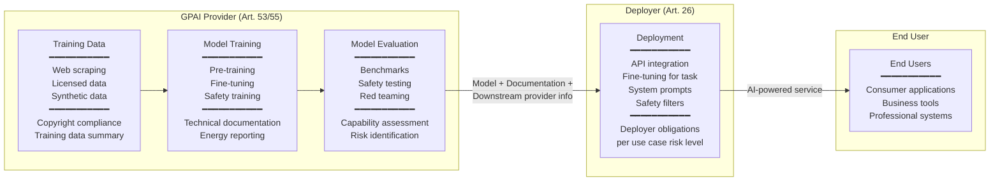

# Generative AI & General-Purpose AI (GPAI) Governance

**Topic:** Governance of generative AI; foundation models; EU AI Act Chapter V obligations for GPAI providers; NIST AI 600-1 (GenAI profile); model cards; systemic risk; frontier AI safety  
**Standards:** EU AI Act 2024 (Chapter V, VI), NIST AI 600-1 (Generative AI Profile), OECD GPAI principles, UK AI Safety Institute framework  
**SDO:** European Commission, NIST, OECD, UK AISI, G7 Hiroshima Process  
**Audience:** AI product managers, foundation model developers, compliance officers, policy advisors, CTO/CISO, AI governance teams  
**Prerequisites:** EU AI Act basics, ML/DL fundamentals, transformer architecture basics, AI governance concepts

---

## Chapter 1 — Historical Context & Origin Story

### 1.1 Timeline

| Year | Event | Significance |
|------|-------|-------------|
| 2017 | Transformer architecture ("Attention Is All You Need") | Foundation for all modern generative AI |
| 2018 | GPT-1 (117M parameters) | First large generative pre-trained transformer |
| 2019 | GPT-2 (1.5B); initial release withheld | First "too dangerous to release" discussion |
| 2020 | GPT-3 (175B); API access model | Demonstrated emergent capabilities; commercialization begins |
| 2021 | DALL-E; Codex (GitHub Copilot) | Generative AI enters image/code domains |
| 2022 | ChatGPT launch (Nov 30) | 100M users in 2 months; generative AI enters mainstream |
| 2022 | Stable Diffusion (open source) | Open-source image generation; governance debate intensifies |
| 2023 | GPT-4; Claude; Gemini; Llama 2 | Frontier model competition; capabilities accelerate |
| 2023 | **EU AI Act finalized** (includes GPAI provisions) | First binding law on foundation models |
| 2023 | G7 Hiroshima Process on GenAI | International voluntary code of conduct for AI developers |
| 2023 | UK AI Safety Summit (Bletchley Park) | 28 countries; frontier AI safety commitments |
| 2024 | **NIST AI 600-1** published | Generative AI risk profile (companion to AI RMF) |
| 2024 | EU AI Office established | Enforces GPAI provisions of AI Act |
| 2024 | OpenAI o1; Claude 3.5; Gemini 2 | Reasoning models; multimodal; AI agents |
| 2025 | EU AI Act GPAI provisions apply (Aug 2025) | Compliance deadline for GPAI providers |

### 1.2 Why GPAI Needs Special Governance

| Traditional AI | GPAI / Foundation Models |
|:---:|---|
| Built for ONE task (spam detection, fraud scoring) | Trained for GENERAL capability; adapted to many tasks |
| Deployer controls use case | Provider cannot predict all downstream uses |
| Risk assessable (known application context) | Risk indeterminate at training time (unknown applications) |
| Limited reach (deployed in one system) | Potentially millions of downstream applications |
| Provider = Deployer (often same organization) | Provider ≠ Deployer; value chain separated |
| Specific data for specific task | Trained on internet-scale data; copyright, bias, privacy issues |

---

## Chapter 2 — EU AI Act — GPAI Provisions (Chapter V)

### 2.1 Structure

| Section | Content |
|:-------:|---------|
| **Chapter V, Section 1** | Classification rules for GPAI models |
| **Chapter V, Section 2** | Obligations for ALL GPAI providers |
| **Chapter V, Section 3** | Additional obligations for GPAI with SYSTEMIC RISK |
| **Chapter VI** | Codes of Practice (voluntary → mandatory compliance pathway) |

### 2.2 GPAI Classification

```mermaid
graph TD
    GPAI[Is it a General-Purpose AI Model?<br/>━━━━━━━━━━━<br/>Trained with broad data;<br/>capable of performing<br/>a wide range of distinct tasks]
    
    GPAI -->|"Yes"| BASE[All GPAI Obligations<br/>Art. 53<br/>━━━━━━━━━━━<br/>Technical documentation<br/>Information for downstream<br/>Copyright compliance<br/>Training data summary]
    
    BASE --> SYSTEMIC{Systemic Risk?<br/>━━━━━━━━━━━<br/>Cumulative compute<br/>> 10²⁵ FLOPs<br/>OR designated by<br/>EU Commission}
    
    SYSTEMIC -->|"Yes (>10²⁵ FLOPs)"| HIGH[GPAI with Systemic Risk<br/>Art. 55<br/>━━━━━━━━━━━<br/>All base obligations PLUS:<br/>• Model evaluation<br/>• Adversarial testing<br/>• Incident reporting<br/>• Cybersecurity measures<br/>• Energy consumption reporting]
    
    SYSTEMIC -->|"No"| STANDARD[Standard GPAI<br/>Base obligations only]
    
    BASE --> OPEN{Open-source?}
    OPEN -->|"Yes (non-systemic)"| EXEMPT[Reduced obligations<br/>━━━━━━━━━━━<br/>Only: training data summary<br/>+ copyright compliance<br/>(UNLESS systemic risk)]
    OPEN -->|"No"| FULL[Full obligations apply]
```

### 2.3 Obligations for ALL GPAI Providers (Art. 53)

| Obligation | Detail | Purpose |
|:----------:|--------|:-------:|
| **Technical documentation** | Maintain up-to-date documentation of model: architecture, training process, evaluation results | Transparency; regulatory oversight |
| **Information to downstream providers** | Provide information enabling deployers to comply with AI Act obligations for their high-risk systems | Enable value chain compliance |
| **Copyright compliance** | Comply with EU copyright law; implement state-of-the-art approaches to identify and respect opt-outs (e.g., robots.txt for training data) | Creator rights |
| **Training data summary** | Publish sufficiently detailed summary of training data content | Public transparency; copyright verification |

### 2.4 Additional Obligations — Systemic Risk (Art. 55)

| Obligation | Detail | Rationale |
|:----------:|--------|:---------:|
| **Model evaluation** | Perform standardized model evaluations (including adversarial testing) per state of the art | Identify capability and safety limitations |
| **Risk assessment & mitigation** | Assess and mitigate systemic risks (including cross-border, societal-level risks) | Prevent large-scale harm |
| **Incident tracking & reporting** | Track, document, and report serious incidents to EU AI Office | Regulatory awareness; rapid response |
| **Cybersecurity** | Ensure adequate level of cybersecurity protection for model and physical infrastructure | Prevent model compromise; protect weights |
| **Energy consumption** | Report energy consumption of training and inference | Environmental transparency |

### 2.5 The 10²⁵ FLOP Threshold

| Model | Estimated Training Compute | Classification |
|:-----:|:-:|:---:|
| GPT-3 (175B) | ~3.6 × 10²³ FLOPs | Standard GPAI |
| Llama 2 (70B) | ~1.7 × 10²⁴ FLOPs | Standard GPAI |
| GPT-4 (estimated) | ~10²⁵ FLOPs | **Systemic risk** threshold |
| Gemini Ultra | >10²⁵ FLOPs (estimated) | **Systemic risk** |
| Claude 3.5 Opus | Likely near threshold | Potentially systemic risk |
| Future frontier models | >>10²⁵ FLOPs | All systemic risk |

---

## Chapter 3 — NIST AI 600-1: Generative AI Risk Profile

### 3.1 Overview

| Aspect | Detail |
|--------|--------|
| **Title** | Artificial Intelligence Risk Management Framework: Generative AI Profile |
| **Relationship** | Companion document to NIST AI RMF 1.0; applies AI RMF specifically to GenAI |
| **Purpose** | Identify unique risks of generative AI; map to AI RMF functions (GOVERN, MAP, MEASURE, MANAGE) |
| **Published** | July 2024 |

### 3.2 GenAI-Specific Risks (NIST AI 600-1)

| Risk Category | Description | Examples |
|:---:|---|---|
| **CBRN Information** | AI provides information enabling chemical, biological, radiological, or nuclear weapon development | Step-by-step synthesis instructions; proliferation-relevant knowledge |
| **Confabulation** | Model generates false information presented as factual (hallucination) | Fake legal citations; fabricated scientific studies; invented facts |
| **Data Privacy** | Training data memorization; PII leakage; inference of private information | Model outputs verbatim training data; reveals personal information |
| **Environmental** | Energy consumption of training and inference; carbon footprint | Single GPT-4 training estimated at 5,000-10,000 tons CO2 |
| **Human-AI Configuration** | Over-reliance on AI; automation bias; loss of human judgment | Humans accepting AI output without verification; skill atrophy |
| **Information Integrity** | Disinformation, deepfakes, manipulation of information ecosystem | AI-generated fake news at scale; synthetic media manipulation |
| **Information Security** | AI-assisted cyberattacks; vulnerability discovery; social engineering | AI-generated phishing; automated exploit generation |
| **Intellectual Property** | Copyright infringement in training/output; style copying; attribution | Model outputs near-copies of copyrighted works |
| **Obscene/Degrading Content** | Generation of harmful, abusive, or CSAM content | Bypassed safety filters; misuse for harm |
| **Toxicity/Bias/Homogenization** | Perpetuation of biases; toxic content; cultural homogenization | AI reinforcing stereotypes; monoculture in AI-generated content |
| **Value Chain Risks** | Downstream misuse; fine-tuning for harm; integration failures | Open model weaponized; fine-tuned to remove safety |

### 3.3 Mapping to AI RMF Functions

| AI RMF Function | GenAI Application |
|:---:|---|
| **GOVERN** | AI governance policies specific to GenAI: acceptable use policies; model release decisions; red-teaming requirements; incident response for GenAI |
| **MAP** | Map GenAI context: who uses model? How? What downstream applications? What populations affected? What content generated? |
| **MEASURE** | Evaluate GenAI risks: benchmark model against harm categories; measure hallucination rates; evaluate safety filter effectiveness; test for bias |
| **MANAGE** | Mitigate risks: safety training (RLHF/Constitutional AI); content filters; rate limiting; monitoring; incident response; model updates |

---

## Chapter 4 — Implementation Guide: GPAI Compliance

### 4.1 EU AI Act GPAI Compliance Roadmap

| Phase | Timeline | Activities |
|:-----:|:--------:|-----------|
| **Assessment** | Now - Q1 2025 | Determine if model is GPAI; assess systemic risk threshold; gap analysis against Art. 53/55 |
| **Documentation** | Q1-Q2 2025 | Create/update technical documentation; training data summary; downstream provider information package |
| **Evaluation** | Q2-Q3 2025 (systemic risk) | Implement model evaluations; adversarial testing; capability assessments per codes of practice |
| **Compliance** | Aug 2, 2025 | Full compliance with GPAI obligations required |
| **Ongoing** | Post-compliance | Maintain documentation; respond to incidents; participate in codes of practice; annual review |

### 4.2 Technical Documentation Requirements

| Category | Required Information |
|:--------:|---|
| **Model description** | Architecture; parameters; training methodology; intended tasks; known limitations |
| **Training details** | Data sources (summary); preprocessing; fine-tuning; optimization approach; compute used |
| **Evaluation** | Benchmarks; safety evaluations; bias assessments; capability tests; red team findings |
| **Safety measures** | RLHF/safety training; content filters; system prompts; monitoring; incident response |
| **Known risks** | Identified risks; risk mitigations; residual risks; intended mitigation by deployers |
| **Energy** | Training energy consumption; inference energy per query (estimated); carbon footprint |

### 4.3 Model Card Template (for Downstream Providers)

```
┌─────────────────────────────────────────────┐
│          MODEL CARD (EU AI Act Art. 53)       │
├─────────────────────────────────────────────┤
│ Model Name:           [Name + Version]        │
│ Provider:             [Legal entity]          │
│ Release Date:         [Date]                  │
│ Model Type:           [Architecture]          │
│ Parameters:           [Count]                 │
│ Training Compute:     [FLOPs]                 │
│ Systemic Risk:        [Yes/No]                │
├─────────────────────────────────────────────┤
│ INTENDED USES                                 │
│ • [List of intended applications]             │
│ • [Supported tasks]                           │
│ • [Intended audience]                         │
├─────────────────────────────────────────────┤
│ LIMITATIONS & RISKS                           │
│ • [Known failure modes]                       │
│ • [Bias characteristics]                      │
│ • [Hallucination rates per domain]            │
│ • [Unsafe content generation risk]            │
│ • [Not suitable for: ...]                     │
├─────────────────────────────────────────────┤
│ DEPLOYER OBLIGATIONS                          │
│ • Required safety measures for high-risk use  │
│ • Human oversight requirements                │
│ • Content filtering recommendations           │
│ • Monitoring requirements                     │
├─────────────────────────────────────────────┤
│ EVALUATION RESULTS                            │
│ • [Benchmark scores]                          │
│ • [Safety evaluation results]                 │
│ • [Red team findings summary]                 │
│ • [Bias audit results]                        │
├─────────────────────────────────────────────┤
│ TRAINING DATA SUMMARY                         │
│ • [Data source categories]                    │
│ • [Filtering/curation approach]               │
│ • [Copyright compliance measures]             │
│ • [Opt-out mechanisms honored]                │
└─────────────────────────────────────────────┘
```

---

## Chapter 5 — Codes of Practice & International Coordination

### 5.1 EU AI Act Codes of Practice (Art. 56)

| Aspect | Detail |
|--------|--------|
| **Purpose** | Provide detailed guidance on how to comply with Art. 53-55; developed collaboratively with industry |
| **Legal status** | Voluntary; but compliance with code = PRESUMPTION of conformity (safe harbor) |
| **Development** | EU AI Office coordinates; industry + civil society + academia participate |
| **Timeline** | First codes expected Q3-Q4 2025; iterative development |
| **If no code followed** | Provider must demonstrate alternative equivalent compliance (harder) |

### 5.2 G7 Hiroshima AI Process

| Commitment | Detail |
|:---:|---|
| **Code of Conduct** | Voluntary commitments for organizations developing frontier AI |
| **Key principles** | (1) Identify risks before/during/after deployment. (2) Invest in safety research. (3) Share safety information. (4) Report vulnerabilities. (5) Watermark AI-generated content. (6) Prioritize safety, security, societal trust. |
| **Participants** | G7 nations + leading AI companies (voluntary) |
| **Relationship to EU AI Act** | Non-binding; but aligns with EU AI Act spirit; may inform codes of practice |

### 5.3 International Coordination Landscape

| Initiative | Region | Scope | Legal Force |
|:---:|:---:|---|:---:|
| EU AI Act Ch. V-VI | EU | GPAI obligations + systemic risk | Binding (regulation) |
| G7 Hiroshima Process | G7 | Voluntary code for frontier AI | Non-binding |
| UK AI Safety Institute | UK | Frontier model evaluation | Non-binding |
| NIST AI 600-1 | US | GenAI risk profile | Guidance |
| Bletchley Declaration | 28 countries | Frontier AI safety commitment | Political declaration |
| Seoul AI Summit | International | Frontier AI safety commitments | Political + voluntary |
| OECD AI Principles (updated) | OECD | GenAI governance principles | Recommendation |
| China GenAI Measures | China | Generative AI regulation | Binding (national) |

---

## Chapter 6 — GenAI-Specific Risk Management

### 6.1 Hallucination/Confabulation Management

| Strategy | Mechanism | Effectiveness |
|:--------:|-----------|:---:|
| **RAG (Retrieval-Augmented Generation)** | Ground responses in retrieved documents | High (when retrieval quality high) |
| **Confidence calibration** | Train model to express uncertainty appropriately | Medium (LLMs poorly calibrated) |
| **Citation/attribution** | Require model to cite sources | Medium (can fabricate citations) |
| **Fact-checking layer** | Post-generation verification against knowledge base | High (adds latency + complexity) |
| **Domain restriction** | Limit model to specific knowledge domain; refuse out-of-domain | Medium-High |
| **Human-in-the-loop** | All outputs reviewed before use (high-stakes applications) | High (but expensive) |

### 6.2 Content Safety Architecture

```mermaid
flowchart TD
    USER[User Input]
    
    USER --> INPUT_FILTER[Input Safety Filter<br/>━━━━━━━━━━━<br/>• Harmful intent detection<br/>• Jailbreak attempt detection<br/>• CSAM/exploitation queries<br/>• Personal data in prompts<br/>• Copyright-infringing requests]
    
    INPUT_FILTER -->|"Blocked"| REFUSE[Refuse + Log]
    INPUT_FILTER -->|"Allowed"| MODEL[Foundation Model<br/>(with safety training)]
    
    MODEL --> OUTPUT[Raw Output]
    
    OUTPUT --> OUTPUT_FILTER[Output Safety Filter<br/>━━━━━━━━━━━<br/>• Harmful content detection<br/>• PII detection + redaction<br/>• Copyright content detection<br/>• Hallucination check (optional)<br/>• Bias/toxicity scoring]
    
    OUTPUT_FILTER -->|"Safe"| DELIVER[Deliver to User]
    OUTPUT_FILTER -->|"Unsafe"| MODIFY[Modify/Refuse + Log]
    
    DELIVER --> MONITOR[Usage Monitoring<br/>━━━━━━━━━━━<br/>• Aggregate misuse patterns<br/>• Abuse detection<br/>• Feedback collection<br/>• Incident reporting trigger]
```

---

## Chapter 7 — Comparison: GPAI Governance Approaches

| Dimension | EU AI Act (GPAI) | NIST AI 600-1 | G7 Code of Conduct | China GenAI Measures |
|:---------:|:---:|:---:|:---:|:---:|
| **Legal force** | Binding regulation | Voluntary guidance | Voluntary commitment | Binding regulation |
| **Scope** | GPAI models placed on EU market | GenAI in US context | Frontier AI globally | GenAI services in China |
| **Classification** | Standard vs. Systemic risk (10²⁵ FLOPs) | Risk-based (no threshold) | Frontier models (capability-based) | All GenAI services |
| **Key obligation** | Documentation; downstream info; copyright; (systemic: evaluation + incident reporting) | Risk management per AI RMF functions | Safety investment; information sharing; watermarking | Content review; algorithm filing; data compliance |
| **Open source** | Exempted (unless systemic risk) | Not differentiated | Not differentiated | Same obligations apply |
| **Enforcement** | EU AI Office; fines up to €35M / 7% revenue | None (guidance) | Peer pressure; reputational | CAC enforcement; service suspension |
| **Compliance date** | Aug 2, 2025 | Immediate (guidance) | Voluntary (ongoing) | Already in force |
| **Innovation impact** | Moderate (exempts open source; proportionate) | Low (non-binding) | Low (voluntary) | High (pre-approval requirements) |

---

## Chapter 8 — Mermaid Architecture Diagrams

### 8.1 GPAI Value Chain



### 8.2 Systemic Risk Assessment

```mermaid
flowchart TD
    MODEL[Foundation Model]
    
    MODEL --> COMPUTE{Training compute<br/>> 10²⁵ FLOPs?}
    
    COMPUTE -->|"Yes"| SYSTEMIC[Automatically Systemic Risk<br/>━━━━━━━━━━━<br/>Full Art. 55 obligations<br/>UNLESS demonstrate<br/>no systemic risk capability]
    
    COMPUTE -->|"No"| CAPABILITY{High-impact<br/>capabilities?<br/>━━━━━━━━━━━<br/>• Reach: wide downstream use<br/>• Capability: state-of-the-art<br/>• Autonomy: minimal oversight<br/>• Societal impact potential}
    
    CAPABILITY -->|"Designated by<br/>EU Commission"| SYSTEMIC
    CAPABILITY -->|"No"| STANDARD[Standard GPAI<br/>Art. 53 only]
    
    SYSTEMIC --> OBLIGATIONS[Systemic Risk Obligations<br/>━━━━━━━━━━━<br/>□ Model evaluation (standardized)<br/>□ Adversarial testing (red team)<br/>□ Systemic risk assessment<br/>□ Risk mitigation measures<br/>□ Incident tracking & reporting<br/>□ Cybersecurity (model protection)<br/>□ Energy consumption reporting]
```

---

## Chapter 9 — Case Studies

### 9.1 Foundation Model Provider: EU AI Act Compliance Program

| Aspect | Detail |
|--------|--------|
| **Organization** | Large foundation model provider (>10²⁵ FLOPs training compute; systemic risk classification) |
| **Challenge** | Achieve full EU AI Act GPAI compliance by Aug 2, 2025 |
| **Compliance program** | **Phase 1 (Documentation)**: (1) Model card per Art. 53 requirements (architecture, training, evaluation, limitations). (2) Training data summary: categories of data sources, filtering methodology, opt-out compliance (robots.txt + do-not-train headers). (3) Downstream provider information package: capabilities, limitations, required safety measures per use case. |
| | **Phase 2 (Evaluation — systemic risk)**: (1) Standardized evaluations: BBQ (bias), ToxiGen (toxicity), HHH (helpfulness/harmlessness/honesty), custom frontier capability tests. (2) Red team program: internal team + external researchers; quarterly adversarial assessments; 200+ red teamers across domains (biosecurity, cybersecurity, CBRN, persuasion). (3) Systemic risk scenarios: election manipulation capability; mass deception; critical infrastructure vulnerabilities; scientific misuse. |
| | **Phase 3 (Ongoing compliance)**: (1) Incident reporting: defined "serious incident" criteria; 72-hour reporting to EU AI Office. (2) Cybersecurity: model weights classified as critical asset; zero-trust architecture around training infrastructure; insider threat program. (3) Energy: measured training compute energy (X GWh); inference energy per 1M tokens; published in sustainability report. |
| **Investment** | €15M compliance program; 40 FTE dedicated; 18 months preparation |
| **Key challenge** | "Training data summary" — determining exactly what's in internet-scale training data; copyright compliance across 20+ jurisdictions |

### 9.2 SME Deployer: Using GPAI in High-Risk Application

| Aspect | Detail |
|--------|--------|
| **Organization** | Healthcare SaaS company; integrates GPT-4 (GPAI) into clinical decision support tool |
| **Regulatory position** | They are a DEPLOYER of GPAI; their application is HIGH-RISK (healthcare AI in Annex III) |
| **Challenge** | Must comply with Art. 26 (deployer obligations) for high-risk system, even though underlying model is from a third-party GPAI provider |
| **Compliance approach** | (1) **From GPAI provider**: Obtained Art. 53 documentation; model card; known limitations; required safety measures for healthcare use. (2) **Own obligations** (Art. 26): Implemented human oversight (clinician ALWAYS reviews before action); defined use case scope (only differential diagnosis suggestion; never treatment decisions); safety filters (medical-specific content filtering; hallucination detection via medical knowledge graph cross-check); monitoring (tracked hallucination rate; false suggestion rate; clinician override rate). (3) **Conformity assessment**: Since underlying GPAI cannot be fully assessed by deployer → reliance on GPAI provider documentation + own testing in healthcare context. |
| **Key insight** | EU AI Act separates GPAI provider obligations (Art. 53/55) from deployer obligations (Art. 26). Deployer can build high-risk system on GPAI IF: provider gives adequate documentation AND deployer adds appropriate risk management for their specific use case. |

---

## Chapter 10 — Future Evolution

| Trend | Timeline | Impact |
|-------|----------|--------|
| **EU AI Office enforcement** | 2025-2026 | First enforcement actions on GPAI providers; precedents set |
| **Codes of Practice v1.0** | 2025 | Detailed compliance guidance; industry norms established |
| **Compute threshold revision** | 2026-2028 | 10²⁵ FLOPs threshold may be revised as models become more efficient |
| **Multimodal governance** | 2025-2027 | Standards for models that generate image+text+video+audio |
| **AI agents governance** | 2025-2028 | Autonomous agents using GPAI; new liability and oversight challenges |
| **Open source vs. closed debate** | 2025-2027 | Tensions between open model benefits and systemic risk concerns |
| **Global convergence** | 2026-2030 | International alignment on GPAI governance principles (or fragmentation) |
| **Frontier AI safety standards** | 2025-2028 | ISO/IEC standards for frontier model evaluation and safety |
| **Watermarking/provenance** | 2025-2027 | Technical standards for AI content identification (C2PA, watermarks) |

---

## Chapter 11 — Interview Questions & Career Guide

### Tier 1: Entry-Level

**Q1:** What is a "General-Purpose AI model" under the EU AI Act? How is it different from a traditional AI system?

**A:** A **General-Purpose AI (GPAI) model** is an AI model that: (1) is trained with a large amount of data using self-supervision at scale; (2) displays significant generality; (3) is capable of competently performing a wide range of distinct tasks; (4) can be integrated into a variety of downstream systems or applications.

Key difference from traditional AI:

| Traditional AI | GPAI |
|:---:|---|
| **Single task**: Spam detector, fraud scorer, image classifier | **Many tasks**: Summarization, code, translation, reasoning, creative writing |
| **Known use case**: Developer builds FOR a specific application | **Unknown use case**: Provider trains general model; deployers adapt to their applications |
| **Risk assessable**: You know what it'll be used for → can assess risks | **Risk uncertain**: Provider doesn't know all downstream uses → cannot fully assess risk at training time |
| **One deployer**: Built and used within one organization | **Many deployers**: One GPAI model → thousands of downstream applications |

Why separate rules? Because GPAI creates a VALUE CHAIN problem: the model provider makes the foundational technology, but cannot control (or even know) all ways it'll be used. The EU AI Act therefore creates LAYERED obligations: GPAI provider must give documentation + safety information → downstream deployer must manage risks specific to their application.

Example: OpenAI trains GPT-4 (GPAI provider → Art. 53/55 obligations). A healthcare startup uses GPT-4 in clinical decision support (deployer → Art. 26 high-risk obligations). A marketing firm uses GPT-4 for ad copy (deployer → minimal-risk obligations). Same GPAI model, different use cases, different risk levels for deployers.

### Tier 2: Mid-Level

**Q2:** Explain the "systemic risk" concept in the EU AI Act for GPAI. Why is the threshold 10²⁵ FLOPs? What obligations does it trigger?

**A:** **Systemic risk** in the EU AI Act context means a GPAI model has capabilities that could pose risks affecting not just individual users but SOCIETY broadly — including risks to public health, safety, public security, fundamental rights, or the functioning of society and economy.

**Why 10²⁵ FLOPs?** The threshold is a PROXY for model capability. The reasoning: (1) More compute in training → generally more capable model (scaling laws: Chinchilla, Kaplan et al.). (2) More capable models → higher potential for systemic harm (can be used for more impactful misuse). (3) A quantitative threshold creates legal certainty (objective measurement vs. subjective "dangerous enough"). (4) 10²⁵ FLOPs ≈ GPT-4 class models — the level at which frontier capabilities emerged that caused widespread governance concern.

**Limitations of the threshold**: (1) Doesn't capture efficiency improvements (future model trained with 10²⁴ FLOPs could be as capable as today's 10²⁵ model). (2) Open-source models: Llama 3 405B may be near threshold with less compute due to better data/architecture. (3) That's why the Act also allows Commission to DESIGNATE models as systemic risk based on capabilities (regardless of compute).

**Additional obligations (Art. 55) triggered:**

(1) **Model evaluation**: Must perform STANDARDIZED evaluations — not just your own benchmarks but recognized safety evaluations. This means adversarial testing (red teaming), capability assessments (CBRN uplift, cyber, persuasion), safety benchmarks (bias, toxicity).

(2) **Systemic risk assessment**: Go beyond the model itself — assess risks to SOCIETY. Could this model be used to manipulate elections? Generate bioweapon instructions? Automate large-scale scams? If yes → what mitigations?

(3) **Incident reporting**: If something goes wrong (model causes serious incident) → must report to EU AI Office within defined timeframe. Requires incident tracking system.

(4) **Cybersecurity**: Model weights are critical asset. If frontier model weights leaked → could be misused without safety measures. Must have adequate cybersecurity for model infrastructure.

(5) **Energy reporting**: Transparency about environmental impact.

### Tier 3: Senior

**Q3:** You're the AI governance lead at a foundation model company approaching the 10²⁵ FLOP threshold. Design a systemic risk management program that satisfies EU AI Act Art. 55 and anticipates future regulatory evolution.

**A:**

**Systemic Risk Management Program Architecture:**

*1. Risk Identification (Proactive)*

- **Capability assessments** (pre-release): Evaluate each model version against risk domains:
  - CBRN: Can the model provide uplift for weapon development? (compared to freely available information)
  - Cyber: Can the model discover novel vulnerabilities or generate functional exploits beyond existing tools?
  - Persuasion/Manipulation: Can the model generate deceptive content indistinguishable from human-written?
  - Self-replication/Autonomy: Can the model take autonomous actions that undermine oversight?
  - Societal manipulation: At scale, could use of this model distort elections, markets, or public discourse?

- **Methodology**: Pre-defined evaluations (quantitative); red team exercises (qualitative); external evaluator access (independent); structured scenario analysis

*2. Evaluation Framework (Art. 55 Compliance)*

| Evaluation Type | Frequency | Who | What |
|:---:|:---:|:---:|---|
| Benchmark suite | Every model version | Internal | Standardized safety benchmarks (BBQ, ToxiGen, MT-Bench, custom frontier evals) |
| Red team (internal) | Continuous | Internal red team (50+ people) | Adversarial testing across all risk categories |
| Red team (external) | Quarterly | External researchers, domain experts | Independent adversarial assessment; fresh perspectives |
| Capability elicitation | Pre-release | Specialist teams | Specifically probe for dangerous capabilities (biology, cyber, etc.) |
| Structural testing | Pre-release | Safety team | Model behavior under edge cases; prompt injection resistance; safety filter robustness |
| Societal impact | Semi-annual | External researchers + civil society | Broader impact assessment; deployment effects monitoring |

*3. Risk Mitigation Measures*

- **Technical**: Safety training (RLHF + Constitutional AI); capability restriction (refuse dangerous queries); output filtering; monitoring systems
- **Operational**: Staged release (limited access → broader access based on safety evidence); use-case restriction (API terms); customer vetting for sensitive capabilities
- **Governance**: Internal safety review board with veto power over releases; clear "red lines" that block deployment; safety case requirement before release

*4. Incident Management*

- **Definition of "serious incident"** (mapped to Art. 55): Model causes or contributes to death/serious harm; model used for large-scale fraud/deception affecting >1000 people; model outputs cause market disruption; model compromise (weights exfiltrated)
- **Response SLA**: Detection → classification (4 hours) → EU AI Office notification (72 hours for serious incidents) → public disclosure (appropriate timing) → remediation (model update/restriction)
- **Tracking**: All incidents logged regardless of severity; trend analysis; quarterly reporting to board

*5. Future-Proofing*

- **Scalable evaluation**: Automated red teaming that scales with model capabilities (can't rely on human-only testing as models get more capable)
- **External audit readiness**: Prepare for mandatory third-party audits (likely in future EU AI Act revisions)
- **International alignment**: Track UK AISI, US NIST, Japan, Korea requirements; design compliance program to satisfy multiple jurisdictions
- **Capability trigger**: Internal thresholds BELOW regulatory threshold — if model exceeds internal capability benchmark → trigger enhanced review BEFORE it would trigger regulatory scrutiny

---

## Chapter 12 — Cheat Sheet & Quick Reference

```
═══════════════════════════════════════════
GENERATIVE AI / GPAI GOVERNANCE — QUICK REF
═══════════════════════════════════════════

GPAI = General-Purpose AI Model:
  • Broad training (self-supervision at scale)
  • Significant generality
  • Many distinct tasks
  • Many downstream applications
  Examples: GPT-4, Claude, Gemini, Llama

═══════════════════════════════════════════
EU AI ACT — GPAI OBLIGATIONS:

ALL GPAI (Art. 53):
  □ Technical documentation (architecture, training, eval)
  □ Information to downstream providers
  □ Copyright compliance (training data)
  □ Training data summary (public)

SYSTEMIC RISK GPAI (Art. 55) — ABOVE + :
  □ Model evaluation (standardized + adversarial)
  □ Systemic risk assessment & mitigation
  □ Incident tracking & reporting to EU AI Office
  □ Cybersecurity (model weight protection)
  □ Energy consumption reporting

OPEN SOURCE EXEMPTION:
  Non-systemic + open source → reduced obligations
  (only training data summary + copyright)
  Systemic risk → NO exemption for open source

═══════════════════════════════════════════
SYSTEMIC RISK THRESHOLD:
  Training compute > 10²⁵ FLOPs = automatic
  OR: EU Commission designation (capability-based)
  
  GPT-3 (175B): ~3.6×10²³ → NOT systemic
  GPT-4 (estimated): ~10²⁵ → SYSTEMIC threshold
  Future frontier: >>10²⁵ → All systemic

═══════════════════════════════════════════
NIST AI 600-1 GENAI RISKS:
  • CBRN information provision
  • Confabulation (hallucination)
  • Data privacy (memorization, leakage)
  • Environmental (energy, carbon)
  • Human-AI over-reliance
  • Information integrity (disinfo, deepfakes)
  • Information security (AI-assisted attacks)
  • Intellectual property (copyright)
  • Obscene/degrading content
  • Toxicity/bias/homogenization
  • Value chain risks (downstream misuse)

═══════════════════════════════════════════
VALUE CHAIN SEPARATION:
  GPAI Provider → Documentation → Deployer → Users
  
  Provider obligations:  Art. 53/55 (model-level)
  Deployer obligations:  Art. 26 (use-case level)
  
  Same model, different deployers, different risk levels

═══════════════════════════════════════════
INTERNATIONAL LANDSCAPE:
  EU:       Binding (AI Act Ch. V-VI) - Aug 2025
  US:       Guidance (NIST AI 600-1) - voluntary
  UK:       AISI evaluation - voluntary
  G7:       Hiroshima Code - voluntary
  China:    Binding (GenAI Measures) - in force
  Global:   Fragmented but converging on similar principles

═══════════════════════════════════════════
COMPLIANCE TIMELINE (EU AI ACT GPAI):
  Feb 2025:  AI literacy obligations apply
  Aug 2025:  GPAI obligations apply (Art. 53/55)
  Aug 2026:  Full AI Act enforcement (high-risk systems)
  
  Codes of Practice: Expected Q3-Q4 2025
  Following Code = presumption of conformity

═══════════════════════════════════════════
HALLUCINATION MITIGATION STRATEGIES:
  RAG (grounding in documents)
  Fact-checking layer (post-generation)
  Confidence calibration (uncertainty)
  Domain restriction (scope limitation)
  Human-in-the-loop (review before action)
  Citation requirements (source attribution)
```

---

*End of Document — 09_Generative_AI_GPAI.md*
