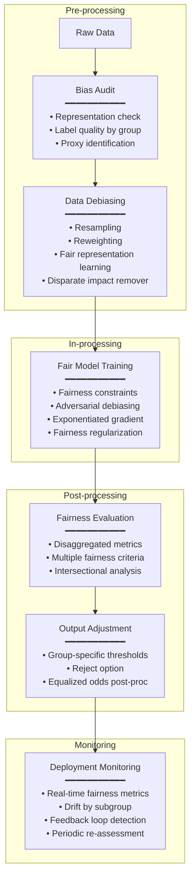

# Bias & Fairness Standards for AI Systems

**Topic:** Algorithmic bias identification and mitigation; fairness metrics; protected attributes; disparate impact; ISO/IEC TR 24027; NIST SP 1270; demographic parity; equalized odds; fairness-accuracy trade-offs  
**Standards:** ISO/IEC TR 24027:2021, NIST SP 1270 (2022), IEEE 7003:2023, EU AI Act Art. 10, ISO/IEC 24028:2020  
**SDO:** ISO/IEC JTC 1/SC 42, NIST, IEEE-SA, European Commission  
**Audience:** ML engineers, data scientists, fairness researchers, compliance officers, product managers, civil society advocates  
**Prerequisites:** ML fundamentals, statistical concepts (conditional probability, distributions), classification metrics, data science

---

## Chapter 1 — Historical Context & Origin Story

### 1.1 Timeline

| Year | Event | Significance |
|------|-------|-------------|
| 1971 | Griggs v. Duke Power Co. (US Supreme Court) | Established "disparate impact" doctrine in employment law; statistical discrimination without explicit intent |
| 1996 | Friedman & Nissenbaum — "Bias in Computer Systems" | Seminal academic paper categorizing bias in computing |
| 2014 | ProPublica investigation begins (COMPAS) | Recidivism prediction algorithm: disparate false positive rates by race |
| 2016 | **ProPublica COMPAS exposé published** | Demonstrated racial bias in criminal justice AI; catalyzed fairness ML field |
| 2016 | Northpointe response ("Machine Bias" rebuttal) | Showed mathematical impossibility of satisfying multiple fairness metrics simultaneously |
| 2017 | Buolamwini — Gender Shades study | Commercial face recognition: 34.7% error on dark-skinned women vs. 0.8% on light-skinned men |
| 2018 | Amazon scraps biased hiring AI | Recruitment AI penalized women; trained on historical (male-dominated) hiring data |
| 2018 | Impossibility theorems (Chouldechova; Kleinberg et al.) | Proved mathematical impossibility of satisfying all fairness criteria simultaneously (except trivially) |
| 2019 | Apple Card gender discrimination allegations | Credit limit gender disparities; Goldman Sachs algorithm investigation |
| 2021 | **ISO/IEC TR 24027** published | Technical report on bias in AI systems |
| 2022 | **NIST SP 1270** published | Towards standard for identifying and managing bias in AI |
| 2023 | **IEEE 7003:2023** published | Algorithmic Bias Considerations standard |
| 2024 | EU AI Act enforcement preparation | Art. 10 (data governance) and Art. 9 (risk management) require bias assessment for high-risk AI |

### 1.2 The Impossibility Result

The most important theoretical result in AI fairness:

> **You CANNOT simultaneously satisfy all fairness criteria** (unless the base rates are equal across groups OR the classifier is perfect).

Specifically (Chouldechova 2017): If the base rate of the positive class differs between groups (e.g., recidivism rates genuinely differ), then you CANNOT simultaneously achieve:
- Equal False Positive Rates (predictive equality)
- Equal False Negative Rates (equal opportunity)  
- Equal Positive Predictive Values (calibration)

**Implication**: Fairness is NOT a technical problem alone — it requires VALUE CHOICES about which fairness criterion matters most in this context. Standards guide the PROCESS of making these choices.

---

## Chapter 2 — Standards Landscape

### 2.1 ISO/IEC TR 24027:2021 — Bias in AI Systems

| Aspect | Detail |
|--------|--------|
| **Type** | Technical Report (guidance, not requirements) |
| **Title** | Information technology — Artificial intelligence — Bias in AI systems and AI aided decision making |
| **Scope** | Describes types of bias in AI; lifecycle sources; measurement approaches; mitigation strategies |
| **Key contribution** | Systematic taxonomy of bias; maps where bias enters the AI lifecycle |

### 2.2 NIST SP 1270 — Identifying and Managing Bias

| Aspect | Detail |
|--------|--------|
| **Published** | March 2022 |
| **Approach** | Broader than just technical/statistical bias — includes SYSTEMIC and HUMAN biases |
| **Three types of bias** | (1) Systemic (historical, institutional). (2) Statistical/computational (data, algorithm). (3) Human (cognitive, confirmation, implicit) |
| **Key insight** | Eliminating technical bias is insufficient if systemic biases persist in the context of use |

### 2.3 Regulatory Requirements

| Regulation | Bias-Relevant Provision | Requirement |
|:---:|---|---|
| **EU AI Act Art. 10** | Data governance for high-risk systems | Training data must be "relevant, representative, free of errors and complete"; assess possible biases |
| **EU AI Act Art. 9** | Risk management | Identify and mitigate risks including discrimination |
| **ECOA (US)** | Equal Credit Opportunity Act | Cannot discriminate in credit on protected attributes |
| **Title VII (US)** | Civil Rights Act | Employment discrimination prohibition (applies to AI-based hiring) |
| **GDPR Art. 22** | Automated decision-making | Right not to be subject to decisions based solely on automated processing producing legal/significant effects |

---

## Chapter 3 — Technical Deep Dive: Fairness Metrics

### 3.1 Notation

| Symbol | Meaning |
|:------:|---------|
| $Y$ | True label (ground truth) |
| $\hat{Y}$ | Predicted label (model output) |
| $A$ | Protected/sensitive attribute (e.g., race, gender) |
| $a, b$ | Specific groups (e.g., $a$=male, $b$=female) |
| $X$ | Features used by the model |

### 3.2 Group Fairness Metrics

| Metric | Definition | Intuition | When to Use |
|:------:|-----------|-----------|-------------|
| **Demographic Parity** | $P(\hat{Y}=1 | A=a) = P(\hat{Y}=1 | A=b)$ | Equal proportion of positive outcomes across groups | When you want equal representation regardless of base rate |
| **Equalized Odds** | $P(\hat{Y}=1 | Y=y, A=a) = P(\hat{Y}=1 | Y=y, A=b)$ for $y \in \{0,1\}$ | Equal TPR AND equal FPR across groups | When both types of errors matter equally |
| **Equal Opportunity** | $P(\hat{Y}=1 | Y=1, A=a) = P(\hat{Y}=1 | Y=1, A=b)$ | Equal TPR across groups (equal chance for qualified individuals) | When false negatives are the key concern (e.g., hiring) |
| **Predictive Parity** | $P(Y=1 | \hat{Y}=1, A=a) = P(Y=1 | \hat{Y}=1, A=b)$ | Equal PPV (precision) across groups | When you want predictions to mean the same across groups |
| **Calibration** | $P(Y=1 | S=s, A=a) = P(Y=1 | S=s, A=b)$ | Equal probability calibration across groups | When using probability scores (risk assessment) |
| **Treatment Equality** | $\frac{FN}{FP}\big|_{A=a} = \frac{FN}{FP}\big|_{A=b}$ | Equal ratio of errors across groups | When error trade-offs should be equal |

### 3.3 Individual Fairness Metrics

| Metric | Definition | Intuition |
|:------:|-----------|-----------|
| **Individual Fairness** (Dwork et al.) | Similar individuals get similar predictions: $d(f(x_1), f(x_2)) \leq L \cdot d(x_1, x_2)$ | If two people are similar (in relevant ways) → they should get similar outcomes |
| **Counterfactual Fairness** | $P(\hat{Y}_{A \leftarrow a} = y | X=x, A=a) = P(\hat{Y}_{A \leftarrow b} = y | X=x, A=a)$ | If we could change ONLY the protected attribute (counterfactually) → prediction shouldn't change |
| **Causal Fairness** | No causal path from $A$ to $\hat{Y}$ (except through resolving variables) | Protected attribute should not CAUSE the prediction through any unfair causal path |

### 3.4 The Impossibility Theorem Explained

```mermaid
graph TB
    subgraph "Fairness Metrics in Conflict"
        DP[Demographic Parity<br/>━━━━━━━━━━━<br/>Equal acceptance rates<br/>P(Ŷ=1|A=a) = P(Ŷ=1|A=b)]
        
        EO[Equalized Odds<br/>━━━━━━━━━━━<br/>Equal error rates<br/>P(Ŷ=1|Y=y,A=a) = P(Ŷ=1|Y=y,A=b)]
        
        CAL[Calibration<br/>━━━━━━━━━━━<br/>Equal meaning of scores<br/>P(Y=1|Ŷ=1,A=a) = P(Y=1|Ŷ=1,A=b)]
    end
    
    DP <-->|"CANNOT both hold<br/>(if base rates differ)"| EO
    EO <-->|"CANNOT both hold<br/>(Chouldechova 2017)"| CAL
    DP <-->|"CANNOT both hold<br/>(Kleinberg et al. 2016)"| CAL
    
    RESULT[/"IMPOSSIBILITY RESULT:<br/>When P(Y=1|A=a) ≠ P(Y=1|A=b)<br/>at most ONE of these can be satisfied<br/>(unless classifier is perfect)"\]
    
    DP --- RESULT
    EO --- RESULT
    CAL --- RESULT
```

---

## Chapter 4 — Bias Sources Across the AI Lifecycle

### 4.1 Lifecycle Bias Map

| Phase | Bias Type | Source | Example |
|:-----:|:---------:|--------|---------|
| **Problem Formulation** | Framing bias | Choice of what to predict; what "success" means | Predicting "employee retention" using biased historical performance reviews |
| **Data Collection** | Selection bias | Who is in the dataset? Who is missing? | Healthcare data from hospitals → homeless population under-represented |
| **Data Collection** | Measurement bias | How are features measured? Different accuracy for different groups? | Pulse oximeter less accurate on dark skin → biased health data |
| **Data Labeling** | Annotation bias | Human labelers' own biases encoded in labels | "Professional" vs. "unprofessional" hairstyle labeling reflects cultural bias |
| **Data Representation** | Representation bias | Distribution of groups in training data ≠ real world | Training data: 80% male → model learns "male patterns" as default |
| **Feature Engineering** | Proxy bias | Features that correlate with protected attributes | Zip code → proxy for race; name → proxy for ethnicity |
| **Model Training** | Algorithmic bias | Model amplifies patterns in data; optimization favors majority | Accuracy-maximizing model performs best on majority group |
| **Evaluation** | Evaluation bias | Metrics that hide subgroup disparities | "95% accuracy" hides 85% accuracy on minority subgroup |
| **Deployment** | Deployment bias | Model used in context different from training | Model trained in urban context deployed rurally (different demographics) |
| **Feedback** | Feedback loop bias | Model predictions influence future training data | Predictive policing: send police → more arrests there → "confirms" prediction |

### 4.2 Bias Mitigation Strategies

| Stage | Strategy | Technique | Trade-off |
|:-----:|:--------:|-----------|:---------:|
| **Pre-processing** | Fix the DATA | Resampling; reweighting; relabeling; data augmentation; fair representation learning | May lose information; assumes bias is purely in data |
| **In-processing** | Fix the MODEL | Fairness constraints during training; adversarial debiasing; regularization for fairness | Accuracy reduction (fairness-accuracy Pareto front) |
| **Post-processing** | Fix the OUTPUT | Threshold adjustment per group; calibration equalization; reject option classification | Treats symptoms not cause; legal issues (explicit group-based treatment) |

---

## Chapter 5 — Implementation Guide

### 5.1 Fairness Assessment Process

```mermaid
flowchart TD
    START[AI System to Assess for Bias]
    
    START --> DEFINE[1. Define Fairness Context<br/>━━━━━━━━━━━<br/>• What protected attributes? (law + ethics)<br/>• What is the decision domain?<br/>• Who is harmed by errors?<br/>• What fairness metric(s) matter here?<br/>• What is the acceptable disparity threshold?]
    
    DEFINE --> DATA[2. Data Audit<br/>━━━━━━━━━━━<br/>• Representation analysis by group<br/>• Label quality check by group<br/>• Feature correlation with protected attrs<br/>• Historical bias in data source<br/>• Proxy variable identification]
    
    DATA --> MODEL[3. Model Fairness Evaluation<br/>━━━━━━━━━━━<br/>• Disaggregate performance by group<br/>• Calculate chosen fairness metrics<br/>• Intersectional analysis (group × group)<br/>• Confidence intervals on disparity<br/>• Subgroup discovery (auto-detect bad groups)]
    
    MODEL --> DECIDE{Fairness<br/>thresholds met?}
    
    DECIDE -->|"Yes"| DOCUMENT_OK[Document: Bias assessment passed<br/>Continue monitoring]
    
    DECIDE -->|"No"| MITIGATE[4. Mitigation<br/>━━━━━━━━━━━<br/>• Root cause analysis (data vs. model?)<br/>• Select mitigation approach<br/>• Implement (pre/in/post-processing)<br/>• Re-evaluate fairness metrics<br/>• Check accuracy impact<br/>• Iterate until acceptable]
    
    MITIGATE --> VALIDATE[5. Validation<br/>━━━━━━━━━━━<br/>• Independent test set evaluation<br/>• Intersectional re-check<br/>• Stakeholder review<br/>• Document trade-offs made<br/>• Legal review (if post-processing)]
    
    VALIDATE --> MONITOR[6. Ongoing Monitoring<br/>━━━━━━━━━━━<br/>• Real-time fairness metrics<br/>• Drift detection by group<br/>• Population shift monitoring<br/>• Feedback loop detection<br/>• Periodic full re-assessment]
    
    DOCUMENT_OK --> MONITOR
```

### 5.2 Choosing Fairness Metrics for Your Context

| Application Domain | Recommended Metric(s) | Reasoning |
|:---:|:---:|---|
| **Hiring/Recruitment** | Equal Opportunity + Demographic Parity ratio ≥ 0.8 (four-fifths rule) | Qualified candidates should have equal chance (EO); overall selection rates shouldn't differ drastically (DP as flag) |
| **Credit/Lending** | Predictive Parity + Calibration | Scores should MEAN the same across groups; lenders need trust that "700 score" = same risk regardless of group |
| **Criminal Justice** | Equalized Odds (if used at all) | BOTH false positives (unfair detention) AND false negatives (unsafe release) matter; errors should be equal |
| **Healthcare** | Equal Opportunity + Disaggregated accuracy | Positive cases should be detected equally across demographics; no group's health needs should be missed |
| **Advertising** | Demographic Parity (for opportunity ads) | Housing, employment, credit ads must reach all groups equally (Fair Housing Act; ECOA) |
| **Content moderation** | Equal FPR across groups | False positive (legitimate content removed) disproportionately affecting one group = silencing |

### 5.3 The Four-Fifths Rule

| Aspect | Detail |
|--------|--------|
| **Origin** | US EEOC Uniform Guidelines on Employee Selection Procedures (1978) |
| **Rule** | Selection rate for any group should be ≥ 80% (4/5) of the highest group's rate |
| **Formula** | $\text{Adverse Impact Ratio} = \frac{\text{Selection rate (protected group)}}{\text{Selection rate (reference group)}} \geq 0.8$ |
| **Example** | If 60% of men are hired → women's hire rate must be ≥ 48% (0.8 × 60%) to avoid prima facie discrimination |
| **Limitation** | Only a SCREENING rule (triggers investigation); doesn't prove or disprove discrimination |
| **AI application** | Apply to model outcomes: if model approves groups at rates violating 4/5 rule → investigate |

---

## Chapter 6 — Intersectional & Subgroup Fairness

### 6.1 The Intersectionality Challenge

| Concept | Explanation |
|:-------:|------------|
| **Intersectionality** | Bias may exist at the INTERSECTION of multiple attributes that isn't visible when examining attributes independently |
| **Example** | Model fair to women (overall) AND fair to Black people (overall) BUT unfair to BLACK WOMEN specifically |
| **Buolamwini finding** | Face recognition: 0.8% error for light-skinned men; 34.7% error for dark-skinned women. Neither "gender alone" nor "race alone" captures the full disparity |

### 6.2 Subgroup Discovery Methods

| Method | Approach | Use When |
|:------:|----------|----------|
| **Exhaustive disaggregation** | Check all protected attribute combinations | Small number of attributes; sufficient data per subgroup |
| **Gerrymandering** | Algorithmic search for worst-case subgroups | Many possible subgroups; need to find hidden biases |
| **Slice Discovery Methods** | Automated mining of model underperformance subgroups | Large feature space; want to discover unknown problematic groups |
| **Conditional demographic disparity** | Check fairness conditioned on legitimate factors | When you want to control for explanatory variables |

---

## Chapter 7 — Comparison: Fairness Approaches

| Dimension | Statistical Fairness | Individual Fairness | Causal Fairness |
|:---------:|:---:|:---:|:---:|
| **Unit** | Group-level statistics | Individual comparison | Causal reasoning |
| **Intuition** | Groups should be treated equally in aggregate | Similar people → similar outcomes | Protected attribute shouldn't CAUSE outcome |
| **Advantage** | Easy to measure; clear metrics; legal basis (disparate impact) | Respects individual merit; avoids group stereotyping | Scientifically rigorous; handles proxies correctly |
| **Disadvantage** | Masks individual unfairness; impossibility theorems; which metric? | Requires "similarity" definition (who decides?); hard to operationalize | Requires causal model (hard to build; contested); computationally expensive |
| **Example** | "Equal acceptance rates across genders" | "Two equally-qualified applicants get similar scores" | "If only gender changed, prediction unchanged" |
| **Standards** | IEEE 7003; ISO/IEC TR 24027; NIST SP 1270 | Research-driven; not yet standardized | Research frontier; emerging |
| **Practice** | Widely adopted; regulatory compliance | Emerging in practice | Mostly academic; growing interest |

---

## Chapter 8 — Mermaid Architecture Diagrams

### 8.1 Bias Sources in the ML Pipeline

```mermaid
flowchart LR
    subgraph "Data Phase"
        WORLD[Real World<br/>(historical bias)]
        COLLECT[Collection<br/>(selection bias)]
        LABEL[Labeling<br/>(annotation bias)]
        WORLD --> COLLECT --> LABEL
    end
    
    subgraph "Model Phase"
        FEAT[Features<br/>(proxy bias)]
        TRAIN[Training<br/>(optimization bias)]
        EVAL_B[Evaluation<br/>(metric bias)]
        LABEL --> FEAT --> TRAIN --> EVAL_B
    end
    
    subgraph "Deployment Phase"
        DEPLOY_B[Deployment<br/>(context bias)]
        FEEDBACK[Feedback<br/>(loop bias)]
        EVAL_B --> DEPLOY_B --> FEEDBACK
        FEEDBACK -->|"Reinforces"| WORLD
    end
    
    style WORLD fill:#ff9999
    style FEEDBACK fill:#ff9999
```

### 8.2 Fairness-Aware ML Pipeline



---

## Chapter 9 — Case Studies

### 9.1 COMPAS — The Case That Launched Fairness ML

| Aspect | Detail |
|--------|--------|
| **System** | COMPAS (Correctional Offender Management Profiling for Alternative Sanctions); risk assessment for recidivism prediction in US criminal justice |
| **ProPublica finding (2016)** | Among defendants who did NOT reoffend: Black defendants were TWICE as likely to be flagged as high risk (false positive rate: Black 45% vs. White 23%). Among defendants who DID reoffend: White defendants were twice as likely to be incorrectly flagged as low risk (false negative rate: White 48% vs. Black 28%). |
| **Northpointe response** | The model IS calibrated: among those scored "7 out of 10 risk," recidivism rates are similar regardless of race. The model satisfies PREDICTIVE PARITY. |
| **The impossibility** | Both ProPublica and Northpointe were right. The model satisfies predictive parity but violates equalized odds. Due to different base rates (Black defendants had higher measured recidivism in data), BOTH cannot be satisfied simultaneously. |
| **Lesson** | (1) Fairness is a CHOICE: which metric do you prioritize? ProPublica chose "equal error rates" (equalized odds); Northpointe chose "scores mean the same thing" (calibration). BOTH are legitimate fairness criteria. (2) The choice is ETHICAL/POLITICAL, not technical. Who bears the cost of errors? (3) Standards (IEEE 7003, NIST SP 1270) help by providing PROCESS for making this choice transparently with stakeholder input. |

### 9.2 Healthcare: Racial Bias in Algorithm for Care Allocation

| Aspect | Detail |
|--------|--------|
| **System** | Commercial algorithm used by US hospitals to identify patients needing "high-risk care management" programs (Obermeyer et al., Science 2019) |
| **Bias found** | Algorithm used HEALTHCARE COSTS as proxy for HEALTHCARE NEEDS. Black patients face barriers to care → spend less → algorithm predicts they "need" less care. Result: at the same algorithm risk score, Black patients were significantly SICKER than White patients. |
| **Quantification** | Fixing the bias would increase the percentage of Black patients identified for extra care from 17.7% to 46.5% — nearly 3x under-identification. |
| **Root cause** | Proxy bias: "past cost" ≠ "health need" — for Black patients, past cost reflects access barriers, not lower illness burden. The bias was not in the model (which predicted costs accurately) but in the LABEL CHOICE (cost instead of health need). |
| **Fix** | Changed prediction target from "cost" to "health need" (measured by active chronic conditions, unexpected ER visits, uncontrolled biomarkers). New algorithm: no racial disparity in identification. |
| **ISO/IEC TR 24027 mapping** | This is "measurement bias" — the outcome variable (cost) measures different things for different groups (for White patients: health need; for Black patients: health need MINUS access barriers). |
| **Lesson** | (1) Bias can exist even without protected attributes in the model. (2) The CHOICE of what to predict (framing/label) can be the source of bias. (3) "Accurate" model can be deeply biased if the target variable itself is biased. |

---

## Chapter 10 — Future Evolution

| Trend | Timeline | Impact |
|-------|----------|--------|
| **Regulatory enforcement** | 2025-2027 | EU AI Act Art. 10 enforcement → mandatory bias assessment for high-risk AI |
| **Fairness auditing standards** | 2025-2028 | ISO/IEC standardized audit methodologies; third-party fairness auditors |
| **Causal fairness adoption** | 2025-2030 | Move from correlational to causal fairness in practice; causal fairness tools |
| **Intersectional standards** | 2025-2027 | Standards explicitly requiring intersectional analysis (not just single-attribute) |
| **GenAI fairness** | 2024-2027 | Fairness for generative AI: representational harms; stereotypes in generated content |
| **Dynamic fairness** | 2025-2028 | Fairness monitoring over time; detecting degradation; long-term impact assessment |
| **Participatory design** | 2025-2027 | Affected communities involved in choosing fairness criteria (per IEEE 7000) |
| **Context-adaptive fairness** | 2026-2030 | No universal fairness metric; standards for context-appropriate metric selection |

---

## Chapter 11 — Interview Questions & Career Guide

### Tier 1: Entry-Level

**Q1:** What is the difference between "demographic parity" and "equalized odds"? Give a simple example of each.

**A:** 

**Demographic Parity**: Equal OUTCOME RATES across groups regardless of qualifications.
- Definition: $P(\hat{Y}=1 | A=a) = P(\hat{Y}=1 | A=b)$
- Example (loan approval): 50% of men get approved → 50% of women must also get approved. Doesn't matter if qualifications differ between groups.
- When it matters: When you believe base rates SHOULDN'T differ (e.g., historical hiring discrimination means unequal qualifications reflect past injustice, not genuine difference).

**Equalized Odds**: Equal ERROR RATES across groups.
- Definition: $P(\hat{Y}=1 | Y=y, A=a) = P(\hat{Y}=1 | Y=y, A=b)$ for all $y$
- Example (loan approval): Among people who WOULD repay (Y=1), equal approval rate across genders (equal TPR). AND among people who would NOT repay (Y=0), equal denial rate across genders (equal FPR).
- When it matters: When you want errors to be distributed equally (no group disproportionately bears the cost of mistakes).

**Key difference**: Demographic parity ignores the "ground truth" — it just wants equal outcomes. Equalized odds RESPECTS ground truth — it wants equal outcomes CONDITIONAL on true qualification. If one group genuinely has higher base rate (more qualified), equalized odds allows higher acceptance for that group, while demographic parity does not.

**When they conflict**: If 70% of men and 40% of women are truly qualified (base rates differ) → demographic parity requires accepting LESS qualified women or rejecting MORE qualified men → violates equalized odds. You must CHOOSE which matters more in this context.

### Tier 2: Mid-Level

**Q2:** Explain the impossibility theorem of fairness. What are its practical implications for AI system design?

**A:** 

**The impossibility theorem** (Chouldechova 2017; Kleinberg, Mullainathan & Raghavan 2016): When base rates differ between groups ($P(Y=1|A=a) \neq P(Y=1|A=b)$), it is MATHEMATICALLY IMPOSSIBLE to simultaneously satisfy:
1. Calibration: $P(Y=1|\hat{Y}=1,A=a) = P(Y=1|\hat{Y}=1,A=b)$ (predictions mean the same across groups)
2. False positive rate equality: $P(\hat{Y}=1|Y=0,A=a) = P(\hat{Y}=1|Y=0,A=b)$
3. False negative rate equality: $P(\hat{Y}=1|Y=1,A=a) = P(\hat{Y}=1|Y=1,A=b)$

UNLESS the classifier is perfect (never makes errors) or base rates are equal.

**Proof intuition**: If 30% of group A reoffends and 50% of group B reoffends, and you want your "high risk" score to mean the same probability for both groups (calibration), then by Bayes' theorem, the error rates MUST differ between groups. There's no mathematical escape.

**Practical implications**:

(1) **Fairness requires VALUE CHOICES**: Since you can't have all fairness metrics, you must CHOOSE which one(s) to prioritize. This is an ethical/social decision, not a technical one. The COMPAS debate: ProPublica chose equalized odds (equal errors); Northpointe chose calibration (scores mean same thing). Both are mathematically valid.

(2) **Process matters more than metric**: Standards like IEEE 7003 and ISO/IEC TR 24027 don't mandate ONE metric — they mandate a PROCESS for: identifying which fairness matters in your context, consulting stakeholders, documenting the choice and its rationale, monitoring the chosen metric.

(3) **Trade-off curves are the deliverable**: Instead of asking "is this model fair?" ask "what is the Pareto frontier between accuracy and our chosen fairness metric?" Then stakeholders can decide where on that curve to operate.

(4) **Accuracy cost varies**: Sometimes satisfying a fairness constraint costs very little accuracy (<1%). Sometimes it costs a lot (10%+). This is context-dependent and should be quantified, not assumed.

(5) **"Fair" may mean different things in different jurisdictions**: US law (four-fifths rule) → disparate impact ≈ demographic parity concern. EU law → individual rights-focused. Both are legitimate; systems operating in multiple jurisdictions must navigate this.

### Tier 3: Senior

**Q3:** Design a comprehensive fairness governance program for a financial services company deploying multiple AI models (credit scoring, fraud detection, marketing targeting, customer churn prediction). Address the impossibility theorem practically.

**A:**

**Fairness Governance Architecture:**

*1. Fairness Policy (Corporate Level)*

- **Protected attributes**: Define based on law (ECOA, Fair Housing Act, EU anti-discrimination directives) + ethical commitment (company values beyond legal minimum)
- **Fairness metric selection framework**: Per-model selection based on application context:

| Model | Primary Metric | Rationale |
|:---:|:---:|---|
| Credit scoring | Calibration + Four-fifths rule monitoring | Scores must mean the same thing across groups (calibration required for risk pricing); four-fifths rule is regulatory expectation (ECOA) |
| Fraud detection | Equal FPR (predictive equality) | False positive = legitimate transaction declined = customer harm; must not disproportionately affect any group |
| Marketing targeting | Demographic parity (for regulated products) | Fair lending ads (housing, credit) must reach all groups equally (HUD, CFPB guidance) |
| Churn prediction | Disaggregated accuracy; no fairness constraint | Internal optimization; low external harm; but monitor for discriminatory retention offers |

- **Threshold policy**: Disparity triggering investigation vs. blocking deployment:
  - >20% disparity (four-fifths violation) → blocks deployment
  - 10-20% disparity → requires senior review + documented justification
  - <10% → documented; monitored; acceptable

*2. Technical Implementation*

**Pre-deployment fairness assessment (mandatory for all models):**
```
Assessment includes:
1. Data representation analysis (by all protected attributes)
2. Proxy variable analysis (feature correlation with protected attrs)
3. Model performance disaggregation (accuracy/precision/recall BY GROUP)
4. Selected fairness metrics computed (with confidence intervals)
5. Intersectional analysis (at minimum: race × gender)
6. Comparison to business justification (disparities explained by legitimate factors?)
7. Mitigation applied if thresholds violated
8. Residual disparity documented with justification
```

**Addressing the impossibility theorem practically:**

For credit scoring (the hardest case): (1) PRIMARY metric = Calibration: A "700 score" must mean the same default probability regardless of demographics. This is essential for fair pricing (same risk = same rate). (2) SECONDARY monitoring = FPR disparity: If false positive rates differ significantly, investigate. May indicate proxy variables or historical bias in training data. (3) RESOLUTION when they conflict (impossibility in action): If base rates genuinely differ AND calibration is maintained → accept that error rates will differ → DOCUMENT this as inherent to calibrated risk assessment → ensure difference is due to legitimate factors (income, debt) not proxies for protected attributes → offer recourse pathways for false positives.

*3. Ongoing Monitoring & Governance*

- **Real-time fairness dashboard**: All deployed models; disaggregated metrics; alerts on drift
- **Quarterly fairness review**: Model Governance Committee reviews fairness metrics; trends; incidents
- **Annual third-party audit**: Independent fairness audit by external assessor
- **Feedback mechanisms**: Customer complaints analyzed for fairness signals; appeal process
- **Feedback loop prevention**: Monitor whether model predictions influence future data (e.g., denied credit → can't build credit history → model "confirmed right" = feedback loop)

*4. Stakeholder Governance*

- **Fairness Advisory Board**: External members (civil society, affected communities, domain experts) → advise on metric choices and threshold levels
- **Transparency**: Publish aggregate fairness statistics in annual report (per EU AI Act Art. 13 obligations for high-risk systems)
- **Recourse**: Clear process for individuals to challenge AI-assisted decisions; human review pathway

---

## Chapter 12 — Cheat Sheet & Quick Reference

```
═══════════════════════════════════════════
BIAS & FAIRNESS — QUICK REFERENCE
═══════════════════════════════════════════

KEY STANDARDS:
  ISO/IEC TR 24027:2021 — Bias taxonomy (guidance)
  NIST SP 1270:2022    — Bias management (broader view)
  IEEE 7003:2023       — Algorithmic bias (process)
  EU AI Act Art. 10    — Data governance (binding)

═══════════════════════════════════════════
TOP FAIRNESS METRICS:
  Demographic Parity:   Equal outcome rates
  Equal Opportunity:    Equal TPR (true positive rate)
  Equalized Odds:       Equal TPR AND FPR
  Predictive Parity:    Equal PPV (precision)
  Calibration:          Scores mean same across groups
  Four-Fifths Rule:     Selection rate ≥ 80% of highest

═══════════════════════════════════════════
THE IMPOSSIBILITY THEOREM:
  When base rates differ between groups:
    Calibration + Equal FPR + Equal FNR 
    → CANNOT all hold simultaneously
    
  Implication: MUST CHOOSE which fairness metric
  This is an ETHICAL choice, not a technical one

═══════════════════════════════════════════
BIAS SOURCES (LIFECYCLE):
  Problem:      Wrong target variable; biased framing
  Collection:   Selection bias; under-representation
  Labeling:     Annotator bias; cultural assumptions
  Features:     Proxy variables for protected attrs
  Training:     Majority-optimizing; amplification
  Evaluation:   Aggregate metrics hide subgroup issues
  Deployment:   Context mismatch; population shift
  Feedback:     Self-reinforcing loops

═══════════════════════════════════════════
MITIGATION APPROACHES:
  Pre-processing:  Fix data (resample, reweight, augment)
  In-processing:   Fix model (constraints, adversarial)
  Post-processing: Fix output (thresholds, calibration)

═══════════════════════════════════════════
METRIC SELECTION GUIDE:
  Hiring:        Equal Opportunity + Four-Fifths Rule
  Credit:        Calibration + Four-Fifths monitoring
  Criminal:      Equalized Odds (if used at all)
  Healthcare:    Equal Opportunity + disaggregated accuracy
  Advertising:   Demographic Parity (regulated products)
  Content mod:   Equal FPR (don't disproportionately silence)

═══════════════════════════════════════════
INTERSECTIONALITY — DON'T FORGET:
  Fair to women + fair to minorities ≠ fair to minority women
  Always check INTERSECTIONS of protected attributes
  Buolamwini: face recognition 0.8% error light-skinned men
              vs. 34.7% error dark-skinned women

═══════════════════════════════════════════
NIST SP 1270 — THREE TYPES OF BIAS:
  1. Systemic:    Historical/institutional inequity
  2. Statistical:  Data/algorithmic bias
  3. Human:       Cognitive/implicit bias
  
  All three must be addressed; technical fix alone insufficient

═══════════════════════════════════════════
FOUR-FIFTHS RULE (US EEOC):
  Selection rate (protected) / Selection rate (reference) ≥ 0.8
  
  Violation = prima facie evidence of discrimination
  → Triggers investigation (doesn't prove discrimination)
```

---

*End of Document — 10_Bias_Fairness_Standards.md*
