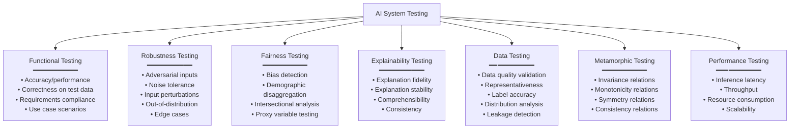

# AI Testing Standards — ISO/IEC TR 29119-11

**Topic:** Testing AI-based systems; ISO/IEC TR 29119-11; test strategies for machine learning; AI-specific test types; coverage for neural networks; metamorphic testing; data adequacy; AI test automation  
**Standards:** ISO/IEC TR 29119-11:2024 (Testing AI-based systems), ISO/IEC 29119 series (Parts 1-5), ISO/IEC 25010 (Quality model), ISO/IEC 42001 (AI management)  
**SDO:** ISO/IEC JTC 1/SC 7 (Software Engineering) + SC 42 (AI) joint work  
**Audience:** Test engineers, QA managers, ML engineers, test architects, certification engineers, DevOps/MLOps teams  
**Prerequisites:** Software testing fundamentals (ISO 29119 Parts 1-4), ML/DL basics, CI/CD concepts, statistical testing concepts

---

## Chapter 1 — Historical Context & Origin Story

### 1.1 Timeline

| Year | Event | Significance |
|------|-------|-------------|
| 2013 | ISO/IEC 29119 Part 1-3 published | Software testing standard (process, documentation, techniques) |
| 2015 | ISO/IEC 29119 Part 4 (Test techniques) | Catalogue of test techniques — no AI-specific techniques |
| 2017 | Academic: DeepXplore (neuron coverage) | First systematic coverage criterion for DNNs |
| 2018 | Metamorphic testing for ML formalized | Relations-based testing for systems without test oracles |
| 2019 | Industry: widespread ML test failures | Uber ATG, Tesla incidents highlight inadequate ML testing |
| 2020 | ISO/IEC TR 29119-11 work begins | SC 7 + SC 42 collaboration on AI testing guidance |
| 2021 | Murphy ML testing survey | Established ML testing as distinct discipline |
| 2022 | NIST AI 100-2E includes testing taxonomy | Testing as defense against adversarial ML |
| 2023 | AI Act mandates testing for high-risk AI | Regulatory driver for standardized AI testing |
| **2024** | **ISO/IEC TR 29119-11** published | First international standard guidance for AI testing |
| 2024+ | Continued development toward normative standard | TR → full standard path |

### 1.2 Why Traditional Testing Is Insufficient for AI

| Traditional Testing Principle | AI Challenge |
|:---:|---|
| **Test against requirements** | AI behavior emerges from data; no line-by-line requirements to verify |
| **Expected results (oracle)** | For many AI tasks, there's no definitive "correct" answer (what's the "right" image caption?) |
| **Structural coverage** | Statement/branch/MC/DC coverage meaningless for neural networks |
| **Determinism** | Same input → different output possible (floating-point non-determinism; model versions) |
| **Boundary value analysis** | Input space is high-dimensional; boundaries not well-defined for images/text |
| **Regression testing** | Model retraining changes ALL behavior; full retesting needed |
| **Test completeness** | Cannot enumerate all inputs (infinite input space for images, text, etc.) |
| **Bug localization** | "Wrong output" but which of 10M weights is "wrong"? |

---

## Chapter 2 — ISO/IEC TR 29119-11 Overview

### 2.1 Document Structure

| Aspect | Detail |
|--------|--------|
| **Title** | Software and systems engineering — Software testing — Part 11: Testing of AI-based systems |
| **Type** | Technical Report (guidance; not normative requirements) |
| **Scope** | Guidance on testing AI-based systems throughout the lifecycle; complements Parts 1-5 |
| **Approach** | Extends existing testing concepts to AI; adds AI-specific test types; defines new quality characteristics to test |

### 2.2 Key Concepts

| Concept | Definition |
|:-------:|-----------|
| **AI-based system** | System incorporating one or more AI components that influence system behavior |
| **AI component** | Software component using AI/ML techniques (model + inference engine) |
| **Data adequacy** | Whether test data sufficiently covers the operational domain and edge cases |
| **Operational domain** | Defined set of conditions under which the AI is designed to operate correctly |
| **Test oracle problem** | Difficulty of determining correct expected output for AI (no specification to check against) |
| **Non-determinism in testing** | Challenge of reproducing failures when AI behavior varies between runs |

### 2.3 Relationship to ISO/IEC 29119 Series

| Part | Scope | AI Extension (Part 11) |
|:----:|-------|---|
| Part 1 | Concepts & definitions | + AI-specific testing concepts and terminology |
| Part 2 | Test process | + AI-specific test activities at each lifecycle stage |
| Part 3 | Test documentation | + AI-specific test documents (data adequacy reports, model test reports) |
| Part 4 | Test techniques | + AI-specific test techniques (metamorphic testing, adversarial testing, etc.) |
| Part 5 | Keyword-driven testing | Not directly extended (automation applicable) |

---

## Chapter 3 — AI-Specific Test Types

### 3.1 Taxonomy of AI Testing



### 3.2 Metamorphic Testing (Key AI Test Technique)

| Aspect | Detail |
|--------|--------|
| **Problem it solves** | The "oracle problem" — when you can't define expected output for arbitrary inputs |
| **Principle** | Instead of checking "output is correct," check "OUTPUT RELATIONSHIPS are correct" across transformed inputs |
| **Key concept** | Metamorphic Relations (MR): known properties that MUST hold even if you don't know the exact answer |

| Metamorphic Relation Type | Example (Image Classification) | Example (NLP Sentiment) |
|:---:|---|---|
| **Invariance** | Rotate image slightly → classification should NOT change | Add "very" before positive word → sentiment should NOT decrease |
| **Monotonicity** | Add more evidence of class → confidence should increase | Add more positive words → sentiment score should increase |
| **Symmetry** | Mirror image → classification should be same | "A loves B" vs. "B is loved by A" → same sentiment |
| **Additivity** | Combine two "dog" images → still classified as "dog" | Combine positive sentences → still positive |
| **Negation** | Invert image colors → classification may change predictably | Add "not" → sentiment should flip |

### 3.3 Adversarial Testing

| Aspect | Detail |
|--------|--------|
| **Purpose** | Test model behavior under intentionally crafted malicious inputs |
| **Types** | White-box (gradient-based: FGSM, PGD, C&W); Black-box (query-based: boundary attack, HopSkipJump); Physical (real-world perturbations) |
| **Metric** | Adversarial accuracy: accuracy under bounded perturbation (ε-ball) |
| **Standard** | NIST AI 100-2E provides taxonomy; ISO/IEC TR 29119-11 includes as test technique |

### 3.4 Data Adequacy Testing

| Test | What It Checks | How |
|:----:|---|---|
| **Coverage of operational domain** | Does test data cover all specified operating conditions? | Map operational domain → check test data contains examples from all regions |
| **Distribution match** | Does test data distribution match real-world? | Statistical tests (KS-test, Chi-squared) comparing test data to production data |
| **Edge case coverage** | Are rare/critical scenarios represented? | Domain expert review; boundary analysis; known failure scenario inclusion |
| **Label quality** | Are labels accurate? | Inter-annotator agreement; expert review; consensus checking |
| **Data independence** | Is test data truly independent from training? | Check for data leakage (duplicate detection; temporal leakage; group leakage) |

---

## Chapter 4 — AI Test Process (Extending ISO/IEC 29119-2)

### 4.1 AI Test Activities per Lifecycle Phase

| Phase | Traditional (29119-2) | AI Addition (29119-11) |
|:-----:|---|---|
| **Test planning** | Test strategy, scope, approach | + Define operational domain; select AI-specific techniques; plan data adequacy; fairness metrics selection |
| **Test design** | Test cases from requirements | + Metamorphic relations; adversarial scenarios; bias test cases; robustness scenarios; data adequacy criteria |
| **Test execution** | Run tests; record results | + Statistical evaluation (not pass/fail binary); confidence intervals; performance under perturbation |
| **Test reporting** | Pass/fail; defect reports | + Performance distributions; disaggregated metrics; robustness bounds; fairness audit; model comparison |
| **Test completion** | Criteria met → done | + Residual risk documented; ongoing monitoring plan; retest triggers defined |

### 4.2 AI Test Strategy Template

```mermaid
flowchart TD
    STRATEGY[AI Test Strategy]
    
    STRATEGY --> SCOPE[1. Scope Definition<br/>━━━━━━━━━━━<br/>• What AI components to test?<br/>• What is the operational domain?<br/>• What quality characteristics matter?<br/>  (accuracy, robustness, fairness,<br/>   explainability, performance)]
    
    SCOPE --> DATA_S[2. Data Strategy<br/>━━━━━━━━━━━<br/>• Test data sourcing<br/>• Data adequacy criteria<br/>• Representativeness requirements<br/>• Independence from training data<br/>• Volume requirements]
    
    DATA_S --> TECH[3. Technique Selection<br/>━━━━━━━━━━━<br/>• Performance testing (accuracy metrics)<br/>• Metamorphic testing (relations)<br/>• Adversarial testing (robustness)<br/>• Fairness testing (bias metrics)<br/>• Operational domain boundary testing]
    
    TECH --> CRITERIA[4. Completion Criteria<br/>━━━━━━━━━━━<br/>• Performance thresholds (e.g., accuracy > 95%)<br/>• Robustness bounds (e.g., adversarial acc > 90%)<br/>• Fairness thresholds (e.g., DPR > 0.8)<br/>• Data coverage targets<br/>• Confidence level requirements]
    
    CRITERIA --> MONITOR[5. Ongoing Testing<br/>━━━━━━━━━━━<br/>• Monitoring metrics in production<br/>• Drift detection triggers retest<br/>• Regression test after any change<br/>• Periodic full re-evaluation<br/>• A/B testing for model updates]
```

---

## Chapter 5 — Coverage Criteria for AI

### 5.1 The Coverage Problem

| Traditional Coverage | AI Equivalent (Proposed) | Maturity |
|:---:|---|:---:|
| Statement coverage | Neuron activation coverage (NAC): % of neurons activated at least once | Research (low correlation with fault detection) |
| Branch coverage | Path coverage through network: % of activation patterns exercised | Research (combinatorial explosion) |
| MC/DC | Modified condition/decision for NN: each neuron condition independently affects output | Research (theoretical; not practical at scale) |
| Input domain partitioning | Operational domain partitioning: test all identified regions of input space | Practical (used in automotive, aviation) |
| Boundary value analysis | Boundary inputs: test at edges of operational domain | Practical |
| — (no equivalent) | Metamorphic relation coverage: % of defined metamorphic relations tested | Emerging |
| — (no equivalent) | Feature coverage: % of feature combinations tested | Emerging |
| — (no equivalent) | Adversarial coverage: robustness verified within perturbation bounds | Emerging |

### 5.2 Practical AI Coverage Approaches

| Approach | Description | Applicability |
|:--------:|-------------|:---:|
| **Operational domain coverage** | Define operational domain as partitions (weather × lighting × scenario × object types); test all partitions | High (aviation, automotive) |
| **Scenario-based coverage** | Define critical scenarios; test all scenarios | High (all domains) |
| **Requirement-based coverage** | Performance requirements per condition; verify all conditions | High (standards-compliant) |
| **Metamorphic relation coverage** | Define N metamorphic relations; verify all hold on M test inputs | Medium-High (oracle-free testing) |
| **Distribution coverage** | Test data covers same distribution as operational data (statistical tests) | High (general) |
| **Adversarial perturbation coverage** | Certified robustness within ε-bounds for critical inputs | Medium (formal verification limited to small models) |
| **Feature importance coverage** | Test all high-importance features identified by XAI methods | Medium |

---

## Chapter 6 — AI Testing in MLOps/CI/CD

### 6.1 ML Testing Pipeline

```mermaid
flowchart LR
    subgraph "Data Testing"
        DV[Data Validation<br/>━━━━━━━━━━━<br/>• Schema validation<br/>• Distribution checks<br/>• Anomaly detection<br/>• Missing values<br/>• Label quality]
    end
    
    subgraph "Model Testing"
        UT[Unit Tests<br/>━━━━━━━━━━━<br/>• Model loads correctly<br/>• Input/output shapes<br/>• Inference runs<br/>• Deterministic (seed)]
        
        PT[Performance Tests<br/>━━━━━━━━━━━<br/>• Accuracy on test set<br/>• Per-class metrics<br/>• Threshold met?]
        
        RT[Robustness Tests<br/>━━━━━━━━━━━<br/>• Adversarial inputs<br/>• Noise tolerance<br/>• Edge cases]
        
        FT[Fairness Tests<br/>━━━━━━━━━━━<br/>• Disaggregated metrics<br/>• Fairness thresholds<br/>• Bias detection]
    end
    
    subgraph "Integration Testing"
        IT[System Integration<br/>━━━━━━━━━━━<br/>• End-to-end pipeline<br/>• Latency requirements<br/>• Resource limits<br/>• API contract]
    end
    
    subgraph "Deployment Testing"
        CANARY[Canary/Shadow<br/>━━━━━━━━━━━<br/>• Shadow mode (compare)<br/>• Canary deployment<br/>• A/B testing<br/>• Rollback criteria]
    end
    
    DV --> UT --> PT --> RT --> FT --> IT --> CANARY
```

### 6.2 Test Automation for AI

| Test Type | Automation Approach | Tools/Framework |
|:---------:|---|---|
| Data validation | Schema enforcement; distribution drift detection; automated quality checks | Great Expectations; TensorFlow Data Validation; Evidently AI |
| Model performance | Automated benchmark evaluation; threshold-based gates | MLflow; Weights & Biases; custom CI scripts |
| Robustness | Automated adversarial attack generation; perturbation testing | IBM ART; Foolbox; Microsoft Counterfit |
| Fairness | Automated bias metric computation; disaggregation | Fairlearn; AIF360; What-If Tool |
| Metamorphic | Automated relation generation; batch metamorphic test execution | Custom frameworks; DeepCrime; MutPy |
| Regression | Full re-evaluation on test suite after any model change | CI/CD integration (GitHub Actions, Jenkins) |
| Monitoring | Real-time performance tracking; automated alerting | Evidently AI; Fiddler; Arthur AI; Arize |

---

## Chapter 7 — Comparison: AI Testing Approaches

| Dimension | ISO/IEC TR 29119-11 | Automotive (ISO 26262 + SOTIF) | Aviation (EASA CoLS) | NIST AI 100-2E |
|:---------:|:---:|:---:|:---:|:---:|
| **Type** | General AI testing guidance | Domain-specific (vehicles) | Domain-specific (aircraft) | Adversarial ML taxonomy |
| **Focus** | Comprehensive test methodology | Safety verification; SOTIF triggering conditions | Certification evidence; data adequacy | Adversarial robustness |
| **Coverage concept** | Operational domain coverage; metamorphic | SOTIF scenario coverage; simulation hours | Data representativeness; operational domain | Perturbation bounds |
| **Oracle approach** | Metamorphic relations; statistical thresholds | Expected behavior per scenario; simulation reference | Performance requirements; formal bounds | Adversarial accuracy metric |
| **Fairness** | Yes (explicit test type) | Limited (indirect via SOTIF) | Limited (implicit) | Limited (bias in Sec. 5) |
| **Automation** | Recommended | Required (millions of km) | Required (high data volume) | Research tools |
| **Maturity** | New (2024); guidance | Emerging (SOTIF 2022) | Emerging (CoLS 2023) | Published (2022) |

---

## Chapter 8 — Mermaid Architecture Diagrams

### 8.1 AI Test Types Mapped to Quality Characteristics

```mermaid
graph TB
    QUALITY[AI Quality Characteristics<br/>(to be tested)]
    
    QUALITY --> ACC[Accuracy / Performance<br/>━━━━━━━━━━━<br/>Test: Standard test set evaluation<br/>Metric: Accuracy, F1, AUC-ROC<br/>Disaggregate: per class, per condition]
    
    QUALITY --> ROBUST_Q[Robustness<br/>━━━━━━━━━━━<br/>Test: Adversarial; noise; perturbation<br/>Metric: Adversarial accuracy; certified radius<br/>OOD: novelty detection evaluation]
    
    QUALITY --> FAIR_Q[Fairness<br/>━━━━━━━━━━━<br/>Test: Disaggregated metrics; bias detection<br/>Metric: DP ratio; Equalized Odds gap<br/>Intersectional: multi-attribute analysis]
    
    QUALITY --> EXPLAIN_Q[Explainability<br/>━━━━━━━━━━━<br/>Test: Fidelity; stability; comprehensibility<br/>Metric: Explanation fidelity score<br/>User: Task-based evaluation]
    
    QUALITY --> RELIABLE[Reliability<br/>━━━━━━━━━━━<br/>Test: Temporal consistency; reproducibility<br/>Metric: Prediction stability over time<br/>Drift: Distribution shift detection]
    
    QUALITY --> SECURE[Security<br/>━━━━━━━━━━━<br/>Test: Red team; extraction; poisoning<br/>Metric: Attack success rate<br/>Framework: MITRE ATLAS mapping]
    
    QUALITY --> EFFICIENT[Efficiency<br/>━━━━━━━━━━━<br/>Test: Latency; throughput; resource use<br/>Metric: p99 latency; memory; GPU util<br/>Threshold: SLA compliance]
```

### 8.2 Test Oracle Solutions for AI

```mermaid
flowchart TD
    ORACLE[Test Oracle Problem:<br/>"What is the correct output<br/>for this input?"]
    
    ORACLE --> LABELED[Labeled Test Data<br/>━━━━━━━━━━━<br/>• Human-annotated ground truth<br/>• Limitation: expensive; limited coverage<br/>• Use: performance measurement]
    
    ORACLE --> META_O[Metamorphic Relations<br/>━━━━━━━━━━━<br/>• Define expected RELATIONSHIPS<br/>• No need for exact expected output<br/>• "Rotate 5° → same classification"<br/>• Use: oracle-free testing at scale]
    
    ORACLE --> REFERENCE[Reference Model<br/>━━━━━━━━━━━<br/>• Compare to existing system / human<br/>• "At least as good as previous version"<br/>• Cross-model agreement<br/>• Use: regression; A/B testing]
    
    ORACLE --> PROPERTY[Property-Based Testing<br/>━━━━━━━━━━━<br/>• Define properties that MUST hold<br/>• "Confidence sum = 1.0"<br/>• "Prediction ∈ valid classes"<br/>• Use: sanity checks; invariants]
    
    ORACLE --> STAT[Statistical Thresholds<br/>━━━━━━━━━━━<br/>• Aggregate metrics must meet threshold<br/>• "Accuracy > 95% on test set"<br/>• "Latency p99 < 100ms"<br/>• Use: acceptance criteria]
```

---

## Chapter 9 — Case Studies

### 9.1 Automotive: Testing Perception AI for ADAS

| Aspect | Detail |
|--------|--------|
| **System** | Camera-based pedestrian detection for Autonomous Emergency Braking (AEB) |
| **Test challenge** | Cannot enumerate all possible pedestrian appearances, poses, lighting, weather, backgrounds |
| **Test strategy (ISO 29119-11 aligned)** | **(1) Operational domain definition**: Weather (7 conditions) × Lighting (5 levels) × Pedestrian type (12 categories) × Background (8 types) × Distance (10 ranges) = 33,600 scenario partitions. **(2) Data-driven testing**: 500K annotated images covering all partitions; statistical coverage analysis (each partition has ≥50 samples). **(3) Metamorphic testing**: MR1: Brightness ±10% → detection unchanged. MR2: Scale reduction (farther away) → detection confidence decreases monotonically. MR3: Pedestrian translation within frame → detection confidence stable. MR4: Adding rain overlay → detection maintained (may decrease confidence; should NOT miss). Generated 2M synthetic metamorphic test inputs automatically. **(4) Adversarial testing**: FGSM and PGD attacks at ε=0.03; adversarial accuracy requirement: >90% (real-world perturbation bounds). Physical adversarial: tested with adversarial T-shirts, modified crossings. **(5) Fairness testing**: Detection rate disaggregated by pedestrian characteristics: adults vs. children; skin tone; clothing type; mobility aids (wheelchairs). Requirement: detection rate variance <5% across all groups. |
| **Results** | Performance: 99.6% detection rate (overall); weakest partition: night + rain + dark clothing = 96.2% (above 95% threshold). Metamorphic: 2 violations found (extreme brightness saturation → detection loss). Fixed by data augmentation. Adversarial: 91.3% accuracy under PGD ε=0.03. Fairness: 1.8% max variance across demographic categories (within 5% threshold). |
| **Testing volume** | 10M test evaluations total (data + synthetic + metamorphic + adversarial) |

### 9.2 Healthcare: Testing Clinical Decision Support AI

| Aspect | Detail |
|--------|--------|
| **System** | ML-based sepsis prediction for ICU patients (early warning 6 hours before onset) |
| **Regulatory** | SaMD (Software as Medical Device); FDA requires analytical and clinical validation |
| **Test strategy** | **(1) Analytical validation (performance)**: Sensitivity/specificity on independent hospital test data (3 hospitals NOT in training). Target: sensitivity >85%, specificity >90%. Result: 87% sensitivity, 92% specificity on holdout. **(2) Temporal validation**: Model trained on 2018-2020 data; tested on 2021-2022 data (temporal shift test). Result: 84% sensitivity (slight degradation — acceptable). **(3) Fairness**: Performance by demographics: age groups (<40, 40-60, 60-80, 80+); race/ethnicity; gender. Finding: sensitivity 78% for patients >80 (below 85% threshold). Root cause: elderly patients have atypical sepsis presentation. Mitigation: additional training data for elderly; age-specific model calibration. **(4) Metamorphic testing**: MR1: Adding abnormal lab value → sepsis risk should increase. MR2: Removing known sepsis risk factor → risk should decrease. MR3: Adding noise to vital signs within normal range → risk should be stable. Violations found: 3 metamorphic failures in edge cases. **(5) Clinical validation**: Prospective silhouette deployment (model runs; alerts shown to physicians; outcomes compared to standard care). Result: 23% reduction in time-to-treatment; 12% improvement in mortality for detected sepsis. |
| **Monitoring plan** | (1) Weekly performance review (sensitivity/specificity on recent predictions with confirmed outcomes). (2) Monthly demographic performance check. (3) Quarterly full re-evaluation against updated patient population. (4) Alert rate monitoring (too many alerts = alarm fatigue → system useless). |

---

## Chapter 10 — Future Evolution

| Trend | Timeline | Impact |
|-------|----------|--------|
| **ISO/IEC 29119-11 → normative standard** | 2026-2028 | TR upgraded to full standard with requirements (not just guidance) |
| **AI test coverage standards** | 2025-2027 | Agreed-upon coverage criteria for neural networks (beyond neuron coverage) |
| **AI test automation frameworks** | 2024-2026 | Standardized open-source frameworks for automated AI testing in CI/CD |
| **LLM testing standards** | 2025-2027 | Specific testing approaches for generative AI (factuality, safety, coherence) |
| **Continuous testing/monitoring** | 2024-2026 | Shift from one-time testing to continuous validation; real-time test oracles |
| **Formal verification integration** | 2025-2030 | Formal methods as complement to testing; certified robustness in test suites |
| **Regulatory mandated testing** | 2025-2027 | EU AI Act enforcement → specific test requirements for high-risk AI (harmonized standards) |
| **AI testing certification** | 2026-2028 | Certified AI test engineers; testing laboratories accreditation for AI |

---

## Chapter 11 — Interview Questions & Career Guide

### Tier 1: Entry-Level

**Q1:** Why is testing AI/ML systems fundamentally different from testing traditional software? What new test types are needed?

**A:** Traditional software testing relies on three principles that break down for AI:

**(1) The Oracle Problem**: In traditional testing, you know the expected output (from requirements). For AI: what's the "correct" caption for an image? What's the "right" translation? Often no definitive correct answer exists. Solution: metamorphic testing (test RELATIONSHIPS instead of exact outputs); statistical thresholds; human evaluation on samples.

**(2) The Coverage Problem**: Traditional testing achieves statement/branch/MC/DC coverage to ensure all code paths are tested. For neural networks: there's no meaningful equivalent. 100% "neuron coverage" doesn't mean the model works correctly. Solution: operational domain coverage (test all conditions the model will face); scenario-based coverage; distribution coverage.

**(3) The Specification Problem**: Traditional testing verifies code against detailed specifications. AI learns behavior from data — there's no line-by-line specification to verify against. Solution: test against performance REQUIREMENTS ("accuracy > 95%"); test properties/invariants; test robustness bounds.

**AI-specific test types needed:**
- **Metamorphic testing**: Test invariances and relations (no oracle needed)
- **Adversarial testing**: Test behavior under intentionally crafted malicious inputs
- **Fairness testing**: Disaggregate performance by demographic group
- **Data adequacy testing**: Verify test data sufficiently covers operational domain
- **Robustness testing**: Test under noise, perturbations, OOD inputs
- **Drift testing**: Test performance over time as data distribution changes
- **Explainability testing**: Verify explanation quality and fidelity

### Tier 2: Mid-Level

**Q2:** What is metamorphic testing? Design metamorphic relations for a sentiment analysis system.

**A:** Metamorphic testing solves the oracle problem: when you can't define the "correct" output for arbitrary inputs, you define RELATIONSHIPS (metamorphic relations — MRs) that must hold between related inputs and their outputs.

**Principle**: If I transform the input in a specific way, I know HOW the output should change (or not change), even if I don't know the exact output values.

**For a sentiment analysis system** (input: text; output: sentiment score 0.0 to 1.0 where 1.0 = most positive):

| MR | Relation | Example | Expected |
|:--:|---------|---------|----------|
| **MR1: Invariance to irrelevant change** | Adding/changing punctuation → sentiment unchanged | "Great product" vs. "Great product!" | score₁ ≈ score₂ (within 0.05) |
| **MR2: Invariance to paraphrase** | Semantically equivalent rephrasing → similar sentiment | "I love this" vs. "I really like this" | \|score₁ - score₂\| < 0.1 |
| **MR3: Negation flips** | Adding negation → sentiment should change direction | "The food was good" vs. "The food was not good" | score₁ > 0.5 AND score₂ < 0.5 |
| **MR4: Intensifier increases** | Adding intensifier → sentiment should increase/decrease further | "Good service" vs. "Excellent service" | score₂ > score₁ |
| **MR5: Diminisher decreases** | Adding diminisher → sentiment moves toward neutral | "Great movie" vs. "Somewhat good movie" | score₁ > score₂ |
| **MR6: Name invariance** | Changing proper nouns → sentiment unchanged | "John's restaurant was amazing" vs. "Maria's restaurant was amazing" | score₁ ≈ score₂ |
| **MR7: Gender invariance** | Changing gender pronouns → sentiment unchanged (tests bias) | "He was helpful" vs. "She was helpful" | score₁ ≈ score₂ |
| **MR8: Concatenation monotonicity** | Adding positive text to positive → score stays high or increases | "Good food." vs. "Good food. Great atmosphere." | score₂ ≥ score₁ |
| **MR9: Contradiction detection** | Contradictory statements → moderate/neutral score | "I love it and I hate it" | score ≈ 0.5 (uncertain) |

**Testing process**: (1) Generate 10K base test inputs (diverse sentences). (2) Apply all MRs to each (90K derived inputs). (3) Run model on all 100K inputs. (4) Check all MR conditions. (5) Any violation = potential defect → investigate.

**Advantages**: (1) No labeled test data needed (generate from any text). (2) Can scale to millions of tests automatically. (3) Catches subtle bugs (e.g., MR7 catches gender bias). (4) Complements labeled test sets (covers different failure modes).

### Tier 3: Senior

**Q3:** Design a comprehensive AI testing strategy for a high-risk AI system under the EU AI Act. How do you demonstrate "appropriate levels of accuracy, robustness, and cybersecurity" (Art. 15)?

**A:**

**Context**: EU AI Act Art. 15 requires high-risk AI systems to achieve "appropriate levels of accuracy, robustness and cybersecurity" throughout their lifecycle. Art. 9 requires risk management including testing. No harmonized standard yet defines "appropriate" — we design a defensible testing program.

**Test Strategy Architecture:**

*1. Test Planning (aligned with ISO 29119-11)*

**Quality characteristics to test** (from Art. 15 + ISO 25010 + domain):

| Characteristic | EU AI Act Source | Test Approach | Acceptance Criteria |
|:---:|:---:|---|---|
| Accuracy | Art. 15(1) | Performance on independent test set; per-condition; per-subgroup | Domain-specific threshold (e.g., >95% sensitivity for medical) |
| Robustness | Art. 15(4) | Adversarial testing; noise; perturbation; OOD; degradation | Bounded degradation under defined perturbation sets |
| Cybersecurity | Art. 15(5) | AI red team (ATLAS-aligned); extraction; poisoning | Resistance to known attack categories |
| Fairness | Art. 10 + Art. 9 | Disaggregated metrics; fairness thresholds | Fairness metric within defined bounds |
| Explainability | Art. 13 | Explanation fidelity; user comprehensibility | Fidelity > 0.85; user task success > 80% |
| Reliability | Implicit | Temporal stability; reproducibility; drift resistance | Performance stable within threshold over time |

*2. Test Design (multi-layer)*

**Layer 1 — Data adequacy testing:**
- Training data: quality audit (accuracy, completeness, representativeness, bias check)
- Test data: independence verification (no leakage from training); representative of operational conditions
- Coverage argument: operational domain fully covered by test data (statistical evidence)

**Layer 2 — Functional performance testing:**
- Standard evaluation: accuracy, precision, recall, F1, AUC on independent test set
- Condition-specific: performance per operational condition (weather, lighting, user type)
- Subgroup: disaggregated by protected attributes (fairness dimension)
- Confidence: statistical confidence intervals (not just point estimates)

**Layer 3 — Robustness testing:**
- Perturbation testing: bounded noise (Gaussian, salt-and-pepper); performance within X% of clean
- Adversarial: FGSM, PGD, C&W attacks; adversarial accuracy metric
- OOD detection: inputs outside operational domain → model must detect and refuse/flag
- Degradation: sensor degradation simulation; graceful performance reduction

**Layer 4 — Metamorphic testing:**
- Define domain-specific metamorphic relations (10-20 core MRs)
- Automated generation of metamorphic test inputs (1M+)
- Violation analysis: any MR violation → investigate → fix or document as known limitation

**Layer 5 — Security testing (AI-specific):**
- Model extraction resistance: API rate limits; output perturbation; extraction attack simulation
- Data poisoning assessment: training pipeline security audit; poisoning resistance test
- Prompt injection (if LLM): automated fuzzing + manual testing
- ATLAS mapping: which ATLAS techniques apply → tested against each

**Layer 6 — Integration & operational testing:**
- End-to-end system testing with AI component
- Human-in-the-loop testing (does human oversight actually work?)
- Operational scenario testing (realistic deployment conditions)
- Stress testing (peak load; edge conditions)

*3. Test Evidence Package (for regulatory compliance)*

```
AI TEST EVIDENCE PACKAGE:
├── Test Strategy Document (this document)
├── Data Adequacy Report
│   ├── Training data quality assessment
│   ├── Test data independence evidence
│   └── Operational domain coverage analysis
├── Performance Test Report
│   ├── Overall metrics with confidence intervals
│   ├── Per-condition performance breakdown
│   └── Subgroup/fairness analysis
├── Robustness Test Report
│   ├── Adversarial test results
│   ├── Noise tolerance results
│   └── OOD detection results
├── Metamorphic Test Report
│   ├── Metamorphic relations defined
│   ├── Violation analysis
│   └── Resolution evidence
├── Security Test Report (AI red team)
│   ├── ATLAS technique testing results
│   ├── Vulnerability findings & mitigations
│   └── Residual security risk
├── Fairness Audit Report
│   ├── Metrics by protected attribute
│   ├── Intersectional analysis
│   └── Threshold compliance evidence
├── Monitoring Plan
│   ├── Real-time metrics tracked
│   ├── Drift detection thresholds
│   ├── Retest triggers
│   └── Incident response for performance degradation
└── Residual Risk Assessment
    ├── Known limitations documented
    ├── Conditions where performance degrades
    └── Mitigation (human oversight, operational limits)
```

*4. Continuous testing (lifecycle)*

- CI/CD: all tests run on model change; automated gates
- Production monitoring: real-time metrics; automated alerting
- Periodic re-evaluation: quarterly full test suite (detect drift)
- Trigger-based: specific events trigger retest (data distribution shift; incident; new operational condition)

**"Appropriate" = defensible combination of**: comprehensive test types + quantitative evidence + documented residual risk + ongoing monitoring. Until harmonized standards define exact thresholds per domain, this demonstrates compliance with Art. 15 spirit.

---

## Chapter 12 — Cheat Sheet & Quick Reference

```
═══════════════════════════════════════════
AI TESTING (ISO/IEC TR 29119-11) — QUICK REF
═══════════════════════════════════════════

WHY AI TESTING IS DIFFERENT:
  1. Oracle problem (no "correct answer" for arbitrary inputs)
  2. Coverage problem (no MC/DC equivalent for DNNs)
  3. Specification problem (behavior learned, not specified)
  4. Non-determinism (training randomness; floating-point)
  5. Data dependency (test data quality = test quality)

═══════════════════════════════════════════
AI TEST TYPES:
  Performance:    Accuracy, F1, AUC on independent test set
  Robustness:     Adversarial, noise, perturbation, OOD
  Fairness:       Disaggregated metrics; bias detection
  Metamorphic:    Relations-based (invariance, monotonicity)
  Data adequacy:  Coverage, quality, representativeness
  Explainability: Fidelity, stability, comprehensibility
  Security:       Red team (ATLAS), extraction, poisoning
  Regression:     Full re-evaluation after any change

═══════════════════════════════════════════
METAMORPHIC TESTING:
  Problem: Don't know "correct" output for arbitrary inputs
  Solution: Define RELATIONSHIPS that must hold
  
  Examples:
    Invariance:   Small change → output unchanged
    Monotonicity: More evidence → stronger prediction
    Negation:     Opposite input → opposite output
    Symmetry:     Equivalent input → same output
  
  Advantage: No labeled data needed; scales to millions

═══════════════════════════════════════════
COVERAGE APPROACHES (PRACTICAL):
  Operational domain coverage (test all conditions)
  Scenario-based coverage (all critical scenarios)
  Distribution coverage (test ≈ production data)
  Metamorphic relation coverage (all MRs verified)
  Adversarial perturbation coverage (formal bounds)
  
  NOT recommended alone: Neuron coverage (poor correlation)

═══════════════════════════════════════════
TEST ORACLE SOLUTIONS:
  Labeled test data (expensive; limited)
  Metamorphic relations (scalable; oracle-free)
  Reference model comparison (regression/A-B)
  Property-based testing (invariants)
  Statistical thresholds (acceptance criteria)

═══════════════════════════════════════════
AI TESTING IN CI/CD:
  Data validation → Unit tests → Performance tests →
  Robustness tests → Fairness tests → Integration →
  Canary/Shadow deployment → Production monitoring
  
  All automated; threshold-based gates; blocks deployment

═══════════════════════════════════════════
EU AI ACT TEST REQUIREMENTS (Art. 15):
  □ Appropriate accuracy (quantified; evidenced)
  □ Robustness (adversarial + noise + OOD)
  □ Cybersecurity (AI-specific security testing)
  □ Throughout lifecycle (not just pre-deployment)
  □ Residual risk documented
  □ Monitoring plan for continued performance

═══════════════════════════════════════════
TOOLS:
  Data testing:    Great Expectations, TFDV, Evidently
  Performance:     MLflow, W&B, custom
  Adversarial:     IBM ART, Foolbox, Counterfit
  Fairness:        Fairlearn, AIF360
  Monitoring:      Evidently, Fiddler, Arize, Arthur
  Metamorphic:     Custom; no dominant framework yet
  CI/CD:           GitHub Actions, Jenkins, Kubeflow

═══════════════════════════════════════════
KEY METRICS TO REPORT:
  □ Accuracy (overall + per condition + per group)
  □ Robustness (adversarial accuracy at ε)
  □ Fairness (DPR, Equalized Odds gap)
  □ Confidence intervals (not just point estimates)
  □ Coverage (operational domain % covered)
  □ Drift (current vs. training distribution distance)
```

---

*End of Document — 12_AI_Testing_ISO_29119.md*
