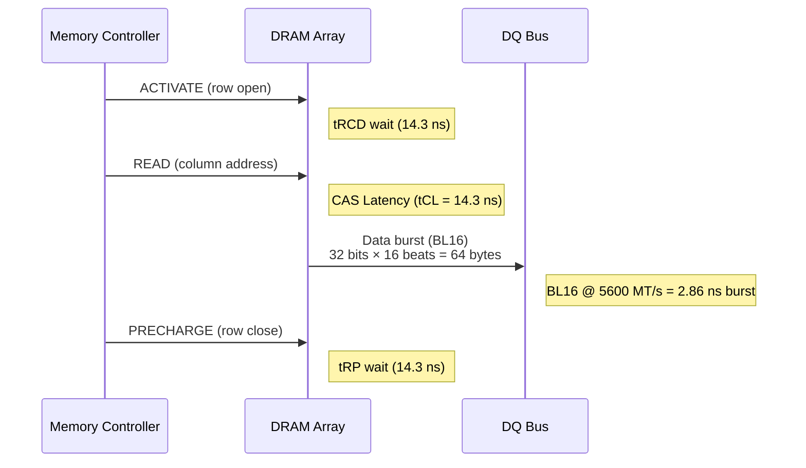

# DDR5 & LPDDR5/5X — JEDEC Memory Standards

**Topic:** DDR5 SDRAM architecture; JEDEC JESD79-5 specification; LPDDR5/5X (JESD209-5B); timing parameters; sub-channel architecture; on-die ECC; PMIC; training and calibration; signal integrity  
**Standards:** JEDEC JESD79-5 (DDR5 SDRAM), JEDEC JESD79-5A/5B (revisions), JEDEC JESD209-5B (LPDDR5/5X), JEDEC JEP178 (DDR5 RAS)  
**SDO:** JEDEC Solid State Technology Association (JC-42 Subcommittee)  
**Audience:** Memory controller designers, SoC architects, BIOS/firmware engineers, signal integrity engineers, board designers, validation engineers  
**Prerequisites:** DRAM fundamentals (row/column/bank), DDR4 architecture, signal integrity basics, timing diagrams

---

## Chapter 1 — Historical Context & Origin Story

### 1.1 DDR Evolution

| Generation | Year | Data Rate | VDD | Key Innovation |
|:----------:|:----:|:---------:|:---:|----------------|
| DDR (DDR1) | 2000 | 200-400 MT/s | 2.5V | Double data rate (both edges); 2n prefetch |
| DDR2 | 2003 | 400-1066 MT/s | 1.8V | 4n prefetch; on-die termination (ODT) |
| DDR3 | 2007 | 800-2133 MT/s | 1.5V | 8n prefetch; fly-by topology; write leveling |
| DDR4 | 2012 | 1600-3200 MT/s | 1.2V | Bank groups; POD signaling; 3DS stacking |
| **DDR5** | **2020** | **3200-8800 MT/s** | **1.1V** | **16n prefetch; dual sub-channels; on-die ECC; PMIC; DFE** |

### 1.2 LPDDR Evolution (Mobile/Embedded)

| Generation | Year | Data Rate | VDD/VDDQ | Key Feature |
|:----------:|:----:|:---------:|:---------:|-------------|
| LPDDR3 | 2012 | 1600-2133 Mbps | 1.2V / 1.2V | WIO-2 stacking option |
| LPDDR4 | 2014 | 3200 Mbps | 1.1V / 1.1V | Dual 16-bit channels; low-power ODT |
| LPDDR4X | 2017 | 4267 Mbps | 1.1V / 0.6V | Lower VDDQ for I/O power savings |
| LPDDR5 | 2019 | 6400 Mbps | 1.05V / 0.5V | DVFSC; bank groups; WCK/CK |
| **LPDDR5X** | **2022** | **8533-9600 Mbps** | **1.05V / 0.5V** | **Higher speed; adaptive refresh; ECS** |
| LPDDR6 | ~2027 | 14400+ Mbps | TBD | Expected: PRAC; higher density |

### 1.3 Why DDR5 Was Necessary

| DDR4 Limitation | DDR5 Solution |
|:---:|---|
| Bandwidth ceiling (DDR4-3200 = 25.6 GB/s max) | DDR5 doubles speed (DDR5-5600 baseline = 44.8 GB/s); roadmap to 8800 MT/s |
| Single 64-bit channel (bus utilization inefficient for small accesses) | Dual 32-bit sub-channels (better utilization; 2 independent accesses) |
| No on-die error correction | On-die ECC (SECDED per 128-bit internal access): catches single-bit errors INSIDE die before data reaches pins |
| Motherboard voltage regulators (VRM) for each DIMM slot | PMIC on DIMM: finer voltage control; better efficiency; reduced motherboard complexity |
| No per-DIMM power management IC | DDR5 DIMM SPD hub (I3C interface) for advanced thermal/config management |
| Max 16 Gbit die density practical | DDR5 targets 64 Gbit die; enables 256 GB DIMMs |

---

## Chapter 2 — DDR5 Architecture

### 2.1 DDR5 DIMM Physical Architecture

```mermaid
graph LR
    subgraph "DDR5 DIMM (288-pin)"
        subgraph "Sub-Channel A (32-bit)"
            DQA[DQ[31:0]<br/>32 data pins]
            ECAA[ECC (optional)<br/>8 additional pins]
        end
        
        subgraph "Sub-Channel B (32-bit)"
            DQB[DQ[31:0]<br/>32 data pins]
            ECAB[ECC (optional)<br/>8 additional pins]
        end
        
        subgraph "Control"
            CA[CA[13:0]<br/>Command/Address<br/>(shared bus)]
            CS[CS#[1:0]<br/>Chip Select]
            CK[CK_t/CK_c<br/>Differential clock]
        end
        
        subgraph "Power"
            PMIC_D[PMIC<br/>━━━━━━━━━━━<br/>VDD (1.1V)<br/>VDDQ (1.1V)<br/>VPP (1.8V)]
            SPD_H[SPD Hub<br/>━━━━━━━━━━━<br/>I3C interface<br/>Thermal sensor<br/>Configuration]
        end
    end
```

### 2.2 Bank Architecture

| Parameter | DDR4 | DDR5 |
|:---------:|:----:|:----:|
| Bank groups | 4 | **8** |
| Banks per group | 4 | 4 |
| Total banks | 16 | **32** |
| Rows per bank | 64K-128K | 64K-128K |
| Column bits | 10 | 10 |
| Page size (per sub-ch) | 1 KB (8Gbit; x8) | **1 KB** (per sub-channel) |
| Internal prefetch | 8n (64-bit) | **16n** (32-bit × 16 = 512 bits internally) |
| Burst length | BL8 (OTF BL4) | **BL16** (OTF BL8/BL32) |

### 2.3 Timing Parameters (DDR5-5600)

| Parameter | Symbol | Value (DDR5-5600) | Description |
|:---------:|:------:|:-----------------:|-------------|
| CAS Latency | tCL | 40 (14.28 ns) | Delay from read command to data output |
| RAS to CAS | tRCD | 40 (14.28 ns) | Delay from row activate to column access |
| Row Precharge | tRP | 40 (14.28 ns) | Delay from precharge to next activate |
| Activate to Activate | tRC | 80 (28.57 ns) | Minimum cycle: tRAS + tRP |
| Row Active Time | tRAS | 40 (14.28 ns) | Minimum time row is active |
| Refresh Period | tREFI | 3.9 μs (standard) | Interval between refresh commands |
| Refresh Cycle | tRFC | 295 ns (16 Gbit) | Time to complete refresh |
| tFAW | tFAW | 20 (7.14 ns) | Four Activate Window |

### 2.4 On-Die ECC (ODECC)

| Aspect | Detail |
|--------|--------|
| **Purpose** | Correct single-bit errors INSIDE the DRAM die before data reaches the DQ pins |
| **Mechanism** | Internal data path is wider than external: 128-bit internal + 8 ECC bits = 136 bits → SECDED correction → 128 bits output |
| **Coverage** | Single-bit errors from: cell charge leakage, VRT (Variable Retention Time), weak cells, particle strikes (soft errors) |
| **Transparency** | Invisible to memory controller; controller sees only 32/64-bit data bus; errors corrected silently inside die |
| **NOT a replacement for** | System-level ECC (x72 DIMM with 8 ECC bits per sub-channel); on-die ECC handles internal die errors; system ECC handles bus/controller errors |
| **Reporting** | No error reporting to host (transparent correction); ECS (Error Check Scrub) mode can report error counts |

---

## Chapter 3 — Technical Deep Dive

### 3.1 Sub-Channel Architecture

```mermaid
flowchart TB
    MC[Memory Controller<br/>━━━━━━━━━━━<br/>2 independent sub-channel controllers<br/>Each manages 32-bit data path<br/>Independent scheduling per sub-channel]
    
    MC --> SCA[Sub-Channel A<br/>━━━━━━━━━━━<br/>DQ[31:0] + DQS + DM<br/>Independent address decode<br/>Independent bank state machines<br/>Independent timing constraints]
    
    MC --> SCB[Sub-Channel B<br/>━━━━━━━━━━━<br/>DQ[31:0] + DQS + DM<br/>Independent address decode<br/>Independent bank state machines<br/>Independent timing constraints]
    
    SCA --> RAMA[DRAM Dies (Sub-Ch A)<br/>8 × x4 or 4 × x8 devices<br/>32-bit total]
    
    SCB --> RAMB[DRAM Dies (Sub-Ch B)<br/>8 × x4 or 4 × x8 devices<br/>32-bit total]
```

**Key benefit of dual sub-channels:**
- DDR4: 64-bit bus; read of 64-byte cache line = BL8 × 64 bits = 512 bits = 64 bytes. ONE transaction monopolizes the bus.
- DDR5: Two 32-bit sub-channels; each delivers BL16 × 32 bits = 512 bits = 64 bytes. BOTH sub-channels can service DIFFERENT requests simultaneously.
- Result: better queue scheduling; higher effective utilization; lower average latency for mixed workloads.

### 3.2 Command/Address Protocol

| DDR4 | DDR5 |
|:----:|:----:|
| CA bus: dedicated RAS#, CAS#, WE#, A0-A17, BA0-1, BG0-1 | **CA bus: 14-bit multiplexed CA[13:0]** (all commands encoded on single bus) |
| Commands: 1 clock cycle per command | **Commands: 2-cycle (2-tick) encoding** on 14-bit bus → 28 bits per command |
| Separate CS# per rank | CS# per sub-channel per rank |

### 3.3 Training and Calibration

| Training Step | Purpose | When |
|:---:|---|---|
| **Write Leveling** | Align DQS to CK at DRAM (compensate flight-time differences) | Boot; temperature change |
| **Read Leveling (DQS gate training)** | Find optimal sampling point for read DQS | Boot |
| **Write/Read DQ-DQS centering** | Center data sampling within DQS window (per bit) | Boot |
| **VREF training** | Calibrate receiver voltage reference (per bit) | Boot; periodic |
| **Command/Address training** | Ensure CA bus reliable at speed | Boot |
| **DFE training** | Decision Feedback Equalizer tap weight optimization | Boot; speed change |
| **ZQ calibration** | Impedance calibration (output driver / ODT) | Boot; periodic (temperature) |

### 3.4 DDR5 PMIC

| Feature | Detail |
|:-------:|--------|
| **Location** | On DIMM (not on motherboard) |
| **Inputs** | 12V from motherboard power rail (single input) |
| **Outputs** | VDD (1.1V core); VDDQ (1.1V I/O); VPP (1.8V wordline boost) |
| **Why on-DIMM** | (1) Shorter power delivery network → less droop/noise. (2) Per-DIMM voltage margining possible. (3) Motherboard simplified (fewer VRMs per slot). (4) Power telemetry per DIMM (current/temp monitoring). |
| **Standard** | JEDEC JESD301 (PMIC specification for DDR5) |
| **Interface** | I3C (to SPD hub and host BMC for monitoring/control) |

---

## Chapter 4 — LPDDR5/5X Deep Dive

### 4.1 LPDDR5X Architecture

| Parameter | LPDDR5 | LPDDR5X | Unit |
|:---------:|:------:|:-------:|:----:|
| Max data rate | 6400 | **9600** | Mbps |
| VDD | 1.05 | 1.05 | V |
| VDDQ | 0.5 | **0.5** | V |
| Data bus width (per channel) | 16 | 16 | bits |
| Channels (per die) | 2 | 2 | — |
| Burst length | 16/32 | 16/32 | — |
| Bank architecture | 8 banks per BG; 4 BGs | Same | — |
| WCK:CK ratio | 4:1 | **4:1** | — |
| Prefetch | 16n/32n | 16n/32n | — |

### 4.2 LPDDR5X Power Features

| Feature | Description |
|:-------:|-------------|
| **DVFSC** (Dynamic Voltage Frequency Scaling of Clock) | Change frequency without reinitializing; enables power-saving at low workloads |
| **DSM** (Deep Sleep Mode) | Minimal power retention mode; DQ/CA tri-stated; ~μW retention |
| **Adaptive Refresh** | Temperature-proportional refresh (less frequent when cool; saves power) |
| **Per-bank refresh** | Refresh one bank while others remain accessible (reduces refresh penalty) |
| **Write-X** | Masked write with "don't-care" bits; reduces bus activity (power) |
| **VDDQ = 0.5V** | Extremely low I/O voltage → I/O power ∝ V²; 0.5V vs 1.1V (DDR5) → ~80% I/O power reduction |
| **WCK** (Write Clock) | Forwarded clock from controller to DRAM for write timing; eliminates need for DLL in DRAM |

### 4.3 LPDDR5X vs. DDR5 Comparison

| Dimension | DDR5 | LPDDR5X |
|:---------:|:----:|:-------:|
| Target market | Server, desktop, workstation | Mobile, embedded, automotive, laptop |
| Form factor | DIMM (replaceable) | Package-on-Package (soldered) |
| Max capacity | 256 GB/DIMM (roadmap) | 32 GB typical (package) |
| Power priority | Performance first | **Power efficiency first** |
| VDD/VDDQ | 1.1V / 1.1V | 1.05V / **0.5V** |
| Data rate | Up to 8800 MT/s | Up to **9600 Mbps** |
| Channel width | 32-bit (sub-channel) | 16-bit (per channel) |
| Refresh | Standard (all-bank) | Adaptive + per-bank |
| Temperature handling | TSOD (Thermal Sensor) | On-die temp sensor + adaptive refresh |
| Signaling | Decision Feedback EQ | WCK forwarded clock |

---

## Chapter 5 — Signal Integrity & Board Design

### 5.1 DDR5 Signal Integrity Challenges

| Challenge | DDR5 Impact | Mitigation |
|:---------:|---|---|
| **Higher data rate** | Eye closure at 4800-8800 MT/s; ISI (Inter-Symbol Interference) | DFE at receiver; CTLE at transmitter |
| **Channel loss** | PCB traces attenuate high-frequency signals | Shorter trace lengths; better dielectric (Megtron 6+); matched impedance |
| **Crosstalk** | Adjacent DQ pins couple at high speeds | Guard grounds between aggressor/victim pairs; differential routing |
| **Power supply noise** | PMIC switching noise couples to signal | On-DIMM decoupling; PMIC placement; power plane design |
| **Impedance matching** | Reflections at impedance discontinuities | 40Ω terminated signaling (DDR5 POD); careful via/connector design |
| **Clock jitter** | Data eye narrowing | Low-jitter clock sources; DLL/PLL design |
| **Thermal** | Junction temperature affects timing margins | Thermal monitoring (SPD hub); DRAM thermal throttle |

### 5.2 DDR5 Topology

| Topology | Description | Use Case |
|:--------:|-------------|:--------:|
| **1DPC (1 DIMM per channel)** | Single DIMM directly connected to controller; best signal integrity | High-speed (DDR5-6400+) |
| **2DPC (2 DIMMs per channel)** | Two DIMMs on channel; stub limits speed; needs careful layout | Server (capacity priority; DDR5-4800) |
| **Direct-attach (LPDDR)** | Memory soldered on substrate/PoP; shortest interconnect; best SI | Mobile/embedded (LPDDR5X-9600) |

### 5.3 Eye Diagram Requirements (DDR5-5600)

| Parameter | Spec | Note |
|:---------:|:----:|------|
| Data eye width | > 0.45 UI (at receiver) | 1 UI = ~179 ps at 5600 MT/s |
| Data eye height | > 150 mV (after DFE) | Minimum voltage margin |
| Setup time | > 50 ps | Data valid before sampling edge |
| Hold time | > 50 ps | Data valid after sampling edge |
| Total jitter (TJ) | < 0.35 UI | Combined deterministic + random |
| DFE taps | 1-4 taps | Corrects post-cursor ISI |

---

## Chapter 6 — DDR5 RAS (Reliability, Availability, Serviceability)

### 6.1 ECC Hierarchy

```mermaid
graph TB
    subgraph "Level 1: On-Die ECC"
        ODECC[DRAM Internal<br/>━━━━━━━━━━━<br/>128-bit data + 8 ECC bits<br/>SECDED per 128-bit granule<br/>Transparent to host<br/>Corrects: weak cells, VRT, soft errors]
    end
    
    subgraph "Level 2: System ECC (DIMM)"
        SECC[Memory Controller ECC<br/>━━━━━━━━━━━<br/>x72 DIMM (64 data + 8 ECC per sub-ch)<br/>SECDED per 32-byte transfer<br/>Reported to host OS/BMC<br/>Corrects: bus errors, multi-bit die errors]
    end
    
    subgraph "Level 3: Chipkill / SDDC"
        CHIPKILL[Advanced ECC<br/>━━━━━━━━━━━<br/>Single Device Data Correction (SDDC)<br/>Survives entire DRAM chip failure<br/>Requires x4 DRAM + wide ECC<br/>Enterprise servers only]
    end
    
    subgraph "Level 4: Memory Mirroring / Sparing"
        MIRROR[Redundancy<br/>━━━━━━━━━━━<br/>Rank mirroring: duplicate data<br/>Rank sparing: hot spare rank<br/>ADDDC: Adaptive Double DRAM Correction<br/>Post-Package Repair (PPR)]
    end
    
    ODECC --> SECC --> CHIPKILL --> MIRROR
```

### 6.2 RAS Features

| Feature | Description | DDR5 Support |
|:-------:|-------------|:---:|
| **On-die ECC** | Internal single-bit correction | Standard |
| **ECS (Error Check & Scrub)** | DRAM periodically scrubs rows; reports error counts to host | Standard |
| **PPR (Post-Package Repair)** | Remap failed rows to spare rows inside DRAM | Hard PPR (permanent) + Soft PPR (temporary) |
| **SDDC (Single Device Data Correction)** | Tolerate complete failure of one x4 DRAM device in rank | x4 RDIMM configuration |
| **ADDDC (Adaptive Double Device Data Correction)** | Isolate failed device + continue with double-device correction | Enterprise (Intel Xeon) |
| **Bounded fault** | Guaranteed maximum error propagation from single DRAM fault | Specified in JEDEC |
| **CRC (Link CRC)** | DDR5 Write CRC and Read CRC (optional) | Detects link errors |

---

## Chapter 7 — DDR5 vs. Competitors

| Dimension | DDR5 | LPDDR5X | HBM3 | GDDR6X | CXL-attached DDR |
|:---------:|:----:|:-------:|:----:|:------:|:-----------------:|
| **Bandwidth** | 67 GB/s/ch | 9.6 GB/s/ch (76.8 x64) | 819 GB/s/stack | ~1.1 TB/s | 32 GB/s/port |
| **Latency** | ~50-80 ns | ~60-100 ns | ~20-30 ns | ~variable | ~150-250 ns |
| **Capacity** | 256 GB/DIMM | 32 GB | 24-64 GB/stack | 24 GB | TB-scale pools |
| **Cost/bit** | $ | $$ | $$$$ | $$$ | $ |
| **Power/bit** | Medium | Low | High | High | Medium |
| **Flexibility** | DIMM (swappable) | Soldered | Stacked on interposer | BGA | Fabric-attached |
| **Best for** | General compute; servers | Mobile; embedded; laptop | AI/GPU; HPC | Gaming GPU | Memory pooling; expansion |

---

## Chapter 8 — Mermaid Architecture Diagrams

### 8.1 DDR5 Memory Controller Architecture

```mermaid
graph TB
    CPU[CPU Core Complex]
    
    CPU --> LLC[Last Level Cache (L3)<br/>━━━━━━━━━━━<br/>Cache line: 64 bytes<br/>Writeback policy<br/>Inclusive/Exclusive]
    
    LLC --> MC[DDR5 Memory Controller<br/>━━━━━━━━━━━<br/>Per sub-channel:<br/>• Command scheduler (FR-FCFS)<br/>• Bank state tracker (32 banks)<br/>• Read/Write turn-around<br/>• Refresh controller<br/>• ECC encode/decode<br/>• Training engine (PHY control)]
    
    MC --> PHY_A[DDR5 PHY (Sub-Ch A)<br/>━━━━━━━━━━━<br/>• TX driver (POD 40Ω)<br/>• RX sampler (DFE 4-tap)<br/>• DLL (DQS alignment)<br/>• VREF DAC (per-bit)<br/>• Write leveling logic<br/>• ZQ calibration]
    
    MC --> PHY_B[DDR5 PHY (Sub-Ch B)<br/>━━━━━━━━━━━<br/>• Same as Sub-Ch A<br/>• Independent timing<br/>• Independent VREF]
    
    PHY_A --> DIMM_A[DDR5 DIMM Sub-Ch A<br/>━━━━━━━━━━━<br/>DQ[31:0] + ECC[7:0]<br/>4/8 DRAM devices<br/>+ PMIC + SPD Hub]
    
    PHY_B --> DIMM_B[DDR5 DIMM Sub-Ch B<br/>━━━━━━━━━━━<br/>DQ[31:0] + ECC[7:0]<br/>4/8 DRAM devices]
```

### 8.2 DDR5 Read Timing



---

## Chapter 9 — Case Studies

### 9.1 Server DDR5 Deployment: Intel Xeon Sapphire Rapids

| Aspect | Detail |
|--------|--------|
| **Platform** | Intel Xeon 4th Gen (Sapphire Rapids); first DDR5 server platform |
| **Memory config** | 8 channels; 1DPC or 2DPC; DDR5-4800 (2DPC) or DDR5-5600 (1DPC) |
| **Max capacity** | 8 channels × 2 DIMMs × 256 GB = 4 TB per socket |
| **RAS features** | On-die ECC + System ECC (SDDC) + ADDDC + PPR + Patrol Scrub |
| **Performance** | 8 channels × DDR5-4800 = 307 GB/s per socket (vs. 204 GB/s DDR4-3200 8ch) → 50% bandwidth increase |
| **Challenges** | (1) Early DDR5-4800 DIMMs had higher latency than mature DDR4-3200 (tCL in ns similar). (2) 2DPC reduces speed to 4800 (vs 5600 1DPC). (3) DDR5 DIMM cost premium (PMIC + SPD hub add BOM cost). |
| **Lesson** | DDR5 initial advantage is BANDWIDTH, not latency. Applications benefiting: HPC, AI training, database (bandwidth-hungry). Applications not benefiting: latency-sensitive pointer-chasing workloads (linked lists, graph traversal) |

### 9.2 Mobile LPDDR5X: Qualcomm Snapdragon 8 Gen 3

| Aspect | Detail |
|--------|--------|
| **SoC** | Snapdragon 8 Gen 3; 4nm; integrated LPDDR5X controller |
| **Memory** | 16 GB LPDDR5X-9600 (4× 16-bit channels = 64-bit total) |
| **Bandwidth** | 9600 Mbps × 64 bits / 8 = 76.8 GB/s (peak) |
| **Power optimization** | (1) DVFSC: changes frequency 400 MHz → 2400 MHz based on load (idle → gaming). (2) Per-bank refresh: only refreshes needed banks. (3) Partial array self-refresh: retains only active data during light sleep. (4) VDDQ = 0.5V: I/O power 80% lower than DDR5 equivalent. |
| **AI workload** | On-device LLM inference (7B parameter model in 4-bit = 3.5 GB): fits in 16 GB LPDDR5X. Memory bandwidth critical for token generation (bandwidth-bound inference). 76.8 GB/s → ~20 tokens/sec for 7B model. |
| **Thermal** | DRAM package stacked on SoC (PoP); shared thermal environment. Throttling triggered at 85°C junction: reduces from LPDDR5X-9600 to LPDDR5X-6400 (33% bandwidth reduction). |

---

## Chapter 10 — Future Evolution

| Trend | Timeline | Impact |
|-------|----------|--------|
| **DDR5-8800 / DDR5-9200** | 2025-2026 | JEDEC speeds; DFE essential; 1DPC only |
| **DDR5 MR-DIMM (Multiplexed Rank)** | 2024-2025 | Higher capacity: multiple ranks with minimal channel loading |
| **LPDDR5X-10667** | 2025 | Mobile bandwidth continues scaling |
| **LPDDR6** | 2027-2028 | Expected 14.4+ Gbps; new architecture (PRAC, etc.) |
| **DDR6** | 2028-2030 | Post-DDR5: expected PAM4 signaling; 12800+ MT/s |
| **CXL memory tiering** | 2024-2025 | DDR5 as fast tier + CXL-DDR4 as capacity tier; OS-transparent |
| **Processing-in-Memory (PIM)** | 2025-2027 | Logic near/in DRAM (HBM-PIM, GDDR-PIM); reduces data movement |
| **3DS stacking (DDR5)** | 2024-2025 | Through-Silicon Via stacking for higher density DIMMs |
| **Persistent DDR5** | 2025+ | Battery-backed DDR5 or CXL persistent memory replacing Optane |

---

## Chapter 11 — Interview Questions & Career Guide

### Tier 1: Entry-Level

**Q1:** What are the key architectural differences between DDR4 and DDR5?

**A:** The five fundamental architectural changes:

**(1) Dual sub-channels:** DDR4 has single 64-bit channel. DDR5 splits into TWO independent 32-bit sub-channels per DIMM. Each has its own command scheduling, bank state tracking, and timing. Benefit: two independent memory requests serviced simultaneously; higher bus utilization.

**(2) On-die ECC:** DDR5 includes SECDED ECC INSIDE each DRAM die. Internal data path is 136 bits (128 data + 8 ECC) → single-bit errors corrected before reaching DQ pins. Transparent to memory controller. DDR4 had NO on-die ECC (relied entirely on system-level x72 ECC).

**(3) PMIC on DIMM:** DDR5 moves power regulation FROM motherboard TO DIMM. Single 12V input → PMIC generates VDD (1.1V), VDDQ (1.1V), VPP (1.8V). Benefits: shorter power delivery, per-DIMM voltage margining, reduced motherboard VRM count.

**(4) Burst length 16:** DDR4 uses BL8 (8 beats × 64 bits = 64 bytes). DDR5 uses BL16 (16 beats × 32 bits = 64 bytes per sub-channel). Same cache line in both cases, but DDR5 uses more clock cycles at narrower width.

**(5) Higher bank count:** DDR4: 4 bank groups × 4 banks = 16 total. DDR5: 8 bank groups × 4 banks = 32 total. More banks → more parallelism; better row-buffer hit rate.

**Additional:** Decision Feedback Equalization (DFE) required at DDR5-4800+; SPD hub with I3C interface (replacing I2C); reduced voltage (1.1V vs 1.2V).

### Tier 2: Mid-Level

**Q2:** Explain on-die ECC in DDR5. Why is it NOT sufficient for server reliability? What is the full ECC hierarchy?

**A:**

**On-die ECC mechanism:** Inside DDR5 DRAM, the internal array stores more bits than exposed externally. For every 128 bits of user data, 8 additional ECC check bits are stored (SECDED: Single Error Correct, Double Error Detect). When a row is read: 136 bits fetched from array → ECC decoder checks for errors → corrects any single-bit error → outputs clean 128 bits to I/O circuitry → burst out on DQ pins.

**What it catches:** (1) Variable Retention Time (VRT) — cells whose charge leaks faster than refresh interval (intermittent). (2) Weak cells that occasionally flip due to marginal charge. (3) Single-event upsets (particle strikes causing soft errors). (4) Row-hammer-induced single-bit errors (partially).

**Why it's NOT sufficient for servers:**

On-die ECC operates INSIDE the die. But errors can occur OUTSIDE:
- **Bus/signal errors**: Noise or SI issues on DQ traces between DRAM and controller
- **Multi-bit DRAM failures**: If an entire DRAM device (x4 chip) fails, on-die ECC in OTHER chips doesn't help
- **Controller-side errors**: Logic errors in memory controller
- **Multi-bit errors**: On-die ECC only corrects SINGLE-bit; cannot correct multi-bit errors within same 128-bit word

**Full ECC hierarchy for enterprise servers:**

| Level | What | Corrects | Requires |
|:-----:|------|----------|----------|
| **1. On-die ECC** | Inside DRAM | 1-bit per 128-bit internal word | Standard DDR5 (all DIMMs) |
| **2. System ECC** | Memory controller | 1-bit per 64-byte transfer (SECDED across sub-channel) | x72 DIMM (64 data + 8 ECC per 32-bit sub-ch) |
| **3. SDDC (Single Device Data Correction)** | Memory controller | ALL bits from one failed x4 device | x4 RDIMM + advanced ECC logic (Intel/AMD) |
| **4. ADDDC** | Memory controller + spare | Adapts after first device failure; survives second failure in different device | Enterprise firmware + sparing |
| **5. Rank mirroring** | Redundancy | Complete rank failure | 2× memory cost (mirror mode) |
| **6. PPR** | Inside DRAM | Permanent row failures | SPD-initiated; limited spare rows |

**Why ALL levels are needed:** A server running 24/7 for 5 years with 2 TB of DDR5 will statistically encounter: ~10K single-bit errors (caught by on-die ECC silently), ~100 single-bit errors per year escaping to system ECC, ~1-2 device failures over lifetime (needs SDDC), and ~0.1 probability of correlated multi-bit failure (needs mirroring for critical workloads).

### Tier 3: Senior

**Q3:** You're designing a DDR5 memory controller for a high-performance SoC. Describe the key design decisions for the scheduler, PHY, and RAS features. How do you optimize for both bandwidth and latency?

**A:**

**Architecture decisions:**

*Scheduler design (command scheduler):*

The memory controller scheduler determines the order of issuing ACTIVATE, READ, WRITE, PRECHARGE commands to maximize throughput while respecting timing constraints.

**Algorithm: FR-FCFS (First-Ready, First-Come-First-Served):**
1. Priority 1: Ready commands (row already open in target bank → column access immediately)
2. Priority 2: Oldest request first (fairness)
3. Optimization: batch read/write commands to minimize read-to-write / write-to-read turnaround penalties (tWTR, tRTW)

**Key scheduler features:**
- **Per-bank state tracking**: 32 banks × 2 sub-channels = 64 bank state machines. Track: Idle, Active (row X open), Refreshing.
- **Read/Write grouping**: Batch reads together, then switch to writes (minimize turnaround latency: tWTR_L = 12 tCK penalty).
- **Adaptive page policy**: Open-page (keep row active) for streaming workloads; closed-page (auto-precharge) for random workloads. Detect pattern dynamically.
- **Refresh scheduling**: Postpone refresh during burst traffic (up to 8× tREFI postponement allowed per JEDEC); pull-in refresh during idle periods. Per-bank refresh support (REFab → REFpb) to reduce average refresh penalty.
- **QoS arbitration**: Priority levels for different requestors (CPU core, GPU, DMA). High-priority requests bypass FIFO ordering (preemptive scheduling).

*PHY design:*

| Component | Design Choice | Rationale |
|:---------:|---|---|
| **TX driver** | Programmable impedance (34/40/48Ω); push-pull with de-emphasis | Match channel impedance; compensate frequency-dependent loss |
| **RX sampler** | DFE (4-tap minimum for DDR5-5600+) | Cancel post-cursor ISI; open data eye at high speeds |
| **DLL** | Per-sub-channel DLL; 90° phase DQS generation | Accurate read data capture timing |
| **VREF** | Per-bit VREF DAC (6-bit resolution minimum) | Compensate per-bit offset from routing/crosstalk |
| **Write path** | Write CRC generation (optional per JEDEC) | Detect write data corruption on bus |
| **Calibration** | Periodic ZQ calibration; VREF retraining on thermal event | Maintain margins as temperature drifts |
| **Speed binning** | Support DDR5-4800/5200/5600/6400 (gear-down for 2DPC) | Different DIMM configs need different speed |

*RAS features:*

| Feature | Implementation | Performance Impact |
|:-------:|---|---|
| **System ECC** | SECDED per 32-byte sub-channel transfer; syndrome-based correction | ~0 (parallel computation; no latency penalty for correctable errors) |
| **SDDC** | Symbol-based Reed-Solomon code across x4 devices; reconstructs entire failed device data | Slight bandwidth overhead (wider ECC symbol storage) |
| **Patrol scrub** | Background read of all memory addresses; checks ECC; corrects errors before accumulation | ~1-2% bandwidth consumed by background scrub reads |
| **Demand scrub** | On uncorrectable error: retry; attempt correction; log; isolate page | Latency spike on uncorrectable (acceptable; rare) |
| **PPR** | On repeated correctable errors in same row: invoke PPR (remap to spare row); hard PPR is permanent | Brief outage during PPR activation (microseconds) |
| **Error logging** | All correctable/uncorrectable errors logged with: address (bank/row/column), timestamp, syndrome, device | No performance impact; essential for predictive failure analysis |
| **Memory mirroring** | Duplicate all writes to mirror rank; reads from primary; failover to mirror on uncorrectable | 2× capacity cost; no latency penalty for reads; 1 extra write |

*Bandwidth vs. latency optimization:*

These are fundamentally competing goals:
- **Maximum bandwidth**: large queue depth; batch read/writes; open-page policy; tolerate reordering latency
- **Minimum latency**: small queue; prioritize oldest; closed-page (no precharge latency for random); no batching

**Solution: Adaptive scheduling:**
1. Monitor request patterns (row buffer hit rate; queue depth; read/write ratio)
2. If row buffer hit rate > 60%: open-page policy (streaming workload; bandwidth mode)
3. If row buffer hit rate < 30%: closed-page with auto-precharge (random workload; latency mode)
4. If queue depth > 80%: aggressive batching (high utilization; bandwidth priority)
5. If queue depth < 20%: FCFS ordering (low utilization; latency priority)
6. Expose QoS priority levels to SoC: latency-critical requestors (CPU) get priority; bandwidth-tolerant (DMA/GPU) get batched

---

## Chapter 12 — Cheat Sheet & Quick Reference

```
═══════════════════════════════════════════
DDR5 / LPDDR5X — QUICK REFERENCE
═══════════════════════════════════════════

DDR5 KEY NUMBERS:
  Speed: DDR5-4800 to DDR5-8800 (JEDEC)
  Bandwidth: 38.4 – 70.4 GB/s per channel
  VDD: 1.1V | VDDQ: 1.1V | VPP: 1.8V
  Bus width: 2 × 32-bit sub-channels per DIMM
  Burst length: BL16 (32 × 16 = 512 bits = 64B)
  Banks: 8 BG × 4 banks = 32 total
  On-die ECC: Yes (SECDED per 128-bit internal)
  Max DIMM: 256 GB (roadmap; 64 Gbit die × 32 devices)
  Pins: 288-pin DIMM

═══════════════════════════════════════════
LPDDR5X KEY NUMBERS:
  Speed: Up to 9600 Mbps
  Bandwidth: 76.8 GB/s (4×16-bit = 64-bit total)
  VDD: 1.05V | VDDQ: 0.5V (!)
  Channels: 2 per die (16-bit each)
  Power features: DVFSC, DSM, per-bank refresh
  Form factor: PoP (Package-on-Package; soldered)

═══════════════════════════════════════════
DDR5 vs DDR4 DIFFERENCES:
  ✓ Dual 32-bit sub-channels (vs single 64-bit)
  ✓ On-die ECC (vs none)
  ✓ PMIC on-DIMM (vs motherboard VRM)
  ✓ Burst Length 16 (vs BL8)
  ✓ 8 bank groups (vs 4)
  ✓ 1.1V VDD (vs 1.2V)
  ✓ DFE at receiver (vs no equalization)
  ✓ SPD Hub with I3C (vs I2C SPD)
  ✓ 14-bit CA bus multiplexed (vs dedicated)

═══════════════════════════════════════════
TIMING (DDR5-5600 typical):
  tCL = 40 tCK (14.3 ns)
  tRCD = 40 tCK (14.3 ns)
  tRP = 40 tCK (14.3 ns)
  tRAS = 40 tCK (14.3 ns)
  tRC = 80 tCK (28.6 ns)
  tREFI = 3.9 μs
  tRFC = 295 ns (16 Gbit)
  1 tCK = 0.357 ns (at 5600 MT/s)

═══════════════════════════════════════════
ECC HIERARCHY (SERVER):
  Level 1: On-die ECC (inside DRAM; single-bit)
  Level 2: System ECC (controller; x72 DIMM)
  Level 3: SDDC (survives x4 device failure)
  Level 4: ADDDC (survives second failure)
  Level 5: Mirroring/Sparing (rank redundancy)
  Level 6: PPR (row repair inside DRAM)

═══════════════════════════════════════════
TRAINING SEQUENCE (BOOT):
  1. ZQ calibration (impedance)
  2. Command/Address training
  3. Write leveling (DQS-to-CK alignment)
  4. Read gate training (DQS enable)
  5. Write DQ-DQS centering (per bit)
  6. Read DQ-DQS centering (per bit)
  7. VREF training (per bit)
  8. DFE training (tap weights)
  → Total training time: ~100-500 ms

═══════════════════════════════════════════
BANDWIDTH FORMULAS:
  BW = Data_Rate × Bus_Width / 8
  DDR5-5600 (one sub-ch): 5600 × 32 / 8 = 22.4 GB/s
  DDR5-5600 (full DIMM): 2 × 22.4 = 44.8 GB/s
  LPDDR5X-9600 (x64): 9600 × 64 / 8 = 76.8 GB/s
  
  Effective BW = Peak × Utilization(~60-80%)
```

---

*End of Document — 01_DDR5_LPDDR5_JEDEC.md*
