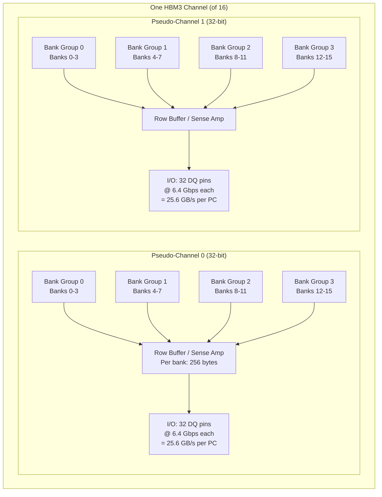
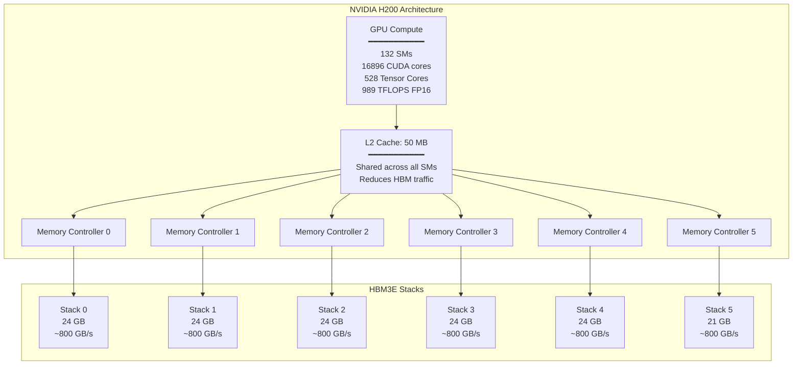

# HBM3, HBM3E & HBM4 — High Bandwidth Memory

**Topic:** High Bandwidth Memory architecture; JEDEC JESD238 (HBM3); HBM3E; HBM4 roadmap; 3D stacking; TSV technology; interposer design; thermal management; AI/HPC memory systems  
**Standards:** JEDEC JESD238 (HBM3), JEDEC JESD235C (HBM2E), JEDEC HBM4 (development)  
**SDO:** JEDEC JC-42.x (Memory Committee), industry collaboration (SK Hynix, Samsung, Micron)  
**Audience:** GPU/ASIC architects, memory system designers, packaging engineers, thermal engineers, AI hardware architects, HPC system designers  
**Prerequisites:** DRAM fundamentals, 2.5D/3D packaging concepts, TSV basics, interposer technology, GPU architecture fundamentals

---

## Chapter 1 — Historical Context & Origin Story

### 1.1 HBM Evolution

| Generation | Year | Standard | BW/stack | Capacity/stack | Dies | Data Rate | I/O Width |
|:----------:|:----:|:--------:|:--------:|:--------------:|:----:|:---------:|:---------:|
| HBM1 | 2013 | JESD235 | 128 GB/s | 4 GB | 4 | 1 Gbps | 1024-bit |
| HBM2 | 2016 | JESD235A | 256 GB/s | 8 GB | 4-8 | 2 Gbps | 1024-bit |
| HBM2E | 2018 | JESD235C | 460 GB/s | 16 GB | 8 | 3.6 Gbps | 1024-bit |
| **HBM3** | **2022** | **JESD238** | **819 GB/s** | **24 GB** | **8-12** | **6.4 Gbps** | **1024-bit** |
| **HBM3E** | **2023** | **JESD238 (enhanced)** | **1.17 TB/s** | **36 GB** | **8-12** | **9.2 Gbps** | **1024-bit** |
| HBM4 | ~2026 | TBD | ~2.5 TB/s | 48-64 GB | 12-16 | ~12 Gbps | **2048-bit** |

### 1.2 Why HBM Was Created

| Problem | Traditional Solution | HBM Solution |
|:-------:|:---:|:---:|
| GPU needs massive bandwidth (>1 TB/s) | GDDR5/6X: many chips around GPU; long traces; high power | HBM: stacked DRAM on interposer; ultra-wide bus (1024-bit); short wires |
| Power for high bandwidth | GDDR6X @ 21 Gbps × 32 bits × 12 chips = high I/O power (long traces) | HBM: very short TSV/μbump connections; much lower I/O power per bit |
| Board area for memory | GDDR chips surround GPU; large PCB area | HBM: stacked vertically; placed on silicon interposer next to GPU; minimal footprint |
| Pin count limitation | Package has limited BGA pins for off-chip memory | HBM: 1024-bit bus through TSVs (no package pins needed; through interposer) |

### 1.3 Key Milestones

| Year | Event | Significance |
|------|-------|-------------|
| 2011 | AMD/SK Hynix announce HBM project | Industry collaboration begins |
| 2013 | JEDEC JESD235 (HBM1) | First standard; AMD Fiji GPU (Fury X) |
| 2016 | HBM2 in NVIDIA P100 | HBM enters AI training mainstream |
| 2018 | HBM2E extends to 3.6 Gbps | AMD MI100; NVIDIA A100 (40 GB HBM2E or 80 GB HBM2E) |
| 2020 | NVIDIA A100 80 GB (5 stacks HBM2E) | 2 TB/s aggregate; AI training workhorse |
| 2022 | **HBM3 in NVIDIA H100** | 80 GB; 3.35 TB/s aggregate; 6.4 Gbps/pin |
| 2023 | **HBM3E in NVIDIA H200** | 141 GB; 4.8 TB/s; 8-hi stacks; first 12-die option |
| 2024 | SK Hynix HBM3E 12-hi (36 GB/stack) | Shipping for NVIDIA B100/B200 |
| 2025 | Samsung/SK Hynix HBM4 sampling | 2048-bit interface; next architecture |

---

## Chapter 2 — HBM3 Architecture

### 2.1 Physical Stack Structure

```mermaid
graph TB
    subgraph "HBM3 Stack (8-die)"
        DIE8[DRAM Die 8 (top)]
        DIE7[DRAM Die 7]
        DIE6[DRAM Die 6]
        DIE5[DRAM Die 5]
        DIE4[DRAM Die 4]
        DIE3[DRAM Die 3]
        DIE2[DRAM Die 2]
        DIE1[DRAM Die 1 (bottom)]
        BASE[Logic/Base Die<br/>━━━━━━━━━━━<br/>• PHY (receivers/drivers)<br/>• ECC logic<br/>• Test logic (BIST)<br/>• Repair/redundancy logic<br/>• Thermal sensor<br/>• Mode register interface]
    end
    
    subgraph "Interconnect"
        TSV[Through-Silicon Vias (TSVs)<br/>━━━━━━━━━━━<br/>• ~5000+ TSVs per die<br/>• 1024 data + control<br/>• Pitch: 25-30 μm<br/>• Connected by μbumps<br/>  between adjacent dies]
    end
    
    subgraph "Package Integration"
        INTERPOSER[Silicon Interposer<br/>━━━━━━━━━━━<br/>• Passive silicon (65nm or larger)<br/>• Metal routing layers<br/>• Connects HBM stack to GPU<br/>• ~1000 signal traces<br/>• Very short (~1-5 mm)]
        
        GPU[GPU / AI Accelerator Die<br/>━━━━━━━━━━━<br/>• Memory controller (per stack)<br/>• PHY interface<br/>• Connected via interposer]
    end
    
    DIE8 --- DIE7 --- DIE6 --- DIE5 --- DIE4 --- DIE3 --- DIE2 --- DIE1 --- BASE
    BASE --- TSV
    TSV --- INTERPOSER
    INTERPOSER --- GPU
```

### 2.2 Channel Architecture

| Parameter | HBM2E | **HBM3** |
|:---------:|:-----:|:--------:|
| Pseudo-channels per stack | 16 (8 channels × 2 PC) | **32** (16 channels × 2 PC) |
| Channel data width | 128-bit (64-bit per PC) | **64-bit** (32-bit per PC) |
| Total I/O width | 1024-bit | **1024-bit** |
| Independent channels | 8 | **16** |
| Data rate | 3.6 Gbps | **6.4 Gbps** |
| Bandwidth/stack | 460 GB/s | **819 GB/s** |
| Burst length | BL4 | **BL8** (supports BL4 for low-latency mode) |
| Bank groups per channel | 4 | **4** |
| Banks per BG | 4 | **4** |
| Total banks per channel | 16 | **16** |

### 2.3 HBM3 Key Features

| Feature | Description |
|:-------:|-------------|
| **16 independent channels** | Doubled from HBM2's 8 channels; each channel independently addressable; better fine-grained parallelism |
| **Per-channel ECC** | Inline ECC for each channel (data integrity without external ECC DIMM overhead) |
| **RAS features** | ECS (Error Check & Scrub); PPR (Post-Package Repair); temperature-based refresh |
| **ODECC** | On-die ECC within each DRAM die (same concept as DDR5) |
| **MPC (Multi-Purpose Command)** | Flexible command encoding for new features |
| **DBI (Data Bus Inversion)** | Reduces I/O switching activity → lower power |
| **Refresh management** | Per-bank refresh; temperature-proportional refresh rate |

---

## Chapter 3 — Technical Deep Dive

### 3.1 Through-Silicon Via (TSV) Technology

| Parameter | HBM2 | HBM3 | HBM4 (expected) |
|:---------:|:----:|:----:|:---:|
| TSV diameter | 5-6 μm | **4-5 μm** | <4 μm |
| TSV pitch | 40-50 μm | **25-30 μm** | <20 μm |
| TSV density | ~1500/die | **~5000/die** | >8000/die |
| μbump pitch | 40 μm | **25-30 μm** | <20 μm |
| Die thickness | 30-40 μm | **25-30 μm** | <25 μm |
| Stack height | ~480 μm (8-die) | **~400 μm (8-die)** | ~350 μm |
| Bonding | TC-NCF / MR-MUF | **MR-MUF / Hybrid bonding** | Hybrid bonding |

### 3.2 Signal Path: GPU to DRAM Cell

```
GPU Memory Controller → PHY (TX driver) → Interposer trace (~2-5 mm) → 
μbump (interposer↔base die) → Base die routing → TSV (base↔die 1) → 
μbump → DRAM Die 1 internal wiring → TSV → Die 2 → ... → 
Target DRAM Die → Local metal → Sense amplifier → DRAM cell
```

| Segment | Distance | Delay | Power |
|:-------:|:--------:|:-----:|:-----:|
| GPU PHY → interposer | ~2-5 mm | ~50-100 ps | Low (short wire) |
| Interposer → base die | μbump (25 μm) | ~10 ps | Negligible |
| Base die → target die (TSV chain) | ~200-400 μm total | ~50-100 ps | Very low |
| Within DRAM die (to cell) | ~2-5 mm (metal routing) | ~1-2 ns | Moderate (internal) |
| **Total access latency** | — | **~20-30 ns** | **~3-5 pJ/bit** |

### 3.3 Bandwidth Calculation

$$BW_{stack} = DataRate \times IOWidth / 8$$

For HBM3:
$$BW = 6.4 \text{ Gbps} \times 1024 \text{ bits} / 8 = 819.2 \text{ GB/s per stack}$$

For HBM3E (9.2 Gbps):
$$BW = 9.2 \text{ Gbps} \times 1024 \text{ bits} / 8 = 1177.6 \text{ GB/s per stack}$$

For system with 6 stacks (e.g., NVIDIA H200):
$$BW_{total} = 6 \times 1177.6 = 4.8 \text{ TB/s aggregate}$$

### 3.4 Power Efficiency

| Metric | GDDR6X (reference) | HBM3 | HBM3E |
|:------:|:---:|:---:|:---:|
| Energy per bit (pJ/bit) | ~15-20 pJ/bit | **~3.5 pJ/bit** | **~3.0 pJ/bit** |
| Power for 1 TB/s | ~15-20 W per TB/s | **~3.5 W per TB/s** | **~3.0 W per TB/s** |
| Total stack power | — | ~15-20 W (per stack) | ~20-25 W |
| Stack bandwidth | — | 819 GB/s | 1.17 TB/s |
| BW/W ratio | ~50-65 GB/s/W | **~50 GB/s/W** | **~47 GB/s/W** |

The power efficiency advantage of HBM comes from:
1. **Short interconnect**: TSVs + interposer (~mm) vs GDDR PCB traces (~30-50 mm)
2. **Low voltage swing**: ~0.3-0.5V (on interposer) vs ~1.0V (GDDR6X PAM4)
3. **Wide bus / low frequency**: 1024-bit @ 6.4 Gbps vs 32-bit @ 21 Gbps (less per-pin energy)
4. **No equalization needed**: Short channel → no DFE/CTLE power overhead

---

## Chapter 4 — HBM3E and HBM4

### 4.1 HBM3E Improvements over HBM3

| Parameter | HBM3 | HBM3E | Improvement |
|:---------:|:----:|:-----:|:-----------:|
| Data rate | 6.4 Gbps | **9.2 Gbps** (up to 9.8) | +44% |
| Bandwidth/stack | 819 GB/s | **1.17 TB/s** | +43% |
| Capacity (8-die) | 24 GB | **24 GB** | Same |
| Capacity (12-die) | — | **36 GB** | +50% (12-hi option) |
| Power/bit | ~3.5 pJ/bit | **~3.0 pJ/bit** | -14% |
| TSV pitch | 25-30 μm | **22-25 μm** | Tighter |
| ECC | Channel ECC | **Enhanced ECC + RAS** | Improved reliability |
| Thermal | Thermal sensor | **Enhanced thermal management** | Better cooling |

### 4.2 HBM4 Architecture (Expected ~2026)

| Parameter | HBM3E | **HBM4** (expected) |
|:---------:|:-----:|:---:|
| I/O width | 1024-bit | **2048-bit** (doubled!) |
| Data rate | 9.2 Gbps | ~12 Gbps |
| Bandwidth/stack | 1.17 TB/s | **~2.5-3.0 TB/s** |
| Capacity/stack | 36 GB (12-hi) | **48-64 GB** (12-16 hi) |
| Interface split | Fixed base die logic | **Logic die may be custom per customer** |
| TSV pitch | 22-25 μm | **<20 μm** |
| Bonding | MR-MUF | **Hybrid bonding (direct Cu-Cu)** |
| Integration | Interposer (2.5D) | Interposer OR **direct 3D on GPU** |
| Die count | 8-12 | 12-16 |

### 4.3 HBM4 Key Architectural Change: Custom Base Die

```mermaid
graph LR
    subgraph "HBM3/3E (Standard Base Die)"
        DRAM_3[8-12 DRAM Dies<br/>(standard)]
        BASE_3[Standard Base Die<br/>━━━━━━━━━━━<br/>Designed by HBM vendor<br/>(SK Hynix / Samsung)<br/>Fixed PHY + logic<br/>Same for all customers]
        DRAM_3 --- BASE_3
    end
    
    subgraph "HBM4 (Custom Base Die)"
        DRAM_4[12-16 DRAM Dies<br/>(standard from vendor)]
        BASE_4[Custom Logic Die<br/>━━━━━━━━━━━<br/>Designed by GPU vendor<br/>(NVIDIA / AMD / custom)<br/>Custom PHY + error handling<br/>+ compute-near-memory<br/>+ custom ECC/RAS<br/>+ interface optimization]
        DRAM_4 --- BASE_4
    end
```

This is a major shift: GPU vendors (NVIDIA, AMD) can design their OWN base/logic die optimized for their memory controller. DRAM vendor provides only the stacked DRAM dies. This enables:
- Custom PHY optimized for specific GPU
- Compute-near-memory (processing in base die)
- Custom ECC algorithms
- Custom power management
- Better integration with GPU architecture

---

## Chapter 5 — Packaging & Thermal Challenges

### 5.1 2.5D Integration with Silicon Interposer

```mermaid
graph TB
    subgraph "Top View"
        GPU_T[GPU Die<br/>(~800 mm²)]
        HBM1_T[HBM Stack 1]
        HBM2_T[HBM Stack 2]
        HBM3_T[HBM Stack 3]
        HBM4_T[HBM Stack 4]
        HBM5_T[HBM Stack 5]
        HBM6_T[HBM Stack 6]
    end
    
    subgraph "Cross-Section"
        HS[Heat Spreader / Lid]
        TIM[TIM (Thermal Interface Material)]
        HBM_X[HBM Stacks<br/>(~400μm tall)]
        GPU_X[GPU Die<br/>(~100μm)]
        INTERP[Silicon Interposer<br/>(~100μm; 3-4 metal layers)]
        SUBST[Organic Substrate<br/>(~1mm; BGA)]
        BGA[BGA Balls → PCB]
    end
    
    HS --- TIM --- HBM_X --- INTERP
    TIM --- GPU_X --- INTERP
    INTERP --- SUBST --- BGA
```

### 5.2 Thermal Challenges

| Challenge | Cause | Mitigation |
|:---------:|-------|-----------|
| **HBM stack thermal density** | 20-25 W in ~30 mm² footprint; stacked dies trap heat (poor vertical conduction through silicon) | Metallic TIM on top; heat spreader; liquid cooling mandatory |
| **Temperature gradient** | Top dies hotter than bottom (heat flows up through stack to lid) | Temperature-proportional refresh (top dies refresh more often) |
| **Interposer thermal** | GPU (300-700 W) next to HBM on same interposer; lateral heat conduction | Thermal guard ring between GPU and HBM; spatial separation |
| **Die thinning limits** | Thinner dies (25-30 μm) are more fragile; handling/bonding challenges | Process improvement; carrier wafer techniques |
| **TIM junction** | HBM stack top and GPU die top at different heights (step); lid must contact both | Variable-height TIM application; stepped lid design |

### 5.3 Thermal Management in Practice (NVIDIA H100)

| Component | Detail |
|:---------:|--------|
| GPU die | ~814 mm² (4nm); 700 W TDP |
| HBM3 stacks | 6 stacks; ~15 W each; ~90 W total for memory |
| Cooling | Liquid cooling mandatory at full power; air cooling limited to lower clocks |
| HBM junction temp (Tj max) | 95°C specification; throttling begins at 85°C |
| Refresh rate | Increases at high temperature (standard JEDEC thermal refresh) |
| Thermal sensor | Each HBM stack has on-die thermal sensor; GPU reads via JEDEC MR interface; adjusts refresh rate |

---

## Chapter 6 — AI/HPC Memory System Architecture

### 6.1 NVIDIA GPU HBM Configuration

| GPU | Year | HBM Gen | Stacks | Capacity | BW (aggregate) | Interface |
|:---:|:----:|:-------:|:------:|:--------:|:--------------:|:---------:|
| P100 | 2016 | HBM2 | 4 | 16 GB | 732 GB/s | 4096-bit |
| V100 | 2017 | HBM2 | 4 | 32 GB | 900 GB/s | 4096-bit |
| A100 | 2020 | HBM2E | 5 | 80 GB | 2.0 TB/s | 5120-bit |
| **H100** | **2022** | **HBM3** | **6** | **80 GB** | **3.35 TB/s** | **6144-bit** |
| **H200** | **2023** | **HBM3E** | **6** | **141 GB** | **4.8 TB/s** | **6144-bit** |
| B100/B200 | 2024 | HBM3E | 8 | 192 GB | 8.0 TB/s | 8192-bit |

### 6.2 Memory-Bound AI Workloads

| Workload | Memory Pattern | Why HBM Critical |
|:--------:|:--------------:|------------------|
| **LLM inference (decode)** | Read all weights per token; low compute/byte | Memory-bandwidth bound: tokens/sec ∝ BW / model_size |
| **LLM training** | Massive activations + gradients; high BW | Both capacity (activations) and BW (gradient updates) |
| **Recommendation models** | Huge embedding tables (TB-scale); random access | Capacity: embedding tables >> GPU HBM; needs CXL/host offload |
| **Scientific HPC** | Large matrix operations; streaming | BW: FLOP/byte ratio determines if compute or memory bound |
| **Graph neural networks** | Random access patterns; poor locality | Bandwidth AND low-latency random access |

### 6.3 Arithmetic Intensity and Roofline Model

$$\text{Arithmetic Intensity (AI)} = \frac{\text{FLOPs}}{\text{Bytes accessed}}$$

$$\text{Achievable FLOP/s} = \min(\text{Peak FLOP/s}, \text{AI} \times \text{Memory BW})$$

For NVIDIA H100:
- Peak compute: 989 TFLOPS (FP16 Tensor Core)
- Memory BW: 3.35 TB/s (HBM3)
- Ridge point: $989 \text{ TFLOPS} / 3.35 \text{ TB/s} = 295 \text{ FLOP/byte}$

Operations with AI < 295 are **memory-bound** (HBM BW is bottleneck):
- LLM decode: ~1-2 FLOP/byte → heavily memory bound
- Matrix multiply (large): ~500+ FLOP/byte → compute bound
- Attention (long context): ~10-50 FLOP/byte → memory bound

---

## Chapter 7 — Comparison: HBM vs. Alternatives

| Dimension | HBM3E | GDDR6X | DDR5 | LPDDR5X | CXL-DRAM |
|:---------:|:-----:|:------:|:----:|:-------:|:---------:|
| **BW/stack or channel** | 1.17 TB/s | ~1.1 TB/s (12 chips x384) | 67 GB/s/ch | 76.8 GB/s | 32 GB/s/port |
| **Capacity** | 36 GB/stack | 24 GB (total) | 256 GB/DIMM | 32 GB | TB-scale |
| **Cost/GB** | $$$$$ (~$20-30/GB) | $$$ (~$5-8/GB) | $ (~$2-3/GB) | $$ (~$4-6/GB) | $ (~$3-5/GB) |
| **Power efficiency** | 3 pJ/bit | 15-20 pJ/bit | 8-12 pJ/bit | 3-5 pJ/bit | 8-12 pJ/bit |
| **Latency** | 20-30 ns | ~100 ns | 50-80 ns | 60-100 ns | 150-250 ns |
| **Integration** | 2.5D interposer | Discrete BGA chips | DIMM slot | PoP/soldered | PCIe/CXL port |
| **Best for** | AI/GPU; HPC | Gaming GPU; cost-sensitive AI | General compute; capacity | Mobile; edge AI | Memory expansion; pooling |
| **Scalability** | Limited (interposer area) | Limited (PCB area) | Excellent (DIMM slots) | Fixed (soldered) | Excellent (fabric) |

---

## Chapter 8 — Architecture Diagrams

### 8.1 HBM3 Internal Channel Architecture



**Channel bandwidth:**
- Per pseudo-channel: 32 bits × 6.4 Gbps = 25.6 GB/s
- Per channel (2 PC): 64 bits × 6.4 Gbps = 51.2 GB/s
- Per stack (16 channels): 16 × 51.2 = 819 GB/s ✓

### 8.2 Multi-Stack GPU System



---

## Chapter 9 — Case Studies

### 9.1 NVIDIA H100 vs. H200: HBM3 → HBM3E Impact on LLM Inference

| Metric | H100 (HBM3) | H200 (HBM3E) | Impact |
|:------:|:---:|:---:|:---:|
| HBM capacity | 80 GB | 141 GB | +76% → Llama 70B fits in single GPU (FP16) |
| HBM bandwidth | 3.35 TB/s | 4.8 TB/s | +43% → proportionally more tokens/sec |
| Llama 70B inference (FP16) | Doesn't fit (140 GB model) | **Fits!** (141 GB HBM) | No need for tensor parallelism across GPUs |
| Llama 70B tokens/sec (per GPU) | N/A (must split) | ~34 tokens/sec | Single GPU deployment (lower cost, latency) |
| GPT-3 175B (INT8) | ~87 GB → fits | Fits with large KV cache room | More concurrent requests; larger batch |
| Cost/token improvement | Baseline | **~1.5-2× better** | Fewer GPUs needed; lower TCO |

**Key insight**: For LLM inference, HBM CAPACITY determines whether a model fits (avoiding expensive multi-GPU tensor parallelism), and HBM BANDWIDTH determines tokens/second throughput. HBM3E improves BOTH.

### 9.2 AI Training Memory Requirements Evolution

| Model | Year | Parameters | FP16 Weights | Training Memory (with gradients + optimizer + activations) | HBM Required |
|:-----:|:----:|:----------:|:---:|:---:|:---:|
| GPT-2 | 2019 | 1.5B | 3 GB | ~15 GB | 1× V100 32 GB |
| GPT-3 | 2020 | 175B | 350 GB | ~1.5 TB | Distributed across many GPUs |
| LLaMA 65B | 2023 | 65B | 130 GB | ~650 GB | 8× A100 80 GB |
| LLaMA 3 70B | 2024 | 70B | 140 GB | ~700 GB | 8× H100 80 GB |
| GPT-4 (est.) | 2023 | ~1.8T (MoE) | ~3.6 TB | ~10+ TB | Thousands of GPUs |

**Memory hierarchy for training** (Llama 3 70B on 8× H100):
- Model weights (FP16): 140 GB → distributed across 8 GPUs (17.5 GB each via tensor parallelism)
- Optimizer state (Adam FP32): 280 GB → distributed (35 GB each)
- Gradients (FP16): 140 GB → distributed (17.5 GB each)
- Activations: ~200 GB (with activation checkpointing) → 25 GB each
- Total per GPU: ~95 GB → fits in 80 GB with gradient/activation offloading + recomputation

Without HBM3's 80 GB capacity per stack, this training would require either:
- More GPUs (splitting model further = more communication overhead = slower)
- Offloading to host DDR5 (much lower bandwidth = slower)

---

## Chapter 10 — Future Evolution

| Trend | Timeline | Impact |
|-------|----------|--------|
| **HBM4 (2048-bit; ~2.5 TB/s)** | 2026 | Doubles bandwidth; custom logic die; enables next-gen AI chips |
| **HBM4E** | 2027 | Further speed increase (~3.5 TB/s); 64+ GB per stack |
| **Hybrid bonding (Cu-Cu)** | 2025-2026 | Eliminates μbumps; finer pitch TSV; higher density interconnect |
| **16-hi stacking** | 2026-2027 | 16 DRAM dies per stack; 64 GB per stack with current die density |
| **Processing-in-Memory (PIM-HBM)** | 2025-2027 | Compute logic embedded in HBM base die; reduces data movement for AI |
| **3D stacking on GPU (no interposer)** | 2027+ | Direct HBM on top of GPU die; eliminates interposer; lower latency/power |
| **Optical HBM interface** | 2028+ | Silicon photonics replacing electrical interposer for longer reach |
| **HBM disaggregation (CXL)** | 2026-2028 | HBM pools accessible via CXL fabric; shared among multiple accelerators |
| **1 TB HBM per GPU** | 2028+ | 8 stacks × 128 GB = 1 TB; fits 500B+ parameter models in single GPU |

---

## Chapter 11 — Interview Questions & Career Guide

### Tier 1: Entry-Level

**Q1:** What is HBM and why does it provide much higher bandwidth than DDR5? What are the key trade-offs?

**A:** HBM (High Bandwidth Memory) achieves massive bandwidth through two key principles:

**(1) Ultra-wide bus via 3D stacking:**
- DDR5 DIMM: 32-bit per sub-channel; bandwidth limited by pin count on package/DIMM connector
- HBM: 1024-bit total (16 channels × 64 bits each); possible because connections are Through-Silicon Vias (vertical connections through stacked silicon dies) — not external pins

These TSVs are ~4-5 μm diameter at ~25 μm pitch — thousands fit in a small die area. You can't have a 1024-bit wide external bus (would need 1000+ package pins for data alone), but you CAN have 1000+ vertical vias through stacked silicon.

**(2) Short interconnect → lower power per bit:**
- DDR5: signals travel 30-100 mm on PCB traces → needs high voltage swing (1.1V), equalization (DFE), high power per bit (~8-12 pJ/bit)
- HBM: signals travel ~1-5 mm (interposer) + ~200 μm (TSVs) → low voltage swing (~0.3-0.5V), no equalization needed, very low power per bit (~3 pJ/bit)

**Result:** HBM3 = 819 GB/s per stack. A GPU with 6 stacks = ~5 TB/s. DDR5 8-channel server = ~300 GB/s. HBM is ~15× higher bandwidth.

**Trade-offs:**
| HBM Advantage | HBM Disadvantage |
|:---:|:---:|
| Massive bandwidth (TB/s) | Very expensive ($20-30/GB vs $2-3 for DDR5) |
| Low power per bit | Limited capacity (24-36 GB per stack; max ~192 GB per GPU) |
| Low latency (~20-30 ns) | Cannot be upgraded (soldered; 2.5D package) |
| Small footprint (stacked) | Complex packaging (interposer; TSV yield) |
| — | Thermal challenge (stacked dies trap heat) |

### Tier 2: Mid-Level

**Q2:** Explain the TSV and interposer technology in HBM. What are the manufacturing challenges and how do they affect cost?

**A:**

**TSV (Through-Silicon Via) process:**
1. Deep etch: Create holes through silicon die (Bosch process or continuous etch); diameter ~4-5 μm; depth = die thickness (~25-30 μm); aspect ratio ~6:1
2. Insulation: Deposit SiO₂ liner (insulate TSV from silicon substrate)
3. Barrier/seed: TaN barrier + Cu seed layer (prevent Cu diffusion into Si)
4. Fill: Electroplate copper to fill the via
5. CMP: Chemical-mechanical polish top and bottom to expose Cu pads
6. μbumps: Deposit solder bumps (or Cu pillars) on TSV pads for die-to-die bonding

**Interposer:**
- Large silicon die (~1000-2000 mm²); NO active transistors (passive)
- 3-4 metal layers: routing from HBM stacks to GPU
- Manufactured on older process (65nm); lower cost per area than GPU
- TSVs through interposer to reach organic substrate below

**Manufacturing challenges:**

| Challenge | Impact | Mitigation |
|:---------:|--------|-----------|
| **TSV yield** | Any single defective TSV in a die can fail the stack | Redundant TSVs; repair logic in base die; known-good-die (KGD) testing |
| **Die thinning** | Grinding 8 dies to 25-30 μm each without breakage | Carrier wafer support; careful handling; stress management |
| **Alignment** | Stacking 8-12 dies with μm alignment accuracy | High-precision die bonder; fiducial alignment marks |
| **Underfill** | MR-MUF (Mass Reflow Molded Underfill): filling gaps between μbumps without voids | Careful flux/underfill selection; temperature profile |
| **Interposer size** | ~2000 mm² for H100; larger than any reticle → requires stitching lithography | Multi-reticle exposure (2 exposures stitched); wafer yield impact |
| **KGD testing** | Must test each DRAM die BEFORE stacking (can't rework after bonding) | Wafer-level probing; DFT; built-in self-test (BIST) |
| **Thermal stress** | CTE mismatch between silicon dies and organic substrate → warpage | Careful thermal profile; stiffener ring; controlled cooling |

**Cost implications:**
- HBM costs ~5-10× more per GB than DDR5: yield loss from stacking + expensive interposer + KGD testing + advanced packaging equipment
- Interposer alone: ~$50-100 for a 2000 mm² silicon interposer
- HBM stack: $200-400 per stack (36 GB HBM3E) → ~$6-11/GB
- Total GPU package: interposer + GPU die + 6 HBM stacks + substrate = $2000-5000 package cost

### Tier 3: Senior

**Q3:** You're architecting an AI accelerator with HBM4. How do you design the memory system to maximize performance for both training and inference workloads? Consider the custom base die opportunity.

**A:**

**Design context:** HBM4 enables 2048-bit interface and custom logic/base die. Target: AI accelerator for both training (bandwidth + capacity) and inference (bandwidth + low latency + efficiency).

**Memory system architecture:**

*HBM4 configuration:*
- 8 stacks × 64 GB = 512 GB total HBM4 capacity
- 8 stacks × 2.5 TB/s = 20 TB/s aggregate bandwidth
- 2048-bit interface per stack (doubled from HBM3's 1024)

*Custom base die design (key HBM4 opportunity):*

| Feature | Purpose | Benefit |
|:-------:|---------|---------|
| **Custom PHY** | Optimized for our memory controller interface; matched impedance; tuned equalization | Maximum data rate; lower BER; lower power |
| **Near-memory compute** | Simple SIMD units in base die (vector add/multiply; activation functions) | Reduce data movement for elementwise operations; saves main GPU BW |
| **Intelligent prefetch** | Pattern detection + speculative prefetch engine in base die | Reduces effective memory latency for sequential/strided patterns |
| **Compression/decompression** | Hardware compressor (e.g., ANS for activations; sparsity encoding) | Effective capacity increase by 2-3× for sparse activation data |
| **Custom ECC** | Chipkill-equivalent ECC across dies in stack; optimized for AI data patterns | Higher reliability without external overhead; optimized for FP16/BF16 data |
| **Power management** | Per-channel power gating; DVFS per stack; activity-based clock gating | Significant power savings during non-uniform memory access patterns |

*Training optimization:*

For training, memory system is stressed in two ways:
1. **Large working set**: Model weights (FP16) + optimizer states (FP32) + gradients (FP16) + activations
2. **High bandwidth demand**: Forward pass reads weights + writes activations; backward pass reads activations + writes gradients

Design choices for training:
- **Large L2 cache** (128-256 MB): Buffer frequently accessed weight tiles; reduces HBM read amplification
- **Activation compression in base die**: Activations are often sparse (ReLU) or low-entropy; compress before storing → effective 2× capacity for activations
- **Gradient accumulation in base die**: Instead of reading gradient from HBM, accumulating in GPU, writing back — accumulate directly in HBM base die (reduction operation near memory)
- **Prefetch engine**: During forward pass, prefetch next layer's weights (predictable sequential access pattern)

*Inference optimization:*

For inference (especially LLM decode), the bottleneck is: read ALL weights per token → compute → output one token. This is purely memory-bandwidth bound.

Design choices for inference:
- **Weight decompression in base die**: Store weights in INT4/INT8 compressed format in DRAM cells; decompress to BF16 in base die on read → effective 2-4× capacity (500B+ parameter model in 512 GB)
- **KV cache management in base die**: KV cache access pattern is known (append new KV; read relevant KV for attention) → base die manages allocation/eviction
- **Low-latency mode**: BL4 burst (half burst length) for latency-sensitive small reads; trades bandwidth for latency
- **Batch-aware scheduling**: Memory controller groups requests from same batch to maximize row-buffer hits (same weight block read for all sequences in batch)

*System-level memory hierarchy:*

| Tier | Technology | Capacity | BW | Use |
|:----:|:---:|:---:|:---:|---|
| L1/L2 | SRAM (on-die) | 256 MB | ~50 TB/s | Hot data; tiled GEMM; registers |
| HBM4 | 8 stacks | 512 GB | 20 TB/s | Weights; KV cache; activations; gradients |
| CXL 4.0 | DDR5-based | 4 TB | 256 GB/s | Overflow: large KV cache; model swap; embedding tables |
| NVMe | PCIe 7.0 SSD | 64 TB | 512 GB/s (8 drives) | Checkpoints; model storage; dataset |

*Power budget:*
- 8 HBM4 stacks at ~25-30 W each = ~200-240 W for memory
- Total chip+memory TDP target: 1000 W (liquid cooled)
- GPU compute: ~700-750 W
- Memory: ~200-250 W
- I/O + misc: ~50 W

Thermal: mandatory liquid cooling; HBM stacks require direct cold plate contact; base die thermal sensor feeds GPU thermal management; throttle individual stacks if overheating.

---

## Chapter 12 — Cheat Sheet & Quick Reference

```
═══════════════════════════════════════════
HBM3 / HBM3E / HBM4 — QUICK REFERENCE
═══════════════════════════════════════════

HBM GENERATIONS:
  HBM2E: 460 GB/s, 16 GB/stack, 3.6 Gbps
  HBM3:  819 GB/s, 24 GB/stack, 6.4 Gbps
  HBM3E: 1.17 TB/s, 36 GB/stack, 9.2 Gbps
  HBM4:  ~2.5 TB/s, 64 GB/stack, ~12 Gbps, 2048-bit

═══════════════════════════════════════════
BANDWIDTH FORMULA:
  BW = Data_Rate × I/O_Width / 8
  HBM3: 6.4 Gbps × 1024 / 8 = 819 GB/s
  HBM3E: 9.2 × 1024 / 8 = 1177 GB/s
  HBM4: 12 × 2048 / 8 = 3072 GB/s

═══════════════════════════════════════════
PHYSICAL STRUCTURE:
  • 8-12 DRAM dies stacked vertically
  • Connected by TSVs (Through-Silicon Vias)
  • Base/logic die at bottom (PHY + control)
  • Placed on silicon interposer (2.5D)
  • Interposer connects HBM to GPU
  • μbumps between dies (~25 μm pitch)
  • Die thickness: ~25-30 μm each

═══════════════════════════════════════════
WHY HBM > GDDR:
  Wide bus (1024-bit via TSV vs 32-bit per chip)
  Short wires (~mm vs ~30-50 mm on PCB)
  Low power/bit (~3 pJ vs ~15-20 pJ GDDR6X)
  Low latency (~20-30 ns vs ~100+ ns)
  
  Trade-off: HBM is 5-10× more expensive per GB

═══════════════════════════════════════════
GPU HBM CONFIGS (NVIDIA):
  A100: 80 GB HBM2E (5 stacks) → 2.0 TB/s
  H100: 80 GB HBM3 (6 stacks) → 3.35 TB/s
  H200: 141 GB HBM3E (6 stacks) → 4.8 TB/s
  B200: 192 GB HBM3E (8 stacks) → 8.0 TB/s

═══════════════════════════════════════════
AI MEMORY BOUND RULE:
  LLM decode: tokens/sec ≈ BW / model_bytes
  
  Example (H200 + Llama 70B FP16):
  4.8 TB/s ÷ 140 GB ≈ 34 tokens/sec
  
  Arithmetic Intensity < ridge point → memory bound
  H100 ridge: 989 TFLOPS / 3.35 TB/s = 295 FLOP/byte

═══════════════════════════════════════════
HBM4 KEY CHANGES:
  • 2048-bit interface (2× wider)
  • Custom base/logic die (GPU vendor designs)
  • Hybrid bonding (no μbumps; direct Cu-Cu)
  • 12-16 die stacks (64+ GB per stack)
  • Near-memory compute opportunity

═══════════════════════════════════════════
THERMAL LIMITS:
  Tj max: 95°C (specification)
  Throttle point: ~85°C (reduce refresh/speed)
  Stack power: 15-30 W per stack
  Cooling: Liquid mandatory for multi-stack GPU
  Top die hottest (heat rises through stack)
```

---

*End of Document — 02_HBM3_HBM3E_HBM4.md*
