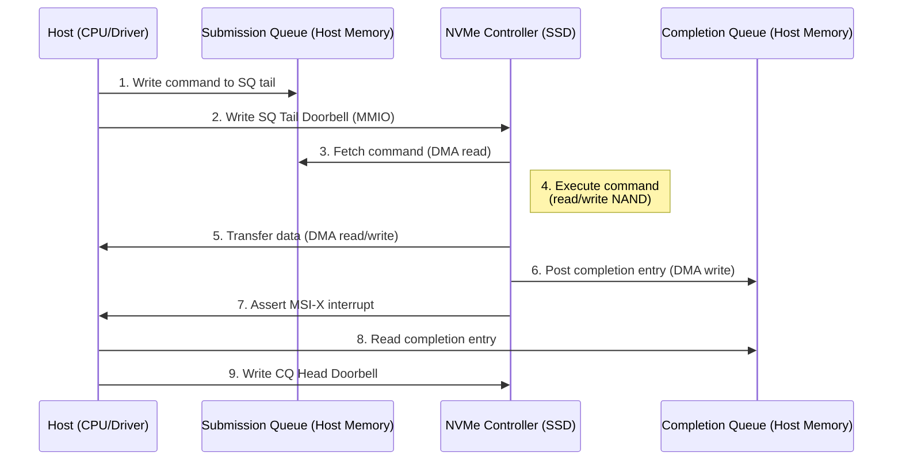
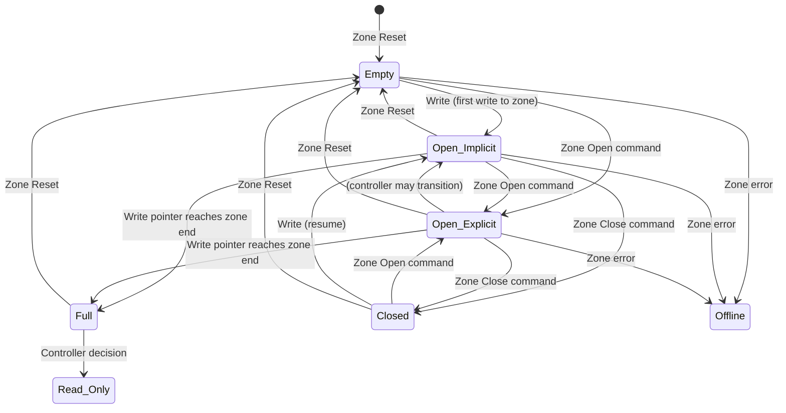

# NVMe 2.0 Protocol — NVM Express Specification

**Topic:** NVMe 2.0 specification; host controller interface; submission/completion queues; command sets (NVM, ZNS, KV); namespace management; NVMe architecture; SSD controller internals  
**Standards:** NVMe Base Specification 2.0 (2021), NVMe Command Set Specifications, NVMe Management Interface (NVMe-MI) 1.2, NVMe-oF 1.1  
**SDO:** NVM Express Inc. (industry consortium: Intel, Samsung, Dell, others)  
**Audience:** Storage firmware engineers, SSD controller architects, kernel/driver developers, storage system architects, data center engineers  
**Prerequisites:** PCIe fundamentals, block storage concepts, NAND flash basics, OS storage stack (block layer, file systems)

---

## Chapter 1 — Historical Context & Origin Story

### 1.1 Timeline

| Year | Event | Significance |
|------|-------|-------------|
| 1990s | SCSI → ATA/ATAPI | Parallel interfaces; designed for rotating media |
| 2004 | AHCI 1.0 (Advanced Host Controller Interface) | Standardized SATA controller interface; NCQ (32 commands) |
| 2007 | First enterprise SSDs (STEC) | SATA/SAS interface; SSD on HDD-era protocol |
| **2011** | **NVMe 1.0** | Purpose-built protocol for flash over PCIe; 64K queues |
| 2012 | NVMe 1.1 | Multi-path I/O; namespace sharing |
| 2014 | NVMe 1.2 | Power management enhancements; end-to-end protection |
| 2017 | NVMe 1.3 | Device self-test; sanitize; boot partitions |
| 2019 | NVMe 1.4 | Persistent memory region; multipath; IO determinism |
| **2021** | **NVMe 2.0** | Modular specification restructure; ZNS; KV command sets |
| 2022 | NVMe 2.0a/2.0b | Errata; clarifications |
| 2023 | NVMe 2.1 | Transport independent; enhanced features |
| 2024+ | NVMe 3.0 (development) | Computational storage; flexible data placement |

### 1.2 Why NVMe Was Created

| AHCI/SATA Limitation | NVMe Solution |
|:---:|---|
| **1 command queue** (32 entries max with NCQ) | **65,535 queues × 65,536 entries** per queue |
| **4 SATA ports per controller** typical | **Directly on PCIe bus** (no SATA controller needed) |
| **~6 μs command latency** (AHCI register doorbell overhead) | **~2.5 μs command latency** (streamlined doorbell) |
| **Interrupt coalescing limited** | **MSI-X: up to 2048 interrupt vectors** (per-core queues) |
| **Single threaded** (HDD legacy) | **Multi-core friendly** (queue per CPU core) |
| **6 Gbps SATA bandwidth** | **PCIe x4: 32/64/128 Gbps** (Gen4/5/6) |
| **Complex legacy SCSI translation** | **Lean command set**: 13 essential commands |
| **Designed for rotational media** | **Designed for parallel NAND flash access** |

---

## Chapter 2 — NVMe 2.0 Specification Architecture

### 2.1 Modular Specification Structure (NVMe 2.0 Change)

```mermaid
graph TB
    subgraph "NVMe 2.0 Specification Family"
        BASE[NVMe Base Specification<br/>━━━━━━━━━━━<br/>• Controller architecture<br/>• Queue mechanism<br/>• Admin command set<br/>• Property definitions<br/>• Transport-independent core]
        
        NVM_CS[NVM Command Set<br/>━━━━━━━━━━━<br/>• Read / Write / Flush<br/>• Compare / Dataset Mgmt<br/>• Deallocate (TRIM)<br/>• Write Zeroes<br/>• Traditional block I/O]
        
        ZNS_CS[Zoned Namespace (ZNS)<br/>━━━━━━━━━━━<br/>• Zone-based writes<br/>• Sequential write required<br/>• Host-managed zones<br/>• Zone append command<br/>• Reduced write amplification]
        
        KV_CS[Key-Value Command Set<br/>━━━━━━━━━━━<br/>• Store / Retrieve / Delete<br/>• Key-based addressing<br/>• No block/LBA abstraction<br/>• Variable-value size]
        
        TRANSPORT[Transport Specifications<br/>━━━━━━━━━━━<br/>• PCIe Transport<br/>• RDMA Transport (RoCE/iWARP)<br/>• TCP Transport<br/>• Fibre Channel Transport]
        
        MI[NVMe Management Interface<br/>━━━━━━━━━━━<br/>• Out-of-band management<br/>• SMBus/I2C/PCIe VDM<br/>• Health monitoring<br/>• Firmware update<br/>• Configuration]
    end
    
    BASE --> NVM_CS
    BASE --> ZNS_CS
    BASE --> KV_CS
    BASE --> TRANSPORT
    BASE --> MI
```

**NVMe 2.0 key change**: Previously one monolithic spec. Now MODULAR:
- Base spec defines core architecture (independent of command set or transport)
- Command sets are separate specs (can add new ones without changing base)
- Transports are separate specs (PCIe, RDMA, TCP, FC)
- Enables evolution without rewriting entire specification

### 2.2 Controller Architecture

| Component | Role |
|:---------:|------|
| **Submission Queue (SQ)** | Host places commands here; circular buffer in host memory |
| **Completion Queue (CQ)** | Controller posts completions here; circular buffer in host memory |
| **Doorbell registers** | Host writes doorbell to notify controller of new SQ entries; controller writes CQ doorbell (optional) |
| **Admin Queue pair** | SQ/CQ pair 0: used for admin commands (namespace management, identify, features) |
| **I/O Queue pairs** | SQ/CQ pairs 1-65535: used for I/O commands (read/write/etc.) |
| **Controller registers (BAR)** | Memory-mapped registers: capabilities, configuration, status |
| **PRP/SGL** | Physical Region Page / Scatter-Gather List: describes host memory buffers for data transfer |

---

## Chapter 3 — Technical Deep Dive

### 3.1 Queue Mechanism



### 3.2 Command Structure (64-byte Submission Queue Entry)

| Dword | Field | Description |
|:-----:|:-----:|-------------|
| 0 | CDW0 | Opcode (8-bit) + Fused (2-bit) + PSDT (2-bit) + CID (16-bit) |
| 1 | NSID | Namespace Identifier (which drive/partition) |
| 2-3 | Reserved | — |
| 4-5 | MPTR | Metadata pointer |
| 6-9 | PRP1/PRP2 or SGL | Data pointer (host buffer address) |
| 10 | CDW10 | Command-specific (e.g., starting LBA low) |
| 11 | CDW11 | Command-specific (e.g., starting LBA high) |
| 12 | CDW12 | Command-specific (e.g., number of LBs, protection) |
| 13 | CDW13 | Command-specific |
| 14 | CDW14 | Command-specific |
| 15 | CDW15 | Command-specific |

### 3.3 Completion Queue Entry (16 bytes)

| Dword | Field | Description |
|:-----:|:-----:|-------------|
| 0 | DW0 | Command-specific result |
| 1 | DW1 | Reserved |
| 2 | SQ Head Pointer | Controller reports how far it consumed SQ |
| 3 | Status + CID + Phase | Status (15-bit) + CID (16-bit) + Phase bit (1-bit) |

**Phase bit**: Toggles each time CQ wraps around. Host uses this to detect new completions without needing head/tail pointer updates (no doorbell needed to DETECT completion — just poll phase bit).

### 3.4 Key NVM Commands

| Opcode | Command | Description |
|:------:|:-------:|-------------|
| 0x01 | **Write** | Write data from host buffer to LBA range on drive |
| 0x02 | **Read** | Read data from LBA range to host buffer |
| 0x04 | **Write Uncorrectable** | Mark LBA range as uncorrectable (returns error on read) |
| 0x05 | **Compare** | Compare host data with drive data (atomic check) |
| 0x08 | **Write Zeroes** | Deallocate + zero LBA range (no data transfer needed) |
| 0x09 | **Dataset Management** | Hint: deallocate (TRIM), write access frequency, etc. |
| 0x0C | **Verify** | Verify data integrity (no data transfer) |
| 0x0D | **Reservation Register** | Multi-host reservation |
| 0x11 | **Reservation Report** | Report current reservations |

### 3.5 Namespace Concept

| Concept | Description |
|:-------:|-------------|
| **Namespace** | Logical subdivision of NVMe controller's storage; each has its own LBA range; analogous to a "virtual drive" |
| **NSID** | Namespace Identifier (1-based integer); every I/O command targets a specific NSID |
| **Use cases** | (1) Partition SSD into multiple logical drives. (2) SR-IOV: each VM gets its own namespace. (3) Different namespaces can have different block sizes (512B vs 4KB). (4) ZNS: entire namespace is zoned. |
| **Shared namespace** | Multiple controllers can access same namespace (multi-path) |
| **Namespace management** | Admin commands: Create/Delete/Attach/Detach namespaces dynamically |

---

## Chapter 4 — NVMe Queuing Model

### 4.1 Multi-Queue Architecture

```mermaid
graph TB
    subgraph "Host (Multi-Core CPU)"
        CORE0[CPU Core 0<br/>SQ1/CQ1]
        CORE1[CPU Core 1<br/>SQ2/CQ2]
        CORE2[CPU Core 2<br/>SQ3/CQ3]
        CORE3[CPU Core 3<br/>SQ4/CQ4]
    end
    
    subgraph "NVMe Controller"
        ARB[Arbitration<br/>━━━━━━━━━━━<br/>• Round-robin<br/>• Weighted round-robin<br/>• Vendor-specific]
        
        FTL[Flash Translation Layer<br/>━━━━━━━━━━━<br/>• L2P mapping<br/>• Wear leveling<br/>• Garbage collection<br/>• Write buffer]
        
        NAND[NAND Flash Array<br/>━━━━━━━━━━━<br/>• Multiple channels (8-16)<br/>• Multiple dies per channel<br/>• Parallel operations]
    end
    
    CORE0 --> ARB
    CORE1 --> ARB
    CORE2 --> ARB
    CORE3 --> ARB
    ARB --> FTL --> NAND
```

### 4.2 Queue Depth and Parallelism

| Configuration | AHCI (SATA) | NVMe |
|:---:|:---:|:---:|
| Total queues | 1 | **65,535 I/O + 1 Admin** |
| Queue depth | 32 commands | **65,536 commands per queue** |
| Total outstanding | 32 | **65,535 × 65,536 ≈ 4 billion** (theoretical) |
| Interrupt handling | Single IRQ or limited MSI | **MSI-X: 2048 vectors** (per-queue interrupt) |
| CPU affinity | All I/O through single queue → lock contention | **Per-CPU-core queue → no locks** |

### 4.3 I/O Determinism

| Feature | Description |
|:-------:|-------------|
| **NVM Sets** | Group of namespaces sharing physical NAND; I/O to one set doesn't affect another |
| **Endurance Groups** | Group sharing wear/endurance tracking; independent failure domains |
| **IO Determinism** | Predictable latency: controller separates "predictable" and "non-deterministic" windows (e.g., GC happening vs. not) |
| **Host-controlled thermal** | Host can set thermal management temperature thresholds; predictable throttling |

---

## Chapter 5 — Zoned Namespaces (ZNS)

### 5.1 ZNS Concept

| Aspect | Traditional NVM | Zoned Namespaces (ZNS) |
|--------|:---:|:---:|
| Write pattern | Random writes anywhere | **Sequential writes within zones** |
| Flash management (FTL) | SSD firmware handles all (GC, mapping, WAF) | **Host helps manage** (simpler FTL in SSD) |
| Over-provisioning | 7-28% (for GC) | **Near zero** (host ensures sequential) |
| Write amplification | WAF 2-4× typical (random writes + GC) | **WAF ~1.0** (sequential = no GC needed) |
| Capacity efficiency | 72-93% usable | **~100% usable** |
| Cost | Higher (need OP NAND) | **Lower** (all NAND usable for data) |

### 5.2 Zone State Machine



### 5.3 ZNS Commands

| Command | Description |
|:-------:|-------------|
| **Zone Append** | Write to zone at current write pointer (controller assigns LBA); enables concurrent writes to same zone from multiple threads |
| **Zone Management Send** | Open/Close/Finish/Reset zone |
| **Zone Management Receive** | Report zone descriptors (state, write pointer, capacity) |
| **Read** | Standard read from any LBA within zone (random reads allowed) |
| **Write** | Sequential write at write pointer (must be at exactly wp position) |

---

## Chapter 6 — NVMe Power Management & Performance

### 6.1 Power States

| State | Type | Description | Typical Latency to Active |
|:-----:|:----:|-------------|:-------------------------:|
| PS0 | Operational | Maximum performance | — |
| PS1 | Operational | Reduced performance; lower power | ~0 |
| PS2 | Operational | Further reduced | ~0 |
| PS3 | Non-operational | Idle (DRAM may be powered down) | ~ms |
| PS4 | Non-operational | Deep sleep (most circuitry off) | ~100 ms |
| APST | Autonomous | Controller transitions between PS automatically based on idle time | Configurable |

### 6.2 Performance Characteristics (Typical High-End PCIe 5.0 SSD)

| Metric | Value | Notes |
|:------:|:-----:|-------|
| Sequential read | 14 GB/s | PCIe 5.0 x4 saturated |
| Sequential write | 12 GB/s | With write cache; SLC cache |
| Random read 4K (QD1) | ~20 μs / 15K IOPS | Single command latency |
| Random read 4K (QD128) | 2M IOPS | Parallel across NAND |
| Random write 4K (QD128) | 1.5M IOPS | With write buffer |
| Write latency (4K, QD1) | ~10-20 μs | To write buffer (not NAND commit) |
| Read latency (4K, QD1, cache hit) | ~5-10 μs | From controller DRAM cache |
| Power (active read) | 7-12 W | PCIe 5.0 x4 active |
| Power (idle PS3) | ~30-50 mW | Low-power idle |

---

## Chapter 7 — Comparison: NVMe vs. Alternatives

| Dimension | NVMe (PCIe) | AHCI (SATA) | SAS | UFS | eMMC |
|:---------:|:-----------:|:-----------:|:---:|:---:|:----:|
| **Interface** | PCIe x1/x2/x4 | SATA 6 Gbps | SAS-4 (24G) | M-PHY | Parallel 8-bit |
| **Max bandwidth** | 128 Gbps (Gen5 x4) | 6 Gbps | 24 Gbps | 23.2 Gbps | 3.2 Gbps |
| **Queues** | 65K × 64K | 1 × 32 | 1 × 256 | 32 | 1 |
| **Latency** | ~2-5 μs (protocol) | ~6 μs | ~4-6 μs | ~10-20 μs | ~50+ μs |
| **CPU overhead** | Low (per-core queues) | High (single queue; lock contention) | Moderate | Low | Low |
| **Hot-plug** | Limited (PCIe) | Yes (SATA) | Yes | No | No |
| **Multi-path** | Yes (NVMe-MI; NVMe-oF) | No | Yes (dual-port) | No | No |
| **Target** | PC/Server SSD | Legacy PC/NAS | Enterprise HDD/SSD | Mobile | IoT/embedded |

---

## Chapter 8 — Architecture Diagrams

### 8.1 NVMe SSD Controller Internal Architecture

```mermaid
graph TB
    subgraph "Host Interface"
        PCIE[PCIe PHY<br/>(Gen4/5 x4)]
        PCIE --> DMA[DMA Engine<br/>━━━━━━━━━━━<br/>• Fetch SQ entries<br/>• Post CQ entries<br/>• Data transfer (PRP/SGL)<br/>• MSI-X interrupt]
    end
    
    subgraph "NVMe Controller Core"
        DMA --> CMD[Command Parser<br/>━━━━━━━━━━━<br/>• Decode opcodes<br/>• Extract LBA, length<br/>• Route to processing]
        
        CMD --> FTL[Flash Translation Layer<br/>━━━━━━━━━━━<br/>• L2P table (logical→physical)<br/>• Write buffer management<br/>• Garbage collection engine<br/>• Wear leveling<br/>• Read/write scheduling]
        
        CMD --> ADMIN[Admin Engine<br/>━━━━━━━━━━━<br/>• Identify<br/>• Namespace mgmt<br/>• Feature get/set<br/>• Firmware update]
    end
    
    subgraph "Backend"
        FTL --> FBC[Flash Bus Controller<br/>━━━━━━━━━━━<br/>• 8-16 NAND channels<br/>• Per-channel: ONFI/Toggle<br/>• Multi-plane operations<br/>• Error handling]
        
        FBC --> NAND0[Channel 0<br/>4-8 dies]
        FBC --> NAND1[Channel 1<br/>4-8 dies]
        FBC --> NAND7[Channel 7<br/>4-8 dies]
    end
    
    subgraph "Support"
        DRAM[Controller DRAM<br/>━━━━━━━━━━━<br/>• L2P table cache<br/>• Write buffer<br/>• Read cache<br/>• Firmware execution]
        
        ECC_E[ECC Engine<br/>━━━━━━━━━━━<br/>• LDPC decode (1-2 KB codeword)<br/>• Multi-bit correction<br/>• Read retry on failure]
    end
    
    FTL --> DRAM
    FBC --> ECC_E
```

### 8.2 NVMe Multi-Path I/O

```mermaid
graph TB
    subgraph "Host"
        MPIO[Multipath Driver<br/>━━━━━━━━━━━<br/>• Path selection (round-robin / least-queue)<br/>• Failover on path error<br/>• Load balancing]
    end
    
    subgraph "Fabric/PCIe"
        PATH1[Path 1<br/>(PCIe port A)]
        PATH2[Path 2<br/>(PCIe port B)]
    end
    
    subgraph "NVMe Subsystem"
        CTRL1[Controller 1<br/>(Port A)]
        CTRL2[Controller 2<br/>(Port B)]
        NS[Shared Namespace<br/>━━━━━━━━━━━<br/>• Same data<br/>• Accessible via both controllers<br/>• Reservation for coordination]
    end
    
    MPIO --> PATH1 --> CTRL1 --> NS
    MPIO --> PATH2 --> CTRL2 --> NS
```

---

## Chapter 9 — Case Studies

### 9.1 Data Center: NVMe Over-Provisioning and Endurance

| Scenario | Detail |
|----------|--------|
| **System** | Cloud storage tier: 100 NVMe SSDs; PCIe 4.0 x4; 7.68 TB each |
| **Workload** | Mixed read/write (70:30); random 4K; average 500K IOPS per drive |
| **Challenge** | Write amplification (WAF) causing: (1) reduced NAND endurance, (2) latency spikes during garbage collection, (3) unpredictable QoS |
| **Solution 1: ZNS** | Migrate to ZNS SSDs for sequential write workload (object storage): WAF dropped from 3.2× to 1.05×; SSD lifetime increased 3×; no GC latency spikes |
| **Solution 2: Over-provisioning tuning** | For random workloads: increased OP from 7% to 28%; WAF reduced from 3.2× to 1.8×; p99 latency reduced from 5 ms to 800 μs (less aggressive GC) |
| **Solution 3: IO Determinism** | Used NVMe IO Determinism feature: host schedules latency-sensitive reads during "deterministic" windows; defers writes to "non-deterministic" windows (GC time) |
| **Result** | Combined approach: p99 latency reduced 85%; SSD lifetime extended 2.5×; cost reduction from ZNS capacity efficiency |

### 9.2 Embedded NVMe: Automotive Storage

| Scenario | Detail |
|----------|--------|
| **System** | Automotive ADAS/infotainment: NVMe SSD in vehicle (BGA form factor) |
| **Requirements** | (1) -40°C to +105°C operation. (2) Power-loss protection (capacitor-backed). (3) Predictable latency for ADAS map reads. (4) High endurance (15-year vehicle life). (5) Security (TCG Opal for data protection). |
| **NVMe features used** | (1) **Power-loss notification (PLN)**: host signals upcoming power loss; SSD flushes write buffer to NAND. (2) **End-to-end protection (PI)**: guard CRC per block; detects silent data corruption. (3) **Predictable Latency Mode**: controller avoids GC during latency-sensitive ADAS reads. (4) **Thermal management**: temperature sensors; controller reports to host ECU for cooling control. (5) **Sanitize**: secure erase when vehicle changes ownership (GDPR compliance). |
| **Form factor** | BGA SSD (11.5 × 13 mm): soldered to automotive PCB; no M.2 connector (vibration resistance) |
| **Capacity** | 256 GB (ADAS maps: 50 GB; infotainment: 100 GB; dashcam: 100 GB; system: 6 GB) |

---

## Chapter 10 — Future Evolution

| Trend | Timeline | Impact |
|-------|----------|--------|
| **NVMe 2.1** | 2023-2024 | Transport independent enhancements; improved discovery |
| **Flexible Data Placement (FDP)** | 2024 | Host hints where to place data in NAND; reduces WAF without full ZNS |
| **Computational Storage (NVMe CS)** | 2024-2026 | Execute compute programs on SSD controller (grep, compress, AI inference) |
| **NVMe over CXL** | 2025+ | NVMe semantics over CXL fabric (persistent CXL memory) |
| **PCIe 7.0 NVMe** | 2026 | 128 GT/s x4 = 256 Gbps; ~32 GB/s per SSD |
| **Key-Value maturity** | 2025+ | KV command set adoption for object storage (bypass file system overhead) |
| **NVMe for HDD** | 2024-2025 | Rotational media command set; NVMe replaces SAS for data center HDDs |
| **PLP (Power Loss Protection) standards** | 2024+ | Standardized capacitor requirements; testing methodology |
| **NVMe Security (TCG + NVMe)** | 2024+ | Enhanced authentication; per-IO encryption keys |

---

## Chapter 11 — Interview Questions & Career Guide

### Tier 1: Entry-Level

**Q1:** What is NVMe and why is it faster than SATA/AHCI? Explain the queue architecture.

**A:** NVMe (Non-Volatile Memory Express) is a host controller interface and command protocol designed specifically for flash-based storage over PCIe. It's faster than SATA/AHCI for these reasons:

**(1) Queue architecture:**
- AHCI: 1 queue with 32 command slots. ALL I/O goes through this single queue. On a multi-core CPU, all cores contend for the same queue (requires locking).
- NVMe: 65,535 I/O queues, each with 65,536 entries. Assign one queue per CPU core → zero lock contention. Each core independently submits and completes I/O.

**(2) Bandwidth:**
- SATA: 6 Gbps (600 MB/s) maximum. Regardless of SSD speed, SATA is the bottleneck.
- NVMe: Uses PCIe directly. Gen4 x4 = 64 Gbps (~8 GB/s). Gen5 x4 = 128 Gbps (~16 GB/s). No artificial protocol bottleneck.

**(3) Command processing:**
- AHCI: To submit a command, host must: write to command slot, set command issue bit, controller reads register → multiple register reads/writes per command. Complex state machine.
- NVMe: Host writes 64-byte command to memory (SQ), then writes ONE doorbell register. Controller fetches command via DMA. Simpler, fewer register accesses.

**(4) Interrupt efficiency:**
- AHCI: Limited interrupt coalescing; often single IRQ shared across all I/O
- NVMe: MSI-X with up to 2048 vectors. Each queue gets its own interrupt → each CPU core gets interrupted only for its own completions. No lock, no cross-core interrupt routing.

**(5) Protocol weight:**
- AHCI: Derived from SCSI/ATA; carries decades of legacy. Command FIS (Frame Information Structure) has overhead fields for rotating media.
- NVMe: Clean-slate design. Only 13 essential commands. 64-byte fixed command structure. No legacy overhead.

**Practical impact:** SATA SSD tops out at ~100K IOPS (protocol bottleneck at 600 MB/s). NVMe SSD: 1-2 Million IOPS; 7-14 GB/s sequential. The improvement is 10-20× for IOPS and 10-25× for bandwidth.

### Tier 2: Mid-Level

**Q2:** Explain Zoned Namespaces (ZNS). What problems does it solve and what are the trade-offs?

**A:**

**The problem ZNS solves: Write Amplification Factor (WAF)**

Traditional SSDs have a Flash Translation Layer (FTL) that maps logical blocks (LBA) to physical NAND pages. When host writes randomly:
1. NAND can only be erased in large blocks (256 KB - 4 MB)
2. Random overwrites mean: original data in block still valid but intermixed with stale data
3. Garbage Collection (GC): SSD must read valid pages from block, erase block, write valid pages to new block
4. Result: for every 1 GB host writes, SSD might write 3-4 GB to NAND (WAF = 3-4×)

Consequences: (1) NAND wears out 3-4× faster (reduced SSD lifetime). (2) GC causes latency spikes (p99 goes from 100 μs to 5+ ms during GC). (3) SSD needs over-provisioning (7-28% of NAND reserved for GC workspace = capacity waste).

**ZNS solution:**

Divide namespace into zones (typically 256 MB - 2 GB each). Within each zone:
- Writes MUST be sequential (starting from write pointer; advancing forward only)
- Read anywhere (random reads allowed)
- To rewrite: must reset entire zone (erase), then write sequentially again

**Why this helps:**
- If host writes sequentially within zones: when zone is reset, ALL data is stale → no GC needed (nothing to copy)
- WAF = 1.0 (ideally) → NAND endurance maximized
- No over-provisioning needed → 100% capacity usable
- No GC latency spikes → predictable latency

**Trade-offs:**

| ZNS Benefit | ZNS Challenge |
|:---:|:---:|
| WAF ~1.0 | Host must manage sequential write ordering (complexity moves from SSD to host/application) |
| No OP needed (+7-28% capacity) | File systems must be zone-aware (F2FS, Btrfs zone mode) or application handles directly |
| No GC latency spikes | Limited open zones simultaneously (hardware constraint; typically 14-128 open zones) |
| Lower SSD cost (simpler FTL) | Random overwrites impossible; must erase/reset zone first |
| Longer lifetime | Application refactoring needed (log-structured writes) |

**Best suited for:** Object storage (sequential by nature); log-structured databases (LSM-trees like RocksDB); streaming data (video recording); backup/archive.

**NOT suited for:** Traditional random-write workloads (databases with in-place update; file systems without zone awareness).

### Tier 3: Senior

**Q3:** Design an NVMe storage architecture for a latency-sensitive financial trading platform. Requirements: <10 μs p99 read latency, 500K IOPS, 99.999% availability.

**A:**

**Challenge analysis:** 
- <10 μs p99 read latency is BELOW typical NVMe SSD read latency (15-100 μs). This means we cannot simply read from NAND flash and meet this requirement. Strategy: DRAM-cached + flash-backed.
- 500K IOPS is achievable by a single high-end NVMe SSD, but not at p99 <10 μs.
- 99.999% requires no single point of failure.

**Architecture:**

*Storage tier design:*

| Tier | Technology | Capacity | Latency | Role |
|:----:|:---:|:---:|:---:|---|
| **Tier 0** | System DRAM (DDR5) | 512 GB | ~80 ns | Active trading data (order book, positions, market data) — cached permanently |
| **Tier 1** | Optane/NVDIMM or battery-backed DRAM | 128 GB | ~300 ns | Write journal (all writes go here for persistence before DRAM) |
| **Tier 2** | NVMe SSD (PCIe 5.0) | 4× 3.84 TB | ~15-100 μs | Persistent storage; read on cache miss; historical data |
| **Tier 3** | NVMe-oF (remote) | Cluster storage | ~100-500 μs | Replication; disaster recovery |

*Latency optimization:*

To achieve <10 μs p99 READ latency:
1. **Hot data in DRAM**: Trading state (order book, positions) always in application memory (mmap'd files). Reads are memory accesses (~80 ns). This covers >99.9% of trading reads.
2. **Eliminate GC latency spikes**: Use NVMe IO Determinism + Predictable Latency Mode. Alternatively: use ZNS and perform all writes sequentially (WAF=1; no GC).
3. **Per-core NVMe queues**: Dedicated SQ/CQ per trading thread → zero lock contention → minimal software overhead.
4. **Polling mode (no interrupts)**: Disable MSI-X; use busy-poll on CQ (trade CPU cycles for lower latency; eliminates interrupt handling ~1-2 μs).
5. **SPDK (Storage Performance Development Kit)**: Bypass kernel block layer; user-space NVMe driver → eliminates kernel context switches (~3-5 μs savings).

*Write path (ensuring persistence):*

1. Application writes to battery-backed DRAM (Tier 1) → acknowledged to application in <1 μs
2. Background: battery-backed DRAM drains to NVMe SSDs asynchronously
3. If power loss: battery provides seconds of power for DRAM → NVMe flush
4. NVMe drives have PLP (Power Loss Protection) capacitors for in-flight writes

*Availability (99.999% = 5.26 minutes downtime/year):*

| Component | Redundancy | Failover Time |
|:---------:|:---:|:---:|
| NVMe SSDs | RAID-1 mirror (2+2 drives) | Transparent (reads from surviving mirror) |
| Host connection | Dual PCIe paths to NVMe (multipath) | ~0 (automatic path failover) |
| Server | Active-active cluster (2+ nodes) | <1 second (state replicated via NVMe-oF RDMA) |
| Network | Dual 100 GbE; separate switches | ~0 (bonded NICs) |
| Power | Dual PSU; UPS; battery-backed DRAM | ~0 (UPS + battery) |
| Data center | Async replication to DR site (NVMe-oF TCP) | Minutes (disaster recovery; not included in p99) |

*NVMe-specific features used:*

| Feature | Purpose |
|:-------:|---------|
| **Multipath I/O** | Dual paths to each NVMe drive; failover without latency impact |
| **Reservation** | Multi-host access coordination (active-active cluster) |
| **Predictable Latency Mode** | Guarantee latency during "deterministic" windows for trading hours |
| **End-to-end protection (PI)** | CRC per block → detect any silent data corruption (critical for financial data) |
| **SMART monitoring** | Proactive drive health monitoring → replace before failure |
| **Sanitize** | Regulatory compliance: secure data destruction when drives are decommissioned |

*Why NOT CXL-attached storage:*
CXL persistent memory would be ideal (byte-addressable; ~150 ns) but:
- CXL 2.0 persistent memory not yet mature for production financial systems
- Battery-backed DRAM + NVMe is proven and field-tested
- Future consideration: CXL 3.0 persistent memory could replace Tier 1

---

## Chapter 12 — Cheat Sheet & Quick Reference

```
═══════════════════════════════════════════
NVMe 2.0 — QUICK REFERENCE
═══════════════════════════════════════════

NVMe vs SATA/AHCI:
  Queues: 65,535 I/O + 1 Admin (vs 1 × 32)
  Bandwidth: PCIe x4 (8-32 GB/s vs 600 MB/s)
  Latency: ~2-5 μs protocol (vs ~6 μs)
  IOPS: 1-2M+ (vs ~100K SATA limit)
  Interrupts: MSI-X 2048 vectors (vs limited)

═══════════════════════════════════════════
QUEUE MECHANISM:
  Host writes command (64B) → SQ (host memory)
  Host rings SQ Tail Doorbell (MMIO write)
  Controller fetches command (DMA)
  Controller executes + transfers data (DMA)
  Controller posts completion (16B) → CQ
  Controller sends MSI-X interrupt
  Host reads completion; rings CQ Head Doorbell
  
  Phase bit: detect new completions without doorbell

═══════════════════════════════════════════
NVMe 2.0 MODULAR STRUCTURE:
  Base Spec: Core architecture (transport-independent)
  NVM Command Set: Traditional block I/O
  ZNS Command Set: Zone-based sequential writes
  KV Command Set: Key-Value storage
  Transport Specs: PCIe / RDMA / TCP / FC
  MI Spec: Out-of-band management

═══════════════════════════════════════════
KEY NVM COMMANDS:
  0x01 Write     0x02 Read       0x04 Write Uncorrectable
  0x05 Compare   0x08 Write Zeroes  0x09 Dataset Mgmt (TRIM)
  
ADMIN COMMANDS:
  0x06 Identify  0x09 Set Features  0x0A Get Features
  0x0C Namespace Mgmt  0x10 Firmware Commit

═══════════════════════════════════════════
ZNS (ZONED NAMESPACES):
  Problem: Random writes → GC → WAF 3-4× → latency spikes
  Solution: Sequential writes in zones → WAF 1.0 → no GC
  
  Zone states: Empty → Open → Closed → Full → Reset
  Key command: Zone Append (concurrent writes to same zone)
  Best for: Object storage, LSM-tree DBs, log-structured
  
═══════════════════════════════════════════
COMMAND ENTRY (64 bytes):
  DW0: Opcode | Fused | CID
  DW1: NSID (namespace)
  DW4-5: Metadata pointer
  DW6-9: PRP/SGL (data buffer)
  DW10-15: Command-specific (LBA, length, flags)

COMPLETION ENTRY (16 bytes):
  DW0: Result | DW2: SQ Head | DW3: Status + CID + Phase

═══════════════════════════════════════════
PERFORMANCE TARGETS (PCIe 5.0 x4 SSD):
  Sequential Read: 14 GB/s
  Sequential Write: 12 GB/s
  Random Read 4K QD128: 2M IOPS
  Random Write 4K QD128: 1.5M IOPS
  Random Read 4K QD1 latency: ~15-20 μs

═══════════════════════════════════════════
NAMESPACES:
  Logical subdivision of NVMe storage
  Each has own LBA range; own block size (512B/4K)
  Supports SR-IOV (namespace per VM)
  Can be shared across controllers (multi-path)
  Dynamic creation/deletion via admin commands

═══════════════════════════════════════════
POWER STATES:
  PS0-PS2: Operational (active/reduced)
  PS3-PS4: Non-operational (idle/deep sleep)
  APST: Autonomous transition based on idle time
  Thermal throttle: controller manages temperature
```

---

*End of Document — 03_NVMe_2_0_Protocol.md*
