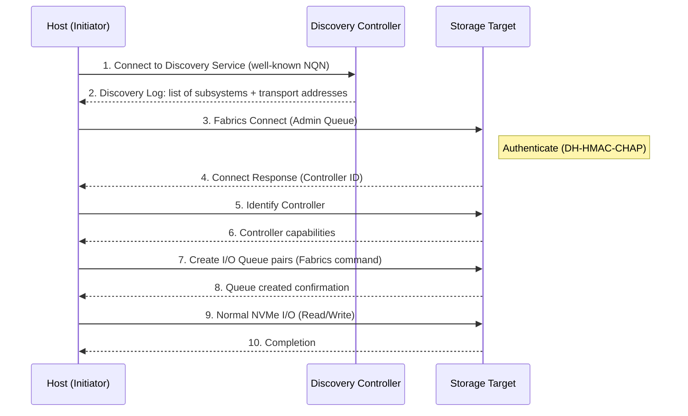
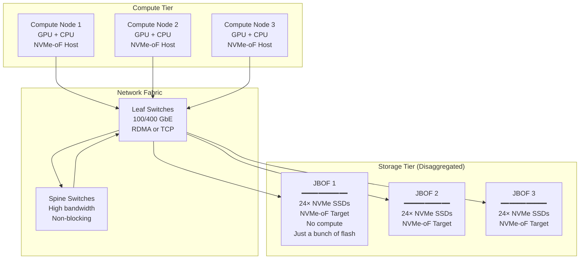

# NVMe over Fabrics (NVMe-oF) — Network Storage Protocol

**Topic:** NVMe over Fabrics specification; RDMA transport (RoCEv2, iWARP); TCP transport; Fibre Channel transport; NVMe-oF architecture; disaggregated storage; composable infrastructure  
**Standards:** NVMe-oF 1.1 (2022), NVMe/TCP (TP 8000), NVMe/RDMA (TP 8001), NVMe/FC (TP 8002), NVMe Base 2.0  
**SDO:** NVM Express Inc., SNIA (Storage Networking Industry Association), T11 (Fibre Channel)  
**Audience:** Storage network architects, data center engineers, cloud infrastructure engineers, storage firmware developers, network engineers  
**Prerequisites:** NVMe basics (queues, commands, namespaces), RDMA concepts, TCP/IP networking, Ethernet/FC basics

---

## Chapter 1 — Historical Context & Origin Story

### 1.1 Timeline

| Year | Event | Significance |
|------|-------|-------------|
| 2004 | iSCSI (RFC 3720) | SCSI over TCP/IP — first block storage over Ethernet |
| 2011 | NVMe 1.0 | Local NVMe (PCIe attached); no network story |
| 2014 | NVMe-oF concept started | Extend NVMe semantics across network fabric |
| **2016** | **NVMe-oF 1.0** | First spec: RDMA transport (RoCE/iWARP); FC transport |
| 2018 | NVMe/TCP added (TP 8000) | TCP transport: no special NIC needed; broader deployment |
| 2019 | Wide industry adoption | Dell, NetApp, Pure Storage implement NVMe-oF arrays |
| 2020 | NVMe/TCP in Linux 5.x | Upstream kernel support; production-ready |
| 2021 | NVMe-oF 1.1 | Discovery enhancements; multipath; authentication |
| 2022 | NVMe-oF TLS/Authentication | Secure NVMe-oF (in-band authentication) |
| 2023 | NVMe-oF over CXL fabric proposals | Convergence of NVMe-oF and CXL memory semantics |
| 2024 | 400 GbE + NVMe-oF deployments | Ultra-high bandwidth disaggregated storage |

### 1.2 Why NVMe-oF Was Created

| Problem | Previous Solution | NVMe-oF Solution |
|:-------:|:---:|:---:|
| Access remote flash storage | iSCSI (SCSI over TCP) — high latency, SCSI overhead | NVMe-oF: native NVMe protocol; minimal latency overhead |
| Disaggregate compute and storage | SAN (FC/iSCSI) — designed for HDD latency (~ms) | NVMe-oF: designed for flash latency (~μs); fabric adds <10 μs |
| Scale storage independently | DAS limits: storage attached to specific server | NVMe-oF: any server accesses any NVMe target over fabric |
| Composable infrastructure | Separate compute/storage refresh cycles | NVMe-oF: compose resources dynamically; scale independently |
| Multi-tenant storage | Hardware partitioning or VM-level | NVMe-oF: namespaces per tenant; fabric isolation |

---

## Chapter 2 — NVMe-oF Architecture

### 2.1 Core Concepts

| Concept | Description |
|:-------:|-------------|
| **Host** | Initiator that sends NVMe commands over fabric (server running workloads) |
| **Target (Subsystem)** | Responder that receives/executes NVMe commands (storage array or JBOF) |
| **Fabric** | Network connecting hosts to targets (Ethernet, FC, InfiniBand) |
| **NVMe Subsystem** | Collection of controllers and namespaces accessible over fabric |
| **NQN (NVMe Qualified Name)** | Unique identifier for hosts and subsystems (like iSCSI IQN) |
| **Transport** | Protocol carrying NVMe commands over fabric (RDMA, TCP, FC) |
| **Capsule** | NVMe-oF PDU: encapsulates NVMe command + optional data |
| **Discovery** | Mechanism for hosts to find available subsystems/targets on fabric |

### 2.2 Architecture Overview

```mermaid
graph TB
    subgraph "Compute Nodes (Hosts)"
        H1[Host 1<br/>NVMe-oF Initiator<br/>(nvme-cli / kernel driver)]
        H2[Host 2<br/>NVMe-oF Initiator]
        H3[Host 3<br/>NVMe-oF Initiator]
    end
    
    subgraph "Fabric Network"
        SW[Network Switch<br/>━━━━━━━━━━━<br/>• 100/200/400 GbE (RDMA/TCP)<br/>• 32/64G FC (FC-NVMe)<br/>• Low-latency switching<br/>• ECMP / multipath<br/>• Priority Flow Control (PFC)]
    end
    
    subgraph "Storage Targets"
        T1[NVMe-oF Target 1<br/>━━━━━━━━━━━<br/>NVMe Subsystem<br/>• Controller(s)<br/>• Namespaces (NS1-NS10)<br/>• 24× NVMe SSDs]
        
        T2[NVMe-oF Target 2<br/>━━━━━━━━━━━<br/>NVMe Subsystem<br/>• Controller(s)<br/>• Namespaces (NS11-NS20)<br/>• 24× NVMe SSDs]
        
        DISC[Discovery Controller<br/>━━━━━━━━━━━<br/>• Lists available subsystems<br/>• Connection parameters<br/>• Authentication]
    end
    
    H1 --> SW
    H2 --> SW
    H3 --> SW
    SW --> T1
    SW --> T2
    SW --> DISC
```

### 2.3 NVMe-oF vs. Local NVMe

| Aspect | Local NVMe (PCIe) | NVMe-oF |
|:------:|:---:|:---:|
| Transport | PCIe TLP | RDMA / TCP / FC capsule |
| Latency (additional) | ~0 (direct) | ~5-15 μs (RDMA); ~30-50 μs (TCP) |
| Queues | Same | Same model (SQ/CQ); carried over fabric |
| Commands | Same NVMe commands | Same NVMe commands (encapsulated) |
| Discovery | PCIe enumeration | NVMe-oF Discovery protocol |
| Authentication | Physical access | In-band authentication (DH-HMAC-CHAP) |
| Distance | ~30 cm (PCIe cable) | km (Ethernet/FC) |
| Bandwidth | PCIe x4: 8-32 GB/s | 100 GbE: 12.5 GB/s; 400 GbE: 50 GB/s |

---

## Chapter 3 — Transport Options

### 3.1 RDMA Transport (NVMe/RDMA)

| Aspect | Detail |
|--------|--------|
| **Protocol** | NVMe commands carried over RDMA (Remote Direct Memory Access) |
| **RDMA types** | RoCEv2 (RDMA over Converged Ethernet v2); iWARP; InfiniBand |
| **Latency** | ~5-10 μs additional (over local NVMe) |
| **CPU overhead** | Very low (zero-copy; kernel bypass; NIC handles transport) |
| **NIC requirement** | RDMA-capable NIC (ConnectX-6/7; E810 with RoCE) |
| **Network requirement** | Lossless Ethernet (PFC + ECN) for RoCEv2; or InfiniBand fabric |
| **Best for** | Lowest-latency requirements; HPC; AI training storage; financial trading |
| **Limitation** | Requires lossless network config (PFC); complex network management; fabric-specific NICs |

### 3.2 TCP Transport (NVMe/TCP)

| Aspect | Detail |
|--------|--------|
| **Protocol** | NVMe commands carried over standard TCP sockets |
| **Latency** | ~30-80 μs additional (TCP stack overhead) |
| **CPU overhead** | Higher (TCP processing in CPU; no zero-copy by default) |
| **NIC requirement** | ANY Ethernet NIC (standard TCP/IP stack) |
| **Network requirement** | Standard routed IP network (works over internet; lossy OK) |
| **Best for** | Broad deployment; existing Ethernet infrastructure; WAN replication; simplicity |
| **Optimization** | TCP offload (TOE); kernel TLS; hardware CRC offload; polling mode |
| **Limitation** | Higher latency than RDMA; higher CPU consumption |

### 3.3 Fibre Channel Transport (NVMe/FC, FC-NVMe)

| Aspect | Detail |
|--------|--------|
| **Protocol** | NVMe commands carried over Fibre Channel frames |
| **Latency** | ~10-20 μs additional |
| **Infrastructure** | Existing FC SAN (HBAs, switches, fabric) |
| **Best for** | Enterprises with existing FC investment; mission-critical storage |
| **Advantage** | Lossless by design; credit-based flow control; mature fabric management |
| **Limitation** | FC-specific hardware required; more expensive than Ethernet; limited to data center |

### 3.4 Transport Comparison

| Dimension | NVMe/RDMA (RoCEv2) | NVMe/TCP | NVMe/FC |
|:---------:|:---:|:---:|:---:|
| Additional latency | 5-10 μs | 30-80 μs | 10-20 μs |
| CPU overhead | Very low | Higher | Low |
| NIC requirement | RDMA NIC | Standard NIC | FC HBA |
| Network | Lossless Ethernet (PFC) | Standard IP/Ethernet | FC SAN |
| Deployment complexity | High (PFC config) | Low (works everywhere) | Medium (FC expertise) |
| Distance | Data center (few km) | Unlimited (routable) | Data center (10 km) |
| Cost | $$$ (RDMA NICs + switches) | $ (standard NICs) | $$$$ (FC HBAs + switches) |
| Maturity | High | High (growing fast) | High (enterprise proven) |
| Best use case | Ultra-low latency; AI/HPC | General purpose; cloud | Enterprise SAN migration |

---

## Chapter 4 — Protocol Deep Dive

### 4.1 NVMe-oF Capsule Format

```mermaid
graph LR
    subgraph "NVMe-oF Capsule (Command)"
        HDR[Transport Header<br/>━━━━━━━━━━━<br/>• PDU type<br/>• Capsule length<br/>• Command/Response ID]
        
        CMD[NVMe Command (64B)<br/>━━━━━━━━━━━<br/>• Same format as local NVMe<br/>• Opcode, NSID, SGL, CDWs<br/>• SGL describes data location]
        
        DATA[In-Capsule Data (optional)<br/>━━━━━━━━━━━<br/>• Small writes embedded<br/>  in command capsule<br/>• Reduces round-trips]
    end
    
    HDR --> CMD --> DATA
```

### 4.2 Connection Establishment



### 4.3 NVMe/TCP PDU Types

| PDU Type | Direction | Purpose |
|:--------:|:---------:|---------|
| **ICReq** | Host → Target | Initialize Connection Request |
| **ICResp** | Target → Host | Initialize Connection Response |
| **CapsuleCmd** | Host → Target | NVMe command (+ optional in-capsule data) |
| **CapsuleResp** | Target → Host | NVMe completion |
| **H2CData** | Host → Target | Host-to-Controller data transfer (write data) |
| **C2HData** | Target → Host | Controller-to-Host data transfer (read data) |
| **R2T** | Target → Host | Ready to Transfer (target requests write data) |

### 4.4 Discovery Service

| Feature | Description |
|:-------:|-------------|
| **Well-known NQN** | `nqn.2014-08.org.nvmexpress.discovery` — standard discovery subsystem name |
| **Discovery Log** | List of all available NVMe subsystems, their transport addresses, ports, NQNs |
| **Referral** | Discovery can point to other discovery services (hierarchical discovery) |
| **Async Event** | Target can notify host of discovery log changes (new/removed subsystems) |
| **Authentication** | DH-HMAC-CHAP for secure discovery (prevent unauthorized enumeration) |

---

## Chapter 5 — Multipath and High Availability

### 5.1 NVMe-oF Multipath Architecture

```mermaid
graph TB
    subgraph "Host"
        MP[NVMe Multipath Driver<br/>━━━━━━━━━━━<br/>• Path selection policy<br/>  (round-robin, NUMA-aware,<br/>   least-queue-depth)<br/>• Failover on path error<br/>• ANA (Asymmetric Namespace Access)]
    end
    
    subgraph "Fabric Paths"
        P1[Path 1: NIC1 → Switch A → Target Port A]
        P2[Path 2: NIC1 → Switch B → Target Port B]
        P3[Path 3: NIC2 → Switch A → Target Port A]
        P4[Path 4: NIC2 → Switch B → Target Port B]
    end
    
    subgraph "Target (Dual-Controller)"
        CTRL_A[Controller A<br/>(Port A: optimized)]
        CTRL_B[Controller B<br/>(Port B: optimized)]
        NS[Shared Namespace<br/>━━━━━━━━━━━<br/>Data accessible via<br/>both controllers]
    end
    
    MP --> P1 --> CTRL_A --> NS
    MP --> P2 --> CTRL_B --> NS
    MP --> P3 --> CTRL_A
    MP --> P4 --> CTRL_B
```

### 5.2 ANA (Asymmetric Namespace Access)

| State | Meaning | Use |
|:-----:|---------|-----|
| **Optimized** | Direct path to namespace; lowest latency | Primary I/O path |
| **Non-optimized** | Indirect path (controller must forward internally); higher latency | Backup path; load balancing |
| **Inaccessible** | Namespace not reachable via this controller/path | Failover needed |
| **Persistent loss** | Path permanently failed | Remove from multipath pool |

### 5.3 Failover Scenario

| Step | Event | Response |
|:----:|-------|----------|
| 1 | Controller A fails (hardware fault) | |
| 2 | Outstanding I/Os on Path 1/3 timeout | Multipath detects path error |
| 3 | ANA state change: Controller B becomes "Optimized" for all namespaces | Asymmetric access group update |
| 4 | Multipath reroutes all I/O to Path 2/4 (Controller B) | Transparent to application |
| 5 | Application sees brief pause (~100-500 ms) then resumes | No data loss; no application restart |

---

## Chapter 6 — Performance & Optimization

### 6.1 Latency Breakdown

| Component | NVMe/RDMA | NVMe/TCP | Note |
|:---------:|:---------:|:--------:|------|
| Application → kernel/user driver | ~0.5 μs | ~0.5 μs | Software overhead |
| Transport encoding | ~0.5 μs | ~2-5 μs | TCP has more processing |
| NIC processing | ~1-2 μs | ~1-2 μs | Hardware offload helps |
| Network propagation | ~1-2 μs (same rack) | ~1-2 μs | Speed of light; switch hops |
| Target NIC processing | ~1-2 μs | ~1-2 μs | |
| Target processing | ~1-2 μs | ~1-2 μs | Target firmware |
| SSD access | ~10-80 μs | ~10-80 μs | NAND read/write |
| Return path | ~3-5 μs | ~5-10 μs | Similar to forward |
| **Total** | **~20-95 μs** | **~35-110 μs** | Fabric adds 10-50 μs over local |

### 6.2 Performance Optimization Techniques

| Technique | Benefit | Applicable To |
|:---------:|---------|:---:|
| **Polling mode** (no interrupts) | Eliminates interrupt latency (~1-3 μs) | RDMA, TCP |
| **In-capsule data** | Small writes (≤8 KB) embedded in command capsule; saves round-trip | TCP primarily |
| **Multiple I/O queues** | Per-CPU-core queues; eliminates lock contention | All transports |
| **DDGST (data digest) offload** | CRC-32C computed in NIC hardware; saves CPU cycles | TCP (NIC offload) |
| **HDGST (header digest) offload** | Header CRC in hardware | TCP |
| **Connection aggregation** | Multiple TCP connections per controller; parallelism | TCP |
| **Huge pages** | Reduce TLB misses for large buffer mappings | All |
| **NUMA-aware path selection** | Use path closest to CPU NUMA node processing I/O | All |

---

## Chapter 7 — Comparison: NVMe-oF vs. Traditional SAN

| Dimension | NVMe-oF (RDMA) | NVMe-oF (TCP) | iSCSI | FC-SCSI (traditional) |
|:---------:|:--------------:|:-------------:|:-----:|:---------------------:|
| Protocol | NVMe native | NVMe native | SCSI over TCP | SCSI over FC |
| Latency | ~20-50 μs | ~40-100 μs | ~100-500 μs | ~100-200 μs |
| IOPS (per host port) | >1M | ~500K-1M | ~200-400K | ~300-500K |
| Bandwidth (per port) | 100-400 Gbps | 100-400 Gbps | 10-100 Gbps | 32-64 Gbps |
| Protocol overhead | Minimal (native NVMe) | Moderate (TCP stack) | High (SCSI + TCP + iSCSI) | Moderate (SCSI + FC) |
| NIC requirement | RDMA NIC ($$$) | Standard NIC ($) | Standard NIC ($) | FC HBA ($$$$) |
| Network | Lossless Ethernet (PFC) | Standard TCP/IP | Standard TCP/IP | FC SAN |
| Queue model | Multi-queue (65K) | Multi-queue | Single queue (limited) | Single queue |
| Multipath | Native (ANA) | Native (ANA) | MPIO (OS-level) | FC multipath |
| Target support | Modern SSDs/arrays | Modern SSDs/arrays | Any block device | Any SCSI device |

---

## Chapter 8 — Architecture Diagrams

### 8.1 NVMe-oF Disaggregated Storage Architecture



### 8.2 NVMe/TCP Protocol Stack

```mermaid
graph TB
    subgraph "Host Stack"
        APP[Application<br/>(File System / Database)]
        BLK[Block Layer<br/>(Linux: blk-mq)]
        NVME_DRV[NVMe Driver<br/>(nvme-tcp kernel module)]
        TCP_H[TCP/IP Stack<br/>(kernel or offload)]
        NIC_H[Ethernet NIC<br/>(standard or offload)]
    end
    
    subgraph "Network"
        NET[Ethernet Fabric<br/>━━━━━━━━━━━<br/>Standard IP routing<br/>Works over WAN/internet]
    end
    
    subgraph "Target Stack"
        NIC_T[Ethernet NIC]
        TCP_T[TCP/IP Stack]
        NVMET[NVMe-oF Target Driver<br/>(nvmet kernel module)]
        NVME_CTRL[NVMe Controller<br/>(software or hardware)]
        SSD[NVMe SSDs<br/>(local PCIe)]
    end
    
    APP --> BLK --> NVME_DRV --> TCP_H --> NIC_H
    NIC_H --> NET
    NET --> NIC_T
    NIC_T --> TCP_T --> NVMET --> NVME_CTRL --> SSD
```

---

## Chapter 9 — Case Studies

### 9.1 Hyperscale Cloud: Disaggregated NVMe-oF Storage

| Aspect | Detail |
|--------|--------|
| **Deployment** | Major cloud provider (AWS/Azure/GCP-like); disaggregated storage for VM block storage |
| **Scale** | 10,000+ compute nodes; 2,000+ storage nodes (JBOFs); 50,000+ NVMe SSDs |
| **Transport** | NVMe/TCP (chosen over RDMA for simplicity of network management at scale) |
| **Network** | 100 GbE leaf-spine fabric; standard IP routing; no lossless (PFC) needed |
| **Performance** | Per-VM: up to 3 GB/s, 250K IOPS; p99 < 500 μs (TCP overhead acceptable for cloud) |
| **Benefits** | (1) Independent scaling: add storage without compute (and vice versa). (2) Higher utilization: no stranded storage (shared pool). (3) Live migration: VMs move between compute nodes; storage stays. (4) Failure isolation: compute failure doesn't lose storage. |
| **Architecture** | Thin provisioning over NVMe-oF: each VM sees a namespace; namespaces backed by distributed storage engine across multiple JBOFs; replication across failure domains |
| **Why TCP** | (1) Works with standard NICs ($5-10/port vs $50+/port RDMA). (2) Works over existing leaf-spine without PFC (PFC at 10K-port scale is operationally painful). (3) Latency acceptable for cloud workloads (VMs already have 50-100 μs hypervisor overhead). (4) Simpler debugging (standard TCP tools: tcpdump, wireshark). |

### 9.2 AI Training: High-Performance NVMe/RDMA Storage

| Aspect | Detail |
|--------|--------|
| **Deployment** | AI training cluster; 1024 GPUs (128 nodes × 8 GPU/node); shared training data + checkpoint storage |
| **Transport** | NVMe/RDMA (RoCEv2) for minimum latency |
| **Network** | 400 GbE RDMA fabric; lossless (PFC + ECN); dedicated storage VLAN |
| **Storage** | 20× JBOF shelves; 24 SSDs each; 480 NVMe SSDs total; ~1.5 PB raw capacity |
| **Performance requirement** | (1) Training data loading: 128 nodes × 10 GB/s each = 1.28 TB/s aggregate read BW. (2) Checkpointing: 70B model × 8 bytes (FP32 optimizer state) = 560 GB per checkpoint; write in <30 sec → 19 GB/s sustained write. |
| **Why RDMA** | (1) Checkpoint writes: 560 GB in <30 sec requires low-latency + high-throughput. NVMe/RDMA: 400 GbE × 4 ports × 80% efficiency = ~160 GB/s available → checkpoint in ~4 sec ✓. (2) Data loading: GPU training pauses if data not ready; RDMA minimizes stall time. (3) CPU not wasted on TCP processing (reserved for data preprocessing). |
| **Multipath** | Dual 400 GbE per node; active-active paths to storage; ECMP load balancing; ANA for failover |

---

## Chapter 10 — Future Evolution

| Trend | Timeline | Impact |
|-------|----------|--------|
| **NVMe-oF over CXL** | 2025-2027 | NVMe semantics over CXL.mem; persistent memory over fabric |
| **800 GbE NVMe-oF** | 2025-2026 | 100 GB/s per port; matches local NVMe Gen5 bandwidth |
| **In-network computation** | 2025+ | DPU/IPU processes NVMe-oF commands in switch/NIC (SmartNIC NVMe-oF target) |
| **NVMe/TCP offload NICs** | 2024-2025 | Full NVMe/TCP offload in NIC hardware → RDMA-like latency with TCP simplicity |
| **Computational storage over fabric** | 2025+ | Execute compute programs on remote NVMe-oF targets (grep, compress, ML inference) |
| **Cross-DC NVMe-oF (WAN)** | 2024-2025 | NVMe/TCP over WAN for disaster recovery and geo-distributed storage |
| **Secure NVMe-oF (TLS 1.3)** | 2024 | In-band TLS encryption for NVMe/TCP (confidentiality over untrusted networks) |
| **Discovery automation** | 2024+ | Automated fabric discovery; SDN-integrated NVMe-oF provisioning |

---

## Chapter 11 — Interview Questions & Career Guide

### Tier 1: Entry-Level

**Q1:** What is NVMe over Fabrics (NVMe-oF)? Why not just use iSCSI for network-attached NVMe storage?

**A:** NVMe-oF extends the NVMe protocol across a network fabric (Ethernet, FC, InfiniBand), allowing hosts to access remote NVMe storage as if it were locally attached.

**Why not iSCSI:**

iSCSI was designed for SCSI commands over TCP. When accessing NVMe SSDs remotely via iSCSI:

1. **Protocol translation overhead**: NVMe SSD speaks NVMe commands. iSCSI target must: receive SCSI command from host → translate to NVMe command → send to SSD → receive NVMe completion → translate back to SCSI response → send to host. This translation adds latency and CPU overhead.

2. **Queue model mismatch**: NVMe supports 65K multi-queues. iSCSI has limited queue depth (typically 128-256 per session). The rich parallelism of NVMe is lost behind iSCSI's narrower queue.

3. **Designed for HDD latency**: iSCSI was built when storage was HDDs (~10 ms). Its protocol overhead (~50-100 μs) was negligible relative to 10 ms HDD access. But NVMe SSDs have 10-50 μs access time — iSCSI overhead DOUBLES the effective latency.

4. **SCSI overhead**: SCSI command set is large, complex, with many legacy features. NVMe command set is lean (13 essential commands), designed for flash.

**NVMe-oF advantage**: Carries NATIVE NVMe commands over fabric. No translation. The remote SSD appears exactly like a local NVMe SSD to the host (same driver, same queue model, same commands). Only additional latency is network transit time (~5-50 μs depending on transport).

**Practical numbers:**
- Local NVMe: 10-50 μs read latency
- NVMe-oF (RDMA): 20-60 μs read latency (+10 μs fabric)
- iSCSI to same SSD: 100-200 μs read latency (protocol overhead + translation)

### Tier 2: Mid-Level

**Q2:** Compare NVMe/RDMA vs. NVMe/TCP. When would you choose each? What are the trade-offs?

**A:**

| Criterion | NVMe/RDMA (RoCEv2) | NVMe/TCP |
|:---------:|---|---|
| **Latency** | 5-10 μs additional | 30-80 μs additional |
| **CPU overhead** | Near-zero (NIC does all transport; zero-copy; kernel bypass) | Moderate-high (TCP stack in CPU; copy; interrupts) |
| **Network requirement** | LOSSLESS Ethernet: must configure PFC (Priority Flow Control) + ECN (Explicit Congestion Notification). Packet loss breaks RDMA semantics. | Standard lossy TCP/IP network. Packet loss handled by TCP retransmission. Works over internet. |
| **NIC cost** | RDMA NIC (Mellanox ConnectX-6/7): $300-1000+ | Standard Ethernet NIC: $30-100 |
| **Deployment complexity** | HIGH: PFC configuration across all switches; buffer sizing; congestion management; RDMA NIC firmware/driver updates; debugging is hard (can't tcpdump RDMA) | LOW: Standard TCP networking; existing tools (tcpdump, wireshark, netstat); IT teams already know TCP |
| **Scale challenges** | PFC "pauses" can cascade (PFC storms); lossless at 10K+ ports is operationally difficult | TCP scales naturally; routing; congestion control handles scale |
| **Bandwidth efficiency** | Very high (zero-copy; minimal headers) | Slightly lower (TCP headers; potential copies) |

**Choose NVMe/RDMA when:**
1. Latency is critical (<50 μs total required) — HPC, financial trading, AI training checkpoints
2. CPU overhead matters — CPU cycles are expensive/scarce (GPU servers where CPU does preprocessing)
3. Small cluster where lossless network is manageable (<500 ports)
4. Existing InfiniBand/RoCE infrastructure from HPC deployment

**Choose NVMe/TCP when:**
1. Scale is large (>1000 ports) — PFC at scale is painful
2. Existing TCP/IP network infrastructure (don't want to rebuild for RDMA)
3. Latency tolerance >50 μs (cloud VMs already have 50-100 μs hypervisor overhead; adding 30 μs TCP doesn't matter)
4. Cross-data-center or WAN deployment (TCP routes over internet; RDMA doesn't)
5. Cost matters — standard NICs are 10× cheaper than RDMA NICs
6. Operational simplicity — IT team knows TCP; RDMA debugging is specialized skill

**Hybrid approach** (common in production):
- Tier 1 (latency-critical): NVMe/RDMA on dedicated low-latency fabric
- Tier 2 (general purpose): NVMe/TCP on standard IP network
- Both access same storage targets (NVMe-oF target supports both transports simultaneously)

### Tier 3: Senior

**Q3:** Design a disaggregated storage architecture for a 10,000-node cloud with NVMe-oF. Address: transport choice, networking, multipath, failure handling, performance isolation, and capacity management.

**A:**

**Requirements:**
- 10,000 compute nodes (hosting VMs/containers)
- Each VM gets a block device (EBS-like): 500 IOPS to 250K IOPS; 100 MB/s to 3 GB/s per VM
- p99 latency: <500 μs for premium tier; <2 ms for standard tier
- 99.999% data durability; 99.99% availability per volume
- ~50 PB total usable storage capacity

**Architecture decisions:**

*Transport: NVMe/TCP*

Rationale for TCP over RDMA at this scale:
1. 10,000+ compute nodes + 2,000+ storage nodes = 12,000+ ports. PFC at this scale causes PFC storms, head-of-line blocking, and operational nightmares.
2. Standard NIC per compute node: $30 vs $500 (RDMA). At 10K nodes: $3M savings in NICs alone.
3. TCP/IP routing between pods/racks is standard; RDMA doesn't route well across L3 boundaries.
4. VM workloads already have 50-100 μs hypervisor overhead; TCP's 30-50 μs is acceptable.
5. Debugging/monitoring with standard tools (important at scale with thousands of engineers).

Exception: Premium tier (financial/database workloads) gets dedicated NVMe/RDMA fabric within a single rack/pod.

*Network architecture:*

```
Leaf-spine topology:
- Access: 100 GbE per compute node (2× bonded for HA)
- Leaf switches: 64× 100GbE; 8× 400GbE uplinks
- Spine switches: 400GbE; non-blocking
- Storage nodes: 2× 100GbE (bonded; multipath)
- Oversubscription: 3:1 at leaf-spine (storage traffic is bursty; average utilization ~30%)
```

*Storage tier:*

| Component | Specification |
|:---------:|:---:|
| Storage node (JBOF+CPU) | 2× 100 GbE; 24× NVMe SSDs (15.36 TB each); 368 TB raw per node |
| Total storage nodes | ~200 (for 50 PB usable with 3× replication + overhead) |
| Replication | 3× replicas across 3 failure domains (racks/pods) |
| Usable capacity | ~50 PB (from ~150 PB raw after replication + metadata + overhead) |
| Storage software | Distributed block storage engine (like EBS, Ceph, etc.): splits volumes into chunks; distributes across nodes |

*Multipath and HA:*

| Layer | Redundancy |
|:-----:|-----------|
| Compute NIC | 2× 100 GbE bonded; NVMe multipath across both |
| Network path | 2× independent leaf switches per rack; ECMP through spine |
| Storage node | Each volume has 3 replicas on 3 different storage nodes |
| Storage SSD | RAID within node not needed (replication provides durability); but hot spare drives for quick reconstruction |
| Failure detection | NVMe-oF timeout (5-10 sec); heartbeat (1 sec); ANA state change propagation |

*Performance isolation (multi-tenant):*

| Mechanism | Purpose |
|:---------:|---------|
| **NVMe namespace per volume** | Each VM's volume is a separate NVMe namespace; controller-level isolation |
| **I/O scheduling on target** | Per-namespace IOPS and bandwidth limits (token bucket rate limiting) |
| **Network QoS (DSCP)** | Priority tagging per VM class (premium gets higher priority in switch queues) |
| **Separate queue pairs per tenant** | Prevent queue-depth starvation (noisy neighbor can't fill queues) |
| **Credit-based flow** | Target credits limit how many commands each host can have outstanding (prevents flooding) |

*Capacity management:*

| Feature | Implementation |
|:-------:|---------------|
| Thin provisioning | Allocate physical space on-write (not at volume creation); report allocated vs. provisioned to billing |
| Tiering | Hot volumes on fast NVMe; cold volumes migrated to QLC/HDD tier (transparent to VM) |
| Rebalancing | When new storage nodes added: background migration redistributes chunks; balances IOPS/capacity |
| Garbage collection | Distributed GC: reclaim deleted chunks; compact sparse chunks; done during low-load periods |
| Snapshots | Copy-on-write snapshots at chunk level; metadata-only operation; instant |

---

## Chapter 12 — Cheat Sheet & Quick Reference

```
═══════════════════════════════════════════
NVMe-oF — QUICK REFERENCE
═══════════════════════════════════════════

WHAT IS NVMe-oF:
  Native NVMe protocol extended over network fabric
  Same commands; same queue model; just over network
  Fabric adds 5-80 μs latency (vs local PCIe)
  
  Key advantage over iSCSI: NO protocol translation
  Remote NVMe SSD appears same as local NVMe SSD

═══════════════════════════════════════════
TRANSPORT OPTIONS:
  NVMe/RDMA:  5-10 μs add; RDMA NIC; lossless network
  NVMe/TCP:   30-80 μs add; any NIC; standard IP network  
  NVMe/FC:    10-20 μs add; FC HBA; FC SAN fabric

  Choose RDMA: lowest latency; small scale; HPC/AI
  Choose TCP:  large scale; simplicity; cost; WAN
  Choose FC:   existing FC investment; enterprise

═══════════════════════════════════════════
KEY CONCEPTS:
  Host (Initiator): sends NVMe commands over fabric
  Target (Subsystem): receives/executes commands
  NQN: NVMe Qualified Name (unique identifier)
  Capsule: NVMe-oF PDU (command + optional data)
  Discovery: find available targets on fabric
  ANA: Asymmetric Namespace Access (multipath states)

═══════════════════════════════════════════
CONNECTION FLOW:
  1. Host connects to Discovery Controller
  2. Gets list of available subsystems
  3. Connects to target (Admin Queue)
  4. Authenticates (DH-HMAC-CHAP)
  5. Creates I/O Queue pairs
  6. Normal NVMe I/O over fabric

═══════════════════════════════════════════
MULTIPATH (ANA STATES):
  Optimized:      Direct path; lowest latency (use this)
  Non-optimized:  Indirect path; works but slower
  Inaccessible:   Cannot reach via this path
  
  Failover: automatic reroute on path failure
  Load balance: round-robin or least-queue-depth

═══════════════════════════════════════════
PERFORMANCE TARGETS:
  NVMe/RDMA: 20-60 μs read; >1M IOPS/host (100 GbE)
  NVMe/TCP: 40-110 μs read; 500K-1M IOPS/host
  
  Bandwidth: limited by network port speed
    100 GbE: ~12.5 GB/s per port
    400 GbE: ~50 GB/s per port

═══════════════════════════════════════════
DISAGGREGATED STORAGE BENEFITS:
  □ Scale compute and storage independently
  □ No stranded storage (shared pool)
  □ Live VM migration (storage stays)
  □ Failure isolation (compute ≠ storage)
  □ Higher utilization (pooled resources)
  □ Independent refresh cycles

═══════════════════════════════════════════
NVMe/TCP PDU TYPES:
  ICReq/ICResp:    Connection init
  CapsuleCmd:      NVMe command (+ in-capsule data)
  CapsuleResp:     NVMe completion
  H2CData:         Host-to-controller data (write)
  C2HData:         Controller-to-host data (read)
  R2T:             Ready-to-transfer (flow control)

═══════════════════════════════════════════
SECURITY:
  Authentication: DH-HMAC-CHAP (in-band)
  Encryption: TLS 1.3 for NVMe/TCP
  Namespace isolation: per-tenant namespaces
  Discovery: authenticated; prevent enumeration
```

---

*End of Document — 04_NVMe_oF_Fabrics.md*
