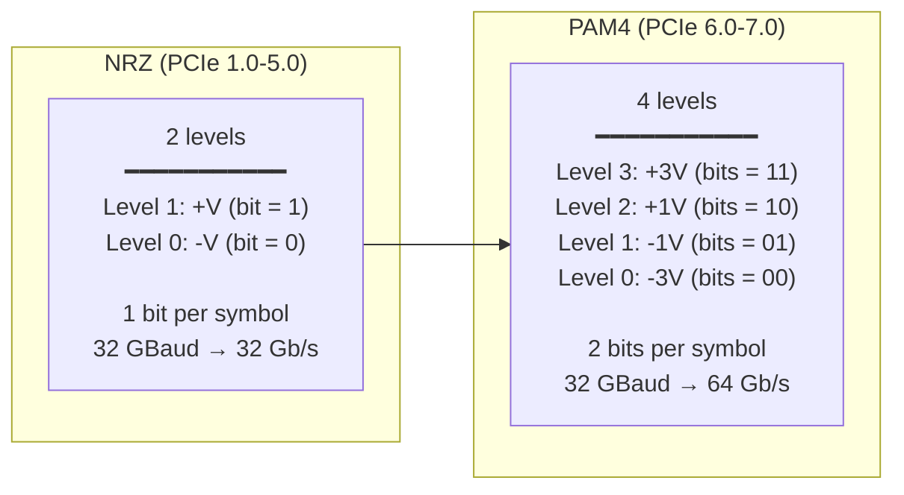

# PCIe 5.0 / 6.0 / 7.0 Generations — PCI Express Architecture

**Topic:** PCI Express specification evolution; PCIe 5.0 (32 GT/s), PCIe 6.0 (64 GT/s PAM4), PCIe 7.0 (128 GT/s); FLIT mode; lane architecture; PHY signaling; power management; form factors  
**Standards:** PCIe Base Specification 5.0 (2019), 6.0 (2022), 7.0 (2025), CEM Specification (Card Electromechanical)  
**SDO:** PCI-SIG (Peripheral Component Interconnect Special Interest Group)  
**Audience:** Silicon design engineers, hardware architects, system firmware engineers, storage/GPU/NIC engineers, motherboard designers  
**Prerequisites:** Digital signaling fundamentals, serial communication, basic computer architecture, PCB design concepts

---

## Chapter 1 — Historical Context & Origin Story

### 1.1 Timeline

| Year | Generation | Data Rate | Encoding | x16 BW | Key Innovation |
|:----:|:----------:|:---------:|:--------:|:------:|:--------------|
| 1992 | PCI (parallel) | 133 MB/s (32-bit/33MHz) | Parallel | — | Shared bus |
| 2004 | **PCIe 1.0** | 2.5 GT/s | 8b/10b | 4 GB/s | Serial point-to-point |
| 2007 | **PCIe 2.0** | 5 GT/s | 8b/10b | 8 GB/s | 2× speed |
| 2010 | **PCIe 3.0** | 8 GT/s | 128b/130b | 16 GB/s | Better encoding (1.5% overhead vs 20%) |
| 2017 | **PCIe 4.0** | 16 GT/s | 128b/130b | 32 GB/s | First in NVMe SSDs (Gen4) |
| **2019** | **PCIe 5.0** | 32 GT/s | 128b/130b | 64 GB/s | Data center GPUs/NICs/SSDs |
| **2022** | **PCIe 6.0** | 64 GT/s | **PAM4 + FLIT** | 128 GB/s | PAM4 signaling; FLIT mode |
| **2025** | **PCIe 7.0** | 128 GT/s | PAM4 + FLIT | 256 GB/s | 2× PCIe 6.0; AI/HPC target |
| ~2028 | PCIe 8.0 | 256 GT/s | TBD | 512 GB/s | Under research |

### 1.2 Why Bandwidth Keeps Doubling

| Driving Force | Bandwidth Demand |
|:---:|---|
| **AI/ML Accelerators (GPUs)** | GPU memory bandwidth exceeds 3 TB/s (HBM3); PCIe feeds data from CPU/NVMe to GPU. 8× GPU training needs 8×16 lanes = massive aggregate. |
| **NVMe SSDs** | Single SSD: 14 GB/s (Gen5 x4). High-end RAID: 100+ GB/s aggregate. |
| **Network (400/800 GbE)** | Single 800 GbE NIC needs 100 GB/s → requires PCIe 6.0 x16 or PCIe 7.0 x8 |
| **CXL Memory** | CXL 3.0 over PCIe 6.0/7.0: memory expansion/pooling requires massive bandwidth for cache coherence traffic |
| **Computational Storage** | Accelerators (FPGA, DPU) on PCIe need high bandwidth for inline processing |
| **Disaggregation** | PCIe fabric (switches, retimers) distributes I/O across chassis; needs bandwidth headroom |

---

## Chapter 2 — PCIe Architecture Fundamentals

### 2.1 Layer Model

```mermaid
graph TB
    subgraph "PCIe Protocol Stack"
        TL[Transaction Layer<br/>━━━━━━━━━━━<br/>• TLP (Transaction Layer Packet)<br/>• Memory Read/Write<br/>• I/O Read/Write<br/>• Config Read/Write<br/>• Message/Completion<br/>• Flow control credits<br/>• Ordering rules]
        
        DL[Data Link Layer<br/>━━━━━━━━━━━<br/>• DLLP (Data Link Layer Packet)<br/>• Sequence number<br/>• LCRC (32-bit CRC)<br/>• ACK/NAK retry protocol<br/>• Power management<br/>• Flow control update]
        
        PL[Physical Layer<br/>━━━━━━━━━━━<br/>• Electrical signaling (NRZ/PAM4)<br/>• Encoding (128b/130b or FLIT)<br/>• Lane width (x1/x2/x4/x8/x16)<br/>• Equalization (CTLE, DFE)<br/>• Training (LTSSM state machine)<br/>• Retimers]
    end
    
    TL --> DL --> PL
```

### 2.2 TLP (Transaction Layer Packet)

| TLP Type | Code | Description |
|:--------:|:----:|-------------|
| Memory Read (MRd) | 0x00/0x20 | Read from memory-mapped space (32/64-bit address) |
| Memory Write (MWr) | 0x40/0x60 | Write to memory-mapped space |
| I/O Read/Write | 0x02/0x42 | Legacy I/O space access |
| Config Read/Write | 0x04/0x44 | Configuration space access (Type 0/1) |
| Completion (Cpl/CplD) | 0x0A/0x4A | Response to read request (with/without data) |
| Message (Msg/MsgD) | 0x30-0x37 | In-band signaling (interrupts, errors, power) |
| AtomicOp | 0x4C-0x5C | Fetch-Add, Swap, CAS (atomic operations) |

### 2.3 Lane Configuration

| Width | Use Case | Typical Device |
|:-----:|----------|:---:|
| x1 | Low-bandwidth add-in | WiFi card, basic NIC, audio |
| x2 | Emerging (CXL Type 3) | Memory expander |
| x4 | NVMe SSD; mid-range NIC | Samsung 990 Pro; 10/25 GbE NIC |
| x8 | High-end NIC; RAID controller | 100 GbE NIC; HBA |
| x16 | GPU; high-end accelerator | NVIDIA H100; AMD MI300X |

---

## Chapter 3 — PCIe 5.0 Technical Deep Dive

### 3.1 PCIe 5.0 Specifications

| Parameter | Value | Notes |
|:---------:|:-----:|-------|
| Data rate | 32 GT/s per lane | 2× PCIe 4.0 |
| Encoding | 128b/130b | Same as Gen3/4; ~1.5% overhead |
| Signaling | NRZ (2-level) | Binary: 0 or 1 |
| x1 bandwidth | ~4 GB/s (each direction) | 32 × (128/130) / 8 = 3.94 GB/s |
| x4 bandwidth | ~16 GB/s | Typical NVMe SSD config |
| x16 bandwidth | ~64 GB/s | GPU; 800 GbE NIC |
| Channel loss budget | ~36 dB @ 16 GHz | Requires advanced equalization |
| Equalization | CTLE + DFE (3+ taps) | Complex receiver equalization |
| Retimers | Up to 2 | Signal regeneration for long traces |
| Reach | ~12 inches (add-in card) | Without retimer |
| Power | Same as Gen4 CEM slot | 75W (slot) + 600W (aux 16-pin) |
| Spec release | 2019 | Production 2022-2023 |

### 3.2 Key PCIe 5.0 Features

| Feature | Description |
|:-------:|-------------|
| **32 GT/s NRZ** | Doubled from 16 GT/s; maintains NRZ (binary) signaling |
| **Enhanced equalization** | More complex CTLE/DFE required; receiver must handle 36 dB loss |
| **Retimers** | Active signal regeneration devices in channel; enables longer traces and cables |
| **ECN updates** | Multiple engineering change notices for signal integrity refinements |
| **Backward compatible** | PCIe 5.0 device works in Gen4/3/2/1 slot (auto-negotiates speed) |
| **CEM 5.0** | Card electromechanical spec: same physical connector; thermal challenges at 300-600W |

---

## Chapter 4 — PCIe 6.0 Technical Deep Dive

### 4.1 PCIe 6.0 Specifications

| Parameter | Value | Notes |
|:---------:|:-----:|-------|
| Data rate | 64 GT/s per lane | 2× PCIe 5.0 |
| Encoding | **FLIT (Flow Control Unit)** | Fixed-size 256-byte FLITs; no 128b/130b |
| Signaling | **PAM4 (4-level)** | 4 voltage levels → 2 bits per symbol |
| Symbol rate | 32 GBaud | Same Nyquist freq as PCIe 5.0 (32 GHz) |
| x1 bandwidth | ~8 GB/s (each direction) | 64 × (242/256) / 8 ≈ 7.56 GB/s effective |
| x4 bandwidth | ~32 GB/s | |
| x16 bandwidth | ~128 GB/s | Single device; massive |
| FEC | CRC + 1-bit-per-symbol correction | Lightweight FEC for PAM4 errors |
| Channel loss budget | ~36 dB @ 16 GHz (PAM4) | Same frequency as Gen5; but PAM4 has 9.5 dB SNR penalty |
| Spec release | 2022 | Production expected 2025-2026 |

### 4.2 PAM4 Signaling



**Why PAM4?**
- NRZ at 64 GBaud (needed for 64 GT/s raw) would require 32 GHz Nyquist frequency → channel loss too high
- PAM4 at 32 GBaud achieves 64 GT/s at SAME frequency as PCIe 5.0 (32 GBaud NRZ = 32 GT/s)
- Trade-off: PAM4 has 3 "eyes" instead of 1; each eye is 1/3 height → 9.5 dB SNR penalty → needs FEC

### 4.3 FLIT Mode (PCIe 6.0+)

| Aspect | Pre-FLIT (Gen 1-5) | FLIT Mode (Gen 6+) |
|:------:|:---:|:---:|
| **Packet unit** | Variable-length TLP (up to 4096 bytes) | Fixed 256-byte FLIT |
| **Per-TLP CRC** | 32-bit LCRC per TLP (in Data Link Layer) | **CRC per FLIT (8 bytes)** |
| **Error correction** | Retry (NAK → full TLP retransmit) | **FEC: correct 1 symbol error per FLIT** + retry for multi-bit |
| **Efficiency** | Overhead: DLL header + LCRC + framing per TLP | **Fixed overhead per FLIT**: always 256B → predictable; lower amortized overhead for large payloads |
| **Ordering** | TLP-level ordering (complex rules) | FLIT-level ordering (simplified) |
| **Why change** | Variable TLP + per-TLP CRC overhead increases with small packets | PAM4 has higher raw BER; need FEC. Fixed FLIT enables efficient FEC/CRC. Reduces protocol overhead. |

**FLIT structure (256 bytes):**
```
[TLP data (up to 236 bytes)] [FLIT header (12 bytes)] [CRC (8 bytes)]
```
- Multiple small TLPs can be packed into one FLIT
- If TLP exceeds 236 bytes: spans multiple FLITs

---

## Chapter 5 — PCIe 7.0 Technical Deep Dive

### 5.1 PCIe 7.0 Specifications

| Parameter | Value | Notes |
|:---------:|:-----:|-------|
| Data rate | **128 GT/s** per lane | 2× PCIe 6.0 |
| Encoding | FLIT (same as 6.0) | |
| Signaling | **PAM4** | Same as 6.0 |
| Symbol rate | **64 GBaud** | 2× PCIe 6.0 symbol rate |
| x1 bandwidth | ~16 GB/s (each direction) | |
| x4 bandwidth | ~64 GB/s | Single NVMe SSD: 64 GB/s (!) |
| x16 bandwidth | **~256 GB/s** | Single GPU slot |
| Channel challenge | **72 dB loss @ 32 GHz** | Extremely challenging; very short reach without retimers |
| FEC | Enhanced FEC (stronger than 6.0) | Higher BER at 64 GBaud PAM4 |
| Spec release | 2025 (1.0) | Production expected 2027-2028 |

### 5.2 Bandwidth Comparison Across Generations

| Generation | Rate (GT/s) | x1 BW (GB/s) | x4 BW (GB/s) | x16 BW (GB/s) | Signaling |
|:----------:|:-----------:|:-------------:|:-------------:|:--------------:|:---------:|
| Gen 3 | 8 | 1 | 4 | 16 | NRZ, 128b/130b |
| Gen 4 | 16 | 2 | 8 | 32 | NRZ, 128b/130b |
| Gen 5 | 32 | 4 | 16 | 64 | NRZ, 128b/130b |
| Gen 6 | 64 | 8 | 32 | 128 | PAM4, FLIT |
| **Gen 7** | **128** | **16** | **64** | **256** | PAM4, FLIT |

### 5.3 PCIe 7.0 Challenges

| Challenge | Description | Solution |
|:---------:|-------------|----------|
| **Channel loss** | 72 dB at 32 GHz (PAM4 at 64 GBaud); PCB traces attenuate heavily | Very short traces (~4 inches); mandatory retimers; advanced PCB materials (Megtron 7/8) |
| **Power** | Higher signaling speed → more power in PHY | Advanced FinFET/GAA process; low-power PAM4 SerDes |
| **BER (Bit Error Rate)** | PAM4 @ 64 GBaud has very high raw BER (~10⁻⁴) | Enhanced FEC (Reed-Solomon or similar); error threshold management |
| **Thermal** | 256 GB/s device + accelerator → 1000W+ TDP | Liquid cooling mandatory; new CEM form factors |
| **Reach** | Direct connection without retimer: ~2-4 inches | Retimers mandatory for add-in card; optical PCIe proposed |
| **Cost** | Advanced SerDes IP is expensive | Initially in premium devices only (GPU, HPC); trickles down |

---

## Chapter 6 — Power Management & Link Training

### 6.1 ASPM (Active State Power Management)

| State | Description | Exit Latency | Power Savings |
|:-----:|-------------|:---:|:---:|
| **L0** | Active (full bandwidth) | — | None |
| **L0s** | Low-power standby (electrical idle) | <1 μs (Gen3); <4 μs (Gen5) | ~40-50% link power |
| **L1** | Deeper sleep (PLL can turn off) | 2-4 μs (Gen3); 16-32 μs (Gen5) | ~70-80% link power |
| **L1.1** | L1 sub-state: reference clock off | ~32 μs | ~90% link power |
| **L1.2** | L1 sub-state: power fully removed from PHY | ~100 μs | ~95%+ link power |
| **L2** | Auxiliary power only (device in D3cold) | ~ms (full re-training) | Maximum (only aux power) |
| **L3** | Link off (device removed or not present) | — | — |

### 6.2 LTSSM (Link Training and Status State Machine)

```mermaid
stateDiagram-v2
    [*] --> Detect: Power-on / Hot-plug
    Detect --> Polling: Receiver detected
    Polling --> Configuration: TS1/TS2 exchange (speed/width negotiation)
    Configuration --> L0: Link number + lane assigned
    
    L0 --> Recovery: Error threshold / Speed change
    Recovery --> L0: Re-trained successfully
    Recovery --> Configuration: Downgrade needed
    
    L0 --> L0s: ASPM idle
    L0s --> L0: Wake (< 1-4 μs)
    
    L0 --> L1: Deeper idle
    L1 --> Recovery: Wake (re-train; 2-32 μs)
    
    L0 --> L2: D3cold transition
    L2 --> Detect: Power restored
    
    Recovery --> Detect: Training failed (hot-reset)
    Detect --> Disabled: Link disabled
```

### 6.3 Equalization (Gen 3+)

| Phase | Description | Who Participates |
|:-----:|-------------|:---:|
| **Phase 0** | Transmitter sends preset (predefined Tx EQ settings) | Tx only |
| **Phase 1** | Receiver evaluates presets; selects best | Rx evaluates |
| **Phase 2** | Tx adjusts coefficients based on Rx feedback | Tx+Rx negotiate |
| **Phase 3** | Rx adjusts its own EQ (CTLE, DFE) to optimize eye | Rx internal |

**Gen 5+ equalization complexity**: At 32 GT/s NRZ (Gen5) or 32 GBaud PAM4 (Gen6/7), the channel (PCB trace + connector + cable) severely attenuates high-frequency content. Equalization must compensate 36+ dB of loss:
- **CTLE** (Continuous-Time Linear Equalizer): analog filter that boosts high frequencies at receiver
- **DFE** (Decision Feedback Equalizer): digital filter using previous bit decisions to remove ISI (inter-symbol interference)
- **FFE** (Feed-Forward Equalizer) at transmitter: pre-emphasis / de-emphasis

---

## Chapter 7 — PCIe Form Factors & Applications

### 7.1 Physical Form Factors

| Form Factor | Lanes | Use | Max Power | Physical |
|:-----------:|:-----:|-----|:---------:|----------|
| **CEM x16** | x16 | GPU, accelerator | 75W (slot) + 600W (aux) | Full-height add-in card |
| **CEM x4** | x4 | NIC, RAID | 25W (slot) | Low-profile |
| **M.2 (2280)** | x4 | NVMe SSD | 8-14W | 22×80 mm card |
| **M.2 (2230)** | x4 | NVMe SSD (laptop) | 3-5W | 22×30 mm card |
| **U.2** (2.5") | x4 | Enterprise SSD | 12-25W | 2.5" bay + SFF-8639 |
| **U.3** | x4 | Enterprise SSD (tri-mode) | 12-25W | 2.5" bay |
| **E1.S** (EDSFF) | x4 / x8 | Data center SSD | 12-70W | Enterprise & Data Center SSD FF |
| **E3.S** (EDSFF) | x4 / x8 | Data center SSD (high power) | 40-70W | Larger thermal envelope |
| **OCP NIC 3.0** | x16 | Data center NIC | 75-150W | OCP mezzanine |
| **CXL expansion** | x8 / x16 | Memory expander | 75-150W | CEM card or EDSFF |

### 7.2 PCIe Switch Architecture

```mermaid
graph TB
    subgraph "CPU (Root Complex)"
        RC[Root Complex<br/>━━━━━━━━━━━<br/>PCIe lanes from CPU:<br/>• 128 lanes (Gen5) typical<br/>• Connected to switch for expansion]
    end
    
    subgraph "PCIe Switch (e.g., Broadcom PEX)"
        SW[PCIe Switch<br/>━━━━━━━━━━━<br/>• Non-transparent bridge (NTB)<br/>• Lane fanout: x16 upstream → multiple x4 downstream<br/>• Low latency (~100 ns added)<br/>• Dynamic lane allocation]
    end
    
    subgraph "Downstream Devices"
        GPU1[GPU 1<br/>x16 Gen5]
        GPU2[GPU 2<br/>x16 Gen5]
        SSD1[NVMe SSD 1<br/>x4 Gen5]
        SSD2[NVMe SSD 2<br/>x4 Gen5]
        NIC[400 GbE NIC<br/>x16 Gen5]
    end
    
    RC -->|x16 Gen5| SW
    SW -->|x16| GPU1
    SW -->|x16| GPU2
    SW -->|x4| SSD1
    SW -->|x4| SSD2
    SW -->|x16| NIC
```

---

## Chapter 8 — Architecture Diagrams

### 8.1 PCIe PHY Architecture (Gen 5/6/7)

```mermaid
graph TB
    subgraph "Transmitter (Tx)"
        TX_DATA[Tx Data Path<br/>━━━━━━━━━━━<br/>• Scrambler (LFSR)<br/>• 128b/130b encode (Gen5)<br/>  or FLIT + FEC (Gen6/7)<br/>• Serializer (parallel→serial)]
        
        TX_EQ[Tx Equalization<br/>━━━━━━━━━━━<br/>• FFE (3-tap typical)<br/>  Pre-cursor: C(-1)<br/>  Main cursor: C(0)<br/>  Post-cursor: C(+1)<br/>• Programmable via EQ phases]
        
        TX_DRV[Tx Driver<br/>━━━━━━━━━━━<br/>• NRZ (Gen5): 2-level<br/>• PAM4 (Gen6/7): 4-level DAC<br/>• Voltage mode / Current mode<br/>• Impedance matched (50Ω)]
    end
    
    subgraph "Channel"
        CH[PCB Trace + Connectors<br/>━━━━━━━━━━━<br/>• 6-12 inches (add-in card)<br/>• Loss: 36 dB @ 16 GHz (Gen5/6)<br/>• Crosstalk (NEXT/FEXT)<br/>• Impedance discontinuities<br/>• Via stubs; connector reflections]
        
        RT[Retimer (optional)<br/>━━━━━━━━━━━<br/>• Full signal regeneration<br/>• Rx → CDR → Re-Tx<br/>• Up to 2 retimers per link<br/>• Transparent to protocol]
    end
    
    subgraph "Receiver (Rx)"
        RX_AFE[Rx Analog Front End<br/>━━━━━━━━━━━<br/>• CTLE (analog EQ)<br/>• Variable-gain amplifier<br/>• Offset calibration]
        
        RX_CDR[Clock & Data Recovery<br/>━━━━━━━━━━━<br/>• Extract clock from data<br/>• Phase interpolator<br/>• Jitter tracking bandwidth]
        
        RX_DFE[DFE (Digital Feedback EQ)<br/>━━━━━━━━━━━<br/>• 3-12+ taps<br/>• Cancel post-cursor ISI<br/>• Adapt continuously]
        
        RX_DATA[Rx Data Path<br/>━━━━━━━━━━━<br/>• Deserializer<br/>• Descrambler<br/>• Decode (128b/130b or FLIT)<br/>• FEC correction (Gen6/7)]
    end
    
    TX_DATA --> TX_EQ --> TX_DRV
    TX_DRV --> CH
    CH --> RT
    RT --> RX_AFE
    RX_AFE --> RX_CDR
    RX_AFE --> RX_DFE
    RX_DFE --> RX_DATA
```

### 8.2 PCIe Configuration Space

```mermaid
graph TB
    subgraph "PCIe Configuration Space (4096 bytes)"
        HDR[PCI Header (64 bytes)<br/>━━━━━━━━━━━<br/>• Vendor/Device ID<br/>• Command/Status<br/>• BAR 0-5 (Base Address Registers)<br/>• Interrupt line/pin<br/>• Subsystem ID]
        
        CAP[PCI Capabilities (variable)<br/>━━━━━━━━━━━<br/>• Power Management<br/>• MSI/MSI-X<br/>• PCI Express Capability<br/>• VPD (Vital Product Data)]
        
        ECAP[Extended Capabilities (offset 0x100+)<br/>━━━━━━━━━━━<br/>• Advanced Error Reporting (AER)<br/>• SR-IOV (Virtual Functions)<br/>• ACS (Access Control Services)<br/>• L1 PM Substates<br/>• Secondary PCIe Extended Capability<br/>• Data Link Feature<br/>• Lane Margining]
    end
    
    HDR --> CAP --> ECAP
```

---

## Chapter 9 — Case Studies

### 9.1 AI Training Cluster: PCIe Gen5 GPU Interconnect

| Aspect | Detail |
|--------|--------|
| **System** | 8-GPU AI training node (NVIDIA HGX-like); 2× CPU + 8× GPU |
| **PCIe configuration** | Each CPU: 128 PCIe 5.0 lanes. GPUs connected via NVLink for GPU-GPU. CPU-GPU via PCIe 5.0 x16. |
| **Problem** | GPU training data loading: each GPU needs 10-50 GB/s from storage. 8 GPUs × 50 GB/s = 400 GB/s aggregate storage read bandwidth needed. |
| **PCIe bandwidth budget** | CPU has 128 lanes Gen5 = 128 × 4 GB/s = 512 GB/s total. Allocated: 4× GPUs × x16 = 64 lanes = 256 GB/s. NICs × x16 = 64 GB/s. Storage (NVMe): 32 lanes = 128 GB/s. |
| **Storage architecture** | 8× NVMe SSDs (Gen5 x4 each = 14 GB/s) = 112 GB/s from local storage. Remaining bandwidth from network (NVMe-oF via 400 GbE NIC). |
| **Gen5 vs Gen4** | Gen4 x4 = 8 GB/s per SSD; 8 SSDs = 64 GB/s. NOT ENOUGH for GPU data loading rate. Gen5 doubles it to 112 GB/s. Critical for training throughput. |
| **Future: Gen6** | Gen6 x16 per GPU = 128 GB/s CPU-GPU (vs 64 GB/s Gen5). More headroom for model parameter updates via CPU. |

### 9.2 NVMe SSD: PCIe Generation Migration

| Scenario | Detail |
|----------|--------|
| **Challenge** | SSD controller chip designed for PCIe Gen4 x4 (8 GB/s). Marketing wants Gen5 x4 (16 GB/s). Same NAND backend (8 channels × 2.4 GB/s = 19.2 GB/s theoretical). |
| **PCIe IP block change** | Replace Gen4 SerDes with Gen5 SerDes. New PHY characteristics: 32 GT/s requires different PLL, DFE taps, equalization training. Silicon area +15%. Power +30% for PHY. |
| **Signal integrity challenge** | Gen5 @ 32 GT/s on M.2 2280 form factor: PCB trace length ~40 mm. Loss budget tighter. Required: (1) improved PCB stackup (lower-loss dielectric). (2) Better connector (M.2 gold finger impedance control). (3) Tighter manufacturing tolerance. |
| **Thermal** | Gen5 SSD dissipates 10-14W (vs 7-9W Gen4). M.2 2280 has limited thermal headroom. Solutions: (1) Heatsink mandatory. (2) Controller throttles at 70°C. (3) Thermal pad to motherboard. |
| **Actual throughput** | Despite 16 GB/s PCIe bandwidth, NAND backend limits sequential read to ~14 GB/s. PCIe Gen5 headroom useful for: (1) mixed workload (random + sequential simultaneously). (2) Future NAND generations with more channels. |
| **Backward compatibility** | Gen5 SSD works in Gen4 slot (auto-negotiates Gen4 speed). Consumer finds "Gen5 SSD" only runs at Gen4 in their motherboard → confusion. Clear labeling needed. |

---

## Chapter 10 — Future Evolution

| Trend | Timeline | Impact |
|-------|----------|--------|
| **PCIe 7.0 production** | 2027-2028 | 256 GB/s x16; needed for 1.6 TbE NICs and next-gen GPUs |
| **Optical PCIe** | 2026-2028 | Optical links replace electrical for long reaches (>30 cm); co-packaged optics on PCIe devices |
| **PCIe 8.0** | ~2029 | 256 GT/s; likely needs new modulation (PAM4 at 128 GBaud OR PAM8 / coherent) |
| **UCIe (Universal Chiplet Interconnect Express)** | 2024+ | Die-to-die PCIe-like protocol for chiplets (1-4 mm reach; TB/s bandwidth) |
| **CXL convergence** | 2024+ | CXL uses PCIe PHY; CXL 3.0 over PCIe 6.0 PHY; shared silicon |
| **PCIe over cable** | 2025+ | External PCIe (OCuLink 2.0; Thunderbolt 5 = PCIe tunneling); enable external GPU/storage |
| **Retimer ubiquity** | 2025+ | Gen6/7 require retimers for almost any connection >4 inches |
| **Power efficiency** | 2025+ | pJ/bit metric critical: Gen7 needs <3 pJ/bit to be practical at scale |

---

## Chapter 11 — Interview Questions & Career Guide

### Tier 1: Entry-Level

**Q1:** What is PCIe? Explain lanes, generations, and how bandwidth is calculated.

**A:** PCI Express (PCIe) is a high-speed serial point-to-point interconnect for connecting CPUs to I/O devices (GPUs, SSDs, NICs).

**Serial point-to-point:** Unlike old parallel PCI (shared bus), PCIe is:
- Serial: data sent one bit at a time per lane (at very high frequency)
- Point-to-point: dedicated link between two devices (not shared)

**Lanes:**
- A "lane" is one serial differential pair in each direction (Tx pair + Rx pair = 4 wires)
- Devices can use x1, x2, x4, x8, or x16 lanes in parallel
- More lanes = more bandwidth (linear scaling)

**Generations (data rate per lane):**
- Gen 3: 8 GT/s (Giga Transfers per second)
- Gen 4: 16 GT/s
- Gen 5: 32 GT/s
- Gen 6: 64 GT/s
- Gen 7: 128 GT/s

**Bandwidth calculation:**

$\text{Bandwidth} = \text{Rate (GT/s)} \times \text{Lanes} \times \text{Encoding Efficiency} / 8$

Example: PCIe 5.0 x4:
- Rate: 32 GT/s
- Lanes: 4
- Encoding: 128b/130b → efficiency = 128/130 ≈ 0.985
- One direction: $32 \times 4 \times 0.985 / 8 = 15.75 \text{ GB/s}$
- Bidirectional (full duplex): 15.75 GB/s each direction simultaneously

**Encoding overhead:**
- Gen 1-2: 8b/10b encoding → 20% overhead (only 80% is data)
- Gen 3-5: 128b/130b encoding → ~1.5% overhead (98.5% is data)
- Gen 6-7: FLIT mode → overhead in FLIT headers/CRC (~5-8%)

### Tier 2: Mid-Level

**Q2:** Explain PAM4 signaling in PCIe 6.0. Why was it adopted? What are the challenges?

**A:**

**What is PAM4:**
PAM4 (Pulse Amplitude Modulation, 4-level) transmits 2 bits per symbol by using 4 voltage levels instead of NRZ's 2 levels:

| Level | Voltage | Bits |
|:-----:|:-------:|:----:|
| 3 | +3V (normalized) | 11 |
| 2 | +1V | 10 |
| 1 | -1V | 01 |
| 0 | -3V | 00 |

Result: at 32 GBaud (same symbol rate as PCIe 5.0), PAM4 achieves 64 Gb/s (2× Gen5's 32 Gb/s).

**Why adopted for PCIe 6.0:**

The alternative was NRZ at 64 GBaud (needed for 64 GT/s). Problem:
- NRZ at 64 GBaud → Nyquist frequency = 32 GHz
- Channel (PCB trace) loss at 32 GHz is MUCH higher than at 16 GHz
- PCIe 5.0 already pushes channel limits at 16 GHz (36 dB loss budget)
- At 32 GHz, loss would be 50-60+ dB → practically impossible on standard PCB

PAM4 solution:
- Keep symbol rate at 32 GBaud (same frequency as Gen5!)
- Double bits per symbol: 2 bits/symbol × 32 GBaud = 64 Gb/s ✓
- Channel loss stays at ~36 dB @ 16 GHz (same as Gen5) → feasible on similar PCB materials

**Challenges of PAM4:**

1. **SNR (Signal-to-Noise Ratio) penalty: -9.5 dB**
   - NRZ has 1 eye opening (distance between 2 levels = full swing)
   - PAM4 has 3 eye openings (distance between adjacent levels = 1/3 of full swing)
   - Each eye is 1/3 the height → 20×log₁₀(1/3) ≈ -9.5 dB SNR loss
   - Result: much harder for receiver to distinguish levels; higher BER

2. **Higher raw BER (Bit Error Rate)**
   - NRZ at Gen5: raw BER ~10⁻¹² (almost error-free)
   - PAM4 at Gen6: raw BER ~10⁻⁶ to 10⁻⁴ (orders of magnitude worse)
   - REQUIRES Forward Error Correction (FEC) to achieve usable BER after correction

3. **FEC overhead and latency**
   - FEC adds encoding overhead (reduces effective bandwidth by ~5-8%)
   - FEC adds decode latency (~2-5 ns) in receiver
   - But: net gain is still 2× bandwidth over Gen5

4. **Linearity requirements**
   - NRZ: Tx driver just needs to swing between 2 levels (linear or not doesn't matter much)
   - PAM4: 4 levels must be EQUALLY spaced. Non-linearity in Tx DAC or channel causes eye closure
   - Requires precise calibration and linearity compensation

5. **Equalization complexity**
   - DFE for PAM4 must handle 4-level decisions (not binary)
   - More complex CTLE needed
   - Equalization adaptation is slower (more parameters to tune)

### Tier 3: Senior

**Q3:** Design a PCIe subsystem for a next-generation AI accelerator chip that needs 2 TB/s of aggregate I/O bandwidth. Consider PCIe generation, lane count, power, thermal, and alternative interconnects.

**A:**

**Requirement analysis:** 2 TB/s aggregate I/O bandwidth for an AI accelerator (like next-gen GPU or custom TPU).

**Approach 1: PCIe 7.0**
- Per lane: 128 GT/s → ~16 GB/s effective per lane
- x16 link: ~256 GB/s (one direction)
- For 2 TB/s: need 2000/256 ≈ 8× PCIe 7.0 x16 links
- Total lanes: 128 PCIe 7.0 lanes
- Feasibility: 128 lanes at 128 GT/s = extremely high SerDes count and power

**Power analysis (SerDes):**
| Component | PCIe 7.0 estimate |
|:---------:|:---:|
| SerDes power per lane | ~150-200 mW/lane (state of art: ~5 pJ/bit × 128 Gb/s) |
| 128 lanes | 128 × 175 mW = ~22 W just for SerDes PHY |
| Total I/O power (PHY + PLL + protocol logic) | ~35-50 W |
| Acceptable? | Yes, if total chip TDP is 500-1000W (typical AI accelerator) |

**Architecture:**

```
┌─────────────────────────────────────────────┐
│ AI Accelerator Die                           │
│                                              │
│ ┌──────────┐  ┌──────────┐  ┌──────────┐   │
│ │ Compute  │  │ HBM3/4   │  │ I/O      │   │
│ │ Array    │  │ Interface │  │ Subsystem │   │
│ │ (Matrix  │  │ (8× HBM  │  │          │   │
│ │  units)  │  │  stacks)  │  │ 8× PCIe  │   │
│ │          │  │ 8 TB/s    │  │ 7.0 x16  │   │
│ │          │  │ memory BW │  │ = 2 TB/s  │   │
│ └──────────┘  └──────────┘  │ aggregate │   │
│                              │           │   │
│                              │ Alt: 4×   │   │
│                              │ PCIe 7.0  │   │
│                              │ x16 = 1TB │   │
│                              │ + 4× UCIe │   │
│                              │ to chiplet│   │
│                              └──────────┘   │
└─────────────────────────────────────────────┘
```

**Alternative/Hybrid approach:**

Pure PCIe for 2 TB/s has challenges:
1. 128 lanes × 4 wires = 512 package pins just for I/O (ball/pad count)
2. PCB routing 128 differential pairs at 64 GBaud is extremely difficult

**Chiplet + UCIe approach:**
- Main die: 4× PCIe 7.0 x16 = 1 TB/s (external I/O to host)
- I/O chiplet (separate die in same package): additional 4× PCIe 7.0 x16 = 1 TB/s
- Die-to-die link (UCIe): 500 GB/s+ at <0.5 pJ/bit (much cheaper than PCIe)
- Total external: 2 TB/s; distributed across 2 dies → manageable pin count per die

**Host connection topology:**

| Configuration | Description |
|:---:|---|
| Direct to CPU | 8× x16 Gen7 from accelerator to CPU root complex. CPU needs 128 PCIe 7.0 lanes dedicated. Most CPUs will have 128-256 lanes total → one accelerator consumes ALL lanes. |
| Via PCIe switch | Multiple accelerators share CPU lanes through PCIe 7.0 switch. Switch adds ~100 ns latency. Useful for multi-accelerator nodes. |
| CXL alternative | For memory-semantic traffic (coherent): use CXL.cache/CXL.mem over same PHY. 4× links PCIe, 4× links CXL → split bandwidth between I/O and coherent memory. |
| Proprietary mesh | For multi-chip scale-up: NVLink/UALink proprietary interconnect between accelerators (higher BW than PCIe); PCIe only for host communication. |

**Thermal solution:**
- 500-1000W total chip → liquid cooling mandatory
- SerDes PHY at chip edge → thermal spreader must cover entire die
- Package: 2.5D or CoWoS (chip-on-wafer-on-substrate) with HBM stacks

---

## Chapter 12 — Cheat Sheet & Quick Reference

```
═══════════════════════════════════════════
PCIe 5.0 / 6.0 / 7.0 — QUICK REFERENCE
═══════════════════════════════════════════

BANDWIDTH TABLE (per direction):
  Gen  | GT/s | x1     | x4     | x8     | x16
  ─────┼──────┼────────┼────────┼────────┼────────
  3    | 8    | 1 GB/s | 4 GB/s | 8 GB/s | 16 GB/s
  4    | 16   | 2      | 8      | 16     | 32
  5    | 32   | 4      | 16     | 32     | 64
  6    | 64   | 8      | 32     | 64     | 128
  7    | 128  | 16     | 64     | 128    | 256

═══════════════════════════════════════════
SIGNALING EVOLUTION:
  Gen 1-5: NRZ (2-level); Binary; 1 bit/symbol
  Gen 6-7: PAM4 (4-level); 2 bits/symbol

ENCODING EVOLUTION:
  Gen 1-2: 8b/10b (20% overhead)
  Gen 3-5: 128b/130b (1.5% overhead)
  Gen 6-7: FLIT mode (256B fixed FLITs; FEC)

═══════════════════════════════════════════
PAM4 KEY FACTS:
  • 4 voltage levels → 2 bits per symbol
  • Same Baud rate as previous gen → 2× bit rate
  • SNR penalty: -9.5 dB (1/3 eye height)
  • Requires FEC (raw BER ~10⁻⁴ to 10⁻⁶)
  • More complex SerDes (DAC linearity critical)

═══════════════════════════════════════════
FLIT MODE (Gen 6+):
  • Fixed 256-byte Flow Control Units
  • Replaces variable-length TLP + per-TLP CRC
  • Includes embedded CRC + FEC per FLIT
  • Multiple small TLPs packed in one FLIT
  • Reduces protocol overhead for PAM4 BER

═══════════════════════════════════════════
LAYER MODEL:
  Transaction: TLP (Memory/IO/Config/Message)
  Data Link:   DLLP (ACK/NAK, CRC, seq#, retry)
  Physical:    Signaling, encoding, training

═══════════════════════════════════════════
POWER STATES (ASPM):
  L0:    Active (full BW)
  L0s:   Standby (<1-4 μs exit; ~50% power save)
  L1:    Sleep (2-32 μs exit; ~80% save)
  L1.1:  Ref clock off (~32 μs exit; ~90%)
  L1.2:  PHY off (~100 μs exit; ~95%)
  L2:    Aux power only (ms exit)

═══════════════════════════════════════════
FORM FACTORS:
  M.2 2280: x4 Gen5 NVMe SSD (8-14W)
  M.2 2230: x4 Gen5 laptop SSD (3-5W)
  CEM x16:  GPU/accelerator (75W slot+600W aux)
  E1.S/E3.S: Data center SSD (EDSFF)
  OCP NIC:  Data center NIC (x16)

═══════════════════════════════════════════
BANDWIDTH FORMULA:
  BW = (Rate_GT/s × Lanes × Encoding_Eff) / 8
  
  Gen5 x4: 32 × 4 × (128/130) / 8 = 15.75 GB/s
  Gen6 x16: 64 × 16 × (242/256) / 8 ≈ 121 GB/s
  Gen7 x16: 128 × 16 × (242/256) / 8 ≈ 242 GB/s

═══════════════════════════════════════════
EQUALIZATION (Gen 5+):
  Tx: FFE (pre/de-emphasis; 3-tap)
  Rx: CTLE (analog boost) + DFE (3-12 taps)
  Training: 4-phase negotiation (LTSSM)
  Retimers: signal regeneration (up to 2)

═══════════════════════════════════════════
KEY SPECS TO REMEMBER:
  Gen5: 32 GT/s NRZ; production 2022-23
  Gen6: 64 GT/s PAM4+FLIT; production 2025-26
  Gen7: 128 GT/s PAM4+FLIT; production 2027-28
  Gen8: 256 GT/s (research)
```

---

*End of Document — 05_PCIe_5_6_7_Generations.md*
