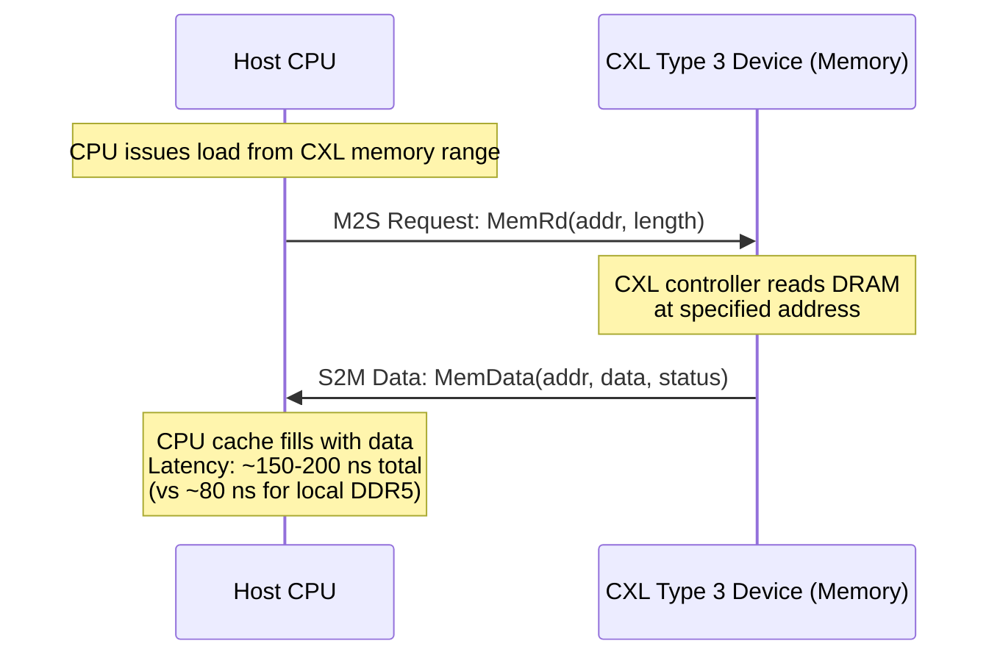

# CXL 3.1 — Compute Express Link Memory Fabric

**Topic:** CXL 3.1 specification; Compute Express Link architecture; CXL.io/CXL.cache/CXL.mem protocols; Type 1/2/3 devices; memory pooling; memory sharing; fabric switching; coherency; disaggregated memory  
**Standards:** CXL 1.1 (2020), CXL 2.0 (2022), CXL 3.0 (2022), CXL 3.1 (2023)  
**SDO:** CXL Consortium (Intel, AMD, ARM, Samsung, SK Hynix, Meta, Google, Microsoft, others)  
**Audience:** Memory system architects, data center architects, SoC designers, hyperscaler infrastructure engineers, DRAM/flash engineers  
**Prerequisites:** PCIe fundamentals (CXL uses PCIe PHY), cache coherency basics (MESI/MOESI), NUMA architecture, DDR memory concepts

---

## Chapter 1 — Historical Context & Origin Story

### 1.1 Timeline

| Year | Event | Significance |
|------|-------|-------------|
| 2019 | CXL 1.0/1.1 released (Intel) | Initial spec; CPU↔device cache coherency over PCIe PHY |
| 2020 | CXL Consortium formed | Industry-wide (AMD, ARM joined); open standard |
| 2020 | Gen-Z, CCIX, OpenCAPI compete | Multiple cache-coherent interconnect standards |
| **2022** | **CXL 2.0** | Memory pooling; switching; hot-plug; dynamic capacity |
| **2022** | **CXL 3.0** | Fabric topology; peer-to-peer; memory sharing across hosts; 256-device fabric |
| 2022 | Gen-Z, CCIX merged into CXL | CXL becomes the unified standard (competitors join) |
| **2023** | **CXL 3.1** | Enhancements: port-based routing; TSP (security); peer-to-peer DMA; improved fabric |
| 2023-24 | First CXL 1.1/2.0 products ship | Samsung, SK Hynix, Micron CXL memory expanders |
| 2025+ | CXL 3.x products | Fabric-attached memory; memory pooling at scale |

### 1.2 Why CXL Was Created

| Problem | Previous Solution | CXL Solution |
|:-------:|:---:|:---:|
| **Memory capacity wall** | Add more DDR slots (limited by CPU pin count) | **CXL memory expander**: attach memory over PCIe PHY (virtually unlimited) |
| **Stranded memory** | Server A has excess DRAM; Server B is memory-starved | **Memory pooling**: shared CXL memory pool dynamically allocated |
| **Coherent device access** | GPU/FPGA must copy data to/from CPU memory (latency, BW waste) | **CXL.cache**: device caches CPU memory coherently (no copies) |
| **Memory cost** | Every server provisioned for peak memory → low average utilization | **Disaggregated memory**: shared memory reduces total DRAM TCO by 20-40% |
| **NUMA imbalance** | Non-uniform memory access within server only | **CXL fabric**: uniform memory access across rack (CXL-attached memory appears as another NUMA node) |
| **Device diversity** | Custom interconnects for accelerators (NVLink, etc.) | **Open standard**: CXL over standard PCIe PHY; all vendors interoperable |

---

## Chapter 2 — CXL Architecture

### 2.1 Three Sub-Protocols

```mermaid
graph TB
    subgraph "CXL Protocol Stack (over PCIe PHY)"
        IO[CXL.io<br/>━━━━━━━━━━━<br/>• PCIe-based I/O protocol<br/>• Device enumeration & config<br/>• DMA (non-coherent)<br/>• Interrupts (MSI-X)<br/>• Same as PCIe TLP semantics<br/>• Used by all CXL devices]
        
        CACHE[CXL.cache<br/>━━━━━━━━━━━<br/>• Device→Host coherent access<br/>• Device caches host memory lines<br/>• Snoop from host to device<br/>• H2D: snoop requests<br/>• D2H: data/snoop responses<br/>• Keeps device cache coherent<br/>  with CPU cache hierarchy]
        
        MEM[CXL.mem<br/>━━━━━━━━━━━<br/>• Host→Device memory access<br/>• Host reads/writes device memory<br/>• Device-attached DRAM/PMEM<br/>• M2S: memory requests (read/write)<br/>• S2M: memory data/completions<br/>• Host manages coherency<br/>  (bias: host-managed or device-managed)]
    end
    
    IO --- CACHE --- MEM
```

### 2.2 CXL Device Types

| Type | Protocols Used | Example Device | Use Case |
|:----:|:--------------:|:--------------:|----------|
| **Type 1** | CXL.io + CXL.cache | SmartNIC, NIC with coherent cache | Device caches host memory for low-latency packet processing; no device-attached memory |
| **Type 2** | CXL.io + CXL.cache + CXL.mem | GPU, FPGA accelerator with local memory | Device has its own memory AND caches host memory; full coherency between host and device |
| **Type 3** | CXL.io + CXL.mem | Memory expander, memory pool | Device provides additional memory to host; no device-initiated caching; simplest |

### 2.3 CXL Memory Expansion (Type 3)

```mermaid
graph TB
    subgraph "Server"
        CPU[CPU<br/>━━━━━━━━━━━<br/>• DDR5 channels (local DRAM)<br/>• CXL root port (PCIe PHY)<br/>• CXL Home Agent<br/>  (manages coherency for CXL mem)]
        
        LOCAL[Local DDR5 DRAM<br/>━━━━━━━━━━━<br/>512 GB (8 DIMMs)<br/>Latency: ~80 ns<br/>BW: 300 GB/s]
    end
    
    subgraph "CXL Memory Expander (Type 3)"
        CTRL[CXL Controller<br/>━━━━━━━━━━━<br/>• CXL.io + CXL.mem protocol<br/>• PCIe PHY (Gen5/6 x8/x16)<br/>• Memory controller (DDR5)]
        
        CXL_MEM[Expanded DRAM<br/>━━━━━━━━━━━<br/>1-2 TB (additional capacity)<br/>Latency: ~150-200 ns<br/>BW: 64-128 GB/s (per link)]
    end
    
    CPU --> LOCAL
    CPU -->|CXL x8/x16 Gen5| CTRL
    CTRL --> CXL_MEM
```

---

## Chapter 3 — CXL.cache and CXL.mem Deep Dive

### 3.1 CXL.cache Protocol Flow

```mermaid
sequenceDiagram
    participant DEV as CXL Device (Type 1/2)
    participant HOST as Host CPU (Home Agent)
    
    Note over DEV: Device wants to cache<br/>host memory line at addr A
    
    DEV->>HOST: D2H Request: RdOwn(A) [request exclusive ownership]
    
    Note over HOST: Check: is line in CPU cache?<br/>If yes: snoop CPU; get data<br/>If no: fetch from DRAM
    
    HOST->>DEV: H2D Data: Data(A) + SnpInv [grant exclusive; invalidate copies]
    
    Note over DEV: Device now has exclusive cache line<br/>Can read/modify without further requests
    
    Note over HOST: Later: CPU needs line A back
    HOST->>DEV: H2D Snoop: SnpInv(A) [request device invalidate]
    DEV->>HOST: D2H Response: RspIHitSE(A) + Data [return modified data]
    
    Note over HOST: Host has latest data; device invalidated
```

### 3.2 CXL.mem Protocol Flow



### 3.3 Coherency Models (Bias)

| Model | Description | Best For |
|:-----:|-------------|----------|
| **Host Bias** | Host manages all coherency; device memory treated like remote NUMA node; host caches device memory in CPU caches freely | Type 3 memory expanders; host-dominated access patterns |
| **Device Bias** | Device manages coherency for its own memory; host must request before caching | Type 2 accelerators (GPU) where device is primary user of its memory |
| **Dynamic Bias** | Bias can change per memory region at runtime | Mixed workloads; runtime optimization |

---

## Chapter 4 — CXL 2.0: Memory Pooling

### 4.1 Pooling Architecture

```mermaid
graph TB
    subgraph "Compute Nodes"
        H1[Host 1<br/>(CXL port)]
        H2[Host 2<br/>(CXL port)]
        H3[Host 3<br/>(CXL port)]
        H4[Host 4<br/>(CXL port)]
    end
    
    subgraph "CXL Switch"
        SW[CXL 2.0 Switch<br/>━━━━━━━━━━━<br/>• Routes CXL.mem transactions<br/>• Virtual CXL Switch (VCS)<br/>• Dynamic assignment<br/>• Hot-plug support<br/>• Up to 16 upstream ports]
    end
    
    subgraph "CXL Memory Pool"
        P1[Memory Device 1<br/>256 GB DDR5<br/>(Type 3 Pooled)]
        P2[Memory Device 2<br/>256 GB DDR5]
        P3[Memory Device 3<br/>256 GB DDR5]
        P4[Memory Device 4<br/>256 GB DDR5]
    end
    
    H1 --> SW
    H2 --> SW
    H3 --> SW
    H4 --> SW
    SW --> P1
    SW --> P2
    SW --> P3
    SW --> P4
```

### 4.2 Pooling vs. Sharing

| Concept | CXL 2.0 Pooling | CXL 3.0 Sharing |
|:-------:|:---:|:---:|
| **Access model** | Memory device assigned to ONE host at a time | Memory region accessible by MULTIPLE hosts simultaneously |
| **Coherency** | Single host owns; no multi-host coherency needed | Multi-host coherency required (hardware back-invalidation) |
| **Dynamic reassignment** | Yes: Fabric Manager can move device between hosts | Yes: plus concurrent access |
| **Isolation** | Hardware-enforced: only assigned host can access | Software-managed: shared regions explicitly allocated |
| **Use case** | Elastic memory: scale up/down per VM; burst capacity | Shared data structures: distributed databases; MPI shared memory |

### 4.3 Dynamic Capacity Device (DCD)

| Feature | Description |
|:-------:|-------------|
| **Dynamic capacity** | Host doesn't see all physical memory at init; device adds/removes memory regions dynamically |
| **Add/Release events** | Device sends event to host: "new capacity available" or "capacity being removed" (host must release) |
| **Over-subscription** | Total advertised capacity across hosts > physical capacity (like VM memory overcommit) |
| **Regions** | Physical memory divided into regions (like memory zones); each region can be assigned independently |
| **Use case** | Cloud: allocate CXL memory to VMs on-demand; release when VM is destroyed; no reboot needed |

---

## Chapter 5 — CXL 3.0/3.1: Fabric & Multi-Host

### 5.1 CXL Fabric Topology

```mermaid
graph TB
    subgraph "Rack-Scale CXL 3.0 Fabric"
        subgraph "Compute Pods"
            H1[Host 1] 
            H2[Host 2]
            H3[Host 3]
            H4[Host 4]
        end
        
        subgraph "CXL Fabric Switches"
            L1[Leaf Switch 1<br/>(CXL 3.0)]
            L2[Leaf Switch 2<br/>(CXL 3.0)]
            SP[Spine Switch<br/>(CXL 3.0)]
        end
        
        subgraph "Memory Resources"
            M1[Memory Pool A<br/>2 TB DDR5<br/>Shared: Host 1+2]
            M2[Memory Pool B<br/>2 TB DDR5<br/>Shared: Host 3+4]
            M3[Memory Pool C<br/>4 TB CXL PMEM<br/>Persistent; shared all]
        end
        
        subgraph "Accelerators"
            GPU1[GPU (Type 2)<br/>CXL coherent<br/>80 GB HBM]
            FPGA1[FPGA (Type 2)<br/>CXL coherent]
        end
    end
    
    H1 --> L1
    H2 --> L1
    H3 --> L2
    H4 --> L2
    L1 --> SP
    L2 --> SP
    SP --> M1
    SP --> M2
    SP --> M3
    L1 --> GPU1
    L2 --> FPGA1
```

### 5.2 CXL 3.0 Key Features

| Feature | Description |
|:-------:|-------------|
| **Multi-level switching** | Up to 4 levels of CXL switches (leaf-spine fabric); up to 4096 devices in fabric |
| **Peer-to-peer** | Device-to-device communication (GPU↔memory; GPU↔GPU) without going through host |
| **Memory sharing** | Multiple hosts access same memory region simultaneously; hardware coherency |
| **Back-invalidation** | When shared memory is modified, hardware invalidates cached copies in other hosts |
| **Global Fabric Attached Memory (GFAM)** | Memory devices directly on fabric; all hosts can map into their address space |
| **Port-based routing (3.1)** | Routing based on port ID (not address); more scalable for large fabrics |
| **TSP (Trusted Security Protocol) (3.1)** | Encryption + integrity for CXL traffic across fabric (untrusted switches) |

### 5.3 CXL 3.1 Enhancements

| Enhancement | Description |
|:-----------:|-------------|
| **Port-based routing** | Route CXL transactions by destination port ID rather than memory address → supports larger address spaces and simpler switch implementation |
| **Enhanced peer-to-peer DMA** | Direct memory access between CXL devices without host involvement; for GPU-to-GPU or GPU-to-memory transfers |
| **TSP (Trusted Security Protocol)** | IDE (Integrity & Data Encryption) for CXL links; AES-256-GCM; protects against physical attacks on fabric |
| **Improved fabric management** | Enhanced FM (Fabric Manager) APIs; better discovery; hot-plug improvements |
| **CXL.cachemem extended** | Combined protocol mode enhancements for Type 2 devices on fabric |

---

## Chapter 6 — Performance & Latency Analysis

### 6.1 CXL Latency Budget

| Component | Latency (ns) | Notes |
|:---------:|:---:|-------|
| CPU cache miss (LLC miss) | ~10 | Before any memory access |
| CXL protocol processing (host) | ~20-30 | CXL Home Agent; address decode |
| PCIe PHY + link (host side) | ~5-10 | Serialization; PHY processing |
| Cable/trace propagation | ~2-5 | Speed of light in trace |
| CXL switch (if present) | ~50-80 | Switch routing + buffering |
| PCIe PHY + link (device side) | ~5-10 | |
| CXL controller on device | ~20-30 | Protocol processing |
| DRAM access on device | ~40-80 | DDR5 tCAS + data transfer |
| Return path | ~60-120 | Similar to forward |
| **Total (direct, no switch)** | **~150-200 ns** | vs. 80 ns local DDR5 |
| **Total (1 switch)** | **~250-350 ns** | With CXL 2.0 switch |
| **Total (2 switches)** | **~350-500 ns** | CXL 3.0 fabric |

### 6.2 Bandwidth

| Configuration | Bandwidth (one direction) | Notes |
|:---:|:---:|---|
| CXL x8 Gen5 | ~32 GB/s | Single link; common for Type 3 expander |
| CXL x16 Gen5 | ~64 GB/s | High-end; GPU/accelerator |
| CXL x16 Gen6 | ~128 GB/s | Future; matches DDR5 channel bandwidth |
| Local DDR5 (8 channels) | ~300-400 GB/s | Still much higher than CXL |

### 6.3 CXL vs Local DRAM

| Metric | Local DDR5 | CXL Type 3 (direct) | CXL via Switch |
|:------:|:---:|:---:|:---:|
| Latency | ~80 ns | ~150-200 ns | ~250-350 ns |
| Bandwidth | 300-400 GB/s (8ch) | 32-64 GB/s (per link) | Same per link |
| Capacity | 512 GB - 2 TB (limited by slots) | 1-16 TB (expandable) | Pooled: PBs |
| Cost per GB | $$$ (DDR5 DIMMs on CPU) | $$ (higher capacity, lower cost/GB at scale) | $ (shared; higher utilization) |
| Best for | Hot data; latency-critical | Warm data; capacity expansion | Cold data; elastic; shared |

---

## Chapter 7 — Comparison: CXL vs. Alternatives

| Dimension | CXL | NVLink (NVIDIA) | Intel UPI | GenZ (defunct) | OpenCAPI (defunct) |
|:---------:|:---:|:---:|:---:|:---:|:---:|
| **Purpose** | General interconnect (memory, I/O, coherent) | GPU-GPU high-BW | CPU-CPU coherent | Memory fabric | Coherent device attach |
| **PHY** | PCIe Gen5/6/7 | Custom (NVLink 4: 900 GB/s) | Custom | Custom | OpenCAPI PHY |
| **Coherency** | Yes (CXL.cache/CXL.mem) | Yes (NVLink coherent) | Full MESI | Yes | Yes |
| **Memory semantic** | Yes (CXL.mem: load/store to device memory) | Yes (unified memory) | N/A | Yes | Yes |
| **Switching** | Yes (CXL 2.0+; fabric in 3.0) | NVSwitch (proprietary) | N/A | Yes (fabric) | No |
| **Pooling** | Yes (CXL 2.0+) | No | No | Yes | No |
| **Multi-vendor** | Yes (open consortium) | NVIDIA only | Intel only | Open (merged into CXL) | IBM+consortium (merged) |
| **Status** | Active; growing | Active (NVIDIA ecosystem) | Active (Intel CPUs) | Merged into CXL (2022) | Merged into CXL |
| **Ecosystem** | Broad (Intel, AMD, ARM, Samsung, ...) | NVIDIA GPUs only | Intel server CPUs only | — | — |

---

## Chapter 8 — Architecture Diagrams

### 8.1 CXL Type 2 Device (GPU/Accelerator) Architecture

```mermaid
graph TB
    subgraph "Host CPU"
        CPU_CACHE[CPU Cache Hierarchy<br/>L1/L2/L3]
        HA[CXL Home Agent<br/>━━━━━━━━━━━<br/>• Manages coherency for<br/>  device memory (CXL.mem)<br/>• Snoops device via CXL.cache<br/>• Bias management]
        CPU_MEM_CTRL[Memory Controller<br/>(DDR5 channels)]
        CPU_DRAM[Local DDR5 DRAM<br/>512 GB]
    end
    
    subgraph "CXL Link (PCIe Gen5 x16)"
        LINK[64 GB/s bidirectional<br/>━━━━━━━━━━━<br/>CXL.io + CXL.cache + CXL.mem<br/>multiplexed on same link]
    end
    
    subgraph "CXL Type 2 Device (GPU)"
        DEV_CACHE[Device Cache<br/>━━━━━━━━━━━<br/>Caches HOST memory lines<br/>(coherent via CXL.cache)]
        
        DEV_CTRL[CXL Device Controller<br/>━━━━━━━━━━━<br/>• CXL.io: enumeration, DMA<br/>• CXL.cache: cache host mem<br/>• CXL.mem: expose device DRAM<br/>• HDM (Host-managed Device Memory)]
        
        DEV_MEM[Device Local Memory<br/>━━━━━━━━━━━<br/>HBM3 / GDDR6X<br/>80 GB; 3 TB/s internal BW<br/>Accessible by host via CXL.mem]
        
        COMPUTE[Compute Engines<br/>━━━━━━━━━━━<br/>• Tensor cores / Stream processors<br/>• Access both: device mem (fast)<br/>  and host mem (via CXL.cache)]
    end
    
    CPU_CACHE --> HA
    HA --> CPU_MEM_CTRL --> CPU_DRAM
    HA --> LINK
    LINK --> DEV_CTRL
    DEV_CTRL --> DEV_CACHE
    DEV_CTRL --> DEV_MEM
    DEV_CACHE --> COMPUTE
    DEV_MEM --> COMPUTE
```

### 8.2 CXL Memory Tiering (OS View)

```mermaid
graph TB
    subgraph "Operating System Memory View"
        OS[Linux Kernel<br/>━━━━━━━━━━━<br/>NUMA Topology:<br/>• Node 0: Local DDR5 (fast)<br/>• Node 1: CXL Memory (slower)<br/>• Auto-tiering: hot pages → Node 0<br/>  cold pages → Node 1]
    end
    
    subgraph "NUMA Node 0 (Local DDR5)"
        N0[512 GB DDR5<br/>━━━━━━━━━━━<br/>Latency: 80 ns<br/>BW: 300 GB/s<br/>Hot data: active working set]
    end
    
    subgraph "NUMA Node 1 (CXL Memory)"
        N1[2 TB CXL-attached DDR5<br/>━━━━━━━━━━━<br/>Latency: 170 ns<br/>BW: 64 GB/s<br/>Warm data: large datasets]
    end
    
    subgraph "Tier 2 (Storage)"
        STOR[NVMe SSDs<br/>━━━━━━━━━━━<br/>Latency: 10-80 μs<br/>BW: 14 GB/s<br/>Cold data: persist/archive]
    end
    
    OS --> N0
    OS --> N1
    OS --> STOR
```

---

## Chapter 9 — Case Studies

### 9.1 Hyperscaler: CXL Memory Pooling for VM Elasticity

| Aspect | Detail |
|--------|--------|
| **Deployment** | Large cloud provider; 10,000 servers per cluster |
| **Problem** | Memory stranding: servers provisioned with 512 GB DDR5 for peak usage. Average utilization: 40%. 60% of $$$$ DRAM sits unused. At scale: 10,000 × 512 GB × 60% = 3 PB of wasted DRAM ($$$M wasted). |
| **CXL solution** | Reduce local DDR5 to 256 GB (enough for typical workload). Add CXL memory pool (shared) for burst capacity. Each rack has CXL switch + memory pool (2 TB shared across 16 servers). |
| **Architecture** | 16 servers → CXL 2.0 switch → 8× CXL memory expanders (256 GB each = 2 TB pool). Any server can dynamically claim memory from pool. |
| **Results** | (1) Local DRAM per server reduced 50% (512→256 GB): saves $2000/server × 10,000 = $20M. (2) Pool provides burst capacity: VMs that need >256 GB get CXL memory at ~170 ns (acceptable for most workloads). (3) Utilization of total DRAM increased from 40% to 75% (pooling reduces waste). (4) Net savings: ~$12M per cluster after CXL hardware cost. |
| **Trade-off** | CXL memory is ~2× latency vs local DDR5. Solution: OS memory tiering (Linux NUMA balancing) moves hot pages to local DDR5; cold pages to CXL. Most workloads see <5% performance impact. |

### 9.2 AI/ML: CXL for Large Model Training Data Staging

| Aspect | Detail |
|--------|--------|
| **Problem** | Training large language models (LLM) requires staging training data. Model: 70B parameters. Training dataset: 10 TB. GPU memory (HBM): 80 GB per GPU → data must stream from external memory. |
| **Bottleneck** | NVMe SSD: 14 GB/s per SSD. Even 8 SSDs = 112 GB/s. But data preprocessing (tokenization, augmentation) creates intermediate data needing ~500 GB-2 TB fast-access buffer. CPU DDR5 limited to 512 GB. |
| **CXL solution** | Add 4 TB CXL-attached DRAM (Type 3 expanders). Use as preprocessed data cache: (1) Data loaded from NVMe to CXL memory (background). (2) GPU training loop reads preprocessed batches from CXL memory via CPU (64 GB/s per CXL link × 2 links = 128 GB/s). (3) Eliminates SSD re-reads and CPU memory pressure. |
| **Performance** | Data loading no longer bottleneck: 128 GB/s from CXL > GPU consumption rate (~50 GB/s for 8 GPU training). Previously: SSD read stalls caused 20% GPU idle time. With CXL buffer: <2% GPU idle. Training time reduced 18%. |
| **Future (CXL 3.0)** | Direct GPU access to CXL memory via CXL.cache (peer-to-peer): GPU reads training data directly from fabric-attached CXL memory without going through CPU. Eliminates CPU copy overhead. |

---

## Chapter 10 — Future Evolution

| Trend | Timeline | Impact |
|-------|----------|--------|
| **CXL 4.0** | 2025-2026 (spec) | Over PCIe 7.0 PHY (128 GT/s); 256 GB/s per x16 link |
| **CXL over optical** | 2026-2028 | Optical CXL for rack-to-rack and cross-rack memory fabric (km distances) |
| **CXL persistent memory** | 2025+ | CXL-attached PMEM (replacing Intel Optane); byte-addressable persistent storage |
| **Memory-semantic computing** | 2025+ | Compute near CXL memory (processing-in-memory CXL devices) |
| **CXL + AI accelerators** | 2025+ | CXL coherent GPUs (AMD, Intel); unified memory between CPU and GPU |
| **Multi-host shared memory** | 2025+ | CXL 3.0 shared memory for distributed systems (replace network for shared state) |
| **CXL-attached disaggregated storage** | 2025+ | NVMe over CXL: storage with memory semantics (byte-addressable NVMe) |
| **Security hardening** | 2024+ | TSP mandatory for fabric; attestation for CXL devices; TEE integration |
| **Composable infrastructure** | 2026+ | Dynamically compose servers from CPU + CXL memory + CXL accelerators + CXL storage over fabric |

---

## Chapter 11 — Interview Questions & Career Guide

### Tier 1: Entry-Level

**Q1:** What is CXL? What problem does it solve? How does it relate to PCIe?

**A:** CXL (Compute Express Link) is a cache-coherent interconnect standard built on top of PCIe's physical layer (PHY). It uses the same electrical interface as PCIe (Gen5/6/7) but adds new protocols for memory and cache coherency.

**Problems CXL solves:**

1. **Memory capacity**: CPUs have limited DDR slots (typically 8-12 DIMMs, maxing at 2-4 TB). CXL allows attaching additional memory over PCIe lanes → virtually unlimited capacity expansion.

2. **Memory utilization**: In cloud/data center, servers are provisioned for peak memory → average utilization is only 30-50%. CXL enables memory pooling: unused memory on one server can be dynamically assigned to another (like memory-level time-sharing).

3. **Coherent accelerator access**: Without CXL, GPUs/FPGAs must explicitly copy data between host memory and device memory (high latency, wastes bandwidth). CXL enables coherent access: device can directly cache host memory (and host can directly access device memory) with hardware-maintained coherency.

**Relationship to PCIe:**
- CXL uses the SAME physical layer (PHY) as PCIe (same connectors, same electrical signaling, same SerDes)
- CXL adds new protocols ON TOP of the PCIe PHY:
  - CXL.io = essentially PCIe (for compatibility; enumeration; DMA)
  - CXL.cache = new protocol for device→host coherent caching
  - CXL.mem = new protocol for host→device memory access (load/store)
- A CXL port can negotiate to run as either PCIe or CXL (flexible)
- CXL Gen5 uses PCIe 5.0 PHY (32 GT/s); CXL Gen6 uses PCIe 6.0 PHY (64 GT/s)

### Tier 2: Mid-Level

**Q2:** Explain CXL device Types 1, 2, and 3. Give a use case for each.

**A:**

| | Type 1 | Type 2 | Type 3 |
|---|---|---|---|
| **Protocols** | CXL.io + CXL.cache | CXL.io + CXL.cache + CXL.mem | CXL.io + CXL.mem |
| **Device has own memory?** | No | Yes | Yes |
| **Device caches host memory?** | Yes | Yes | No |
| **Host accesses device memory?** | No | Yes | Yes |

**Type 1: CXL.io + CXL.cache**

*What*: Device has NO local memory attached to host, but can CACHE host memory lines coherently.

*Use case: SmartNIC / Network Adapter*
- NIC processes network packets. Packets arrive and need to be matched against connection table (stored in host memory).
- Without CXL: NIC does DMA read of connection table from host memory → waits for round-trip → processes packet. Every packet lookup = DMA transaction.
- With CXL (Type 1): NIC caches frequently-accessed connection table entries locally (coherent with host). Lookups hit device cache → no DMA needed → much lower latency. If host updates table: CXL.cache snoop invalidates device's stale copy.
- No CXL.mem needed because NIC doesn't have its own memory that the host needs to access.

**Type 2: CXL.io + CXL.cache + CXL.mem**

*What*: Device has its own memory AND can cache host memory. Host can also access device memory. Full coherency between both.

*Use case: GPU / FPGA Accelerator*
- GPU has 80 GB HBM (local high-bandwidth memory for computation).
- Training loop: GPU computes on data in HBM. But GPU also needs to read model parameters stored in host DDR5 (too large for HBM).
- CXL.cache: GPU caches host memory lines (model parameters) coherently → fast repeated access without DMA.
- CXL.mem: Host CPU can directly read/write GPU's HBM (for setup, debugging, shared data structures). When host writes to GPU HBM, coherency protocol ensures GPU sees latest data.
- Both CPU and GPU have coherent view of each other's memory → unified programming model.

**Type 3: CXL.io + CXL.mem**

*What*: Device provides additional memory to host. Device does NOT cache host memory (simplest device; just a memory expander).

*Use case: Memory Expander / Memory Pool*
- Server needs 2 TB of DRAM but only has 512 GB DDR5 slots.
- CXL Type 3 memory expander: add-in card with 1.5 TB DDR5, connected via CXL x8 Gen5.
- Host sees this as another NUMA node (higher latency: ~170 ns vs 80 ns local, but accessible via normal load/store).
- OS assigns cold pages to CXL memory; hot pages stay in fast local DDR5.
- No CXL.cache needed because memory expander doesn't compute or cache anything.

### Tier 3: Senior

**Q3:** Design a memory disaggregation architecture for a 1000-node cloud cluster using CXL 3.0. Address: topology, latency budgets, failure handling, memory tiering, and TCO impact.

**A:**

**Requirements:**
- 1000 compute nodes (hosting VMs/containers)
- Current: each node has 512 GB local DDR5 (total: 500 TB cluster DRAM)
- Goal: reduce total DRAM cost by 25-30% while maintaining performance for 95% of workloads
- Target latency for CXL memory: <300 ns (acceptable as NUMA tier 1)

**Topology: Pod-level CXL pooling**

```
Cluster: 1000 nodes
├── 50 pods × 20 nodes per pod
│   ├── Each pod has:
│   │   ├── 20 compute nodes (reduced: 256 GB local DDR5 each)
│   │   ├── 1× CXL 3.0 switch (20 upstream + 8 downstream ports)
│   │   └── 8× CXL Type 3 memory expanders (512 GB each = 4 TB pool per pod)
│   └── Total per pod: 20×256 GB local + 4 TB pool = 9.12 TB total accessible
└── Total cluster: 256 TB local + 200 TB pool = 456 TB total
    (vs. 500 TB before, but higher utilization)
```

**Latency analysis:**

| Path | Components | Latency |
|:----:|:----------:|:-------:|
| Local DDR5 | CPU→DRAM | ~80 ns |
| CXL pool (via switch) | CPU→CXL PHY→Switch→CXL PHY→Expander→DRAM→return | ~250-300 ns |
| Acceptable ratio | CXL / Local = 300/80 = 3.75× | Within NUMA 2-hop tolerance |

**Capacity planning:**

| Metric | Before (all local) | After (CXL pool) |
|:------:|:---:|:---:|
| Local DRAM per node | 512 GB | 256 GB |
| Total local DRAM | 500 TB | 256 TB |
| CXL pool total | 0 | 200 TB |
| Total accessible per node | 512 GB | 256 GB + up to 4 TB from pool |
| Average utilization (cluster) | ~40% | ~70% (pooling) |
| Peak handling | Requires over-provisioning every node | Pool absorbs peaks elastically |

**Memory tiering (OS integration):**

Linux kernel NUMA balancing (or custom page migration daemon):
- Hot pages (frequently accessed): migrate to local DDR5 (NUMA node 0)
- Warm pages (moderate access): stay/migrate to CXL memory (NUMA node 1)
- Cold pages (rarely accessed): swap to NVMe SSD (swap tier)

Policy: DAMON (Data Access Monitor) tracks page access patterns; migrates pages between tiers based on access frequency. Target: <5% pages on CXL that should be on local DDR5 at any time.

**Failure handling:**

| Failure | Impact | Mitigation |
|:-------:|--------|------------|
| CXL switch failure | All 20 nodes lose access to pool memory | (1) Dual-switch per pod (active-standby). (2) Pages in pool are non-critical (cold); hot pages on local DDR5 unaffected. (3) Pool data backed by replication or checkpoint. |
| Memory expander failure | One 512 GB device lost from pool | (1) 8 devices per pool; one failure = 12.5% pool reduction. (2) Affected pages remapped to other expanders or spilled to local. (3) ECC + memory poison notification → OS unmaps affected pages. |
| Compute node failure | Node loses its CXL pool allocation | (1) Pool memory released; Fabric Manager reclaims. (2) VM migrated to another node; CXL pool reassigned. |
| Link error | CXL link degrades or disconnects | (1) CXL 3.0 supports link degradation (reduce width). (2) Multipath: dual-link per node to switch (active-active). |

**Security (CXL 3.1 TSP):**

| Concern | Solution |
|:-------:|---------|
| Multi-tenant data isolation | TSP encryption per-host session; hardware key per tenant |
| Fabric sniffing | AES-256-GCM encryption on CXL links across switch |
| Rogue device | Device attestation before joining fabric; CXL IDE key exchange |
| Memory poisoning | ECC + CXL poison flag; OS handles corrupted cache lines gracefully |

**TCO analysis:**

| Item | Before | After | Delta |
|:----:|:------:|:-----:|:-----:|
| DDR5 DIMMs (per node) | 512 GB × $8/GB = $4096 | 256 GB × $8/GB = $2048 | -$2048 × 1000 = **-$2.0M** |
| CXL switches (per pod) | 0 | $15,000 × 50 pods | +$750K |
| CXL memory expanders | 0 | 400 devices × $3000 | +$1.2M |
| Total | $4.1M (DRAM only) | $2.0M + $0.75M + $1.2M = $3.95M | **-$150K + higher utilization** |

Net: Marginal capex savings at first, BUT:
- Utilization increases from 40% → 70%: effectively 75% more "useful memory" per dollar
- Elastic scaling: no need to buy 512 GB per node for occasional peaks
- At hyperscale (100,000 nodes): savings become $15-20M+

---

## Chapter 12 — Cheat Sheet & Quick Reference

```
═══════════════════════════════════════════
CXL 3.1 — QUICK REFERENCE
═══════════════════════════════════════════

WHAT IS CXL:
  Cache-coherent interconnect over PCIe PHY
  Enables: memory expansion, pooling, sharing
  Three sub-protocols: CXL.io + CXL.cache + CXL.mem

═══════════════════════════════════════════
THREE PROTOCOLS:
  CXL.io:    PCIe-compatible I/O (enumeration, DMA)
  CXL.cache: Device caches Host memory (coherent)
  CXL.mem:   Host accesses Device memory (load/store)

═══════════════════════════════════════════
DEVICE TYPES:
  Type 1: CXL.io + CXL.cache
           Device caches host mem; no device mem
           Example: SmartNIC, coherent NIC
           
  Type 2: CXL.io + CXL.cache + CXL.mem
           Full coherency; device has own memory
           Example: GPU, FPGA accelerator
           
  Type 3: CXL.io + CXL.mem
           Memory expander; no device caching
           Example: DRAM expander, memory pool

═══════════════════════════════════════════
VERSION EVOLUTION:
  CXL 1.1: Single device, direct attach
  CXL 2.0: Switching; memory pooling; hot-plug
  CXL 3.0: Multi-level fabric; sharing; peer-to-peer
  CXL 3.1: Port routing; TSP security; enhanced P2P

═══════════════════════════════════════════
LATENCY (TYPICAL):
  Local DDR5:             ~80 ns
  CXL direct (no switch): ~150-200 ns (1.9-2.5×)
  CXL via 1 switch:       ~250-350 ns (3-4×)
  CXL via 2 switches:     ~350-500 ns (fabric)

═══════════════════════════════════════════
BANDWIDTH:
  CXL x8 Gen5:   ~32 GB/s per link
  CXL x16 Gen5:  ~64 GB/s per link
  CXL x16 Gen6:  ~128 GB/s per link
  (vs. local DDR5 8ch: ~300-400 GB/s)

═══════════════════════════════════════════
POOLING (CXL 2.0):
  Multiple hosts share CXL switch → memory pool
  Memory devices assigned to ONE host at a time
  Dynamic: Fabric Manager reallocates on demand
  
SHARING (CXL 3.0):
  Multiple hosts access SAME memory simultaneously
  Hardware coherency (back-invalidation)
  Enables distributed shared memory

═══════════════════════════════════════════
KEY USE CASES:
  □ Memory capacity expansion (Type 3)
  □ Memory pooling (reduce stranded DRAM)
  □ Coherent accelerator (GPU/FPGA - Type 2)
  □ Disaggregated infrastructure
  □ Memory tiering (hot/warm/cold)
  □ Composable resources (compute + memory + accel)

═══════════════════════════════════════════
CXL vs LOCAL DDR:
  Capacity: CXL virtually unlimited; DDR limited by slots
  Latency:  CXL 2-4× higher
  BW:       CXL lower per link; DDR has more channels
  Cost:     CXL pooling reduces total DRAM needed
  Best:     Use CXL for capacity; DDR for latency

═══════════════════════════════════════════
SECURITY (CXL 3.1 TSP):
  • AES-256-GCM encryption on fabric links
  • Integrity protection (detect tampered data)
  • Per-host session keys (multi-tenant isolation)
  • Device attestation before fabric join
```

---

*End of Document — 06_CXL_3_1_Memory_Fabric.md*
