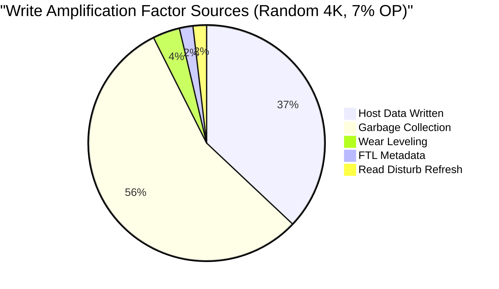

# SSD Reliability Metrics — JEDEC JESD218B & Endurance Standards

**Topic:** SSD reliability metrics; JEDEC JESD218B endurance specification; UBER (Uncorrectable Bit Error Rate); DWPD (Drive Writes Per Day); TBW (Terabytes Written); WAF (Write Amplification Factor); S.M.A.R.T attributes; data retention; NAND endurance characterization  
**Standards:** JEDEC JESD218B (2016), JEDEC JESD219A (SSD endurance workloads), JEDEC JESD47 (qualification), JEDEC JEP122 (retention)  
**SDO:** JEDEC (Joint Electron Device Engineering Council)  
**Audience:** SSD firmware engineers, storage reliability engineers, data center capacity planners, NAND characterization engineers, quality assurance engineers  
**Prerequisites:** NAND flash fundamentals (SLC/MLC/TLC/QLC), SSD controller architecture, FTL concepts, basic statistics (failure rate, MTBF)

---

## Chapter 1 — Historical Context & Origin Story

### 1.1 Timeline

| Year | Event | Significance |
|------|-------|-------------|
| 2007 | First enterprise SSDs (STEC) | SSD reliability largely unknown; HDD metrics applied |
| 2010 | JEDEC JESD218 (initial) | First SSD endurance specification framework |
| 2012 | JEDEC JESD219 | Enterprise and client SSD workload definitions |
| 2013 | JEDEC JESD218A | Updated endurance methodology |
| **2016** | **JEDEC JESD218B** | Current standard: SSD endurance, retention, UBER requirements |
| 2017 | TLC/QLC adoption accelerates | Endurance becomes critical differentiator |
| 2020+ | QLC data center SSDs | DWPD becomes primary selection criterion |
| 2023+ | ZNS and FDP | Write amplification reduction → endurance improvement |

### 1.2 Why SSD Reliability Metrics Differ from HDD

| HDD Metric | SSD Equivalent | Why Different |
|:---:|:---:|---|
| MTBF (Mean Time Between Failures) | MTBF/MTTF (same concept, different mechanisms) | HDD: mechanical wear. SSD: NAND wear-out (finite P/E cycles) + electronic failure |
| Bad sector growth (gradual) | UBER (Uncorrectable Bit Error Rate) | NAND cells degrade with each P/E cycle; BER increases over time |
| N/A (HDD has no write limit) | **TBW / DWPD** (write endurance limit) | NAND has finite program/erase cycles; once exhausted, cells fail |
| Seek time degradation | Latency consistency (GC impact) | SSD: garbage collection causes latency spikes |
| Vibration sensitivity | Temperature sensitivity | NAND retention degrades at high temperature |

---

## Chapter 2 — JEDEC JESD218B Architecture

### 2.1 Specification Structure

```mermaid
graph TB
    subgraph "JEDEC SSD Reliability Framework"
        JESD218[JESD218B<br/>━━━━━━━━━━━<br/>SSD Endurance Specification<br/>• Defines: TBW rating methodology<br/>• Defines: Functional failure criteria<br/>• Defines: UBER requirements<br/>• Defines: Data retention requirements<br/>• Categories: Enterprise & Client]
        
        JESD219[JESD219A<br/>━━━━━━━━━━━<br/>SSD Workload Definitions<br/>• Enterprise workloads<br/>• Client workloads<br/>• Random/Sequential mix<br/>• Read/Write ratios<br/>• Block sizes]
        
        JEP122[JEP122<br/>━━━━━━━━━━━<br/>Data Retention<br/>• Retention time requirements<br/>• Temperature acceleration<br/>• Arrhenius model<br/>• Test methodology]
        
        JESD47[JESD47<br/>━━━━━━━━━━━<br/>Stress-Test-Driven Qualification<br/>• Component qualification<br/>• Temperature cycling<br/>• HTOL (High Temperature Operating Life)<br/>• Burn-in]
    end
    
    JESD218 --> JESD219
    JESD218 --> JEP122
    JESD218 --> JESD47
```

### 2.2 SSD Endurance Categories

| Category | JESD218B Class | Typical Use | DWPD Range | Data Retention |
|:--------:|:--------------:|:-----------:|:----------:|:--------------:|
| **Enterprise** | Enterprise | Data center; 24/7 writes | 1-10+ DWPD | 3 months (at rated endurance) |
| **Client** | Client | Laptop; desktop; consumer | 0.3-1 DWPD | 1 year (at rated endurance) |

---

## Chapter 3 — Key Reliability Metrics

### 3.1 TBW (Terabytes Written)

**Definition:** Total amount of data that can be written to the SSD over its rated lifetime before NAND wear-out is expected.

**Formula:**

$$TBW = \frac{\text{NAND Capacity (TB)} \times \text{P/E Cycles}}{\text{WAF}}$$

**Example:**
- SSD: 1 TB, TLC NAND (3000 P/E cycles), WAF = 2.0
- TBW = (1 TB × 3000) / 2.0 = **1500 TBW**

| NAND Type | Typical P/E Cycles | 1 TB SSD TBW (WAF=2) | 1 TB SSD TBW (WAF=1, ZNS) |
|:---------:|:------------------:|:---------------------:|:--------------------------:|
| SLC | 100,000 | 50,000 TBW | 100,000 TBW |
| MLC | 10,000 | 5,000 TBW | 10,000 TBW |
| TLC | 1,500-3,000 | 750-1,500 TBW | 1,500-3,000 TBW |
| QLC | 500-1,000 | 250-500 TBW | 500-1,000 TBW |

### 3.2 DWPD (Drive Writes Per Day)

**Definition:** How many times the entire drive capacity can be written per day over the warranty period.

**Formula:**

$$DWPD = \frac{TBW}{{\text{Drive Capacity (TB)} \times \text{Warranty Years} \times 365}}$$

**Example:**
- 3.84 TB enterprise SSD; rated 1 DWPD; 5-year warranty
- TBW = 3.84 × 1 × 5 × 365 = **7,008 TBW**
- Daily write allowance: 3.84 TB/day

| DWPD Rating | Daily Writes (3.84 TB drive) | Typical Use Case |
|:-----------:|:---:|---|
| 0.3 DWPD | 1.15 TB/day | Read-intensive (CDN, read cache, streaming) |
| 1 DWPD | 3.84 TB/day | Mixed workload (general server, VM storage) |
| 3 DWPD | 11.5 TB/day | Write-intensive (database logs, OLTP) |
| 10 DWPD | 38.4 TB/day | Extreme write (write cache, metadata tier) |
| 25+ DWPD | 96 TB/day | SLC enterprise (Optane replacement) |

### 3.3 UBER (Uncorrectable Bit Error Rate)

**Definition:** Rate of uncorrectable bit errors during normal operation (after ECC correction has been applied).

**JEDEC JESD218B requirements:**

| Category | UBER Requirement |
|:--------:|:---:|
| Enterprise | ≤ 10⁻¹⁶ (1 uncorrectable bit per 10¹⁶ bits read) |
| Client | ≤ 10⁻¹⁵ (1 uncorrectable bit per 10¹⁵ bits read) |

**Calculation:**

$$UBER = \frac{\text{Number of uncorrectable bit errors}}{\text{Total bits read}}$$

**Context:**
- 10⁻¹⁶ means: reading 1.25 PB of data before expecting 1 uncorrectable bit error
- Enterprise drives must meet this throughout their rated TBW life
- After TBW is exhausted: UBER may increase (NAND worn out)

### 3.4 WAF (Write Amplification Factor)

**Definition:** Ratio of actual NAND writes to host writes. WAF > 1 means SSD writes more to NAND than host requested.

**Formula:**

$$WAF = \frac{\text{Data written to NAND (physical)}}{\text{Data written by host (logical)}}$$

**Causes of WAF > 1:**

| Cause | Description | WAF Contribution |
|:-----:|-------------|:---:|
| **Garbage Collection** | Moving valid pages during block erase | Major (1.5-4×) |
| **Wear leveling** | Redistributing writes to equalize NAND wear | Minor (1.05-1.1×) |
| **Metadata writes** | FTL mapping table updates; journal writes | Minor (1.02-1.05×) |
| **Alignment** | Host write not aligned to NAND page → partial page → read-modify-write | Minor |
| **Over-provisioning** | More OP → less WAF from GC (more free blocks available) | Reduces WAF |

**Typical WAF values:**

| Workload | WAF (7% OP) | WAF (28% OP) | WAF (ZNS, sequential) |
|:--------:|:-----------:|:------------:|:---------------------:|
| Random 4K write | 3.0-5.0 | 1.5-2.5 | N/A |
| Sequential write | 1.1-1.5 | 1.05-1.1 | **1.0** |
| Mixed (70R/30W random) | 2.0-3.5 | 1.3-2.0 | ~1.0-1.2 |

### 3.5 Data Retention

**Definition:** How long data remains readable after the last write (power off).

**JEDEC requirements:**

| Category | Retention at End of Life (rated TBW) | Temperature |
|:--------:|:---:|:---:|
| Enterprise | **3 months** | 40°C storage |
| Client | **1 year** | 30°C storage |

**Why retention is limited at end of life:**
- NAND cells store charge on floating gate / charge trap
- With each P/E cycle, oxide layer degrades → charge leaks faster
- After 3000 P/E cycles (TLC): cell retains charge for ~3-12 months (depending on temperature)
- Fresh NAND (0 P/E): retention is 10+ years

**Temperature impact (Arrhenius acceleration):**

$$\text{Acceleration Factor} = e^{\frac{E_a}{k_B} \left(\frac{1}{T_1} - \frac{1}{T_2}\right)}$$

Where $E_a$ ≈ 1.0-1.1 eV for NAND retention.

- Every 10°C increase roughly halves retention time
- 30°C storage: 1 year retention
- 40°C storage: ~6 months retention
- 55°C storage: ~2-3 months retention (accelerated testing condition)

---

## Chapter 4 — S.M.A.R.T Attributes for SSDs

### 4.1 Key SSD S.M.A.R.T Attributes

| Attribute ID | Name | Description | Critical? |
|:---:|:---:|---|:---:|
| 0x01 | Raw Read Error Rate | ECC-corrected read errors (not uncorrectable) | Monitor |
| 0x05 | Reallocated Sector Count | Bad blocks replaced with spare blocks | **Yes** |
| 0x09 | Power-On Hours | Total operating hours | Info |
| 0xAB | Program Fail Count | NAND program (write) failures | **Yes** |
| 0xAC | Erase Fail Count | NAND erase failures | **Yes** |
| 0xAD | Wear Leveling Count | Average P/E cycle count across NAND | **Yes** |
| 0xB7 | SATA Downshift Count | Interface speed downgrade events | Monitor |
| 0xBB | Uncorrectable Error Count | Errors ECC could NOT fix | **CRITICAL** |
| 0xC0 | Power-Off Retract Count | Unsafe power-off events (no flush) | Monitor |
| 0xE7 | **SSD Life Left (%)** | Remaining endurance percentage | **CRITICAL** |
| 0xE8 | Available Spare | Spare blocks remaining (%) | **Yes** |
| 0xE9 | Media Wearout Indicator | Life used (normalized 0-100) | **Yes** |
| 0xF1 | Total LBAs Written | Host logical bytes written (for DWPD calc) | Info |
| 0xF2 | Total LBAs Read | Host logical bytes read | Info |

### 4.2 NVMe Health Information Log (SMART/Health)

| Field | Description |
|:-----:|-------------|
| **Critical Warning** | Bitmap: spare below threshold; temperature over/under; reliability degraded; read-only mode; volatile memory backup failed |
| **Temperature** | Current composite temperature (°C) |
| **Available Spare** | Remaining spare capacity (0-100%) |
| **Available Spare Threshold** | Threshold below which spare triggers warning |
| **Percentage Used** | Estimated life used (0-100%+; can exceed 100%) |
| **Data Units Read** | Total 512B units read (host) |
| **Data Units Written** | Total 512B units written (host) |
| **Host Read Commands** | Total read commands issued |
| **Host Write Commands** | Total write commands issued |
| **Controller Busy Time** | Time controller was busy (minutes) |
| **Power Cycles** | Total power on/off cycles |
| **Power On Hours** | Total hours powered on |
| **Unsafe Shutdowns** | Unclean power-off events |
| **Media Errors** | Uncorrectable media errors (data loss events) |
| **Number of Error Log Entries** | Total error log entries |

---

## Chapter 5 — Endurance Testing Methodology

### 5.1 JEDEC JESD218B Test Flow

```mermaid
graph TB
    subgraph "SSD Endurance Qualification"
        PRE[Pre-conditioning<br/>━━━━━━━━━━━<br/>• Fill drive to steady state<br/>• Write 2× capacity (random)<br/>• Ensures GC is active<br/>• WAF stabilized]
        
        WRITE[Write Endurance Test<br/>━━━━━━━━━━━<br/>• Write rated TBW amount<br/>• Using JESD219 workload<br/>  (enterprise or client)<br/>• Monitor: UBER, latency,<br/>  spare blocks, temperature]
        
        RETAIN[Data Retention Test<br/>━━━━━━━━━━━<br/>• After rated TBW written:<br/>  power off<br/>• Store at specified temp<br/>  (40°C enterprise; 30°C client)<br/>• Wait: 3 months (ent) / 1 year (client)<br/>• Power on; read all data<br/>• Verify: all data readable (UBER met)]
        
        PASS[Pass Criteria<br/>━━━━━━━━━━━<br/>✓ UBER ≤ 10⁻¹⁶ (enterprise)<br/>✓ No functional failure<br/>✓ Data retention met<br/>✓ All S.M.A.R.T within spec]
    end
    
    PRE --> WRITE --> RETAIN --> PASS
```

### 5.2 JESD219 Workload Definitions

| Workload | Read% | Write% | Random% | Sequential% | Block Size | Target |
|:--------:|:-----:|:------:|:-------:|:-----------:|:----------:|:------:|
| Enterprise (OLTP) | 60% | 40% | 83% | 17% | 4K-64K mixed | Transaction databases |
| Enterprise (File Server) | 80% | 20% | 80% | 20% | 4K-64K | File serving |
| Client | 60% | 40% | 75% | 25% | 4K-128K | Desktop/laptop usage |

---

## Chapter 6 — Over-Provisioning & Endurance Optimization

### 6.1 Over-Provisioning (OP)

**Definition:** Percentage of total NAND capacity reserved for internal SSD operations (not visible to host).

**Formula:**

$$OP\% = \frac{\text{Total NAND Capacity} - \text{User-Visible Capacity}}{\text{User-Visible Capacity}} \times 100$$

| Product Category | Raw NAND | User Capacity | OP% | Purpose |
|:---:|:---:|:---:|:---:|---|
| Consumer SSD | 1024 GB | 1000 GB (1 TB) | ~2.4% | Minimal; maximizes user space |
| Consumer (actual) | 1024 GB | 953 GB (~931 GiB) | 7% | Standard consumer |
| Enterprise (read-heavy) | 4096 GB | 3840 GB (3.84 TB) | 7% | CDN, read cache |
| Enterprise (mixed) | 4096 GB | 3200 GB (3.2 TB) | 28% | General enterprise |
| Enterprise (write-heavy) | 4096 GB | 1600 GB (1.6 TB) | 156% | High-endurance write cache |

### 6.2 OP vs. WAF vs. Endurance

| OP% | WAF (random 4K write) | Effective TBW (1 TB TLC 3000 P/E) | Relative Endurance |
|:---:|:---:|:---:|:---:|
| 0% | 5.0-7.0 | 430-600 TBW | 1× (baseline) |
| 7% | 3.0-4.0 | 750-1000 TBW | ~1.5× |
| 14% | 2.0-3.0 | 1000-1500 TBW | ~2× |
| 28% | 1.5-2.0 | 1500-2000 TBW | ~3× |
| 50% | 1.2-1.5 | 2000-2500 TBW | ~4× |

**Why more OP reduces WAF:**
- More OP → more free blocks available for GC
- GC can choose blocks with FEWER valid pages (more efficient compaction)
- Less data needs to be copied during each GC cycle → less write amplification

---

## Chapter 7 — Comparison: SSD Reliability Standards

| Dimension | JEDEC JESD218B | SSD OEM Spec (Samsung/WD/etc.) | NVMe Health Log | T10 SCSI (Enterprise) |
|:---------:|:--------------:|:---:|:---:|:---:|
| **Scope** | Industry standard methodology | Product-specific ratings | Real-time health reporting | Enterprise reliability framework |
| **UBER** | Defines: ≤10⁻¹⁵ (client), ≤10⁻¹⁶ (enterprise) | Reports actual measured UBER | Reports "Media Errors" count | Informational Exceptions |
| **Endurance** | TBW methodology; DWPD framework | Publishes TBW/DWPD in datasheet | "Percentage Used" field | — |
| **Retention** | 3 months (ent) / 1 year (client) | Warranty terms reference | Not directly reported | — |
| **Workload** | JESD219 defines standard workloads | Tests with "representative" workloads | Reports actual read/write counts | — |
| **Warranty** | Not a warranty spec (methodology only) | 3-5 year warranty (TBW-limited) | — | — |

---

## Chapter 8 — Architecture Diagrams

### 8.1 NAND Endurance Degradation Lifecycle

```mermaid
graph TB
    subgraph "SSD Lifecycle (NAND Wear Progression)"
        FRESH[Fresh (0 P/E cycles)<br/>━━━━━━━━━━━<br/>• BER: very low (~10⁻¹⁸)<br/>• ECC correction: trivial<br/>• Retention: 10+ years<br/>• Full performance]
        
        EARLY[Early Life (0-30% TBW)<br/>━━━━━━━━━━━<br/>• BER gradually increasing<br/>• ECC handles easily<br/>• Retention: 5+ years<br/>• Spare blocks: 100%]
        
        MID[Mid Life (30-70% TBW)<br/>━━━━━━━━━━━<br/>• BER noticeably higher<br/>• ECC working harder (more iterations)<br/>• Read latency slightly increased<br/>  (more ECC decode time)<br/>• Retention: 1-3 years<br/>• Spare blocks: 70-100%]
        
        LATE[Late Life (70-100% TBW)<br/>━━━━━━━━━━━<br/>• BER approaching ECC limit<br/>• Read retries more frequent<br/>• Read disturb management active<br/>• Retention: 3 months - 1 year<br/>  (JEDEC minimum)<br/>• Spare blocks decreasing]
        
        EOL[End of Life (>100% TBW)<br/>━━━━━━━━━━━<br/>• UBER may exceed spec<br/>• Drive enters read-only mode<br/>• S.M.A.R.T warns: spare depleted<br/>• Data still readable (for now)<br/>• Should be replaced immediately]
    end
    
    FRESH --> EARLY --> MID --> LATE --> EOL
```

### 8.2 WAF Sources Breakdown



WAF = (100 + 150 + 10 + 5 + 5) / 100 = **2.7**

---

## Chapter 9 — Case Studies

### 9.1 Data Center: SSD Fleet Endurance Monitoring

| Aspect | Detail |
|--------|--------|
| **Deployment** | Cloud provider; 50,000 NVMe SSDs across 5 data centers |
| **Mix** | 60% read-heavy (0.3 DWPD QLC); 30% mixed (1 DWPD TLC); 10% write-heavy (3 DWPD TLC) |
| **Problem** | Need to predict failures BEFORE data loss. JEDEC specifies endurance limits; but real-world WAF varies. Some drives reach TBW limit earlier than expected. |
| **Solution: Predictive model** | Collect NVMe SMART data from all 50K drives every hour: (1) Percentage Used (%) — primary endurance indicator. (2) Available Spare (%) — spare block depletion. (3) Media Errors — uncorrectable error count. (4) Temperature — affects retention and BER. (5) Host writes vs NAND writes (calculate real-time WAF). |
| **Predictive algorithm** | Linear regression on "Percentage Used" over time → predict when drive reaches 100%. If predicted end-of-life is within 30 days: schedule proactive replacement. If Available Spare drops below 10%: immediate priority. If Media Errors > 0 and increasing: escalate immediately (data at risk). |
| **Results** | (1) Zero data loss from SSD wear-out (all drives replaced proactively). (2) False-positive rate: <2% (unnecessary replacements). (3) Average drive utilization at replacement: 92% of rated TBW (good value extraction). (4) QLC drives (0.3 DWPD) exceeded rating by 15% in read-heavy workloads (actual WAF lower than spec assumption). |
| **Key insight** | Real-world WAF matters more than spec WAF. Monitoring actual NAND writes allows better lifetime prediction than TBW rating alone. |

### 9.2 Consumer SSD: Endurance Failure Analysis

| Aspect | Detail |
|--------|--------|
| **Product** | 1 TB consumer NVMe SSD; TLC; rated 600 TBW; 5-year warranty |
| **Failure report** | Customer: drive became read-only after 18 months. S.M.A.R.T shows: Percentage Used = 100%, Available Spare = 0%. |
| **Investigation** | Host Writes Total: only 200 TB (well below 600 TBW rating). But: NAND writes (from debug log) = 1200 TB. WAF = 1200/200 = **6.0** (extremely high). |
| **Root cause** | Customer workload: database with random 4K overwrites + small OP (7%). High random write → extreme GC → WAF 6×. Effective TBW at WAF=6: 1024 GB × 3000 P/E / 6 = 512 TB NAND writes ≈ reached. |
| **Why rated TBW not met** | JEDEC ratings assume a "representative" workload (mixed; partial sequential). Customer's pure random 4K write is worst-case for WAF. Datasheet may state "TBW under JESD219 workload" in fine print. |
| **Resolution** | (1) Replace drive under warranty (within 5 years; but TBW was "exhausted" due to WAF). (2) Customer advised: increase OP (create smaller partition → leaves unallocated space as implicit OP). (3) Or: use enterprise SSD with 28% OP for database workloads. |
| **Lesson** | Consumer TBW ratings assume moderate WAF (~2-3). Real workloads can have WAF 5-7×. For write-heavy workloads, use enterprise drives rated with appropriate workload profile. |

---

## Chapter 10 — Future Evolution

| Trend | Timeline | Impact |
|-------|----------|--------|
| **QLC mainstream data center** | 2024-2026 | Lower $/TB but only 0.1-0.3 DWPD; read-heavy workloads only |
| **PLC (Penta-Level Cell, 5-bit)** | 2026-2028 | 5 bits/cell; ~100 P/E cycles; archive/cold storage only |
| **ZNS reducing WAF** | 2024+ | WAF→1.0; effectively doubles SSD lifetime for compatible workloads |
| **FDP (Flexible Data Placement)** | 2024+ | Similar WAF reduction without full ZNS; easier adoption |
| **3D NAND 300+ layers** | 2024-2026 | Higher density; endurance may improve slightly (better oxide quality) |
| **CXL persistent memory** | 2025+ | New reliability model for byte-addressable persistent storage (not block; different wear patterns) |
| **AI-driven predictive maintenance** | 2024+ | ML models predict drive failure more accurately than linear SMART trending |
| **Standardized WAF reporting** | 2024+ | NVMe specs adding standardized WAF/NAND-write reporting to SMART log |

---

## Chapter 11 — Interview Questions & Career Guide

### Tier 1: Entry-Level

**Q1:** What is TBW and DWPD? How do they relate to each other?

**A:**

**TBW (Terabytes Written):** The total amount of host data that can be written to an SSD over its entire rated lifetime. Once this much data has been written, the NAND flash cells are expected to be worn out (approaching their P/E cycle limit).

Example: A 1 TB SSD rated at 600 TBW means you can write 600 terabytes of data to it before it's expected to reach end-of-life.

**DWPD (Drive Writes Per Day):** How many times you can fill the ENTIRE drive capacity per day, every day, for the warranty period.

$$DWPD = \frac{TBW}{\text{Capacity (TB)} \times 365 \times \text{Warranty Years}}$$

Example: 1 TB SSD, 600 TBW, 5-year warranty:
$$DWPD = \frac{600}{1 \times 365 \times 5} = \frac{600}{1825} = 0.33 \text{ DWPD}$$

This means: you can write ~330 GB per day (about 1/3 of the drive) every day for 5 years.

**Relationship:**

$$TBW = DWPD \times \text{Capacity (TB)} \times 365 \times \text{Warranty Years}$$

**Why both exist:**
- **TBW** is absolute: doesn't depend on warranty period. Good for comparing raw endurance.
- **DWPD** is normalized: accounts for drive capacity AND warranty. Good for workload matching.

Example: A 3.84 TB enterprise SSD rated at 1 DWPD for 5 years:
- TBW = 1 × 3.84 × 365 × 5 = **7,008 TBW**
- Daily allowance: 3.84 TB of writes per day

### Tier 2: Mid-Level

**Q2:** Explain Write Amplification Factor (WAF). What causes it, and how can it be reduced?

**A:**

**WAF = (Total NAND writes) / (Total host writes)**

If host writes 1 TB but SSD internally writes 3 TB to NAND, WAF = 3.0. This means NAND wears out 3× faster than host data rate suggests.

**Major cause: Garbage Collection (GC)**

NAND can only be erased at block granularity (typically 256 KB - 4 MB). But writes happen at page granularity (4-16 KB). When host overwrites data:
1. New data goes to fresh pages (new NAND block)
2. Old data in original block becomes "stale" (invalid)
3. Block now has mix of valid + stale pages
4. When SSD needs free blocks: must ERASE blocks
5. But can't erase block with valid pages → must copy valid pages out first
6. This "copy valid pages" IS the write amplification

**Example:**
- Block has 256 pages. Host invalidated 200 pages (overwrites). 56 pages still valid.
- GC must: read 56 valid pages → write them to new block → erase original block
- For every 256 pages of "free space" recovered, SSD wrote 56 pages extra = 22% WAF from this block
- Worst case: only 1 page invalid per block → copy 255 pages to reclaim 1 page of space → extreme WAF

**Other WAF contributors:**
- Wear leveling: periodically moving cold data so all blocks age evenly (~5% extra writes)
- FTL mapping table updates: writing L2P map changes to NAND (~2-5% extra)
- Read disturb refresh: NAND cells disturbed by reads; must be refreshed (rewritten) periodically

**How to reduce WAF:**

| Technique | Mechanism | WAF Impact |
|:---------:|-----------|:---:|
| **Increase over-provisioning** | More free blocks → GC picks blocks with fewer valid pages → less copying | 7% OP → WAF 3.5; 28% OP → WAF 1.8 |
| **Sequential writes** | Sequential fills entire blocks → when overwritten, entire block is stale → no valid pages to copy → GC free | WAF → 1.0-1.1 |
| **TRIM/Unmap/Discard** | Host tells SSD which LBAs are deleted → SSD marks pages as invalid immediately → GC finds more stale pages per block → less copying | Reduces WAF 20-40% |
| **ZNS (Zoned Namespaces)** | Host writes sequentially in zones; entire zone erased at once → no GC needed | WAF = 1.0 |
| **FDP (Flexible Data Placement)** | Host hints which data belongs together → SSD groups in same block → when one is invalid, all are → less copying | WAF reduced 30-60% |
| **Larger block size writes** | Writing full NAND blocks (256KB+) means no partial block pollution | Approaches WAF 1.0 |

### Tier 3: Senior

**Q3:** Design a monitoring and lifecycle management system for a 100,000-SSD fleet. How would you predict failures, optimize replacement schedules, and maximize total cost of ownership?

**A:**

**Architecture:**

```
Data Collection → Processing → Prediction → Action
```

**1. Data Collection (per-drive, every 1 hour):**

| Data Source | Fields | Purpose |
|:-----------:|--------|---------|
| NVMe SMART Log | Percentage Used, Available Spare, Temperature, Media Errors, Data Units Written/Read, Unsafe Shutdowns | Primary health indicators |
| Controller statistics | NAND writes (vendor-specific log), GC count, ECC correction counts, read retry count | Calculate real-time WAF; detect degradation rate |
| Host-side metrics | IOPS, bandwidth, latency p99, I/O errors | Detect performance degradation |
| Environmental | Ambient temperature, power events, rack position | Correlate with failure patterns |

**2. Feature Engineering:**

| Derived Metric | Calculation | Significance |
|:--------------:|:---:|---|
| Real-time WAF | NAND_writes / host_writes (rolling 24h) | Actual amplification (not spec assumption) |
| Remaining TBW | (Rated P/E × NAND capacity / current WAF) - NAND_writes_to_date | True remaining life |
| BER trend | ECC corrections / total reads (slope over time) | Rate of NAND degradation |
| Spare depletion rate | d(Available_Spare)/dt (per month) | Predict when spare exhausted |
| Temperature stress | Hours above 70°C (cumulative) | Accelerated aging indicator |
| Power loss stress | Unsafe_shutdowns × severity_weight | Correlates with metadata corruption risk |

**3. Predictive Models:**

| Model | Purpose | Input | Output |
|:-----:|---------|:---:|:---:|
| **Linear regression** | Predict end-of-life date | Percentage Used slope + intercept | Days until 100% |
| **Gradient Boosted Trees** | Predict imminent failure (next 30 days) | All features + historical failure data | Failure probability |
| **Survival analysis (Weibull)** | Fleet-level replacement planning | Cohort age/usage distribution | Expected failures per month |
| **Anomaly detection** | Detect unusual degradation patterns | Per-drive deviation from fleet baseline | Alert score |

**4. Decision Engine:**

| Condition | Action | Timing |
|:---------:|--------|:---:|
| Failure probability > 80% (30-day horizon) | Schedule replacement | Within 7 days |
| Available Spare < 5% | Immediate replacement | Within 24 hours |
| Media Errors > 0 and increasing | Immediate replacement + data verification | ASAP |
| Percentage Used > 90% | Plan replacement | Within 30 days |
| Performance degradation > 30% (vs. baseline) | Investigate; consider workload migration | 48 hours |
| WAF anomaly (sudden increase) | Investigate host workload change | Alert engineer |

**5. TCO Optimization:**

| Strategy | Implementation | Impact |
|:--------:|---------------|:---:|
| **Right-sizing endurance** | Match DWPD rating to actual workload (don't over-spec) | 30-50% cost reduction (QLC at 0.3 DWPD vs TLC at 3 DWPD for read-heavy) |
| **Maximizing rated life** | Don't replace at 80% — use predictive model to safely extend to 92-95% | 15-20% more value per drive |
| **Workload steering** | Route write-heavy workloads to high-endurance drives; reads to QLC | Uniform fleet aging |
| **Temperature management** | Keep drives <50°C → extends retention → extends usable life | 10-20% lifetime extension |
| **TRIM/Discard enforcement** | Ensure all host systems send TRIM → reduces WAF → extends life | 20-40% WAF reduction |
| **Warranty recovery** | Track drives that fail within TBW rating → RMA from vendor | Recover $$ on premature failures |

**6. Fleet-level metrics dashboard:**

| KPI | Target | Alert |
|:---:|:---:|:---:|
| Fleet average Percentage Used | <60% (growing uniformly) | >75% average = need procurement |
| Monthly replacement rate | <0.5% of fleet | >1% = investigate root cause |
| Data loss incidents | 0 | Any = critical incident |
| Average $/TB/month effective | Trending down | Spike = workload or procurement issue |
| Proactive vs reactive replacement ratio | >95% proactive | <90% = model needs tuning |

---

## Chapter 12 — Cheat Sheet & Quick Reference

```
═══════════════════════════════════════════
SSD RELIABILITY METRICS — QUICK REFERENCE
═══════════════════════════════════════════

CORE METRICS:
  TBW = NAND Capacity × P/E Cycles / WAF
  DWPD = TBW / (Capacity × 365 × Warranty Years)
  UBER ≤ 10⁻¹⁶ (enterprise) or 10⁻¹⁵ (client)
  WAF = NAND writes / Host writes (ideally close to 1.0)

═══════════════════════════════════════════
NAND P/E CYCLES:
  SLC:  100,000 P/E     (extreme endurance)
  MLC:  10,000 P/E      (enterprise high-write)
  TLC:  1,500-3,000 P/E (mainstream)
  QLC:  500-1,000 P/E   (read-heavy; cold storage)
  PLC:  ~100 P/E        (future; archive only)

═══════════════════════════════════════════
DWPD USAGE GUIDE:
  0.1-0.3 DWPD: Read-heavy (CDN, streaming, backup)
  1 DWPD:       Mixed workload (VMs, file server)
  3 DWPD:       Write-intensive (OLTP, database)
  10+ DWPD:     Extreme write (write cache, logging)

═══════════════════════════════════════════
DATA RETENTION (JEDEC JESD218B):
  Enterprise: 3 months at 40°C (after rated TBW)
  Client: 1 year at 30°C (after rated TBW)
  Fresh NAND: 10+ years retention
  Rule: +10°C ≈ halves retention time

═══════════════════════════════════════════
WAF CAUSES & REDUCTION:
  Main cause: Garbage Collection (GC)
  
  Reduce WAF:
  □ Increase over-provisioning (28% → WAF~1.8)
  □ Sequential writes (WAF → 1.0)
  □ Send TRIM/Discard (mark deleted data)
  □ Use ZNS (no GC needed → WAF = 1.0)
  □ Use FDP (host placement hints → less GC)
  □ Larger write block sizes

═══════════════════════════════════════════
OVER-PROVISIONING TABLE:
  OP%  | WAF (random 4K) | Relative endurance
  ─────┼─────────────────┼───────────────────
  7%   | 3.0-4.0         | 1× (baseline)
  14%  | 2.0-3.0         | ~1.5×
  28%  | 1.5-2.0         | ~2×
  50%  | 1.2-1.5         | ~3×

═══════════════════════════════════════════
SMART CRITICAL INDICATORS:
  Percentage Used: >90% → plan replacement
  Available Spare: <10% → urgent replacement
  Media Errors: >0 and rising → IMMEDIATE action
  Temperature: >70°C sustained → throttle/cool
  Unsafe Shutdowns: high count → check power

═══════════════════════════════════════════
JEDEC QUALIFICATION:
  Pre-condition: Fill SSD; steady-state GC
  Endurance test: Write rated TBW (JESD219 workload)
  Retention test: Power off; wait; verify readback
  Pass: UBER met + data intact + no functional failure

═══════════════════════════════════════════
QUICK FORMULAS:
  TBW = (NAND_GB × P/E_cycles) / (WAF × 1000)  [in TB]
  DWPD = TBW / (Capacity_TB × 365 × Years)
  Daily writes = DWPD × Capacity_TB  [TB/day allowed]
  
  Example: 3.84 TB TLC (3000 P/E), WAF=2, 5yr:
    TBW = (3840 × 3000) / (2 × 1000) = 5760 TB
    DWPD = 5760 / (3.84 × 365 × 5) = 0.82 DWPD
```

---

*End of Document — 08_SSD_Reliability_Metrics.md*
