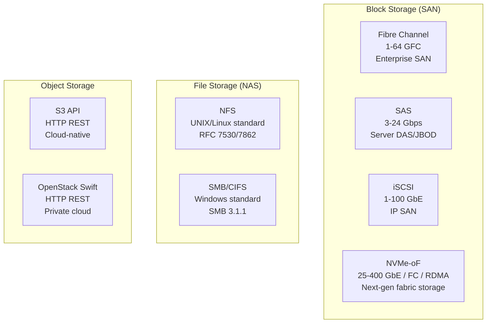

# Storage Interconnects — SAS-4, Fibre Channel, iSCSI & Network Storage Protocols

**Topic:** Storage interconnects and network storage protocols; SAS-4 (Serial Attached SCSI); Fibre Channel (FC) Gen 7 (64GFC); iSCSI; NFS (Network File System); SMB; InfiniBand for storage; NVMe-oF transport comparison; SAN vs. NAS architecture  
**Standards:** T10 SAS-4 (SPL-5), INCITS FC-PI-7 (64GFC), IETF RFC 7143 (iSCSI), IETF RFC 7530 (NFSv4), T11 FC-NVMe, SNIA  
**SDO:** T10 (SCSI/SAS), T11 (Fibre Channel), IETF, INCITS, SNIA (Storage Networking Industry Association)  
**Audience:** Storage network architects, SAN/NAS administrators, data center engineers, enterprise storage engineers, cloud infrastructure engineers  
**Prerequisites:** SCSI command model basics, Ethernet networking, TCP/IP, block vs. file storage concepts, basic understanding of FC fabric

---

## Chapter 1 — Historical Context & Origin Story

### 1.1 Timeline of Storage Interconnects

| Year | Event | Significance |
|------|-------|-------------|
| 1981 | SCSI-1 (parallel, 5 MB/s) | First standardized storage interconnect |
| 1986 | Fibre Channel concept | IBM research → high-speed serial for storage |
| 1994 | Fibre Channel 1GFC standard | First FC standard (1 Gbps / 100 MB/s) |
| 1996 | NFS v3 (RFC 1813) | Standard network file protocol for UNIX |
| 1998 | iSCSI concept | SCSI over TCP/IP (storage over Ethernet) |
| 2003 | SAS-1 (Serial Attached SCSI) | Serial replacement for parallel SCSI (3 Gbps) |
| 2004 | iSCSI RFC 3720 | iSCSI standardized by IETF |
| 2004 | Fibre Channel 4GFC | Enterprise SAN mainstream (4 Gbps) |
| 2009 | SAS-2 (6 Gbps) | Doubled bandwidth; expander topology |
| 2013 | SAS-3 (12 Gbps) | Matched SSD capabilities |
| 2017 | Fibre Channel 32GFC (Gen 6) | 32 Gbps; current enterprise mainstream |
| 2019 | **SAS-4 (24 Gbps)** | Current SAS generation |
| 2020 | NFS v4.2 (RFC 7862) | Server-side copy; application I/O hints |
| 2022 | **Fibre Channel 64GFC (Gen 7)** | 64 Gbps per lane; 256 Gbps aggregate |
| 2024 | FC-NVMe-3 | NVMe commands natively over FC fabric |
| 2025+ | SAS-5 (48 Gbps) proposed | Next generation; may be last SAS revision |
| 2025+ | 128GFC (Gen 8) | Future FC generation |

### 1.2 Storage Protocol Landscape



---

## Chapter 2 — SAS-4 (Serial Attached SCSI)

### 2.1 SAS Generation Comparison

| Generation | Speed (per lane) | Max Lanes (wide port) | Aggregate BW | Year | Key Feature |
|:----------:|:---:|:---:|:---:|:---:|---|
| SAS-1 | 3 Gbps (300 MB/s) | 4 | 1.2 GB/s | 2003 | First serial SCSI; point-to-point |
| SAS-2 | 6 Gbps (600 MB/s) | 4 | 2.4 GB/s | 2009 | Expanders; zoning |
| SAS-3 | 12 Gbps (1200 MB/s) | 4 | 4.8 GB/s | 2013 | Matched SSD speed; T10-DIF |
| **SAS-4** | **24 Gbps (2400 MB/s)** | 4 | **9.6 GB/s** | 2019 | Current; 22.5 Gbps effective |

### 2.2 SAS-4 Architecture

```mermaid
graph TB
    subgraph "SAS-4 Domain"
        HBA[SAS HBA (Host Bus Adapter)<br/>━━━━━━━━━━━<br/>• 24 Gbps × 8 ports (wide)<br/>• SAS address (WWN)<br/>• Initiator role<br/>• PCIe 4.0 x8 host interface]
        
        EXP[SAS Expander<br/>━━━━━━━━━━━<br/>• Fan-out connectivity<br/>  (36-port typical)<br/>• Self-configuring discovery<br/>• Zoning (access control)<br/>• 24 Gbps per phy]
        
        DRIVE1[SAS SSD (24 Gbps)<br/>━━━━━━━━━━━<br/>• Dual-port (for HA)<br/>• SCSI command set<br/>• T10-DIF (data integrity)<br/>• 15.36 TB capacity]
        
        DRIVE2[SAS HDD (12 Gbps)<br/>━━━━━━━━━━━<br/>• Dual-port (for HA)<br/>• 10K/15K RPM<br/>• 2.4 TB capacity]
        
        JBOD[JBOD Enclosure<br/>━━━━━━━━━━━<br/>• 24-60 drive bays<br/>• Dual expanders (HA)<br/>• SES (enclosure services)<br/>• Hot-swap; fault LEDs]
    end
    
    HBA --> EXP
    EXP --> DRIVE1
    EXP --> DRIVE2
    EXP --> JBOD
```

### 2.3 SAS Key Features

| Feature | Description | Benefit |
|:-------:|-------------|---------|
| **Dual-port** | Every SAS drive has TWO ports (A and B) | High availability: if one path fails, other takes over |
| **Expanders** | Fan-out devices (1 HBA → 100s of drives) | Scalability without more HBA ports |
| **Full-duplex** | Simultaneous send and receive per lane | Higher effective throughput |
| **SCSI command set** | Rich enterprise command set (reservations, T10-DIF, copy offload) | Enterprise features |
| **T10-DIF** | Data Integrity Field: CRC + guard tag per sector | End-to-end data integrity (detects silent data corruption) |
| **Zoning** | Expander-level access control (like FC zoning) | Multi-host isolation |
| **SMP (Management Protocol)** | Expander management; topology discovery | Automated configuration |

### 2.4 SAS vs. NVMe (Direct-Attached)

| Dimension | SAS-4 | NVMe (PCIe 5.0 x4) |
|:---------:|:---:|:---:|
| **Bandwidth** | 24 Gbps (2.4 GB/s per lane; 4 lanes = 9.6 GB/s) | 128 Gbps (16 GB/s per x4 device) |
| **Latency** | ~70-100 µs (SAS protocol overhead + expander hops) | ~10-20 µs (direct PCIe; no protocol translation) |
| **Protocol** | SCSI (complex; enterprise features) | NVMe (lean; optimized for flash) |
| **Connectivity** | Expanders → 1000s of drives per HBA | Direct or fabric (NVMe-oF); limited direct-attach |
| **Dual-port HA** | Native (standard in all SAS drives) | Requires NVMe dual-port or fabric multipath |
| **Use case** | Enterprise: JBOD shelves, high drive count, HDD + SSD mix | High-performance: low-latency SSD, AI/ML, databases |
| **Future** | SAS-5 (48 Gbps) may be last generation → market moving to NVMe | NVMe replacing SAS for new deployments |

---

## Chapter 3 — Fibre Channel

### 3.1 Fibre Channel Generations

| Generation | Speed | Encoding | Line Rate | Effective Data Rate | Year |
|:---:|:---:|:---:|:---:|:---:|:---:|
| 1GFC | 1 Gbps | 8b/10b | 1.0625 Gbps | 100 MB/s | 1997 |
| 2GFC | 2 Gbps | 8b/10b | 2.125 Gbps | 200 MB/s | 2001 |
| 4GFC | 4 Gbps | 8b/10b | 4.25 Gbps | 400 MB/s | 2004 |
| 8GFC | 8 Gbps | 8b/10b | 8.5 Gbps | 800 MB/s | 2007 |
| 16GFC | 16 Gbps | 64b/66b | 14.025 Gbps | 1600 MB/s | 2011 |
| **32GFC** | 32 Gbps | 64b/66b | 28.05 Gbps | 3200 MB/s | 2017 |
| **64GFC** | 64 Gbps | 256b/257b | 57.8 Gbps | 6400 MB/s | 2022 |
| 128GFC | 128 Gbps | TBD | ~115 Gbps | 12800 MB/s | 2026+ |

### 3.2 FC Architecture Layers

| FC Layer | OSI Equivalent | Function |
|:--------:|:--------------:|----------|
| FC-4 | Application | Upper-level protocol mapping: **FCP** (SCSI), **FC-NVMe**, FICON |
| FC-3 | — | Common services: multicast; striping (rarely used independently) |
| FC-2 | Data Link + Network | **Framing**: frame format, flow control, classes of service, fabric services, zoning |
| FC-1 | Physical | **Encoding/decoding**: 8b/10b (≤8GFC); 64b/66b (16-32GFC); 256b/257b (64GFC) |
| FC-0 | Physical | **Physical**: optical transceivers (SFP+/SFP28/QSFP); cables; connectors |

### 3.3 FC SAN Architecture

```mermaid
graph TB
    subgraph "Fibre Channel SAN"
        subgraph "Initiators (Servers)"
            SRV1[Server 1<br/>HBA: 32GFC dual-port<br/>WWPN: 21:00:...01]
            SRV2[Server 2<br/>HBA: 32GFC dual-port<br/>WWPN: 21:00:...02]
            SRV3[Server 3<br/>HBA: 64GFC dual-port<br/>WWPN: 21:00:...03]
        end
        
        subgraph "Fabric (Switches)"
            SW_A[FC Switch A (Fabric A)<br/>━━━━━━━━━━━<br/>• 48-port 32GFC<br/>• Zoning (access control)<br/>• Name Server (device discovery)<br/>• FLOGI (fabric login)]
            SW_B[FC Switch B (Fabric B)<br/>━━━━━━━━━━━<br/>• 48-port 32GFC<br/>• Redundant fabric<br/>• Independent zoning<br/>• ISL (Inter-Switch Links)]
        end
        
        subgraph "Targets (Storage)"
            ARR[Storage Array<br/>━━━━━━━━━━━<br/>• FC target ports: 32GFC × 8<br/>• RAID controller pair<br/>• LUN masking<br/>• Multipath (ALUA)<br/>• 500 TB usable]
        end
    end
    
    SRV1 --> SW_A
    SRV1 --> SW_B
    SRV2 --> SW_A
    SRV2 --> SW_B
    SRV3 --> SW_A
    SRV3 --> SW_B
    SW_A --> ARR
    SW_B --> ARR
```

### 3.4 FC Key Concepts

| Concept | Description |
|:-------:|-------------|
| **WWNN** | World Wide Node Name: unique identifier for a node (server/array) |
| **WWPN** | World Wide Port Name: unique identifier per FC port |
| **Zoning** | Access control: defines which initiators can see which targets |
| **LUN Masking** | Storage array restricts which LUNs visible to which WWPN |
| **FLOGI** | Fabric Login: device registers with FC switch; gets FC address (FCID) |
| **PLOGI** | Port Login: initiator logs in to target port |
| **ALUA** | Asymmetric Logical Unit Access: multipath with active/standby paths |
| **ISL** | Inter-Switch Link: connects FC switches for larger fabrics |
| **FCP** | Fibre Channel Protocol (for SCSI): maps SCSI commands over FC frames |
| **FC-NVMe** | Maps NVMe commands natively over FC (no SCSI translation) |

### 3.5 FC Zoning Types

| Zoning Type | Based On | Pros | Cons |
|:-----------:|:--------:|------|------|
| **Port zoning** | Physical switch port number | Simple; persistent through HBA replacement | Must track physical port assignments |
| **WWN zoning** | WWPN of device | Flexible; device can move to any port | HBA replacement requires zone update |
| **Smart/Device Alias** | Alias mapped to WWPN | Human-readable; easy management | Requires alias database maintenance |
| **Peer zoning** | One-to-many; target visible to multiple hosts | Scalable (fewer zone entries) | 32GFC+ switches only |

---

## Chapter 4 — iSCSI (SCSI over TCP/IP)

### 4.1 iSCSI Architecture

```mermaid
graph TB
    subgraph "iSCSI SAN (IP-based)"
        subgraph "Initiators"
            HOST1[Linux Server<br/>━━━━━━━━━━━<br/>• Software iSCSI initiator<br/>  (open-iscsi / iscsid)<br/>• 25GbE NIC<br/>• IQN: iqn.2024-01.com.corp:host1]
            HOST2[Windows Server<br/>━━━━━━━━━━━<br/>• MS iSCSI Initiator<br/>• iSCSI HBA (TOE offload)<br/>• 25GbE NIC<br/>• IQN: iqn.2024-01.com.corp:host2]
        end
        
        subgraph "IP Network"
            SW_IP[Ethernet Switches<br/>━━━━━━━━━━━<br/>• 25/100GbE<br/>• Jumbo frames (9000 MTU)<br/>• Dedicated storage VLAN<br/>• QoS: priority for iSCSI<br/>• MPIO: multipath over 2+ NICs]
        end
        
        subgraph "Targets"
            TGT[iSCSI Storage Target<br/>━━━━━━━━━━━<br/>• iSCSI target software<br/>  (LIO / STGT / TrueNAS)<br/>• IQN: iqn.2024-01.com.corp:target1<br/>• LUN export<br/>• CHAP authentication]
        end
    end
    
    HOST1 --> SW_IP
    HOST2 --> SW_IP
    SW_IP --> TGT
```

### 4.2 iSCSI Key Concepts

| Concept | Description |
|:-------:|-------------|
| **IQN** | iSCSI Qualified Name (iqn.yyyy-mm.reverse-domain:identifier) — globally unique |
| **Target** | Storage device exporting LUNs (block devices) |
| **Initiator** | Client accessing storage (server with iSCSI software or HBA) |
| **Portal** | IP:port endpoint for iSCSI session (default port: 3260) |
| **LUN** | Logical Unit Number: individual block device exported by target |
| **CHAP** | Challenge Handshake Authentication Protocol: mutual auth between initiator/target |
| **Discovery** | SendTargets method: initiator queries portal for available targets |
| **MPIO** | Multipath I/O: multiple sessions over multiple NICs for HA and bandwidth |
| **Jumbo Frames** | 9000 byte MTU (vs. 1500 default): reduces CPU overhead; improves throughput |
| **TOE** | TCP Offload Engine: hardware acceleration for TCP/iSCSI (offloads CPU) |

### 4.3 iSCSI vs. FC

| Dimension | iSCSI | Fibre Channel |
|:---------:|:---:|:---:|
| **Network** | Standard Ethernet (existing infrastructure) | Dedicated FC fabric (separate switches) |
| **Cost** | Low (uses existing Ethernet; no special HBAs required) | High (FC HBAs + FC switches + optics) |
| **Performance** | Good (25-100 GbE achieves parity with 32GFC) | Excellent (deterministic; lossless; low latency) |
| **Latency** | Higher (~100-500 µs; TCP overhead; software stack) | Lower (~50-100 µs; hardware FC stack; no TCP) |
| **Reliability** | TCP retransmission (works but adds latency on loss) | **Lossless** (credit-based flow control; no drops) |
| **Complexity** | Simple (IT staff know Ethernet; standard switches) | Complex (FC expertise required; separate management) |
| **Scalability** | Massive (IP routing; datacenter-wide; WAN-capable) | Fabric-limited (typically single DC; ISL for larger) |
| **Use case** | SMB/midrange; remote replication; DR; budget-conscious | Tier-1 enterprise; mission-critical; mainframe |
| **Trend** | Growing (100GbE makes it competitive; NVMe/TCP emerging) | Stable/declining new deployments (existing installed base) |

---

## Chapter 5 — NFS and Network File Storage

### 5.1 NFS Versions

| Version | Year | Key Features | Limitation |
|:-------:|:----:|-------------|-----------|
| NFSv2 | 1989 | UDP-based; 32-bit file sizes; stateless | 2 GB file limit; no locking |
| NFSv3 | 1995 | TCP support; 64-bit files; async writes; READDIRPLUS | Stateless; separate lock protocol (NLM) |
| **NFSv4.0** | 2003 | **Stateful**; integrated locking; compound operations; ACLs; Kerberos | Single server (no cluster awareness) |
| **NFSv4.1** | 2010 | **pNFS** (parallel NFS); sessions; directory delegation | Complex implementation |
| **NFSv4.2** | 2016 | Server-side copy; sparse files; application I/O hints; labeled NFS (SELinux) | Adoption still growing |

### 5.2 pNFS Architecture (NFSv4.1+)

```mermaid
graph TB
    subgraph "pNFS (Parallel NFS)"
        CLIENT[NFS Client<br/>━━━━━━━━━━━<br/>• Mounts from MDS<br/>• Gets layout (data location)<br/>• Reads/writes DIRECTLY<br/>  to data servers<br/>• Metadata ops → MDS]
        
        MDS[Metadata Server (MDS)<br/>━━━━━━━━━━━<br/>• Namespace (directory tree)<br/>• File metadata (inode, ACL)<br/>• Layout management<br/>  (which data on which DS)<br/>• Lock manager]
        
        DS1[Data Server 1<br/>━━━━━━━━━━━<br/>• Stores file data chunks<br/>• Direct I/O from clients<br/>• No metadata bottleneck]
        
        DS2[Data Server 2<br/>━━━━━━━━━━━<br/>• Stores file data chunks<br/>• Striped for bandwidth<br/>• Parallel access]
        
        DS3[Data Server 3<br/>━━━━━━━━━━━<br/>• Stores file data chunks<br/>• Scale-out capacity]
    end
    
    CLIENT -->|"Metadata ops<br/>(open, stat, layout)"| MDS
    CLIENT -->|"Data I/O (read/write)"| DS1
    CLIENT -->|"Data I/O (read/write)"| DS2
    CLIENT -->|"Data I/O (read/write)"| DS3
    MDS -->|"Layout maps"| DS1
    MDS -->|"Layout maps"| DS2
    MDS -->|"Layout maps"| DS3
```

**pNFS benefit:** Data reads/writes go directly to data servers (bypass MDS bottleneck). Scales bandwidth linearly with number of data servers. Metadata server only handles namespace operations.

### 5.3 NFS vs. SMB

| Dimension | NFS (v4.2) | SMB (3.1.1) |
|:---------:|:---:|:---:|
| **Primary platform** | Linux/UNIX | Windows |
| **Protocol** | RFC-standardized (IETF) | Microsoft-developed (documented but MS-centric) |
| **Authentication** | Kerberos (standard); AUTH_SYS (legacy; insecure) | NTLM; Kerberos; certificate |
| **Encryption** | Kerberos privacy (krb5p); TLS optional | **SMB encryption** (AES-128-GCM/AES-256-GCM) |
| **Locking** | Integrated (v4+); byte-range + delegation | Full Windows semantics (oplock; lease) |
| **Performance** | Excellent for UNIX workloads; pNFS for scale-out | Excellent for Windows; SMB Multichannel |
| **Use case** | Linux VMs; containers; HPC; home directories (Linux) | Windows file shares; DFS; home directories (Windows) |

---

## Chapter 6 — Protocol Comparison Matrix

### 6.1 All Storage Interconnects Compared

| Protocol | Type | Transport | Typical Speed | Latency | Distance | Primary Use |
|:--------:|:----:|:---------:|:---:|:---:|:---:|---|
| **SAS-4** | Block | Serial point-to-point | 24 Gbps/lane | 70-100 µs | 10m (cable) | Server DAS; JBOD |
| **FC 32GFC** | Block | Optical fiber | 32 Gbps/port | 50-100 µs | 10 km+ (SM fiber) | Enterprise SAN |
| **FC 64GFC** | Block | Optical fiber | 64 Gbps/port | 40-80 µs | 10 km+ | Next-gen SAN |
| **iSCSI** | Block | TCP/IP (Ethernet) | 25-100 Gbps (NIC) | 100-500 µs | WAN capable | IP SAN; DR |
| **NVMe/TCP** | Block | TCP/IP (Ethernet) | 25-400 Gbps | 30-200 µs | WAN capable | Next-gen IP SAN |
| **NVMe/RDMA** | Block | RoCEv2/iWARP | 25-400 Gbps | 10-50 µs | DC-scale (~100m) | Ultra-low latency |
| **NVMe/FC** | Block | Fibre Channel | 32-64 Gbps | 30-80 µs | 10 km+ | FC SAN + NVMe |
| **NFS v4.2** | File | TCP/IP | Network-limited | 200-1000 µs | WAN capable | Linux file sharing |
| **SMB 3.1.1** | File | TCP/IP | Network-limited | 200-1000 µs | WAN capable | Windows file sharing |
| **S3** | Object | HTTP/HTTPS | Network-limited | 10-100 ms | Global (Internet) | Cloud object storage |

### 6.2 SAN vs. NAS vs. DAS

| Architecture | Protocol | Access Model | Typical Protocols | Use Case |
|:---:|:---:|:---:|:---:|---|
| **DAS** (Direct Attached Storage) | Block | Exclusive to one server | SAS, NVMe, SATA | Single-server performance; database on local SSD |
| **SAN** (Storage Area Network) | Block | Shared block; server-exclusive LUN | FC, iSCSI, NVMe-oF | Enterprise databases; VMware datastores; high IOPS |
| **NAS** (Network Attached Storage) | File | Shared file access; concurrent | NFS, SMB | Home directories; file collaboration; media; archives |
| **Object** | Object (HTTP) | Shared; immutable objects | S3, Swift | Backups; media assets; data lake; cloud-native apps |

---

## Chapter 7 — Fibre Channel Deep Dive

### 7.1 FC Frame Format

| Field | Size | Description |
|:-----:|:----:|-------------|
| SOF (Start of Frame) | 4 bytes | Frame delimiter |
| **FC Header** | 24 bytes | Source/Dest FCID, SEQ_ID, OX_ID, RX_ID, frame type |
| **Payload** | 0-2112 bytes | Data (FCP/FC-NVMe payload) |
| CRC | 4 bytes | Frame integrity check |
| EOF (End of Frame) | 4 bytes | Frame terminator |

**Max frame payload:** 2112 bytes (2048 data + 64 optional header)

### 7.2 FC Flow Control (Credit-Based)

| Concept | Description |
|:-------:|-------------|
| **Buffer-to-Buffer Credits (BB_Credits)** | Number of frames a port can send before receiving acknowledgment (R_RDY) |
| **Lossless** | If credits exhausted: sender WAITS (no frame dropped) |
| **Distance impact** | Long ISL → more credits needed (BB_credits = distance × speed / frame_size) |
| **Typical values** | 8-500 BB_credits depending on distance and speed |

**BB_Credit formula for long-distance:**

$$\text{BB\_Credits} = \frac{\text{Link Speed (bytes/sec)} \times \text{RTT (sec)}}{\text{Frame Size (bytes)}}$$

Example: 32GFC over 100 km fiber:
- Link Speed = 3200 MB/s = 3.2 × 10⁹ bytes/sec
- RTT = 100 km ÷ (200,000 km/s fiber speed) × 2 = 1.0 ms = 0.001 sec
- Frame Size = 2148 bytes (header + payload + CRC)
- BB_Credits = (3.2 × 10⁹ × 0.001) / 2148 ≈ **1490 credits**

Without sufficient credits: link utilization drops (can't keep pipe full).

### 7.3 FC-NVMe (NVMe over Fibre Channel)

| Aspect | FCP (SCSI over FC) | FC-NVMe |
|:------:|:---:|:---:|
| **Command protocol** | SCSI (CDB) | NVMe (native commands) |
| **Queue depth** | 254 (SCSI queue depth limit) | **65,535 per queue** (NVMe spec) |
| **Multi-queue** | Single queue per LUN | Multiple I/O queues (multi-core optimized) |
| **Latency** | Higher (SCSI protocol overhead) | Lower (NVMe lean command set) |
| **FC fabric** | Same fabric | **Same fabric** (same switches, same zoning) |
| **Coexistence** | — | FCP and FC-NVMe on same fabric simultaneously |

---

## Chapter 8 — Implementation Guide

### 8.1 iSCSI Configuration (Linux)

```bash
# Install iSCSI initiator
apt install open-iscsi

# Configure initiator name
echo "InitiatorName=iqn.2024-01.com.company:server1" > /etc/iscsi/initiatorname.iscsi

# Discover targets
iscsiadm -m discovery -t sendtargets -p 10.0.1.100:3260

# Login to target
iscsiadm -m node -T iqn.2024-01.com.company:storage1 -p 10.0.1.100:3260 --login

# Configure CHAP authentication
iscsiadm -m node -T iqn.2024-01.com.company:storage1 -p 10.0.1.100:3260 \
  --op update -n node.session.auth.authmethod -v CHAP
iscsiadm -m node -T iqn.2024-01.com.company:storage1 -p 10.0.1.100:3260 \
  --op update -n node.session.auth.username -v myuser
iscsiadm -m node -T iqn.2024-01.com.company:storage1 -p 10.0.1.100:3260 \
  --op update -n node.session.auth.password -v mypassword

# Multipath setup (dm-multipath)
apt install multipath-tools
systemctl enable multipathd
multipath -ll  # Show multipath topology
```

### 8.2 NFS Mount Best Practices

```bash
# NFSv4.2 mount with performance tuning
mount -t nfs4 -o \
  vers=4.2,\           # Force NFSv4.2
  proto=tcp,\          # TCP transport
  rsize=1048576,\      # 1MB read size
  wsize=1048576,\      # 1MB write size
  hard,\               # Hard mount (retry forever; don't return error)
  intr,\               # Allow interrupt (Ctrl+C)
  timeo=600,\          # Timeout 60 seconds
  retrans=2,\          # 2 retransmissions before timeout
  sec=krb5p,\          # Kerberos privacy (encrypted)
  nconnect=8 \         # 8 parallel TCP connections (NFSv4.1+ clients)
  server:/export/data /mnt/data

# /etc/fstab persistent mount
server:/export/data  /mnt/data  nfs4  vers=4.2,hard,intr,rsize=1048576,wsize=1048576,sec=krb5p,nconnect=8  0  0
```

### 8.3 FC Zoning Configuration (Brocade)

```
# Create zone aliases (human-readable)
alicreate "host1_hba0", "21:00:00:24:ff:xx:xx:01"
alicreate "host1_hba1", "21:00:00:24:ff:xx:xx:02"
alicreate "array1_port0", "50:00:09:73:xx:xx:xx:01"
alicreate "array1_port1", "50:00:09:73:xx:xx:xx:02"

# Create zones (initiator-target pairs)
zonecreate "zone_host1_array1", "host1_hba0; array1_port0; host1_hba1; array1_port1"

# Add zone to configuration
cfgadd "cfg_production", "zone_host1_array1"

# Enable configuration
cfgenable "cfg_production"

# Verify
zoneshow
```

---

## Chapter 9 — Case Studies

### 9.1 Enterprise SAN Migration: FC to NVMe-oF

| Aspect | Detail |
|--------|--------|
| **Organization** | Global bank; tier-1 database infrastructure |
| **Existing** | FC SAN: 32GFC; 2 fabrics (A/B); 500 TB; 1000 LUNs; 200 servers; latency ~150 µs |
| **Problem** | New real-time trading platform requires <50 µs storage latency. FC + SCSI protocol overhead = 100-150 µs minimum. NVMe local SSD = 15 µs but not shared. Need shared storage at NVMe-like latency. |
| **Solution** | Phased migration to NVMe-oF: Phase 1 — Keep existing FC fabric; add FC-NVMe (same switches support both FCP and FC-NVMe). Phase 2 — New all-flash array with NVMe back-end and FC-NVMe front-end. Phase 3 — Trading platform servers get NVMe/RDMA (RoCEv2) for lowest latency path. |
| **Results** | FC-NVMe latency: ~60 µs (40% improvement over FCP on same fabric). NVMe/RDMA latency: ~25 µs (83% improvement). Trading platform P99 latency met (<50 µs). Zero downtime migration: FC-NVMe coexists with FCP on same fabric. Cost: reused existing FC switches (32GFC supports FC-NVMe via firmware upgrade). |

### 9.2 SMB Deployment: iSCSI Replacing FC

| Aspect | Detail |
|--------|--------|
| **Organization** | Mid-size hospital; 50 VMware ESXi hosts; HIPAA-compliant storage |
| **Existing** | Aging 8GFC SAN; 2 switches; limited ports; $200K refresh quote for 32GFC |
| **Alternative** | iSCSI over existing 25GbE infrastructure (already deployed for VM networking) |
| **Implementation** | (1) Dedicated storage VLAN (isolated from general traffic). (2) Jumbo frames (9000 MTU) on storage VLAN. (3) CHAP mutual authentication (initiator ↔ target). (4) MPIO: 2 NICs per host × 2 target portals = 4 paths. (5) QoS: DSCP marking for iSCSI traffic (priority queuing). (6) iSCSI target: TrueNAS Enterprise (ZFS; all-flash). |
| **Results** | Cost: $50K (vs. $200K for FC refresh) — existing Ethernet switches reused. Performance: 25GbE × 2 paths = 50 Gbps aggregate (vs. 8GFC = 8 Gbps previously). Latency: ~200 µs (adequate for VMware workloads; not latency-critical). HIPAA: CHAP auth + isolated VLAN + encrypted iSCSI (IPsec) + audit logging. |
| **Lesson** | For non-latency-critical workloads (VMs, file servers, EHR), iSCSI over modern Ethernet is cost-effective and performant. FC still justified for latency-critical Tier-1 databases. |

---

## Chapter 10 — Future Evolution

| Trend | Timeline | Impact |
|-------|----------|--------|
| **NVMe-oF replacing iSCSI/FC for new deployments** | 2024-2028 | NVMe/TCP and NVMe/RDMA becoming preferred over iSCSI for block storage |
| **FC 128GFC (Gen 8)** | 2026-2027 | Doubles FC bandwidth; maintains installed base investment |
| **SAS end-of-life** | 2027-2030 | SAS-5 (48 Gbps) likely last generation; NVMe taking SAS SSD market; SAS HDDs remain |
| **Computational Storage** | 2025+ | Processing data at storage device (reduces network transfer; complements interconnects) |
| **CXL for storage** | 2025-2027 | Byte-addressable persistent storage over CXL; new access model (not block, not file) |
| **400GbE for storage** | 2025-2026 | 400 Gbps Ethernet makes NVMe/TCP viable for even highest-performance workloads |
| **Disaggregated storage** | 2024+ | Separate compute and storage pools connected via fabric (NVMe-oF / CXL) |
| **NFS over RDMA (NFSoRDMA)** | 2024+ | NFS protocol over RDMA for low-latency file access (HPC workloads) |
| **SMB over QUIC** | 2024+ | SMB without VPN: QUIC transport for secure remote file access |
| **Storage class memory (SCM)** | 2024+ | Persistent memory accessed via byte-addressable protocols (not traditional block I/O) |

---

## Chapter 11 — Interview Questions & Career Guide

### Tier 1: Entry-Level

**Q1:** What is the difference between SAN, NAS, and DAS? Give an example use case for each.

**A:**

| Type | Full Name | Access Model | Protocol | Example |
|:----:|:---------:|:---:|:---:|---|
| **DAS** | Direct Attached Storage | Block; exclusive to one server | SAS, NVMe, SATA | NVMe SSD inside a database server. Only that server accesses it. Highest performance; simplest; no sharing. |
| **SAN** | Storage Area Network | Block; shared network but exclusive LUN assignment | FC, iSCSI, NVMe-oF | VMware cluster with 50 servers accessing shared storage array over Fibre Channel. Each VM gets a virtual disk (LUN). Multiple servers share the storage network, but each LUN is typically owned by one server (or clustered filesystem). |
| **NAS** | Network Attached Storage | File; shared concurrent access | NFS, SMB | Engineering team of 200 users accessing shared project files on a NetApp filer via NFS. Multiple users read/write the same files concurrently. Access is at file/directory level (not raw blocks). |

**Key insight:**
- **SAN/DAS** = the server sees a raw "disk" (block device) → server must put a filesystem on it
- **NAS** = the server sees files and directories → storage device manages the filesystem

### Tier 2: Mid-Level

**Q2:** Compare Fibre Channel and iSCSI for enterprise storage. When would you choose each?

**A:**

| Factor | Choose FC When... | Choose iSCSI When... |
|:------:|---|---|
| **Latency** | Sub-100 µs required (real-time trading, OLTP database) | 200-500 µs acceptable (VMs, file serving, general enterprise) |
| **Reliability** | Zero frame loss required (credit-based flow control = lossless) | TCP retransmission acceptable (rare packet loss → retransmit; adds latency jitter) |
| **Existing infra** | FC fabric already deployed (incremental growth) | Ethernet already deployed (reuse existing switches; no new fabric) |
| **Budget** | Budget available for FC HBAs ($500-2000 each) + FC switches ($20K-200K) + optics | Cost-sensitive; can't justify separate FC infrastructure; NICs + Ethernet switches already owned |
| **Staff expertise** | FC/SAN administrators available | IP/Ethernet networking team only; no FC expertise |
| **Distance** | Long-distance replication (FC over dark fiber; 10+ km) | WAN replication (iSCSI over IP; internet-routable; cross-DC) |
| **Scale** | Hundreds of servers with mission-critical storage (banking, healthcare Tier-1) | Thousands of servers with general storage (cloud; web tier; development) |
| **New deployment** | Extending existing FC investment | Greenfield; modern; cost-optimized |

**Modern nuance:**
- 25-100 GbE + NVMe/TCP or NVMe/RDMA is increasingly competitive with FC for new deployments
- FC remains dominant for existing installations (large installed base; proven; trusted)
- iSCSI is being superseded by NVMe/TCP for new block-over-IP deployments

### Tier 3: Senior

**Q3:** Design a storage network architecture for a 5000-server data center supporting mixed workloads (databases, VMs, containers, AI/ML). Address protocol selection, performance tiers, availability, and growth.

**A:**

**Workload analysis:**

| Workload | Count | IOPS Need | Latency Need | Bandwidth | Protocol Choice |
|:--------:|:-----:|:---------:|:------------:|:---------:|:---------------:|
| Tier-1 Database (OLTP) | 50 servers | 500K+ IOPS | <50 µs | Moderate | **NVMe/RDMA (RoCEv2)** |
| AI/ML Training | 200 GPU servers | Sequential read | <100 µs | **Extreme** (TB/s aggregate) | **NVMe/RDMA** + parallel filesystem (GPFS/Lustre) |
| VMware/KVM VMs | 2000 servers | 50K-200K IOPS | <500 µs | Moderate | **NVMe/TCP** (25-100 GbE) |
| Kubernetes persistent volumes | 2500 servers | Variable | <1 ms | Moderate | **NFS v4.2** (file) + **NVMe/TCP** (block CSI) |
| Backup/Archive | 200 servers | Low | Seconds OK | High (bulk) | **NFS** or **S3** over Ethernet |

**Architecture (3-tier storage network):**

| Tier | Protocol | Network | Storage | Servers |
|:----:|:--------:|:-------:|:-------:|:-------:|
| **Tier 0** (Ultra-low latency) | NVMe/RDMA (RoCEv2) | Dedicated 100GbE RDMA fabric; lossless (PFC/ECN) | All-flash NVMe arrays (disaggregated) | 250 database + AI servers |
| **Tier 1** (Performance) | NVMe/TCP | Shared 25-100GbE fabric (converged with data network); dedicated storage VLAN | All-flash NVMe arrays | 2000 VM + container servers |
| **Tier 2** (Capacity) | NFS v4.2 + S3 | Shared 25GbE fabric | Scale-out NAS + object storage | All 5000 servers |

**Network design:**

| Layer | Tier 0 (RDMA) | Tier 1 (NVMe/TCP) | Tier 2 (NFS/S3) |
|:-----:|:---:|:---:|:---:|
| Access switches | 100GbE × 48-port; PFC-enabled; dedicated | 25GbE converged; VLAN isolation for storage | Same as Tier 1 (shared) |
| Spine switches | 400GbE; RDMA-capable | 400GbE (shared spine with compute) | Same |
| Server NICs | 100GbE RDMA NIC (ConnectX-7) × 2 | 25GbE NIC × 2 (standard) | Same as Tier 1 |
| Multipath | NVMe multipath (2 paths minimum) | NVMe/TCP multipath (2+ paths) | NFS nconnect (8 connections) |

**Availability:**

| Component | Redundancy | Failure Impact |
|:---------:|:----------:|:--------------:|
| Server NIC | 2 NICs per server (active/active multipath) | One NIC failure: 50% bandwidth; zero downtime |
| Access switch | 2 TOR switches per rack (server dual-homed) | One switch failure: zero downtime; half bandwidth |
| Spine switch | 4+ spine switches (ECMP) | One spine failure: 75%+ bandwidth remains |
| Storage array | Dual controller; RAID/erasure coding | One controller: failover; zero data loss |
| Storage path | 2+ paths (different switches, different controller ports) | Any single path failure: automatic failover |

**Growth strategy:**
- Scale-out architecture: add storage nodes for capacity/performance (not forklift upgrade)
- NVMe-oF fabric: add targets to existing fabric (no re-cabling)
- Tiering automation: cold data automatically moves from Tier 1 → Tier 2 (policy-based)
- CXL (future): add CXL memory tier between DRAM and NVMe for memory-intensive AI workloads

---

## Chapter 12 — Cheat Sheet & Quick Reference

```
═══════════════════════════════════════════
STORAGE INTERCONNECTS — QUICK REFERENCE
═══════════════════════════════════════════

PROTOCOL SPEED SUMMARY:
  SAS-4:   24 Gbps/lane (2.4 GB/s); max 4 lanes = 9.6 GB/s
  FC 32GFC: 32 Gbps/port (3.2 GB/s)
  FC 64GFC: 64 Gbps/port (6.4 GB/s)
  iSCSI:   Limited by Ethernet (1-400 GbE)
  NVMe/TCP: Limited by Ethernet (25-400 GbE)
  NVMe/RDMA: 25-400 Gbps (lowest latency)
  NFS/SMB: Limited by Ethernet + protocol overhead

═══════════════════════════════════════════
LATENCY COMPARISON:
  NVMe local:     10-20 µs
  NVMe/RDMA:      15-50 µs
  FC-NVMe:        30-80 µs
  SAS-4:          70-100 µs
  FCP (SCSI/FC):  80-150 µs
  NVMe/TCP:       50-200 µs
  iSCSI:          100-500 µs
  NFS/SMB:        200-1000 µs

═══════════════════════════════════════════
FIBRE CHANNEL ESSENTIALS:
  WWNN/WWPN: Unique identifiers (like MAC addresses)
  Zoning: Access control (which host sees which storage)
  LUN Masking: Array-side access control
  FLOGI: Fabric login (device → switch)
  ALUA: Asymmetric multipath (active/standby paths)
  BB_Credits: Flow control (lossless; no frame drops)
  FC-NVMe: NVMe commands native over FC fabric

═══════════════════════════════════════════
SAS ESSENTIALS:
  Dual-port: Every SAS drive has 2 ports (HA)
  Expanders: Fan-out (1 HBA → 100s of drives)
  T10-DIF: End-to-end data integrity (CRC per sector)
  Zoning: Access control at expander level
  SAS HDD: Still dominant for capacity tier (2024)
  SAS SSD: Being replaced by NVMe

═══════════════════════════════════════════
iSCSI ESSENTIALS:
  IQN: Unique identifier (iqn.yyyy-mm.domain:name)
  Portal: IP:3260 (default port)
  CHAP: Authentication (mutual recommended)
  MPIO: Multipath for HA + bandwidth
  Jumbo Frames: 9000 MTU (reduces CPU overhead)
  Best for: Budget-friendly SAN; DR replication

═══════════════════════════════════════════
NFS ESSENTIALS:
  NFSv4.2: Current; stateful; integrated locking
  pNFS: Parallel data access (scale-out)
  nconnect: Multiple TCP connections (bandwidth)
  sec=krb5p: Kerberos encrypted transport
  Use: Linux file sharing; containers; HPC

═══════════════════════════════════════════
WHEN TO USE WHAT:
  Lowest latency → NVMe/RDMA (RoCEv2)
  Enterprise SAN (existing) → Fibre Channel
  Block over IP (new) → NVMe/TCP
  Budget block SAN → iSCSI
  Linux file sharing → NFS v4.2
  Windows file sharing → SMB 3.1.1
  Cloud/archive → S3 (object)
  Server DAS (HDD) → SAS-4
  Server DAS (SSD) → NVMe

═══════════════════════════════════════════
SAN vs NAS vs DAS:
  DAS: Direct; one server; block; fastest; no sharing
  SAN: Network; block; shared fabric; server owns LUN
  NAS: Network; file; shared access; concurrent R/W
  Object: HTTP; immutable; global; cloud-native
```

---

*End of Document — 10_Storage_Interconnects_SAS_FC.md*
