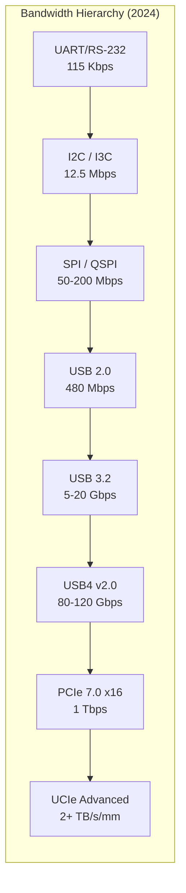
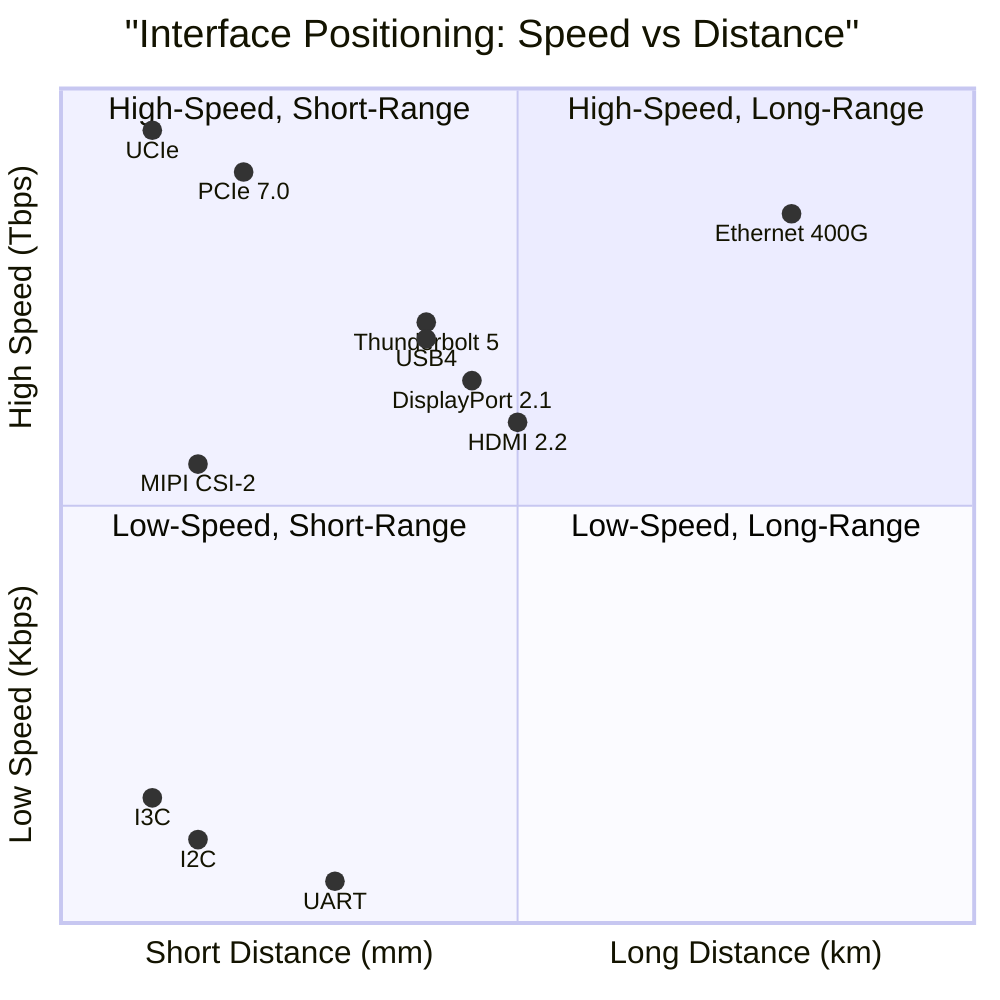

# Physical Layer & High-Speed Interface Standards — Overview

**Topic:** Overview of physical layer and high-speed interface standards; USB4, PCIe 6.0/7.0, MIPI CSI/DSI/I3C, DisplayPort 2.1, HDMI 2.1/2.2, UCIe chiplet interconnects, Thunderbolt 5, die-to-die interfaces  
**Standards:** USB4 v2.0, PCIe 7.0, MIPI CSI-2 v3.0, MIPI DSI-2, MIPI I3C v1.1, DisplayPort 2.1, HDMI 2.2, UCIe 1.1, Thunderbolt 5  
**SDO:** USB-IF, PCI-SIG, MIPI Alliance, VESA, HDMI Forum, UCIe Consortium, Intel  
**Audience:** Silicon design engineers, SoC architects, hardware platform engineers, display engineers, high-speed signal integrity engineers  
**Prerequisites:** Digital logic fundamentals, basic signal integrity concepts, serial communication basics

---

## Chapter 1 — Historical Context & Origin Story

### 1.1 Evolution of Physical Interfaces

| Era | Period | Dominant Interfaces | Paradigm |
|:---:|:------:|:---:|---|
| **Parallel bus** | 1981-2000 | ISA, PCI, SCSI, IDE/PATA, parallel port | Wide parallel buses; distance-limited; crosstalk |
| **Serial transition** | 2000-2010 | USB 2.0, SATA, PCIe 1.0-2.0, HDMI 1.0 | Narrow serial lanes with embedded clocking |
| **High-speed serial** | 2010-2020 | USB 3.x, PCIe 3.0-4.0, MIPI, DP 1.4, HDMI 2.0 | Multi-Gbps per lane; NRZ encoding |
| **Ultra-high-speed** | 2020-present | USB4, PCIe 5.0-7.0, DP 2.1, HDMI 2.1, UCIe | PAM4; 100+ Gbps per lane; chiplet interconnects |
| **Disaggregated** | 2024+ | UCIe, CXL, CPO, PCIe 7.0 optical | Chiplets; co-packaged optics; die-to-die fabrics |

### 1.2 Why Parallel → Serial Transition?

| Problem with Parallel | Serial Solution |
|:---:|---|
| Clock/data skew (wide bus = timing margin nightmare) | Embedded clock in data stream (CDR recovers clock) |
| Pin count (64-bit bus = 64+ pins + clock + control) | 1-4 differential pairs (4-8 pins for 100+ Gbps) |
| Crosstalk between adjacent traces | Single differential pair; well-controlled impedance |
| Limited frequency (clock distribution at GHz impossible) | Multi-GHz signaling per lane (PAM4 for 2× data rate) |
| Distance limited (parallel bus = PCB only) | Cables, optical extension, chip-to-chip at meters |

### 1.3 Modern Interface Bandwidth Landscape



---

## Chapter 2 — Standards Organization Map

### 2.1 SDO Landscape

| SDO | Full Name | Standards | Focus |
|:---:|:---------:|:---------:|-------|
| **USB-IF** | USB Implementers Forum | USB4, USB PD, USB-C, USB Audio/Video Class | Universal connectivity (consumer, industrial, automotive) |
| **PCI-SIG** | PCI Special Interest Group | PCIe 1.0-7.0, CXL (co-developed) | Chip-to-chip; accelerator interconnect; storage |
| **MIPI Alliance** | Mobile Industry Processor Interface | CSI-2, DSI-2, I3C, D-PHY, C-PHY, M-PHY, UniPro | Mobile/embedded: camera, display, sensors |
| **VESA** | Video Electronics Standards Association | DisplayPort, eDP, DSC, Adaptive-Sync | Display interfaces (PC, monitor, laptop panel) |
| **HDMI Forum** | High-Definition Multimedia Interface | HDMI 2.0, 2.1, 2.1a, 2.2 | Consumer AV (TV, projector, gaming) |
| **UCIe Consortium** | Universal Chiplet Interconnect Express | UCIe 1.0, 1.1 | Die-to-die chiplet interconnect |
| **Intel** | (Corporation) | Thunderbolt 3/4/5 | High-speed external connectivity (contributed to USB4) |
| **OIF** | Optical Internetworking Forum | CEI-112G, CEI-224G | High-speed electrical/optical SerDes interfaces |

### 2.2 Interface Classification

```mermaid
graph TB
    subgraph "Interface Classification by Application"
        subgraph "External (User-facing)"
            USB[USB4 / USB-C<br/>Data + Power + Display]
            DP[DisplayPort 2.1<br/>Monitor connection]
            HDMI[HDMI 2.2<br/>TV / Consumer AV]
            TB[Thunderbolt 5<br/>Universal dock]
        end
        
        subgraph "Internal (Chip-to-Chip)"
            PCIE_I[PCIe 5.0-7.0<br/>CPU ↔ GPU/SSD/NIC]
            CXL_I[CXL 3.1<br/>CPU ↔ Memory/Accelerator]
            MIPI_I[MIPI CSI/DSI<br/>SoC ↔ Camera/Display]
        end
        
        subgraph "Die-to-Die (Chiplet)"
            UCIE_I[UCIe 1.1<br/>Chiplet ↔ Chiplet]
            AIB_I[AIB / BoW<br/>Alternative D2D]
        end
        
        subgraph "Low-Speed Control"
            I3C_I[MIPI I3C<br/>Sensor bus]
            I2C_I[I2C (legacy)<br/>Configuration]
            SPI_I[SPI/QSPI<br/>Flash programming]
        end
    end
```

---

## Chapter 3 — Bandwidth & Signaling Technology

### 3.1 Signaling Comparison

| Interface | Signaling | Encoding | Raw Rate/Lane | Effective Rate/Lane | Lanes (typical) | Aggregate BW |
|:---------:|:---------:|:--------:|:---:|:---:|:---:|:---:|
| USB 3.2 Gen 2x2 | NRZ | 128b/132b | 10 Gbps | 9.7 Gbps | 2 | 20 Gbps |
| USB4 Gen 3x2 | NRZ | 128b/132b | 20 Gbps | 19.4 Gbps | 2 | 40 Gbps |
| USB4 v2.0 | PAM3 | 128b/132b | 40 Gbps | ~38.7 Gbps | 2 | 80 Gbps |
| PCIe 5.0 | NRZ | 128b/130b | 32 GT/s | 31.5 Gbps | x16 | 504 Gbps (63 GB/s) |
| PCIe 6.0 | PAM4 | 1b/1b (FLIT+CRC) | 64 GT/s | 60.6 Gbps | x16 | 969 Gbps (121 GB/s) |
| PCIe 7.0 | PAM4 | 1b/1b (FLIT+CRC) | 128 GT/s | 121 Gbps | x16 | ~2 Tbps (242 GB/s) |
| DP 2.1 UHBR 20 | 128b/132b | — | 20 Gbps | 19.4 Gbps | 4 | 77.4 Gbps |
| HDMI 2.1 FRL | 16b/18b | — | 12 Gbps | 10.6 Gbps | 4 | 48 Gbps |
| HDMI 2.2 FRL12 | TBD | — | 24 Gbps | TBD | 4 | 96 Gbps |
| MIPI D-PHY 2.5 | DDR | — | 4.5 Gbps | 4.5 Gbps/lane | 4 | 18 Gbps |
| MIPI C-PHY 2.0 | 3-symbol | — | 12.5 Gbps/trio | ~9.4 Gbps | 3 trios | 37.5 Gbps |
| UCIe (standard) | NRZ | — | 32 Gbps | — | 16 | ~1 TB/s/mm |
| Thunderbolt 5 | PAM3 | — | 40 Gbps | — | 3 (asym) | 120 Gbps |

### 3.2 NRZ vs. PAM4 vs. PAM3

| Modulation | Bits/Symbol | Signal Levels | Used By | Advantage | Challenge |
|:---:|:---:|:---:|:---:|---|---|
| **NRZ** (Non-Return-to-Zero) | 1 | 2 (0, 1) | PCIe ≤5.0; USB ≤USB4 Gen3 | Simple; large eye opening; robust | Bandwidth-limited (need faster clock for more throughput) |
| **PAM4** (Pulse Amplitude Modulation 4) | 2 | 4 (0, 1, 2, 3) | PCIe 6.0/7.0; 400/800GbE | 2× throughput at same baud rate | 1/3 voltage margin → stronger FEC needed; more power |
| **PAM3** | log₂(3) ≈ 1.585 | 3 (-1, 0, +1) | USB4 v2.0; Thunderbolt 5 | Better EMI than PAM4; more capacity than NRZ | Moderate complexity; requires new PHY design |

---

## Chapter 4 — Category Document Index

| Doc # | File | Topic | Key Standards |
|:-----:|:----:|-------|:---:|
| 00 | This document | Overview & landscape | All |
| 01 | 01_USB4_Gen4_Standards.md | USB4 v2.0, USB-C, USB PD 3.1, Alternate Mode | USB-IF |
| 02 | 02_PCIe_6_0_7_0.md | PCIe 6.0 (64 GT/s), PCIe 7.0 (128 GT/s), FLIT mode, PAM4 | PCI-SIG |
| 03 | 03_MIPI_CSI_DSI_Camera.md | MIPI CSI-2 v3.0, DSI-2, D-PHY, C-PHY for camera/display | MIPI Alliance |
| 04 | 04_MIPI_I3C_Sensor_Interface.md | MIPI I3C v1.1, I3C Basic, sensor bus | MIPI Alliance |
| 05 | 05_DisplayPort_2_1.md | DisplayPort 2.1, UHBR, DSC, DP over USB4 | VESA |
| 06 | 06_HDMI_2_1_2_2.md | HDMI 2.1, FRL, eARC, VRR, HDMI 2.2 | HDMI Forum |
| 07 | 07_UCIe_Chiplet_Interconnect.md | UCIe 1.1, chiplet die-to-die, advanced packaging | UCIe Consortium |
| 08 | 08_Die_to_Die_Interconnects.md | BoW, AIB, ODSA, CoWoS, die-to-die ecosystem | OCP, Intel, TSMC |
| 09 | 09_Thunderbolt_5.md | Thunderbolt 5, 120 Gbps, bandwidth boost, USB4 v2 | Intel |

---

## Chapter 5 — Application Domain Mapping

### 5.1 Where Each Interface Is Used

| Application Domain | Interfaces Used | Why |
|:------------------:|:---:|---|
| **Smartphone** | MIPI CSI-2 (camera), MIPI DSI-2 (display), MIPI I3C (sensors), USB-C (charging + data), UFS (storage via M-PHY/UniPro) | Mobile-optimized: low power, high bandwidth, small form factor |
| **Laptop/Desktop** | USB4/TB5 (external), PCIe 5.0 (SSD, GPU), DP/HDMI (monitor), eDP (internal panel), I2C (configuration) | Mix of high-performance internal + versatile external |
| **Data Center Server** | PCIe 5.0-7.0 (GPU, NIC, SSD), CXL (memory), Ethernet (network), no USB/HDMI (headless) | Maximum bandwidth; reliability; scale |
| **AI Accelerator** | PCIe 7.0 or CXL (host attach), UCIe (chiplet D2D), HBM (memory), NVLink (GPU-GPU) | Extreme bandwidth density; low latency |
| **Automotive** | MIPI CSI-2 (cameras), MIPI DSI (cluster display), Ethernet (network), CAN/LIN (control), USB (infotainment) | Reliability; temperature range; functional safety |
| **IoT/Embedded** | MIPI I3C (sensors), SPI/I2C (legacy), UART (debug), USB (programming), BLE/WiFi (wireless) | Ultra-low power; small footprint; low cost |

### 5.2 Speed vs. Distance vs. Power



---

## Chapter 6 — Key Technology Trends

### 6.1 Convergence & Tunneling

| Trend | Description | Example |
|:-----:|-------------|---------|
| **USB-C as universal connector** | Single connector for data + power + display + audio | USB4 tunnels PCIe + DP + USB 3.x simultaneously |
| **Protocol tunneling** | One physical link carries multiple protocols | USB4: PCIe, DisplayPort, USB 3.2 all multiplexed over same lanes |
| **Converged I/O** | External dock with one cable provides everything | Thunderbolt 5: 120 Gbps = power + 2× 4K displays + 10GbE + storage |

### 6.2 Chiplet Revolution

| Aspect | Impact |
|:------:|--------|
| **UCIe standardization** | Multi-vendor chiplets: AMD CPU + TSMC I/O die + third-party IP chiplet |
| **Die-to-die bandwidth** | UCIe advanced: >2 TB/s/mm bandwidth density (10-100× more than PCIe) |
| **Heterogeneous integration** | Combine different process nodes: 3nm compute + 7nm I/O + 5nm memory controller |
| **Cost optimization** | Smaller dies = better yield → assemble known-good dies into large package |

### 6.3 PAM4 and Forward Error Correction

| Challenge | Solution |
|:---------:|---------|
| PAM4 has 1/3 voltage eye height of NRZ | **FEC** (Forward Error Correction) mandatory: corrects bit errors from reduced margin |
| PAM4 channels require equalization | **CTLE + DFE** (Continuous Time Linear Equalizer + Decision Feedback Equalizer) |
| PAM4 sensitive to crosstalk | Better channel design; shorter traces; better PCB materials (low-loss) |
| Latency added by FEC | PCIe 6.0/7.0: FLIT mode batches data + CRC → amortizes FEC overhead |

---

## Chapter 7 — Comparison: Interface Standards

| Interface | Speed (max) | Distance | Power | Use Case | Connector |
|:---------:|:-----------:|:--------:|:-----:|:--------:|:---------:|
| **USB4 v2.0** | 80 Gbps (120 asym) | 2m (passive); 5m (active) | Delivers 240W (PD 3.1) | Universal external | USB-C |
| **Thunderbolt 5** | 120 Gbps | 1-3m | Delivers 240W | Premium external | USB-C |
| **PCIe 7.0 x16** | ~2 Tbps | PCB trace (30cm) | High (50-100W for PHY) | Internal chip-to-chip | Slot / CEM connector |
| **DisplayPort 2.1** | 77.4 Gbps | 1-3m (cable); longer via fiber | N/A (separate power) | Monitor connection | DP / USB-C (Alt Mode) |
| **HDMI 2.2** | 96 Gbps | 1-5m (passive cable) | N/A | TV / AV | HDMI Type A |
| **MIPI CSI-2 v3.0** | 160+ Gbps | ~30cm (PCB/flex) | Very low (~mW per lane) | Camera sensor link | Board-level (no user connector) |
| **MIPI I3C** | 12.5 Mbps | ~1m (PCB) | Ultra-low (µW) | Sensor bus | Board-level |
| **UCIe 1.1** | >2 TB/s/mm | <10mm (in-package) | ~0.5 pJ/bit | Chiplet die-to-die | In-package (µbumps/hybrid bonding) |

---

## Chapter 8 — Architecture Diagram

```mermaid
graph TB
    subgraph "Modern SoC Interface Ecosystem"
        subgraph "Application Processor (SoC)"
            CPU[CPU Cores]
            GPU[GPU]
            ISP[Image Signal Processor]
            DSP[Display Processor]
            USB_CTRL[USB4 Controller]
            PCIE_CTRL[PCIe Controller]
            MIPI_RX[MIPI CSI-2 Receiver]
            MIPI_TX[MIPI DSI-2 Transmitter]
            I3C_CTRL[I3C Controller]
        end
        
        subgraph "External Interfaces"
            USB_C[USB-C Port<br/>USB4 / DP Alt Mode / PD]
            PCIE_SLOT[M.2 / PCIe Slot<br/>NVMe SSD / WiFi]
            HDMI_OUT[HDMI 2.1 Output]
            DP_OUT[DisplayPort Output]
        end
        
        subgraph "Internal Interfaces"
            CAM[Camera Sensor (MIPI CSI-2)]
            PANEL[Display Panel (MIPI DSI-2 / eDP)]
            SENSORS[Sensors (I3C Bus)]
            MEM[LPDDR5 Memory]
        end
    end
    
    CPU --> USB_CTRL --> USB_C
    CPU --> PCIE_CTRL --> PCIE_SLOT
    ISP --> MIPI_RX --> CAM
    DSP --> MIPI_TX --> PANEL
    DSP --> HDMI_OUT
    DSP --> DP_OUT
    I3C_CTRL --> SENSORS
    CPU --> MEM
```

---

## Chapter 9 — Industry Trends & Roadmap

| Year | Key Milestones |
|:----:|---|
| 2024 | PCIe 7.0 spec 1.0; USB4 v2.0 products shipping; UCIe 1.1 in production; 800GbE optics mainstream |
| 2025 | Thunderbolt 5 mainstream; PCIe 7.0 early silicon; MIPI CSI-2 v4.0 development; CPO demonstrations |
| 2026 | PCIe 7.0 production (AI/HPC); UCIe 2.0 specification; 1.6 TbE optics; HDMI 2.2 products |
| 2027 | PCIe over optical (OIF CEI-224G); UCIe multi-vendor chiplet ecosystems mature |
| 2028+ | PCIe 8.0 development (256 GT/s?); fully disaggregated compute with optical interconnects |

---

## Chapter 10 — Power Efficiency Comparison

| Interface | Energy/bit | Power Context |
|:---------:|:----------:|---|
| UCIe Advanced (D2D) | 0.25 pJ/bit | In-package; shortest distance; most efficient |
| UCIe Standard | 0.5 pJ/bit | Standard package; still very efficient |
| PCIe 5.0 (reach) | 5-10 pJ/bit | PCB trace; moderate distance |
| PCIe 7.0 (reach) | 8-15 pJ/bit | Higher speed → more equalization power |
| USB4 v2.0 | ~20 pJ/bit | Cable; retimers; connector loss |
| Ethernet 100GbE (optical) | 30-50 pJ/bit | Optics + SerDes; longer reach |
| MIPI D-PHY | ~2 pJ/bit | Optimized for mobile; short PCB/flex |
| MIPI I3C | ~0.1 pJ/bit | Ultra-low-power sensor bus |

---

## Chapter 11 — Interview Questions

### Tier 1: Entry-Level

**Q:** Why did the industry move from parallel buses (like PCI) to serial interfaces (like PCIe)?

**A:** Parallel buses have a fundamental frequency limit: all data lines must be synchronized to a single clock. At GHz speeds, clock skew between parallel traces makes reliable data capture impossible. Serial interfaces embed the clock within the data stream (clock recovery from data transitions), allowing each lane to run at multi-GHz speeds independently. One PCIe Gen 5 lane at 32 GT/s carries more bandwidth than the entire 32-bit PCI bus at 33 MHz (1.06 Gbps). Serial also uses far fewer pins (2 differential pairs vs. 32+ parallel wires), reducing cost, improving signal integrity, and enabling cabling.

### Tier 2: Mid-Level

**Q:** Compare USB4, Thunderbolt 5, and PCIe 7.0 in terms of architecture, use case, and protocol design.

**A:** USB4 is a tunneling protocol that multiplexes USB 3.2, DisplayPort, and PCIe data over a shared link (up to 80 Gbps for v2.0). It's designed as a universal external interface accessible over USB-C cables. Thunderbolt 5 is Intel's superset of USB4 v2.0 with guaranteed minimum capabilities (120 Gbps asymmetric via bandwidth boost) and mandatory features USB4 leaves optional. PCIe 7.0 is a pure internal chip-to-chip interconnect optimized for maximum bandwidth (128 GT/s per lane; ~2 Tbps at x16) with minimal latency. It uses PAM4 signaling with FLIT-based error correction. USB4/TB5 operate over cables (2-3m) with retimers; PCIe operates over PCB traces (30cm) or CEM connectors. The key difference: USB4/TB5 are host-to-peripheral protocols with hot-plug and power delivery; PCIe is a load/store memory-mapped bus for hardware accelerators.

---

## Chapter 12 — Cheat Sheet

```
═══════════════════════════════════════════
PHYSICAL LAYER INTERFACES — QUICK REFERENCE
═══════════════════════════════════════════

SPEED TIERS (2024):
  Control plane:    I3C (12.5 Mbps), I2C (3.4 Mbps)
  Legacy data:      USB 2.0 (480 Mbps), UART
  Mid-speed:        USB 3.2 (5-20 Gbps), SATA (6 Gbps)
  High-speed:       USB4 (40-80 Gbps), DP 2.1, HDMI 2.1
  Ultra-high:       PCIe 5.0-7.0, TB5 (120 Gbps)
  Die-to-die:       UCIe (TB/s per mm)

═══════════════════════════════════════════
KEY STANDARDS:
  USB4 v2.0:      80 Gbps; USB-C; tunnels PCIe+DP+USB3
  PCIe 7.0:       128 GT/s; PAM4; FLIT; ~2 Tbps x16
  MIPI CSI-2 v3:  Camera; D-PHY/C-PHY; 160+ Gbps
  MIPI I3C:       Sensor bus; replaces I2C; 12.5 Mbps
  DisplayPort 2.1: UHBR 20; 77 Gbps; 16K@60Hz
  HDMI 2.2:       96 Gbps; FRL12; 16K support
  UCIe 1.1:       Chiplet D2D; >2 TB/s/mm
  Thunderbolt 5:  120 Gbps; bandwidth boost; USB-C

═══════════════════════════════════════════
SIGNALING:
  NRZ:  1 bit/symbol; simple; PCIe ≤5.0, USB ≤USB4 Gen3
  PAM4: 2 bits/symbol; complex; PCIe 6.0/7.0, 400GbE
  PAM3: 1.58 bits/symbol; USB4 v2.0, Thunderbolt 5

═══════════════════════════════════════════
APPLICATION MAP:
  Phone:     MIPI CSI/DSI + USB-C + I3C
  Laptop:    USB4/TB5 + PCIe + DP/HDMI + eDP
  Server:    PCIe + CXL + Ethernet (headless)
  AI chip:   PCIe 7.0 + UCIe + HBM
  Car:       MIPI CSI + Ethernet + CAN/LIN + USB
```

---

*End of Document — 00_Interface_Physical_Overview.md*
