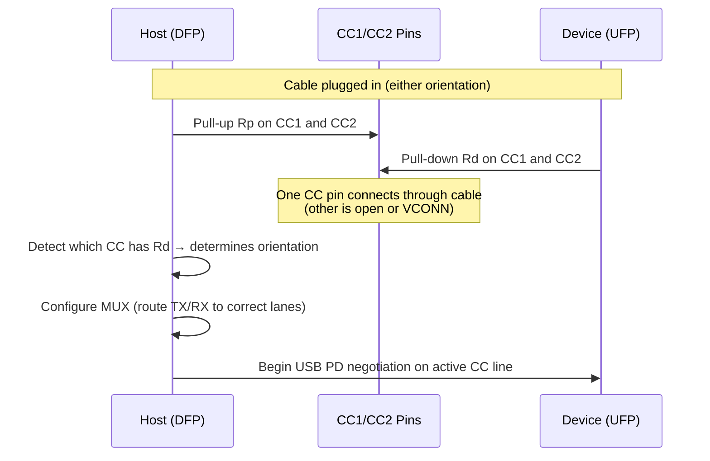
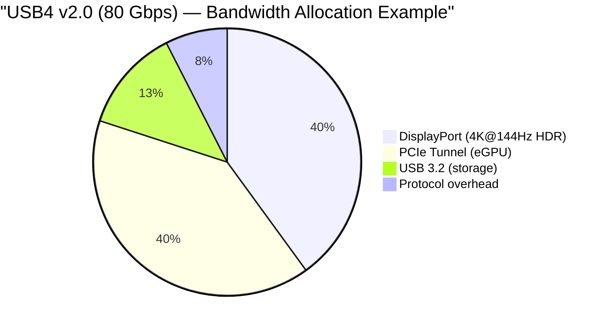

# USB4 Version 2.0 & USB Standards

**Topic:** USB4 Version 2.0 (80 Gbps); USB4 Gen 3x2 (40 Gbps); USB Type-C connector; USB Power Delivery 3.1 (240W EPR); Alternate Mode; tunneling architecture; USB 3.2 backward compatibility  
**Standards:** USB4 v2.0 (2022), USB Type-C Cable and Connector Spec 2.4, USB PD 3.1, USB 3.2 (2017), USB Audio Class 3.0, USB Video Class (UVC 1.5)  
**SDO:** USB-IF (USB Implementers Forum)  
**Audience:** USB silicon designers, platform engineers, hardware architects, connector engineers, USB compliance engineers  
**Prerequisites:** Differential signaling basics, protocol layering, power electronics fundamentals, connector mechanics

---

## Chapter 1 — Historical Context & Origin Story

### 1.1 USB Generation Timeline

| Year | Standard | Speed | Encoding | Connector | Key Innovation |
|------|----------|:-----:|:--------:|:---------:|---|
| 1996 | USB 1.0 | 1.5/12 Mbps | NRZI | Type-A/B | Universal plug-and-play; replaced serial/parallel ports |
| 2000 | USB 2.0 | 480 Mbps | NRZI | Type-A/B/Mini/Micro | High-Speed; mass storage mainstream |
| 2008 | USB 3.0 | 5 Gbps | 8b/10b | Type-A (blue) | SuperSpeed; added TX/RX differential pairs |
| 2013 | USB 3.1 Gen 2 | 10 Gbps | 128b/132b | Type-A/C | Enhanced SuperSpeed; USB-C introduced (2014) |
| 2017 | USB 3.2 | 10/20 Gbps | 128b/132b | Type-C (20G needs C) | Multi-lane: 2 lanes × 10 Gbps = 20 Gbps |
| 2019 | **USB4 Gen 3x2** | 40 Gbps | 128b/132b | Type-C (mandatory) | Tunneling: USB3 + DP + PCIe multiplexed; based on TB3 |
| 2022 | **USB4 v2.0** | 80 Gbps | PAM3 (128b/132b) | Type-C | 80 Gbps symmetric; 120 Gbps asymmetric; new PHY |
| 2023 | USB4 v2.0 + TB5 | 80-120 Gbps | PAM3 | Type-C | Thunderbolt 5 = USB4 v2.0 superset |

### 1.2 The USB-C Convergence

**Before USB-C (pre-2014):**
- Data: USB-A cable
- Display: HDMI/DP cable
- Power: Proprietary barrel jack
- Audio: 3.5mm jack
- = 4 separate cables per device

**After USB-C (2020+):**
- ONE USB-C cable carries: Data (40-120 Gbps) + Power (up to 240W) + Display (DP 2.1) + Audio (USB Audio Class) + Thunderbolt + PCIe
- = 1 cable replaces all

---

## Chapter 2 — USB4 Architecture

### 2.1 USB4 Protocol Layering

```mermaid
graph TB
    subgraph "USB4 Protocol Stack"
        subgraph "Tunneled Protocols"
            USB3T[USB 3.2 Tunnel<br/>━━━━━━━━━━━<br/>• SuperSpeed data<br/>• Mass storage, cameras<br/>• Backward compatible]
            DPT[DisplayPort Tunnel<br/>━━━━━━━━━━━<br/>• DP 2.1 (UHBR 20)<br/>• Up to 77 Gbps video<br/>• MST supported]
            PCIET[PCIe Tunnel<br/>━━━━━━━━━━━<br/>• PCIe 4.0 (up to)<br/>• External GPU (eGPU)<br/>• NVMe storage<br/>• Memory-mapped I/O]
            HOSTT[Host-to-Host<br/>━━━━━━━━━━━<br/>• IP networking<br/>• Peer-to-peer<br/>• macOS/Linux netdev]
        end
        
        subgraph "USB4 Transport Layer"
            TMU[Tunneling Multiplexer<br/>━━━━━━━━━━━<br/>• Time-division multiplexing<br/>• Bandwidth allocation per tunnel<br/>• Dynamic bandwidth management<br/>• QoS: DP gets priority]
        end
        
        subgraph "USB4 Link Layer"
            LL[Link Layer<br/>━━━━━━━━━━━<br/>• Framing (128b/132b)<br/>• Flow control<br/>• Lane bonding (2 lanes)<br/>• Error detection]
        end
        
        subgraph "USB4 Physical Layer"
            PHY[PHY Layer<br/>━━━━━━━━━━━<br/>• Gen 3: 20 Gbps/lane NRZ<br/>• Gen 4: 40 Gbps/lane PAM3<br/>• 2 lanes (TX+RX per lane)<br/>• USB-C connector (CC, SBU, Dx, SS pins)]
        end
    end
    
    USB3T --> TMU
    DPT --> TMU
    PCIET --> TMU
    HOSTT --> TMU
    TMU --> LL --> PHY
```

### 2.2 USB4 Tunneling Concept

| Protocol Tunneled | Bandwidth Available | Typical Use |
|:-----------------:|:---:|---|
| **USB 3.2** | Up to 20 Gbps | Storage devices, webcams, hubs |
| **DisplayPort** | Up to 77.4 Gbps (DP 2.1 UHBR 20) | External monitors (4K/8K/16K) |
| **PCIe** | Up to 64 Gbps (PCIe 4.0 x4 equivalent) | eGPU, NVMe enclosures, Thunderbolt devices |
| **Host-to-Host** | Variable | Network connection between two computers |

**Dynamic bandwidth sharing:**
- Total: 80 Gbps (USB4 v2.0)
- If DP needs 40 Gbps for 4K@240Hz: remaining 40 Gbps available for USB3 + PCIe
- If no display connected: full 80 Gbps available for data (PCIe/USB3)
- Controller dynamically reallocates based on demand

### 2.3 USB4 Speeds

| USB4 Mode | Per-Lane Rate | Lanes | Total BW | Signaling | Note |
|:---------:|:---:|:---:|:---:|:---:|---|
| USB4 Gen 2x1 | 10 Gbps | 1 | 10 Gbps | NRZ | Minimum USB4 |
| USB4 Gen 2x2 | 10 Gbps | 2 | 20 Gbps | NRZ | — |
| USB4 Gen 3x1 | 20 Gbps | 1 | 20 Gbps | NRZ | — |
| **USB4 Gen 3x2** | 20 Gbps | 2 | **40 Gbps** | NRZ | Standard USB4 (= Thunderbolt 3/4) |
| **USB4 Gen 4 (v2.0)** | 40 Gbps | 2 | **80 Gbps** | PAM3 | USB4 Version 2.0 |
| USB4 Gen 4 Asymmetric | 40+40+40 Gbps TX; 20 Gbps RX | 3:1 | **120/20 Gbps** | PAM3 | Bandwidth Boost (for display + data) |

---

## Chapter 3 — USB Type-C Connector

### 3.1 USB-C Pin Assignment

| Pin | Signal | Function |
|:---:|:------:|----------|
| A1, B1 | GND | Ground |
| A2, B2 | TX1+/TX1- | SuperSpeed TX (Lane 0) |
| A3, B3 | TX2+/TX2- | SuperSpeed TX (Lane 1) |
| A4, B4 | VBUS | Power (5-48V) |
| A5 | CC1 | Configuration Channel 1 (orientation, mode, PD) |
| B5 | CC2 | Configuration Channel 2 |
| A6, B6 | D+/D- | USB 2.0 (legacy; 480 Mbps) |
| A7, B7 | — | Reserved |
| A8, B8 | SBU1/SBU2 | Sideband Use (Alternate Mode; DP AUX; debug) |
| A9, B9 | RX1+/RX1- | SuperSpeed RX (Lane 0) |
| A10, B10 | RX2+/RX2- | SuperSpeed RX (Lane 1) |
| A11, B11 | GND | Ground |
| A12, B12 | VBUS | Power (5-48V) |

**Total:** 24 pins (12 per side; reversible — works either orientation)

### 3.2 Orientation Detection (CC Logic)



### 3.3 USB-C Cable Types

| Cable Type | Max Speed | Max Power | Max Length | Active? | Cost |
|:----------:|:---------:|:---------:|:----------:|:-------:|:----:|
| USB 2.0 C-to-C | 480 Mbps | 60W (PD) | 4m | No | $ |
| USB 3.2 Gen 2 passive | 10 Gbps | 100W (PD) | 1m | No | $$ |
| USB4 Gen 3 passive | 40 Gbps | 100W (PD) | 0.8m | No | $$$ |
| USB4 Gen 3 active | 40 Gbps | 240W (EPR) | 2m | Yes (retimer) | $$$$ |
| USB4 v2.0 (80G) active | 80 Gbps | 240W (EPR) | 1-2m | Yes (retimer) | $$$$$ |
| Optical USB4 | 40-80 Gbps | N/A (no power) | 5-50m | Yes (optical) | $$$$$ |

---

## Chapter 4 — USB Power Delivery 3.1

### 4.1 USB PD Voltage/Power Levels

| PD Spec | Voltage Range | Max Current | Max Power | Connector |
|:-------:|:---:|:---:|:---:|:---:|
| USB PD 2.0 (SPR) | 5V, 9V, 15V, 20V | 5A (at 20V) | **100W** | USB-C (with e-marked cable) |
| USB PD 3.0 (SPR) | 5V, 9V, 15V, 20V | 5A | **100W** | USB-C |
| **USB PD 3.1 (EPR)** | 5V, 9V, 15V, 20V, **28V, 36V, 48V** | 5A | **240W** | USB-C (EPR cable required) |

### 4.2 PD Negotiation Flow

```mermaid
sequenceDiagram
    participant SRC as Source (Charger)
    participant SNK as Sink (Laptop)
    
    Note over SRC,SNK: Cable connected; CC orientation detected
    SRC->>SNK: Source_Capabilities (I can provide: 5V/3A, 9V/3A, 20V/5A, 28V/5A, 48V/5A)
    SNK->>SNK: Evaluate: I need 140W → 28V × 5A = 140W works
    SNK->>SRC: Request (28V @ 5A = 140W)
    SRC->>SRC: Check: can I provide 28V/5A? Yes.
    SRC->>SNK: Accept
    SRC->>SRC: Ramp voltage: 5V → 28V (controlled transition)
    SRC->>SNK: PS_RDY (Power Supply Ready at 28V)
    
    Note over SRC,SNK: Laptop now charging at 140W (28V × 5A)
    
    Note over SNK: Later: laptop fully charged; reduce power
    SNK->>SRC: Request (5V @ 0.9A = 4.5W; maintain connection)
    SRC->>SNK: Accept
    SRC->>SRC: Ramp voltage: 28V → 5V
    SRC->>SNK: PS_RDY (5V established)
```

### 4.3 EPR (Extended Power Range) Key Rules

| Rule | Requirement |
|:----:|-------------|
| EPR cable | Special EPR-rated cable required (50V insulation); identified via cable VDM |
| Voltage steps | 28V, 36V, 48V (fixed PDOs); AVS (Adjustable Voltage Supply) 15-48V variable |
| Safety | Source and sink must both explicitly support EPR; negotiated step-by-step |
| Fallback | If EPR cable not detected: max 20V/5A (100W SPR) |
| Temperature | EPR cables must have temperature sensors; source monitors cable temp |

---

## Chapter 5 — USB4 Alternate Mode & Display

### 5.1 DisplayPort Alt Mode over USB-C

| DP Alt Mode Config | Lanes for DP | Lanes for USB3 | DP Bandwidth | USB3 Bandwidth |
|:---:|:---:|:---:|:---:|:---:|
| **4-lane DP** (pin assignment C/E) | 4 | 0 | Full DP 2.1 (77 Gbps) | None (USB 2.0 only) |
| **2-lane DP + 2-lane USB** (pin assignment D) | 2 | 2 | Half DP | USB 3.2 (10 Gbps) |
| **USB4 DP Tunneling** (preferred) | Shared | Shared | Dynamic (up to full) | Dynamic (remainder) |

### 5.2 USB4 vs. DP Alt Mode

| Aspect | DP Alt Mode (pre-USB4) | USB4 DP Tunneling |
|:------:|:---:|:---:|
| Mechanism | Repurposes USB3 lane pairs as DP lanes (hardware MUX) | Packetizes DP data into USB4 tunnel (software/protocol) |
| Flexibility | Fixed: 2 or 4 lanes for DP (static assignment) | Dynamic: DP bandwidth allocated as needed; released when idle |
| USB3 + DP | Either-or (4-lane DP = no USB3) | Both simultaneously (bandwidth shared) |
| Max displays | 2 (with MST over 4-lane DP) | 2+ (limited by total bandwidth) |
| PCIe + DP | Not possible | Both PCIe and DP tunneled simultaneously |

---

## Chapter 6 — USB4 Version 2.0 PHY Details

### 6.1 PAM3 Signaling

| Parameter | USB4 Gen 3 (NRZ) | USB4 Gen 4 (PAM3) |
|:---------:|:---:|:---:|
| Signaling | NRZ (2 levels) | **PAM3** (3 levels: -1, 0, +1) |
| Baud rate | 20 GBaud | ~26.7 GBaud |
| Bits per symbol | 1 | log₂(3) ≈ 1.585 |
| Data rate per lane | 20 Gbps | **40 Gbps** (26.7 × 1.585) |
| Lanes | 2 | 2 |
| Total | 40 Gbps | **80 Gbps** |
| Eye height | Large (NRZ) | Moderate (better than PAM4; only 3 levels vs. 4) |
| Channel loss tolerance | Good | Requires retimer for >0.8m |

### 6.2 Bandwidth Boost (Asymmetric Mode)

| Mode | TX (to device) | RX (from device) | Total | Use Case |
|:----:|:---:|:---:|:---:|---|
| Symmetric (default) | 80 Gbps | 80 Gbps | 160 Gbps (bidirectional) | eGPU; storage (balanced I/O) |
| **Asymmetric 120/20** | **120 Gbps** | 20 Gbps | 140 Gbps | Display output (host → monitor: high BW needed one direction) |
| **Asymmetric 20/120** | 20 Gbps | **120 Gbps** | 140 Gbps | Camera/capture input (device → host) |

**How 120 Gbps is achieved:**
- Normal: 2 lanes TX + 2 lanes RX (each at 40 Gbps) = 80+80
- Asymmetric: 3 lanes TX + 1 lane RX (repurpose 1 RX lane as TX) = 120+40... actually: reconfigure channel for 3 logical lanes in one direction

---

## Chapter 7 — Comparison: USB4 vs. Thunderbolt 5 vs. USB 3.2

| Feature | USB 3.2 Gen 2x2 | USB4 Gen 3x2 | USB4 v2.0 | Thunderbolt 5 |
|:-------:|:---:|:---:|:---:|:---:|
| **Max speed** | 20 Gbps | 40 Gbps | 80 Gbps | 120 Gbps (asym) |
| **Connector** | USB-C | USB-C | USB-C | USB-C |
| **Tunneling** | No (data only) | Yes (USB3+DP+PCIe) | Yes | Yes (all mandatory) |
| **PCIe tunnel** | No | Optional | Optional | **Mandatory** (PCIe 4.0) |
| **DP tunnel** | No (DP Alt Mode only) | Optional | Yes | **Mandatory** (DP 2.1) |
| **Min guaranteed BW** | 20 Gbps | *No minimum* | *No minimum* | **80 Gbps guaranteed** |
| **eGPU support** | No | Optional | Optional | **Mandatory** |
| **Daisy-chain** | No | Optional | Optional | **Mandatory** (up to 3 devices) |
| **Certification** | USB-IF | USB-IF | USB-IF | **Intel** (stricter) |
| **USB PD** | Up to 100W | Up to 240W | Up to 240W | Up to 240W |

**Key insight:** Thunderbolt 5 = USB4 v2.0 with ALL optional features MANDATORY + Intel certification (quality guarantee). A USB4 v2.0 device might support only 40 Gbps with no PCIe tunnel; a Thunderbolt 5 device guarantees 80-120 Gbps with PCIe + DP.

---

## Chapter 8 — Architecture Diagrams

### 8.1 USB4 Host Controller Architecture

```mermaid
graph TB
    subgraph "USB4 Host (Laptop/Desktop)"
        CPU[CPU<br/>PCIe Root Complex]
        
        subgraph "USB4 Controller (e.g., Intel Maple Ridge / AMD)"
            ROUTER[USB4 Router<br/>━━━━━━━━━━━<br/>• Adapter management<br/>• Bandwidth allocation<br/>• Tunnel setup/teardown<br/>• Hot-plug handling]
            
            USB3_A[USB 3.2 Adapter<br/>━━━━━━━━━━━<br/>• xHCI (USB 3.2 host)<br/>• Up to 20 Gbps<br/>• Legacy device support]
            
            DP_A[DP Adapter<br/>━━━━━━━━━━━<br/>• DP source (from GPU)<br/>• MST support<br/>• Up to UHBR 20]
            
            PCIE_A[PCIe Adapter<br/>━━━━━━━━━━━<br/>• PCIe root port<br/>• Up to PCIe 4.0 x4<br/>• eGPU, NVMe support]
        end
        
        subgraph "USB4 PHY"
            PHY_S[PHY (Gen 3: 20G NRZ or Gen 4: 40G PAM3)<br/>━━━━━━━━━━━<br/>• 2 differential pairs TX<br/>• 2 differential pairs RX<br/>• Retimer support<br/>• Lane bonding]
        end
        
        USB_C_PORT[USB-C Port<br/>━━━━━━━━━━━<br/>• CC logic (orientation)<br/>• PD controller<br/>• MUX (Alt Mode / USB4)<br/>• VBUS switch]
    end
    
    CPU -->|PCIe| ROUTER
    ROUTER --> USB3_A
    ROUTER --> DP_A
    ROUTER --> PCIE_A
    ROUTER --> PHY_S --> USB_C_PORT
```

### 8.2 USB4 Tunnel Bandwidth Allocation Example



---

## Chapter 9 — Case Studies

### 9.1 Universal Docking Station (Thunderbolt 5)

| Aspect | Detail |
|--------|--------|
| **Product** | Single-cable Thunderbolt 5 dock for workstation |
| **Connection** | One USB-C cable from laptop to dock: 120 Gbps (bandwidth boost) + 240W power |
| **Dock provides** | (1) 2× DisplayPort 2.1 outputs (each 4K@144Hz HDR = 32 Gbps). (2) 1× 10GbE Ethernet (via PCIe tunnel to NIC chip in dock). (3) 4× USB-A 10 Gbps ports (via USB3 tunnel). (4) 1× SD card reader. (5) 240W PD passthrough to laptop. |
| **Bandwidth math** | DP monitor 1: 32 Gbps + DP monitor 2: 32 Gbps + 10GbE: 10 Gbps + USB 3.2 hub: 10 Gbps + overhead: 6 Gbps = ~90 Gbps. Asymmetric 120 Gbps TX handles this. RX (20 Gbps): keyboard/mouse input; upload traffic. |
| **Key technologies** | USB4 v2.0 tunneling; DP MST; PCIe switch (in dock); USB PD 3.1 EPR; PAM3 PHY with retimer in cable |

### 9.2 USB PD 3.1 Laptop Charging Evolution

| Aspect | Detail |
|--------|--------|
| **Challenge** | Gaming laptop needs 180W; previously required proprietary barrel jack. USB PD 3.0 max = 100W (insufficient). |
| **Solution** | USB PD 3.1 EPR: 48V × 5A = 240W. Single USB-C charger replaces proprietary adapter. |
| **Implementation** | (1) Laptop advertises EPR sink capability. (2) Charger (GaN 240W) advertises 48V/5A EPR source. (3) EPR cable detected (50V-rated; e-marked with EPR VDM). (4) PD negotiation: 48V requested → accepted → voltage ramps up. (5) Laptop charges at 180W (48V × 3.75A) — within 240W EPR envelope. |
| **Benefits** | (1) Universal charger: same charger for phone (20W), tablet (45W), laptop (180W). (2) GaN chargers: compact; 240W in travel size. (3) Airline/hotel: USB-C PD outlets emerging. (4) Sustainability: one charger for all devices (EU regulation). |

---

## Chapter 10 — Future Evolution

| Trend | Timeline | Impact |
|-------|----------|--------|
| **USB4 v2.0 mainstream** | 2024-2025 | 80 Gbps becomes standard in laptops and docks |
| **USB4 v3.0 (160 Gbps?)** | 2027+ | Potential next speed doubling (speculative) |
| **USB PD beyond 240W** | 2026+ | Possible higher voltages for monitors/displays that need power |
| **USB-C everywhere** | 2024+ | EU mandate: all phones USB-C (2024); laptops (2026); other devices (2028) |
| **Optical USB** | 2025+ | Long-distance USB4 over fiber (10-50m); conference rooms; KVM |
| **USB4 in automotive** | 2025+ | In-vehicle connectivity (infotainment, cameras) replacing proprietary |
| **AI accelerator attach** | 2025+ | USB4/TB5 external AI compute (PCIe tunnel to neural engine) |

---

## Chapter 11 — Interview Questions & Career Guide

### Tier 1: Entry-Level

**Q1:** What is USB4 tunneling? How does it differ from USB 3.2?

**A:** USB 3.2 is a single-protocol interface: it carries only USB data (bulk, interrupt, isochronous transfers). If you want display output, you must use a SEPARATE mechanism: DisplayPort Alternate Mode, which physically repurposes the USB3 data lanes as DP lanes (they can't carry USB data simultaneously in 4-lane mode).

USB4 introduces **tunneling**: a single USB4 link multiplexes MULTIPLE independent protocols simultaneously:
- **USB 3.2 tunnel**: carries traditional USB data (storage, webcam, etc.)
- **DisplayPort tunnel**: carries DP video stream (to external monitor)
- **PCIe tunnel**: carries PCIe transactions (for eGPU, NVMe enclosure)
- **Host-to-host tunnel**: IP networking between two computers

All tunnels share the USB4 link bandwidth (40-120 Gbps) dynamically. When DP needs more bandwidth (high-refresh display), USB3 gets less; when display disconnects, all bandwidth is available for data.

**Key difference:** USB 3.2 = one protocol at a time (or either/or with DP Alt Mode). USB4 = multiple protocols simultaneously over one link via time-division multiplexing.

### Tier 2: Mid-Level

**Q2:** Explain USB Power Delivery 3.1 EPR. How does a 240W negotiation work? What safety mechanisms exist?

**A:**

USB PD 3.1 Extended Power Range (EPR) adds three new voltage levels beyond the 20V maximum of PD 3.0:
- **28V** (max 140W at 5A)
- **36V** (max 180W at 5A)  
- **48V** (max 240W at 5A)

**Negotiation process:**

1. **Cable detection**: EPR requires a special EPR-rated cable (50V insulation; temperature monitoring). Source detects cable EPR capability via Cable VDM (Vendor Defined Message) over CC wire.

2. **Source advertisement**: Charger sends Source_Capabilities message including EPR PDOs (Power Data Objects): e.g., [5V/3A, 9V/3A, 15V/3A, 20V/5A, 28V/5A, 36V/5A, 48V/5A].

3. **Sink request**: Laptop evaluates capabilities; selects optimal: e.g., 48V/3.75A = 180W. Sends Request message.

4. **EPR entry**: Both sides enter EPR mode. Source confirms with Accept + EPR_Mode_Enter.

5. **Voltage transition**: Source ramps voltage from 5V → requested voltage. Controlled slew rate. Sink monitors voltage; confirms when stable.

6. **PS_RDY**: Source signals Power Supply Ready. Charging begins.

**Safety mechanisms:**

| Mechanism | Purpose |
|:---------:|---------|
| EPR cable requirement | Prevents 48V on cables rated only for 20V (fire risk) |
| Cable temperature monitoring | EPR cables have temp sensor; source reduces power if cable hot |
| Keepalive messages | Source and sink must exchange periodic messages; timeout = reduce to safe voltage |
| Voltage clamping | Sink has overvoltage protection; if voltage exceeds requested by >10%: disconnect |
| Graceful degradation | If EPR cable removed mid-session: immediate voltage reduction to 5V (safe default) |
| Sequential voltage steps | Can't jump from 5V to 48V directly; must negotiate through defined PDOs |

### Tier 3: Senior

**Q3:** Design the USB4 subsystem for a next-generation laptop. Address: controller selection, tunnel bandwidth allocation, PD architecture, thermal management, and backward compatibility matrix.

**A:**

**System requirements:**
- 2× USB-C ports (both USB4 v2.0 / Thunderbolt 5 capable)
- Support: 2× 4K@144Hz external displays + eGPU + USB hub + 240W charging simultaneously
- Backward compatible with: USB 2.0, USB 3.2, USB4 Gen 3, DP Alt Mode, TB3/TB4 devices

**Architecture:**

| Component | Selection | Rationale |
|:---------:|:---------:|-----------|
| USB4 controller | Intel Barlow Ridge (or AMD equivalent) | Integrated USB4 v2.0 (80 Gbps); dual-port; TB5 certified |
| PD controller | TI TPS65988 (dual-port) | USB PD 3.1 EPR (240W); integrated load switch; CC logic |
| Retimer | Intel JHL9040R | Required for >0.8m cable at Gen 4 speeds; in signal path |
| USB-C MUX | TI HD3SS3220 | Orientation switch (2:1 MUX for all SS lanes) |
| DP source | Integrated GPU (Intel/AMD) | MST capable; DP 2.1 UHBR 20 support |

**Bandwidth allocation policy:**

| Priority | Tunnel | Allocation Rule |
|:--------:|:------:|---|
| 1 (highest) | DisplayPort | Guaranteed: enough BW for connected display resolution/refresh |
| 2 | PCIe (eGPU) | Guaranteed: minimum 32 Gbps for usable eGPU performance |
| 3 | USB 3.2 | Best-effort: remainder bandwidth (at least 10 Gbps guaranteed) |
| 4 | Host-to-host | Best-effort: lowest priority |

**Scenario matrix:**

| Port 1 Connected | Port 2 Connected | Port 1 BW | Port 2 BW | Notes |
|:---:|:---:|:---:|:---:|---|
| 4K@144Hz monitor (DP) | USB-C hub (USB3) | 32 Gbps DP | 10 Gbps USB3 | Both satisfied |
| eGPU (PCIe) | 4K@60Hz monitor | 64 Gbps PCIe | 16 Gbps DP | Each port independent (dual controller) |
| TB5 dock (DP+USB3+PCIe) | 240W charger | 120 Gbps (asym) | Power only | Bandwidth boost for dock |
| USB 2.0 device (legacy) | Nothing | 480 Mbps (USB 2.0 fallback) | — | Backward compatibility |

**Thermal management:**

| Component | TDP | Thermal Solution |
|:---------:|:---:|---|
| USB4 controller | 3-5W | Shared laptop heatsink; thermal pad to chassis |
| Retimer (×2) | 1W each | PCB copper pour thermal pad |
| PD controller | 0.5W | No active cooling needed |
| **VBUS power path** | Up to 240W through connector | Thick PCB traces (6+ oz copper); current sensing; thermal shutdown at 125°C |

**Backward compatibility matrix:**

| Device Plugged In | Detected As | Speed | Power | Features |
|:---:|:---:|:---:|:---:|---|
| USB 2.0 (Type-A adapter) | USB 2.0 | 480 Mbps | 5V/0.9A (4.5W) | Data only |
| USB 3.2 Gen 2 device | USB 3.2 | 10 Gbps | PD negotiated | Data + power |
| USB4 Gen 3 dock | USB4 Gen 3 | 40 Gbps | Up to 100W | Full tunneling (at 40G) |
| Thunderbolt 3 device | TB3 (USB4 Gen 3) | 40 Gbps | Up to 100W | TB3 compatibility mode |
| USB4 v2.0 device | USB4 Gen 4 | 80 Gbps | Up to 240W | Full Gen 4 (PAM3) |
| DP Alt Mode monitor | DP Alt Mode | Up to 32.4 Gbps (HBR3) | — | Falls back to DP Alt Mode (no tunneling) |

---

## Chapter 12 — Cheat Sheet & Quick Reference

```
═══════════════════════════════════════════
USB4 & USB STANDARDS — QUICK REFERENCE
═══════════════════════════════════════════

USB4 SPEED TIERS:
  USB4 Gen 2x2:  20 Gbps (NRZ; 10G × 2 lanes)
  USB4 Gen 3x2:  40 Gbps (NRZ; 20G × 2 lanes) = TB3/TB4
  USB4 Gen 4:    80 Gbps (PAM3; 40G × 2 lanes) = v2.0
  Asymmetric:    120/20 Gbps (bandwidth boost)

═══════════════════════════════════════════
USB-C ESSENTIALS:
  24 pins (12 per side; reversible)
  CC pins: orientation + PD negotiation
  SBU pins: sideband (DP AUX, debug)
  4 differential pairs: 2 TX + 2 RX (SuperSpeed)
  D+/D-: USB 2.0 (always present; legacy)
  VBUS: Power (5-48V; up to 5A)

═══════════════════════════════════════════
USB POWER DELIVERY:
  PD 3.0 (SPR): 5V/9V/15V/20V; max 100W (20V×5A)
  PD 3.1 (EPR): +28V/36V/48V; max 240W (48V×5A)
  EPR requires: EPR-rated cable + both sides EPR-capable
  Negotiation: over CC wire; Source_Caps → Request → Accept

═══════════════════════════════════════════
USB4 TUNNELING:
  Tunnels: USB 3.2 + DisplayPort + PCIe + Host-to-Host
  Dynamic: bandwidth shared; reallocated on demand
  Priority: DP > PCIe > USB3 > Host-to-Host
  vs. Alt Mode: tunneling = simultaneous; Alt Mode = either/or

═══════════════════════════════════════════
USB4 vs THUNDERBOLT 5:
  USB4 v2.0: 80 Gbps; optional features (PCIe, DP may be absent)
  TB5: 120 Gbps; ALL features MANDATORY; Intel-certified
  Rule: Every TB5 device is USB4 v2.0; not every USB4 v2.0 is TB5

═══════════════════════════════════════════
BACKWARD COMPATIBILITY:
  USB4 host supports: USB 2.0, USB 3.x, USB4, TB3, TB4, TB5
  Connector: Always USB-C (for USB4)
  Falls back automatically to highest common speed
  DP Alt Mode: still works for non-USB4 displays

═══════════════════════════════════════════
KEY CABLE RULES:
  Passive cable: shorter (≤0.8m for 40G); cheaper; no electronics
  Active cable: longer (2m for 80G); retimer inside; more expensive
  EPR cable: 50V rated; temp sensor; required for >100W
  Check markings: look for USB4 Gen 3 or Gen 4 rating on cable
```

---

*End of Document — 01_USB4_Gen4_Standards.md*
