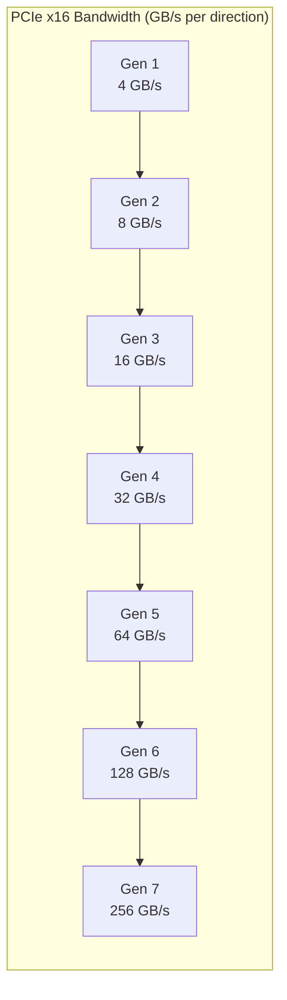

# PCIe 6.0 & 7.0 — Next-Generation Interconnect

**Topic:** PCI Express 6.0 (64 GT/s) and 7.0 (128 GT/s); PAM4 signaling; FLIT-based transport; forward error correction; CRC/retry architecture; PCIe over optical  
**Standards:** PCIe 6.0 Specification (2022), PCIe 7.0 Specification (2025), PCIe Base Spec 6.0/7.0  
**SDO:** PCI-SIG (PCI Special Interest Group)  
**Audience:** SoC architects, PCIe IP designers, silicon verification engineers, server hardware architects, AI/HPC platform engineers  
**Prerequisites:** PCIe fundamentals (TLP, DLLP, link training), digital signaling concepts (NRZ, encoding), SerDes basics

---

## Chapter 1 — Historical Context & Origin Story

### 1.1 PCIe Generation Timeline

| Gen | Year | Data Rate | Encoding | BW (x16) | Key Innovation |
|:---:|:----:|:---------:|:--------:|:---------:|---|
| 1.0 | 2003 | 2.5 GT/s | 8b/10b | 4 GB/s | First serial replacement for PCI/PCI-X |
| 2.0 | 2007 | 5 GT/s | 8b/10b | 8 GB/s | Doubled speed; same encoding |
| 3.0 | 2010 | 8 GT/s | 128b/130b | 16 GB/s | Scrambled 128b/130b (no 8b/10b overhead) |
| 4.0 | 2017 | 16 GT/s | 128b/130b | 32 GB/s | Data center NVMe; mainstream GPU |
| 5.0 | 2019 | 32 GT/s | 128b/130b | 64 GB/s | AI accelerators; 400GbE NICs |
| **6.0** | **2022** | **64 GT/s** | **PAM4 + FLIT** | **128 GB/s** | PAM4; FLIT mode; FEC; L0p power state |
| **7.0** | **2025** | **128 GT/s** | **PAM4 + FLIT** | **256 GB/s** | 1 Tbps x16; AI clusters; disaggregation |

### 1.2 Why PAM4 Was Necessary at Gen 6

| Challenge | NRZ at 64 GT/s | PAM4 Solution |
|:---------:|---|---|
| Channel loss | 64 GHz Nyquist → extreme PCB/connector attenuation | PAM4 at 32 GBaud achieves 64 GT/s with 32 GHz Nyquist (half the frequency) |
| Connector limitations | CEM connector can't support 64 GHz | 32 GHz fits within existing connector spec |
| Power | 64 GHz NRZ SerDes: extremely power-hungry equalization | PAM4 at 32 GHz: lower frequency → less equalization power |
| Compatibility | Would require entirely new connector ecosystem | PAM4 at 32 GBaud reuses PCIe 5.0 channel specifications |

**Trade-off:** PAM4 has 1/3 the voltage eye opening → requires **FEC** (Forward Error Correction) → introduces latency. Solution: FLIT mode amortizes FEC overhead.

---

## Chapter 2 — PCIe 6.0 Architecture

### 2.1 FLIT-Based Transport (New in Gen 6)

```mermaid
graph TB
    subgraph "PCIe 5.0 and earlier (byte-stream)"
        TLP5[TLP (variable size: 12-4096 bytes)<br/>━━━━━━━━━━━<br/>• Header (12-16 bytes)<br/>• Data payload (0-4096 bytes)<br/>• ECRC (optional, 4 bytes)<br/>• LCRC (4 bytes)<br/>• Framing: STP/END]
        
        DLLP5[DLLP (6 bytes)<br/>━━━━━━━━━━━<br/>• ACK/NAK<br/>• Flow control<br/>• Power management]
    end
    
    subgraph "PCIe 6.0+ (FLIT mode)"
        FLIT[FLIT (Fixed 256 bytes)<br/>━━━━━━━━━━━<br/>• Fixed-size container<br/>• Contains 1 or more TLPs<br/>  (packed; multiple TLPs per FLIT)<br/>• 6 bytes CRC (per FLIT)<br/>• 8 bytes FEC parity<br/>• DLP (Data Link Protocol bytes)<br/>  embedded within FLIT<br/>• No STP/END framing needed]
    end
```

### 2.2 FLIT Structure (256 bytes)

| Field | Size | Description |
|:-----:|:----:|-------------|
| **TLP data** | 236 bytes | One or more TLPs packed contiguously (no gaps; no framing tokens) |
| **DLP** | 6 bytes | Data Link Protocol: ACK/NAK, sequence numbers, flow control credits |
| **CRC** | 6 bytes | CRC-48: covers entire FLIT content (TLP data + DLP) |
| **FEC** | 8 bytes | Forward Error Correction parity (detects/corrects bit errors from PAM4 channel) |
| **Total** | **256 bytes** | Fixed size; always 256 bytes (padded if TLP data doesn't fill) |

### 2.3 Why FLIT Mode?

| Aspect | Byte-stream (Gen ≤5.0) | FLIT (Gen 6.0+) |
|:------:|:---:|:---:|
| **TLP framing** | STP/END tokens per TLP (overhead per TLP) | No framing tokens; TLPs packed back-to-back |
| **DLLP** | Separate DLLP packets on link (consume bandwidth) | DLP embedded in FLIT (no separate packets) |
| **CRC** | Per-TLP LCRC (4 bytes per TLP) | Per-FLIT CRC-48 (6 bytes per 236 bytes of TLP data) — less overhead |
| **FEC** | Not used | 8 bytes per FLIT (corrects PAM4 bit errors) |
| **Efficiency** | ~96% (128b/130b + per-TLP overhead) | ~92-94% (FEC + CRC overhead; but compensated by packed TLPs) |
| **Error handling** | Retry entire TLP on CRC failure | FEC corrects most errors without retry → higher effective throughput |
| **Latency** | — | FEC adds ~2-5 ns latency (acceptable trade-off for reliability) |

### 2.4 FEC (Forward Error Correction) in PCIe 6.0

| Parameter | Value |
|:---------:|:-----:|
| FEC type | Group-based FEC (3 FLITs = 1 FEC group) |
| Correction capability | Correct burst errors up to ~16 bits per FEC group |
| Latency added | ~2-5 ns (fixed; pipeline-able) |
| BER requirement (pre-FEC) | ≤ 10⁻⁶ (PAM4 channel BER) |
| BER after FEC | ≤ 10⁻¹² (virtually error-free) |
| Residual errors | Handled by CRC-48 → FLIT retry (very rare; <10⁻¹² rate) |

---

## Chapter 3 — PCIe 7.0 Architecture

### 3.1 PCIe 7.0 Key Parameters

| Parameter | PCIe 6.0 | PCIe 7.0 |
|:---------:|:---------:|:---------:|
| Data rate | 64 GT/s | **128 GT/s** |
| Signaling | PAM4 (32 GBaud) | PAM4 (**64 GBaud**) |
| Encoding | FLIT (256B) | FLIT (256B) |
| x1 bandwidth | 8 GB/s (each direction) | **16 GB/s** |
| x4 bandwidth | 32 GB/s | **64 GB/s** |
| x16 bandwidth | 128 GB/s | **256 GB/s** (~2 Tbps) |
| FEC | Yes (Gen 6 FEC) | Enhanced FEC |
| Channel requirements | 30 cm PCB reach | Challenging; may require optical/retimer |
| Power state | L0p (low-power link) | L0p enhanced |
| Target release | 2022 (spec) | **2025** (spec 1.0) |
| Silicon availability | 2024 | 2027-2028 |

### 3.2 PCIe 7.0 Challenges

| Challenge | Description | Mitigation |
|:---------:|-------------|-----------|
| **Channel loss at 64 GBaud PAM4** | 64 GHz Nyquist frequency → extreme insertion loss on PCB | Shorter traces; better PCB materials (Megtron 7+); retimers |
| **Connector** | CEM connector may not support 128 GT/s reliably | New connector designs; optical CEM under development |
| **SerDes power** | 64 GBaud PAM4 equalizers consume significant power | Advanced DSP; lower-voltage silicon (3nm/2nm process) |
| **Reach** | Practical reach may be <15 cm without retimer | Retimer chips in signal path; or optical PHY |
| **Thermal** | x16 slot: 256 GB/s = significant I/O power (>50W for PHY alone) | Careful thermal design; possibly liquid cooling for high-BW cards |

### 3.3 PCIe Bandwidth Scaling History



**Doubling every generation:** consistent 2× improvement; ~3-4 year cadence.

---

## Chapter 4 — PCIe Power Management

### 4.1 L0p — Partial Link Width (New in Gen 6)

| Power State | Lanes Active | Bandwidth | Latency to Full BW | Use Case |
|:-----------:|:---:|:---:|:---:|---|
| **L0 (Full)** | All (e.g., x16) | 100% | 0 | Active high-bandwidth transfer |
| **L0p** | Partial (e.g., x2 of x16) | 12.5% | **~2 ns** (almost instant) | Light traffic; huge power savings |
| L1 | 0 (link idle) | 0% | ~1-10 µs | No traffic; deeper sleep |
| L2 | 0 (very deep) | 0% | ~ms | System sleep |

**L0p benefit:** Traditional PCIe had only L0 (full power) or L1 (link down; high exit latency). L0p allows most lanes to power down while keeping 1-2 lanes active for background traffic. Exit to full L0 is nearly instantaneous (~2 ns) because link is still up.

**Power savings:**
- x16 link in L0p (x2 active): ~87.5% of PHY power saved
- For AI workloads: burst compute → brief high BW → long idle periods. L0p avoids L1 exit penalty while saving power during idle.

### 4.2 PCIe 6.0/7.0 Power Efficiency

| Metric | PCIe 5.0 | PCIe 6.0 | PCIe 7.0 |
|:------:|:---------:|:---------:|:---------:|
| Energy per bit (pJ/bit) | ~5 | ~5-7 (PAM4 equalization overhead) | ~6-8 (estimated) |
| x16 PHY power (typical) | 15-25W | 20-35W | 30-50W (estimated) |
| BW per watt | ~3 GB/s/W | ~4-5 GB/s/W | ~5-6 GB/s/W |
| L0p support | No | **Yes** | **Yes** (enhanced) |

---

## Chapter 5 — PCIe Use Cases: AI/HPC

### 5.1 AI Accelerator Connectivity

| Configuration | PCIe Gen | Bandwidth (per GPU) | Use Case |
|:---:|:---:|:---:|---|
| 1 GPU (x16) | Gen 5 | 64 GB/s | Single-GPU workstation |
| 8 GPUs (x16 each) via PCIe switch | Gen 5 | 64 GB/s per GPU; 512 GB/s total | AI training server |
| 8 GPUs (x16 each) | **Gen 6** | **128 GB/s** per GPU; 1 TB/s total | Next-gen AI server |
| 8 GPUs (x16 each) | **Gen 7** | **256 GB/s** per GPU; 2 TB/s total | Future disaggregated AI |
| CXL memory pool | Gen 6/7 | 128-256 GB/s to memory | Memory expansion for large models |

### 5.2 PCIe 7.0 Target Applications

| Application | Why PCIe 7.0 Needed | Alternative |
|:-----------:|---|---|
| **AI/ML accelerators (GPU, TPU)** | Model sizes growing exponentially; need more host↔accelerator bandwidth for data feeding | NVLink (proprietary; GPU-to-GPU only) |
| **800GbE / 1.6TbE NICs** | Network card must ingest 800 Gbps from wire → needs x16 Gen 7 to host | None at this speed |
| **NVMe SSD arrays** | Gen 7 x4 = 64 GB/s per SSD; 16 SSDs = 1 TB/s to CPU | CXL-attached storage |
| **CXL memory expanders** | Large memory pools (TB-scale) need high-BW connection to CPU | CXL runs over PCIe PHY |
| **Disaggregated compute** | CPU in one box; accelerator in another; connected via PCIe over optical | Custom interconnects |

---

## Chapter 6 — PCIe over Optical

### 6.1 Why Optical for PCIe?

| Problem with Electrical at Gen 7+ | Optical Solution |
|:---:|---|
| PCB reach: 15-30 cm max at 128 GT/s | Optical: meters to kilometers without signal degradation |
| Connector loss: CEM connector approaching limits | Optical connectors: low-loss at any data rate |
| Retimer cost/power: each retimer adds latency + power | Optical: no retimers needed for reach |
| Rack-scale: can't put PCIe across racks electrically | Optical: cross-rack, cross-chassis PCIe fabric |

### 6.2 PCIe Optical Specifications

| Spec/Initiative | Organization | Status | Reach |
|:---:|:---:|:---:|:---:|
| OIF CEI-112G | OIF | Production (112 Gbps/lane) | Module-to-module |
| OIF CEI-224G | OIF | 2024 (224 Gbps/lane) | Module-to-module |
| PCIe over Optical (PCI-SIG) | PCI-SIG | Spec in development | 1-100m |
| CXL Optical (OIF/CXL) | OIF + CXL Consortium | Early exploration | Rack-scale |
| Co-Packaged Optics (CPO) | Intel, Broadcom, others | Demos 2024; production 2026+ | Chip-to-chip at optical speed |

---

## Chapter 7 — Comparison: PCIe 6.0/7.0 vs. CXL vs. NVLink

| Dimension | PCIe 7.0 | CXL 3.1 | NVLink (NVIDIA) |
|:---------:|:---------:|:--------:|:---------------:|
| **Organization** | PCI-SIG (open standard) | CXL Consortium (open) | NVIDIA (proprietary) |
| **Transport** | Load/store (memory-mapped I/O) | Memory semantics (cache-coherent) + load/store | GPU memory fabric (coherent) |
| **PHY** | PCIe 7.0 PHY (128 GT/s PAM4) | **Runs on PCIe PHY** (same electrical) | Custom (proprietary PHY) |
| **Coherency** | No (host manages) | **Yes** (hardware cache coherence: .mem, .cache) | Yes (GPU-GPU NVLink) |
| **Use case** | I/O: GPU, NIC, SSD, accelerators | Memory: disaggregated DRAM, memory pooling | GPU-to-GPU: AI training; scale-up |
| **BW x16** | 256 GB/s (Gen 7) | 256 GB/s (same PHY as PCIe 7.0) | 900 GB/s (NVLink 5, 18 links) |
| **Ecosystem** | Universal (all vendors) | Growing (Intel, AMD, ARM, all memory vendors) | NVIDIA only |
| **Latency** | ~100-200 ns (I/O; not cached) | ~150-300 ns (memory access; cache-coherent) | ~50-100 ns (GPU-optimized) |

---

## Chapter 8 — Architecture Diagrams

### 8.1 PCIe 6.0 FLIT Mode Data Flow

```mermaid
graph TB
    subgraph "PCIe 6.0 Transmit Path"
        TLP_GEN[TLP Generator<br/>━━━━━━━━━━━<br/>• Transaction Layer<br/>• Generates: MRd, MWr, Cpl, Msg<br/>• Variable-size TLPs]
        
        FLIT_PACK[FLIT Packer<br/>━━━━━━━━━━━<br/>• Pack multiple TLPs into 236B<br/>• Add DLP (6B): credits, ACK/NAK<br/>• Pad if < 236B of TLP data<br/>• Total: 236B TLP + 6B DLP = 242B]
        
        CRC_GEN[CRC-48 Generator<br/>━━━━━━━━━━━<br/>• Compute CRC-48 over 242B<br/>• Append 6B CRC<br/>• Total: 248B]
        
        FEC_ENC[FEC Encoder<br/>━━━━━━━━━━━<br/>• Group 3 FLITs<br/>• Generate FEC parity (8B per FLIT)<br/>• Append 8B FEC<br/>• Final FLIT: 256B]
        
        SERDES[SerDes (PAM4 Encoder)<br/>━━━━━━━━━━━<br/>• 64 GT/s PAM4 (Gen 6)<br/>• or 128 GT/s PAM4 (Gen 7)<br/>• Per-lane: differential TX]
    end
    
    TLP_GEN --> FLIT_PACK --> CRC_GEN --> FEC_ENC --> SERDES
```

### 8.2 PCIe System Topology (AI Server)

```mermaid
graph TB
    subgraph "AI Training Server (PCIe Gen 5/6)"
        CPU1[CPU 1<br/>96 PCIe lanes]
        CPU2[CPU 2<br/>96 PCIe lanes]
        
        SW1[PCIe Switch<br/>96-port Gen 5]
        SW2[PCIe Switch<br/>96-port Gen 5]
        
        GPU1[GPU 1 (x16)]
        GPU2[GPU 2 (x16)]
        GPU3[GPU 3 (x16)]
        GPU4[GPU 4 (x16)]
        GPU5[GPU 5 (x16)]
        GPU6[GPU 6 (x16)]
        GPU7[GPU 7 (x16)]
        GPU8[GPU 8 (x16)]
        
        NIC[800GbE NIC (x16)]
        SSD1[NVMe SSD (x4)]
        SSD2[NVMe SSD (x4)]
        CXL_MEM[CXL Memory Expander<br/>(x8; 512GB pooled)]
    end
    
    CPU1 --> SW1
    CPU2 --> SW2
    SW1 --> GPU1
    SW1 --> GPU2
    SW1 --> GPU3
    SW1 --> GPU4
    SW2 --> GPU5
    SW2 --> GPU6
    SW2 --> GPU7
    SW2 --> GPU8
    CPU1 --> NIC
    CPU1 --> SSD1
    CPU1 --> SSD2
    CPU2 --> CXL_MEM
```

---

## Chapter 9 — Case Studies

### 9.1 AI Training Cluster: PCIe Gen 5 → Gen 6 Upgrade

| Aspect | Detail |
|--------|--------|
| **Organization** | AI research lab with 1024-GPU training cluster |
| **Problem** | Current Gen 5 x16 (64 GB/s per GPU): host-to-GPU data transfer is bottleneck for large model training. Data loading pipeline can't keep GPUs fed. GPU utilization: only 70% (30% waiting for data). |
| **Upgrade to Gen 6** | Each GPU gets 128 GB/s (2× improvement). Data pipeline throughput doubles. NVMe SSDs (Gen 6 x4 = 32 GB/s each) also double read speed. |
| **Results** | GPU utilization: 70% → 88%. Training time for 100B-parameter model: reduced 22%. Cost savings: fewer GPU-hours needed → $2M/year savings on cloud compute. |
| **Caveat** | Gen 6 GPUs consume ~5W more per card (PAM4 PHY power). Total cluster: +5W × 1024 = 5.1 KW additional. Cooling budget increased. |

### 9.2 Data Center NVMe Storage: PCIe 7.0 Vision

| Aspect | Detail |
|--------|--------|
| **Future architecture (2028)** | Disaggregated storage: NVMe SSDs NOT in each server; instead in shared JBOF (Just a Bunch of Flash) connected via PCIe 7.0 over optical fiber |
| **Configuration** | JBOF: 24× NVMe SSDs. Each SSD: PCIe 7.0 x4 = 64 GB/s. Total JBOF: 1.5 TB/s. Connected to multiple servers via PCIe 7.0 optical links (10m fiber). |
| **Benefit** | (1) Storage separate from compute → independent scaling. (2) Any server can access any SSD (via PCIe fabric). (3) Better SSD utilization (shared; no idle SSDs in underloaded servers). (4) Hot-swap SSDs without touching servers. |
| **Technology required** | PCIe 7.0 optical PHY (OIF CEI-224G); PCIe switches with optical ports; software-defined NVMe-oF or native PCIe fabric manager |

---

## Chapter 10 — Future Evolution

| Trend | Timeline | Impact |
|-------|----------|--------|
| **PCIe 7.0 silicon** | 2027-2028 | First PCIe 7.0 x16 devices (AI GPUs; 800GbE NICs; NVMe SSDs) |
| **PCIe 8.0 development** | 2028-2030 | Speculative: 256 GT/s; may require new modulation or mandatory optical |
| **PCIe over optical (mainstream)** | 2027+ | Disaggregated compute; rack-scale PCIe fabrics |
| **Co-packaged optics (CPO)** | 2026+ | Optical engines in same package as switch/CPU; eliminates pluggable modules |
| **CXL + PCIe convergence** | 2025+ | Same PHY; software stack determines protocol (CXL.io = PCIe); unified silicon |
| **Chiplet PCIe (UCIe)** | 2025+ | PCIe IP as chiplet: reusable across products; different process nodes |
| **L0p power optimization** | 2024+ | More aggressive partial-width for AI inference (bursty traffic) |

---

## Chapter 11 — Interview Questions & Career Guide

### Tier 1: Entry-Level

**Q1:** What is PCIe and why does each generation double the bandwidth?

**A:** PCI Express is the standard high-speed serial interconnect between a CPU and peripherals (GPUs, SSDs, NICs, etc.). It replaced the older parallel PCI bus.

Each generation doubles bandwidth by doubling the per-lane data rate:
- Gen 3: 8 GT/s (8 billion transfers per second per lane)
- Gen 4: 16 GT/s (doubled by faster clock/signaling)
- Gen 5: 32 GT/s (doubled again; NRZ at limit)
- Gen 6: 64 GT/s (PAM4 modulation: 2 bits per symbol at 32 GBaud)
- Gen 7: 128 GT/s (PAM4 at 64 GBaud)

A PCIe "link" has multiple lanes (x1, x4, x8, x16). Total bandwidth = per-lane rate × number of lanes. Example: Gen 5 x16 = 32 GT/s × 16 lanes × ~1 byte per GT (after encoding) = ~64 GB/s in each direction.

The industry maintains ~3-4 year cadence between generations. Backward compatible: a Gen 7 slot works with Gen 3/4/5/6 cards (at the older speed).

### Tier 2: Mid-Level

**Q2:** Explain FLIT mode in PCIe 6.0. Why was it necessary, and how does it change the protocol compared to Gen 5?

**A:**

**Problem:** PCIe 6.0 uses PAM4 signaling (4 voltage levels instead of 2). PAM4 has 1/3 the voltage margin of NRZ → much higher raw bit error rate (BER ~10⁻⁶ before correction vs. ~10⁻¹² for NRZ). You can't send data over a PAM4 channel without error correction.

**Solution: FLIT mode** (Fixed-Length Integrated Transport)

Changes from Gen 5 (byte-stream) to Gen 6 (FLIT):

| Gen 5 (byte-stream) | Gen 6+ (FLIT) |
|:---:|:---:|
| Variable-size TLPs with per-TLP framing (STP/END tokens) | Fixed 256-byte FLITs containing packed TLPs |
| Separate DLLP packets on link (ACK/NAK; credits) | DLP bytes embedded within each FLIT (6 bytes) |
| Per-TLP CRC (LCRC: 4 bytes) | Per-FLIT CRC-48 (6 bytes; covers all TLPs in FLIT) |
| No FEC (NRZ is clean enough) | **8 bytes FEC parity per FLIT** (corrects PAM4 bit errors) |
| Error → retry entire TLP | FEC corrects most errors; CRC catches residual → very rare retry |

**Why fixed-size matters for FEC:**
- FEC operates on fixed-size blocks (mathematical constraint)
- Variable-size TLPs can't be efficiently protected by FEC
- Fixed 256-byte FLIT = perfect fit for FEC block coding

**Efficiency trade-off:**
- FLIT overhead: 20 bytes per 256 bytes = ~7.8% overhead
- But: eliminates per-TLP framing tokens + separate DLLPs → actually slightly better efficiency for small TLPs
- FEC corrects errors without retry → higher effective throughput on lossy PAM4 channel

**Latency impact:**
- FEC encoder/decoder: ~2-5 ns added latency
- Acceptable because PCIe transactions are already 100+ ns for memory-mapped I/O
- FEC prevents much more costly retry latency (microseconds for retry)

### Tier 3: Senior

**Q3:** Design the PCIe subsystem for an AI training server with 8 GPUs, each requiring PCIe 6.0 x16 connectivity. Address: topology, bandwidth, power, thermal, reliability, and the trade-offs between switch-based vs. direct-connect topologies.

**A:**

**Requirements:**
- 8 GPUs; each needs PCIe 6.0 x16 = 128 GB/s bidirectional
- CPU-to-GPU: collective communication (all-reduce) requires high bisection bandwidth
- NVMe storage: 4× SSDs (each Gen 6 x4 = 32 GB/s)
- 800GbE NIC: Gen 6 x16 = 128 GB/s
- Total I/O: (8×16) + (4×4) + (1×16) = 160 PCIe lanes

**Topology Option A: Direct CPU Attach**

```
CPU 1 (96 lanes Gen 6): GPU 0-3 (x16 each = 64 lanes) + NIC (x16) + SSD×2 (x4 each = 8) = 88 lanes
CPU 2 (96 lanes Gen 6): GPU 4-7 (x16 each = 64 lanes) + SSD×2 (x4 each = 8) = 72 lanes
```

| Pro | Con |
|:---:|:---:|
| Lowest latency (direct CPU-GPU) | Cross-socket GPU communication goes through UPI (higher latency) |
| No switch cost/power | Requires 2-socket server (expensive CPUs) |
| Simpler design | CPU lane count must be sufficient (96 lanes per CPU) |

**Topology Option B: PCIe Switch**

```
CPU (96 lanes): PCIe Switch A (x16 upstream) → GPU 0-3 (x16 each downstream)
                PCIe Switch B (x16 upstream) → GPU 4-7 (x16 each downstream)
                Direct: NIC (x16) + SSDs (x4 each)
```

| Pro | Con |
|:---:|:---:|
| Single-socket server (cheaper CPU) | Switch adds 100-200 ns latency per hop |
| Peer-to-peer GPU communication via switch (doesn't go through CPU) | Switch chips: expensive ($500-2000), power-hungry (15-30W each) |
| Flexible topology (add/remove GPUs) | DMA path complexity |

**Recommended: Option B** for AI training (peer-to-peer GPU traffic is dominant; switch enables GPU-GPU DMA without CPU involvement).

**Power budget:**

| Component | Power |
|:---------:|:-----:|
| 8× GPU PHY (x16 Gen 6 each) | 8 × 25W = 200W (PHY only; total GPU is 350W each) |
| 2× PCIe switch | 2 × 25W = 50W |
| CPU PCIe PHY (96 lanes) | ~40W |
| 4× SSD + NIC PHY | ~20W |
| **Total I/O subsystem** | **~310W** |

**Thermal design:**
- GPU x16 connector: 25W concentrated heat at slot → adequate heatsink/airflow
- PCIe switch: requires dedicated heatsink; not GPU-cooled
- FLIT mode FEC: adds ~1W per x16 link (encoder/decoder logic)

**Reliability (FLIT + FEC):**
- Pre-FEC BER: ~10⁻⁶ (PAM4 channel)
- Post-FEC BER: <10⁻¹² (effectively error-free)
- Residual uncorrectable: CRC-48 detects → FLIT retry (happens <1 per hour under normal conditions)
- Link-level retry: transparent to software; no data corruption

**Signal integrity budget:**

| Component | Insertion Loss @ 32 GHz (Gen 6) |
|:---------:|:---:|
| CPU package + breakout | 3-4 dB |
| PCB trace (8 inches) | 8-10 dB |
| Connector (CEM or MCIO) | 1-2 dB |
| GPU package + breakout | 3-4 dB |
| **Total** | **15-20 dB** |
| SerDes equalization budget | ~30 dB (CTLE + DFE) |
| **Margin** | **10-15 dB** ✓ |

---

## Chapter 12 — Cheat Sheet & Quick Reference

```
═══════════════════════════════════════════
PCIe 6.0 & 7.0 — QUICK REFERENCE
═══════════════════════════════════════════

PCIe BANDWIDTH (per direction):
  Gen 5 x1:   4 GB/s    Gen 5 x16:   64 GB/s
  Gen 6 x1:   8 GB/s    Gen 6 x16:  128 GB/s
  Gen 7 x1:  16 GB/s    Gen 7 x16:  256 GB/s (~2 Tbps)

═══════════════════════════════════════════
KEY CHANGES (Gen 6+):
  Signaling: NRZ → PAM4 (2 bits/symbol; 1/3 eye height)
  Transport: Byte-stream → FLIT (fixed 256B containers)
  Error protection: LCRC only → FEC + CRC-48 per FLIT
  Power: No L0p → L0p (partial link width; instant exit)

═══════════════════════════════════════════
FLIT STRUCTURE (256 bytes):
  [TLP data: 236B][DLP: 6B][CRC-48: 6B][FEC: 8B]
  • Multiple TLPs packed per FLIT (no framing tokens)
  • DLP embedded (no separate DLLP packets)
  • FEC corrects PAM4 bit errors (pre-FEC BER 10⁻⁶ → post 10⁻¹²)

═══════════════════════════════════════════
PAM4 ESSENTIALS:
  Symbols: 4 levels (00, 01, 10, 11); 2 bits per symbol
  Baud rate: Gen 6 = 32 GBaud; Gen 7 = 64 GBaud
  Eye height: 1/3 of NRZ → requires FEC
  Equalization: CTLE + DFE (30+ dB budget)
  
═══════════════════════════════════════════
L0p POWER STATE:
  • Partial link width (e.g., x2 out of x16 active)
  • Exit latency: ~2 ns (almost zero)
  • Saves 80-90% PHY power during light traffic
  • New in Gen 6; critical for data center efficiency

═══════════════════════════════════════════
PCIe 7.0 KEY FACTS:
  • 128 GT/s per lane (PAM4 @ 64 GBaud)
  • x16 = 256 GB/s ≈ 2 Tbps
  • Spec: 2025; Silicon: 2027-2028
  • Likely needs retimer or optical for >15 cm reach
  • Target: AI GPUs, 1.6TbE NICs, disaggregated compute

═══════════════════════════════════════════
PCIe vs. CXL:
  Same PHY (electrical): PCIe 5.0/6.0/7.0 lanes
  PCIe: Load/store I/O (non-coherent)
  CXL: Cache-coherent memory (hardware coherence)
  Both can share same x16 link (multiplexed)

═══════════════════════════════════════════
QUICK FORMULAS:
  BW per lane = GT/s × bits_per_transfer / 8 × encoding_eff
  Gen 6: 64 GT/s × 1 byte / (256/236 overhead) ≈ 7.55 GB/s/lane
  Gen 7: 128 GT/s × same = ~15.1 GB/s/lane
  x16 = lanes × per-lane BW
```

---

*End of Document — 02_PCIe_6_0_7_0.md*
