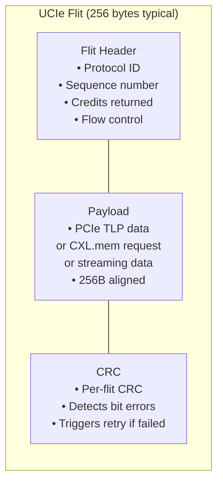

# UCIe — Universal Chiplet Interconnect Express

**Topic:** UCIe 1.1 (2023); Universal Chiplet Interconnect Express; die-to-die (D2D) interconnect; advanced and standard packaging; chiplet architecture; heterogeneous integration; multi-die SoCs  
**Standards:** UCIe 1.0 (2022), UCIe 1.1 (2023)  
**SDO:** UCIe Consortium (Intel, AMD, ARM, TSMC, Samsung, ASE, Qualcomm, Google, Meta, Microsoft)  
**Audience:** SoC architects, chiplet design engineers, advanced packaging engineers, IP designers, data center architects, AI accelerator engineers  
**Prerequisites:** Basic semiconductor packaging concepts (die, package, interposer), PCIe/CXL protocol basics, digital design fundamentals (SerDes, PHY, logic)

---

## Chapter 1 — Historical Context & Origin Story

### 1.1 Timeline

| Year | Event | Significance |
|------|-------|-------------|
| 2015 | Intel EMIB (Embedded Multi-Die Interconnect Bridge) | Early die-to-die bridge (proprietary) |
| 2017 | AMD Infinity Fabric (EPYC Zen 1) | First commercial multi-die CPU (4 chiplets → 1 package) |
| 2019 | Intel Foveros (3D stacking) | Die-on-die stacking (face-to-face; logic-on-logic) |
| 2019 | TSMC CoWoS / InFO | Advanced 2.5D/3D packaging for HPC (AMD MI100, NVIDIA A100) |
| 2020 | Intel AIB (Advanced Interface Bus) | First open chiplet interconnect (1.0; limited adoption) |
| 2022 | **UCIe 1.0** | **Industry-standard open chiplet interconnect; backed by major players** |
| 2023 | **UCIe 1.1** | Enhanced retimer support; improved latency spec; CXL.mem mapping |
| 2023 | AMD MI300X (chiplet-based) | 12 chiplets; uses proprietary D2D (validates chiplet approach) |
| 2024 | Intel Meteor Lake (chiplet architecture) | Compute + GPU + SoC + I/O chiplets (Foveros packaging) |
| 2024+ | UCIe ecosystem maturation | IP vendors (Synopsys, Cadence, Alphawave) offer UCIe PHY |

### 1.2 Why Chiplets? Why UCIe?

**Monolithic SoC problems:**

| Problem | Explanation |
|:-------:|-------------|
| **Yield** | Larger die → more defects per die → lower yield → higher cost. A 600 mm² die at 5nm has ~50% yield. Four 150 mm² chiplets: each has ~85% yield → combined: 85%⁴ = 52%, but defective chiplets discarded individually → effective yield much higher. |
| **Cost** | Advanced nodes (3nm, 2nm) cost $300-500M+ per tapeout. Not all blocks need cutting-edge: I/O, SRAM, analog can stay at older nodes (7nm, 14nm) → massive cost savings. |
| **Reuse** | Monolithic: redesign everything for each product. Chiplets: reuse I/O chiplet across multiple products (laptop, server, mobile). |
| **Heterogeneous integration** | Can't mix technologies on monolithic die (e.g., GaN power + Si logic + III-V RF). Chiplets: each die uses optimal process. |
| **Time-to-market** | Design each chiplet independently; validate separately; compose into products faster than redesigning full SoC. |

**Why UCIe (vs. proprietary D2D):**

| Proprietary D2D | UCIe Advantage |
|:---:|---|
| AMD IF (Infinity Fabric): AMD chiplets only | UCIe: any vendor's chiplet connects to any other vendor's chiplet |
| Intel EMIB/Foveros: Intel-only ecosystem | UCIe: open standard; royalty-free; industry-wide adoption |
| No interoperability between companies | UCIe: TSMC chiplet + AMD compute + Broadcom I/O on same package |
| Vendor lock-in | UCIe: chiplet marketplace possible (buy IP chiplets from different vendors) |

---

## Chapter 2 — UCIe Architecture

### 2.1 UCIe Stack

```mermaid
graph TB
    subgraph "UCIe Protocol Stack"
        PROTO[Protocol Layer<br/>━━━━━━━━━━━<br/>• PCIe 5.0/6.0 (flit-based)<br/>• CXL 2.0/3.0 (cache coherent; memory)<br/>• Streaming protocol (raw data; custom)<br/>• Protocol negotiation at link init]
        
        DIE2DIE[Die-to-Die Adapter Layer<br/>━━━━━━━━━━━<br/>• Link state management<br/>• Credit-based flow control<br/>• CRC (per-flit error detection)<br/>• Retry (ARQ for error correction)<br/>• Parameter negotiation]
        
        PHY_U[PHY Layer<br/>━━━━━━━━━━━<br/>• Standard package: bump pitch 100µm<br/>  → 16/32 Gbps per lane<br/>• Advanced package: bump pitch 25-55µm<br/>  → 4/8/12/16/32 Gbps per lane<br/>• Sideband channel (low-speed control)<br/>• Clock: forwarded or embedded]
    end
    
    PROTO --> DIE2DIE --> PHY_U
```

### 2.2 UCIe Module Structure

| Module | Standard Package | Advanced Package |
|:------:|:---:|:---:|
| **Bump pitch** | 100 µm (organic substrate) | 25-55 µm (silicon interposer / bridge) |
| **Lane width** | 16 data lanes per module | 64 data lanes per module |
| **Data rate** | 4, 8, 12, 16, **32 Gbps** per lane | 2, 4, 8, 12, **16 Gbps** per lane |
| **Module BW (32 Gbps)** | 16 × 32 = **512 Gbps/direction** = 64 GB/s | 64 × 16 = **1,024 Gbps/direction** = 128 GB/s |
| **BW density** | Lower (wider bump pitch → fewer lanes/mm) | **Higher** (~2 TB/s/mm edge reported) |
| **Reach** | Up to 25 mm (longer traces on organic substrate) | Up to 2 mm (short interposer traces) |
| **Packaging** | Organic substrate (traditional; lower cost) | Silicon interposer, EMIB, bridge (higher cost; higher density) |
| **Use case** | Disaggregated SoCs; I/O chiplets | HPC; AI; maximum bandwidth density |

### 2.3 UCIe Physical Layout

```mermaid
graph TB
    subgraph "UCIe Module (Standard Package — 16 lanes)"
        subgraph "TX Direction (Die A → Die B)"
            TX_DATA[TX Data: 16 differential pairs<br/>(32 bumps)]
            TX_CLK[TX Clock: 2 forwarded clock pairs<br/>(4 bumps)]
            TX_VALID[TX Valid: 1 signal<br/>(indicates data valid)]
            TX_TRACK[TX Track: 1 signal<br/>(training/alignment)]
        end
        
        subgraph "RX Direction (Die B → Die A)"
            RX_DATA[RX Data: 16 differential pairs<br/>(32 bumps)]
            RX_CLK[RX Clock: 2 forwarded clock pairs<br/>(4 bumps)]
            RX_VALID[RX Valid: 1 signal]
            RX_TRACK[RX Track: 1 signal]
        end
        
        SB[Sideband Channel<br/>━━━━━━━━━━━<br/>• Low-speed (up to 800 Mbps)<br/>• Link initialization<br/>• Parameter exchange<br/>• Error reporting]
    end
```

---

## Chapter 3 — UCIe PHY Specifications

### 3.1 Standard Package PHY

| Parameter | UCIe 1.0/1.1 Spec |
|:---------:|:---:|
| Bump pitch | 100 µm (minimum) |
| Data lanes per module | 16 |
| Speeds | 4 / 8 / 12 / 16 / **32 Gbps** per lane |
| Encoding | NRZ (up to 16 Gbps); **PAM4** (32 Gbps) |
| Clock | Source-synchronous (forwarded clock; 2 clock pairs per module) |
| Channel reach | Up to 25 mm |
| Module bandwidth | 16 lanes × 32 Gbps = **512 Gbps** (per direction) |
| Bidirectional BW | **1,024 Gbps (128 GB/s)** per module |
| Multi-module | Stack multiple modules for more BW (e.g., 4 modules = 2 TB/s bidir) |
| Voltage | 0.4-0.9V (low swing for power efficiency) |
| Power | ~0.5 pJ/bit (target) |

### 3.2 Advanced Package PHY

| Parameter | UCIe 1.0/1.1 Spec |
|:---------:|:---:|
| Bump pitch | 25, 36, 45, or 55 µm |
| Data lanes per module | 64 |
| Speeds | 2 / 4 / 8 / 12 / **16 Gbps** per lane |
| Encoding | NRZ (all speeds) |
| Clock | Forwarded clock |
| Channel reach | Up to 2 mm (very short interposer traces) |
| Module bandwidth | 64 lanes × 16 Gbps = **1,024 Gbps** (per direction) |
| Bidirectional BW | **2,048 Gbps (256 GB/s)** per module |
| BW density | ~1,350 Gbps/mm (at 45 µm pitch) to **~2,000 Gbps/mm** (at 25 µm pitch) |
| Power | ~0.25 pJ/bit (lower due to short channel) |

### 3.3 Speed-Encoding Matrix

| Speed | Encoding | Bits/Symbol | Standard Pkg BW (16-lane) | Advanced Pkg BW (64-lane) |
|:-----:|:--------:|:---:|:---:|:---:|
| 4 Gbps | NRZ | 1 | 64 Gbps (8 GB/s) | 256 Gbps (32 GB/s) |
| 8 Gbps | NRZ | 1 | 128 Gbps (16 GB/s) | 512 Gbps (64 GB/s) |
| 12 Gbps | NRZ | 1 | 192 Gbps (24 GB/s) | 768 Gbps (96 GB/s) |
| 16 Gbps | NRZ | 1 | 256 Gbps (32 GB/s) | 1,024 Gbps (128 GB/s) |
| **32 Gbps** | **PAM4** | **2** | **512 Gbps (64 GB/s)** | N/A (not needed; NRZ@16 sufficient) |

---

## Chapter 4 — Die-to-Die Adapter Layer

### 4.1 Adapter Functions

| Function | Description |
|:--------:|-------------|
| **Link Initialization** | Negotiate speed, width, protocol; align lanes; establish credit flow |
| **CRC** | Per-flit CRC (protects each data unit from bit errors) |
| **Retry** | If CRC fails → ARQ (Automatic Repeat Request) → retransmit corrupted flit |
| **Credit-based flow control** | Receiver advertises buffer credits → sender only sends when credits available → no overflow |
| **FDI (Flit-aware Die-to-die Interface)** | Interface between adapter and protocol layer (PCIe/CXL/Streaming) |
| **RDI (Raw Die-to-die Interface)** | Interface between adapter and PHY layer |

### 4.2 Flit Format



### 4.3 Latency

| Component | Standard Package | Advanced Package |
|:---------:|:---:|:---:|
| PHY TX | ~2 ns | ~1 ns |
| Channel (wire delay) | ~3-5 ns (25mm organic) | ~0.5 ns (2mm interposer) |
| PHY RX | ~2 ns | ~1 ns |
| Adapter (CRC + flow control) | ~5 ns | ~5 ns |
| **Total one-way** | **~12-15 ns** | **~7-8 ns** |
| Round-trip | ~25-30 ns | ~15 ns |

Compare with: PCIe Gen 5 (off-package): ~100-200 ns round-trip. UCIe is 7-10× lower latency.

---

## Chapter 5 — UCIe Protocol Support

### 5.1 Supported Protocols

| Protocol | Use Case | UCIe Mapping |
|:--------:|----------|:---:|
| **PCIe 5.0 / 6.0** | Standard I/O (storage, network, accelerators) | PCIe flits mapped directly onto UCIe adapter |
| **CXL 2.0 / 3.0** | Cache-coherent memory expansion; memory pooling | CXL.io, CXL.cache, CXL.mem over UCIe |
| **Streaming** | Raw data transfer (custom protocols; AI tensor data) | No protocol overhead; raw payload; lowest latency |
| **Custom / Proprietary** | Vendor-specific (e.g., AMD IF, Intel UPI adaptations) | Via streaming mode or vendor extensions |

### 5.2 Protocol Negotiation

```mermaid
sequenceDiagram
    participant A as Die A (Compute Chiplet)
    participant B as Die B (I/O Chiplet)
    
    Note over A,B: Link Initialization (via Sideband)
    A->>B: Sideband: "I support PCIe 6.0, CXL 3.0, Streaming"
    B->>A: Sideband: "I support PCIe 5.0, CXL 2.0"
    Note over A,B: Negotiate: highest common = PCIe 5.0 + CXL 2.0
    A->>B: Sideband: "Agreed: PCIe 5.0 + CXL 2.0 mode"
    B->>A: Sideband: "ACK; begin main link training"
    
    Note over A,B: PHY Training (lane alignment, speed negotiation)
    A->>B: Training patterns (main link)
    B->>A: Training status (sideband)
    Note over A,B: Link UP → normal data flow (PCIe/CXL flits)
```

---

## Chapter 6 — Packaging Technologies for UCIe

### 6.1 Packaging Options

```mermaid
graph TB
    subgraph "2.5D: Silicon Interposer"
        CHIP_A1[Compute Chiplet<br/>(5nm)]
        CHIP_B1[I/O Chiplet<br/>(7nm)]
        INTERP[Silicon Interposer<br/>━━━━━━━━━━━<br/>• Passive silicon with metal routing<br/>• TSVs (Through-Silicon Vias) to substrate<br/>• Very fine pitch (25-55 µm bumps)<br/>• UCIe Advanced Package]
        SUB1[Organic Substrate<br/>(BGA to PCB)]
    end
    
    CHIP_A1 --> INTERP
    CHIP_B1 --> INTERP
    INTERP --> SUB1
```

```mermaid
graph TB
    subgraph "2.5D: EMIB (Embedded Multi-Die Bridge)"
        CHIP_A2[Compute Chiplet]
        CHIP_B2[Memory/IO Chiplet]
        BRIDGE[EMIB Bridge (small Si die)<br/>━━━━━━━━━━━<br/>• Embedded in organic substrate<br/>• Only under chiplet edges (where D2D connects)<br/>• Fine-pitch routing (UCIe Advanced)]
        SUB2[Organic Substrate<br/>(rest of routing at coarser pitch)]
    end
    
    CHIP_A2 --> BRIDGE
    CHIP_B2 --> BRIDGE
    BRIDGE --> SUB2
```

### 6.2 Packaging Comparison

| Technology | Vendor(s) | Bump Pitch | UCIe Mode | BW Density | Cost | Use Case |
|:----------:|:---:|:---:|:---:|:---:|:---:|---|
| **Organic substrate** | Standard | 100+ µm | Standard Package | Lower | Low | Consumer; cost-sensitive chiplet SoCs |
| **EMIB** | Intel | 36-55 µm | Advanced Package | High | Medium | Intel products (Meteor Lake; Ponte Vecchio) |
| **CoWoS** | TSMC | 25-45 µm | Advanced Package | Very high | High | HPC; AI (AMD MI300; NVIDIA H100) |
| **InFO** | TSMC | 40-55 µm | Advanced Package | High | Medium | Mobile; cost-optimized advanced pkg |
| **Foveros (3D)** | Intel | 25-36 µm (face-to-face) | Advanced (vertical) | Highest | Highest | Logic-on-logic stacking (Meteor Lake) |
| **SoIC** | TSMC | 9-25 µm (3D) | Beyond current UCIe | Extreme | Highest | Next-gen 3D integration |

---

## Chapter 7 — Comparison: Chiplet Interconnects

| Interconnect | Type | Open/Proprietary | BW/Module | Latency | Package | Adoption |
|:---:|:---:|:---:|:---:|:---:|:---:|---|
| **UCIe 1.1** | D2D standard | **Open** | 512 Gbps (std); 1024 Gbps (adv) | 8-15 ns | Both | Growing (2024+) |
| **AMD Infinity Fabric** | D2D | Proprietary (AMD) | ~400+ Gbps (EPYC) | ~10-20 ns | Organic + CoWoS | AMD EPYC, Instinct |
| **Intel EMIB** | D2D bridge | Proprietary (Intel) | ~1 Tbps+ | ~10 ns | EMIB | Intel Ponte Vecchio, Meteor Lake |
| **Intel AIB 2.0** | D2D | Open (Intel) | 256 Gbps/module | ~10 ns | EMIB/Interposer | Limited (superseded by UCIe) |
| **BoW (Bunch of Wires)** | D2D | Open (OCP) | ~1 Tbps | ~5-10 ns | Interposer | OCP ecosystem |
| **TSMC CoWoS native** | D2D (custom) | Proprietary per customer | Very high | ~5 ns | CoWoS | NVIDIA, AMD (custom per design) |
| **HBM PHY** | Memory D2D | JEDEC (HBM3E) | 1.2 Tbps (HBM3E stack) | ~20-30 ns | 2.5D interposer | GPUs, AI (HBM stacks) |

---

## Chapter 8 — Architecture Diagrams

### 8.1 UCIe Multi-Chiplet SoC (Data Center)

```mermaid
graph TB
    subgraph "Data Center Chiplet SoC (UCIe-based)"
        subgraph "Compute Chiplets (3nm)"
            CPU1[CPU Chiplet 1<br/>━━━━━━━━━━━<br/>• 16 cores<br/>• L3 cache: 64 MB<br/>• UCIe port: 4 modules (adv)]
            CPU2[CPU Chiplet 2<br/>━━━━━━━━━━━<br/>• 16 cores<br/>• L3 cache: 64 MB<br/>• UCIe port: 4 modules (adv)]
        end
        
        subgraph "I/O Chiplet (7nm)"
            IO[I/O Chiplet<br/>━━━━━━━━━━━<br/>• PCIe Gen 5/6 × 128 lanes<br/>• CXL 3.0 controller<br/>• DDR5 memory controller × 12ch<br/>• UCIe port: connects to CPU chiplets]
        end
        
        subgraph "Accelerator Chiplet (5nm)"
            ACCEL[AI/ML Accelerator<br/>━━━━━━━━━━━<br/>• NPU / Tensor cores<br/>• Local SRAM: 256 MB<br/>• UCIe port: high-BW to CPU<br/>• CXL.cache for coherent access]
        end
        
        subgraph "Silicon Interposer"
            INTERP2[UCIe Links (Advanced Package)<br/>━━━━━━━━━━━<br/>• CPU1 ↔ IO: UCIe 4 modules<br/>  (4 × 1 Tbps = 4 Tbps bidir)<br/>• CPU2 ↔ IO: UCIe 4 modules<br/>• CPU1 ↔ ACCEL: UCIe 8 modules<br/>  (8 Tbps for AI data)<br/>• All via CXL.cache (coherent)]
        end
        
        subgraph "HBM Stacks"
            HBM1[HBM3E Stack 1<br/>1.2 TB/s; 24 GB]
            HBM2[HBM3E Stack 2<br/>1.2 TB/s; 24 GB]
        end
    end
    
    CPU1 --- INTERP2
    CPU2 --- INTERP2
    IO --- INTERP2
    ACCEL --- INTERP2
    ACCEL --- HBM1
    ACCEL --- HBM2
```

### 8.2 Consumer Chiplet SoC (Laptop)

```mermaid
graph TB
    subgraph "Laptop Chiplet SoC (UCIe Standard Package)"
        COMPUTE[Compute Tile<br/>━━━━━━━━━━━<br/>• 6P + 8E cores (3nm)<br/>• Integrated GPU<br/>• UCIe standard: 2 modules → IO tile]
        
        SOC_TILE[SoC Tile<br/>━━━━━━━━━━━<br/>• Media engine (AV1/H.265)<br/>• Display controller<br/>• USB4 / Thunderbolt<br/>• UCIe standard: 1 module → IO tile]
        
        IO_TILE[I/O Tile (6nm — older, cheaper node)<br/>━━━━━━━━━━━<br/>• PCIe Gen 4/5 lanes<br/>• DDR5/LPDDR5X controller<br/>• WiFi 7 CNVi<br/>• UCIe standard: connects to compute + SoC]
        
        BASE[Base Die / Package Substrate<br/>━━━━━━━━━━━<br/>• UCIe routing (100µm pitch)<br/>• Power delivery<br/>• Package: organic substrate (BGA)]
    end
    
    COMPUTE --- BASE
    SOC_TILE --- BASE
    IO_TILE --- BASE
```

---

## Chapter 9 — Case Studies

### 9.1 Intel Meteor Lake: First Consumer Chiplet CPU

| Aspect | Detail |
|--------|--------|
| **Product** | Intel Core Ultra (Meteor Lake) — first disaggregated laptop CPU |
| **Architecture** | 4 tiles: Compute (Intel 4; 3nm-class), GPU (TSMC 5nm), SoC (TSMC 6nm), I/O (Intel 6nm) |
| **Interconnect** | Intel Foveros packaging (3D face-to-face stacking) with EMIB bridges. Die-to-die links: proprietary (pre-UCIe; but UCIe-aligned philosophy). |
| **Why chiplets?** | (1) Compute tile uses Intel 4 (latest; best performance/watt). (2) GPU tile uses TSMC N5 (better for graphics workload). (3) I/O tile uses mature 6nm (cost-effective for analog: USB, PCIe, DDR). (4) Each tile optimized independently → better power & performance. |
| **Bandwidth** | Compute ↔ GPU: ~128 GB/s (via Foveros base die). Compute ↔ SoC: ~64 GB/s. SoC ↔ I/O: ~32 GB/s. |
| **UCIe relevance** | While Meteor Lake uses Intel's proprietary D2D, it validates the chiplet approach for consumer CPUs. Future Intel products (after 2025) expected to use UCIe for third-party chiplet interoperability. |

### 9.2 Hypothetical: UCIe Chiplet Marketplace

| Aspect | Detail |
|--------|--------|
| **Vision** | A "chiplet app store" — buy pre-validated chiplets from different vendors; compose into custom SoC |
| **Example product** | Custom automotive SoC: ARM CPU chiplet (from ARM licensee) + AI accelerator chiplet (from startup) + automotive I/O chiplet (from NXP) + safety island chiplet (from Infineon). All connected via UCIe on organic substrate. |
| **UCIe enables** | (1) Standard physical interface: any vendor's chiplet connects to any other's. (2) Standard protocols: PCIe/CXL for data movement between chiplets. (3) Interop testing: UCIe compliance suite ensures chiplets from different fabs/vendors work together. |
| **Challenges** | (1) Known Good Die (KGD): must test chiplets before assembly (can't return a defective chiplet after bonding). (2) Thermal: different chiplets have different power → thermal management complex. (3) Coherency: CXL helps but multi-vendor coherent cache design is hard. (4) Supply chain: dependencies on multiple vendors for one product. |
| **Timeline** | Early examples: 2025-2026. Broad marketplace: 2028+. Today: chiplets within single company (AMD, Intel) dominate. |

---

## Chapter 10 — Future Evolution

| Trend | Timeline | Impact |
|-------|----------|--------|
| **UCIe 2.0** | 2025-2026 | Higher speeds (64 Gbps PAM4?); 3D stacking spec; improved power management |
| **3D UCIe (vertical)** | 2025+ | Face-to-face die stacking with UCIe-defined interfaces; replace proprietary 3D links |
| **CXL 3.0 over UCIe** | 2024-2025 | Full CXL 3.0 (fabric, switch, pooling) over UCIe → disaggregated memory/compute |
| **Chiplet marketplace** | 2026-2028 | Third-party chiplets commercially available with UCIe interface (like buying IP blocks today) |
| **Photonic UCIe** | 2027+ | Optical die-to-die for longer reach (>25mm) or off-package; co-packaged optics |
| **UCIe for AI** | 2024+ | AI accelerator chiplets connected via UCIe (high-BW; low-latency tensor data) |
| **Automotive chiplet SoC** | 2026+ | ASIL-D compute + ASIL-B sensor fusion + ASIL-QM infotainment as separate chiplets; composed via UCIe |
| **UCIe compliance testing** | 2025+ | Industry compliance test suite; interop plugfests; certification program |

---

## Chapter 11 — Interview Questions & Career Guide

### Tier 1: Entry-Level

**Q1:** What is UCIe and why is it important for the semiconductor industry?

**A:** UCIe (Universal Chiplet Interconnect Express) is an open industry standard (2022) that defines how different silicon dies (chiplets) communicate with each other inside a single package.

**Why it matters:**

1. **Chiplets are the future**: Instead of making one giant monolithic chip (expensive; low yield at advanced nodes), companies now build smaller chiplets and connect them. UCIe standardizes that connection.

2. **Interoperability**: Before UCIe, each company (Intel, AMD, etc.) had proprietary die-to-die links. UCIe allows chiplets from different companies to work together — like USB standardized peripherals.

3. **Cost reduction**: I/O chiplet can be made at cheap older node (7nm); compute chiplet at expensive cutting-edge (3nm). Without UCIe, you'd put everything on 3nm (wasteful).

4. **Performance**: UCIe provides very high bandwidth (512 Gbps to 1+ Tbps per module) at very low latency (~10 ns) — much better than going off-package via PCIe.

5. **Supports key protocols**: UCIe carries PCIe (standard I/O), CXL (cache-coherent memory), or raw streaming data between chiplets.

**Analogy:** UCIe is like a "USB standard for chiplets" — it lets different pieces of silicon from different companies plug together inside a chip package.

### Tier 2: Mid-Level

**Q2:** Compare UCIe Standard Package and Advanced Package modes. When would you use each?

**A:**

| Dimension | Standard Package | Advanced Package |
|:---------:|:---:|:---:|
| **Bump pitch** | 100 µm | 25-55 µm (4× finer) |
| **Lanes per module** | 16 | 64 (4× more) |
| **Max speed/lane** | 32 Gbps (PAM4) | 16 Gbps (NRZ) |
| **BW per module** | 512 Gbps (64 GB/s) | 1,024 Gbps (128 GB/s) |
| **BW density** | ~500 Gbps/mm edge | **~2,000 Gbps/mm edge** |
| **Channel reach** | Up to 25 mm | Up to 2 mm |
| **Substrate** | Organic (standard PCB-like) | Silicon interposer or bridge (EMIB/CoWoS) |
| **Cost** | **Lower** (standard packaging) | Higher (Si interposer adds process steps + cost) |
| **Power/bit** | ~0.5 pJ/bit | **~0.25 pJ/bit** (shorter wires → less energy) |
| **Latency** | ~12-15 ns one-way | **~7-8 ns one-way** |

**When to use Standard Package:**
- Consumer products (laptop, desktop CPU) where cost matters
- When chiplets are physically larger (traces between them can be longer)
- I/O disaggregation (I/O chiplet doesn't need extreme BW to compute tile)
- Products where organic substrate is sufficient

**When to use Advanced Package:**
- Data center / HPC / AI chips needing maximum bandwidth (>1 Tbps between chiplets)
- GPU ↔ HBM connectivity (already on interposer; add UCIe between compute chiplets)
- When multiple chiplets on same interposer (short distances; <2 mm traces)
- Performance-critical: cache coherent multi-die where latency must be minimized
- AMD EPYC, Intel Ponte Vecchio, custom AI accelerators

### Tier 3: Senior

**Q3:** Architect a UCIe-based AI training accelerator with 8 compute chiplets and 8 HBM3E stacks. Define the UCIe configuration, protocol selection, bandwidth allocation, and thermal/power design.

**A:**

**System requirements:**

| Parameter | Target |
|:---------:|--------|
| Total compute | 8 × 128 TFLOPS = 1 PFLOPS (BF16) |
| Total memory | 8 × 24 GB HBM3E = 192 GB |
| Memory BW | 8 × 1.2 TB/s = 9.6 TB/s (aggregate to all compute) |
| Chiplet-to-chiplet BW | Each compute needs to communicate with neighbors for all-reduce | ~2 TB/s per chiplet pair |
| Package | CoWoS (2.5D; silicon interposer) |
| Power budget | 700W TDP |

**UCIe configuration:**

| Link | Type | Config | BW (bidir) |
|:----:|:----:|:------:|:---:|
| Compute ↔ Compute (neighbor) | UCIe Advanced | 8 modules × 16 Gbps × 64 lanes | 8 × 2,048 Gbps = **16 Tbps** per pair |
| Compute ↔ HBM | HBM3E PHY (JEDEC; not UCIe) | Standard HBM stack interface | 1.2 TB/s per stack |
| Compute ↔ Host I/O chiplet | UCIe Advanced | 4 modules | 4 × 2,048 = 8 Tbps |
| I/O chiplet ↔ PCIe/CXL | PCIe 6.0 off-package | 64 lanes × 64 Gbps | 512 GB/s to host |

**Protocol selection:**

| Traffic | Protocol | Rationale |
|:-------:|:--------:|-----------|
| Compute ↔ Compute (tensor data) | **Streaming** | Raw data; no protocol overhead; lowest latency; custom all-reduce hardware |
| Compute ↔ I/O (host communication) | **CXL 3.0** | Cache-coherent memory access from host; PCIe for control |
| Compute ↔ HBM | **HBM PHY** (not UCIe) | JEDEC-defined; highest density for memory |
| I/O ↔ Network (off-package) | **PCIe 6.0** | Standard host interface; 64 GT/s × 64 lanes |

**Chiplet layout on interposer:**

```
[HBM][COMPUTE 1][HBM]  [HBM][COMPUTE 2][HBM]
      UCIe ↕                   UCIe ↕
[HBM][COMPUTE 3][HBM]  [HBM][COMPUTE 4][HBM]
      UCIe ↕                   UCIe ↕
[HBM][COMPUTE 5][HBM]  [HBM][COMPUTE 6][HBM]
      UCIe ↕                   UCIe ↕
[HBM][COMPUTE 7][HBM]  [HBM][COMPUTE 8][HBM]
                    ↕
              [I/O CHIPLET]
              (PCIe/CXL to host)
```

Each compute chiplet has UCIe links to 2-4 neighbors (2D mesh topology). This enables efficient all-reduce patterns without going off-package.

**Thermal design:**

| Challenge | Solution |
|:---------:|---------|
| 700W in ~100 cm² package area | Liquid cooling (cold plate directly on chiplets) |
| Uneven heat: compute chiplets ~60W each; HBM ~10W each | Vapor chamber + targeted liquid flow to hottest chiplets |
| Interposer thermal resistance | TSVs in interposer double as thermal conduits |
| UCIe links add heat (PHY power) | ~0.25 pJ/bit × 16 Tbps = 4W per UCIe pair → manageable |

**Power breakdown:**

| Component | Power |
|:---------:|:-----:|
| 8 × Compute chiplets (cores + SRAM) | 480W |
| 8 × HBM3E stacks | 80W |
| UCIe PHYs (all links) | 40W |
| I/O chiplet (PCIe/CXL) | 60W |
| Misc (PLL, sideband, control) | 40W |
| **Total** | **700W** |

---

## Chapter 12 — Cheat Sheet & Quick Reference

```
═══════════════════════════════════════════
UCIe — QUICK REFERENCE
═══════════════════════════════════════════

BASICS:
  What: Open standard for die-to-die (D2D) chiplet interconnect
  Who: UCIe Consortium (Intel, AMD, ARM, TSMC, Samsung, etc.)
  Version: UCIe 1.0 (2022); UCIe 1.1 (2023)
  Purpose: Standard interface so chiplets from different vendors
           can connect inside same package

═══════════════════════════════════════════
STANDARD PACKAGE:
  Bump pitch: 100 µm (organic substrate)
  Lanes/module: 16 data lanes
  Speed: up to 32 Gbps (PAM4)
  BW/module: 512 Gbps per direction (64 GB/s)
  Reach: up to 25 mm
  Power: ~0.5 pJ/bit
  Use: Consumer; laptop; cost-sensitive

═══════════════════════════════════════════
ADVANCED PACKAGE:
  Bump pitch: 25-55 µm (Si interposer / bridge)
  Lanes/module: 64 data lanes
  Speed: up to 16 Gbps (NRZ)
  BW/module: 1,024 Gbps per direction (128 GB/s)
  Reach: up to 2 mm
  Power: ~0.25 pJ/bit
  BW density: ~2 TB/s per mm edge
  Use: Data center; AI; HPC; max bandwidth

═══════════════════════════════════════════
PROTOCOL STACK:
  Layer 3: Protocol (PCIe 5/6; CXL 2/3; Streaming)
  Layer 2: Die-to-Die Adapter (CRC; Retry; Flow Control)
  Layer 1: PHY (differential lanes; clock; sideband)

═══════════════════════════════════════════
PROTOCOLS SUPPORTED:
  PCIe 5.0/6.0: Standard I/O between chiplets
  CXL 2.0/3.0: Cache-coherent memory access; pooling
  Streaming: Raw data; lowest latency; custom protocols

═══════════════════════════════════════════
LATENCY:
  Standard Package: ~12-15 ns one-way
  Advanced Package: ~7-8 ns one-way
  Compare: off-package PCIe → 100-200 ns (10-20× worse)

═══════════════════════════════════════════
WHY CHIPLETS:
  □ Yield: smaller dies → higher yield → lower cost
  □ Heterogeneous: each chiplet on optimal node
  □ Reuse: I/O chiplet shared across products
  □ Cost: not everything needs 3nm ($500M tapeout)
  □ Time: design chiplets independently; faster TTM

═══════════════════════════════════════════
PACKAGING:
  Organic substrate: standard pkg; 100µm pitch; lower cost
  EMIB (Intel): Si bridge embedded in organic; medium cost
  CoWoS (TSMC): full Si interposer; highest BW; high cost
  Foveros (Intel): 3D stacking (face-to-face); highest density
  SoIC (TSMC): 3D ultra-fine pitch (9µm); future

═══════════════════════════════════════════
KEY NUMBERS:
  Max BW/module (adv): 1,024 Gbps = 128 GB/s
  BW density (25µm pitch): ~2 TB/s/mm
  Latency (adv): ~8 ns one-way (7-10× better than PCIe off-pkg)
  Power: 0.25-0.5 pJ/bit (10× better than off-pkg SerDes)
```

---

*End of Document — 07_UCIe_Chiplet_Interconnect.md*
