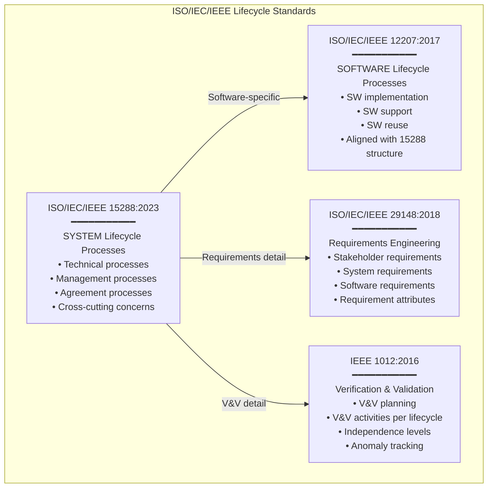

# Systems Engineering & MBSE — Category Overview

**Category:** 21 — Systems Engineering & MBSE  
**Mega-Domain:** 8 — Software Quality & DevOps  
**Scope:** ISO/IEC/IEEE 15288 system lifecycle, ISO/IEC/IEEE 12207 software lifecycle, SysML v2, V-Model development, INCOSE SE Handbook, MBSE methodologies, requirements engineering, architecture frameworks  
**Target Audience:** Systems engineers, MBSE practitioners, requirements engineers, system architects, V&V engineers, project managers, functional safety engineers

---

## Category Structure

| Doc # | Title | Standards/Topics |
|:-----:|-------|-----------------|
| 00 | Systems Engineering Overview (this document) | Landscape; discipline map; relationships |
| 01 | ISO/IEC/IEEE 15288 — System Lifecycle Processes | Technical, management, agreement processes |
| 02 | ISO/IEC/IEEE 12207 — Software Lifecycle Processes | SW-specific processes; relationship to 15288 |
| 03 | SysML v2 — Systems Modeling Language | KerML; SysML v2 diagrams; comparison to v1 |
| 04 | MBSE Tools & Methodologies | Capella/Arcadia, Rhapsody, MagicDraw, Modelica |
| 05 | V-Model Development Lifecycle | Classical V; automotive V; ASPICE V; Agile+V |
| 06 | Requirements Engineering | ISO 29148; DOORS; traceability; quality attributes |
| 07 | Architecture Frameworks | DoDAF, TOGAF, ArchiMate, NAF, Zachman |
| 08 | Safety Methods in SE | FHA, PSSA, SSA, CCA; interface to ISO 26262/DO-178C |
| 09 | NASA SE Handbook | NASA SP-2007-6105 Rev2; space mission lifecycle |
| 10 | INCOSE SE Handbook | Process areas; specialty disciplines; SE competencies |

---

## The Systems Engineering Discipline

### What Is Systems Engineering?

> **Systems Engineering** is an interdisciplinary approach and means to enable the realization of successful systems. It focuses on defining customer needs and required functionality early in the development cycle, documenting requirements, then proceeding with design synthesis and system validation while considering the complete problem: operations, cost, schedule, performance, training, support, and disposal.
>
> — INCOSE Definition

### Core Principles

| Principle | Description |
|:---------:|-------------|
| **Holistic perspective** | Address the whole system (not just individual components) |
| **Lifecycle thinking** | From concept through disposal; decisions made early affect entire lifecycle |
| **Requirements-driven** | Requirements trace from stakeholder needs → system → subsystem → component |
| **Architecture-centric** | Architecture defines system structure; interfaces; allocation of function |
| **Verification & Validation** | V&V at every level: unit → integration → system → acceptance |
| **Iterative refinement** | Progressive elaboration as understanding grows |
| **Trade-off analysis** | Balance competing concerns (performance vs. cost vs. schedule vs. safety) |
| **Configuration management** | Control baselines; track changes; maintain traceability |

---

## Standards Landscape

### 1. Lifecycle Standards (Process-Oriented)



### 2. MBSE Standards & Tools

```mermaid
graph TB
    subgraph "MBSE Ecosystem"
        SYSML[SysML v2 (OMG, 2024)<br/>━━━━━━━━━━━<br/>• KerML (Kernel Modeling Language)<br/>• SysML built on KerML<br/>• Structured expressions<br/>• API-first (standardized model access)]
        
        subgraph "MBSE Methodologies"
            ARCADIA[Arcadia (Thales)<br/>• Operational Analysis<br/>• System/Logical/Physical Analysis<br/>• Tool: Capella]
            HARMONY[Harmony SE (IBM)<br/>• Requirements analysis<br/>• Functional analysis<br/>• Design synthesis<br/>• Tool: Rhapsody]
            MAGICDRAW[MagicDraw/Cameo (Dassault)<br/>• SysML v1/v2 modeling<br/>• UPDM/DoDAF profiles]
        end
        
        subgraph "Simulation & Analysis"
            MODELICA[Modelica<br/>• Physical system simulation<br/>• Multi-domain (mechanical,<br/>  electrical, thermal, hydraulic)]
            MATLAB[MATLAB/Simulink<br/>• Control system design<br/>• Model-In-the-Loop (MIL)<br/>• Code generation]
        end
    end
    
    SYSML --> ARCADIA
    SYSML --> HARMONY
    SYSML --> MAGICDRAW
```

### 3. Architecture Frameworks

| Framework | Domain | Focus |
|:---------:|:------:|-------|
| **DoDAF v2.02** | US Defense | Operational, system, services viewpoints; decision-support |
| **TOGAF 10** | Enterprise IT | Architecture Development Method (ADM); metamodel |
| **ArchiMate 3.2** | Enterprise | Business, application, technology layers; modeling language |
| **NAF v4** | NATO/Multi-national | Interoperability; alliance architecture |
| **MODAF** | UK Defence | British adaptation of DoDAF |
| **Zachman** | Universal | Who/What/Where/When/Why/How × 6 perspectives |
| **SAF (System Architecture Framework)** | Systems | Functional, logical, physical viewpoints (academic) |

### 4. SE Body of Knowledge

| Reference | Organization | Scope |
|:---------:|:---:|---|
| **INCOSE SE Handbook v4** | INCOSE | Comprehensive SE processes; specialty disciplines; competency model |
| **SEBoK** (Systems Engineering Body of Knowledge) | BKCASE/INCOSE | Wiki-based living reference; systems fundamentals; applications |
| **NASA SE Handbook** (SP-2007-6105 Rev2) | NASA | Space system lifecycle; NPR 7123.1 compliance |
| **ECSS standards** (European Cooperation for Space Standardization) | ESA | European space SE standards |
| **Defense Acquisition Guidebook** | US DoD | Acquisition lifecycle; Adaptive Acquisition Framework (AAF) |

---

## Systems Engineering in Industry Domains

| Domain | SE Approach | Key Standards | Tools |
|:------:|:-----------:|:---:|:---:|
| **Automotive** | V-model + ASPICE; ISO 26262 safety; MBSE growing | ISO 15288, ASPICE, ISO 26262 | DOORS, Polarion, Enterprise Architect |
| **Aerospace** | Rigorous V-model; DO-178C/254; safety-critical | SAE ARP4754A, DO-178C, NASA SE HB | DOORS, Rhapsody, Cameo, Windchill |
| **Defense** | DoDAF architecture; MIL-STD lifecycle; formal methods | DoDAF, MIL-STD-882E, IEEE 15288 | Rhapsody, MagicDraw, DOORS |
| **Space** | NASA/ESA lifecycle; ultra-high reliability; long timelines | NASA NPR 7123.1, ECSS-E-ST-10C | DOORS, Capella, Modelica, Simulink |
| **Rail** | EN 50126/50128/50129; CENELEC lifecycle | EN 50126 (RAMS), ISO 15288 | DOORS, Enterprise Architect |
| **Medical** | IEC 62304 (SW lifecycle); ISO 14971 (risk) | IEC 62304, ISO 13485, ISO 15288 | DOORS, Jama, Polarion |
| **Telecom** | TOGAF enterprise; network lifecycle | ISO 15288, TOGAF, TMForum | ArchiMate, Enterprise Architect |
| **Industrial** | IEC 61508 functional safety; machinery directive | IEC 61508, ISO 15288 | DOORS, Enterprise Architect |

---

## V-Model Overview

```mermaid
graph TB
    subgraph "V-Model Development Lifecycle"
        REQ[Stakeholder Requirements<br/>& Concept Definition]
        SYS_REQ[System Requirements<br/>& Architecture]
        SUB_REQ[Subsystem/SW/HW<br/>Requirements & Design]
        DETAIL[Detailed Design &<br/>Implementation]
        
        UNIT_T[Unit Testing &<br/>Code Review]
        INT_T[Integration Testing<br/>(Subsystem level)]
        SYS_T[System Testing<br/>(System level)]
        ACC_T[Acceptance Testing &<br/>Validation]
    end
    
    REQ -->|"Decomposition"| SYS_REQ -->|"Decomposition"| SUB_REQ -->|"Decomposition"| DETAIL
    DETAIL -->|"Build & Test"| UNIT_T -->|"Integrate"| INT_T -->|"System qualify"| SYS_T -->|"Customer validate"| ACC_T
    
    REQ -.->|"Validates against"| ACC_T
    SYS_REQ -.->|"Verifies against"| SYS_T
    SUB_REQ -.->|"Verifies against"| INT_T
    DETAIL -.->|"Verifies against"| UNIT_T
```

**Key insight:** The left side DECOMPOSES (top-down); the right side INTEGRATES and VERIFIES (bottom-up). Each level on the left has a corresponding test level on the right that verifies the artifacts produced on the left.

---

## MBSE vs. Document-Based SE

| Aspect | Document-Based SE (Traditional) | MBSE (Model-Based) |
|:------:|:---:|:---:|
| **Artifacts** | Word docs, Excel, PowerPoint, PDF | Models (SysML, Capella, Modelica) |
| **Consistency** | Manual checking; inconsistencies common | **Automated**: model rules catch inconsistencies |
| **Traceability** | Manual links (DOORS ↔ documents) | **Built into model**: requirements → functions → components → tests |
| **Analysis** | Manual (or external tools; disconnected) | **Executable models**: simulation; trade analysis; what-if |
| **Communication** | Different views as separate documents; version conflicts | **Single source of truth**: model generates views |
| **Change impact** | Hard to assess (search through documents) | **Automated impact analysis** (model knows all connections) |
| **Reuse** | Copy-paste (error-prone; stale copies) | **Model libraries** (parameterized reusable elements) |
| **Collaboration** | Document review cycles; merge conflicts | **Concurrent modeling** (branching/merging in model repository) |
| **Adoption** | Universal (everyone knows documents) | Growing (requires training; tool investment; culture change) |
| **When to use** | Simple systems; small teams; low criticality | Complex systems; large teams; safety-critical; long lifecycle |

---

## Cross-Document Relationships

```mermaid
graph LR
    D00[00: Overview<br/>(this doc)] --> D01[01: ISO 15288]
    D00 --> D02[02: ISO 12207]
    D00 --> D05[05: V-Model]
    
    D01 -->|"Software processes"| D02
    D01 -->|"Requirements processes"| D06[06: Requirements Eng]
    D01 -->|"Architecture processes"| D07[07: Architecture FW]
    D01 -->|"Safety integration"| D08[08: Safety Methods]
    
    D03[03: SysML v2] --> D04[04: MBSE Tools]
    D04 -->|"Implements"| D01
    
    D05 -->|"Lifecycle model for"| D01
    D05 -->|"NASA application"| D09[09: NASA SE HB]
    
    D10[10: INCOSE SE HB] -->|"Interprets"| D01
    D10 -->|"References"| D05
    D10 -->|"Uses"| D03
```

---

## Key Terminology

| Term | Definition |
|:----:|------------|
| **System** | Combination of interacting elements organized to achieve stated purposes (ISO 15288) |
| **System of Interest (SOI)** | The system being analyzed/designed (vs. enabling systems) |
| **System Element** | A component of the system; can be hardware, software, human, procedure, facility |
| **Lifecycle Model** | Framework of processes and activities for system lifecycle (e.g., V-model, iterative, incremental) |
| **Stakeholder** | Individual or organization having a right, share, or interest in a system |
| **Requirement** | Statement that translates or expresses a need and its associated constraints and conditions |
| **Architecture** | Fundamental concepts of a system in its environment embodied in its elements, relationships, principles |
| **Verification** | Confirmation through evidence that specified requirements have been fulfilled ("built it right") |
| **Validation** | Confirmation through evidence that the system fulfills its intended use ("built the right thing") |
| **MBSE** | Formalized application of modeling to support systems requirements, design, analysis, V&V |
| **SysML** | Systems Modeling Language (OMG standard); extends UML for SE |
| **Traceability** | Ability to trace requirement → design → implementation → test (and back) |
| **Baseline** | Approved set of configuration items at a point in time |
| **Configuration Item (CI)** | Entity designated for configuration management (document, code, hardware, model element) |

---

## Industry Adoption Status (2024)

| Technology/Standard | Adoption Level | Trend |
|:---:|:---:|:---:|
| ISO/IEC/IEEE 15288 | ★★★★☆ (High in defense/aerospace; growing elsewhere) | Stable |
| ISO/IEC/IEEE 12207 | ★★★★★ (Universal for SW development) | Stable |
| V-Model | ★★★★★ (Dominant in safety-critical domains) | Evolving (V+Agile hybrid) |
| ASPICE | ★★★★★ (Mandatory in automotive) | Growing (global adoption) |
| SysML v1.x | ★★★☆☆ (Aerospace/defense; limited elsewhere) | Declining (→ v2) |
| SysML v2 | ★☆☆☆☆ (Just adopted; early tools) | **Rapidly growing** |
| MBSE (any tool/method) | ★★★☆☆ (Aerospace/defense lead; automotive catching up) | **Strong growth** |
| Capella/Arcadia | ★★★☆☆ (Growing; open source advantage) | **Strong growth** |
| DOORS | ★★★★★ (De facto for requirements in safety-critical) | Stable (market leader) |
| TOGAF/ArchiMate | ★★★★☆ (Enterprise IT) | Stable |
| DoDAF | ★★★★☆ (US defense; required for DoD programs) | Stable |
| Digital Twin (SE context) | ★★☆☆☆ (Emerging) | **Rapid growth** |

---

## Quick Reference: Which Standard for What?

```
QUESTION                                    → STANDARD/REFERENCE
════════════════════════════════════════════════════════════════
"How do I structure my system lifecycle?"   → ISO/IEC/IEEE 15288
"How do I structure my SW lifecycle?"       → ISO/IEC/IEEE 12207
"How do I write good requirements?"         → ISO/IEC/IEEE 29148
"How do I model my system (diagrams)?"      → SysML v2 (or v1.6)
"How do I organize my V&V activities?"      → IEEE 1012
"How do I do MBSE?"                         → Capella/Arcadia or Harmony SE
"What's the V-model for automotive?"        → ASPICE (Automotive SPICE)
"How do I architect enterprise systems?"    → TOGAF + ArchiMate
"How do I do defense architecture?"         → DoDAF v2.02 (US) / NAF v4 (NATO)
"How do NASA/ESA do SE?"                    → NASA SE Handbook / ECSS
"What competencies does an SE need?"        → INCOSE SE Handbook v4
"How do I integrate safety into SE?"        → ARP4754A (aero) / ISO 26262 (auto)
"How do I manage requirements?"             → DOORS (IBM) / Polarion (Siemens)
"How do I simulate physical systems?"       → Modelica / Simulink
```

---

*End of Document — 00_Systems_Engineering_Overview.md*
