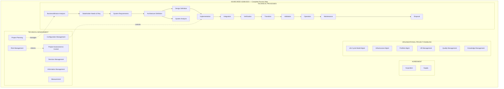
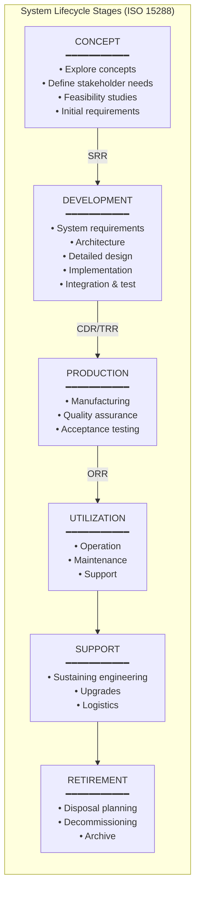

# ISO/IEC/IEEE 15288:2023 — System Lifecycle Processes

**Standard:** ISO/IEC/IEEE 15288:2023 — Systems and Software Engineering — System Life Cycle Processes  
**SDO:** ISO (International Organization for Standardization), IEC (International Electrotechnical Commission), IEEE  
**Version:** 2023 (4th edition; supersedes 2015)  
**Audience:** Systems engineers, project managers, quality engineers, process improvement professionals, auditors  
**Prerequisites:** General understanding of system development concepts; familiarity with engineering lifecycle models

---

## Chapter 1 — Historical Context & Origin Story

### 1.1 Evolution Timeline

| Year | Milestone |
|------|-----------|
| 1969 | Apollo 11 success demonstrates importance of systems engineering processes |
| 1988 | IEEE 1220 — Standard for Application and Management of the Systems Engineering Process |
| 1994 | EIA-632 — Processes for Engineering a System (US defense/industry) |
| 1998 | ISO/IEC 15288 development initiated (harmonize IEEE 1220, EIA-632, MIL-STD-499B) |
| 2002 | **ISO/IEC 15288:2002** — 1st edition: System Life Cycle Processes (25 processes; 4 groups) |
| 2005 | ISO/IEC 15288:2005 Amendment 1 |
| 2008 | **ISO/IEC/IEEE 15288:2008** — 2nd edition: brought under joint ISO/IEC/IEEE sponsorship |
| 2015 | **ISO/IEC/IEEE 15288:2015** — 3rd edition: restructured into 4 process groups; 30 processes; harmonized with 12207:2017 |
| 2017 | ISO/IEC/IEEE 12207:2017 published (companion standard; aligned structure) |
| 2023 | **ISO/IEC/IEEE 15288:2023** — 4th edition (current): refined clauses; improved annex guidance; sustainability considerations |

### 1.2 Motivation

**Problem (pre-2002):**
- Multiple competing standards for system lifecycle (IEEE 1220, EIA-632, MIL-STD-499)
- Each industry (defense, telecom, aerospace) had its own interpretation
- No international consensus on what "good systems engineering" looks like
- Difficulty comparing process maturity across organizations

**Solution:**
- ISO/IEC/IEEE 15288: single international standard defining a common framework of processes
- Process-based approach: defines WHAT to do (processes), not HOW (methods/tools are organization's choice)
- Applicable to any system: hardware, software, human, service, enterprise
- Scalable: from small embedded systems to large defense programs

### 1.3 Relationship to Other Standards

```mermaid
graph TB
    subgraph "ISO/IEC/IEEE 15288 Context"
        ISO15288[ISO/IEC/IEEE 15288:2023<br/>━━━━━━━━━━━<br/>SYSTEM Life Cycle Processes<br/>(master standard)]
        
        ISO12207[ISO/IEC/IEEE 12207:2017<br/>━━━━━━━━━━━<br/>SOFTWARE Life Cycle Processes<br/>(aligned companion)]
        
        ISO29148[ISO/IEC/IEEE 29148:2018<br/>━━━━━━━━━━━<br/>Requirements Engineering<br/>(detailed requirements guidance)]
        
        ISO33001[ISO/IEC 33001-33099<br/>━━━━━━━━━━━<br/>Process Assessment<br/>(SPICE family)]
        
        IEEE1012[IEEE 1012:2016<br/>━━━━━━━━━━━<br/>V&V Standard]
        
        INCOSE[INCOSE SE Handbook v4<br/>━━━━━━━━━━━<br/>Interpretation & guidance]
        
        ASPICE[Automotive SPICE<br/>━━━━━━━━━━━<br/>Automotive process assessment<br/>(based on 15288/12207)]
    end
    
    ISO15288 -->|"Software-specific processes"| ISO12207
    ISO15288 -->|"Requirements detail"| ISO29148
    ISO15288 -->|"Assess process capability"| ISO33001
    ISO15288 -->|"V&V activities"| IEEE1012
    ISO15288 -->|"Guidance/interpretation"| INCOSE
    ISO15288 -->|"Automotive tailoring"| ASPICE
```

---

## Chapter 2 — Standard Architecture & Structure

### 2.1 Document Structure

| Clause | Title | Content |
|:------:|-------|---------|
| 1 | Scope | Applicability; system types |
| 2 | Normative references | ISO/IEC/IEEE 12207; other referenced standards |
| 3 | Terms and definitions | 70+ defined terms |
| 4 | Key concepts | System; lifecycle model; process; organization; project |
| 5 | **Process groups** (core content) | Agreement, Organizational, Technical, Cross-cutting |
| 6 | Tailoring | How to adapt processes to specific context |
| Annexes | Guidance | Application guidance; process relationships; tailoring examples |

### 2.2 Process Groups (ISO/IEC/IEEE 15288:2023)

```mermaid
graph TB
    subgraph "ISO/IEC/IEEE 15288:2023 — Process Groups"
        subgraph "1. AGREEMENT PROCESSES"
            ACQ[Acquisition Process<br/>• Establish agreement with supplier<br/>• Monitor supplier performance]
            SUP[Supply Process<br/>• Respond to acquisition requests<br/>• Deliver system/service]
        end
        
        subgraph "2. ORGANIZATIONAL PROJECT-ENABLING PROCESSES"
            LCM[Life Cycle Model Management<br/>• Define lifecycle models<br/>• Establish processes for projects]
            INF[Infrastructure Management<br/>• Provide enabling infrastructure<br/>  (tools, facilities, IT)]
            PM[Portfolio Management<br/>• Prioritize projects<br/>• Allocate resources]
            HR[Human Resource Management<br/>• Develop and maintain competencies]
            QM[Quality Management<br/>• Assure quality objectives met]
            KM[Knowledge Management<br/>• Capture and share knowledge]
        end
        
        subgraph "3. TECHNICAL MANAGEMENT PROCESSES"
            PLAN[Project Planning<br/>• WBS; schedule; cost; risk]
            CTRL[Project Assessment & Control<br/>• Monitor; corrective action]
            DM[Decision Management<br/>• Trade-off analysis; selection]
            RM[Risk Management<br/>• Identify; assess; treat risks]
            CM[Configuration Management<br/>• Baselines; change control; status accounting]
            IM[Information Management<br/>• Manage info items (documents, models)]
            MEAS[Measurement<br/>• Define and collect metrics]
        end
        
        subgraph "4. TECHNICAL PROCESSES"
            BA[Business/Mission Analysis<br/>• Problem/opportunity definition<br/>• Business requirements]
            SN[Stakeholder Needs & Req Definition<br/>• Elicit stakeholder needs<br/>• Transform into requirements]
            SR[System Requirements Definition<br/>• Specify system requirements<br/>• Attributes; constraints]
            ARCH[Architecture Definition<br/>• Generate architecture candidates<br/>• Select; document architecture]
            DES[Design Definition<br/>• Detailed design of system elements]
            IMPL[Implementation<br/>• Realize system elements<br/>  (code, fabricate, procure)]
            INT[Integration<br/>• Assemble system elements<br/>• Interface verification]
            VER[Verification<br/>• Confirm compliance with requirements]
            TRANS[Transition<br/>• Deploy into operational environment]
            VAL[Validation<br/>• Confirm system satisfies stakeholder needs]
            OPS[Operation<br/>• Use system; monitoring; sustaining]
            MAINT[Maintenance<br/>• Corrective, adaptive, perfective maintenance]
            DISP[Disposal<br/>• Decommission; dispose responsibly]
        end
    end
```

### 2.3 Process Description Template

Every process in 15288 is described with this structure:

| Element | Description | Example (Verification Process) |
|:-------:|-------------|-------------------------------|
| **Title** | Process name | Verification |
| **Purpose** | What the process achieves | Provide objective evidence that system fulfills requirements |
| **Outcomes** | Observable results when successfully performed | 1. Verification strategy defined. 2. Constraints identified. 3. Verification performed. 4. Results recorded. 5. Evidence provided. |
| **Activities** | Groups of related actions | Plan verification; Conduct verification; Manage results |
| **Tasks** | Specific actions within activities | Select verification methods (test, inspection, analysis, demonstration) |
| **Information items** | Inputs/outputs | Verification plan (input/output); Verification report (output); Test procedures (output) |

---

## Chapter 3 — Technical Processes Deep Dive

### 3.1 The 13 Technical Processes

| # | Process | Purpose | Key Outputs |
|:-:|---------|---------|-------------|
| 1 | Business/Mission Analysis | Define problem space; identify opportunities | Business requirements; Concept of Operations (ConOps) |
| 2 | Stakeholder Needs & Requirements Definition | Elicit needs; express as requirements | Stakeholder requirements specification |
| 3 | System Requirements Definition | Transform stakeholder needs → system requirements | System requirements specification (SyRS) |
| 4 | Architecture Definition | Create architecture; allocate requirements | Architecture description; Interface definitions |
| 5 | Design Definition | Refine architecture → detailed design | Design documentation; Interface control documents |
| 6 | System Analysis | Provide rigorous basis for technical decisions | Analysis reports; trade study results |
| 7 | Implementation | Build/code/fabricate system elements | Implemented system elements (code, HW, etc.) |
| 8 | Integration | Assemble elements; verify interfaces | Integrated system; Integration test reports |
| 9 | Verification | Confirm requirements satisfaction | Verification reports; Test results |
| 10 | Transition | Install/deploy in operational environment | Deployed system; Training materials |
| 11 | Validation | Confirm stakeholder satisfaction | Validation reports; User acceptance |
| 12 | Operation | Use system; sustain capability | Operational data; Performance metrics |
| 13 | Maintenance | Sustain; modify; improve | Modified system; Maintenance records |
| 14 | Disposal | Decommission responsibly | Disposal plan; Environmental compliance |

### 3.2 Requirements Flow (Processes 1→2→3→4)

```mermaid
graph LR
    subgraph "Requirements Engineering Chain"
        BMA[Business/Mission Analysis<br/>━━━━━━━━━━━<br/>• Problem/opportunity space<br/>• Business constraints<br/>• Mission objectives<br/>━━━━━━━━━━━<br/>OUTPUT: Business Requirements<br/>(BRD; ConOps)]
        
        SNR[Stakeholder Needs & Req<br/>━━━━━━━━━━━<br/>• Elicit from all stakeholders<br/>  (users, operators, regulators,<br/>   maintainers, disposal agents)<br/>• Priority; rationale<br/>━━━━━━━━━━━<br/>OUTPUT: Stakeholder Req Spec<br/>(StRS)]
        
        SRD[System Requirements Definition<br/>━━━━━━━━━━━<br/>• Transform stakeholder needs<br/>  into system-level requirements<br/>• Functional + non-functional<br/>• Constraints; interfaces<br/>━━━━━━━━━━━<br/>OUTPUT: System Req Spec<br/>(SyRS)]
        
        ARD[Architecture Definition<br/>━━━━━━━━━━━<br/>• Generate architecture alternatives<br/>• Evaluate (trade studies)<br/>• Select; allocate requirements<br/>  to architecture elements<br/>━━━━━━━━━━━<br/>OUTPUT: Architecture Description<br/>(AD; ISO 42010)]
    end
    
    BMA -->|"Refine"| SNR -->|"Transform"| SRD -->|"Allocate"| ARD
```

### 3.3 Verification vs. Validation

| Aspect | Verification | Validation |
|:------:|:---:|:---:|
| **Question** | "Did we build the system **right**?" | "Did we build the **right** system?" |
| **Checks against** | System requirements specification | Stakeholder needs |
| **Methods** | Test, inspection, analysis, demonstration | User trials, operational scenarios, simulation |
| **When** | Throughout development (each level) | At system level (when complete) and during operation |
| **Performed by** | Engineering team; independent V&V | Stakeholders; end users; customer |
| **ISO 15288 process** | Process 9: Verification | Process 11: Validation |
| **Failure means** | Implementation doesn't match specification | System doesn't meet real-world needs (even if it meets spec) |

---

## Chapter 4 — Technical Management Processes

### 4.1 Process Overview

| Process | Purpose | Key Activities |
|:-------:|---------|---------------|
| **Project Planning** | Establish feasible plans | WBS; schedule; resource estimation; risk planning |
| **Project Assessment & Control** | Monitor and control execution | Earned value; milestone reviews; corrective action |
| **Decision Management** | Resolve decisions systematically | Trade studies; Pugh matrix; AHP; decision logging |
| **Risk Management** | Handle uncertainties | Risk identification → Assessment → Mitigation → Monitoring |
| **Configuration Management** | Control baselines | Configuration identification; Change control; Status accounting; Audit |
| **Information Management** | Control information items | Document management; model management; access control |
| **Measurement** | Provide quantitative insight | Define measures; collect; analyze; report |

### 4.2 Configuration Management Detail

```mermaid
graph TB
    subgraph "Configuration Management (CM)"
        CI_ID[Configuration Identification<br/>━━━━━━━━━━━<br/>• Identify CIs (config items)<br/>• Assign unique identifiers<br/>• Establish baselines:<br/>  − Functional baseline (requirements)<br/>  − Allocated baseline (design)<br/>  − Product baseline (as-built)]
        
        CC[Change Control<br/>━━━━━━━━━━━<br/>• Change Request (CR) process<br/>• Impact analysis<br/>• CCB (Configuration Control Board)<br/>  review and approve/reject<br/>• Implement approved changes]
        
        CSA[Configuration Status Accounting<br/>━━━━━━━━━━━<br/>• Record and report CI status<br/>• Track versions and changes<br/>• Traceability (which baseline;<br/>  what changed; when; why)]
        
        CA[Configuration Audit<br/>━━━━━━━━━━━<br/>• FCA (Functional Config Audit):<br/>  product matches requirements<br/>• PCA (Physical Config Audit):<br/>  product matches design/build docs]
    end
    
    CI_ID --> CC --> CSA --> CA
```

### 4.3 Risk Management

| Step | Activities | Outputs |
|:----:|-----------|---------|
| 1. Identify | Brainstorming; checklists; SWOT; lessons learned | Risk register (initial) |
| 2. Assess | Probability × Impact scoring; qualitative/quantitative analysis | Prioritized risk list; risk matrix |
| 3. Treat | Avoid; Mitigate; Transfer; Accept; contingency plans | Risk treatment plans |
| 4. Monitor | Track risk triggers; re-assess; report to stakeholders | Risk dashboard; status updates |

**Risk assessment formula:**

$$\text{Risk Exposure} = P(\text{occurrence}) \times I(\text{impact})$$

Where:
- $P$ = probability (0.0 – 1.0)
- $I$ = impact (cost/schedule/performance; scaled 1-5 or monetary)

---

## Chapter 5 — Agreement & Organizational Processes

### 5.1 Agreement Processes

| Process | Role | Activities |
|:-------:|:----:|-----------|
| **Acquisition** | Acquirer (customer/buyer) | Define need → Prepare solicitation → Evaluate suppliers → Award → Monitor delivery |
| **Supply** | Supplier (contractor/vendor) | Respond to solicitation → Propose → Negotiate → Deliver → Support |

**Acquisition lifecycle:**

```mermaid
graph LR
    NEED[Identify Need] --> REQ[Define Requirements] --> SOL[Issue Solicitation<br/>(RFP/RFI)] --> EVAL[Evaluate Proposals] --> SEL[Select Supplier] --> MON[Monitor & Accept] --> CLOSE[Close Agreement]
```

### 5.2 Organizational Project-Enabling Processes

| Process | Purpose | Example |
|:-------:|---------|---------|
| Life Cycle Model Management | Define how projects are run | "Our organization uses V-model with Agile sprints for implementation" |
| Infrastructure Management | Provide tools & facilities | CI/CD pipelines; modeling tools; test labs |
| Portfolio Management | Manage collection of projects | Prioritize: Project A (safety-critical) gets resources before Project B |
| Human Resource Management | Ensure right skills available | Training plans; competency models; INCOSE skill matrix |
| Quality Management | Organization-wide quality | Quality manual; process audits; continuous improvement (PDCA) |
| Knowledge Management | Capture/share lessons | Wikis; lessons learned databases; communities of practice |

---

## Chapter 6 — Tailoring & Application

### 6.1 What Is Tailoring?

> **Tailoring** is the process of adapting 15288's processes to the specific context of a project. Not all processes are needed at the same intensity for every project.

### 6.2 Tailoring Factors

| Factor | Impact on Tailoring |
|:------:|-------------------|
| **System criticality** | Safety-critical → more rigorous V&V, formal methods, independent reviews |
| **System complexity** | Simple → lightweight; Complex → full process application |
| **Project size** | Small team → combine processes; Large → dedicated process owners |
| **Lifecycle model** | Waterfall → sequential application; Agile → iterative application |
| **Domain regulations** | DO-178C → specific V&V; ISO 26262 → safety case integration |
| **Organizational maturity** | Low maturity → focus on basic processes first; High → optimize |
| **Risk tolerance** | Low tolerance (defense) → all processes fully applied; Higher → selective |

### 6.3 Tailoring Example: Automotive vs. Aerospace

| Process | Automotive (ISO 26262 + ASPICE) | Aerospace (ARP4754A + DO-178C) |
|:-------:|:---:|:---:|
| Requirements Definition | ASPICE SWE.1; ISO 26262 Part 8 | DO-178C objectives table A.3 |
| Architecture Definition | ASPICE SWE.2; ISO 26262 Part 4 | ARP4754A functional architecture |
| Verification | ASPICE SWE.4-6; ISO 26262 Part 6 | DO-178C verification per DAL |
| Configuration Management | ASPICE SUP.8; ISO 26262 Part 8 cl.8 | DO-178C § 7 CM (CC1/CC2) |
| Safety Integration | ISO 26262 hazard analysis (HARA) | FHA → PSSA → SSA (ARP4761) |
| Assessment Method | ASPICE capability levels (0-5) | DER audit (FAA/EASA) |

---

## Chapter 7 — Comparison: SE Lifecycle Standards

| Standard | Scope | Processes | Domain | Assessment |
|:--------:|:-----:|:---------:|:------:|:----------:|
| **ISO/IEC/IEEE 15288** | System lifecycle | 30+ (Technical + Management + Agreement + Org) | Universal | ISO 33001 (SPICE) |
| **ISO/IEC/IEEE 12207** | Software lifecycle | 23+ (aligned with 15288 for software) | Software | ISO 33001 (SPICE) |
| **EIA-632** | Engineering system | 13 processes; 33 requirements | US defense/industrial | None formal |
| **IEEE 1220** | SE process (single) | 8 activities in SE process | US/general | None formal |
| **NASA NPR 7123.1** | NASA systems engineering | 17 common technical processes | Space/NASA | NASA assessments |
| **ECSS-E-ST-10C** | Space systems engineering | 10+ processes (aligned with ESA lifecycle) | European space | ECSS reviews |
| **MIL-STD-499** (canceled) | Military SE | Requirements; functional analysis; synthesis | US military (legacy) | — |
| **INCOSE SE Handbook** | Guidance (not normative) | Interprets 15288 with practical guidance | Universal | INCOSE competency model |
| **Automotive SPICE** | Automotive SW | Based on 15288/12207; automotive context | Automotive | ASPICE capability levels |

### Key Differences

| Aspect | 15288 | 12207 |
|:------:|:---:|:---:|
| **Focus** | System (HW + SW + human + services) | Software specifically |
| **Architecture** | System architecture (allocates to HW/SW/human) | Software architecture (within SW scope) |
| **Implementation** | Build any system element | Code/integrate software |
| **Verification** | System-level (all elements together) | Software verification (reviews, static analysis, test) |
| **Relationship** | Parent standard | Software-specific companion |

---

## Chapter 8 — Architecture Diagrams

### 8.1 Complete ISO 15288 Process Architecture



### 8.2 Lifecycle Stages & Decision Gates



**Decision gates:**

| Gate | Name | Purpose | Key Question |
|:----:|------|---------|--------------|
| SRR | System Requirements Review | Confirm requirements complete & feasible | "Are requirements adequate to proceed to design?" |
| PDR | Preliminary Design Review | Approve system architecture | "Is architecture sound? Risks acceptable?" |
| CDR | Critical Design Review | Approve detailed design for implementation | "Is design ready to build?" |
| TRR | Test Readiness Review | Confirm readiness for integration/test | "Are test procedures ready? System assembled?" |
| ORR | Operational Readiness Review | Approve deployment | "Ready for production/operation?" |
| FQR | Formal Qualification Review | Confirm system meets all requirements | "All tests passed? Compliant?" |

---

## Chapter 9 — Case Studies

### 9.1 Automotive: Applying 15288 to ADAS Development

| Aspect | Detail |
|--------|--------|
| **System** | Level 3 highway autopilot (ADAS) |
| **Challenge** | Multi-disciplinary (radar HW, camera HW, SW perception, fusion, actuators, HMI); safety-critical (ISO 26262 ASIL D) |
| **15288 application** | Full lifecycle: concept (ConOps for highway scenarios) → system requirements (functional + safety) → architecture (sensors, ECUs, network, actuators) → design → integration → V&V → deployment |
| **Stakeholder Needs Process** | Users: drivers want hands-free highway driving. Regulators: must comply with UNECE R157. Maintenance: OTA-updatable. Manufacturer: cost target < $500 BOM per vehicle. |
| **System Requirements** | 500+ requirements: "System shall detect vehicles at 200m range" (functional). "System shall achieve ASIL D for steering intervention" (safety). "System shall respond within 100ms to cut-in" (performance). |
| **Architecture Definition** | Forward-facing radar + 3× cameras + 1× LiDAR → Perception ECU (Nvidia Drive) → Planning ECU → Steering/brake actuators. Architecture trade study: centralized vs. distributed. Selected: zone architecture with central compute. |
| **Verification** | Unit tests (SW); SIL simulation (10M km); HIL testing (actuator response); track testing (real vehicle); type approval tests. |
| **Validation** | Driver studies (50 beta testers × 10,000 km each); scenario-based (Euro NCAP test protocols); real-world piloting. |
| **Lessons learned** | 15288's clear separation of verification (against requirements) vs. validation (against stakeholder needs) prevented a common failure: system met all specs but frustrated drivers due to too-conservative behavior. Validation caught this; requirements were updated to allow more aggressive (but safe) driving. |

### 9.2 Space: Satellite System Lifecycle

| Aspect | Detail |
|--------|--------|
| **System** | LEO Earth observation satellite constellation (6 satellites) |
| **15288 processes used** | All 30+ processes (space programs use full rigor) |
| **Business/Mission Analysis** | Mission: 10m resolution optical imagery; 24-hour revisit; 5-year design life |
| **Configuration Management** | Critical: satellite cannot be physically updated post-launch; all changes must go through rigorous CCB; functional/physical configuration audits before launch commit |
| **Risk Management** | Launch vehicle failure (mitigate: insurance + spare satellite). Radiation damage (mitigate: rad-hard components + software TMR). Ground segment communication loss (mitigate: redundant ground stations). |
| **Decision Management** | Trade study: single large satellite vs. 6 small satellites. Decision: constellation of 6 (better revisit; acceptable risk of losing 1). Method: AHP weighted scoring. |
| **Disposal** | Post-mission: de-orbit within 25 years (UN guideline). Design includes propulsion for controlled deorbit. 15288 disposal process ensures this is planned from concept stage. |

---

## Chapter 10 — Future Evolution & Industry Trends

| Trend | Impact on 15288 | Timeline |
|-------|-----------------|----------|
| **MBSE integration** | Models become primary artifacts (not documents); process outcomes verified through model analysis | 2023-2030 |
| **Digital Twin** | Lifecycle extends: digital twin maintained from concept through operation/disposal; 15288 operation/maintenance processes informed by twin | 2025-2035 |
| **AI/ML in SE** | New challenges: how to verify/validate AI components? ML lifecycle processes may get dedicated treatment | 2024-2030 |
| **Agile + SE** | Iterative/incremental application of 15288 processes (SAFe, DAD); processes applied in sprints | Now (ongoing) |
| **Sustainability** | 2023 edition hints at sustainability; future editions may add lifecycle sustainability assessment | 2025-2030 |
| **Autonomous systems** | Operation process expanded: runtime self-assessment; adaptive behavior management | 2025-2035 |
| **DevSecOps** | Continuous lifecycle: blurs traditional phase boundaries; processes become continuous pipelines | Now (ongoing) |
| **ISO/IEC/IEEE 15288 next revision** | Expected ~2030; likely major MBSE, AI, sustainability updates | ~2030 |

---

## Chapter 11 — Interview Questions & Career Guide

### Tier 1: Entry-Level (Graduate / Junior SE)

**Q1:** What is ISO/IEC/IEEE 15288 and what are its four process groups?

**A:** ISO/IEC/IEEE 15288:2023 is the international standard that defines lifecycle processes for systems engineering. It establishes a common framework applicable to any system (hardware, software, services, or combinations).

**Four process groups:**
1. **Agreement Processes** (2 processes): Acquisition and Supply — how organizations agree to work together
2. **Organizational Project-Enabling Processes** (6 processes): Infrastructure, quality, HR, knowledge management — organizational support for projects
3. **Technical Management Processes** (7 processes): Project planning, risk, configuration management, measurement — managing the technical work
4. **Technical Processes** (14 processes): The core engineering work — from business analysis through requirements, architecture, implementation, V&V, operation, to disposal

**Key principle:** The standard defines WHAT to do (process outcomes), not HOW (methods are organization's choice). This makes it universally applicable but requires tailoring to specific domains.

### Tier 2: Mid-Level (5+ years SE experience)

**Q2:** Explain the difference between the System Requirements Definition process and the Stakeholder Needs & Requirements Definition process. Why are both needed?

**A:**

**Stakeholder Needs & Requirements (Process):**
- **Focus:** What stakeholders NEED (in their language; their perspective)
- **Sources:** All stakeholders (users, operators, regulators, maintainers, business owners)
- **Format:** Often informal; scenario-based; "The system shall allow the operator to monitor 50 simultaneous feeds"
- **Level:** Problem space; need-oriented; may be imprecise or conflicting
- **Output:** Stakeholder Requirements Specification (StRS)

**System Requirements Definition (Process):**
- **Focus:** What the SYSTEM must do (technical; unambiguous; verifiable)
- **Transform:** Takes stakeholder needs + constraints → precise system requirements
- **Format:** Formal; testable; "The system shall process 50 video streams of 4K@30fps simultaneously with latency ≤ 100ms"
- **Level:** Solution space; system-oriented; resolved conflicts
- **Output:** System Requirements Specification (SyRS)

**Why both are needed:**
1. **Traceability:** Each system requirement traces to one or more stakeholder needs → ensures nothing invented without justification
2. **Completeness check:** Can verify all stakeholder needs are addressed by at least one system requirement
3. **Change management:** If stakeholder needs change, trace forward to see which system requirements are affected
4. **Communication:** StRS communicates with stakeholders in THEIR language; SyRS communicates with engineers in TECHNICAL language
5. **Validation link:** Validation tests against stakeholder needs (StRS); Verification tests against system requirements (SyRS) — different things

**Common mistake:** Skipping stakeholder needs and writing system requirements directly → risk of "building the wrong system" (passes verification but fails validation).

### Tier 3: Senior (Lead SE / Process Architect)

**Q3:** You're appointed as SE lead for a new safety-critical medical device (Class III). Design the project's process framework based on ISO 15288, integrating IEC 62304 (medical SW lifecycle) and ISO 14971 (risk management). Explain tailoring decisions.

**A:**

**Context:** Class III medical device = highest risk; FDA PMA pathway; software is SOUP (Software of Unknown Provenance) used with custom SW (Class C safety classification per IEC 62304).

**Process framework tailoring:**

| 15288 Process | Tailoring for Medical Device | Integration Standard |
|:---:|---|:---:|
| **Stakeholder Needs** | Include: patients, clinicians, biomedical engineers, hospital IT, regulators (FDA/notified body), reprocessing staff. Add: usability requirements (IEC 62366). | IEC 62366 |
| **System Requirements** | Add: safety requirements from risk analysis (ISO 14971). Traceability matrix: hazard → safety requirement → design control → verification. | ISO 14971 cl. 7 |
| **Architecture** | Architecture must enable: fault detection (watchdog); safe state; segregation of safety-critical from non-critical SW. Document: SW items classification (A/B/C per IEC 62304). | IEC 62304 cl. 5.3 |
| **Design Definition** | IEC 62304 cl. 5.4 (SW detailed design) applies to Class C SW. SOUP identification and analysis required. Design outputs are design controls per 21 CFR 820. | IEC 62304; 21 CFR 820 |
| **Implementation** | Coding standards (MISRA C for embedded); code review required for Class C SW; static analysis mandatory. | IEC 62304 cl. 5.5 |
| **Verification** | Unit testing (100% coverage for Class C); integration testing; system testing per DHV plan. Traceability: requirement → test case → test result. | IEC 62304 cl. 5.6-5.8 |
| **Validation** | Clinical evaluation (EU MDR); human factors validation (IEC 62366 summative); 510(k) or PMA testing. | IEC 62366; EU MDR |
| **Risk Management** | ISO 14971 fully integrated throughout lifecycle (not just one process). Risk analysis informs architecture, design, V&V, post-market. Residual risk acceptance by manufacturer. | ISO 14971 |
| **Configuration Management** | Design History File (DHF); Device Master Record (DMR); 21 CFR 820 design controls; SOUP versioning. Full traceability: requirement → design → V&V → risk. | 21 CFR 820 |
| **Post-Market (Operation/Maintenance)** | Post-market surveillance (PMS); CAPA system; adverse event reporting; periodic safety update report (PSUR). 15288's Operation/Maintenance processes map to post-market obligations. | EU MDR Art. 83-86 |
| **Measurement** | Defect density; test coverage; CAPA response time; complaint rates — all feed into management review. | ISO 13485 cl. 8 |

**Key tailoring decisions:**

1. **Full rigor for all technical processes** (Class III = highest risk; no shortcuts)
2. **Added processes:** Usability engineering (not in 15288 explicitly; mapped to Stakeholder Needs + Validation)
3. **Risk management is pervasive** (not a standalone activity; feeds into every process)
4. **Disposal process important** (medical device decommissioning; data erasure; environmental)
5. **Agreement processes:** If SOUP or contract manufacturing → Supply process fully applied (supplier quality agreement; design transfer)
6. **Knowledge Management:** Critical for maintaining expertise in regulated domain; GxP training records

---

## Chapter 12 — Cheat Sheet & Quick Reference

```
═══════════════════════════════════════════
ISO/IEC/IEEE 15288:2023 — QUICK REFERENCE
═══════════════════════════════════════════

WHAT IT IS:
  International standard defining system lifecycle processes
  Applicable to ANY system (HW, SW, human, service, enterprise)
  Defines WHAT to do (processes), not HOW (methods are your choice)
  4th edition (2023): latest; supersedes 2015

═══════════════════════════════════════════
4 PROCESS GROUPS:

  1. AGREEMENT (2 processes)
     □ Acquisition — customer/buyer activities
     □ Supply — contractor/vendor activities

  2. ORGANIZATIONAL PROJECT-ENABLING (6 processes)
     □ Life Cycle Model Management
     □ Infrastructure Management
     □ Portfolio Management
     □ Human Resource Management
     □ Quality Management
     □ Knowledge Management

  3. TECHNICAL MANAGEMENT (7 processes)
     □ Project Planning
     □ Project Assessment & Control
     □ Decision Management
     □ Risk Management
     □ Configuration Management
     □ Information Management
     □ Measurement

  4. TECHNICAL PROCESSES (14 processes)
     □ Business/Mission Analysis
     □ Stakeholder Needs & Requirements Definition
     □ System Requirements Definition
     □ Architecture Definition
     □ Design Definition
     □ System Analysis
     □ Implementation
     □ Integration
     □ Verification
     □ Transition
     □ Validation
     □ Operation
     □ Maintenance
     □ Disposal

═══════════════════════════════════════════
KEY CONCEPTS:
  Verification = "built it right" (against requirements)
  Validation   = "built the right thing" (against needs)
  Tailoring    = adapt processes to project context
  Baseline     = approved configuration at a point in time
  CI           = Configuration Item (managed element)

═══════════════════════════════════════════
LIFECYCLE STAGES:
  Concept → Development → Production →
  Utilization → Support → Retirement

═══════════════════════════════════════════
DECISION GATES:
  SRR — System Requirements Review
  PDR — Preliminary Design Review
  CDR — Critical Design Review
  TRR — Test Readiness Review
  ORR — Operational Readiness Review
  FQR — Formal Qualification Review

═══════════════════════════════════════════
RELATIONSHIP TO OTHER STANDARDS:
  15288 (system) → 12207 (software details)
  15288 → 29148 (requirements details)
  15288 → IEEE 1012 (V&V details)
  15288 → ISO 33001 (process assessment/SPICE)
  15288 → ASPICE (automotive interpretation)
  15288 → ARP4754A (aerospace interpretation)

═══════════════════════════════════════════
PROCESS DESCRIPTION ELEMENTS:
  Purpose → Outcomes → Activities → Tasks → Info Items
  (Every process described this way)

═══════════════════════════════════════════
TAILORING FACTORS:
  System criticality | Complexity | Project size |
  Lifecycle model | Domain regulations |
  Organizational maturity | Risk tolerance
```

---

*End of Document — 01_ISO_15288_Lifecycle.md*
