# ISO/IEC/IEEE 12207:2017 — Software Lifecycle Processes

**Standard:** ISO/IEC/IEEE 12207:2017 — Systems and Software Engineering — Software Life Cycle Processes  
**SDO:** ISO, IEC, IEEE (joint development)  
**Version:** 2017 (3rd edition; supersedes 2008)  
**Audience:** Software engineers, software architects, software project managers, QA/QC engineers, process improvement specialists  
**Prerequisites:** Basic software development knowledge; familiarity with ISO/IEC/IEEE 15288 (system-level companion)

---

## Chapter 1 — Historical Context & Origin Story

### 1.1 Evolution Timeline

| Year | Milestone |
|------|-----------|
| 1968 | NATO Software Engineering Conference (coined "software crisis") |
| 1976 | Boehm's waterfall model papers; software lifecycle concepts formalized |
| 1987 | IEEE 1074 — Developing Software Life Cycle Processes (first IEEE attempt) |
| 1988 | DOD-STD-2167A — Defense System Software Development (US military) |
| 1995 | **ISO/IEC 12207:1995** — 1st edition: Software Life Cycle Processes (23 processes; 3 categories) |
| 1998 | Amendment 1 (1998); Amendment 2 (2001) — added process purpose/outcomes |
| 2002 | ISO/IEC 15288:2002 published (system-level companion) |
| 2004 | IEEE std 12207-2004 — US adoption (identical to ISO/IEC 12207:1995 Amd 1+2) |
| 2008 | **ISO/IEC 12207:2008** — 2nd edition: restructured; aligned with 15288:2008 |
| 2015 | ISO/IEC/IEEE 15288:2015 published (new structure) |
| 2017 | **ISO/IEC/IEEE 12207:2017** — 3rd edition (current): harmonized structure with 15288:2015; joint ISO/IEC/IEEE |

### 1.2 Why a Separate Software Standard?

| Question | Answer |
|:--------:|--------|
| Why not just use 15288? | Software has unique characteristics (intangible, easily copied, rapidly modified) that need specific process guidance |
| How does 12207 relate to 15288? | 12207 is the software-specific companion; inherits structure from 15288; adds/refines processes for software |
| Can I use only 12207? | Yes, for pure SW projects. For systems with HW+SW, use 15288 as master, 12207 for SW sub-lifecycle |
| What's NOT in 12207? | Hardware processes; human factors; operational environment provisioning (those are in 15288) |

### 1.3 Standards Alignment

```mermaid
graph TB
    subgraph "12207 in Context"
        ISO15288[ISO/IEC/IEEE 15288:2023<br/>━━━━━━━━━━━<br/>System Lifecycle<br/>(parent standard)]
        
        ISO12207[ISO/IEC/IEEE 12207:2017<br/>━━━━━━━━━━━<br/>Software Lifecycle<br/>(this standard)]
        
        ISO29148[ISO/IEC/IEEE 29148:2018<br/>━━━━━━━━━━━<br/>Requirements Engineering]
        
        ISO25010[ISO/IEC 25010:2023<br/>━━━━━━━━━━━<br/>SW Quality Model<br/>(product quality)]
        
        ISO33001[ISO/IEC 33001-33099<br/>━━━━━━━━━━━<br/>Process Assessment (SPICE)]
        
        ASPICE_S[Automotive SPICE v3.1/v4.0<br/>━━━━━━━━━━━<br/>Automotive SW process<br/>assessment]
        
        IEC62304[IEC 62304:2006/A1:2015<br/>━━━━━━━━━━━<br/>Medical device SW lifecycle]
    end
    
    ISO15288 -->|"SW-specific"| ISO12207
    ISO12207 -->|"Requirements detail"| ISO29148
    ISO12207 -->|"Quality characteristics"| ISO25010
    ISO12207 -->|"Assess capability"| ISO33001
    ISO33001 -->|"Automotive domain"| ASPICE_S
    ISO12207 -->|"Medical device domain"| IEC62304
```

---

## Chapter 2 — Standard Architecture & Structure

### 2.1 Document Structure (ISO/IEC/IEEE 12207:2017)

| Clause | Title | Content |
|:------:|-------|---------|
| 1 | Scope | Software systems; pure SW and SW within systems |
| 2 | Normative references | 15288; vocabulary standards |
| 3 | Terms and definitions | Software-specific terminology |
| 4 | Key concepts | Relationships to 15288; application notes |
| 5 | **Software-specific processes** | Agreement, Organizational, Technical Management, Technical processes |
| 6 | Tailoring | Adapting to project context |
| Annexes | Guidance | Process mapping; tailoring examples |

### 2.2 Process Groups (Harmonized with 15288)

| Process Group | # Processes | Description |
|:---:|:---:|---|
| Agreement Processes | 2 | Acquisition; Supply (same as 15288) |
| Organizational Project-Enabling | 6 | Lifecycle model mgmt; infrastructure; portfolio; HR; quality; knowledge |
| Technical Management | 7 | Planning; assessment/control; decision; risk; CM; info mgmt; measurement |
| **Technical Processes** | **14** | **Software-specific technical work** (key differentiation from 15288) |

### 2.3 Technical Processes — Software Focus

```mermaid
graph TB
    subgraph "12207 Technical Processes (Software-Specific)"
        BMA[Business/Mission Analysis<br/>• SW contribution to mission<br/>• SW boundaries in system]
        
        SNR[Stakeholder Needs & Req<br/>• SW-relevant stakeholder needs<br/>• Usability; performance; security]
        
        SWR[SW Requirements Definition<br/>• Functional requirements<br/>• Quality attributes<br/>• Interface requirements<br/>• Design constraints]
        
        ARCH[SW Architecture Definition<br/>• SW components/modules<br/>• Patterns (layered, microservice)<br/>• Interface definitions<br/>• Technology selection]
        
        DES[SW Design Definition<br/>• Detailed design per component<br/>• Algorithms; data structures<br/>• DB schema; API contracts]
        
        IMPL[SW Implementation<br/>• Coding; unit testing<br/>• Code review<br/>• Static analysis]
        
        INT[SW Integration<br/>• Integrate components<br/>• Integration testing<br/>• Interface verification]
        
        VER[SW Verification<br/>• Test execution<br/>• Requirement coverage<br/>• Defect management]
        
        TRANS[SW Transition<br/>• Deployment<br/>• Data migration<br/>• User training]
        
        VAL[SW Validation<br/>• Acceptance testing<br/>• User acceptance<br/>• Operational validation]
        
        OPS[SW Operation<br/>• Monitoring<br/>• Incident management<br/>• Performance tracking]
        
        MAINT[SW Maintenance<br/>• Bug fixes<br/>• Enhancements<br/>• Adaptive changes]
        
        DISP[SW Disposal<br/>• Data archival<br/>• License retirement<br/>• Migration to replacement]
    end
    
    BMA --> SNR --> SWR --> ARCH --> DES --> IMPL --> INT --> VER
    VER --> TRANS --> VAL --> OPS --> MAINT
    OPS --> DISP
```

---

## Chapter 3 — Technical Processes Deep Dive

### 3.1 Software Requirements Definition

| Aspect | Detail |
|:------:|--------|
| **Purpose** | Establish SW requirements from stakeholder needs and system requirements allocated to SW |
| **Inputs** | Stakeholder requirements; System requirements (allocated to SW); constraints; standards |
| **Key Activities** | Analyze system requirements allocated to SW; Define SW functional requirements; Define SW quality requirements (performance, security, reliability, usability); Define interface requirements; Define design constraints |
| **Outputs** | Software Requirements Specification (SRS); Interface requirements; Traceability matrix (system req → SW req) |
| **Quality criteria** | Each requirement: necessary, unambiguous, complete, consistent, verifiable, traceable, feasible |

**Requirement types:**

| Type | Description | Example |
|:----:|-------------|---------|
| Functional | What the SW does | "SW shall encrypt data using AES-256-GCM before storage" |
| Performance | Speed, throughput, capacity | "SW shall respond to user input within 200ms (P95)" |
| Interface | Interactions with external entities | "SW shall communicate via CAN 2.0B at 500 kbps" |
| Security | Protection requirements | "SW shall authenticate users via OAuth 2.0 + PKCE" |
| Reliability | Failure behavior, availability | "SW shall achieve 99.99% uptime (< 52 min downtime/year)" |
| Usability | User interaction quality | "SW shall be operable by novice users after 30 min training" |
| Constraint | Design/implementation restrictions | "SW shall be implemented in C11; comply with MISRA C:2012" |
| Regulatory | Compliance requirements | "SW shall comply with GDPR Article 17 (right to erasure)" |

### 3.2 Software Architecture Definition

| Aspect | Detail |
|:------:|--------|
| **Purpose** | Generate architecture alternatives; select; document SW architecture |
| **Key decisions** | Decomposition strategy; communication patterns; data storage; deployment topology; technology selection |
| **Architecture views** | Logical (modules, layers); Physical (deployment); Process (concurrency, threads); Development (repositories, build) |
| **Patterns** | Layered; Microservices; Event-driven; Pipe-and-filter; Client-server; Monolithic; Hexagonal |
| **Outputs** | SW Architecture Description (SAD); Component interface definitions; Architecture Decision Records (ADRs) |

**Architecture evaluation methods:**

| Method | When Used | Output |
|:------:|-----------|--------|
| ATAM (Architecture Tradeoff Analysis Method) | Before implementation; evaluate quality attributes | Sensitivity/tradeoff points; risks; non-risks |
| SAAM (Software Architecture Analysis Method) | Early evaluation; scenario-based | Scenario support assessment |
| Cost Benefit Analysis Method (CBAM) | When cost is primary concern | ROI of architecture decisions |
| Review/walkthrough | Any time | Defect list; action items |

### 3.3 Software Implementation

| Aspect | Detail |
|:------:|--------|
| **Purpose** | Produce software elements (source code, scripts, configurations) |
| **Key activities** | Coding (per detailed design); Unit testing; Code review; Static analysis; Documentation |
| **Coding standards** | MISRA C (automotive); CERT C (security); Google style guides; project-specific |
| **Unit testing** | Minimum coverage targets (varies: 80% statement for non-safety; MC/DC 100% for ASIL D/DAL A) |
| **Static analysis** | Tools: SonarQube, Coverity, Polyspace, Klocwork; violations triaged and resolved |
| **Outputs** | Source code; unit test results; coverage reports; static analysis reports |

### 3.4 Software Verification

```mermaid
graph TB
    subgraph "Software Verification Activities"
        PLAN_V[Verification Planning<br/>━━━━━━━━━━━<br/>• Define verification strategy<br/>• Select methods per requirement<br/>  (Test/Inspection/Analysis/Demo)<br/>• Define coverage criteria<br/>• Identify resources/schedule]
        
        UT[Unit Verification<br/>━━━━━━━━━━━<br/>• Unit testing (white-box)<br/>• Statement/branch/MC/DC coverage<br/>• Static analysis<br/>• Code review/inspection]
        
        IT[Integration Verification<br/>━━━━━━━━━━━<br/>• Interface testing<br/>• Component interaction testing<br/>• Communication protocol testing<br/>• Data flow verification]
        
        ST[System Verification (SW level)<br/>━━━━━━━━━━━<br/>• Functional testing (black-box)<br/>• Performance testing<br/>• Security testing<br/>• Stress/load testing<br/>• Regression testing]
        
        REPORT[Verification Reporting<br/>━━━━━━━━━━━<br/>• Test results<br/>• Coverage metrics<br/>• Defect reports<br/>• Requirement coverage matrix<br/>• Verification summary report]
    end
    
    PLAN_V --> UT --> IT --> ST --> REPORT
```

**Verification methods:**

| Method | Description | When Used |
|:------:|-------------|-----------|
| **Test** | Execute SW; compare actual vs. expected results | Dynamic behavior; functional requirements |
| **Inspection** | Formal review of artifacts (requirements, design, code) | Document quality; coding standard compliance |
| **Analysis** | Mathematical/logical reasoning about properties | Performance modeling; worst-case execution time; formal verification |
| **Demonstration** | Show system operating in scenarios | Usability; workflow requirements |

---

## Chapter 4 — Software Maintenance Process

### 4.1 Maintenance Types

| Type | ISO 14764 Term | Description | Example |
|:----:|:--------------:|-------------|---------|
| **Corrective** | Corrective | Fix defects discovered in operation | Bug fix for crash when user enters special characters |
| **Adaptive** | Adaptive | Adapt to changed environment | Update SW for new OS version; new hardware platform |
| **Perfective** | Perfective | Improve performance or maintainability | Optimize database queries for faster response |
| **Preventive** | Preventive | Prevent future problems | Refactor fragile code; update deprecated libraries |

### 4.2 Maintenance Lifecycle

```mermaid
graph LR
    subgraph "SW Maintenance Lifecycle"
        RECEIVE[Receive Modification<br/>Request<br/>• Bug report<br/>• Enhancement request<br/>• Regulatory change]
        
        ANALYZE[Analyze<br/>• Impact analysis<br/>• Cost estimate<br/>• Priority (severity/frequency)<br/>• Affected components]
        
        DESIGN[Design Modification<br/>• Update design docs<br/>• Plan changes<br/>• Regression risk assessment]
        
        IMPL_M[Implement<br/>• Code changes<br/>• Unit test updates<br/>• Code review]
        
        TEST_M[Test<br/>• Modified component test<br/>• Integration test<br/>• Regression test<br/>• System test (if needed)]
        
        RELEASE[Release<br/>• Configuration update<br/>• Deploy (staged rollout)<br/>• Update documentation<br/>• Notify users]
    end
    
    RECEIVE --> ANALYZE --> DESIGN --> IMPL_M --> TEST_M --> RELEASE
```

### 4.3 Maintenance Metrics

| Metric | Definition | Target (example) |
|:------:|------------|:---:|
| MTTR (Mean Time To Repair) | Average time from defect report to fix deployed | < 4 hours (critical); < 2 weeks (normal) |
| Defect density (post-release) | Defects per KLOC discovered in operation | < 0.1 defects/KLOC/year (mature product) |
| Fix success rate | % of fixes that don't introduce new defects | > 95% |
| Backlog growth rate | Rate of new requests vs. closed requests | Stable or declining |
| Code churn | Lines changed per release | Monitoring trend (high churn = instability) |

---

## Chapter 5 — Process Assessment & Capability (Link to SPICE)

### 5.1 ISO/IEC 33001 Process Assessment Framework

| Concept | Definition |
|:-------:|------------|
| **Process Reference Model (PRM)** | 12207's process purposes and outcomes serve as the PRM |
| **Process Assessment Model (PAM)** | Maps PRM to assessable indicators (base practices; work products) |
| **Capability Levels** | Level 0 (Incomplete) → Level 1 (Performed) → Level 2 (Managed) → Level 3 (Established) → Level 4 (Predictable) → Level 5 (Innovating) |
| **Process Attributes** | Characteristics that define capability at each level |

### 5.2 Capability Levels

| Level | Name | Description | What It Means |
|:-----:|:----:|-------------|---------------|
| 0 | Incomplete | Process not implemented; outcomes not achieved | Ad-hoc; no recognizable process |
| 1 | Performed | Process achieves its outcomes | Done, but perhaps not planned or tracked |
| 2 | Managed | Process is planned, monitored, adjusted; work products managed | Repeatable within project; tracked |
| 3 | Established | Defined process used consistently across organization | Organization-wide standard process |
| 4 | Predictable | Process operates within defined limits; quantitative control | Statistical process control; predictable results |
| 5 | Innovating | Process continuously improved; innovative practices | Optimization; industry-leading |

### 5.3 Automotive SPICE Mapping

| ASPICE Process ID | ASPICE Process Name | Corresponding 12207 Process |
|:-:|---|---|
| SWE.1 | Software Requirements Analysis | SW Requirements Definition |
| SWE.2 | Software Architectural Design | SW Architecture Definition |
| SWE.3 | Software Detailed Design & Unit Construction | SW Design Definition + Implementation |
| SWE.4 | Software Unit Verification | SW Verification (unit level) |
| SWE.5 | Software Integration and Integration Test | SW Integration |
| SWE.6 | Software Qualification Test | SW Verification (system level) |
| SUP.8 | Configuration Management | Configuration Management |
| SUP.9 | Problem Resolution Management | (part of Maintenance) |
| SUP.10 | Change Request Management | (part of Configuration Management) |

---

## Chapter 6 — Lifecycle Models & 12207 Application

### 6.1 Lifecycle Models Supported by 12207

| Model | Description | 12207 Process Application |
|:-----:|-------------|---------------------------|
| **Waterfall** | Sequential phases; requirements → design → code → test | Each process fully in one phase |
| **V-Model** | Waterfall + explicit V&V correspondence | Left side: processes 1-6 (req → impl); Right side: processes 7-10 (verify → validate) |
| **Iterative** | Multiple passes; refine each iteration | Processes applied each iteration; increasing detail |
| **Incremental** | Deliver in increments; each adds capability | Full process per increment; integration across increments |
| **Agile** | Short iterations; continuous delivery; adaptive planning | Processes applied within sprints; lighter documentation; automated V&V |
| **Spiral** | Risk-driven; prototyping each cycle | Risk mgmt + technical processes per spiral |
| **DevOps/Continuous** | Continuous integration/delivery/deployment | Processes automated in CI/CD pipeline; continuous V&V |

### 6.2 Agile + 12207

| 12207 Process | Agile Equivalent | Notes |
|:---:|:---:|---|
| Stakeholder Needs | User stories; personas; product vision | Iteratively refined in backlog grooming |
| SW Requirements | Acceptance criteria; definition of done | Just-in-time elaboration |
| Architecture | Emergent architecture; architectural runway (SAFe) | Initial architecture in Sprint 0; evolves |
| Implementation | Sprint development; TDD; pair programming | Continuous; multiple times per sprint |
| Verification | Automated tests in CI pipeline; continuous testing | Test-first; regression every commit |
| Validation | Sprint review; demo to stakeholders; UAT | Every sprint (incremental validation) |
| Configuration Management | Git; trunk-based development; feature branches | Automated; pull request reviews |
| Maintenance | Continuous deployment; feature flags; A/B testing | No separate phase; integrated |

**Key insight:** 12207 doesn't mandate waterfall. Its processes can be applied iteratively, concurrently, or continuously — the standard is lifecycle-model-agnostic.

---

## Chapter 7 — Comparison: Software Lifecycle Standards

| Standard | Scope | Processes | Domain | Assessment |
|:--------:|:-----:|:---------:|:------:|:----------:|
| **ISO/IEC/IEEE 12207:2017** | SW lifecycle (universal) | 23+ | All SW | ISO 33001 (SPICE) |
| **IEC 62304:2006/A1:2015** | Medical device SW | 8 processes (simplified) | Medical devices | IEC 62304 compliance audit |
| **DO-178C (2011)** | Airborne SW | Objectives-based (71 objectives per DAL) | Aerospace | DER audit (FAA/EASA) |
| **EN 50128:2011** | Railway SW | SW lifecycle for railway safety | Railway | EN 50128 assessment |
| **IEC 61508-3** | Safety-related SW (generic) | SW lifecycle for functional safety | Industrial | IEC 61508 SIL assessment |
| **Automotive SPICE v4.0** | Automotive SW | 32 processes (based on 12207/15288) | Automotive | ASPICE capability levels |
| **CMMI for Development** | Organizational capability | 22 process areas | Universal | CMMI levels (1-5) |
| **ISO 9001:2015** | Quality management (generic) | Quality management system | Universal | ISO 9001 certification |

### Key Differences: 12207 vs. Domain Standards

| Aspect | 12207 (Generic) | DO-178C (Aerospace) | IEC 62304 (Medical) | ASPICE (Automotive) |
|:------:|:---:|:---:|:---:|:---:|
| **Approach** | Process-based; outcomes | Objectives-based; evidence | Process-based; risk classification | Process-based; capability levels |
| **Rigor** | Scalable (tailoring) | Fixed by DAL (A→E) | Fixed by safety class (A/B/C) | Scalable (Level 0-5) |
| **SW classification** | None (tailoring) | DAL A-E (5 levels) | Class A/B/C (3 levels) | N/A (all processes assessed) |
| **Verification** | "Verify" (generic) | Specific coverage criteria per DAL | Testing per safety class | SWE.4-6 (unit/integration/qualification) |
| **Independence** | Not mandated | Independent verification (DAL A-C) | Not mandated (but recommended) | Not mandated |
| **Tool qualification** | Not addressed | Criteria 1-5 tool qualification | Tool validation required | Not addressed |

---

## Chapter 8 — Architecture Diagrams

### 8.1 12207 Process Application in V-Model

```mermaid
graph TB
    subgraph "12207 Processes Mapped to V-Model"
        subgraph "Left Side (Decomposition)"
            L1[Stakeholder Needs & Req<br/>══════════════════<br/>12207: Process 6.4.1-6.4.2<br/>• Elicit needs<br/>• Define stakeholder req]
            L2[SW Requirements Definition<br/>══════════════════<br/>12207: Process 6.4.3<br/>• Functional req<br/>• Quality attributes<br/>• Interface req]
            L3[SW Architecture Definition<br/>══════════════════<br/>12207: Process 6.4.4<br/>• Components<br/>• Interfaces<br/>• Patterns]
            L4[SW Detailed Design<br/>══════════════════<br/>12207: Process 6.4.5<br/>• Algorithms<br/>• Data structures<br/>• Module internals]
            L5[SW Implementation<br/>══════════════════<br/>12207: Process 6.4.7<br/>• Coding<br/>• Unit testing]
        end
        
        subgraph "Right Side (Integration & Verification)"
            R5[Unit Verification<br/>══════════════════<br/>12207: Process 6.4.9<br/>• Code review<br/>• Unit test execution<br/>• Coverage analysis]
            R4[Integration & Integration Test<br/>══════════════════<br/>12207: Process 6.4.8<br/>• Assemble components<br/>• Interface testing]
            R3[SW Qualification Test<br/>══════════════════<br/>12207: Process 6.4.9<br/>• System-level SW testing<br/>• Performance testing]
            R2[System Integration Test<br/>══════════════════<br/>12207: Process 6.4.8/15288<br/>• SW + HW integration<br/>• System verification]
            R1[Validation / Acceptance<br/>══════════════════<br/>12207: Process 6.4.11<br/>• User acceptance<br/>• Operational validation]
        end
    end
    
    L1 --> L2 --> L3 --> L4 --> L5
    L5 --> R5 --> R4 --> R3 --> R2 --> R1
    
    L1 -.->|"validates against"| R1
    L2 -.->|"verifies against"| R3
    L3 -.->|"verifies against"| R4
    L4 -.->|"verifies against"| R5
```



### 8.2 Continuous/DevOps Application of 12207

```mermaid
graph LR
    subgraph "12207 in CI/CD Pipeline"
        CODE[Implementation<br/>• Developer writes code<br/>• Local unit tests<br/>• Commits to branch]
        
        CI[Continuous Integration<br/>━━━━━━━━━━━<br/>• Build (automated)<br/>• Unit test (automated) → 12207 Verification<br/>• Static analysis → 12207 Verification<br/>• Integration test → 12207 Integration<br/>• Code review → 12207 Verification]
        
        CD[Continuous Delivery<br/>━━━━━━━━━━━<br/>• Deploy to staging<br/>• System test (auto) → 12207 Verification<br/>• Performance test → 12207 Verification<br/>• Security scan → 12207 Verification<br/>• Approval gate]
        
        DEPLOY[Continuous Deployment<br/>━━━━━━━━━━━<br/>• Deploy to production → 12207 Transition<br/>• Smoke tests → 12207 Validation<br/>• Canary/blue-green<br/>• Monitoring → 12207 Operation]
        
        OPS_CD[Operations & Feedback<br/>━━━━━━━━━━━<br/>• Monitoring → 12207 Operation<br/>• Incident response → 12207 Maintenance<br/>• User feedback → 12207 Validation<br/>• Backlog refinement]
    end
    
    CODE --> CI --> CD --> DEPLOY --> OPS_CD
    OPS_CD -->|"feedback loop"| CODE
```

---

## Chapter 9 — Case Studies

### 9.1 Embedded Automotive Software (ASPICE Context)

| Aspect | Detail |
|--------|--------|
| **Product** | Body Control Module (BCM) software for door locks, windows, interior lighting |
| **Challenge** | OEM requires ASPICE Level 3; 12207 is the underlying reference; team transitioning from ad-hoc to process-driven |
| **12207 application** | Full SW lifecycle processes mapped to ASPICE SWE.1-6, SUP.8-10 |
| **Requirements (SWE.1/12207 Req)** | 450 SW requirements from system requirements; each traced to system req; attributes: priority, safety classification, verification method |
| **Architecture (SWE.2/12207 Arch)** | Modular architecture: Application layer (door control, window control, lighting) → Platform abstraction (AUTOSAR BSW) → MCAL. Architecture Decision Record: chose AUTOSAR Classic over custom RTOS for reuse. |
| **Implementation (SWE.3)** | C language (MISRA C:2012 compliant); 85K LOC; AUTOSAR RTE code generated; application code hand-written |
| **Verification (SWE.4-6)** | Unit test: 92% statement coverage (target: 90%). Integration test: all interfaces between modules. Qualification test: 100% requirement coverage (every req has at least one test case). |
| **CM (SUP.8)** | Git repository; branching strategy (main/develop/feature); automated CI build; baseline at each milestone |
| **Result** | Achieved ASPICE Level 3; OEM accepted; zero critical defects in first 12 months of production |

### 9.2 Cloud SaaS Application (Agile Context)

| Aspect | Detail |
|--------|--------|
| **Product** | Healthcare patient portal (SaaS); regulated (HIPAA compliance) |
| **Challenge** | Agile team (Scrum); 2-week sprints; need to demonstrate 12207 compliance for HIPAA audit |
| **12207 process mapping** | Every 12207 process mapped to Agile ceremonies/artifacts |
| **Requirements** | User stories in Jira = stakeholder needs; acceptance criteria = SW requirements; product backlog = living SRS |
| **Architecture** | Microservices (16 services); documented in architecture wiki; ADRs for all decisions; reviewed quarterly |
| **Implementation** | TypeScript/Node.js; TDD (100% of acceptance criteria have automated tests before code); pair programming |
| **Verification** | CI pipeline: lint + unit test + integration test + security scan + performance test (all automated); code review via pull requests |
| **Validation** | Sprint demo (every 2 weeks with clinical staff); quarterly user satisfaction survey; beta user program |
| **Maintenance** | Feature flags for gradual rollout; automated rollback on error spike; continuous deployment (10 deployments/day) |
| **Audit outcome** | Auditor mapped Agile artifacts to 12207 processes; all process purposes/outcomes demonstrated; HIPAA compliance confirmed |
| **Key lesson** | 12207 doesn't require waterfall; Agile ceremonies and CI/CD artifacts satisfy 12207 outcomes when properly mapped and documented |

---

## Chapter 10 — Future Evolution & Industry Trends

| Trend | Impact on 12207 | Timeline |
|-------|-----------------|----------|
| **AI/ML software** | New lifecycle considerations: data lifecycle, model training, drift monitoring; 12207 may need ML-specific processes | 2024-2028 |
| **Low-code/No-code** | Implementation process changes: configuration replaces coding; verification of platform vs. configuration | 2024-2030 |
| **DevSecOps** | Security integrated into all processes (not separate); continuous verification/validation | Now (ongoing) |
| **SBOMs** | Configuration Management expanded: Software Bill of Materials for supply chain transparency | 2023-2026 |
| **Quantum computing SW** | New paradigms: quantum algorithms, hybrid classical-quantum systems | 2028-2035 |
| **Formal methods mainstreaming** | Verification process enriched: model checking, theorem proving for critical SW | 2025-2030 |
| **Process mining/automation** | Process assessment automated via tool data (CI/CD metrics → capability indicators) | 2025-2030 |
| **Next 12207 revision** | Expected ~2027-2028; likely: AI/ML lifecycle; SBOM; enhanced DevOps guidance | ~2028 |

---

## Chapter 11 — Interview Questions & Career Guide

### Tier 1: Entry-Level

**Q1:** What is the difference between ISO/IEC/IEEE 12207 and ISO/IEC/IEEE 15288?

**A:**

| Aspect | 12207 | 15288 |
|:------:|:---:|:---:|
| **Focus** | SOFTWARE lifecycle | SYSTEM lifecycle (HW + SW + services + human) |
| **Scope** | Pure SW development; or SW within a system | Any system (satellite, car, medical device, enterprise) |
| **Architecture** | Software components, modules, APIs | System elements (HW blocks, SW subsystems, humans, facilities) |
| **Implementation** | Coding, compiling, scripting | Building, fabricating, procuring, coding |
| **Relationship** | Companion (software-specific detail) | Parent (system-level umbrella) |

**When to use each:**
- Building an app (purely software): Use 12207
- Building an embedded system (HW + SW): Use 15288 for system; 12207 for the SW subsystem
- Both share the same process group structure (harmonized in 2017 edition)

### Tier 2: Mid-Level

**Q2:** How would you apply 12207's verification process in a CI/CD environment? Demonstrate that continuous practices satisfy the standard's outcomes.

**A:**

12207's verification process has these outcomes:
1. Verification strategy established
2. Verification criteria defined
3. Verification performed
4. Defects identified and reported
5. Results recorded and communicated

**CI/CD mapping:**

| 12207 Outcome | CI/CD Implementation | Evidence |
|:---:|---|---|
| Strategy established | Pipeline configuration (Jenkinsfile/GitHub Actions); test strategy document in wiki | Pipeline-as-code in repository; living test strategy doc |
| Criteria defined | Acceptance criteria in user stories; coverage thresholds in CI config; quality gates | `coverage_threshold: 80%` in CI config; quality gate: "no critical Sonar issues" |
| Verification performed | Automated execution on every commit: unit tests → integration tests → system tests → performance tests → security scan | Pipeline execution logs; test results in CI dashboard |
| Defects identified | Failed tests create Jira tickets (automated); static analysis findings reported; security vulnerabilities flagged | Defect tracker; CI failure notifications; security dashboard |
| Results recorded | CI artifacts (test reports, coverage reports); deployment history; audit logs | JUnit XML reports stored per build; Sonar history; deployment audit trail |

**Additional practices that strengthen compliance:**
- Code review (pull request) = inspection (12207 verification method)
- Feature branch testing = isolation (no untested code reaches main)
- Canary deployment = operational verification (catch issues in production early)
- Rollback automation = defect response (immediate mitigation)

**Key argument for auditors:** The CI/CD pipeline IS the verification process — automated, repeatable, recorded, and more rigorous than manual testing (runs on EVERY commit, not just at milestones).

### Tier 3: Senior

**Q3:** Design the software lifecycle process framework for a safety-critical autonomous driving SW platform. The system must comply with ISO 26262 (ASIL D), Automotive SPICE Level 3, and cybersecurity (ISO 21434). Show how 12207 processes integrate with these domain standards.

**A:**

**Process architecture:**

```
┌─────────────────────────────────────────────────────┐
│ ISO/IEC/IEEE 15288 (System Level)                    │
│   System requirements → allocate to SW & HW          │
│   ISO 26262 Part 3-4 (concept + system)              │
└────────────────────────┬────────────────────────────┘
                         │ Allocated to SW
┌────────────────────────▼────────────────────────────┐
│ ISO/IEC/IEEE 12207 (Software Level)                  │
│ + ASPICE (capability assessment)                     │
│ + ISO 26262 Part 6 (SW safety requirements)          │
│ + ISO 21434 (cybersecurity engineering)              │
├──────────────────────────────────────────────────────┤
│ SWE.1: SW Requirements Analysis                      │
│   □ 12207 SW Requirements Definition                 │
│   □ ISO 26262-6 cl.7: SW safety requirements         │
│   □ ISO 21434: cybersecurity requirements            │
│   □ Traceability: System Req → SW Req → Safety Req   │
│                                     → Security Req   │
├──────────────────────────────────────────────────────┤
│ SWE.2: SW Architectural Design                       │
│   □ 12207 Architecture Definition                    │
│   □ ISO 26262-6 cl.8: SW architectural design        │
│     - Freedom from interference (FFI)                │
│     - ASIL decomposition                             │
│   □ ISO 21434: threat analysis of architecture       │
│   □ AUTOSAR Adaptive Platform architecture           │
├──────────────────────────────────────────────────────┤
│ SWE.3: SW Detailed Design & Unit Construction        │
│   □ 12207 Design Definition + Implementation         │
│   □ ISO 26262-6 cl.9: SW unit design/impl            │
│     - Coding guidelines (MISRA C++:2023)             │
│     - Defensive programming                          │
│   □ ISO 21434: secure coding practices               │
├──────────────────────────────────────────────────────┤
│ SWE.4: SW Unit Verification                          │
│   □ 12207 Verification (unit level)                  │
│   □ ISO 26262-6 cl.10: Unit testing                  │
│     - ASIL D: MC/DC coverage (100%)                  │
│     - Statement coverage (100%)                      │
│     - Branch coverage (100%)                         │
│   □ Static analysis: MISRA compliance + security     │
├──────────────────────────────────────────────────────┤
│ SWE.5: SW Integration & Integration Test             │
│   □ 12207 Integration                               │
│   □ ISO 26262-6 cl.11: Integration testing           │
│     - Interface verification                         │
│     - Resource usage (timing, memory)                │
│   □ ISO 21434: integration security testing          │
├──────────────────────────────────────────────────────┤
│ SWE.6: SW Qualification Test                         │
│   □ 12207 Verification (system level)                │
│   □ ISO 26262-6 cl.12: Qualification testing         │
│     - Requirements-based testing (100% coverage)     │
│     - Back-to-back testing (model vs. code)          │
│   □ ISO 21434: penetration testing; fuzz testing     │
│   □ HIL testing (real-time; ECU target)              │
├──────────────────────────────────────────────────────┤
│ SUP.8: Configuration Management                      │
│   □ 12207 Configuration Management                   │
│   □ ISO 26262-8 cl.8: CM for safety artifacts        │
│   □ ISO 21434: SBOM; vulnerability tracking          │
│   □ Baselines: requirements, design, code, test      │
├──────────────────────────────────────────────────────┤
│ MAN.3: Project Management                            │
│   □ 12207 Project Planning + Assessment & Control    │
│   □ ASPICE MAN.3 attributes                          │
│   □ ISO 26262-2: Safety management                   │
│   □ ISO 21434: Cybersecurity management              │
└──────────────────────────────────────────────────────┘
```

**Key integration decisions:**

| Decision | Rationale |
|:--------:|-----------|
| Single requirements database (DOORS) | Trace: system req → SW req → safety req → security req → test case (one tool; one traceability matrix) |
| MISRA C++:2023 + CERT C++ | Safety (MISRA) + security (CERT) coding guidelines combined; single static analysis pass |
| MC/DC coverage for ASIL D modules; branch coverage for QM modules | Cost optimization: highest rigor only where safety requires it |
| Automated CI pipeline (Jenkins) with quality gates | ASPICE Level 3 requires defined process; automation ensures consistency; evidence generated automatically |
| Separate security testing stage | ISO 21434 requires cybersecurity validation; fuzz testing + penetration testing in dedicated stage |
| Back-to-back testing (Simulink model ↔ C++ code) | ISO 26262 Table 12 recommends for ASIL D; catches code generation / hand-coding errors |

---

## Chapter 12 — Cheat Sheet & Quick Reference

```
═══════════════════════════════════════════
ISO/IEC/IEEE 12207:2017 — QUICK REFERENCE
═══════════════════════════════════════════

WHAT IT IS:
  International standard for SOFTWARE lifecycle processes
  3rd edition (2017); harmonized with 15288:2015
  Defines WHAT software processes should achieve
  Applicable to any software (embedded, enterprise, mobile, cloud)

═══════════════════════════════════════════
4 PROCESS GROUPS (same structure as 15288):

  1. AGREEMENT (2): Acquisition; Supply
  2. ORGANIZATIONAL (6): Lifecycle model; Infrastructure;
     Portfolio; HR; Quality; Knowledge
  3. TECHNICAL MANAGEMENT (7): Planning; Assessment/Control;
     Decision; Risk; CM; Information; Measurement
  4. TECHNICAL (14): Business Analysis → Stakeholder Needs →
     SW Requirements → Architecture → Design → Implementation →
     Integration → Verification → Transition → Validation →
     Operation → Maintenance → Disposal

═══════════════════════════════════════════
KEY TECHNICAL PROCESSES (SW SPECIFIC):
  □ SW Requirements: functional + quality + interface req
  □ SW Architecture: components, patterns, technology
  □ SW Design: algorithms, data structures, APIs
  □ SW Implementation: coding + unit testing
  □ SW Integration: assemble + interface testing
  □ SW Verification: test, inspect, analyze, demonstrate
  □ SW Validation: user acceptance; operational
  □ SW Maintenance: corrective, adaptive, perfective, preventive

═══════════════════════════════════════════
RELATIONSHIP TO OTHER STANDARDS:
  12207 (SW) ← subset of → 15288 (System)
  12207 → assessed by → ISO 33001 / ASPICE
  12207 → domain: automotive → ASPICE (SWE.1-6)
  12207 → domain: medical → IEC 62304
  12207 → domain: aerospace → DO-178C (objectives)
  12207 → domain: railway → EN 50128

═══════════════════════════════════════════
VERIFICATION METHODS:
  T = Test (execute; compare actual vs expected)
  I = Inspection (formal review of artifacts)
  A = Analysis (mathematical/logical reasoning)
  D = Demonstration (show in operation)

═══════════════════════════════════════════
MAINTENANCE TYPES:
  Corrective: fix bugs
  Adaptive: adapt to new environment
  Perfective: improve performance/maintainability
  Preventive: prevent future problems

═══════════════════════════════════════════
CAPABILITY LEVELS (ISO 33001/SPICE):
  Level 0: Incomplete (not done)
  Level 1: Performed (outcomes achieved)
  Level 2: Managed (planned + tracked)
  Level 3: Established (org-wide defined process)
  Level 4: Predictable (quantitative control)
  Level 5: Innovating (continuous improvement)

═══════════════════════════════════════════
LIFECYCLE MODELS SUPPORTED:
  Waterfall | V-Model | Iterative | Incremental |
  Agile/Scrum | Spiral | DevOps/Continuous
  (12207 is lifecycle-model-agnostic)

═══════════════════════════════════════════
ASPICE PROCESS MAP (most commonly assessed):
  SWE.1 = SW Req Analysis (12207 SW Req Definition)
  SWE.2 = SW Arch Design (12207 SW Architecture)
  SWE.3 = SW Detailed Design + Unit Construction
  SWE.4 = SW Unit Verification
  SWE.5 = SW Integration Test
  SWE.6 = SW Qualification Test
  SUP.8 = Configuration Management
  MAN.3 = Project Management
```

---

*End of Document — 02_ISO_12207_Software_Lifecycle.md*
