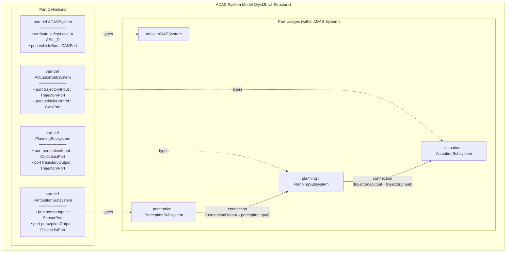

# SysML v2 — Systems Modeling Language

**Standard:** OMG SysML v2.0 (2024); built on KerML (Kernel Modeling Language)  
**SDO:** Object Management Group (OMG)  
**Predecessor:** SysML v1.6 (2019); based on UML 2.5  
**Audience:** MBSE practitioners, system architects, systems engineers, tool developers, model analysts  
**Prerequisites:** Basic modeling concepts (diagrams, elements, relationships); familiarity with SysML v1.x helpful but not required

---

## Chapter 1 — Historical Context & Origin Story

### 1.1 Timeline

| Year | Milestone |
|------|-----------|
| 1997 | UML 1.0 standardized by OMG (software-focused) |
| 2001 | INCOSE/OMG SE-DSIG formed (Systems Engineering Domain Special Interest Group) |
| 2003 | SysML Partners develop initial SysML profile (extending UML for SE) |
| 2006 | **SysML v1.0** adopted by OMG (UML profile for Systems Engineering) |
| 2008 | SysML v1.1 (minor corrections) |
| 2010 | SysML v1.2 (refined parametrics; improved constraints) |
| 2012 | SysML v1.3 (improved requirements; flow ports) |
| 2015 | SysML v1.4 (proxy ports; full ports; improved blocks) |
| 2017 | SysML v2 RFP issued by OMG (Request for Proposal for major rewrite) |
| 2019 | SysML v1.6 (final v1 version; deprecated flow ports) |
| 2020 | SysML v2 submissions received; evaluation begins |
| 2022 | SysML v2 beta specification released for public review |
| 2023 | SysML v2 revised based on feedback; tool prototypes emerge |
| 2024 | **SysML v2.0 adopted by OMG** (formal standard; KerML + SysML v2) |

### 1.2 Why v2? Problems with SysML v1

| Problem | Detail | v2 Solution |
|:-------:|--------|:-----------:|
| **UML baggage** | v1 is a UML profile; inherits UML complexity not needed for SE | v2: standalone language (KerML + SysML); no UML dependency |
| **Semantic gaps** | v1 diagrams often ambiguous; multiple ways to model same thing | v2: precise semantics; KerML defines formal meaning |
| **No standard API** | v1 tools use XMI (verbose; interop issues); no query API | v2: **standard REST API** for model access; JSON serialization |
| **Limited expressiveness** | v1 can't express equations naturally; parametrics clunky | v2: **structured expressions**; inline constraints; calculation chains |
| **Requirements weak** | v1 requirements are just text with «requirement» stereotype | v2: requirements are first-class model elements; verifiable; composable |
| **No textual notation** | v1 only graphical (diagrams); hard to diff/merge/version | v2: **textual notation** (like code); diff-able; version-controlled |
| **Learning curve** | v1 has 9 diagram types; confusing for non-UML users | v2: simplified viewpoint/view system; fewer concepts |
| **Tool lock-in** | XMI interchange rarely works between tools | v2: standard API + JSON → true interoperability |

---

## Chapter 2 — SysML v2 Architecture

### 2.1 Language Stack

```mermaid
graph TB
    subgraph "SysML v2 Language Architecture"
        SYSML2[SysML v2<br/>━━━━━━━━━━━<br/>Systems Modeling Language<br/>• Part definitions & usages<br/>• Connections, interfaces, flows<br/>• Requirements, constraints<br/>• Actions, states, use cases<br/>• Allocations, analysis]
        
        KERML[KerML (Kernel Modeling Language)<br/>━━━━━━━━━━━<br/>Foundation/Kernel<br/>• Features, types, classifiers<br/>• Relationships (specialization,<br/>  featuring, typing)<br/>• Expressions, calculations<br/>• Packages, namespaces<br/>• Annotations, comments]
        
        ROOT[Root Semantics<br/>━━━━━━━━━━━<br/>• Basic elements<br/>• Naming, scoping<br/>• Import, visibility]
    end
    
    SYSML2 -->|"built on"| KERML -->|"built on"| ROOT
```

### 2.2 Key Concepts: Definition vs. Usage

**The most fundamental concept in SysML v2:**

| Concept | Meaning | Analogy | Example |
|:-------:|---------|---------|---------|
| **Definition** | A type/class; describes what something IS | Blueprint; template | `part def Vehicle { ... }` |
| **Usage** | An instance/occurrence; uses a definition | Actual thing built from blueprint | `part myVehicle : Vehicle { ... }` |

```
// SysML v2 Textual Notation Example
package VehicleModel {
    
    // DEFINITION (type/class)
    part def Vehicle {
        part engine : Engine;
        part transmission : Transmission;
        part wheels : Wheel[4];
        
        attribute mass : Real;   // attribute definition
        
        // Connection between parts
        connect engine.output to transmission.input;
    }
    
    part def Engine {
        port output : ~DrivePort;  // conjugated port
        attribute power : PowerUnit;
        attribute displacement : VolumeUnit;
    }
    
    part def Transmission {
        port input : DrivePort;
        port output : ~DrivePort;
    }
    
    // USAGE (instance in context)
    part myCar : Vehicle {
        // Redefine/specialize
        part engine : TurboEngine;  // more specific engine
        attribute mass = 1500 [kg];  // assign value
    }
}
```

### 2.3 Core Language Elements

| Element | v1 Equivalent | v2 Description |
|:-------:|:---:|---|
| `part def` / `part` | Block / Property (with part composition) | Physical/logical component (definition & usage) |
| `port def` / `port` | FlowPort / ProxyPort | Interaction point on a part |
| `interface def` / `interface` | — (new) | Connection between ports with internal structure |
| `connection` | Connector | Link between parts/ports |
| `flow` | ItemFlow | Flow of items (data, material, energy) between ports |
| `attribute def` / `attribute` | ValueType / Property | Data values (with units) |
| `action def` / `action` | Activity / Action | Behavior (functional; input/output) |
| `state def` / `state` | StateMachine / State | State-based behavior |
| `requirement def` / `requirement` | Requirement (stereotype) | Formal requirement (text + constraints + verification) |
| `constraint def` / `constraint` | ConstraintBlock | Mathematical relationship (equation/inequality) |
| `allocation` | Allocate relationship | Maps function → structure; requirement → element |
| `viewpoint` / `view` | — (new) | Stakeholder perspective; generated visualization |
| `package` | Package | Namespace/container for model elements |

---

## Chapter 3 — SysML v2 Diagram Types / Views

### 3.1 View System (replaces v1 diagram types)

SysML v2 doesn't have fixed "diagram types" like v1. Instead:

```mermaid
graph TB
    subgraph "SysML v2 View System"
        VP[Viewpoint Definition<br/>━━━━━━━━━━━<br/>• Defines what stakeholder<br/>  wants to see<br/>• Filter/query rules<br/>• Rendering preferences<br/>━━━━━━━━━━━<br/>Example: "Show all parts of<br/>type Sensor and their connections"]
        
        VIEW[View (generated)<br/>━━━━━━━━━━━<br/>• Rendered from model<br/>  based on viewpoint rules<br/>• Can be graphical (diagram)<br/>  or tabular or textual<br/>• Always consistent with model<br/>  (auto-generated; not hand-drawn)]
        
        MODEL[Model (source of truth)<br/>━━━━━━━━━━━<br/>• All elements, relationships<br/>• Textual notation (primary)<br/>• API access (JSON/REST)<br/>• Single source; views are derived]
    end
    
    VP -->|"defines how to render"| VIEW
    MODEL -->|"data source"| VIEW
```

### 3.2 Equivalent Diagram Types (v1 → v2)

| SysML v1 Diagram | SysML v2 View Equivalent | Purpose |
|:-:|:-:|---|
| Block Definition Diagram (BDD) | **Part definition view** | Show part/port definitions; type hierarchy; composition |
| Internal Block Diagram (IBD) | **Part usage / interconnection view** | Show internal structure; connections; flows between parts |
| Requirements Diagram (REQ) | **Requirements view** | Show requirement hierarchy; satisfy/verify relationships |
| Parametric Diagram (PAR) | **Constraint/analysis view** | Show mathematical constraints; equations; parameter bindings |
| Activity Diagram (ACT) | **Action view** | Show functional behavior; data/control flow |
| Sequence Diagram (SEQ) | **Interaction/event view** | Show message exchanges; ordered interactions |
| State Machine Diagram (STM) | **State view** | Show state transitions; modes; lifecycle |
| Use Case Diagram (UC) | **Use case view** | Show actors and system capabilities |
| Package Diagram (PKG) | **Package/namespace view** | Show model organization |

---

## Chapter 4 — SysML v2 Requirements Modeling

### 4.1 Requirements in v2 vs. v1

| Aspect | SysML v1 | SysML v2 |
|:------:|:---:|:---:|
| Nature | Text string with stereotype | **First-class model element** with structure |
| Verification | «verify» relationship (just a link) | `verify` with explicit verification method and criteria |
| Satisfaction | «satisfy» relationship (just a link) | `satisfy` with traceability to satisfying element |
| Composition | «deriveReqt» (weak) | Proper nesting; specialization; composition |
| Constraints | Cannot express formally | **Constraint expressions** (mathematical; testable) |
| Parameterization | Not supported | **Parametric requirements** (reusable with parameters) |

### 4.2 Requirements Example (Textual Notation)

```
package VehicleRequirements {
    
    // Requirement definition (reusable template)
    requirement def PerformanceReq {
        doc /* A performance requirement template */
        attribute requiredValue : Real;
        attribute actualValue : Real;
        
        // Formal constraint (verifiable)
        require constraint { actualValue >= requiredValue }
    }
    
    // Specific requirement (usage of template)
    requirement topSpeed : PerformanceReq {
        doc /* The vehicle shall achieve a top speed of at
               least 200 km/h on a flat road surface. */
        attribute requiredValue = 200 [km/h];
        
        subject vehicle : Vehicle;  // what it applies to
    }
    
    requirement acceleration : PerformanceReq {
        doc /* The vehicle shall accelerate from 0 to 100 km/h
               in less than 8 seconds. */
        attribute requiredValue = 8 [s];
        // Lower is better for this one → override constraint
        require constraint { actualValue <= requiredValue }
        
        subject vehicle : Vehicle;
    }
    
    // Satisfy relationship
    part def SportEngine {
        // This engine satisfies the acceleration requirement
        satisfy acceleration;
    }
    
    // Verify relationship  
    action def AccelerationTest {
        // This test verifies the acceleration requirement
        verify acceleration;
    }
}
```

---

## Chapter 5 — SysML v2 Behavioral Modeling

### 5.1 Actions (Functional Behavior)

```
package BrakingBehavior {
    
    // Action definition (function)
    action def DetectObstacle {
        in radarData : RadarFrame;
        in cameraData : CameraFrame;
        out obstacleList : Obstacle[*];
        
        // Sub-actions (decomposition)
        action fuseSensors {
            in item radarData;
            in item cameraData;
            out fusedData : FusedPerception;
        }
        
        action classifyObjects {
            in item fusedData;
            out item obstacleList;
        }
        
        // Flow: fuseSensors output → classifyObjects input
        flow fuseSensors.fusedData to classifyObjects.fusedData;
    }
    
    // Action definition (top-level AEB function)
    action def AutoEmergencyBraking {
        in sensorData : SensorBundle;
        out brakeCommand : BrakeForce;
        
        action detect : DetectObstacle { ... }
        action assess : AssessThreat { ... }
        action brake : ApplyBrakes { ... }
        
        // Sequential flow
        first detect then assess then brake;
    }
}
```

### 5.2 States (Mode-Based Behavior)

```
package VehicleStates {
    
    state def VehicleOperatingMode {
        
        entry state off;  // initial state
        
        state running {
            entry state idle;
            state driving;
            state reversing;
            
            transition idle_to_driving
                first idle then driving
                when event gearEngage;
            
            transition driving_to_idle
                first driving then idle
                when event gearNeutral;
        }
        
        state fault {
            entry action { performDiagnostics(); }
            do action { logFaultCode(); }
        }
        
        // Top-level transitions
        transition first off then running when event ignitionOn;
        transition first running then off when event ignitionOff;
        transition first running then fault when event criticalFault;
        transition first fault then off when event shutdownCommand;
    }
}
```

---

## Chapter 6 — SysML v2 API & Tooling

### 6.1 Standard API (Major v2 Innovation)

| Aspect | SysML v1 | SysML v2 |
|:------:|:---:|:---:|
| **Model interchange** | XMI (XML; verbose; tool-specific quirks) | **REST API** (standard endpoints; JSON payloads) |
| **Query capability** | None standard (tool-specific) | **Standard query language** (filter, select, navigate) |
| **Model access** | Open tool → export XMI → import in another tool (often fails) | **API call**: GET /models/{id}/elements?filter=... |
| **Version control** | Proprietary (tool-internal versioning) | **Textual notation** → Git (branch, merge, diff like code) |
| **Programmatic access** | Custom scripting (tool API; Jython in Rhapsody) | Standard REST + JSON → any language/tool can integrate |
| **CI/CD integration** | Very difficult | Natural: textual model → commit → CI checks → deploy |

### 6.2 API Example

```json
// GET /projects/vehicle-project/commits/main/elements
// ?filter=type=PartDefinition&name=*Sensor*
{
  "elements": [
    {
      "id": "uuid-1234-abcd",
      "type": "PartDefinition",
      "name": "RadarSensor",
      "ownedFeatures": [
        { "type": "PortUsage", "name": "output", "portDefinition": "RadarPort" },
        { "type": "AttributeUsage", "name": "range", "value": "200", "unit": "m" }
      ]
    },
    {
      "id": "uuid-5678-efgh",
      "type": "PartDefinition",
      "name": "CameraSensor",
      "ownedFeatures": [
        { "type": "PortUsage", "name": "output", "portDefinition": "CameraPort" },
        { "type": "AttributeUsage", "name": "resolution", "value": "8", "unit": "MP" }
      ]
    }
  ]
}
```

### 6.3 Tool Support (2024)

| Tool | Vendor | v2 Support | Notes |
|:----:|:------:|:---:|---|
| **Cameo Systems Modeler** | Dassault Systèmes | Partial (v2 pilot) | Leading MBSE tool; v2 migration in progress |
| **IBM Engineering Rhapsody** | IBM | Planned | Strong in SysML v1; v2 roadmap |
| **Capella** | Eclipse/Thales | Exploring v2 integration | Open source; Arcadia methodology (not pure SysML) |
| **SysML v2 Pilot Implementation** | OMG reference | Full v2 | Reference implementation (Jupyter-based) |
| **Syndeia** | Intercax | v2 bridge | Integration between tools and models |
| **Eclipse SysON** | Eclipse Foundation | Full v2 (open source) | New open-source SysML v2 modeler |
| **GENESYS** | Vitech | Evaluating | Model-based SE tool |
| **Enterprise Architect** | Sparx | Planned | Broad UML/SysML; v2 roadmap announced |

---

## Chapter 7 — Comparison: SysML v1 vs. v2

| Feature | SysML v1.6 | SysML v2.0 |
|:-------:|:---:|:---:|
| **Foundation** | UML profile (extends UML 2.5) | **Standalone** (KerML + SysML; no UML dependency) |
| **Notation** | Graphical only (diagrams) | **Graphical + Textual** (text is primary; diagrams are views) |
| **Semantics** | Ambiguous in places (UML interpretation) | **Formally defined** (KerML kernel semantics) |
| **Interoperability** | XMI (unreliable between tools) | **Standard REST API + JSON** (true interop) |
| **Requirements** | Stereotyped class (text only) | **First-class element** (structured; constraints; parametric) |
| **Constraints/Math** | Parametric diagrams (clunky) | **Inline expressions** (natural math; calculation chains) |
| **Versioning** | Tool-proprietary | **Textual** → Git (diff/merge/branch like code) |
| **Diagram types** | 9 fixed diagram types (BDD, IBD, etc.) | **Views** from viewpoints (flexible; any rendering) |
| **Definition/Usage** | Block = type AND instance (confusing) | **Clear separation**: definition (type) vs. usage (instance) |
| **Ports** | 4 kinds (flow port deprecated; proxy; full; standard) | **1 kind**: port (with port definition; conjugation) |
| **Connectors** | Multiple kinds (binding, assembly, delegation) | **Unified**: connection (with interface definition) |
| **Learning curve** | High (UML legacy; 9 diagrams; many concepts) | Medium (cleaner concepts; but new language to learn) |
| **Tool maturity** | Mature (20 years of tools) | **Emerging** (first tools 2023-2024; maturing rapidly) |
| **Industry adoption** | Moderate (aerospace/defense mainly) | Growing (expected to surpass v1 by 2027) |

### Migration Considerations

| Aspect | Guidance |
|:------:|---------|
| **When to migrate** | New projects (greenfield): use v2 now. Existing projects: wait for tool maturity (2025-2026) |
| **Model migration** | Most tools will offer v1→v2 migration; not 1:1 (semantic differences); plan for manual refinement |
| **Training** | v2 requires new learning (even for v1 experts); textual notation + API skills |
| **ROI** | v2's API + textual notation enable CI/CD for models, automated checking, better collaboration |

---

## Chapter 8 — Architecture Diagrams

### 8.1 SysML v2 Metamodel Overview

```mermaid
graph TB
    subgraph "SysML v2 / KerML Metamodel (Simplified)"
        subgraph "KerML (Kernel)"
            ELEMENT[Element<br/>• Base of everything]
            TYPE[Type<br/>• Classifies instances]
            FEATURE[Feature<br/>• Owned by types<br/>• Has typing and multiplicity]
            RELATIONSHIP[Relationship<br/>• Connects elements]
            EXPRESSION[Expression<br/>• Evaluable to a value]
        end
        
        subgraph "SysML v2 (Domain Layer)"
            PART_DEF[Part Definition<br/>━━━━━━━━━━━<br/>• Physical/logical thing type<br/>• Has owned features:<br/>  ports, attributes, parts]
            
            PART_USG[Part Usage<br/>━━━━━━━━━━━<br/>• Instance in context<br/>• Typed by Part Definition]
            
            PORT_DEF[Port Definition<br/>━━━━━━━━━━━<br/>• Interaction point type<br/>• Can have flow items]
            
            ACTION_DEF[Action Definition<br/>━━━━━━━━━━━<br/>• Behavior type<br/>• Has input/output<br/>• Can decompose]
            
            STATE_DEF[State Definition<br/>━━━━━━━━━━━<br/>• Mode/state type<br/>• Has transitions]
            
            REQ_DEF[Requirement Definition<br/>━━━━━━━━━━━<br/>• Need/constraint type<br/>• Has subject<br/>• Has constraint expression]
            
            CONSTRAINT_DEF[Constraint Definition<br/>━━━━━━━━━━━<br/>• Mathematical relation<br/>• Equation/inequality]
            
            CONNECTION[Connection Definition<br/>━━━━━━━━━━━<br/>• Links ports/parts<br/>• Has interface structure]
            
            ALLOCATION[Allocation Definition<br/>━━━━━━━━━━━<br/>• Maps between domains<br/>  (function→structure;<br/>   requirement→element)]
        end
    end
    
    ELEMENT --> TYPE --> FEATURE
    ELEMENT --> RELATIONSHIP
    TYPE --> EXPRESSION
    
    TYPE --> PART_DEF
    TYPE --> PORT_DEF
    TYPE --> ACTION_DEF
    TYPE --> STATE_DEF
    TYPE --> REQ_DEF
    TYPE --> CONSTRAINT_DEF
    FEATURE --> PART_USG
    RELATIONSHIP --> CONNECTION
    RELATIONSHIP --> ALLOCATION
```

### 8.2 Example System Model (ADAS)



---

## Chapter 9 — Case Studies

### 9.1 Aerospace: Satellite Attitude Control (MBSE with SysML v2)

| Aspect | Detail |
|--------|--------|
| **System** | Satellite Attitude Determination and Control System (ADCS) |
| **Challenge** | Multi-physics (orbital mechanics + reaction wheels + star trackers + magnetorquers); need to combine structural model with behavioral model with constraint analysis |
| **v2 advantage** | Inline constraint expressions allow mathematical models (orbital equations) directly in SysML model — no separate Modelica tool needed for initial analysis |
| **Model structure** | `part def ADCS { part starTracker : StarTracker; part reactionWheel : ReactionWheel[3]; part magnetorquer : Magnetorquer[3]; constraint pointingAccuracy { ... } }` |
| **Requirements** | `requirement pointingReq { doc "ADCS shall achieve pointing accuracy ≤ 0.1° (3σ)"; require constraint { pointingError <= 0.1 [deg] } }` — machine-verifiable requirement |
| **Verification** | `verify pointingReq by action PointingAccuracyTest { ... }` — direct model link from requirement to test |
| **API usage** | CI/CD pipeline queries model API: "Are all requirements satisfied? Any unlinked requirements?" → automated completeness check on every commit |

### 9.2 Automotive: Electric Vehicle Platform (v1 → v2 Migration)

| Aspect | Detail |
|--------|--------|
| **Context** | OEM with 200K-element SysML v1 model (vehicle platform); Cameo Systems Modeler |
| **Migration motivation** | v1 model became unmaintainable; XMI interop issues with supplier tools; no automated checking; takes 30 min to generate a "requirements coverage" report manually |
| **v2 migration approach** | Phase 1: New subsystems modeled in v2 textual notation. Phase 2: Critical subsystems migrated (battery management, powertrain). Phase 3: Full model migration (planned 2026). |
| **v2 benefits realized** | (1) Textual notation in Git: engineers review model changes in pull requests (like code review). (2) API queries: automated nightly check "all requirements have at least one verify relationship" (took 30 min manually → 5 seconds automated). (3) Parametric requirements: battery capacity requirement parameterized by vehicle variant → one requirement serves 4 vehicle models. |
| **Challenges** | Tool maturity (early adoption issues); team training (3-month ramp-up); some v1 patterns have no direct v2 equivalent |

---

## Chapter 10 — Future Evolution

| Trend | Timeline | Impact |
|-------|----------|--------|
| **Tool ecosystem maturation** | 2024-2026 | Major tools (Cameo, Rhapsody, EA) fully support v2; migration assistants available |
| **Eclipse SysON** | 2024-2025 | Open-source v2 modeler reduces barrier to adoption |
| **SysML v2.1** | 2025-2026 | Bug fixes; improved API; additional library packages |
| **Integration with simulation** | 2025-2027 | v2 models drive Modelica/Simulink simulations directly (seamless) |
| **AI-assisted modeling** | 2025-2028 | LLMs generate SysML v2 textual models from natural language requirements |
| **Digital thread** | 2025-2030 | v2 API enables continuous traceability: requirement → model → code → test → field data |
| **Industry adoption** | 2025-2028 | Aerospace/defense first (2025); automotive (2026); industrial (2027) |
| **SysML v2 + DevOps** | 2025-2027 | Model-in-the-loop CI/CD: commit model → validate → simulate → deploy |
| **Formal verification** | 2027+ | v2's precise semantics enable model checking; prove properties without testing |

---

## Chapter 11 — Interview Questions & Career Guide

### Tier 1: Entry-Level

**Q1:** What is SysML v2 and how does it differ from SysML v1?

**A:** SysML v2 is the next-generation Systems Modeling Language standardized by OMG in 2024. It's a complete rewrite (not an evolution of v1).

**Key differences:**

| Aspect | v1 | v2 |
|:------:|:---:|:---:|
| Foundation | UML profile (inherits UML complexity) | Standalone (KerML kernel; no UML) |
| Notation | Graphical only (diagrams) | **Textual primary** + graphical views |
| Interchange | XMI (unreliable) | **Standard REST API + JSON** |
| Requirements | Text in a box | First-class elements with constraints |
| Versioning | Tool-proprietary | Git-friendly (textual; diffable) |

**Why it matters:** v2 enables treating system models like code — version-controlled, automatically validated, queryable, and integrated into CI/CD pipelines.

### Tier 2: Mid-Level

**Q2:** Explain the concept of "Definition vs. Usage" in SysML v2 and why it matters.

**A:**

**Definition** = a type/class/blueprint. Describes WHAT something IS in general.
**Usage** = an instance/occurrence of a definition within a specific context.

```
part def Sensor {           // DEFINITION: "a sensor in general"
    port output : DataPort;
    attribute accuracy : Real;
}

part def Vehicle {
    part frontRadar : Sensor {    // USAGE: "a specific sensor in this vehicle"
        attribute accuracy = 0.1;  //   with specific accuracy
    }
    part rearRadar : Sensor {     // ANOTHER USAGE: different context
        attribute accuracy = 0.5;  //   different accuracy
    }
}
```

**Why it matters:**
1. **Clarity:** In v1, a "Block" was BOTH a type AND could be instantiated — confusing. v2 separates cleanly.
2. **Reuse:** Define once; use many times with specialization. Sensor definition reused for front/rear radar with different parameters.
3. **Consistency:** Changes to the definition automatically propagate to all usages (unless overridden).
4. **Analysis:** Tools can distinguish "how many Sensor TYPES exist?" (count definitions) vs. "how many sensors are IN the vehicle?" (count usages).
5. **Libraries:** Standard libraries provide definitions; project models create usages.

### Tier 3: Senior

**Q3:** Design an MBSE workflow using SysML v2 for a safety-critical automotive project (ADAS, ASIL D). Cover: model structure, CI/CD integration, requirements traceability automation, and how v2's API enables automated compliance checking.

**A:**

**Model repository structure:**

```
vehicle-platform-model/
├── kernel/
│   ├── types.sysml          (base types: units, value types)
│   └── interfaces.sysml     (standard interface definitions)
├── requirements/
│   ├── stakeholder_req.sysml
│   ├── system_req.sysml
│   └── safety_req.sysml     (ISO 26262 safety requirements)
├── architecture/
│   ├── system_arch.sysml    (top-level; sensors, ECUs, actuators)
│   ├── perception.sysml     (perception subsystem)
│   ├── planning.sysml       (path planning)
│   └── actuation.sysml      (brake/steering control)
├── behavior/
│   ├── aeb_function.sysml   (AEB action decomposition)
│   ├── states.sysml         (operating modes)
│   └── failure_modes.sysml  (fault states)
├── verification/
│   ├── test_definitions.sysml  (test action definitions)
│   └── coverage_matrix.sysml  (requirement-to-test mapping)
├── analysis/
│   ├── timing.sysml         (WCET constraints)
│   └── safety_analysis.sysml (FMEA mapping)
└── .github/
    └── workflows/
        └── model-ci.yaml    (CI pipeline for model validation)
```

**CI/CD pipeline (model-ci.yaml):**

```yaml
on: [push, pull_request]
jobs:
  model-validation:
    steps:
      - name: Parse model
        run: sysml-cli parse ./  # validate syntax
      
      - name: Check requirement traceability
        run: |
          # Query v2 API: find requirements without 'satisfy' relationship
          curl -s $MODEL_API/elements?type=RequirementUsage | jq '
            [.elements[] | select(.relationships | 
              all(.type != "SatisfyRequirementUsage"))] |
            if length > 0 then error("Unsatisfied requirements found") 
            else "All requirements satisfied" end'
      
      - name: Check verification coverage
        run: |
          # Query: find requirements without 'verify' relationship
          curl -s $MODEL_API/elements?type=RequirementUsage | jq '
            [.elements[] | select(.relationships |
              all(.type != "VerifyRequirementUsage"))] |
            if length > 0 then error("Unverified requirements") 
            else "All requirements have verification" end'
      
      - name: Safety integrity check
        run: |
          # All ASIL D requirements must have:
          # 1. At least one satisfy relationship (design element)
          # 2. At least one verify relationship (test)
          # 3. Verify element must have independence annotation
          python check_safety_integrity.py
      
      - name: Generate traceability report
        run: sysml-cli report --type=traceability --output=docs/trace.html
```

**Automated compliance checks (ISO 26262 mapping):**

| ISO 26262 Clause | Automated Check via v2 API | Pass Criteria |
|:---:|---|:---:|
| Part 6 cl.7 (SW safety req) | All safety requirements have ASIL tag AND satisfy link | 100% |
| Part 6 cl.8 (Architecture) | All architecture elements allocated from requirements; FFI annotations present | 100% |
| Part 6 cl.10 (Unit verification) | All ASIL D part usages have verify link to test with coverage annotation ≥ MC/DC | 100% |
| Part 8 cl.8 (Config mgmt) | Git history shows: all model changes have approved PR; no direct main commits | 100% |
| Part 8 cl.9 (Traceability) | Bidirectional: req ↔ arch ↔ design ↔ test (no orphans in any direction) | 100% |

**Key innovation:** With v2's API, these checks run **automatically on every commit** — not manually during milestone reviews. Safety compliance is continuous, not periodic.

---

## Chapter 12 — Cheat Sheet & Quick Reference

```
═══════════════════════════════════════════
SysML v2 — QUICK REFERENCE
═══════════════════════════════════════════

LANGUAGE STACK:
  SysML v2 (systems modeling) → built on →
  KerML (kernel: types, features, expressions) → built on →
  Root (naming, scoping, imports)

═══════════════════════════════════════════
CORE CONCEPT — DEFINITION vs USAGE:
  Definition = type/class/blueprint (general)
  Usage = instance/occurrence (in context)
  
  part def Engine { ... }       ← DEFINITION
  part myEngine : Engine { ... } ← USAGE

═══════════════════════════════════════════
KEY ELEMENTS:
  part def / part       → physical/logical components
  port def / port       → interaction points
  action def / action   → functional behavior
  state def / state     → mode/state behavior
  requirement def / req → formal requirements
  constraint def        → mathematical relations
  connection            → links between ports/parts
  flow                  → item flow (data/material/energy)
  allocation            → cross-domain mapping
  viewpoint / view      → stakeholder perspectives

═══════════════════════════════════════════
TEXTUAL NOTATION (PRIMARY):
  package MyPackage {
    part def Vehicle {
      part engine : Engine;
      port fuelIn : FuelPort;
      attribute mass : Real = 1500 [kg];
    }
    
    requirement topSpeedReq {
      doc "Vehicle shall reach 200 km/h"
      require constraint { topSpeed >= 200 [km/h] }
    }
    
    satisfy topSpeedReq by engine;
  }

═══════════════════════════════════════════
v1 → v2 MAPPING:
  Block (v1)         → part def (v2)
  Property (v1)      → part usage (v2)
  FlowPort (v1)      → port (v2)
  Activity (v1)      → action def (v2)
  ConstraintBlock    → constraint def (v2)
  BDD diagram        → part definition view (v2)
  IBD diagram        → interconnection view (v2)
  Requirements Diag  → requirements view (v2)

═══════════════════════════════════════════
STANDARD API (NEW IN v2):
  REST API for model access (GET/POST/PUT/DELETE)
  JSON serialization (not XMI)
  Standard query language (filter by type, name, etc.)
  Enables: CI/CD for models; automated checking; tool interop

═══════════════════════════════════════════
KEY v2 ADVANTAGES OVER v1:
  □ Textual notation → version control (Git)
  □ Standard API → tool interoperability
  □ Precise semantics → less ambiguity
  □ Requirements as model elements → automated traceability
  □ Inline expressions → natural math/constraints
  □ Definition/Usage separation → clearer models
  □ No UML dependency → simpler foundation

═══════════════════════════════════════════
TOOL SUPPORT (2024):
  Cameo (Dassault): partial v2 | Rhapsody (IBM): planned
  Eclipse SysON: open-source v2 | SysML Pilot: reference impl
  Enterprise Architect: planned | Capella: exploring integration

═══════════════════════════════════════════
WHEN TO ADOPT v2:
  New greenfield project: YES (start with v2)
  Existing v1 project: WAIT (migrate when tools mature, ~2026)
  Learning/training: START NOW (v2 is the future)
```

---

*End of Document — 03_SysML_v2_Modeling.md*
