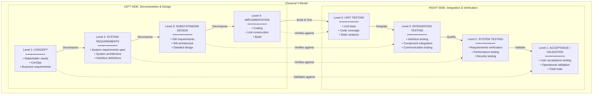
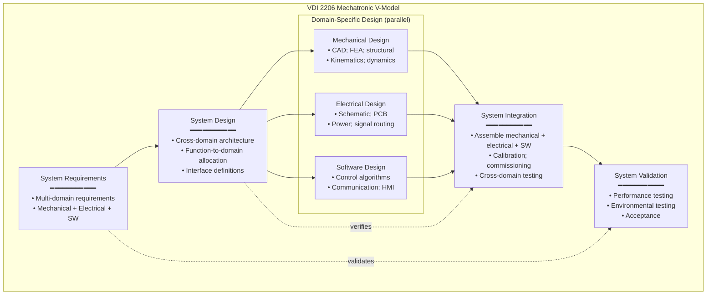

# V-Model Development Lifecycle

**Topic:** V-Model development lifecycle; classical V; automotive V (ASPICE); aerospace V (ARP4754A); German V-Modell XT; Agile+V hybrid  
**Standards:** ISO/IEC/IEEE 15288, Automotive SPICE, SAE ARP4754A, VDI 2206, V-Modell XT  
**Audience:** Systems engineers, project managers, quality engineers, ASPICE assessors, safety engineers, process architects  
**Prerequisites:** Basic lifecycle concepts; familiarity with ISO 15288 processes; understanding of V&V

---

## Chapter 1 — Historical Context & Origin Story

### 1.1 Timeline

| Year | Milestone |
|------|-----------|
| 1970 | Royce's waterfall paper (often misinterpreted as endorsing sequential development) |
| 1979 | Barry Boehm describes verification linkages (early V-concept) |
| 1986 | **Paul Rook proposes V-Model** at ESCOM conference (explicit left-right correspondence) |
| 1991 | German federal government adopts **V-Modell** for IT projects |
| 1992 | US DoD introduces V-Model in defense acquisition |
| 1996 | **ASPICE** (Automotive SPICE) begins development; V-Model as reference lifecycle |
| 1997 | V-Modell 97 (updated German federal standard) |
| 2000 | SAE ARP4754 (aerospace V-model; certification-driven) |
| 2004 | **V-Modell XT** (German federal; "XT" = eXtreme Tailoring) |
| 2005 | ASPICE 2.5 uses V-Model explicitly for SW development |
| 2010 | ISO 26262:2011 uses V-Model for safety lifecycle |
| 2015 | ASPICE 3.1 — refined V-Model for automotive SW processes |
| 2017 | Agile+V discussions intensify (SAFe, ASPICE + Agile) |
| 2023 | ASPICE 4.0 — acknowledges iterative/Agile within V; V remains reference |

### 1.2 Why V-Model?

**The fundamental insight:**
- Waterfall is LINEAR (left to right; requirements → design → code → test)
- V-Model adds the **VERTICAL CORRESPONDENCE**: each decomposition level on the left has an explicit verification level on the right
- This ensures: you don't just "test at the end" — you test AT EACH LEVEL against the artifacts produced at that level

**Benefits over pure waterfall:**
1. **Early test planning** — write test plans during requirements/design (not after coding)
2. **Traceability** — every requirement has a corresponding test; no gaps
3. **Defect localization** — unit test catches code bugs; integration test catches interface bugs; system test catches requirement gaps
4. **Risk reduction** — verification planned from start; not an afterthought

---

## Chapter 2 — Classical V-Model Architecture

### 2.1 The V Shape



### 2.2 Horizontal Correspondence Rules

| Left Side (Design) | Right Side (Test) | Verification Question |
|:---:|:---:|---|
| Stakeholder needs / ConOps | Acceptance testing / Validation | "Does the system meet real-world needs?" |
| System requirements | System testing | "Does the system meet its requirements?" |
| SW architecture / subsystem design | Integration testing | "Do components work together correctly?" |
| Detailed design / implementation | Unit testing | "Does each unit work as designed?" |

### 2.3 Key Principles

| Principle | Description |
|:---------:|-------------|
| **Test planning starts early** | Test plans are written during the corresponding LEFT-side activity (not deferred) |
| **Traceability is mandatory** | Every requirement must trace to at least one test case; every test case traces to a requirement |
| **Verification at each level** | No level is "just passed through" — each has explicit verification |
| **Integration is bottom-up** | Units → integrate → subsystem → integrate → system (progressive assembly) |
| **Defects propagate UP** | A defect in requirements (left side) will only be caught at system/acceptance (right side) — expensive! This motivates: reviews/inspections on the left to catch defects early |

---

## Chapter 3 — Automotive V-Model (ASPICE)

### 3.1 ASPICE V-Model

```mermaid
graph TB
    subgraph "Automotive SPICE V-Model (SWE Processes)"
        subgraph "Left Side"
            SYS_REQ_A[SYS.2: System Requirements Analysis<br/>━━━━━━━━━━━<br/>• System requirements from stakeholder<br/>• Functional + non-functional<br/>• Traced to stakeholder needs]
            SYS_ARCH[SYS.3: System Architectural Design<br/>━━━━━━━━━━━<br/>• System components (HW/SW)<br/>• Interfaces<br/>• Requirements allocation]
            SWE1[SWE.1: SW Requirements Analysis<br/>━━━━━━━━━━━<br/>• SW requirements from system req<br/>• Functional; interface; constraint]
            SWE2[SWE.2: SW Architectural Design<br/>━━━━━━━━━━━<br/>• SW components/modules<br/>• Interfaces; communication<br/>• Dynamic behavior]
            SWE3[SWE.3: SW Detailed Design<br/>& Unit Construction<br/>━━━━━━━━━━━<br/>• Algorithms; data structures<br/>• Coding (MISRA C)]
        end
        
        subgraph "Right Side"
            SWE4[SWE.4: SW Unit Verification<br/>━━━━━━━━━━━<br/>• Unit testing<br/>• Coverage (statement, branch, MC/DC)<br/>• Static analysis; code review]
            SWE5[SWE.5: SW Integration &<br/>Integration Test<br/>━━━━━━━━━━━<br/>• Integrate units → components<br/>• Interface testing<br/>• Communication testing]
            SWE6[SWE.6: SW Qualification Test<br/>━━━━━━━━━━━<br/>• Test against SW requirements<br/>• 100% requirement coverage<br/>• Performance; robustness]
            SYS_INT[SYS.4: System Integration &<br/>Integration Test<br/>━━━━━━━━━━━<br/>• Integrate SW + HW<br/>• System-level interface testing]
            SYS_QUAL[SYS.5: System Qualification Test<br/>━━━━━━━━━━━<br/>• Test against system requirements<br/>• EMC; environmental; endurance]
        end
    end
    
    SYS_REQ_A --> SYS_ARCH --> SWE1 --> SWE2 --> SWE3
    SWE3 --> SWE4 --> SWE5 --> SWE6 --> SYS_INT --> SYS_QUAL
    
    SYS_REQ_A -.->|"verifies"| SYS_QUAL
    SYS_ARCH -.->|"verifies"| SYS_INT
    SWE1 -.->|"verifies"| SWE6
    SWE2 -.->|"verifies"| SWE5
    SWE3 -.->|"verifies"| SWE4
```

### 3.2 ASPICE Bidirectional Traceability

| Trace Link | From → To | Purpose |
|:---:|:---:|---|
| 1 | System Req → SW Req | Ensure all system requirements allocated to SW are covered |
| 2 | SW Req → SW Architecture Component | Ensure all SW requirements allocated to architecture elements |
| 3 | SW Architecture → SW Detailed Design | Ensure all components have detailed design |
| 4 | SW Detailed Design → Unit Tests | Ensure all design elements have unit tests |
| 5 | SW Req → SW Qualification Tests | Ensure all SW requirements have qualification tests |
| 6 | System Req → System Qualification Tests | Ensure all system requirements have system tests |
| **Bidirectional** | Also trace UPWARD: test → requirement | Ensure no orphan tests (every test traces to a requirement) |

### 3.3 ASPICE Work Products per V-Level

| V-Level | Input Work Products | Output Work Products |
|:-------:|:---:|:---:|
| SWE.1 (Req) | System requirements; Stakeholder needs | SW Requirements Specification; Traceability matrix |
| SWE.2 (Arch) | SW Requirements | SW Architecture Document; Interface Descriptions |
| SWE.3 (Design/Code) | SW Architecture | Detailed Design; Source Code; Unit Test Plans |
| SWE.4 (Unit Test) | Source Code; Unit Test Plans | Unit Test Results; Coverage Reports |
| SWE.5 (Integration) | SW Components; Integration Plan | Integration Test Results; Integrated SW |
| SWE.6 (Qualification) | SW Requirements; Test Plans | Qualification Test Results; Test Summary Report |

---

## Chapter 4 — Aerospace V-Model (ARP4754A)

### 4.1 ARP4754A Development Assurance

```mermaid
graph TB
    subgraph "Aerospace V-Model (ARP4754A + DO-178C)"
        subgraph "System Level (ARP4754A)"
            FHA[Functional Hazard Assessment (FHA)<br/>━━━━━━━━━━━<br/>• Identify system functions<br/>• Assess failure conditions<br/>• Assign DAL (A-E)]
            SYS_REQ_AE[System Requirements<br/>━━━━━━━━━━━<br/>• Functional requirements<br/>• Safety requirements (from FHA)<br/>• Performance requirements]
            SYS_ARCH_AE[System Architecture<br/>━━━━━━━━━━━<br/>• Allocate functions to items<br/>  (HW item, SW item)<br/>• Assign DALs to items<br/>• PSSA (Preliminary SSA)]
        end
        
        subgraph "SW Level (DO-178C)"
            SW_REQ_DO[SW Requirements (DO-178C §5.1)<br/>━━━━━━━━━━━<br/>• High-level requirements (HLR)<br/>• Low-level requirements (LLR)<br/>• Derived requirements identified]
            SW_DES_DO[SW Design (DO-178C §5.2-5.3)<br/>━━━━━━━━━━━<br/>• SW architecture<br/>• Source code<br/>• Integration]
            SW_VER_DO[SW Verification (DO-178C §6)<br/>━━━━━━━━━━━<br/>• Reviews (requirements, design, code)<br/>• Testing (normal, robustness, boundary)<br/>• Coverage analysis (SC, DC, MC/DC per DAL)]
        end
        
        subgraph "System Verification"
            SYS_VER[System Verification (ARP4754A §5.5)<br/>━━━━━━━━━━━<br/>• System test<br/>• SSA (System Safety Assessment)<br/>• Compliance demonstration]
            CERT[Certification<br/>━━━━━━━━━━━<br/>• DER review/approval<br/>• TC/STC issuance<br/>• Continued airworthiness]
        end
    end
    
    FHA --> SYS_REQ_AE --> SYS_ARCH_AE --> SW_REQ_DO --> SW_DES_DO --> SW_VER_DO --> SYS_VER --> CERT
    FHA -.->|"validates"| CERT
    SYS_REQ_AE -.->|"verifies"| SYS_VER
    SW_REQ_DO -.->|"verifies"| SW_VER_DO
```

### 4.2 DAL-Dependent Verification Rigor

| DAL | Failure Condition | Coverage Required | Independence |
|:---:|:-:|:---:|:---:|
| **A** | Catastrophic | MC/DC (Modified Condition/Decision Coverage) | Independent V&V required |
| **B** | Hazardous | Decision Coverage (DC) | Independent V&V required |
| **C** | Major | Statement Coverage (SC) | Separation of activities |
| **D** | Minor | Statement Coverage (SC) | Same person can verify |
| **E** | No Safety Effect | No specific coverage | No specific requirement |

---

## Chapter 5 — German V-Modell XT

### 5.1 Overview

| Aspect | Detail |
|:------:|--------|
| **What** | German federal government standard for IT and system project management |
| **"XT"** | eXtreme Tailoring — designed to be tailored to project type/size |
| **Scope** | Covers full project lifecycle: initiation, analysis, design, implementation, acceptance, operation |
| **Key innovation** | Distinguishes project types: system development, SW development, acquisition, maintenance |
| **Decision gates** | Mandatory decision points ("Entscheidungspunkte"); project cannot proceed without gate approval |
| **Mandatory for** | German federal government IT projects; adopted by many German organizations |

### 5.2 V-Modell XT Structure

| Module | Content |
|:------:|---------|
| **Project Management** | Planning, risk management, reporting, quality management |
| **Quality Assurance** | Reviews, audits, metrics, process improvement |
| **Configuration Management** | Baselines, change control, status accounting |
| **Problem Resolution** | Defect tracking, incident management |
| **System Development** | Requirements, architecture, design, implementation, integration, test |
| **Acquisition** | Procurement, evaluation, contract management |

---

## Chapter 6 — Agile + V-Model Hybrid

### 6.1 The Tension

| Aspect | Pure V-Model | Pure Agile |
|:------:|:---:|:---:|
| **Documentation** | Heavy (all work products at each level) | Light (working software over comprehensive docs) |
| **Planning** | Upfront (plan entire lifecycle) | Adaptive (plan sprint-by-sprint) |
| **Change** | Controlled (formal change requests) | Embraced (backlog continuously refined) |
| **Delivery** | Big bang (at end of right side of V) | Incremental (every sprint) |
| **Testing** | Phase-based (unit → integration → system) | Continuous (TDD; CI/CD) |
| **Traceability** | Formal (requirements ↔ tests matrices) | Implicit (user story → acceptance test) |
| **Good for** | Safety-critical; regulated; contractual | Time-to-market; uncertain requirements; innovation |

### 6.2 Hybrid Approaches

```mermaid
graph TB
    subgraph "V-Model + Agile Hybrid"
        subgraph "System Level (V-Model: rigorous)"
            SL1[System Requirements<br/>(formal; baselined)]
            SL2[System Architecture<br/>(formal; reviewed)]
            SL3[System Integration Test<br/>(planned per V)]
            SL4[System Qualification<br/>(formal; per requirements)]
        end
        
        subgraph "SW Level (Agile: iterative)"
            SP[Sprint Planning<br/>• User stories from<br/>  system requirements<br/>• Acceptance criteria]
            DEV[Sprint Development<br/>• TDD<br/>• Pair programming<br/>• CI builds]
            TEST[Sprint Testing<br/>• Automated unit test<br/>• Automated integration test<br/>• Code review]
            DEMO[Sprint Demo<br/>• Increment validated<br/>  with stakeholders<br/>• Feedback → backlog]
        end
    end
    
    SL1 -->|"allocate to sprints"| SP
    SL2 -->|"architecture runway"| SP
    SP --> DEV --> TEST --> DEMO
    DEMO -->|"repeat (2-week sprints)"| SP
    TEST -->|"accumulated result"| SL3
    SL3 --> SL4
```

### 6.3 ASPICE + Agile (ASPICE 4.0 Guidance)

| ASPICE Process | Agile Practice | How It Satisfies ASPICE |
|:---:|:---:|---|
| SWE.1 (Requirements) | User stories + acceptance criteria + Definition of Done | User stories = requirements; acceptance criteria = verifiable; traced to system req |
| SWE.2 (Architecture) | Architecture runway (SAFe); architectural spikes | Sprint 0 establishes architecture; ADRs document decisions; iteratively refined |
| SWE.3 (Design/Code) | TDD; pair programming; coding standards | TDD provides unit-level design; code IS the design; standards enforced by linter |
| SWE.4 (Unit Verification) | TDD tests; CI pipeline; static analysis | Every commit: unit tests + coverage + static analysis; evidence in CI artifacts |
| SWE.5 (Integration) | CI/CD; automated integration tests | Every merge: full integration suite runs; results in Jenkins/GitHub Actions |
| SWE.6 (Qualification) | Sprint demos; acceptance tests; regression suite | Acceptance criteria verified per story; full regression per release |
| SUP.8 (CM) | Git; pull requests; semantic versioning | Every change tracked; reviewed (PR); baselined (tags); automated build |

**Key insight (ASPICE 4.0):** "The V-Model defines WHAT must be verified at each level. Agile defines HOW OFTEN and IN WHAT ORDER the work is done. They are compatible — V defines the quality gates; Agile defines the delivery cadence."

---

## Chapter 7 — Comparison: V-Model Variants

| Variant | Domain | Phases | Key Feature | Flexibility |
|:-------:|:------:|:------:|:-----------:|:-----------:|
| **Classical V** | General | 4 levels | Simple; symmetric | Low (sequential) |
| **ASPICE V** | Automotive | SYS + SWE (9 processes) | Process capability assessment | Medium (can iterate within) |
| **ARP4754A V** | Aerospace | System + SW (DO-178C) | DAL-dependent rigor | Low (certification-driven) |
| **V-Modell XT** | German government IT | Modular (tailorable) | Extreme tailoring; decision gates | High (project-type specific) |
| **VDI 2206** | Mechatronics | V with domain coupling (mech/elec/SW) | Multi-domain synchronization | Medium |
| **ISO 26262 V** | Automotive safety | Concept → Product Development → Production | Safety lifecycle (HARA → TSC → HSI → HSR) | Low (safety mandated) |
| **Dual-V** | Complex systems | System V + SW V (nested) | Two V-models linked at allocation points | Medium |
| **Agile-V Hybrid** | Any (regulated) | V gates + Agile sprints | Best of both: quality gates + iterative delivery | High |

---

## Chapter 8 — Architecture Diagrams

### 8.1 Complete Automotive V (System + Software + Hardware)

```mermaid
graph TB
    subgraph "Complete Automotive V-Model (ISO 26262 + ASPICE)"
        subgraph "System Level"
            CONCEPT[Item Definition & HARA<br/>━━━━━━━━━━━<br/>• Define item (system boundary)<br/>• Hazard Analysis & Risk Assessment<br/>• Safety goals; ASIL assignment]
            
            FSC[Functional Safety Concept<br/>━━━━━━━━━━━<br/>• Functional safety requirements<br/>• Allocation to system elements<br/>• Warning/degradation concept]
            
            TSC[Technical Safety Concept<br/>━━━━━━━━━━━<br/>• Technical safety requirements<br/>• System architecture (HW/SW)<br/>• Safety mechanisms]
        end
        
        subgraph "SW Development (SWE)"
            SW_SR[SW Safety Requirements<br/>━━━━━━━━━━━<br/>• ASIL-tagged SW requirements<br/>• SW safety mechanisms]
            SW_AD[SW Architecture<br/>━━━━━━━━━━━<br/>• Freedom from interference<br/>• Partitioning; monitoring]
            SW_DD[SW Detailed Design & Code<br/>━━━━━━━━━━━<br/>• MISRA C; defensive coding<br/>• Unit implementation]
        end
        
        subgraph "HW Development"
            HW_SR[HW Safety Requirements<br/>━━━━━━━━━━━<br/>• ASIL-tagged HW requirements<br/>• Hardware metrics (PMHF, SPFM, LFM)]
            HW_DD[HW Design<br/>━━━━━━━━━━━<br/>• Schematic; layout<br/>• Safety mechanisms (redundancy)]
        end
        
        subgraph "Verification & Validation"
            SW_UT[SW Unit Test<br/>(ASIL D: MC/DC)]
            SW_IT[SW Integration Test]
            SW_QT[SW Qualification Test]
            HW_VER[HW Verification<br/>(FMEDA; fault injection)]
            SYS_IT[System Integration Test<br/>(SW + HW)]
            SYS_VT[System Validation<br/>(Vehicle level)]
            SAFETY_VAL[Safety Validation<br/>━━━━━━━━━━━<br/>• Safety case complete<br/>• Residual risk acceptable<br/>• Confirmation review]
        end
    end
    
    CONCEPT --> FSC --> TSC
    TSC --> SW_SR --> SW_AD --> SW_DD
    TSC --> HW_SR --> HW_DD
    
    SW_DD --> SW_UT --> SW_IT --> SW_QT
    HW_DD --> HW_VER
    SW_QT --> SYS_IT
    HW_VER --> SYS_IT
    SYS_IT --> SYS_VT --> SAFETY_VAL
    
    CONCEPT -.->|"validates"| SAFETY_VAL
    FSC -.->|"verifies"| SYS_VT
    TSC -.->|"verifies"| SYS_IT
    SW_SR -.->|"verifies"| SW_QT
    SW_AD -.->|"verifies"| SW_IT
    SW_DD -.->|"verifies"| SW_UT
```

### 8.2 Mechatronic V-Model (VDI 2206)



---

## Chapter 9 — Case Studies

### 9.1 Automotive ECU Development (ASPICE V-Model)

| Aspect | Detail |
|--------|--------|
| **Product** | Electric Power Steering (EPS) ECU; ASIL D |
| **V-Model application** | Full ASPICE V: SYS.2-5 + SWE.1-6; ISO 26262 safety V overlaid |
| **Timeline** | Total 24 months: Left-side (12 months); Right-side (12 months) |
| **Left side** | Month 1-3: System requirements + HARA → 200 system requirements (80 safety-tagged). Month 4-6: System architecture → allocate to SW ECU + motor driver HW. Month 7-9: SW requirements (450 req) + SW architecture (12 components). Month 10-12: Detailed design + coding (150K LOC; MISRA C:2012). |
| **Right side** | Month 13-15: Unit testing (92% MC/DC coverage for ASIL D units). Month 16-18: SW integration (CAN communication; torque calculation chain; diagnostic services). Month 19-21: SW qualification (100% req coverage; back-to-back MIL/SIL/PIL). Month 22-24: System integration (ECU + motor on bench; vehicle integration; endurance). |
| **Traceability** | Full bidirectional: System Req → SW Req → Architecture → Code → Unit Test → Integration Test → Qualification Test → System Test. Maintained in DOORS + Polarion. |
| **ASPICE result** | Level 3 achieved (all SWE processes + SUP.8 + MAN.3); no major findings |
| **Key lesson** | V-Model's early test planning saved 3 months: test plans written during left-side prevented "test case discovery" phase on right side. Team knew exactly what to test before code was complete. |

### 9.2 Aerospace Avionics (DO-178C V-Model)

| Aspect | Detail |
|--------|--------|
| **Product** | Flight Management System (FMS) software; DAL A (catastrophic failure condition: incorrect navigation → CFIT) |
| **V-Model application** | ARP4754A system V + DO-178C software V; certification by FAA DER |
| **Left side highlights** | High-Level Requirements (HLR): 1,200 requirements (formal language; no ambiguity). Low-Level Requirements (LLR): 8,000+ (every algorithm step documented). Architecture: 45 CSCI components; real-time partitioned OS (ARINC 653). Code: Ada; 500K SLOC; DO-178C coding standards. |
| **Right side highlights** | Verification: MC/DC 100% (DAL A mandates). Reviews: independent review of every requirement, design artifact, test procedure (30% of total effort). Testing: normal range, robustness, boundary; 15,000 test cases. Structural coverage analysis: every decision path exercised. |
| **Cost impact** | Right-side (V&V) = 60% of total project cost (DAL A is extremely expensive). If DAL B: would save ~30% (DC instead of MC/DC; less independence). |
| **Certification outcome** | FAA TSO authorization granted after DER review; 2 major findings resolved (derived requirements not properly traced; one MC/DC gap in error handler). |

---

## Chapter 10 — Future Evolution

| Trend | Timeline | Impact on V-Model |
|-------|----------|-------------------|
| **Agile+V becomes standard** | Now-2027 | V-Model quality gates retained; delivery becomes iterative; ASPICE 4.0 explicitly supports |
| **Continuous V** | 2024-2028 | V is applied continuously (every sprint traverses mini-V); not a single big V |
| **Model-based V** | 2025-2030 | Models replace documents on left side; model simulation replaces some right-side testing |
| **AI verification** | 2025-2030 | AI-generated test cases; AI-based coverage analysis; challenge: certifying AI-based V&V |
| **DevOps in safety-critical** | 2024-2028 | CI/CD pipelines implement V-model quality gates automatically; continuous certification |
| **Digital twin V** | 2026-2030 | Digital twin serves as permanent "right side" — continuously verifies in operation |
| **Shift-left** | Now (ongoing) | More verification moves to left side (simulation, formal methods) → right side becomes confirmation |

---

## Chapter 11 — Interview Questions & Career Guide

### Tier 1: Entry-Level

**Q1:** What is the V-Model and why is it used in automotive/aerospace?

**A:** The V-Model is a systems development lifecycle model shaped like the letter "V":
- **Left side** = decomposition (requirements → architecture → design → code)
- **Bottom** = implementation (coding)
- **Right side** = integration and verification (unit test → integration test → system test → acceptance)

**The key principle:** Each level on the left has a corresponding TEST level on the right:
- System requirements → verified by → System testing
- SW architecture → verified by → Integration testing
- Detailed design → verified by → Unit testing

**Why used in automotive/aerospace:**
1. **Safety-critical systems** need rigorous verification at every level (can't just "test at the end")
2. **Traceability** is mandatory (ISO 26262, DO-178C) — V-model ensures every requirement has a test
3. **Audit/certification** requires documented evidence at each V-level (assessors/DERs check each level)
4. **Defect cost** increases 10× per V-level (bug in requirements costs 10-100× more to fix than bug in code) — V-model motivates early verification (reviews on left side)

### Tier 2: Mid-Level

**Q2:** How do you combine Agile practices with the V-Model for an ASPICE Level 3 project?

**A:**

**The insight:** V-Model defines WHAT quality gates must be passed. Agile defines HOW OFTEN you deliver and HOW you organize work. They complement each other.

**Practical hybrid approach:**

| V-Level | Agile Implementation | ASPICE Evidence |
|:-------:|:---:|:---:|
| SWE.1 (Requirements) | User stories with acceptance criteria; product backlog as living SRS; story mapping workshops | Backlog export = SRS; traceability: Epic → Story → System Req (in DOORS) |
| SWE.2 (Architecture) | Sprint 0: architectural spike; ADRs for decisions; architecture evolves incrementally | Architecture wiki = SAD; ADRs = design rationale; reviewed by architect |
| SWE.3 (Design/Code) | TDD; pair programming; coding standards enforced by linters; design emerges from code | Code + tests = design documentation; linter config = coding standard compliance |
| SWE.4 (Unit Test) | TDD (test-first); CI runs tests on every commit; coverage gate in pipeline | CI report = unit test evidence; coverage report = structural coverage |
| SWE.5 (Integration) | CI/CD: every merge triggers integration tests; automated interface testing | Integration test suite results = integration test evidence |
| SWE.6 (Qualification) | Sprint demo = mini-qualification; release candidate = full qualification test | Acceptance test results + regression suite = qualification evidence |
| SUP.8 (CM) | Git + PR reviews + semantic versioning + CI artifacts | Git log = change history; PRs = reviews; tags = baselines |

**Key adaptations:**
1. **Continuous traceability:** Jira link: Epic → Story → Task → Commit → Test. Automated (not manual spreadsheet).
2. **Definition of Done includes ASPICE:** Story is not "done" unless: coded + unit tested (>80% coverage) + integrated + peer-reviewed + traced to requirement.
3. **Sprint review = milestone review:** Demonstrate to ASPICE assessor that sprint ceremonies produce equivalent evidence to traditional waterfall milestones.
4. **Baseline per release (not per phase):** Instead of one big "requirements baseline" → baseline per sprint/release (smaller, more frequent baselines).

### Tier 3: Senior

**Q3:** Design the verification strategy for an ASIL D ADAS system using the V-Model. Specify verification methods at each V-level, coverage criteria, independence requirements, and how you handle the tension between ISO 26262 rigor and time-to-market pressure.

**A:**

**Verification strategy across V-levels:**

| V-Level | Methods | Coverage Criteria | Independence | Time Optimization |
|:-------:|---------|:-----------------:|:---:|---|
| **System Requirements** | Inspection (formal review); analysis (consistency check); simulation (ConOps scenarios) | 100% requirements reviewed; all conflicts resolved | Safety manager + independent reviewer | Use model-based requirements (SysML) → auto-check consistency |
| **System Architecture** | FMEA on architecture; PSSA (top-down); DFA (dependent failure analysis) | 100% safety goals allocated; all SPF addressed by mechanisms | Independent safety assessor | Reuse platform architecture (proven base) |
| **SW Requirements** | Peer review; back-tracing to system requirements; completeness analysis | 100% system requirements trace to ≥1 SW requirement; no orphans | Reviewer ≠ author; safety review by different team | Automated traceability check (DOORS scripts) |
| **SW Architecture** | FMEA on SW architecture; FFI analysis; timing analysis (WCET) | All ASIL D components have monitoring/supervision; FFI demonstrated | Independent analysis of FFI claims | Reuse AUTOSAR safety mechanisms (WDG, MPU) |
| **SW Unit (ASIL D)** | Static analysis (MISRA; Polyspace); unit testing (MC/DC); code review (checklist) | MC/DC: 100%; Statement: 100%; Branch: 100%; MISRA: 0 violations | Reviewer ≠ coder (but can be same team) | Automated: static analysis + coverage in CI |
| **SW Integration** | Interface testing; fault injection; communication testing; timing measurement | All interfaces exercised; all error paths triggered; WCET within budget | Integration tester ≠ developer | Automated regression in CI; HIL for timing |
| **SW Qualification** | Requirements-based testing; back-to-back (MIL vs. SIL); performance testing | 100% SW requirements covered by ≥1 test case; all pass | Test team independent from development | Automated test execution (VectorCAST/Tessy) |
| **System Integration** | HW/SW integration testing; EMC; environmental; endurance | All system-level interfaces verified; safety mechanisms demonstrated | Separate system V&V team | Parallel HW/SW streams; early prototypes |
| **System Validation** | Vehicle testing; scenario-based (Euro NCAP); field testing with safety driver | All safety goals validated; SOTIF (ISO 21448) scenarios addressed | Independent safety validation team (or 3rd party) | Simulation-first (SIL → HIL → vehicle); prioritize critical scenarios |

**Handling time-to-market tension:**

| Strategy | Mechanism | Time Saved |
|:--------:|-----------|:---:|
| **ASIL decomposition** | Decompose ASIL D → ASIL B(D) + ASIL B(D); less rigorous verification for each part | 30-40% verification effort |
| **Platform reuse** | Reuse verified platform SW (OS, BSW, drivers); only verify new application SW | 50% (platform already verified) |
| **Simulation-first** | SIL testing covers 90% of scenarios before hardware exists; HIL/vehicle confirms | Earlier start; shorter vehicle phase |
| **Automated testing** | CI pipeline runs unit/integration/regression automatically; no manual test execution | 70% faster than manual testing |
| **Risk-based testing** | Test critical paths first (highest ASIL; most complex; highest risk of failure) | Focus effort where it matters |
| **Incremental release** | Release non-safety functions first (OTA); safety functions in later release with full V&V | Faster time to partial product |

---

## Chapter 12 — Cheat Sheet & Quick Reference

```
═══════════════════════════════════════════
V-MODEL — QUICK REFERENCE
═══════════════════════════════════════════

THE V SHAPE:
  LEFT SIDE: Decomposition (top-down design)
    Level 1: Requirements (stakeholder/system)
    Level 2: Architecture (system/subsystem)
    Level 3: Detailed Design
    Level 4: Implementation (code)
    
  RIGHT SIDE: Integration (bottom-up verification)
    Level 4: Unit Testing
    Level 3: Integration Testing
    Level 2: System Testing
    Level 1: Acceptance/Validation

═══════════════════════════════════════════
CORRESPONDENCE RULES:
  Requirements ←→ System Test (verifies)
  Architecture ←→ Integration Test (verifies)
  Design ←→ Unit Test (verifies)
  Stakeholder Needs ←→ Validation (validates)

═══════════════════════════════════════════
KEY PRINCIPLES:
  □ Test planning starts during LEFT side
  □ Every requirement has ≥1 test case
  □ Every test case traces to ≥1 requirement
  □ Defects caught earlier = cheaper to fix
  □ Verification at EVERY level (not just end)

═══════════════════════════════════════════
ASPICE V-MODEL (AUTOMOTIVE):
  Left Side           Right Side
  ────────────        ──────────────
  SYS.2 Sys Req  ←→  SYS.5 Sys Qual Test
  SYS.3 Sys Arch ←→  SYS.4 Sys Integration
  SWE.1 SW Req   ←→  SWE.6 SW Qual Test
  SWE.2 SW Arch  ←→  SWE.5 SW Integration
  SWE.3 SW Detail←→  SWE.4 Unit Verification

═══════════════════════════════════════════
AEROSPACE V (DO-178C):
  Coverage by DAL:
    DAL A: MC/DC (100%); independent V&V
    DAL B: Decision Coverage; independent V&V
    DAL C: Statement Coverage; separation
    DAL D: Statement Coverage; same person OK
    DAL E: No specific coverage

═══════════════════════════════════════════
ISO 26262 V (AUTOMOTIVE SAFETY):
  HARA → Safety Goals → FSC → TSC →
  → SW/HW Safety Requirements →
  → Design/Implementation →
  → Unit Test → Integration → Qualification →
  → System Validation → Safety Case

═══════════════════════════════════════════
AGILE + V HYBRID:
  V defines: QUALITY GATES (what to verify)
  Agile defines: DELIVERY CADENCE (how often)
  
  System level: V-Model (formal; baselined)
  SW level: Agile sprints (iterative; CI/CD)
  Evidence: CI artifacts = ASPICE work products
  
  ASPICE 4.0: explicitly supports Agile within V

═══════════════════════════════════════════
V-MODEL VARIANTS:
  Classical V: simple; symmetric; 4 levels
  ASPICE V: automotive; process assessment
  ARP4754A V: aerospace; DAL-driven rigor
  V-Modell XT: German gov't; decision gates
  VDI 2206 V: mechatronics; multi-domain
  ISO 26262 V: safety lifecycle
  Agile-V: hybrid (gates + sprints)
```

---

*End of Document — 05_V_Model_Development.md*
