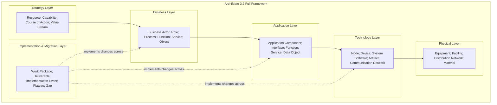

# Architecture Frameworks — DoDAF, TOGAF, ArchiMate, NAF, Zachman

**Frameworks:** DoDAF v2.02, TOGAF 10, ArchiMate 3.2, NAF v4, MODAF, Zachman Framework  
**Standards:** ISO/IEC/IEEE 42010:2022 (Architecture Description), ISO/IEC/IEEE 42020, ISO/IEC/IEEE 42030  
**SDOs:** The Open Group (TOGAF, ArchiMate), US DoD (DoDAF), NATO (NAF), UK MoD (MODAF)  
**Audience:** Enterprise architects, systems architects, defense/aerospace architects, MBSE practitioners  
**Prerequisites:** Basic systems engineering; familiarity with ISO 15288; understanding of stakeholder viewpoints

---

## Chapter 1 — Historical Context & Origin Story

### 1.1 Timeline

| Year | Milestone |
|------|-----------|
| 1987 | **Zachman Framework** published (John Zachman; IBM Systems Journal) — first enterprise architecture framework |
| 1994 | US DoD mandates **C4ISR Architecture Framework** (predecessor to DoDAF) |
| 1995 | **TOGAF 1.0** — The Open Group Architecture Framework (derived from US DoD TAFIM) |
| 2000 | IEEE 1471 — Recommended Practice for Architecture Description (first architecture description standard) |
| 2003 | **DoDAF 1.0** — Department of Defense Architecture Framework (replaces C4ISR AF) |
| 2004 | **MODAF** 1.0 — UK Ministry of Defence Architecture Framework (DoDAF adaptation for UK) |
| 2005 | **ArchiMate 1.0** — Modeling language for enterprise architecture (originated in Netherlands) |
| 2007 | **NAF v3** — NATO Architecture Framework (harmonizes DoDAF/MODAF for NATO) |
| 2009 | DoDAF 2.0 — shift from "products" to "data-centric" approach |
| 2010 | ArchiMate 2.0 — adopted by The Open Group |
| 2011 | ISO/IEC/IEEE 42010 — supersedes IEEE 1471 (international standard for architecture description) |
| 2012 | TOGAF 9.1 — widely adopted version |
| 2016 | ArchiMate 3.0 — adds Strategy and Implementation/Migration layers |
| 2018 | DoDAF 2.02 — current version |
| 2018 | **NAF v4** — major redesign; aligned with NATO standards |
| 2019 | ArchiMate 3.1 |
| 2022 | **TOGAF 10** (TOGAF Standard, 10th Edition) — modular structure |
| 2022 | **ArchiMate 3.2** — current version |
| 2022 | ISO/IEC/IEEE 42010:2022 — updated architecture description standard |

### 1.2 Why Architecture Frameworks?

**The problem:** Large systems (defense, enterprise, automotive platforms) involve:
- Multiple stakeholders with different concerns
- Thousands of components and interactions
- Multiple domains (business, IT, operational, physical)
- Long lifecycles (decades for defense/automotive)
- Interoperability requirements between systems-of-systems

**Without a framework:**
- Ad-hoc architecture descriptions; incomparable across programs
- Stakeholder concerns not addressed systematically
- Gap between strategy and implementation
- Architecture knowledge lost between program phases

**What a framework provides:**
1. **Viewpoints** — Predefined perspectives (operational, system, technical, etc.)
2. **Models** — Standard model types for each viewpoint
3. **Methodology** — Process for developing architecture (TOGAF ADM)
4. **Metamodel** — Data model relating architectural elements (DoDAF DM2, ArchiMate)
5. **Governance** — How to manage architecture over time

---

## Chapter 2 — ISO/IEC/IEEE 42010 Foundation

### 2.1 Core Concepts

```mermaid
graph TB
    subgraph "ISO/IEC/IEEE 42010:2022 Conceptual Model"
        SYS[System of Interest]
        ENV[Environment]
        ARCH[Architecture<br/>━━━━━━━━━━━<br/>Fundamental concepts or properties<br/>of a system in its environment<br/>embodied in its elements,<br/>relationships, and principles]
        
        AD[Architecture Description<br/>━━━━━━━━━━━<br/>Work product expressing<br/>the architecture]
        
        STK[Stakeholder<br/>━━━━━━━━━━━<br/>Individual, team, or organization<br/>with interest in the system]
        
        CONCERN[Concern<br/>━━━━━━━━━━━<br/>Interest in the system<br/>(functional, quality, constraint)]
        
        VP[Architecture Viewpoint<br/>━━━━━━━━━━━<br/>Work product establishing<br/>conventions for constructing,<br/>interpreting, and analyzing<br/>a view]
        
        VIEW[Architecture View<br/>━━━━━━━━━━━<br/>Work product expressing<br/>architecture from perspective<br/>of specific concerns]
        
        MODEL[Architecture Model<br/>━━━━━━━━━━━<br/>Model used in a view<br/>(diagram, matrix, table, etc.)]
    end
    
    SYS --- ENV
    SYS --- ARCH
    ARCH --- AD
    STK -->|"has"| CONCERN
    CONCERN -->|"framed by"| VP
    VP -->|"governs"| VIEW
    VIEW -->|"composed of"| MODEL
    AD -->|"contains"| VIEW
```

### 2.2 Key Terminology

| Term | Definition (ISO 42010) |
|:----:|---|
| **Architecture** | Fundamental concepts or properties of a system in its environment, embodied in its elements, relationships, and principles of its design and evolution |
| **Architecture Description** | A work product used to express an architecture |
| **View** | A work product expressing the architecture of a system from the perspective of specific system concerns |
| **Viewpoint** | A work product establishing the conventions for the construction, interpretation, and use of architecture views |
| **Model** | A representation of a subject of interest (used within views) |
| **Concern** | An interest in a system relevant to one or more stakeholders |
| **Architecture Framework** | Conventions, principles, and practices for the description of architectures established within a specific domain or community of stakeholders |

---

## Chapter 3 — DoDAF (Department of Defense Architecture Framework)

### 3.1 DoDAF Overview

| Aspect | Detail |
|:------:|--------|
| **Owner** | US Department of Defense (DoD) |
| **Version** | DoDAF 2.02 (2018) |
| **Purpose** | Support communication, decision-making, and interoperability across DoD programs |
| **Mandate** | Required for all DoD acquisition programs (JCIDS, DAS, PPBE) |
| **Approach** | Data-centric (DoDAF Meta-Model 2; DM2); viewpoints generate products from underlying data |
| **Scope** | Defense systems; C4ISR; systems-of-systems; joint/combined operations |

### 3.2 DoDAF Viewpoints

| Viewpoint | Abbreviation | Purpose | Key Models |
|:---------:|:---:|---|---|
| **All Viewpoint** | AV | Overarching; context; summary | AV-1 (Overview & Summary); AV-2 (Integrated Dictionary) |
| **Capability** | CV | What capabilities are needed (gap analysis) | CV-1 (Vision); CV-2 (Capability Taxonomy); CV-3 (Capability Phasing) |
| **Operational** | OV | Who does what; operational activities and information exchange | OV-1 (High-Level Graphic); OV-2 (Operational Resource Flow); OV-5 (Activity Model) |
| **Services** | SvcV | Service-oriented view; what services are provided | SvcV-1 (Service Context); SvcV-4 (Service Functionality); SvcV-6 (Service Resource Flow) |
| **Systems** | SV | System/platform structure and connectivity | SV-1 (System Interface); SV-2 (System Communication); SV-4 (System Functionality); SV-6 (System Resource Flow) |
| **Data & Information** | DIV | Data model; information exchange | DIV-1 (Conceptual Data Model); DIV-2 (Logical Data Model); DIV-3 (Physical Data Model) |
| **Standards** | StdV | Applicable standards and profiles | StdV-1 (Standards Profile); StdV-2 (Standards Forecast) |
| **Project** | PV | Acquisition; delivery; program timeline | PV-1 (Project Portfolio); PV-2 (Project to Capability Mapping); PV-3 (Project to Systems Mapping) |

### 3.3 Key DoDAF Models

```mermaid
graph TB
    subgraph "DoDAF Key Models"
        OV1[OV-1: High-Level Operational Graphic<br/>━━━━━━━━━━━<br/>• Operational context<br/>• Key players/nodes<br/>• Information exchanges<br/>• "Big picture" for decision-makers]
        
        OV2[OV-2: Operational Resource Flow<br/>━━━━━━━━━━━<br/>• Operational nodes<br/>• Needlines (information exchange)<br/>• Which nodes need what data from whom]
        
        OV5[OV-5a/b: Operational Activity Model<br/>━━━━━━━━━━━<br/>• Activities performed<br/>• Input/output flows<br/>• Activity decomposition<br/>• Rules/constraints]
        
        SV1[SV-1: Systems Interface Description<br/>━━━━━━━━━━━<br/>• System nodes<br/>• System connections<br/>• Interfaces between systems<br/>• Mapping: systems to operational nodes]
        
        SV4[SV-4: Systems Functionality<br/>━━━━━━━━━━━<br/>• System functions<br/>• Function-to-system allocation<br/>• Functional decomposition]
    end
    
    OV1 -->|"decomposes into"| OV2
    OV2 -->|"activities within"| OV5
    OV2 -->|"realized by"| SV1
    OV5 -->|"allocated to"| SV4
```

---

## Chapter 4 — TOGAF (The Open Group Architecture Framework)

### 4.1 TOGAF Overview

| Aspect | Detail |
|:------:|--------|
| **Owner** | The Open Group |
| **Version** | TOGAF Standard, 10th Edition (2022) |
| **Purpose** | Enterprise architecture method and framework for designing, planning, implementing, and governing enterprise information technology architecture |
| **Adoption** | 80% of Global 50 companies; most widely used EA framework |
| **Key component** | ADM (Architecture Development Method) — iterative lifecycle |
| **Certification** | TOGAF Certified (Level 1: Foundation; Level 2: Certified) |

### 4.2 ADM (Architecture Development Method)

```mermaid
graph TB
    subgraph "TOGAF ADM Cycle"
        PRELIM[Preliminary Phase<br/>━━━━━━━━━━━<br/>• Architecture capability<br/>• Principles; governance<br/>• Tools; frameworks; methods]
        
        A[Phase A: Architecture Vision<br/>━━━━━━━━━━━<br/>• Stakeholders; concerns; scope<br/>• High-level target architecture<br/>• Statement of Architecture Work<br/>• Approval to proceed]
        
        B[Phase B: Business Architecture<br/>━━━━━━━━━━━<br/>• Baseline business architecture<br/>• Target business architecture<br/>• Gap analysis]
        
        C[Phase C: Information Systems Architecture<br/>━━━━━━━━━━━<br/>C1: Data Architecture<br/>C2: Application Architecture<br/>• Baseline → Target → Gap]
        
        D[Phase D: Technology Architecture<br/>━━━━━━━━━━━<br/>• Infrastructure; platforms<br/>• Technology standards<br/>• Baseline → Target → Gap]
        
        E[Phase E: Opportunities & Solutions<br/>━━━━━━━━━━━<br/>• Implementation strategy<br/>• Work packages; projects<br/>• Transition architectures]
        
        F[Phase F: Migration Planning<br/>━━━━━━━━━━━<br/>• Detailed implementation plan<br/>• Prioritization; cost/benefit<br/>• Implementation roadmap]
        
        G[Phase G: Implementation Governance<br/>━━━━━━━━━━━<br/>• Architecture compliance<br/>• Change management<br/>• Implementation oversight]
        
        H[Phase H: Architecture Change Management<br/>━━━━━━━━━━━<br/>• Monitor technology changes<br/>• Assess impact<br/>• Manage architecture lifecycle]
        
        RM[Requirements Management<br/>(Central; supports all phases)]
    end
    
    PRELIM --> A --> B --> C --> D --> E --> F --> G --> H
    H -->|"new cycle"| A
    RM -.-> A
    RM -.-> B
    RM -.-> C
    RM -.-> D
```

### 4.3 TOGAF Content Framework

| Architecture Domain | What It Covers | Key Artifacts |
|:---:|---|---|
| **Business Architecture** | Business strategy, governance, organization, processes | Process maps; organization charts; business capabilities |
| **Data Architecture** | Logical and physical data structures; data management | Data models; data flow diagrams; data lifecycle |
| **Application Architecture** | Application portfolio; interactions; deployment | Application portfolio; communication diagrams; interface catalog |
| **Technology Architecture** | Hardware, software, network infrastructure | Technology standards; network diagrams; platform decomposition |

### 4.4 TOGAF Enterprise Continuum

| Level | Description | Example |
|:-----:|-------------|---------|
| **Foundation Architecture** | Generic; industry-neutral; building blocks | TCP/IP; SQL; REST; cloud infrastructure |
| **Common Systems Architecture** | Industry-standard components | ERP; CRM; messaging systems |
| **Industry Architecture** | Industry-specific | Automotive (AUTOSAR); aerospace (DO-178C); finance (SWIFT) |
| **Organization Architecture** | Organization-specific | Company's actual target architecture |

---

## Chapter 5 — ArchiMate (Modeling Language)

### 5.1 ArchiMate Overview

| Aspect | Detail |
|:------:|--------|
| **What** | An open and independent modeling language for enterprise architecture |
| **Owner** | The Open Group (since 2009) |
| **Version** | ArchiMate 3.2 (2022) |
| **Relationship to TOGAF** | ArchiMate is the modeling language; TOGAF is the method. They complement each other. |
| **Purpose** | Provide uniform representation for architecture diagrams across domains (business, application, technology) |
| **Tools** | Archi (free/open-source); BiZZdesign; Sparx EA; LeanIX; MEGA |

### 5.2 ArchiMate Core Framework (3 Layers × 3 Aspects)

| | **Active Structure** (who/what does it) | **Behavior** (what is done) | **Passive Structure** (on what) |
|:---:|:---:|:---:|:---:|
| **Business Layer** | Business Actor, Business Role, Business Interface | Business Process, Business Function, Business Service | Business Object, Contract, Product |
| **Application Layer** | Application Component, Application Interface | Application Function, Application Service, Application Process | Data Object |
| **Technology Layer** | Node, Device, System Software, Technology Interface | Technology Function, Technology Service, Technology Process | Artifact |

### 5.3 ArchiMate Full Framework (with Strategy & Implementation)



### 5.4 ArchiMate Relationships

| Relationship | Notation | Meaning | Example |
|:---:|:---:|---|---|
| **Composition** | Filled diamond → | Part of (strong ownership) | Application Component → (composed of) Application Function |
| **Aggregation** | Open diamond → | Part of (weak ownership) | Business Role → (aggregates) Business Actor |
| **Assignment** | Filled circle → filled arrowhead | Allocated to; performs | Business Actor → (assigned to) Business Process |
| **Realization** | Open arrowhead, dashed | Realizes/implements | Application Service → (realizes) Business Service |
| **Serving** | Open arrowhead, solid | Provides functionality to | Application Service → (serves) Business Process |
| **Access** | Dashed → | Reads/writes data | Application Function → (accesses) Data Object |
| **Triggering** | Filled arrowhead | Causes; initiates | Business Event → (triggers) Business Process |
| **Flow** | Dashed, labeled → | Transfer of content | Application Component → (flows "message") → Application Component |

---

## Chapter 6 — NATO Architecture Framework (NAF v4)

### 6.1 NAF Overview

| Aspect | Detail |
|:------:|--------|
| **Owner** | NATO (C3 Board) |
| **Version** | NAF v4 (2018) |
| **Purpose** | Support development of architectures for NATO operations and programs; enable interoperability across allied nations |
| **Relationship to DoDAF** | NAF v3 was aligned with DoDAF 2.0. NAF v4 restructured independently (but concepts are similar) |
| **Key feature** | Grid-based structure (views × aspects); supports federated architecture |

### 6.2 NAF v4 Views

| View | Code | Purpose |
|:----:|:----:|---------|
| **Concepts** | C | Doctrine; concepts of operation; high-level military context |
| **Service** | S | Service-oriented; what services are exposed/consumed |
| **Operational** | L (Logical) | Operational activities; information exchanges; who does what |
| **Architecture** | A (Architecture) | Technical systems; platforms; connectivity |
| **Programme** | P | Acquisition; projects; capability delivery timeline |
| **Information** | I | Data models; information requirements; semantics |
| **Standards** | Pr (Profiles) | Applicable standards; interoperability profiles (NISP) |

### 6.3 NAF v4 vs DoDAF

| Aspect | DoDAF 2.02 | NAF v4 |
|:------:|:-----------:|:------:|
| **Organization** | 8 viewpoints | 7 views (grid structure) |
| **Data model** | DM2 (DoDAF Meta-Model) | NCIA ontology (aligned with OARIS) |
| **Scope** | US DoD (single nation) | NATO (multi-nation; federation) |
| **Interoperability** | Program-level | Alliance-level (NISP profiles) |
| **Service orientation** | SvcV viewpoint | Dedicated Service view (S) |
| **Tooling** | Cameo EA; DOORS; Sparx | Cameo EA; Sparx; NATO Architecture Repository |

---

## Chapter 7 — Zachman Framework

### 7.1 Overview

| Aspect | Detail |
|:------:|--------|
| **Creator** | John Zachman (1987; IBM background) |
| **What** | Classification framework (taxonomy) for enterprise architecture artifacts |
| **Structure** | 6×6 matrix: 6 perspectives (rows) × 6 interrogatives (columns) |
| **Key insight** | Not a methodology (no process); a schema for organizing architecture knowledge |
| **Analogy** | "Periodic table of architecture" — classifies, doesn't prescribe order |

### 7.2 Zachman Matrix

| | **What** (Data) | **How** (Function) | **Where** (Network) | **Who** (People) | **When** (Time) | **Why** (Motivation) |
|:---:|:---:|:---:|:---:|:---:|:---:|:---:|
| **Scope (Planner)** | List of things | List of processes | List of locations | List of organizations | List of events | List of goals |
| **Business Model (Owner)** | Semantic model | Business process model | Business logistics | Workflow model | Master schedule | Business plan |
| **System Model (Designer)** | Logical data model | Application architecture | Distributed system architecture | Human interface architecture | Processing structure | Business rule model |
| **Technology Model (Builder)** | Physical data model | System design | Technology architecture | Presentation architecture | Control structure | Rule design |
| **Detailed Representation (Subcontractor)** | Data definition | Program | Network architecture | Security architecture | Timing definition | Rule specification |
| **Functioning Enterprise** | Data | Function | Network | Organization | Schedule | Strategy |

---

## Chapter 8 — Comparison of Frameworks

### 8.1 Head-to-Head

| Criterion | DoDAF | TOGAF | ArchiMate | NAF | Zachman |
|:---------:|:-----:|:-----:|:---------:|:---:|:-------:|
| **Type** | Architecture framework | Architecture method + framework | Modeling language | Architecture framework | Classification taxonomy |
| **Domain** | Defense/military | Enterprise (any industry) | Enterprise (any industry) | NATO defense | Enterprise (conceptual) |
| **Includes methodology?** | Partially (six-step process) | Yes (ADM cycle) | No (language only) | Partially | No |
| **Modeling language?** | Not prescribed (uses UML/SysML) | Not prescribed (recommends ArchiMate) | YES (this IS the language) | Not prescribed | No |
| **Viewpoints** | 8 (AV, CV, OV, SvcV, SV, DIV, StdV, PV) | 4 domains (Bus, App, Data, Tech) | 6 layers (Strategy→Physical) | 7 views (C, S, L, A, P, I, Pr) | 6×6 matrix cells |
| **Certification** | No formal certification | TOGAF Certified (Foundation + Certified) | ArchiMate Certified (Foundation + Practitioner) | No formal certification | ZAEC certification |
| **Tooling** | Cameo, Sparx, System Architect | Many (BiZZdesign, Sparx, LeanIX, MEGA) | Archi (free), BiZZdesign, Sparx | Cameo, Sparx | General (Excel, repository) |
| **Typical user** | Defense architect; systems engineer | Enterprise architect (CIO office) | EA modeler; analyst | NATO/allied defense architect | Academic; conceptual framework user |
| **Strength** | Comprehensive for defense SoS | Most adopted; enterprise-wide method | Formal; visual; layered | Multi-national interoperability | Complete classification |
| **Weakness** | Complex; defense-specific | Process-heavy; can be bureaucratic | No methodology (need TOGAF/other) | Niche (NATO only) | No methodology; no notation |

### 8.2 When to Use What

| Scenario | Recommended Framework | Reason |
|:--------:|:---------------------:|--------|
| **Defense/military acquisition** | DoDAF (US) / NAF (NATO) / MODAF (UK) | Mandated; interoperability standards; capability gap analysis |
| **Enterprise IT transformation** | TOGAF + ArchiMate | Comprehensive method (ADM) + standard notation; industry de facto |
| **Automotive platform architecture** | ISO 42010 + SysML + AUTOSAR metamodel | Domain-specific; systems engineering; hardware-software co-design |
| **Academic classification** | Zachman | Understand what kinds of artifacts exist; completeness check |
| **Quick architecture visualization** | ArchiMate | Light; layered; tool support (Archi is free) |
| **Agile enterprise architecture** | TOGAF + Lean EA principles | ADM can be iterated; "just enough architecture" |

---

## Chapter 9 — Case Studies

### 9.1 Defense: Joint Tactical System Architecture (DoDAF)

| Aspect | Detail |
|--------|--------|
| **Program** | Joint tactical radio system; multi-service (Army, Navy, Air Force, Marines) |
| **Challenge** | 4 services, 12 legacy systems, 3 allied nations must interoperate. No common architecture → incompatible data formats, conflicting frequencies, duplicated capabilities. |
| **DoDAF application** | Created architecture using DoDAF 2.02: AV-1 (overview); OV-1 (operational concept showing joint scenario); OV-2 (information flows between services); SV-1 (system interfaces); SV-6 (data flows); StdV-1 (STANAG profiles). |
| **Key finding from OV-2** | Identified 47 needlines; 12 were unsatisfied (no current system provides required data exchange). Led to capability gap identification → drove acquisition priorities. |
| **Outcome** | Architecture used by JCIDS to justify new program funding; interoperability requirements flowed to system specifications; test scenarios derived from OV-5 activity models. |
| **Lesson** | DoDAF's value = forcing structured analysis of who-needs-what-from-whom (OV-2) before buying systems (SV-1). Without it: buy systems that can't interoperate. |

### 9.2 Enterprise: Insurance Company Digital Transformation (TOGAF + ArchiMate)

| Aspect | Detail |
|--------|--------|
| **Organization** | Large insurance company; 200+ applications; €500M IT budget |
| **Challenge** | Digital transformation: move from legacy mainframe to cloud-native microservices. Board needs: roadmap, cost justification, risk assessment. |
| **TOGAF ADM application** | Phase A (Vision): Cloud-first strategy; target architecture in 3 years. Phase B (Business): Map business capabilities to applications. Phase C (Application): Baseline: 200 apps; Target: 45 microservices + SaaS. Phase D (Technology): Target: Kubernetes; AWS; API Gateway. Phase E (Opportunities): 8 work packages; 3 transition architectures (waves). Phase F (Migration): 3-year roadmap; wave 1 (customer portal); wave 2 (claims); wave 3 (underwriting). |
| **ArchiMate models** | Business layer: business capabilities mapped to value streams. Application layer: baseline (200 apps) → target (45 services); colored by status (keep/replace/retire). Technology layer: baseline (mainframe + VMs) → target (K8s clusters). Implementation layer: work packages; plateaus (transition architectures). |
| **Key outcome** | ArchiMate layered view showed board exactly: which business processes are impacted; which applications change; which infrastructure shifts; in what sequence. €500M justified with clear capability-to-technology traceability. |
| **Lesson** | TOGAF provides the structure (what to think about); ArchiMate provides the visualization (how to communicate). Together they are powerful for stakeholder buy-in. |

---

## Chapter 10 — Future Evolution

| Trend | Timeline | Impact |
|-------|----------|--------|
| **Digital twin architecture** | 2024-2028 | Architecture models become "living" (connected to runtime systems); ArchiMate models auto-update from infrastructure state |
| **AI-assisted architecture** | 2024-2027 | AI generates architecture options; evaluates trade-offs; detects anti-patterns in ArchiMate models |
| **TOGAF modularization** | 2022+ (now) | TOGAF 10 is modular; organizations pick relevant modules; less "all or nothing" |
| **ArchiMate 4.0** | 2025-2026 | Expected: better IoT/OT modeling; improved strategy layer; digital thread support |
| **Architecture as Code** | 2024-2027 | Architecture described in DSLs (Structurizr, C4-PlantUML); version-controlled; CI/CD for architecture |
| **Unified defense framework** | 2025-2030 | NATO pushing for harmonized DoDAF/NAF/MODAF; single allied architecture ecosystem |
| **SysML v2 + EA frameworks** | 2025-2028 | SysML v2 provides API-based modeling; bridges system architecture with enterprise architecture |
| **Sustainability architecture** | 2024-2028 | New viewpoints for carbon footprint, energy efficiency, circular economy in architecture frameworks |

---

## Chapter 11 — Interview Questions & Career Guide

### Tier 1: Entry-Level

**Q1:** What is the difference between a viewpoint and a view in ISO 42010?

**A:**

| Concept | Viewpoint | View |
|:-------:|-----------|------|
| **Definition** | A set of conventions (templates, model kinds, rules) for constructing and interpreting an architecture view | A representation of the architecture from a particular perspective of concern |
| **Analogy** | The RECIPE (how to make a cake) | The CAKE itself (made from the recipe) |
| **Reusable?** | Yes — same viewpoint used across many architectures | No — specific to one architecture |
| **Example** | "Operational Viewpoint" (defines: what models to create, what notation, what stakeholders use it) | "System X Operational View" (actual OV-1, OV-2 diagrams for System X) |
| **Who defines?** | Architecture framework (DoDAF, TOGAF, etc.) | Architect (for specific project) |
| **Relationship** | One viewpoint → many views (one per system using that viewpoint) | One view → created according to one viewpoint |

**Key point:** The viewpoint is the TEMPLATE; the view is the INSTANCE. ISO 42010 separates them to enable reuse of viewpoint conventions across projects.

### Tier 2: Mid-Level

**Q2:** Compare DoDAF and TOGAF. When would you use each?

**A:**

| Criterion | DoDAF | TOGAF |
|:---------:|:-----:|:-----:|
| **Domain** | Defense/military/government | Enterprise IT (any industry) |
| **Focus** | Systems-of-systems; interoperability; capability gaps | Business-IT alignment; transformation roadmap |
| **Methodology** | Lightweight (6-step); data-centric | Heavy (ADM: 8 phases + preliminary); process-centric |
| **Viewpoints** | 8 (operational, systems, services, capability, data, standards, project, all) | 4 domains (business, data, application, technology) |
| **Metamodel** | DM2 (formal; relational) | Content framework (architectural building blocks) |
| **Mandated?** | Yes (US DoD policy; JCIDS) | No (voluntary; industry standard) |
| **Certification** | No | Yes (Foundation + Certified levels) |
| **Typical output** | OV-1 briefing chart; SV-1 interface diagram; capability gap analysis | ADM deliverables; transition architecture roadmap; compliance review |

**When to use DoDAF:**
- US military/intelligence programs (mandated)
- Systems-of-systems with interoperability requirements
- Multi-program capability gap analysis
- Joint/combined operations architecture

**When to use TOGAF:**
- Enterprise IT strategy and transformation
- Business-IT alignment
- Application portfolio rationalization
- Cloud migration roadmap
- Any organization wanting a structured EA method

**Can they coexist?** Yes. Large defense organizations often use TOGAF for enterprise IT governance + DoDAF for mission system architecture.

### Tier 3: Senior

**Q3:** Design an architecture governance process for a large automotive OEM transitioning to software-defined vehicles (SDV). Which frameworks/languages would you combine, and how?

**A:**

**Multi-framework approach for automotive SDV:**

| Architecture Concern | Framework/Language | Justification |
|:---:|:---:|---|
| **Enterprise strategy** | TOGAF (ADM Phases A-B) | Business capability mapping; investment roadmap; organization design |
| **Enterprise IT landscape** | ArchiMate 3.2 | Application portfolio; platform decisions (cloud, edge); technology standards |
| **Vehicle system architecture** | ISO 42010 + SysML v2 | System decomposition; HW/SW allocation; interface definitions (automotive-specific) |
| **Safety architecture** | ISO 26262 safety lifecycle | HARA → safety concept → allocation; not covered by enterprise frameworks |
| **SW platform architecture** | AUTOSAR Adaptive + custom viewpoints | Service-oriented; SDV-specific; runtime reconfiguration |
| **Interoperability** | Reference from TOGAF StdV (standards) | Communication standards (SOME/IP, DDS); OTA update architecture |

**Governance process:**

```
Phase 1: Architecture Vision (TOGAF Phase A)
  → Define SDV target architecture principles
  → Stakeholder map (Board, R&D, Manufacturing, Aftermarket)
  → Architecture governance charter

Phase 2: Domain Architectures (parallel)
  → Enterprise IT: ArchiMate models (cloud platform; DevOps; data lake)
  → Vehicle platform: SysML v2 models (compute; zones; domains)
  → Software platform: AUTOSAR Adaptive service architecture
  → Safety: ISO 26262 architecture (ASIL allocation; FFI)

Phase 3: Integration & Alignment
  → Cross-domain traceability (enterprise capability → vehicle feature → SW service → HW compute)
  → Conflict resolution (enterprise cloud vs. vehicle real-time constraints)
  → Standards harmonization (AUTOSAR + enterprise microservices)

Phase 4: Governance Operating Model
  → Architecture Review Board (monthly; cross-domain)
  → Compliance checks (before each program milestone: SOP gateway)
  → Architecture debt register (track deviations; plan remediation)
  → Federated architecture (each domain owns its models; enterprise aligns)
```

**Key tools:**
- Enterprise level: LeanIX (lightweight EA) or BiZZdesign (ArchiMate)
- Vehicle level: IBM Rhapsody or Cameo (SysML v2)
- Safety: Medini Analyze (safety analysis) + DOORS (traceability)
- Integration: Custom architecture repository with cross-domain links (OSLC)

---

## Chapter 12 — Cheat Sheet & Quick Reference

```
═══════════════════════════════════════════
ARCHITECTURE FRAMEWORKS — QUICK REFERENCE
═══════════════════════════════════════════

ISO/IEC/IEEE 42010:2022 (Foundation):
  Architecture = fundamental concepts/properties
  Architecture Description = work product
  View = perspective of concerns
  Viewpoint = conventions for creating views
  Model = representation within a view

═══════════════════════════════════════════
DoDAF 2.02 (US Defense):
  Viewpoints: AV, CV, OV, SvcV, SV, DIV, StdV, PV
  Key models: OV-1 (concept), OV-2 (needlines),
    SV-1 (interfaces), CV-2 (capability taxonomy)
  Data-centric: DM2 metamodel
  Mandated: US DoD acquisition

═══════════════════════════════════════════
TOGAF 10 (Enterprise):
  ADM Phases: Prelim → A (Vision) → B (Business) →
    C (IS: Data + App) → D (Technology) → E (Opportunities)
    → F (Migration) → G (Governance) → H (Change Mgmt)
  Requirements Management: central to all phases
  Content: Building Blocks (ABB = abstract; SBB = solution)
  Enterprise Continuum: Foundation → Common → Industry → Org

═══════════════════════════════════════════
ArchiMate 3.2 (Modeling Language):
  Layers: Strategy → Business → Application → Technology → Physical
  + Implementation & Migration layer
  Core aspects: Active Structure | Behavior | Passive Structure
  Key relationships: Serving, Realization, Composition,
    Assignment, Triggering, Flow, Access
  Tools: Archi (free), BiZZdesign, Sparx EA

═══════════════════════════════════════════
NAF v4 (NATO):
  Views: C (Concepts), S (Service), L (Logical/Operational),
    A (Architecture), P (Programme), I (Information), Pr (Profiles)
  Focus: multi-nation interoperability
  Standards: NISP (NATO Interoperability Standards Profiles)

═══════════════════════════════════════════
ZACHMAN FRAMEWORK:
  6×6 matrix:
    Rows: Planner → Owner → Designer → Builder → Subcontractor → Enterprise
    Columns: What, How, Where, Who, When, Why
  NOT a methodology — a classification taxonomy
  No notation; no process; organizes artifacts

═══════════════════════════════════════════
WHEN TO USE WHAT:
  Defense/military → DoDAF (US) / NAF (NATO)
  Enterprise IT → TOGAF + ArchiMate
  Automotive systems → ISO 42010 + SysML
  Quick visualization → ArchiMate (Archi tool)
  Completeness check → Zachman matrix
  Multi-domain → combine (TOGAF enterprise + SysML system)

═══════════════════════════════════════════
CERTIFICATIONS:
  TOGAF: Foundation (Level 1) + Certified (Level 2)
  ArchiMate: Foundation + Practitioner
  ZAEC: Zachman Enterprise Architecture Certification
  DoDAF: no formal cert (but DAU courses)
```

---

*End of Document — 07_Architecture_Frameworks.md*
