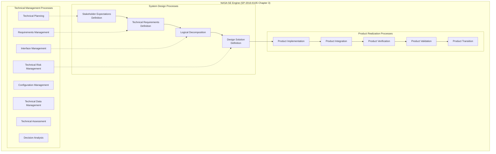
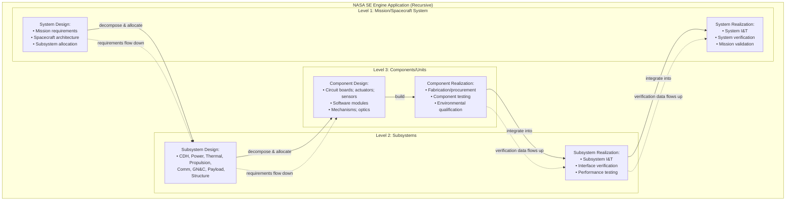

# NASA Systems Engineering Handbook — SP-2016-6105 Rev2

**Document:** NASA Systems Engineering Handbook (NASA/SP-2016-6105 Rev2)  
**Organization:** National Aeronautics and Space Administration (NASA)  
**Related:** NPR 7123.1 (NASA SE processes), ISO/IEC/IEEE 15288, INCOSE SE Handbook  
**Domain:** Space systems, launch vehicles, ground systems, science missions, human spaceflight  
**Audience:** Systems engineers, mission architects, project managers, NASA civil servants, NASA contractors  
**Prerequisites:** Basic SE concepts; familiarity with project lifecycle; understanding of technical reviews

---

## Chapter 1 — Historical Context & Origin Story

### 1.1 Timeline

| Year | Milestone |
|------|-----------|
| 1995 | **NASA/SP-6105** — First NASA Systems Engineering Handbook published |
| 2007 | **NASA/SP-2007-6105 Rev1** — Major revision; aligned with NPR 7123.1A |
| 2008 | NPR 7123.1A — NASA Systems Engineering Processes and Requirements |
| 2013 | NPR 7123.1B — Updated SE requirements |
| 2016 | **NASA/SP-2016-6105 Rev2** — Current edition; significant restructuring; lessons from missions |
| 2020 | NPR 7123.1C — Latest NASA SE procedural requirements |
| 2023 | Ongoing updates aligned with Artemis program lessons learned |

### 1.2 Why NASA Needs Its Own SE Handbook

**NASA's unique challenges:**
- **One-of-a-kind systems:** Spacecraft are not mass-produced; each mission is unique
- **Extreme environments:** Vacuum, radiation, thermal extremes, micro-gravity, re-entry heat
- **No maintenance:** Once launched, you cannot physically repair (except ISS/servicing missions)
- **Long development cycles:** 5-15 years from concept to launch
- **High consequence of failure:** $500M-$2B+ missions; human lives; national prestige
- **Science-driven requirements:** Requirements evolve as science questions refine
- **Multi-center coordination:** JPL, GSFC, JSC, MSFC, KSC — different cultures; same mission

**Key NASA failures that drove SE improvement:**
| Mission | Year | Failure | SE Lesson |
|:-------:|:----:|---------|-----------|
| Mars Climate Orbiter | 1999 | Units mismatch (lb-s vs N-s) | Interface management; verification at system level |
| Columbia (STS-107) | 2003 | Foam impact not analyzed as hazard | Risk acceptance culture; FHA completeness |
| Genesis | 2004 | Accelerometer installed upside-down | Integration verification; workmanship |
| James Webb ST | 2011-2021 | 14-year delay; cost overrun ($1B→$10B) | Requirements creep; complexity management |

---

## Chapter 2 — Handbook Architecture & Structure

### 2.1 Document Structure

| Chapter | Content |
|:-------:|---------|
| 1 | Introduction; purpose; scope |
| 2 | **NASA Program/Project Life Cycle** — Phases (Pre-A through F); KDPs; reviews |
| 3 | **SE Engine** — 17 SE processes (common technical processes) |
| 4 | **Crosscutting Topics** — Technical management; integration; risk; decision analysis |
| 5 | **Special Topics** — Software; human systems; science missions; heritage reuse |
| 6 | **SE Management** — Roles; planning; metrics; lessons learned |
| Appendices | Templates; checklists; review criteria; metrics examples |

### 2.2 NASA Project Life Cycle

```mermaid
graph LR
    subgraph "NASA Project Life Cycle (NPR 7120.5)"
        subgraph "Formulation"
            PreA[Pre-Phase A<br/>━━━━━━━━━━━<br/>CONCEPT STUDIES<br/>• Mission concept<br/>• Science objectives<br/>• Feasibility studies<br/>• Trade studies<br/>━━━━━━━━━━━<br/>Exit: MCR/MDR]
            
            A[Phase A<br/>━━━━━━━━━━━<br/>CONCEPT & TECHNOLOGY<br/>DEVELOPMENT<br/>• System requirements<br/>• Concept maturation<br/>• Technology readiness<br/>• Risk reduction<br/>━━━━━━━━━━━<br/>Exit: SRR/SDR]
            
            B[Phase B<br/>━━━━━━━━━━━<br/>PRELIMINARY DESIGN &<br/>TECHNOLOGY COMPLETION<br/>• Preliminary design<br/>• Heritage assessment<br/>• Prototype/brassboard<br/>• Tech demonstration<br/>━━━━━━━━━━━<br/>Exit: PDR]
        end
        
        subgraph "Implementation"
            C[Phase C<br/>━━━━━━━━━━━<br/>FINAL DESIGN &<br/>FABRICATION<br/>• Detailed design<br/>• Fabrication<br/>• Unit/component test<br/>━━━━━━━━━━━<br/>Exit: CDR]
            
            D[Phase D<br/>━━━━━━━━━━━<br/>SYSTEM ASSEMBLY,<br/>I&T, LAUNCH<br/>• Integration<br/>• System testing<br/>• Environmental test<br/>• Launch operations<br/>━━━━━━━━━━━<br/>Exit: SIR/ORR/FRR]
        end
        
        subgraph "Operations"
            E[Phase E<br/>━━━━━━━━━━━<br/>OPERATIONS &<br/>SUSTAINMENT<br/>• Mission operations<br/>• Data analysis<br/>• In-orbit checkout<br/>• Anomaly resolution]
            
            F[Phase F<br/>━━━━━━━━━━━<br/>CLOSEOUT<br/>• Decommissioning<br/>• Disposal (de-orbit;<br/>  graveyard orbit)<br/>• Lessons learned<br/>• Data archival]
        end
    end
    
    PreA --> A --> B --> C --> D --> E --> F
```

### 2.3 Key Decision Points (KDPs) and Reviews

| Phase Exit | Review | Key Question Answered |
|:---:|:---:|---|
| Pre-A → A | MCR/MDR (Mission Concept/Definition Review) | "Is the concept feasible and worth pursuing?" |
| A → B | SRR/SDR (System Requirements / Definition Review) | "Are requirements complete, consistent, and achievable?" |
| B → C | PDR (Preliminary Design Review) | "Can we build it? Is the design mature enough to proceed to detailed design?" |
| C → D | CDR (Critical Design Review) | "Is the design complete? Can we fabricate/integrate?" |
| D → E | SIR (System Integration Review); ORR (Operational Readiness Review); FRR (Flight Readiness Review) | "Is it built right? Ready to operate/launch?" |
| E → F | DR (Decommissioning Review) | "Is the mission complete? Safe to dispose?" |

---

## Chapter 3 — NASA SE Engine (17 Processes)

### 3.1 SE Process Categories



### 3.2 Process Details

| # | Process | Purpose | Key Activities |
|:-:|:-------:|---------|----------------|
| 1 | Stakeholder Expectations | Capture what stakeholders need | Identify stakeholders; elicit needs; establish mission success criteria |
| 2 | Technical Requirements | Transform expectations into technical requirements | Requirements analysis; allocation; spec writing; measurability check |
| 3 | Logical Decomposition | Decompose system into logical elements | Functional decomposition; behavioral modeling; architecture trade studies |
| 4 | Design Solution | Create physical design | Design trades; technology selection; make/buy decisions; heritage assessment |
| 5 | Product Implementation | Build/code/fabricate | Manufacturing; coding; procurement; assembly |
| 6 | Product Integration | Assemble products into system | Integration planning; progressive build-up; interface verification |
| 7 | Product Verification | Confirm "built right" (meets requirements) | Test; analysis; inspection; demonstration (TAID) |
| 8 | Product Validation | Confirm "built the right thing" (meets stakeholder expectations) | End-to-end testing; mission simulation; operational scenarios |
| 9 | Product Transition | Transfer to operations | Operator training; logistics; operational procedures; handoff |
| 10 | Technical Planning | Plan SE activities | SE plan; WBS; SE schedule; resource planning |
| 11 | Requirements Management | Manage requirements lifecycle | Traceability; change control; impact analysis; status tracking |
| 12 | Interface Management | Manage interfaces between elements | ICD development; interface working groups; N² diagram |
| 13 | Technical Risk Management | Identify and mitigate technical risks | Risk identification (5×5 matrix); mitigation plans; tracking |
| 14 | Configuration Management | Control configuration | Baselines; change control; status accounting; audits |
| 15 | Technical Data Management | Manage technical data and documents | Data plans; deliverables; metrics data; archives |
| 16 | Technical Assessment | Monitor technical progress | TPM tracking; margin management; maturity assessment; technical reviews |
| 17 | Decision Analysis | Make informed decisions | Trade studies; AHP; weighted criteria; cost-benefit analysis |

---

## Chapter 4 — Technical Performance Measures (TPMs) & Margins

### 4.1 TPM Management

| Concept | Definition | Example |
|:-------:|------------|---------|
| **TPM** | Quantitative measure of how well a system satisfies a key requirement | Mass budget; power budget; data rate; pointing accuracy |
| **Allocation** | Distribution of total budget to subsystems | Total mass 2000 kg: Structure 400 kg; Propulsion 600 kg; Payload 500 kg; etc. |
| **Margin** | Difference between allocation and current best estimate (CBE) | Allocated 400 kg for structure; CBE = 350 kg → Margin = 50 kg (12.5%) |
| **Reserve** | System-level held-back amount for unknowns | Total mass allocation 2000 kg but total budget is 2200 kg → 200 kg system reserve |
| **Tracking** | Monitor TPMs over project lifecycle | Plot CBE vs. allocation over time; flag trends |

### 4.2 NASA Margin Guidelines

| Lifecycle Phase | Recommended Margin (on CBE) | Rationale |
|:---:|:---:|---|
| Pre-Phase A | ≥ 40% | High uncertainty; concept-level estimates |
| Phase A | ≥ 30% | Better fidelity; still significant unknowns |
| Phase B (PDR) | ≥ 25% | Preliminary design; prototypes reduce uncertainty |
| Phase C (CDR) | ≥ 15% | Detailed design; most unknowns resolved |
| Phase D (delivery) | ≥ 5% | Final; as-built margins; growth contained |

### 4.3 Mass Budget Example (Spacecraft)

| Subsystem | Allocation (kg) | CBE (kg) | Margin (kg) | Margin % |
|:---------:|:---:|:---:|:---:|:---:|
| Structure | 400 | 350 | 50 | 12.5% |
| Propulsion | 600 | 580 | 20 | 3.3% ⚠️ |
| Power (solar array + battery) | 300 | 270 | 30 | 10.0% |
| Avionics (C&DH) | 100 | 85 | 15 | 15.0% |
| Communications | 80 | 72 | 8 | 10.0% |
| Thermal | 120 | 105 | 15 | 12.5% |
| Payload (instrument) | 500 | 470 | 30 | 6.0% |
| **Subtotal** | **2100** | **1932** | **168** | **8.0%** |
| System Reserve | 200 | — | — | — |
| **Launch Capability** | **2300** | — | **368** | **16.0%** |

---

## Chapter 5 — Verification & Validation (V&V)

### 5.1 NASA V&V Philosophy

```mermaid
graph TB
    subgraph "NASA Verification & Validation"
        subgraph "Verification ('Did we build it right?')"
            VER_M[Verification Methods (TAID):<br/>━━━━━━━━━━━<br/>• TEST — Exercise and observe<br/>• ANALYSIS — Mathematical/simulation<br/>• INSPECTION — Visual examination<br/>• DEMONSTRATION — Show it works<br/>  (in operational-like conditions)]
        end
        
        subgraph "Validation ('Did we build the right thing?')"
            VAL_M[Validation Approaches:<br/>━━━━━━━━━━━<br/>• End-to-end mission simulation<br/>• Hardware-in-the-loop (HITL)<br/>• Day-in-the-life testing<br/>• Operational readiness test<br/>• Science team confirmation]
        end
        
        subgraph "Verification Levels (progressive)"
            UL[Unit/Component Level<br/>• Individual hardware pieces<br/>• Software modules<br/>• Environmental testing (thermal vac; vibration)]
            SL[Subsystem Level<br/>• Integrated subsystem performance<br/>• Interface verification<br/>• Functional testing]
            SYSL[System Level<br/>• Full system assembled<br/>• End-to-end functional test<br/>• Environmental qualification<br/>• EMI/EMC; thermal; structural]
            MSL[Mission Level<br/>• Operations simulation<br/>• Ground system integration<br/>• Launch rehearsal<br/>• Mission-critical scenario testing]
        end
    end
    
    UL --> SL --> SYSL --> MSL
    VER_M -.->|"applied at each level"| UL
    VAL_M -.->|"primarily at"| MSL
```

### 5.2 Environmental Testing (Spacecraft)

| Test | Purpose | Typical Sequence | Standard |
|:----:|---------|:-:|---|
| **Thermal Vacuum (TVAC)** | Verify operation in space thermal + vacuum environment | System-level; after integration | GSFC-STD-7000 |
| **Vibration** | Verify structural integrity under launch loads | Component → subsystem → system | NASA-STD-7001/7002 |
| **Acoustic** | Simulate launch acoustic environment (high-frequency) | System-level | NASA-STD-7001 |
| **Shock** | Simulate pyrotechnic events (stage separation, deployment) | Component level | NASA-STD-7003 |
| **EMI/EMC** | Verify electromagnetic compatibility | System-level; all modes active | MIL-STD-461/462; NASA-HDBK-4001 |
| **Mass properties** | Verify mass, CG, MOI | System-level (post-integration) | Facility-dependent |

### 5.3 Test-Like-You-Fly (TLYF)

| Principle | Description |
|:---------:|-------------|
| **Test Like You Fly** | Test conditions should replicate flight conditions as closely as possible |
| **Fly Like You Test** | Flight operations should not deviate from tested configurations |
| **Test What You Fly** | The actual flight hardware/software should be tested (not a look-alike) |
| **Fly What You Test** | Don't change hardware/software after testing without re-verification |

---

## Chapter 6 — Risk Management (NASA Approach)

### 6.1 NASA 5×5 Risk Matrix

| | **Likelihood 1** (Very Unlikely) | **Likelihood 2** (Unlikely) | **Likelihood 3** (Possible) | **Likelihood 4** (Likely) | **Likelihood 5** (Near Certain) |
|:---:|:---:|:---:|:---:|:---:|:---:|
| **Consequence 5** (Loss of mission/life) | 🟡 Moderate | 🟠 High | 🔴 Very High | 🔴 Very High | 🔴 Very High |
| **Consequence 4** (Major mission impact) | 🟢 Low | 🟡 Moderate | 🟠 High | 🔴 Very High | 🔴 Very High |
| **Consequence 3** (Moderate impact) | 🟢 Low | 🟡 Moderate | 🟡 Moderate | 🟠 High | 🟠 High |
| **Consequence 2** (Minor impact) | 🟢 Low | 🟢 Low | 🟡 Moderate | 🟡 Moderate | 🟠 High |
| **Consequence 1** (Negligible) | 🟢 Low | 🟢 Low | 🟢 Low | 🟡 Moderate | 🟡 Moderate |

### 6.2 Risk Handling Strategies

| Strategy | When Used | Example |
|:--------:|-----------|---------|
| **Accept** | Low risk; cost of mitigation exceeds benefit | Minor schedule risk with adequate reserve |
| **Mitigate** | Risk can be reduced to acceptable level | Add thermal blanket to reduce hot-case temperature |
| **Watch** | Risk not yet fully characterized; monitor triggers | Technology maturation uncertain; watch TRL advancement |
| **Research** | Insufficient data to assess probability/consequence | New material; insufficient heritage; run coupon tests |
| **Transfer** | Another party better positioned to manage | Transfer design risk to supplier; transfer schedule risk to later phase |
| **Avoid** | Eliminate risk source entirely | Use proven heritage component instead of new technology |

---

## Chapter 7 — Technical Reviews (NASA Review Process)

### 7.1 NASA Standard Review Flow

| Review | Phase Exit | Key Evaluation Criteria |
|:------:|:---:|---|
| **MCR** (Mission Concept Review) | Pre-A start | Feasibility; alignment with strategic objectives; preliminary resource estimate |
| **MDR** (Mission Definition Review) | Pre-A → A | Refined concept; science traceability matrix; technology assessment |
| **SRR** (System Requirements Review) | A → B | Requirements complete, consistent, verifiable, traceable; risks identified; ConOps defined |
| **SDR** (System Definition Review) | A → B (alternative to SRR) | System architecture defined; key trades completed; requirements allocated |
| **PDR** (Preliminary Design Review) | B → C | Design can meet requirements; critical items identified; test approach defined; risks mitigated to acceptable level |
| **CDR** (Critical Design Review) | C → D | Design complete to fabrication level; all interfaces defined; test procedures written; no open design issues |
| **TRR** (Test Readiness Review) | Before test campaign | Test procedures approved; facility ready; success criteria defined; go/no-go for test |
| **SIR** (System Integration Review) | D milestone | Integration plan complete; facilities ready; procedures validated; workforce trained |
| **ORR** (Operational Readiness Review) | D → E | Ground system ready; procedures validated; personnel trained; contingency plans |
| **FRR** (Flight Readiness Review) | D → E (launch) | Flight system verified; risks accepted; launch constraints met; GO for launch |
| **PSR** (Post-launch/mission assessment) | E (periodic) | Mission performance vs. requirements; anomalies resolved; extended mission viability |
| **DR** (Decommissioning Review) | E → F | End-of-life plan; disposal compliance; data archived; lessons documented |

### 7.2 Review Board Composition

| Role | Responsibility |
|:----:|----------------|
| **Review Chair** | Leads review; ensures all RFAs addressed; makes recommendation (pass/fail/conditional) |
| **Review Board Members** | Technical experts; independent from project team; evaluate evidence |
| **Presenting Team** | Project team presents design/status; answers questions |
| **RFA/RID Authors** | Write Review Item Discrepancies (RIDs) or Requests for Action (RFAs) |
| **Standing Review Board (SRB)** | Independent body that reviews project at each KDP; advises mission directorate |

---

## Chapter 8 — Architecture Diagrams

### 8.1 NASA SE Process Application Model



### 8.2 Interface Management (N² Diagram Concept)

```mermaid
graph LR
    subgraph "N² Diagram (simplified example)"
        CDH[C&DH<br/>(Command & Data Handling)]
        PWR[Power<br/>(EPS)]
        COMM[Communications<br/>(RF)]
        GNC[GN&C<br/>(Guidance Nav Control)]
        PROP[Propulsion]
        THERM[Thermal]
        PL[Payload<br/>(Instrument)]
    end
    
    CDH -->|"commands; telemetry"| GNC
    CDH -->|"data relay"| COMM
    CDH -->|"power commands"| PWR
    CDH -->|"science data"| PL
    CDH -->|"valve commands"| PROP
    CDH -->|"heater commands"| THERM
    PWR -->|"regulated power"| CDH
    PWR -->|"regulated power"| COMM
    PWR -->|"regulated power"| GNC
    PWR -->|"regulated power"| PL
    GNC -->|"attitude data"| CDH
    GNC -->|"thruster commands"| PROP
    GNC -->|"pointing data"| PL
    COMM -->|"uplinked commands"| CDH
    PL -->|"science data"| CDH
```

---

## Chapter 9 — Case Studies

### 9.1 Mars Science Laboratory (Curiosity Rover)

| Aspect | Detail |
|--------|--------|
| **Mission** | MSL/Curiosity; Mars surface rover; 2012 landing; still operating (2024+) |
| **SE challenges** | Novel entry/descent/landing (EDL): Sky Crane concept (never flown before). 900 kg rover; 7 minutes of terror. |
| **Requirements engineering** | 4,500+ system requirements; flowed down to 10 subsystems (mobility, sampling, instruments, power, telecom, etc.). Requirements managed in CRADLE (requirements tool). |
| **Key SE practices** | Heritage assessment: ~40% heritage (from MER); 60% new design. Prototyping: full EDL simulation (Monte Carlo 8,000 runs). Technical risk: 26 top risks tracked (Sky Crane = #1; mitigated by extensive test). TPMs: mass closely tracked (within 2% of allocation at CDR). |
| **Reviews** | SRR (2006); PDR (2007); CDR (2008); test campaign (2009-2011); FRR (Nov 2011); launch (Nov 2011) |
| **Verification** | Full-scale EDL test articles; parachute drop tests; powered descent testbed; system TVAC at JPL; EMI/EMC; vibration. "Test-Like-You-Fly" principle applied rigorously. |
| **Outcome** | Flawless landing (Aug 6, 2012); exceeds design life by 10+ years; all science objectives met |
| **SE lesson** | Novel technology (Sky Crane) required: early risk reduction prototypes; thousands of Monte Carlo simulation runs; independent review of EDL algorithms; test articles at every level. SE rigor enabled one-shot success. |

### 9.2 James Webb Space Telescope (JWST)

| Aspect | Detail |
|--------|--------|
| **Mission** | JWST; L2 orbit; infrared telescope; 2021 launch (25 years in development) |
| **SE challenges** | Most complex space science instrument ever: 6.5m deployable primary mirror (18 segments); 5-layer sunshield deployment; cryogenic optics (40K operating temp); 300+ single-point failures in deployment. |
| **Requirements issues** | Original requirements (1996): 8m mirror, $1B budget, 2007 launch. Reality: descoped to 6.5m; $10B; 2021 launch. Lesson: requirements must be achievable; technology readiness underestimated. |
| **SE process adaptation** | Multiple re-plans: 2005 re-baseline; 2011 re-baseline (Casani report). Independent review boards (multiple). Intensive fault tree analysis for deployment sequence. Full-scale deployment testing (ground; 1-g compensation). |
| **Verification challenge** | Cannot test 6.5m mirror at operating temperature (40K) in 1-g environment on Earth. Solution: test segments individually in cryo-vac chamber; model-predicted performance validated by cryo-test of segment pairs; system alignment verification on ground at ambient + model extrapolation to cryo. |
| **Outcome** | Launched Dec 25, 2021; all 344 single-point failures in deployment sequence passed; mirror alignment exceeds requirements; image quality better than spec. |
| **SE lesson** | (1) Technology maturation (TRL) must be realistic — don't commit to schedule/cost until TRL ≥ 6. (2) For unprecedented systems: test what you can; model what you can't; have robust fault protection for what you don't know. (3) Independent reviews are essential for long-duration programs. |

---

## Chapter 10 — Future Evolution

| Trend | Timeline | Impact on NASA SE |
|-------|----------|-------------------|
| **Model-Based Systems Engineering (MBSE)** | Now-2027 | NASA transitioning from document-based to model-based (SysML); digital engineering strategy mandated |
| **Digital Engineering** | 2020+ (now) | Authoritative Source of Truth (ASoT) in models; digital thread from requirements through operations |
| **Agile in NASA** | 2018+ (expanding) | Agile for software (flight and ground); iterative within V-model for hardware; challenges with formal review culture |
| **AI/ML in space systems** | 2024-2030 | Autonomous operations; onboard science analysis; challenge: V&V of AI for safety-critical (no clear standard yet) |
| **Rapid mission development** | 2022+ | SmallSats; CubeSats; commercial partnerships (SpaceX, Blue Origin); faster cycles; tailored SE processes |
| **Artemis program lessons** | 2024-2030 | Human-rated SE (stricter V&V); integration across SLS, Orion, Gateway, HLS; multi-contractor SE coordination |
| **Sustainability & debris** | 2024-2030 | End-of-life requirements becoming mandatory; design-for-deorbit; sustainability as system requirement |

---

## Chapter 11 — Interview Questions & Career Guide

### Tier 1: Entry-Level

**Q1:** Describe the NASA project lifecycle phases and the purpose of key reviews.

**A:**

NASA projects follow a phased lifecycle:

| Phase | Name | Purpose |
|:-----:|:----:|---------|
| **Pre-Phase A** | Concept Studies | Explore concepts; feasibility; is mission worth doing? |
| **Phase A** | Concept & Technology Development | Mature concept; define requirements; reduce technology risk |
| **Phase B** | Preliminary Design & Technology Completion | Preliminary design; prove technologies work; ready for detailed design |
| **Phase C** | Final Design & Fabrication | Complete detailed design; build hardware; develop software |
| **Phase D** | Assembly, Integration, Test, Launch | Put it together; test it; launch it |
| **Phase E** | Operations & Sustainment | Fly the mission; collect data; anomaly resolution |
| **Phase F** | Closeout | End mission; decommission; archive data; lessons learned |

Key reviews serve as "gates" — independent experts evaluate readiness before proceeding:
- **SRR** (end of A): "Requirements solid?" 
- **PDR** (end of B): "Design feasible?"
- **CDR** (end of C): "Design complete; ready to build?"
- **FRR** (before launch): "Safe to fly?"

Each review produces RFAs (Requests for Action) that must be resolved before proceeding.

### Tier 2: Mid-Level

**Q2:** Explain how NASA manages technical margins and why margin management is critical for space missions.

**A:**

**Why margins matter for space:**
- Once launched, you CANNOT add mass, power, or capability
- Launch vehicle has FIXED capacity (mass, volume, energy)
- Space environment is UNFORGIVING (no "fix in the field")
- Design evolution ALWAYS grows (mass growth is universal law in space programs)
- Must have reserve for unknowns discovered during integration

**NASA margin management process:**

1. **Establish budget** at system level (e.g., total mass = 2000 kg from launch vehicle capacity)
2. **Allocate** to subsystems with margins (each subsystem gets less than its "share" — leaving reserve)
3. **Track** Current Best Estimate (CBE) vs. allocation at regular intervals
4. **Report** margin trends at technical reviews (is CBE growing toward allocation?)
5. **Gate** at each review: margins must meet phase-dependent thresholds:
   - Pre-A: ≥ 40% margin on CBE
   - Phase A: ≥ 30%
   - PDR: ≥ 25%
   - CDR: ≥ 15%
   - Delivery: ≥ 5%

6. **Action** if margin shrinks below threshold: mass reduction campaign; design changes; scope reduction (descope science); or renegotiate launch vehicle

**Example: Power budget at CDR**
- Solar array provides: 2000 W (end-of-life; worst case)
- Subsystem allocations sum: 1650 W (CBE)
- System reserve: 100 W
- Margin: 2000 - 1650 - 100 = 250 W = 15.2% → MEETS CDR threshold (≥ 15%)

**Critical insight:** Margins are NOT "waste" — they are engineering insurance against the unknown. Programs that start with thin margins ALWAYS end up descoping, delaying, or failing.

### Tier 3: Senior

**Q3:** You are chief systems engineer for a flagship science mission (cost > $2B). The project is at Phase B (PDR upcoming). Three critical technologies are at TRL 5 (not yet TRL 6). How do you manage this risk while maintaining schedule?

**A:**

**Situation assessment:**
- TRL 5 = "Component validation in relevant environment" (lab demo)
- TRL 6 = "System/subsystem model or prototype demo in relevant environment" (engineering model in relevant conditions)
- NASA requires TRL 6 at PDR for inclusion in baseline design
- 3 technologies at TRL 5 → program is at risk of: (1) PDR failure, (2) schedule slip, (3) later cost growth when tech doesn't work

**Risk management strategy:**

| Technology Risk Level | Strategy | Schedule Impact |
|:---:|---|---|
| **Tech 1** (TRL 5 with clear path to 6) | Accelerate: add resources to technology maturation; demo by PDR | Fund parallel test; can make PDR if successful |
| **Tech 2** (TRL 5; uncertain path) | Dual path: pursue Tech 2 maturation AND design a lower-performance backup using heritage (TRL 8) tech | Costs more (parallel development); but protects schedule |
| **Tech 3** (TRL 5; high risk; long lead) | De-risk or descope: if Tech 3 cannot reach TRL 6 by PDR, descope that capability OR move to Phase 2 of mission | Present to review board as informed decision with science trade |

**SE actions:**

1. **Technology Maturation Plan** (update):
   - Define specific TRL 6 exit criteria for each technology
   - Identify resources/facilities needed for relevant-environment testing
   - Assign milestone dates with decision gates BEFORE PDR

2. **Risk tracking:**
   - All three technologies on project risk list (5×5 matrix; likely L3-L4, C4-C5)
   - Monthly risk review with project manager and mission directorate
   - Trigger criteria: "If TRL 6 not achieved by [date], invoke backup plan"

3. **Decision analysis at PDR:**
   - Present to review board: "Tech 1 achieved TRL 6 (include in baseline). Tech 2 achieved TRL 5.5 (present dual path; request conditional approval). Tech 3 did not mature (recommend descope; present science impact)."
   - Board decides: approve with conditions (RFAs) or hold PDR until resolved

4. **Margin protection:**
   - Hold additional mass/power/volume margins for immature technologies (they WILL grow)
   - Example: mature subsystem allocation = 15% margin; immature technology subsystem = 30% margin

5. **Independent review:**
   - Request independent Technology Assessment (from NASA Chief Engineer's office or external Standing Review Board)
   - Independent experts evaluate: "Is the TRL assessment realistic? Is the maturation plan credible?"

**Principle:** "Schedule pressure never matures technology faster. Either invest more resources OR accept more risk OR descope. There is no free lunch in technology readiness."

---

## Chapter 12 — Cheat Sheet & Quick Reference

```
═══════════════════════════════════════════
NASA SE HANDBOOK — QUICK REFERENCE
═══════════════════════════════════════════

DOCUMENT: NASA/SP-2016-6105 Rev2
REQUIREMENT: NPR 7123.1C (SE processes)
SCOPE: All NASA missions (science, human, tech demo)

═══════════════════════════════════════════
PROJECT LIFECYCLE PHASES:
  Pre-A: Concept Studies (MCR/MDR)
  A: Concept & Tech Development (SRR/SDR)
  B: Preliminary Design (PDR)
  C: Final Design & Fabrication (CDR)
  D: Assembly, I&T, Launch (TRR/SIR/ORR/FRR)
  E: Operations & Sustainment
  F: Closeout (Decommissioning)

═══════════════════════════════════════════
SE ENGINE (17 PROCESSES):
  Design: Stakeholder Expectations → Technical Req →
    Logical Decomposition → Design Solution
  Realization: Implementation → Integration →
    Verification → Validation → Transition
  Management: Planning, Req Mgmt, Interface Mgmt,
    Risk Mgmt, CM, Data Mgmt, Assessment, Decision Analysis

═══════════════════════════════════════════
KEY REVIEWS:
  SRR — Requirements complete?
  PDR — Design feasible? Can we build?
  CDR — Design done? Ready to fabricate?
  TRR — Ready to test?
  FRR — Ready to fly? (most critical)

═══════════════════════════════════════════
MARGIN GUIDELINES (on CBE):
  Pre-A: ≥ 40%
  Phase A: ≥ 30%
  PDR: ≥ 25%
  CDR: ≥ 15%
  Delivery: ≥ 5%

═══════════════════════════════════════════
TRL (Technology Readiness Level):
  TRL 1-3: Research / Proof of Concept
  TRL 4-5: Lab / Relevant Environment Demo
  TRL 6: System Prototype in Relevant Env
    (REQUIRED at PDR for baseline inclusion)
  TRL 7-8: Flight-like Qualification
  TRL 9: Proven in Mission Operations

═══════════════════════════════════════════
VERIFICATION (TAID):
  T = Test (exercise & observe)
  A = Analysis (math/simulation)
  I = Inspection (visual examination)
  D = Demonstration (operational conditions)
  
  Apply at each integration level:
  Component → Subsystem → System → Mission

═══════════════════════════════════════════
TEST-LIKE-YOU-FLY PRINCIPLES:
  • Test Like You Fly (replicate flight conditions)
  • Fly Like You Test (don't deviate from tested config)
  • Test What You Fly (actual flight hardware)
  • Fly What You Test (no changes after final test)

═══════════════════════════════════════════
RISK MANAGEMENT (5×5):
  Likelihood: 1-5 (Unlikely → Near Certain)
  Consequence: 1-5 (Negligible → Loss of Mission)
  Handling: Accept; Mitigate; Watch; Research; Transfer; Avoid
  
  Track continuously; report at each review; 
  escalate if risk exceeds tolerance

═══════════════════════════════════════════
KEY NASA SE LESSONS:
  • Technology maturation cannot be rushed
  • Margins are insurance, not waste
  • Independent review catches blind spots
  • Interface management prevents 50% of integration failures
  • Test-Like-You-Fly prevents surprises at launch
  • Heritage is valuable but must be assessed (context matters)
```

---

*End of Document — 09_NASA_SE_Handbook.md*
