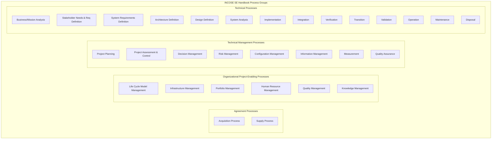
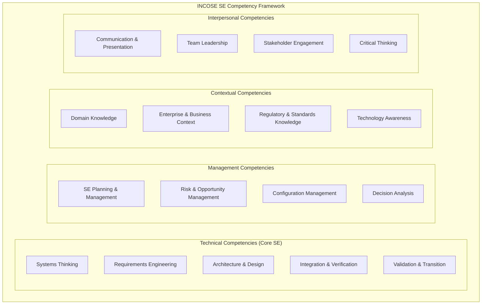

# INCOSE Systems Engineering Handbook — 5th Edition

**Document:** INCOSE Systems Engineering Handbook, 5th Edition (2023)  
**Organization:** International Council on Systems Engineering (INCOSE)  
**Related:** ISO/IEC/IEEE 15288:2023, ISO/IEC/IEEE 12207:2017, NASA SE Handbook, INCOSE SE Vision 2035  
**Standard Alignment:** Fully aligned with ISO/IEC/IEEE 15288:2023 (same process set)  
**Audience:** Systems engineers (all levels), SE managers, INCOSE CSEP/ASEP candidates, process architects, engineering educators  
**Prerequisites:** Basic engineering principles; familiarity with product lifecycle; understanding of stakeholder concepts

---

## Chapter 1 — Historical Context & Origin Story

### 1.1 Timeline

| Year | Milestone |
|------|-----------|
| 1990 | NCOSE founded (National Council on Systems Engineering; US-focused) |
| 1995 | NCOSE becomes **INCOSE** (International Council on Systems Engineering) |
| 1998 | INCOSE SE Handbook v1.0 (first edition) |
| 2000 | INCOSE SE Handbook v2.0 |
| 2004 | INCOSE SE Handbook v3.0 (aligned with ISO/IEC 15288:2002) |
| 2006 | INCOSE SE Vision 2020 published (roadmap for SE profession) |
| 2011 | **INCOSE SE Handbook v4** (4th Edition; aligned with 15288:2008) |
| 2014 | INCOSE SE Competency Framework published |
| 2015 | INCOSE SE Vision 2025 (update) |
| 2020 | INCOSE SE Vision 2035 (current roadmap) |
| 2023 | **INCOSE SE Handbook v5** (5th Edition; aligned with ISO/IEC/IEEE 15288:2023) |

### 1.2 INCOSE's Role

| Aspect | Detail |
|:------:|--------|
| **What** | Professional society for systems engineering (13,000+ members; 70+ chapters worldwide) |
| **Mission** | "A world where systems work" — advance SE as a discipline |
| **Key products** | SE Handbook; SE Competency Framework; CSEP/ASEP certification; working groups; conference (INCOSE IS) |
| **Handbook purpose** | Practical guidance on HOW to apply SE processes (ISO 15288 defines WHAT; INCOSE tells HOW) |
| **Relationship to ISO 15288** | The INCOSE SE Handbook is the COMPANION to ISO/IEC/IEEE 15288; it provides guidance, examples, templates, and best practices for each 15288 process |
| **Certification** | ASEP (Associate SE Professional): knowledge-based. CSEP (Certified SE Professional): knowledge + experience. ESEP (Expert SE Professional): demonstrated mastery + contribution |

---

## Chapter 2 — Handbook Architecture & Structure

### 2.1 5th Edition Structure

| Part | Content |
|:----:|---------|
| **Part 1** | SE Overview — Principles; concepts; SE in context |
| **Part 2** | SE Processes (aligned 1:1 with ISO/IEC/IEEE 15288:2023) — 30 processes in 4 groups |
| **Part 3** | Applying SE — Lifecycle models; tailoring; domains; MBSE; agile SE |
| **Part 4** | SE Competencies — Knowledge, skills, abilities; competency framework; career paths |
| **Appendices** | Templates; checklists; example work products; glossary |

### 2.2 Process Groups (aligned with ISO 15288:2023)



---

## Chapter 3 — SE Principles (INCOSE Foundation)

### 3.1 Core SE Principles

| Principle | Description | Application |
|:---------:|-------------|-------------|
| **Holistic thinking** | Consider the system as a WHOLE (not just parts); emergent properties arise from interactions | Don't optimize subsystems in isolation; optimize system-level performance |
| **Stakeholder focus** | Understand all stakeholder needs before designing | Elicit from users, operators, maintainers, regulators, society |
| **Lifecycle thinking** | Consider ALL lifecycle stages from concept through disposal | Design for manufacturability, maintainability, disposability — not just operations |
| **Abstraction & decomposition** | Manage complexity by working at appropriate levels | System → subsystem → component; each level has its own requirements and architecture |
| **Emergence** | System properties emerge from component interactions | System performance, reliability, safety — cannot be assessed from components alone |
| **Trade-off & balance** | No perfect solution; all designs involve trade-offs | Cost vs. performance vs. schedule vs. risk; explicit decision analysis |
| **Iterative refinement** | Design through progressive elaboration | Requirements refine with architecture; architecture refines with design; feedback loops |
| **Evidence-based decisions** | Decisions based on data, analysis, and verified information | Prototyping; simulation; testing; heritage data; not opinion |

### 3.2 SE Heuristics (Practical Guidelines)

| Heuristic | Guidance |
|:---------:|---------|
| "Requirements before design" | Define WHAT before deciding HOW (but allow iteration) |
| "Interfaces are where failures live" | 50%+ of integration failures are at interfaces; manage them rigorously |
| "Test early, test often" | Don't defer testing to end; verify at each level; shift left |
| "Heritage is valuable but dangerous" | Previous success doesn't guarantee future success (context matters; hidden assumptions) |
| "You can't verify what you can't measure" | Every requirement must have a measurable success criterion |
| "Complexity kills" | Simpler designs are more reliable; complexity tax is exponential |
| "Integration reveals the truth" | The real system behavior only appears when components come together |

---

## Chapter 4 — Technical Processes (Deep Dive)

### 4.1 Stakeholder Needs & Requirements Definition

```mermaid
graph TB
    subgraph "Stakeholder Needs & Requirements Process"
        SN1[Identify Stakeholders<br/>━━━━━━━━━━━<br/>• Who has interest in the system?<br/>• Users; operators; acquirers;<br/>  regulators; society; maintainers]
        
        SN2[Elicit Stakeholder Needs<br/>━━━━━━━━━━━<br/>• Interviews; workshops; surveys<br/>• Observation; document analysis<br/>• Scenarios; use cases; ConOps<br/>• Constraints; environment; context]
        
        SN3[Define Stakeholder Requirements<br/>━━━━━━━━━━━<br/>• Transform needs into<br/>  stakeholder requirements<br/>• Express in stakeholder language<br/>• Prioritize (MoSCoW; value-based)]
        
        SN4[Analyze & Negotiate<br/>━━━━━━━━━━━<br/>• Resolve conflicts<br/>• Ensure consistency<br/>• Validate with stakeholders<br/>• Baseline StRS]
    end
    
    SN1 --> SN2 --> SN3 --> SN4
    SN4 -->|"iterate"| SN2
```

### 4.2 Architecture Definition Process

| Activity | Description | Key Outputs |
|:--------:|-------------|-------------|
| **Identify architecture candidates** | Generate multiple candidate architectures through trade studies | Architecture options (2-5 candidates) |
| **Evaluate candidates** | Assess against criteria: performance, cost, risk, schedule, -ilities | Trade study results; evaluation matrix |
| **Select architecture** | Choose preferred architecture; document rationale | Architecture selection decision; ADR |
| **Define architecture elements** | Decompose system into elements; define responsibilities | System breakdown structure; architecture description |
| **Define interfaces** | Specify interfaces between elements | Interface Control Documents (ICDs); N² diagrams |
| **Allocate requirements** | Assign system requirements to architecture elements | Allocation matrix; derived requirements |
| **Assess architecture** | Verify architecture meets requirements; assess -ilities | Architecture evaluation report |

### 4.3 Verification vs. Validation

| Aspect | Verification | Validation |
|:------:|:---:|:---:|
| **Question** | "Did we build it RIGHT?" | "Did we build the RIGHT THING?" |
| **Against** | Requirements (technical specifications) | Stakeholder needs (intended use) |
| **Methods** | Test, Analysis, Inspection, Demonstration | Operational scenarios; user acceptance; mission simulation |
| **When** | Throughout development (each V-level) | Primarily at system level; end of development |
| **Who judges** | Engineers (does it meet spec?) | Stakeholders (does it solve my problem?) |
| **Can fail even if other passes** | System verified (meets all requirements) but NOT validated (requirements were wrong!) | System validated (users love it) but NOT verified (some requirements not formally proven) |

---

## Chapter 5 — SE Specialty Disciplines

### 5.1 "-ilities" (System Quality Attributes)

| Specialty | Definition | Key Activities | Metrics |
|:---------:|------------|----------------|---------|
| **Reliability** | Probability of performing intended function under stated conditions for specified time | FMEA; reliability prediction; redundancy design; MTBF allocation | MTBF; failure rate (λ); availability |
| **Maintainability** | Ability to be maintained effectively and efficiently | Maintenance concept; LRU design; diagnostic design; MTTR allocation | MTTR; maintenance hours per operating hour |
| **Availability** | Proportion of time system is operational | Combine reliability + maintainability: $A = \frac{MTBF}{MTBF + MTTR}$ | Operational availability (Ao); inherent availability (Ai) |
| **Safety** | Freedom from unacceptable risk | FHA; PSSA; SSA; STPA; hazard tracking | Residual risk level; hazard closure rate |
| **Security** | Protection from unauthorized access/modification | Threat assessment; vulnerability analysis; penetration testing | Attack surface; CVE count; time to detect |
| **Testability** | Ease with which system can be tested | Built-in test (BIT); test point access; observability; controllability | Fault detection rate; fault isolation rate |
| **Producibility** | Ease of manufacturing/production | DFM/DFA analysis; production readiness reviews | First-pass yield; production rate |
| **Sustainability** | Environmental impact across lifecycle | Life Cycle Assessment (LCA); carbon footprint; recyclability | CO₂ equivalent; energy consumption; recyclability % |
| **Resilience** | Ability to withstand and recover from disruptions | Graceful degradation; recovery design; redundancy | Recovery time; degradation level; functionality retention |
| **Interoperability** | Ability to work with other systems | Interface standards; protocol compliance; testing with partners | Interoperability level (0-4); successful exchanges |

### 5.2 Specialty Engineering Integration

```mermaid
graph TB
    subgraph "Specialty Integration in SE"
        ARCH[Architecture Definition<br/>━━━━━━━━━━━<br/>Define system structure]
        
        REL[Reliability Engineering<br/>• MTBF allocation<br/>• Redundancy decisions<br/>• Reliability prediction]
        
        SAF[Safety Engineering<br/>• FHA/PSSA/SSA<br/>• Safety requirements<br/>• Hazard mitigation]
        
        MAIN[Maintainability Engineering<br/>• LRU definition<br/>• Diagnostic strategy<br/>• MTTR allocation]
        
        SEC[Security Engineering<br/>• Threat modeling<br/>• Security architecture<br/>• Crypto key management]
        
        EMC[EMC Engineering<br/>• EMI analysis<br/>• Shielding design<br/>• Grounding scheme]
        
        HUMAN[Human Factors Engineering<br/>• Task analysis<br/>• Display/control design<br/>• Workload assessment]
        
        RESULT[Integrated Architecture<br/>━━━━━━━━━━━<br/>Architecture satisfies ALL<br/>specialty requirements<br/>(trade-offs balanced)]
    end
    
    ARCH --> REL
    ARCH --> SAF
    ARCH --> MAIN
    ARCH --> SEC
    ARCH --> EMC
    ARCH --> HUMAN
    REL --> RESULT
    SAF --> RESULT
    MAIN --> RESULT
    SEC --> RESULT
    EMC --> RESULT
    HUMAN --> RESULT
```

---

## Chapter 6 — Lifecycle Models & Tailoring

### 6.1 Lifecycle Models

| Model | Description | Best For | Limitations |
|:-----:|-------------|----------|-------------|
| **Sequential (Waterfall)** | Linear progression through phases | Well-understood requirements; stable technology | Inflexible; late integration; expensive rework |
| **V-Model** | Waterfall + explicit verification at each level | Safety-critical; regulated; certification | Same as waterfall + verification cost |
| **Incremental** | Deliver in planned increments; each adds capability | Large systems; evolutionary delivery | Integration across increments; architecture must support |
| **Iterative** | Repeated cycles of development (spiral-like) | Uncertain requirements; technology risk | Difficult to contract; schedule uncertainty |
| **Agile (within SE)** | Short iterations; continuous feedback; adaptive | Software-intensive; fast-changing needs | Challenges with hardware; safety certification |
| **Evolutionary** | Deploy initial capability; evolve based on operational feedback | Long-lived systems; changing threat (defense) | Requires architecture for evolution; lifecycle cost |
| **Lean** | Minimize waste; pull-based; value stream optimization | Production systems; continuous improvement | Less applicable to one-off development |

### 6.2 Tailoring Guidelines

| Factor | Low Tailoring (Full SE) | High Tailoring (Light SE) |
|:------:|:---:|:---:|
| **Complexity** | High (many elements; interactions; emergent behavior) | Low (few elements; well-understood) |
| **Criticality** | Safety-critical; mission-critical | Non-critical; commercial |
| **Size** | Large (>100 people; multi-year; multi-organization) | Small (<20 people; months; single team) |
| **Novelty** | New technology; unprecedented; first-of-kind | Heritage; well-understood; evolutionary |
| **Regulatory** | Regulated (aviation, medical, nuclear, automotive safety) | Unregulated; commercial |
| **Requirements stability** | Stable; well-defined; contractual | Volatile; uncertain; evolving |
| **Stakeholder diversity** | Many stakeholders; conflicting needs | Few stakeholders; aligned needs |

---

## Chapter 7 — SE Competency Framework

### 7.1 INCOSE Competency Model



### 7.2 INCOSE Certification Levels

| Level | Name | Requirements | Target Audience |
|:-----:|:----:|---|---|
| **ASEP** | Associate SE Professional | Knowledge exam (based on SE Handbook); no experience required | Entry-level; students; career changers |
| **CSEP** | Certified SE Professional | Knowledge exam + 5+ years SE experience + references + professional development | Mid-career SE professionals |
| **ESEP** | Expert SE Professional | CSEP + 20+ years experience + significant contribution to SE body of knowledge + portfolio review | Senior/principal systems engineers; thought leaders |

### 7.3 SE Career Path

| Level | Role | Years Experience | Key Responsibilities |
|:-----:|:----:|:---:|---|
| 1 | Junior SE | 0-3 | Requirements analysis; test support; documentation; learning SE processes |
| 2 | Systems Engineer | 3-7 | Requirements definition; architecture contribution; trade studies; integration planning |
| 3 | Senior SE | 7-12 | Lead architecture; technical reviews; risk management; mentor juniors |
| 4 | Principal SE / Chief SE | 12-20 | System-of-systems; cross-program technical authority; enterprise architecture |
| 5 | SE Fellow / Distinguished | 20+ | Industry thought leadership; standards development; organizational SE strategy |

---

## Chapter 8 — Architecture Diagrams

### 8.1 SE Process Interaction Model

```mermaid
graph TB
    subgraph "SE Process Interactions (INCOSE Model)"
        subgraph "Needs → Requirements → Architecture Flow"
            BMI[Business/Mission Analysis<br/>━━━━━━━━━━━<br/>• Problem space<br/>• Mission objectives<br/>• ConOps]
            SNRD[Stakeholder Needs &<br/>Requirements Definition<br/>━━━━━━━━━━━<br/>• Stakeholder requirements<br/>• Constraints; measures of effectiveness]
            SRD[System Requirements<br/>Definition<br/>━━━━━━━━━━━<br/>• System requirements<br/>• Functional; performance; interface]
            ARC[Architecture Definition<br/>━━━━━━━━━━━<br/>• Architecture alternatives<br/>• Selected architecture<br/>• Element specifications]
            DES[Design Definition<br/>━━━━━━━━━━━<br/>• Detailed design<br/>• Build-to specifications]
        end
        
        subgraph "Realization Flow"
            IMPL_I[Implementation<br/>━━━━━━━━━━━<br/>• Fabricate; code; procure]
            INTG[Integration<br/>━━━━━━━━━━━<br/>• Assemble; connect; configure]
            VER_I[Verification<br/>━━━━━━━━━━━<br/>• Test; analyze; inspect; demo]
            VAL_I[Validation<br/>━━━━━━━━━━━<br/>• Stakeholder acceptance<br/>• Operational scenarios]
            TRAN[Transition<br/>━━━━━━━━━━━<br/>• Deploy; training; logistics]
        end
    end
    
    BMI --> SNRD --> SRD --> ARC --> DES --> IMPL_I --> INTG --> VER_I --> VAL_I --> TRAN
    SRD -.->|"verifies against"| VER_I
    SNRD -.->|"validates against"| VAL_I
    ARC -.->|"verifies against"| INTG
```



### 8.2 Systems Engineering "Vee" with INCOSE Processes

```mermaid
graph TB
    subgraph "INCOSE SE Vee (Handbook Figure)"
        subgraph "Left Side (Definition & Decomposition)"
            LS1[Stakeholder Needs & Req<br/>(System Level)]
            LS2[System Requirements<br/>(System Level)]
            LS3[Architecture Definition<br/>(Subsystem Allocation)]
            LS4[Design Definition<br/>(Component Level)]
        end
        
        subgraph "Bottom (Implementation)"
            BOT[Implementation<br/>(Build; Code; Fabricate)]
        end
        
        subgraph "Right Side (Integration & Verification)"
            RS4[Verification<br/>(Component Level)]
            RS3[Integration + Verification<br/>(Subsystem Level)]
            RS2[Integration + Verification<br/>(System Level)]
            RS1[Validation<br/>(Stakeholder Level)]
        end
    end
    
    LS1 --> LS2 --> LS3 --> LS4 --> BOT
    BOT --> RS4 --> RS3 --> RS2 --> RS1
    
    LS1 -.->|"validates against"| RS1
    LS2 -.->|"verifies against"| RS2
    LS3 -.->|"verifies against"| RS3
    LS4 -.->|"verifies against"| RS4
```

---

## Chapter 9 — Case Studies

### 9.1 Complex Defense System (SE Process Application)

| Aspect | Detail |
|--------|--------|
| **System** | Next-generation multi-role fighter aircraft; 20-year development; $50B+ program |
| **SE challenges** | Multi-disciplinary (airframe, propulsion, avionics, weapons, mission systems); multi-contractor; multi-nation; 30-year operational life; technology insertion across lifecycle |
| **INCOSE process application** | Full ISO 15288 process set applied; tailored per acquisition phase. Stakeholder analysis: 15 stakeholder groups (pilots, maintainers, 4 allied nations, weapon suppliers, test ranges). Architecture: model-based (SysML); 5 architecture views (operational, functional, physical, interface, allocation). 12,000 system-level requirements → allocated to 8 major subsystems → 50+ components. |
| **Specialty integration** | All -ilities addressed: reliability (MTBF > 5 hours between critical failures); maintainability (engine swap < 4 hours); survivability (signature requirements); interoperability (NATO STANAG compliance); safety (DAL A flight-critical; DAL B mission-critical) |
| **Key SE challenges encountered** | (1) Requirements volatility: allied nations changed requirements 15% during Phase B → rigorous change control + impact analysis. (2) Interface complexity: 3,000+ interfaces between subsystems → N² diagram management + ICD database. (3) Technology maturation: 6 critical technologies at TRL 4 during Phase A → dedicated risk reduction phase. (4) Weight growth: 8% mass growth from PDR to CDR → mass reduction campaign (removed 200 kg). |
| **Outcome** | In-service after 14-year development; performance meets 95% of key requirements; 3% over weight (accepted by customer); 12% over budget (common for programs of this class). Key SE lesson: interface management and requirements change control were the TWO most impactful SE activities. |

### 9.2 Medical Device (Tailored SE for Regulated Domain)

| Aspect | Detail |
|--------|--------|
| **Product** | Implantable cardiac pacemaker with remote monitoring; Class III medical device |
| **SE process tailoring** | ISO 15288 processes applied but TAILORED for medical device regulations (IEC 62304, ISO 14971, FDA Design Controls). Lifecycle model: V-model (mandated by IEC 62304 for Class C SW). Design controls (FDA 21 CFR 820.30) mapped to ISO 15288 processes. |
| **How INCOSE processes map to FDA Design Controls** | Stakeholder Needs → User Needs. System Requirements → Design Input. Architecture/Design → Design Output. Verification → Design Verification. Validation → Design Validation. Risk Management → per ISO 14971 (integrated with all processes). Configuration Management → Design History File (DHF). |
| **Key INCOSE contribution** | Systems thinking applied: pacemaker is not just the implant — it's the SYSTEM (implant + programmer + remote monitor + cloud backend + clinician app). Each element has its own requirements, architecture, verification. Interfaces between elements (RF communication, cloud API, Bluetooth) managed rigorously. Stakeholder analysis: patient (safety, comfort, battery life); clinician (programmability, data access); regulatory (efficacy, safety, cybersecurity). |
| **Outcome** | FDA PMA approved; no major findings; product launched in 18 months (fast for Class III). SE approach reduced integration issues by 60% vs. previous product (attributed to: interface management + system-level V&V planning early in lifecycle). |

---

## Chapter 10 — Future Evolution (INCOSE SE Vision 2035)

| Theme | Description | Timeline |
|:-----:|-------------|----------|
| **MBSE as default** | Model-based SE replaces document-based as standard practice; models are authoritative source of truth | 2025-2030 |
| **Digital engineering ecosystem** | Connected digital thread: requirements → design → manufacturing → operations; all model-based | 2025-2035 |
| **AI-augmented SE** | AI assists in: requirements analysis, architecture generation, trade studies, test planning, anomaly detection | 2024-2030 |
| **SE for autonomous systems** | SE methods for systems that learn and adapt; verification of AI/ML components; SOTIF; explainability | 2024-2030 |
| **SE for sustainability** | Lifecycle environmental impact as first-class requirement; circular economy in design; energy-aware architecture | 2024-2030 |
| **SE for systems-of-systems** | Enterprise SE; dynamic SoS; emergent behavior management; federated architecture | Ongoing (expanding) |
| **Agile SE** | Full integration of Agile practices with SE rigor; continuous V&V; DevSecOps for systems | 2023-2028 |
| **SE democratization** | SE principles applied beyond traditional domains (healthcare, urban planning, education, policy) | 2025-2035 |
| **SE workforce transformation** | New competencies: data science, AI/ML, model-based tools, cybersecurity; updated certification | 2024-2030 |

---

## Chapter 11 — Interview Questions & Career Guide

### Tier 1: Entry-Level

**Q1:** What is INCOSE and what is the relationship between the INCOSE SE Handbook and ISO 15288?

**A:**

**INCOSE** = International Council on Systems Engineering
- Professional society for SE (13,000+ members worldwide)
- Publishes SE Handbook, competency framework, certifications (ASEP/CSEP/ESEP)

**ISO/IEC/IEEE 15288** = THE international standard defining SE processes
- Defines WHAT processes exist (30 processes in 4 groups)
- Defines process PURPOSE and OUTCOMES (but not HOW to do them in detail)
- Normative (can be audited/assessed against)

**INCOSE SE Handbook** = THE companion/guidance document for ISO 15288
- Explains HOW to implement each 15288 process
- Provides practical guidance, examples, templates, best practices
- Informative (not auditable itself; but teaches how to comply with 15288)

**Analogy:**
- ISO 15288 is like a RECIPE BOOK (lists ingredients and steps)
- INCOSE Handbook is like a COOKING CLASS (teaches techniques, tips, alternatives, what to do when things go wrong)

**Together they provide:**
- 15288: "You shall perform Stakeholder Needs & Requirements Definition"
- INCOSE HB: "Here's how: conduct stakeholder identification workshops, use these elicitation techniques, write requirements using this template, validate using these methods..."

### Tier 2: Mid-Level

**Q2:** Explain the difference between Verification and Validation. Give an example where a system passes Verification but fails Validation.

**A:**

| | Verification | Validation |
|:---:|:---:|:---:|
| **Question** | "Did we build it RIGHT?" | "Did we build the RIGHT THING?" |
| **Against** | Technical requirements (specifications written by engineers) | Stakeholder needs (what users actually need) |
| **Methods** | Test, Analysis, Inspection, Demonstration (TAID) | Operational scenarios; user trials; mission simulation |
| **Scope** | Each requirement individually proven | System as a whole satisfies intended purpose |
| **Who** | V&V team (engineers check against spec) | Stakeholders/users (check it solves their problem) |
| **Failure mode** | "Requirement not met" (technical defect) | "Wrong requirements" (did not understand need) |

**Example — passes Verification, fails Validation:**

A company develops a patient monitoring system for hospitals.

**Verification (PASSES):**
- Req-1: "System shall display heart rate with ±2 BPM accuracy" → Tested: ✓ (1.5 BPM error)
- Req-2: "System shall alarm when heart rate > 120 BPM" → Tested: ✓ (alarms at 121 BPM)
- Req-3: "Display shall update every 1 second" → Tested: ✓ (0.97s update rate)
- All 200 requirements PASS verification testing

**Validation (FAILS):**
- Nurses in ICU report: "We get 500 alarms per shift; 95% are false. We ignore them all now." (alarm fatigue)
- The REQUIREMENTS were wrong: they specified absolute thresholds without considering patient-specific baselines, artifact rejection, or clinical context
- The system was built EXACTLY to specification (verification passes) but the specification did NOT capture the true stakeholder need ("alert me to clinically significant changes, not noise")

**Root cause:** Stakeholder needs were not properly elicited → requirements were technically precise but clinically wrong → verification proves the wrong thing.

**Lesson:** Verification and Validation are BOTH necessary. Verification without validation = "perfectly useless system." Validation without verification = "useful but unreliable system."

### Tier 3: Senior

**Q3:** You are establishing the SE capability for a new automotive startup developing electric vehicles. Using the INCOSE SE Handbook as your reference, design the SE process framework, competency development plan, and governance structure. The company has 200 engineers, no existing SE processes, and needs to achieve ASPICE Level 2 within 2 years.

**A:**

**Phase 1: Foundation (Months 1-6)**

| Activity | Detail | INCOSE Reference |
|:---:|---|---|
| Define lifecycle model | V-Model (ASPICE mandates); with Agile at SW level | Handbook Part 3; Lifecycle Models |
| Select & tailor processes | ISO 15288 Technical + Technical Management; tailored for automotive | Handbook Part 2 + Part 3 (Tailoring) |
| Establish key processes first | Requirements (TP2/TP3); Architecture (TP4); V&V (TP9/TP11); CM (TM5); Risk (TM4) | Priority: these are ASPICE SWE + SYS process equivalents |
| Define work products | SyRS; SRS; SAD; Test Plans; Traceability Matrix; Risk Register | Handbook Appendix templates |
| Select tools | DOORS (requirements); Enterprise Architect (architecture); Jenkins (CI); JIRA (project tracking) | Handbook Part 3 (Tools & Infrastructure) |
| Hire/train SE staff | 5 senior SEs (CSEP-level experience); 10 mid-level; rotate existing engineers through SE training | Handbook Part 4 (Competencies) |

**Phase 2: Institutionalization (Months 7-18)**

| Activity | Detail |
|:---:|---|
| Pilot projects | Apply SE processes on 2 pilot subsystem developments (BCM; BMS); measure process effectiveness |
| Process improvement | After pilots: refine processes based on lessons learned; update process documentation |
| Training program | All 200 engineers: SE awareness (2 days). 50 selected: deep SE training (2 weeks). 15 SEs: CSEP preparation |
| ASPICE readiness | Gap assessment against ASPICE PAM; close gaps identified; prepare for assessment |
| Metrics | Define SE metrics: requirements volatility, defect density by phase, V&V coverage, schedule performance |
| Governance | SE Review Board (weekly); Technical Authority (Chief SE has technical veto on design decisions) |

**Phase 3: Assessment & Maturity (Months 19-24)**

| Activity | Detail |
|:---:|---|
| Internal assessment | Conduct internal ASPICE assessment (trained assessors); identify remaining gaps |
| Closure | Address gaps from internal assessment; re-run pilots with mature process |
| External assessment | Commission external ASPICE assessment (INTACS-certified assessor) targeting Level 2 |
| Level 2 criteria | Process performed (Level 1) + managed (Level 2): work products managed; responsibilities defined; resources adequate; stakeholders informed |

**Governance structure:**

```
CEO
 └── VP Engineering
      ├── Chief Systems Engineer (Technical Authority)
      │    ├── SE Process Group (process definition & improvement)
      │    ├── SE Tools Group (DOORS, EA, Jenkins administration)
      │    └── SE Review Board (technical reviews: SRR/PDR/CDR)
      ├── Domain Engineering (Powertrain, Chassis, Body, ADAS)
      │    └── Systems Engineers embedded in each domain
      └── Quality & Process (ASPICE assessment management)
```

**Competency development plan (INCOSE framework):**

| Competency | Year 1 Target | Year 2 Target |
|:---:|:---:|:---:|
| Requirements Engineering | All SEs at "Awareness"; 10 at "Practitioner" | 20 at "Practitioner"; 5 at "Expert" |
| Architecture & Design | 5 SEs at "Practitioner" | 10 at "Practitioner"; 3 at "Expert" |
| V&V | All test engineers at "Awareness"; 5 at "Practitioner" | 15 at "Practitioner" |
| Risk Management | Chief SE + 5 senior SEs at "Practitioner" | All project leads at "Awareness" |
| MBSE/SysML | 3 SEs trained (pilot) | 10 SEs using SysML actively |

---

## Chapter 12 — Cheat Sheet & Quick Reference

```
═══════════════════════════════════════════
INCOSE SE HANDBOOK — QUICK REFERENCE
═══════════════════════════════════════════

DOCUMENT: INCOSE SE Handbook, 5th Edition (2023)
ALIGNMENT: ISO/IEC/IEEE 15288:2023 (1:1 process mapping)
PURPOSE: Practical guidance for applying SE processes

═══════════════════════════════════════════
PROCESS GROUPS (30 processes):
  Agreement (2): Acquisition; Supply
  Organizational (6): Lifecycle Model; Infrastructure;
    Portfolio; HR; Quality; Knowledge
  Technical Management (8): Planning; Assessment;
    Decision; Risk; CM; Info Mgmt; Measurement; QA
  Technical (14): Business Analysis; StakeholderReq;
    SystemReq; Architecture; Design; Analysis;
    Implementation; Integration; Verification;
    Transition; Validation; Operation; Maintenance; Disposal

═══════════════════════════════════════════
SE PRINCIPLES:
  • Holistic thinking (system > sum of parts)
  • Stakeholder focus (understand all needs)
  • Lifecycle thinking (concept through disposal)
  • Abstraction & decomposition (manage complexity)
  • Emergence (properties from interactions)
  • Trade-off & balance (no perfect solution)
  • Iterative refinement (progressive elaboration)
  • Evidence-based decisions (data, not opinion)

═══════════════════════════════════════════
VERIFICATION vs VALIDATION:
  Verification: "Built it RIGHT?" (against requirements)
    Methods: Test, Analysis, Inspection, Demonstration
  Validation: "Built RIGHT THING?" (against stakeholder needs)
    Methods: Operational scenarios; user acceptance

═══════════════════════════════════════════
-ILITIES (Specialty Disciplines):
  Reliability (MTBF); Maintainability (MTTR)
  Availability (A = MTBF/(MTBF+MTTR))
  Safety; Security; Testability
  Producibility; Sustainability; Resilience
  Interoperability; Usability; Scalability

═══════════════════════════════════════════
LIFECYCLE MODELS:
  Sequential (waterfall) — stable requirements
  V-Model — safety-critical; verification focus
  Incremental — planned capability growth
  Iterative — uncertain requirements; risk reduction
  Agile — SW-intensive; fast feedback
  Evolutionary — long-lived; changing needs

═══════════════════════════════════════════
INCOSE CERTIFICATIONS:
  ASEP — Associate (knowledge exam; no experience)
  CSEP — Certified (exam + 5yr exp + references)
  ESEP — Expert (CSEP + 20yr exp + contribution)

═══════════════════════════════════════════
SE HEURISTICS:
  • Requirements before design (but iterate)
  • Interfaces are where failures live (manage them!)
  • Test early, test often (shift left)
  • Heritage is valuable but dangerous (assess context)
  • You can't verify what you can't measure
  • Complexity kills (simpler = more reliable)
  • Integration reveals the truth

═══════════════════════════════════════════
KEY RELATIONSHIP:
  ISO 15288 = WHAT processes to have (normative)
  INCOSE HB = HOW to do them (informative; practical)
  
  Together: complete SE reference
```

---

*End of Document — 10_INCOSE_SE_Handbook.md*
