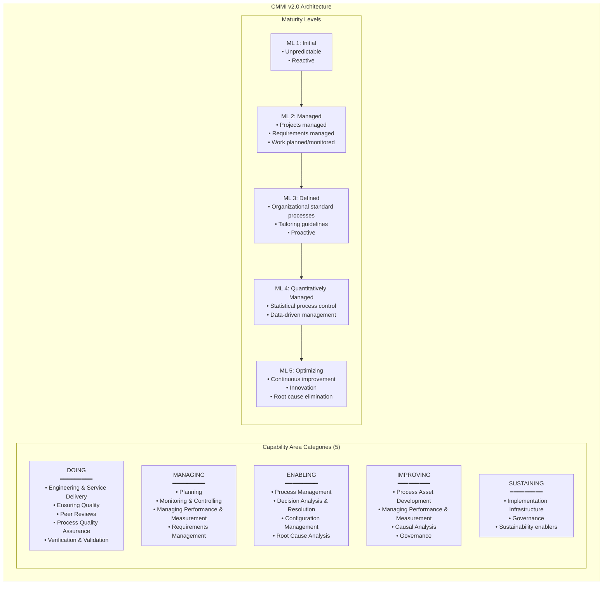
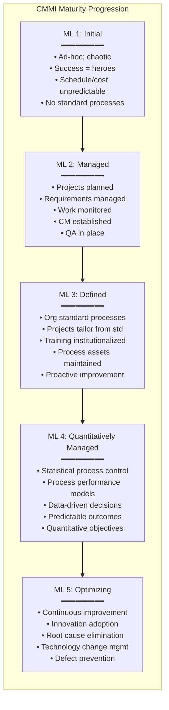

# CMMI v2.0 — Capability Maturity Model Integration

**Standard:** CMMI v2.0 (2018; ISACA/CMMI Institute)  
**Predecessor:** CMMI v1.3 (2010; SEI/Carnegie Mellon); CMM v1.0 (1991)  
**Views:** CMMI-DEV (Development), CMMI-SVC (Services), CMMI-ACQ (Acquisition)  
**Assessment:** SCAMPI (Standard CMMI Appraisal Method for Process Improvement) — Class A/B/C  
**Audience:** Process engineers, quality managers, SCAMPI appraisers, engineering managers, CIOs  
**Prerequisites:** Basic software lifecycle; understanding of process concepts; familiarity with quality management

---

## Chapter 1 — Historical Context & Origin Story

### 1.1 Timeline

| Year | Milestone |
|------|-----------|
| 1985 | Watts Humphrey begins process maturity work at SEI (Carnegie Mellon) |
| 1987 | SEI publishes initial maturity framework |
| 1991 | **CMM v1.0** (Capability Maturity Model for Software) — 5 maturity levels |
| 1993 | CMM v1.1 — refinements |
| 1997 | SE-CMM (Systems Engineering CMM); SA-CMM (SW Acquisition CMM) |
| 2000 | CMMI project begins (integrate CMM-SW, SE-CMM, SA-CMM, IPPD-CMM) |
| 2002 | **CMMI v1.0** — first integrated model |
| 2006 | CMMI v1.2 — constellation approach (DEV, SVC, ACQ) |
| 2010 | **CMMI v1.3** — widely adopted version; final SEI-published version |
| 2012 | CMMI Institute spun off from SEI as independent entity |
| 2016 | CMMI Institute acquired by ISACA |
| 2018 | **CMMI v2.0** — complete restructuring; Practice Areas replace Process Areas |
| 2024 | CMMI v3.0 in development (expected: AI/ML, DevOps, sustainability) |

### 1.2 The Maturity Concept (Watts Humphrey's Insight)

**Key insight:** "You cannot consistently improve what you cannot consistently repeat. You cannot consistently repeat what you cannot define and manage."

**The progression:**
1. **Ad-hoc** (Level 1): Success depends on heroic individuals; not repeatable
2. **Managed** (Level 2): Projects have plans; work is monitored; but each project reinvents
3. **Defined** (Level 3): Organization has standard processes; projects tailor from standard
4. **Quantitatively Managed** (Level 4): Statistical control; data-driven decisions
5. **Optimizing** (Level 5): Continuous improvement; innovation; root cause analysis

---

## Chapter 2 — CMMI v2.0 Architecture

### 2.1 Structure Overview



### 2.2 Practice Areas (20 Practice Areas in CMMI v2.0)

| # | Practice Area (PA) | Category | Purpose |
|:-:|:---:|:---:|---|
| 1 | **Causal Analysis & Resolution (CAR)** | Improving | Identify causes of outcomes; address root causes |
| 2 | **Configuration Management (CM)** | Enabling | Establish and maintain integrity of work products |
| 3 | **Decision Analysis & Resolution (DAR)** | Enabling | Structured approach to evaluating alternatives |
| 4 | **Estimating (EST)** | Managing | Develop and manage estimates for work |
| 5 | **Governance (GOV)** | Sustaining | Ensure practices are sponsored and governed |
| 6 | **Implementation Infrastructure (II)** | Sustaining | Enable and support process implementation |
| 7 | **Managing Performance & Measurement (MPM)** | Improving | Manage performance using measurement and analysis |
| 8 | **Monitor & Control (MC)** | Managing | Track performance against plans; take corrective action |
| 9 | **Organizational Training (OT)** | Enabling | Develop people's skills and knowledge |
| 10 | **Peer Reviews (PR)** | Doing | Find defects through peer examination |
| 11 | **Planning (PLAN)** | Managing | Develop plans to manage work |
| 12 | **Process Asset Development (PAD)** | Improving | Develop and maintain organizational process assets |
| 13 | **Process Management (PCM)** | Enabling | Manage organizational processes |
| 14 | **Process Quality Assurance (PQA)** | Doing | Evaluate process and product adherence |
| 15 | **Requirements Development & Management (RDM)** | Managing | Develop and manage requirements |
| 16 | **Risk & Opportunity Management (RSK)** | Managing | Manage risks and opportunities |
| 17 | **Supplier Agreement Management (SAM)** | Managing | Manage suppliers |
| 18 | **Technical Solution & Integration (TSI)** | Doing | Design, implement, and integrate solutions |
| 19 | **Verification & Validation (VV)** | Doing | Ensure work products meet requirements and stakeholder needs |
| 20 | **Virtual Teams (VT)** | Managing | Manage geographically distributed teams |

### 2.3 Practice Areas by Maturity Level

| Maturity Level | Practice Areas Required |
|:-:|---|
| **ML 2** (Managed) | CM, EST, GOV, II, MC, MPM, PLAN, PQA, RDM, RSK, SAM |
| **ML 3** (Defined) | All ML 2 + CAR, DAR, OT, PAD, PCM, PR, TSI, VV, VT |
| **ML 4** (Quantitatively Managed) | All ML 3 + MPM (quantitative), CAR (statistical), GOV (quantitative targets) |
| **ML 5** (Optimizing) | All ML 4 + CAR (innovation), PCM (continuous improvement), MPM (optimization) |

---

## Chapter 3 — Capability vs. Maturity Representation

### 3.1 Two Representations

| Representation | Focus | Use Case |
|:-:|---|---|
| **Staged (Maturity Levels)** | Organization-wide maturity (ML 1-5) | Benchmarking; organizational comparison; executive reporting |
| **Continuous (Capability Levels)** | Individual process capability (CL 0-3) | Targeted improvement; specific process focus; flexibility |

### 3.2 Capability Levels (v2.0)

| Level | Name | Meaning |
|:-----:|:----:|---------|
| **CL 0** | Incomplete | Not performed or partially performed |
| **CL 1** | Performed | Practice outcomes achieved; but may be ad-hoc |
| **CL 2** | Managed | Practices planned, monitored, controlled; work products managed |
| **CL 3** | Defined | Tailored from organizational standard; integrated with other processes |

**Note:** CMMI v2.0 reduced capability levels from 0-5 (in v1.3) to 0-3. Higher maturity (ML 4-5) is achieved through specific practices, not higher CL numbers.

---

## Chapter 4 — SCAMPI Appraisal

### 4.1 SCAMPI Classes

| Class | Purpose | Rigor | Duration | Cost |
|:-----:|---------|:-----:|:--------:|:----:|
| **Class A** | Formal benchmarking; official ML rating | Highest; mandatory evidence rules | 2-4 weeks (on-site: 1-2 weeks) | $100-300K |
| **Class B** | Assess progress; interim evaluation | Medium; flexible evidence | 1-2 weeks | $30-80K |
| **Class C** | Quick check; gap analysis; risk identification | Light; self-assessment possible | 2-5 days | $10-30K |

### 4.2 SCAMPI A Appraisal Process

```mermaid
graph TB
    subgraph "SCAMPI A Appraisal Process"
        PREP[Planning & Preparation<br/>━━━━━━━━━<br/>• Define scope (PA; projects; ML target)<br/>• Select appraisal team (Lead Appraiser + team)<br/>• Identify PIID (Practice Implementation Indicators)<br/>• Schedule interviews; collect artifacts]
        
        CONDUCT[Conduct Appraisal<br/>━━━━━━━━━<br/>• Opening presentation<br/>• Document review (artifacts; records)<br/>• Interviews (managers; practitioners)<br/>• Corroboration (verify claims)<br/>• Characterization (rate each practice)]
        
        RATE_P[Rate Practices<br/>━━━━━━━━━<br/>• Each practice: Fully Implemented (FI),<br/>  Largely Implemented (LI), Partially (PI),<br/>  Not Implemented (NI), Not Yet (NY)<br/>• All practices must be FI or LI for PA satisfaction]
        
        RATE_PA[Rate Practice Areas & ML<br/>━━━━━━━━━<br/>• PA satisfied if all practices FI/LI<br/>• ML achieved if all required PAs satisfied<br/>  at required CL]
        
        REPORT_S[Report Results<br/>━━━━━━━━━<br/>• Maturity Level rating<br/>• Strengths & weaknesses<br/>• Findings (observations; recommendations)<br/>• Published to CMMI Institute (with consent)]
    end
    
    PREP --> CONDUCT --> RATE_P --> RATE_PA --> REPORT_S
```

### 4.3 Evidence Requirements (PIID)

| Evidence Type | Description | Example |
|:---:|---|---|
| **Direct Artifact** | Work product produced by performing the practice | Project plan; test report; requirements specification; risk register |
| **Indirect Artifact** | Evidence that practice was performed (not the work product itself) | Minutes of review meeting; email approving plan; schedule showing activity |
| **Affirmation** | Statement by practitioner/manager confirming practice | Interview answer: "Yes, we review test plans with stakeholders before testing" |

**Rule:** Each practice instance requires evidence from at least 2 of the 3 types. A single affirmation is never sufficient alone.

---

## Chapter 5 — Key Practice Areas (Deep Dive)

### 5.1 Requirements Development & Management (RDM)

| Practice | Level | Description |
|:--------:|:-----:|-------------|
| RDM 2.1 | ML 2 | Develop and record customer requirements |
| RDM 2.2 | ML 2 | Develop and record solution requirements |
| RDM 2.3 | ML 2 | Analyze and validate requirements |
| RDM 2.4 | ML 2 | Manage requirements changes (traceability; impact analysis) |
| RDM 2.5 | ML 2 | Maintain bidirectional traceability |
| RDM 3.1 | ML 3 | Develop requirements using organizational standard process |
| RDM 3.2 | ML 3 | Analyze requirements to identify quality attribute needs |

### 5.2 Technical Solution & Integration (TSI)

| Practice | Level | Description |
|:--------:|:-----:|-------------|
| TSI 2.1 | ML 2 (via component) | Design the solution (component/module design) |
| TSI 2.2 | ML 2 | Implement the design |
| TSI 3.1 | ML 3 | Develop candidate solutions; evaluate alternatives |
| TSI 3.2 | ML 3 | Develop the architecture (patterns; interfaces) |
| TSI 3.3 | ML 3 | Design interfaces between components |
| TSI 3.4 | ML 3 | Implement the solution using standard process |
| TSI 3.5 | ML 3 | Develop integration strategy and plan |
| TSI 3.6 | ML 3 | Integrate solution components |
| TSI 3.7 | ML 3 | Manage interfaces throughout lifecycle |

---

## Chapter 6 — CMMI v2.0 vs v1.3

### 6.1 Key Differences

| Aspect | CMMI v1.3 | CMMI v2.0 |
|:------:|:---------:|:---------:|
| **Structure** | 22 Process Areas (PAs) | 20 Practice Areas (PAs) |
| **Terminology** | Goals + Practices (Specific + Generic) | Practices (grouped by capability level) |
| **Representation** | Staged OR Continuous (separate) | Unified (one model; performance report shows both) |
| **Capability Levels** | CL 0-5 (continuous) | CL 0-3 only |
| **Maturity Levels** | ML 1-5 | ML 1-5 (but ML 4-5 via specific practices, not CL) |
| **Performance** | Not explicit | Explicit performance benchmarking (performance report) |
| **Agile** | Agile annex (informative) | Agile practices integrated throughout |
| **Governance** | Not explicit | Dedicated GOV Practice Area |
| **Virtual teams** | Not addressed | Dedicated VT Practice Area |
| **Appraisal** | SCAMPI v1.3 | SCAMPI v2.0 (streamlined) |

### 6.2 Migration: v1.3 → v2.0

| v1.3 Process Area | v2.0 Practice Area | Change |
|:---:|:---:|---|
| REQM + RD | RDM | Merged (development + management together) |
| TS | TSI | Expanded (integration included) |
| PI | TSI | Merged into TSI |
| PP + PMC | PLAN + MC | Renamed; streamlined |
| MA | MPM | Renamed; enhanced with performance |
| SAM | SAM | Retained |
| IPM | PCM | Focus shift to process management |
| OPD + OPF | PAD + PCM | Restructured |
| OPP | MPM (ML 4) | Folded into quantitative measurement |
| CAR | CAR | Retained (enhanced at ML 5) |
| VER + VAL | VV | Merged |

---

## Chapter 7 — Comparison: CMMI vs Alternatives

| Criterion | CMMI v2.0 | ISO 9001:2015 | ASPICE 4.0 | ISO 15504/33001 |
|:---------:|:---------:|:---:|:----------:|:---------------:|
| **What it is** | Capability/maturity model | Quality management system standard | Process assessment model (automotive) | Process assessment framework (meta) |
| **Scope** | Organization (DEV, SVC, ACQ) | Organization (any product/service) | Projects/products (automotive SW/SYS) | Framework for creating PAMs |
| **Levels** | ML 1-5; CL 0-3 | Pass/Fail (certified or not) | CL 0-5 (per process) | Defines CL 0-5 framework |
| **Assessment** | SCAMPI (certified appraiser) | ISO audit (certified body) | INTACS assessor | Defines assessment method |
| **Prescriptive?** | What to achieve (not how) | What to have (QMS requirements) | What to achieve (outcomes) | How to assess |
| **Improvement** | Explicit (ML 4-5 = quantitative improvement) | PDCA cycle (continuous improvement) | CL 4-5 = quantitative/innovating | Not improvement itself (assessment only) |
| **Cost** | High ($100-300K for Class A) | Medium ($20-50K per audit) | Medium ($30-100K) | N/A (defines framework) |
| **Industry** | Defense, aerospace, banking, IT | All industries | Automotive | Reference for other PAMs (like ASPICE) |

---

## Chapter 8 — Architecture Diagrams

### 8.1 CMMI v2.0 Practice Structure

```mermaid
graph TB
    subgraph "CMMI v2.0 Model Structure"
        CAT[Capability Area Categories (5)<br/>━━━━━━━━━<br/>Doing | Managing | Enabling |<br/>Improving | Sustaining]
        
        PA[Practice Areas (20)<br/>━━━━━━━━━<br/>Each PA has:<br/>• Purpose statement<br/>• Introductory notes<br/>• Related PAs<br/>• Practices (by CL)]
        
        PRAC[Practices<br/>━━━━━━━━━<br/>• CL 2 Practices (base)<br/>• CL 3 Practices (organizational)<br/>• ML 4 Practices (quantitative)<br/>• ML 5 Practices (optimizing)]
        
        WP[Work Products (informative)<br/>━━━━━━━━━<br/>• Example inputs<br/>• Example outputs<br/>• NOT mandatory; guidance only]
    end
    
    CAT --> PA --> PRAC --> WP
```

### 8.2 Maturity Level Progression



---

## Chapter 9 — Case Studies

### 9.1 Defense Contractor: ML 1 → ML 3 Journey

| Aspect | Detail |
|--------|--------|
| **Organization** | Mid-size defense software contractor; 800 engineers; developing radar systems |
| **Starting state** | ML 1: No standard processes; each project different; schedule overruns (avg 40%); defect escapes high; customer complaints |
| **Goal** | ML 3 within 3 years (DoD contract requirement) |
| **Year 1 (ML 1 → ML 2)** | Established: project planning (templates; WBS); requirements management (DOORS; baselines); CM (Git; branching strategy; formal releases); monitoring (earned value; milestone tracking); QA (audit checklists; process checks). Result: projects became predictable within +/- 15% of plan. |
| **Year 2 (ML 2 → ML 3)** | Established: organizational process definition (SEPG team; standard processes; tailoring guidelines); training program (200 engineers trained on standard processes); peer reviews (institutionalized; defect data collected); decision analysis (trade study framework); integration planning (standard approach). |
| **Year 3 (consolidation + appraisal)** | Conducted 2 pilot SCAMPI B assessments; closed gaps; trained 5 projects as appraisal sample; conducted SCAMPI A. |
| **Result** | ML 3 achieved. Schedule predictability: ±10%. Defect density reduced 60%. Customer satisfaction score: 4.2/5 (from 2.8). Contract renewal won on quality basis. |
| **Investment** | $3M over 3 years (SEPG team: 8 FTE; tools; training; appraisal). ROI: estimated $15M saved from reduced rework + contract retention. |

### 9.2 Banking IT: CMMI for Services (ML 4)

| Aspect | Detail |
|--------|--------|
| **Organization** | Large bank IT division; 2,000 staff; managing 500 applications; ITIL-based service management |
| **Motivation** | Regulators require demonstrable process maturity; competitor achieved ML 3; bank targets ML 4 for competitive advantage |
| **ML 4 challenge** | Must demonstrate: quantitative objectives for processes; statistical process control; process performance baselines; predictive models |
| **Implementation** | Selected 4 key processes for quantitative management: incident resolution time (target: P90 < 4 hours); change success rate (target: > 95%); release lead time (target: P90 < 2 weeks); service availability (target: 99.99%). Established statistical process control: control charts for each metric; special cause variation detected and resolved; process performance baselines established with 18 months of data. Built predictive models: "Given change complexity X, predicted lead time = Y ± Z days" (regression model validated with historical data). |
| **Result** | ML 4 achieved (SCAMPI A). Incident resolution: P90 = 3.2 hours (vs. target 4). Change success: 97.5%. Service availability: 99.993%. Regulator satisfied. |

---

## Chapter 10 — Future Evolution

| Trend | Timeline | Impact on CMMI |
|-------|----------|----------------|
| **CMMI v3.0** | 2025-2026 | Expected: AI/ML practices; DevOps/DevSecOps; data management; sustainability |
| **Agile-native CMMI** | Now (v2.0+) | v2.0 already Agile-friendly; v3.0 will likely have explicit Agile configurations |
| **AI in appraisals** | 2025-2028 | AI-assisted evidence collection; automated artifact analysis; faster appraisals |
| **Continuous assessment** | 2025-2030 | Move from periodic appraisals to continuous monitoring (like continuous certification) |
| **Integration with DevOps metrics** | Now (expanding) | DORA metrics as ML 4 quantitative measures; pipeline data as evidence |
| **Cloud-native practices** | 2024-2027 | Practices for infrastructure-as-code; microservices; container orchestration |
| **CMMI + cybersecurity** | 2024-2026 | Security practices embedded (like CMMI-SEC model concepts) |
| **Lighter appraisals** | Now | Demand for faster/cheaper assessments; virtual/hybrid appraisals post-COVID |

---

## Chapter 11 — Interview Questions & Career Guide

### Tier 1: Entry-Level

**Q1:** Explain the 5 CMMI Maturity Levels. Give an analogy.

**A:**

| Level | Name | Characteristic | Cooking Analogy |
|:-----:|:----:|----------------|-----------------|
| **1** | Initial | Unpredictable; reactive; heroic efforts | Cooking without a recipe; sometimes great, sometimes burnt; depends on the cook |
| **2** | Managed | Projects planned and tracked; reactive to issues | Following a recipe per dish; but each cook uses different recipe; results vary by cook |
| **3** | Defined | Standard processes; tailored per project; proactive | Restaurant kitchen with standard recipes (cookbook); all cooks follow same procedures; consistent quality |
| **4** | Quantitatively Managed | Statistical control; data-driven; predictable | Track cooking times, temperatures, customer ratings statistically; detect when process drifts; adjust before failure |
| **5** | Optimizing | Continuous improvement; innovation; prevention | Continuously experimenting with new techniques; eliminating root causes of complaints; inventing better methods |

**Key insight:** ML 1→2 = discipline (plan your work; work your plan). ML 2→3 = standardize (everyone does it the same way). ML 3→4 = quantify (measure; control statistically). ML 4→5 = optimize (innovate; prevent; improve continuously).

### Tier 2: Mid-Level

**Q2:** What changed between CMMI v1.3 and v2.0? Why the restructuring?

**A:**

**Problems with v1.3:**
1. Complex structure (Goals → Specific Practices → Generic Practices → Sub-practices) → confusing
2. Staged vs. Continuous representations were separate → organizations couldn't easily compare
3. No explicit governance → executive sponsorship not formally addressed
4. Agile was an afterthought (informative annex only)
5. Virtual/distributed teams not addressed
6. Performance benchmarking not built-in

**v2.0 simplifications:**
- **Practices directly** (no more Goals + Sub-practices layers)
- **Unified representation** (one model; performance report shows both capability + maturity)
- **Reduced CL** (0-3 only; ML 4-5 via specific high-maturity practices)
- **Explicit Governance** (GOV Practice Area — executives are accountable)
- **Agile integrated** (practices written to accommodate Agile/iterative naturally)
- **Virtual Teams** (VT Practice Area — distributed work is first-class)
- **Performance focus** (benchmarking; comparison with industry data)

**Migration impact:**
- Organizations at v1.3 ML 3 can typically achieve v2.0 ML 3 quickly (practices map well)
- ML 4-5 requires rethinking (v2.0 quantitative practices are different from v1.3 OPP/QPM)
- New Practice Areas (GOV, VT) require new evidence even for ML 2 organizations

### Tier 3: Senior

**Q3:** Design a CMMI v2.0 improvement strategy for an organization targeting ML 4. The organization is currently at ML 3. What specific quantitative practices are needed, and how would you implement statistical process control?

**A:**

**ML 3 → ML 4 requirements (CMMI v2.0):**

ML 4 adds QUANTITATIVE management to ML 3 processes. Specifically:
- **MPM** (Managing Performance & Measurement) at high-maturity level
- **CAR** (Causal Analysis) using statistical methods
- **GOV** with quantitative quality and process performance objectives

**Implementation plan:**

| Step | Activity | Duration |
|:----:|----------|:--------:|
| 1 | **Select critical processes** for quantitative management (3-5 processes that most impact business outcomes) | Month 1 |
| 2 | **Establish process performance baselines** — collect 12-18 months of data for selected processes | Months 1-12 (parallel with step 3-4) |
| 3 | **Define quantitative objectives** — business-aligned targets with statistical basis (e.g., "defect density shall be ≤ X at P90") | Month 2-3 |
| 4 | **Implement statistical process control (SPC)** — control charts; capability analysis; special cause detection | Month 6-12 |
| 5 | **Build process performance models** — predictive models linking process parameters to outcomes | Month 12-18 |
| 6 | **Institutionalize quantitative management** — decision-making uses models; management reviews include SPC data | Month 18-24 |
| 7 | **Conduct SCAMPI B** (interim assessment) → close gaps | Month 20 |
| 8 | **SCAMPI A** (formal appraisal for ML 4) | Month 24 |

**SPC implementation example (defect density):**

```
Process: Code Development
Metric: Defect density (defects found in code review per KLOC)
Data: 18 months; 50 releases

1. Calculate process performance baseline:
   Mean (μ) = 4.2 defects/KLOC
   Std Dev (σ) = 1.1 defects/KLOC
   
2. Establish control limits:
   UCL = μ + 3σ = 4.2 + 3.3 = 7.5 defects/KLOC
   LCL = μ - 3σ = 4.2 - 3.3 = 0.9 defects/KLOC
   
3. Monitor: plot each release's defect density on control chart
   
4. Action rules (special cause variation):
   - Single point outside UCL/LCL → investigate immediately
   - 7 consecutive points above/below mean → trend; investigate
   - 2 of 3 consecutive points near UCL or LCL → investigate
   
5. When special cause detected:
   - Root cause analysis (CAR practice)
   - Corrective action (process change; training; tool fix)
   - Verify effectiveness (next data points within limits)
```

**Process Performance Model example:**

$$\text{Predicted Defect Density} = \beta_0 + \beta_1 \cdot \text{Complexity} + \beta_2 \cdot \text{Experience} + \beta_3 \cdot \text{Review Coverage}$$

Validated with historical data; R² > 0.7; used to predict quality outcomes for new projects BEFORE code is written → enables proactive management (increase review coverage if predicted defects too high).

---

## Chapter 12 — Cheat Sheet & Quick Reference

```
═══════════════════════════════════════════
CMMI v2.0 — QUICK REFERENCE
═══════════════════════════════════════════

MATURITY LEVELS:
  ML 1: Initial (ad-hoc; unpredictable)
  ML 2: Managed (planned; tracked; reactive)
  ML 3: Defined (standard process; tailored; proactive)
  ML 4: Quantitatively Managed (SPC; predictive)
  ML 5: Optimizing (innovation; prevention)

═══════════════════════════════════════════
CAPABILITY LEVELS (per Practice Area):
  CL 0: Incomplete
  CL 1: Performed (outcomes achieved)
  CL 2: Managed (planned; monitored; controlled)
  CL 3: Defined (from org standard; tailored)

═══════════════════════════════════════════
20 PRACTICE AREAS:
  DOING: PR, PQA, TSI, VV
  MANAGING: EST, MC, PLAN, RDM, RSK, SAM, VT
  ENABLING: CM, DAR, OT, PCM
  IMPROVING: CAR, MPM, PAD
  SUSTAINING: GOV, II

═══════════════════════════════════════════
ML 2 REQUIRES (11 PAs):
  CM, EST, GOV, II, MC, MPM, PLAN, PQA, RDM, RSK, SAM

ML 3 ADDS (9 PAs):
  CAR, DAR, OT, PAD, PCM, PR, TSI, VV, VT

ML 4-5 ADDS: Quantitative + optimizing practices
  within MPM, CAR, GOV, PCM

═══════════════════════════════════════════
SCAMPI APPRAISAL:
  Class A: Official ML rating; high rigor ($100-300K)
  Class B: Progress check; medium rigor ($30-80K)
  Class C: Quick gap analysis; light ($10-30K)
  
  Evidence: Direct Artifact + Indirect Artifact + Affirmation
  (at least 2 of 3 types per practice)
  
  Practice ratings: FI, LI, PI, NI, NY
  PA satisfied: all practices FI or LI

═══════════════════════════════════════════
v1.3 → v2.0 KEY CHANGES:
  • Goals → Practices (simplified)
  • Staged + Continuous → Unified representation
  • CL 0-5 → CL 0-3 (ML 4-5 via specific practices)
  • New: GOV (Governance), VT (Virtual Teams)
  • Merged: REQM+RD→RDM; TS+PI→TSI; VER+VAL→VV
  • Agile: integrated (not annex)
  • Performance: explicit benchmarking

═══════════════════════════════════════════
TYPICAL TIMELINE:
  ML 1 → ML 2: 12-18 months
  ML 2 → ML 3: 18-24 months
  ML 3 → ML 4: 24-36 months
  ML 4 → ML 5: 24-36 months (few achieve)
  
  Total ML 1 → ML 3: typically 2-4 years
  Total ML 1 → ML 5: typically 6-10 years
```

---

*End of Document — 01_CMMI_v2_0.md*
