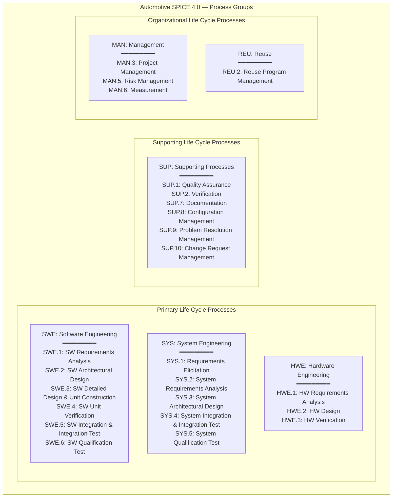
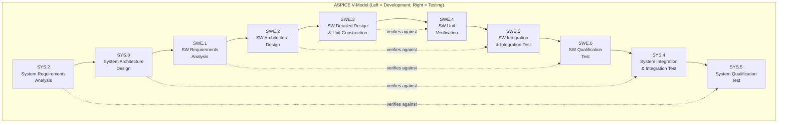

# Automotive SPICE 4.0 — Process Assessment Model

**Standard:** Automotive SPICE 4.0 (2024; VDA QMC / INTACS)  
**Predecessor:** Automotive SPICE 3.1 (2017); based on ISO/IEC 33001 framework  
**Full Name:** Automotive Software Process Improvement and Capability dEtermination  
**Domain:** Automotive embedded software & systems development  
**Assessment:** INTACS-certified assessors; VDA scope (German Auto Industry Association)  
**Audience:** ASPICE assessors, automotive SW/SYS engineers, quality managers, project managers, OEM supplier quality teams  
**Prerequisites:** Understanding of V-model; embedded SW development basics; ISO 26262 awareness

---

## Chapter 1 — Historical Context & Origin Story

### 1.1 Timeline

| Year | Milestone |
|------|-----------|
| 1993 | SPICE project initiated (ISO 15504 development) |
| 1998 | ISO/IEC 15504 Part 2 published (process assessment framework) |
| 2001 | German automotive OEMs (VDA) recognize need for automotive-specific assessment |
| 2005 | **Automotive SPICE v2.0** — first automotive-specific Process Assessment Model (PAM) |
| 2006 | HIS (Hersteller Initiative Software) scope defined — 15 key processes for supplier assessments |
| 2007 | INTACS (International Assessor Certification Scheme) established |
| 2010 | Automotive SPICE v2.4 — widely used; VDA mandates for supplier assessments |
| 2015 | ISO/IEC 33001 replaces ISO 15504 → ASPICE must align |
| 2017 | **Automotive SPICE v3.1** — aligned with ISO 33001; restructured; new HWE processes |
| 2023 | Automotive SPICE 4.0 development begins (Agile; cybersecurity; ML/AI integration) |
| 2024 | **Automotive SPICE 4.0** released — major restructuring; Agile-native; new process groups |

### 1.2 Why Automotive SPICE Exists

| Problem | How ASPICE Addresses It |
|---------|------------------------|
| Multiple OEMs assessing same supplier differently | Standard assessment model + certified assessors = comparable results |
| No automotive-specific process guidance | Process Reference Model (PRM) tailored to automotive V-model development |
| Supplier quality varies widely | Capability levels provide objective measurement; OEMs set minimum requirements (usually CL 2) |
| Software complexity growing exponentially | Structured engineering processes (SWE.1-6) ensure systematic development |
| Functional safety demands (ISO 26262) | ASPICE processes provide foundation for safety lifecycle (complementary to 26262) |
| Distributed development (global suppliers) | Standard assessment across geographies; INTACS ensures assessor competence worldwide |

### 1.3 VDA / HIS Scope

The original **HIS scope** (Hersteller Initiative Software — BMW, Daimler, VW, Audi, Porsche) defined 15 key processes for supplier assessments:

| Process Group | HIS Scope Processes |
|:---:|---|
| **SYS** | SYS.2 (System Requirements Analysis), SYS.3 (System Architecture Design), SYS.4 (System Integration Test), SYS.5 (System Qualification Test) |
| **SWE** | SWE.1 (SW Requirements Analysis), SWE.2 (SW Architectural Design), SWE.3 (SW Detailed Design & Unit Construction), SWE.4 (SW Unit Verification), SWE.5 (SW Integration Test), SWE.6 (SW Qualification Test) |
| **SUP** | SUP.1 (Quality Assurance), SUP.8 (Configuration Management), SUP.9 (Problem Resolution Management), SUP.10 (Change Request Management) |
| **MAN** | MAN.3 (Project Management) |

---

## Chapter 2 — Automotive SPICE 4.0 Architecture

### 2.1 Process Reference Model (PRM)



### 2.2 V-Model Mapping



---

## Chapter 3 — Capability Levels & Process Attributes

### 3.1 Capability Levels (CL 0-5)

| Level | Name | Process Attributes (PAs) |
|:-----:|:----:|:---|
| **0** | Incomplete | None — process not implemented or fails outcomes |
| **1** | Performed | PA 1.1: Process Performance |
| **2** | Managed | PA 2.1: Performance Management; PA 2.2: Work Product Management |
| **3** | Established | PA 3.1: Process Definition; PA 3.2: Process Deployment |
| **4** | Predictable | PA 4.1: Quantitative Analysis; PA 4.2: Quantitative Control |
| **5** | Innovating | PA 5.1: Process Innovation; PA 5.2: Process Optimization |

### 3.2 Process Attribute Rating Scale (ISO 33020)

| Rating | Achievement | Symbol |
|:------:|:-----------:|:------:|
| Not achieved | 0-15% | **N** |
| Partially achieved | 16-50% | **P** |
| Largely achieved | 51-85% | **L** |
| Fully achieved | 86-100% | **F** |

### 3.3 Capability Level Achievement Rules

| Target CL | Requirement |
|:---------:|-------------|
| CL 1 | PA 1.1 ≥ L (Largely or Fully achieved) |
| CL 2 | PA 1.1 = F; PA 2.1 ≥ L; PA 2.2 ≥ L |
| CL 3 | PA 1.1 = F; PA 2.1 = F; PA 2.2 = F; PA 3.1 ≥ L; PA 3.2 ≥ L |
| CL 4 | All lower PAs = F; PA 4.1 ≥ L; PA 4.2 ≥ L |
| CL 5 | All lower PAs = F; PA 5.1 ≥ L; PA 5.2 ≥ L |

### 3.4 What Each Process Attribute Means

| PA | Name | What Assessor Looks For |
|:--:|:----:|---|
| **1.1** | Process Performance | Are outcomes achieved? Are base practices performed? Do work products exist? |
| **2.1** | Performance Management | Is process planned? Are roles assigned? Is progress monitored? Resources adequate? Are interfaces managed? |
| **2.2** | Work Product Management | Are work products identified? Are they reviewed? Are they baselined? Is traceability maintained? |
| **3.1** | Process Definition | Is there an organizational standard process? Are tailoring guidelines available? |
| **3.2** | Process Deployment | Is the standard process deployed? Are projects tailoring from standard? Data collected for process improvement? |
| **4.1** | Quantitative Analysis | Are measurement needs identified? Data collected and analyzed? Process capability determined? |
| **4.2** | Quantitative Control | Are control limits established? Special causes detected and resolved? Corrective actions taken? |
| **5.1** | Process Innovation | Are improvement objectives set? Are innovations identified and evaluated? Best practices deployed? |
| **5.2** | Process Optimization | Is improvement impact assessed? Are changes managed systematically? Is optimization effective? |

---

## Chapter 4 — Process Deep Dive (SWE.1-SWE.6)

### 4.1 SWE.1: Software Requirements Analysis

| Aspect | Detail |
|:------:|--------|
| **Purpose** | Establish SW requirements from system requirements + stakeholder needs |
| **Base Practices** | BP1: Specify SW requirements; BP2: Structure SW requirements; BP3: Analyze SW requirements; BP4: Analyze impact on operating environment; BP5: Develop verification criteria; BP6: Establish bidirectional traceability; BP7: Ensure consistency; BP8: Communicate agreed SW requirements |
| **Key Output Work Products** | Software requirements specification (SRS); Traceability matrix (System req → SW req); Verification criteria (per requirement) |
| **CL 2 evidence** | SRS is planned (in project plan); SRS is reviewed (review records); SRS is baselined (CM); Changes are controlled; Traceability is maintained |
| **Common gaps** | No verification criteria defined (just "test it"); no bidirectional traceability; requirements ambiguous (no measurable acceptance criteria); derived requirements not traced; interface requirements missing |

### 4.2 SWE.2: Software Architectural Design

| Aspect | Detail |
|:------:|--------|
| **Purpose** | Establish SW architecture that identifies elements, their interfaces, and dynamic behavior |
| **Base Practices** | BP1: Develop SW architecture; BP2: Allocate SW requirements to elements; BP3: Define interfaces; BP4: Describe dynamic behavior; BP5: Define resource consumption objectives; BP6: Evaluate architecture (against quality attributes; alternatives); BP7: Establish bidirectional traceability; BP8: Ensure consistency; BP9: Communicate SW architecture |
| **Key Output Work Products** | SW Architecture Document (SAD); Interface descriptions; Traceability (SW req → architecture element); Resource budgets |
| **Assessment focus** | Is architecture documented (not just in developer's head)? Are interfaces formally described? Is allocation of requirements to components explicit? Can you trace each SW requirement to the architecture element that realizes it? |

### 4.3 SWE.3: SW Detailed Design & Unit Construction

| Aspect | Detail |
|:------:|--------|
| **Purpose** | Develop detailed design and produce software units |
| **Base Practices** | BP1: Develop detailed design; BP2: Define interfaces; BP3: Describe dynamic behavior; BP4: Develop unit implementation; BP5: Establish bidirectional traceability; BP6: Ensure consistency; BP7: Communicate detailed design |
| **Key focus** | Design decisions documented; coding standards applied; traceability: architecture element → detailed design → code file |

### 4.4 SWE.4: SW Unit Verification

| Aspect | Detail |
|:------:|--------|
| **Purpose** | Verify that each SW unit fulfills its detailed design |
| **Base Practices** | BP1: Develop unit verification strategy; BP2: Develop unit test specifications (test cases); BP3: Select verification methods (review, static analysis, dynamic test); BP4: Perform unit verification; BP5: Establish bidirectional traceability; BP6: Ensure consistency; BP7: Summarize and communicate results |
| **Evidence** | Unit test plan/strategy; test specifications traceable to detailed design; test results (pass/fail); code coverage report; static analysis report (e.g., MISRA compliance) |

### 4.5 SWE.5: SW Integration & Integration Test

| Aspect | Detail |
|:------:|--------|
| **Purpose** | Integrate SW units into larger assemblies; verify that they work together |
| **Base Practices** | BP1: Develop integration strategy; BP2: Develop integration test specifications; BP3: Integrate SW units (according to strategy); BP4: Perform integration tests; BP5: Establish bidirectional traceability; BP6: Ensure consistency; BP7: Summarize and communicate results |
| **Key focus** | Integration order defined (not "big bang"); interfaces tested; tests traceable to SW architecture (interface descriptions); regression approach defined |

### 4.6 SWE.6: SW Qualification Test

| Aspect | Detail |
|:------:|--------|
| **Purpose** | Verify that integrated SW fulfills SW requirements |
| **Base Practices** | BP1: Develop qualification test strategy; BP2: Develop qualification test specifications; BP3: Perform qualification testing; BP4: Establish bidirectional traceability; BP5: Ensure consistency; BP6: Summarize and communicate results |
| **Key focus** | Tests traceable to SW requirements (SRS); all SW requirements covered by at least one test; test results demonstrate requirement fulfillment; test environment representative of target |

---

## Chapter 5 — Assessment Process

### 5.1 INTACS Assessment Approach

```mermaid
graph TB
    subgraph "ASPICE Assessment Process"
        SCOPE[Assessment Planning<br/>━━━━━━━━━<br/>• Define scope (which processes? CL target?)<br/>• Select assessment team (Lead + Co-assessors)<br/>• Schedule (typically 3-5 days on-site)<br/>• Request artifact preparation]
        
        KICK[Kickoff / Briefing<br/>━━━━━━━━━<br/>• Explain assessment approach<br/>• Confirm scope + schedule<br/>• Identify interview participants<br/>• Clarify expectations]
        
        DATA[Data Collection<br/>━━━━━━━━━<br/>• Document/artifact review<br/>• Interviews (process owners; engineers; managers)<br/>• Tool demonstrations<br/>• Observation of practices]
        
        CONSOL[Consolidation<br/>━━━━━━━━━<br/>• Assessor team reviews findings<br/>• Rate each base practice + process attribute<br/>• Identify strengths and weaknesses<br/>• Determine provisional ratings]
        
        FINAL[Final Presentation<br/>━━━━━━━━━<br/>• Present findings to assessed party<br/>• Discuss disagreements<br/>• Finalize ratings<br/>• Improvement recommendations]
        
        REPORT[Assessment Report<br/>━━━━━━━━━<br/>• Process capability profiles<br/>• Findings (strengths/weaknesses)<br/>• Improvement opportunities<br/>• Report delivered to OEM sponsor]
    end
    
    SCOPE --> KICK --> DATA --> CONSOL --> FINAL --> REPORT
```

### 5.2 Assessor Qualifications (INTACS)

| Level | Title | Requirements |
|:-----:|:-----:|---|
| **Provisional** | Provisional Assessor | INTACS training + exam pass; no assessment experience yet |
| **Competent** | Competent Assessor | Provisional + participated in ≥ 2 assessments under supervision |
| **Principal** | Principal Assessor (Lead) | Competent + led ≥ 3 assessments + demonstrated proficiency; can lead assessments independently |

### 5.3 Assessment Effort

| Assessment Type | Typical Duration | Scope |
|:-:|:-:|---|
| **Full HIS scope** (15 processes) | 4-5 days on-site + preparation | All SWE, SYS, SUP, MAN processes for one project |
| **Focused scope** (6-8 processes) | 2-3 days on-site | Selected processes (e.g., SWE only; or SYS + MAN) |
| **Mini assessment** (gap analysis) | 1-2 days | Quick check; informal; identify major gaps |
| **Surveillance** (follow-up) | 1-2 days | Re-assess previously identified weaknesses |

---

## Chapter 6 — ASPICE 4.0 Changes (vs 3.1)

### 6.1 Key Differences

| Aspect | ASPICE 3.1 | ASPICE 4.0 |
|:------:|:----------:|:----------:|
| **Agile support** | Implied but not explicit | Explicitly supports Agile/iterative; outcome-focused |
| **Process names** | SWE.5: SW Integration Test | SWE.5: SW Integration & Integration Test (combined) |
| **Cybersecurity** | Not addressed | New processes/guidance for cybersecurity (aligned with ISO 21434) |
| **Machine Learning** | Not addressed | Guidance for ML/AI component development |
| **Work products** | Prescriptive list | Outcome-focused; less document-centric |
| **Assessment** | ISO 15504 aligned (partly) | Fully ISO 33001 aligned |
| **Structure** | Hierarchical (processes + base practices) | Streamlined; better integration between process groups |
| **Continuous integration** | Not addressed | CI/CD pipeline as valid engineering approach |

### 6.2 Agile Integration in ASPICE 4.0

| Traditional Expectation | ASPICE 4.0 Agile Interpretation |
|:---:|---|
| Formal SRS document | Backlog with acceptance criteria + traceability; formalized at release milestones |
| Architecture document (one-time creation) | Living architecture (ADRs + wiki); formalized at release; continuously updated |
| Sequential V-model phases | Iterative within V-structure; each sprint produces tested increments |
| Formal review meetings (with minutes) | Pull request reviews = code/design review evidence; sprint reviews = stakeholder validation |
| Test plans as separate documents | Test strategy in CI configuration; test specifications in code (test-as-code) |
| Change control board (formal meetings) | Lightweight change management; backlog refinement = impact analysis; Jira workflow = CR process |

---

## Chapter 7 — Comparison: ASPICE vs Alternatives

| Criterion | ASPICE 4.0 | CMMI v2.0 | ISO 9001 | ISO 26262 | ISO 21434 |
|:---------:|:----------:|:---------:|:--------:|:---------:|:---------:|
| **Focus** | Process capability (automotive) | Organization maturity (any) | QMS (any) | Functional safety | Cybersecurity |
| **Levels** | CL 0-5 (per process) | ML 1-5 (org); CL 0-3 (process) | Certified / not | ASIL A-D | CAL 1-4 |
| **What it measures** | How well processes are performed | How mature the organization is | QMS conformance | Safety of E/E systems | Security of E/E systems |
| **Mandatory for automotive?** | De-facto mandatory (OEM requirement) | Not in automotive | Often required (ISO/TS 16949) | Legally required (EU GSR) | Legally required (UN R155) |
| **Assessment by** | INTACS assessors | SCAMPI appraisers | ISO certification body | Auditor (TÜV, DEKRA) | Auditor |
| **Complementary?** | Yes (with all others) | Alternative approach | QMS foundation for ASPICE | Safety NEEDS ASPICE processes | Cybersecurity NEEDS ASPICE processes |
| **Cost** | $30-100K | $100-300K | $20-50K | Part of development cost | Part of development cost |

### 7.1 ASPICE + ISO 26262 Relationship

```mermaid
graph TB
    subgraph "ASPICE + ISO 26262 Relationship"
        ASPICE_P[ASPICE<br/>━━━━━━━━━<br/>• HOW to develop<br/>• Process capability<br/>• Engineering discipline<br/>• Any automotive SW]
        
        ISO26262_P[ISO 26262<br/>━━━━━━━━━<br/>• WHAT safety measures<br/>• ASIL determines rigor<br/>• Safety-specific activities<br/>• Safety-related E/E only]
        
        OVERLAP[Overlap<br/>━━━━━━━━━<br/>• Requirements traceability<br/>• Architecture (safety decomposition)<br/>• Verification/testing<br/>• Configuration management<br/>• Change management]
    end
    
    ASPICE_P -->|"provides process foundation"| OVERLAP
    ISO26262_P -->|"adds safety-specific rigor"| OVERLAP
```

**Key principle:** "Good ASPICE processes are necessary but NOT SUFFICIENT for ISO 26262 compliance. ISO 26262 adds safety-specific requirements (HARA, safety goals, safety mechanisms, DFA/DFM, proven-in-use) ON TOP of good engineering processes."

---

## Chapter 8 — Traceability Architecture

### 8.1 Bidirectional Traceability (ASPICE Core Requirement)

```mermaid
graph TB
    subgraph "ASPICE Traceability Chain"
        STAKEHOLDER[Stakeholder Requirements<br/>(SYS.1 output)]
        
        SYS_REQ[System Requirements<br/>(SYS.2 output)]
        
        SYS_ARCH[System Architecture<br/>(SYS.3 output)<br/>→ SW, HW, Mechanical elements]
        
        SW_REQ[SW Requirements<br/>(SWE.1 output)]
        
        SW_ARCH[SW Architecture<br/>(SWE.2 output)<br/>→ Components; modules]
        
        SW_DETAIL[SW Detailed Design<br/>(SWE.3 output)]
        
        CODE[Source Code<br/>(SWE.3 output)]
        
        UNIT_TEST[Unit Test Specs<br/>(SWE.4)]
        
        INT_TEST[Integration Test Specs<br/>(SWE.5)]
        
        QUAL_TEST[Qualification Test Specs<br/>(SWE.6)]
        
        SYS_INT[System Integration Test<br/>(SYS.4)]
        
        SYS_QUAL[System Qualification Test<br/>(SYS.5)]
    end
    
    STAKEHOLDER --> SYS_REQ --> SYS_ARCH --> SW_REQ --> SW_ARCH --> SW_DETAIL --> CODE
    
    CODE -.->|"verified by"| UNIT_TEST
    SW_ARCH -.->|"verified by"| INT_TEST
    SW_REQ -.->|"verified by"| QUAL_TEST
    SYS_ARCH -.->|"verified by"| SYS_INT
    SYS_REQ -.->|"verified by"| SYS_QUAL
```

### 8.2 Traceability Rules

| Rule | Description |
|:----:|-------------|
| **Completeness** | Every requirement at level N must be traced to at least one item at level N+1 (forward); every item at level N+1 must trace back to at least one requirement at level N (backward) |
| **Consistency** | No orphan requirements (traced but nowhere implemented); no undocumented functionality (implemented but not traced to any requirement) |
| **Bidirectional** | Links must work both ways: requirement → design AND design → requirement |
| **Verification** | Every requirement must have associated verification criteria AND be covered by at least one test |
| **Coverage** | Traceability matrix must show 100% coverage (no gaps) |

---

## Chapter 9 — Case Studies

### 9.1 Tier-1 Supplier: CL 1 → CL 2 in 18 Months

| Aspect | Detail |
|--------|--------|
| **Company** | Tier-1 supplier; developing Body ECU (windows, mirrors, seats); 80 SW engineers |
| **Trigger** | OEM assessment revealed CL 1 for most SWE processes; OEM requires CL 2 for contract renewal |
| **Major gaps found** | (1) No traceability (requirements exist but not linked to design/tests). (2) No SW architecture document (architecture "in developers' heads"). (3) Unit tests exist but no strategy; no traceability to design; low coverage. (4) No formal reviews (code goes directly from developer to integration). (5) CM exists but no baselines; no clear release process. |
| **Improvement actions** | Month 1-3: Gap analysis + improvement plan. Tool deployment (DOORS for requirements; Enterprise Architect for architecture; Jenkins for CI). Month 4-9: Process definition (SWE.1-6 tailored; templates; checklists). Pilot on 2 projects. Train 80 engineers. Month 10-15: Rollout to all projects. Internal assessments. Close gaps. Month 16-18: External assessment preparation; mock assessment; formal assessment. |
| **Result** | External assessment: CL 2 achieved for SWE.1-6, MAN.3, SUP.8. SUP.9 and SUP.10 at CL 1+ (gaps in problem resolution process → improvement plan). |
| **Key success factor** | Management commitment (dedicated process engineer team: 4 FTE); tool automation (traceability via DOORS-to-Git links); quick wins visible (fewer integration defects from sprint 3 onward). |

### 9.2 Failure Case: Assessment Failed

| Aspect | Detail |
|--------|--------|
| **Company** | Tier-2 supplier; 25 engineers; developing sensor fusion SW module |
| **Assessment goal** | CL 2 for SWE.1-6 (OEM contract requirement) |
| **Why it failed** | (1) "Paper compliance" — processes defined but not followed (SRS template filled but requirements not actually analyzed). (2) Traceability in Excel (not maintained; out of date by 3 sprints). (3) Architecture document from 2 years ago (not updated when design changed). (4) No unit test strategy (random tests; no traceability; 30% code coverage). (5) Reviews are "rubber stamps" (no findings; reviews take 5 minutes → assessor doesn't believe quality). |
| **Assessor findings** | PA 1.1 (Process Performance): **P** (Partially) — practices exist on paper but outcomes not achieved. PA 2.1 (Performance Management): **P** — no actual monitoring of process adherence. PA 2.2 (Work Product Management): **N** — work products not baselined; not reviewed properly. Overall: CL 1 not achieved (PA 1.1 = P, need ≥ L). |
| **Root cause** | Management treated ASPICE as "documentation exercise" not engineering improvement. No dedicated process engineering support. Engineers saw ASPICE as overhead, not as quality enabler. |
| **Recovery** | 12-month intensive improvement with coaching; focus on "living processes" not documents; automated traceability; meaningful code reviews with defect data. Re-assessed after 12 months: CL 2 achieved. |

---

## Chapter 10 — Future Evolution

| Trend | Timeline | Impact |
|-------|----------|--------|
| **ASPICE 4.0 adoption** | 2024-2026 | Industry transition from 3.1 to 4.0; assessors retrained; OEMs update requirements |
| **Agile-native ASPICE** | Now (4.0) | Less focus on document format; more on outcomes + evidence; CI/CD pipelines as engineering evidence |
| **Cybersecurity processes** | 2024+ | ISO/SAE 21434 mapped to ASPICE; security engineering processes assessed |
| **AI/ML development** | 2024-2027 | How to assess ML model development; training data management; model verification |
| **Continuous assessment** | 2025-2030 | Automated compliance monitoring instead of annual assessments; tool-based evidence collection |
| **SDV (Software-Defined Vehicle)** | 2024+ | Cloud-native development; OTA updates; service-oriented architecture → new process needs |
| **ASPICE for Mobility** | 2025+ | Extension beyond traditional automotive to mobility services; autonomous driving |
| **Tool qualification** | Now | Increased focus on tool confidence levels (TCL) per ISO 26262; tool validation evidence |

---

## Chapter 11 — Interview Questions & Career Guide

### Tier 1: Entry-Level

**Q1:** What are the 6 SWE processes in Automotive SPICE? Explain the V-model relationship.

**A:**

| Left Side (Development) | Right Side (Verification) | Relationship |
|:---:|:---:|---|
| **SWE.1**: SW Requirements Analysis | **SWE.6**: SW Qualification Test | SWE.6 verifies that SW meets requirements defined in SWE.1 |
| **SWE.2**: SW Architectural Design | **SWE.5**: SW Integration & Integration Test | SWE.5 verifies interfaces/interactions defined in SWE.2 architecture |
| **SWE.3**: SW Detailed Design & Unit Construction | **SWE.4**: SW Unit Verification | SWE.4 verifies that units match detailed design from SWE.3 |

**V-model principle:** Each development activity (left side) has a corresponding verification activity (right side). The test at each level verifies against the specification produced at the same level.

**Q2:** What is the difference between Capability Level 1 and Capability Level 2?

**A:**
- **CL 1 (Performed):** The process achieves its purpose/outcomes. Work products exist. But: may be ad-hoc; not planned; not consistently repeated; depends on individual effort.
- **CL 2 (Managed):** EVERYTHING from CL 1 PLUS: the process is planned (who, when, what, how); monitored (progress tracked); resources allocated; work products are reviewed and baselined (configuration managed); traceability is maintained. **Key additions:** planning, monitoring, CM, reviews.

### Tier 2: Mid-Level

**Q3:** You are preparing for an ASPICE assessment. What evidence would you prepare for SWE.2 (SW Architectural Design) at CL 2?

**A:**

| Evidence Category | Specific Evidence |
|:---:|---|
| **PA 1.1 (Process Performance)** | SW Architecture Document (SAD): shows components, interfaces, dynamic behavior, resource budgets. Traceability matrix: every SW requirement → architecture element. Architecture evaluation records (review/trade-study). |
| **PA 2.1 (Performance Management)** | Project plan shows SWE.2 activities (architecture creation, review, update). Schedule shows when architecture activities occurred. Roles assigned (architect role; reviewer role). Status tracking (milestone: architecture reviewed/approved). |
| **PA 2.2 (Work Product Management)** | SAD is under CM (baselined; versioned). SAD was reviewed (review protocol/minutes; review findings; corrections made). Traceability matrix is maintained and up-to-date. Interface descriptions are documented and agreed with stakeholders. |

**Common pitfalls:**
- Architecture document exists but is outdated (last changed 18 months ago while code changed weekly) → assessor will question PA 1.1
- No evidence of architecture review → PA 2.2 fails (work products not reviewed)
- Traceability has gaps (5 SW requirements not allocated to any component) → PA 1.1 weak (BP7 consistency not achieved)

### Tier 3: Senior

**Q4:** Design a process improvement roadmap for a 200-person automotive SW organization currently at CL 1, targeting CL 3 within 3 years. Consider organizational change management challenges.

**A:**

**Phase 1: Foundation (Month 1-12) — Target: CL 2 for HIS scope**

| Activity | Details |
|:--------:|---------|
| Gap assessment | Assess current state; identify biggest gaps per process; prioritize |
| Tool infrastructure | Requirements management (DOORS/Polarion); architecture (Enterprise Architect); CM (Git + branching); CI (Jenkins/GitLab CI); test management (TestRail) |
| Process definition | Define tailored processes for CL 2 (templates; checklists; workflows); keep lightweight |
| Pilot projects (2-3) | Implement new processes on 2-3 projects with coaching; learn what works |
| Training | All engineers trained on: requirements writing; architecture documentation; reviews; testing; CM |
| Quick wins | Automated traceability (tool links); CI pipeline with unit tests; automated MISRA checks |
| Internal assessment | After 9 months: internal assessment on pilots → expect CL 1+ or CL 2; close gaps |
| External assessment | Month 12: formal assessment on pilot projects → CL 2 target |

**Phase 2: Standardization (Month 13-24) — Target: CL 2 org-wide; CL 3 for pilots**

| Activity | Details |
|:--------:|---------|
| Rollout | Extend CL 2 practices from pilots to all projects (20+ projects) |
| Org standard process | Define organizational standard process (tailoring guidelines; process library) |
| Process group | Establish dedicated process engineering team (6-8 FTE SEPG equivalent) |
| Metrics | Implement measurement (defect density; review effectiveness; test coverage; process adherence) |
| CL 3 pilots | Selected projects start CL 3 practices (tailoring from org standard; collecting process data) |
| Cross-project learning | Lessons-learned process; reuse of best practices across projects |

**Phase 3: Institutionalization (Month 25-36) — Target: CL 3 across organization**

| Activity | Details |
|:--------:|---------|
| Full deployment | All projects use org standard process; tailoring is systematic |
| Continuous improvement | Use metrics data to improve processes; process performance baselines |
| Assessment | Internal CL 3 assessment (all projects) → external assessment → CL 3 certification |
| Sustain | Process ownership roles permanent; improvement cycles institutionalized |

**Change management challenges + mitigation:**

| Challenge | Mitigation |
|:---------:|------------|
| Engineer resistance ("overhead!") | Show value: fewer integration bugs; automated traceability; less rework. Involve engineers in process design. |
| Management impatience | Set realistic milestones; show progress metrics monthly; celebrate quick wins |
| Tool adoption friction | Provide training + coaching (not just classroom); dedicated tool support team |
| Maintaining momentum over 3 years | Phased approach with visible milestones; external assessment as forcing function; link to business outcomes (contracts) |
| Organizational restructuring | Anchor processes in tools and templates (survive people changes); document institutional knowledge |

---

## Chapter 12 — Cheat Sheet & Quick Reference

```
═══════════════════════════════════════════
AUTOMOTIVE SPICE 4.0 — QUICK REFERENCE
═══════════════════════════════════════════

CAPABILITY LEVELS:
  CL 0: Incomplete (process not implemented)
  CL 1: Performed (outcomes achieved; ad-hoc OK)
  CL 2: Managed (planned; monitored; CM; reviewed)
  CL 3: Established (org standard; tailored; deployed)
  CL 4: Predictable (SPC; quantitative control)
  CL 5: Innovating (continuous improvement; innovation)

═══════════════════════════════════════════
PA RATING SCALE:
  N = Not achieved (0-15%)
  P = Partially achieved (16-50%)
  L = Largely achieved (51-85%)
  F = Fully achieved (86-100%)

  CL achievement: lower PAs = F; target PA ≥ L

═══════════════════════════════════════════
HIS SCOPE (15 KEY PROCESSES):
  SWE: SWE.1-6 (Requirements → Qualification)
  SYS: SYS.2-5 (Req → Qualification)
  SUP: SUP.1, SUP.8-10 (QA, CM, Problem, Change)
  MAN: MAN.3 (Project Management)

═══════════════════════════════════════════
V-MODEL TRACEABILITY:
  SYS.2 ↔ SYS.5 (Sys Req ↔ Sys Qualification)
  SYS.3 ↔ SYS.4 (Sys Arch ↔ Sys Integration)
  SWE.1 ↔ SWE.6 (SW Req ↔ SW Qualification)
  SWE.2 ↔ SWE.5 (SW Arch ↔ SW Integration)
  SWE.3 ↔ SWE.4 (Detailed Design ↔ Unit Test)

═══════════════════════════════════════════
CL 2 ESSENTIALS:
  ✓ Process is PLANNED (activities in project plan)
  ✓ Progress is MONITORED (status tracking)
  ✓ Work products are REVIEWED (review records)
  ✓ Work products are BASELINED (CM control)
  ✓ TRACEABILITY is maintained (bidirectional)
  ✓ Resources and roles ASSIGNED

═══════════════════════════════════════════
ASPICE + AGILE MAPPING:
  SRS = Backlog (Epics + Stories + Acceptance Criteria)
  SAD = ADRs + Architecture Wiki (living; baselined at release)
  Review = PR review + Sprint Review
  Test Plan = CI configuration + Test Strategy
  CM = Git + branching + semantic versioning
  Traceability = Tool links (Jira ↔ Git ↔ Jenkins)

═══════════════════════════════════════════
ASPICE vs ISO 26262:
  ASPICE = HOW (process quality; engineering discipline)
  26262 = WHAT (safety measures; ASIL-dependent rigor)
  Both required; ASPICE is foundation for 26262

═══════════════════════════════════════════
ASSESSOR LEVELS (INTACS):
  Provisional → Competent → Principal (Lead)

═══════════════════════════════════════════
TYPICAL ASSESSMENT:
  Full HIS scope: 4-5 days on-site
  Focused (6-8 processes): 2-3 days
  Mini/gap: 1-2 days
```

---

*End of Document — 02_Automotive_SPICE_4_0.md*
