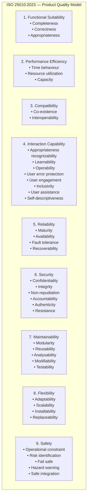

# ISO/IEC 25010:2023 — Software Product Quality Model

**Standard:** ISO/IEC 25010:2023 (Systems and software engineering — Systems and software Quality Requirements and Evaluation — Product quality model)  
**Series:** SQuaRE (ISO/IEC 25000 series — Systems and software Quality Requirements and Evaluation)  
**Predecessor:** ISO/IEC 25010:2011; ISO/IEC 9126 series (1991-2004)  
**SDO:** ISO/IEC JTC 1/SC 7  
**Audience:** Software architects, quality engineers, requirements engineers, testers, product managers  
**Prerequisites:** Basic software engineering; understanding of non-functional requirements (NFRs)

---

## Chapter 1 — Historical Context & Origin Story

### 1.1 Timeline

| Year | Milestone |
|------|-----------|
| 1977 | McCall's quality factors model (Correctness, Reliability, Efficiency, etc.) |
| 1978 | Boehm's quality model |
| 1991 | **ISO/IEC 9126:1991** — first ISO software quality characteristics standard (6 characteristics) |
| 2001 | ISO/IEC 9126-1:2001 (revised; added quality-in-use model) |
| 2003-2004 | ISO 9126 Parts 2-4 (external/internal metrics; quality-in-use metrics) |
| 2005 | SQuaRE project begins (replaces 9126 + 14598 series with unified 25000 series) |
| 2011 | **ISO/IEC 25010:2011** — 8 characteristics; replaced 9126 model |
| 2014 | ISO/IEC 25012 (Data quality model) |
| 2016 | ISO/IEC 25022 (Quality in use measurement); ISO/IEC 25023 (Product quality measurement) |
| 2023 | **ISO/IEC 25010:2023** — 9 characteristics (added Flexibility + Safety; renamed Usability) |

### 1.2 Evolution of Quality Models

| Model | Year | Characteristics | Key Innovation |
|:-----:|:----:|:-:|---|
| **McCall** | 1977 | 11 factors | First systematic quality classification (Product Operation, Revision, Transition) |
| **Boehm** | 1978 | Hierarchical | Quality attributes organized as tree; measurability emphasized |
| **ISO 9126** | 1991/2001 | 6 (+4 quality-in-use) | International standard; Functionality, Reliability, Usability, Efficiency, Maintainability, Portability |
| **ISO 25010:2011** | 2011 | 8 (+5 quality-in-use) | Added Security + Compatibility; renamed Efficiency → Performance Efficiency |
| **ISO 25010:2023** | 2023 | **9** (+5 quality-in-use) | Added Flexibility + Safety; renamed Usability → Interaction Capability; split Portability |

---

## Chapter 2 — SQuaRE Series Architecture

### 2.1 ISO 25000 Series Structure

```mermaid
graph TB
    subgraph "SQuaRE Series (ISO 25000)"
        subgraph "2500n — Quality Management"
            S25000[ISO 25000<br/>Guide to SQuaRE]
            S25001[ISO 25001<br/>Planning & Management]
        end
        
        subgraph "2501n — Quality Model"
            S25010[ISO 25010<br/>Product Quality Model<br/>━━━━━━━━━<br/>9 characteristics<br/>+ Quality in Use (5)]
            S25012[ISO 25012<br/>Data Quality Model]
            S25019[ISO 25019<br/>Quality in Use Model]
        end
        
        subgraph "2502n — Quality Measurement"
            S25020[ISO 25020<br/>Measurement Reference Model]
            S25022[ISO 25022<br/>Quality in Use Measures]
            S25023[ISO 25023<br/>Product Quality Measures]
            S25024[ISO 25024<br/>Data Quality Measures]
        end
        
        subgraph "2503n — Quality Requirements"
            S25030[ISO 25030<br/>Quality Requirements]
        end
        
        subgraph "2504n — Quality Evaluation"
            S25040[ISO 25040<br/>Evaluation Process]
            S25041[ISO 25041<br/>Evaluation Guide for Developers]
            S25045[ISO 25045<br/>Evaluation Module for Recoverability]
        end
    end
```

---

## Chapter 3 — Product Quality Model (ISO 25010:2023)

### 3.1 Nine Quality Characteristics

| # | Characteristic | Sub-characteristics | Definition |
|:-:|:-:|---|---|
| 1 | **Functional Suitability** | Functional completeness, Functional correctness, Functional appropriateness | Degree to which functions meet stated and implied needs |
| 2 | **Performance Efficiency** | Time behaviour, Resource utilization, Capacity | Performance relative to resources used under stated conditions |
| 3 | **Compatibility** | Co-existence, Interoperability | Degree to which it can exchange information and coexist with other systems |
| 4 | **Interaction Capability** | Appropriateness recognizability, Learnability, Operability, User error protection, User engagement, Inclusivity, User assistance, Self-descriptiveness | Degree to which users can interact effectively (was "Usability" in 2011) |
| 5 | **Reliability** | Maturity, Availability, Fault tolerance, Recoverability | Degree to which system performs under specified conditions for specified period |
| 6 | **Security** | Confidentiality, Integrity, Non-repudiation, Accountability, Authenticity, Resistance | Protection of information and data |
| 7 | **Maintainability** | Modularity, Reusability, Analysability, Modifiability, Testability | Degree of effectiveness/efficiency with which it can be modified |
| 8 | **Flexibility** | Adaptability, Scalability, Installability, Replaceability | Degree to which system can be adapted to changes in requirements/environment (NEW in 2023) |
| 9 | **Safety** | Operational constraint, Risk identification, Fail safe, Hazard warning, Safe integration | Degree to which system avoids states endangering life/health/property/environment (NEW in 2023) |

### 3.2 Detailed Sub-characteristics



### 3.3 Changes from 2011 to 2023

| Aspect | ISO 25010:2011 | ISO 25010:2023 | Rationale |
|:------:|:-:|:-:|---|
| **Characteristics count** | 8 | 9 | Added Safety + Flexibility |
| **Usability** | "Usability" (6 sub-chars) | "Interaction Capability" (8 sub-chars) | Broader scope; added engagement, inclusivity, self-descriptiveness |
| **Portability** | Portability (Adaptability, Installability, Replaceability) | Split into **Flexibility** (Adaptability, Scalability, Installability, Replaceability) | Scalability added; concept broadened beyond just "porting" |
| **Safety** | Not present | **Safety** (5 sub-chars) | Critical for IoT, automotive, medical, industrial systems |
| **Security** | 5 sub-chars | 6 sub-chars (added Resistance) | Resistance to attacks added explicitly |
| **Compatibility** | Same | Same | Unchanged |

---

## Chapter 4 — Quality in Use Model

### 4.1 Quality in Use Characteristics

| Characteristic | Sub-characteristics | Definition |
|:-:|---|---|
| **Effectiveness** | — | Accuracy and completeness with which users achieve goals |
| **Efficiency** | — | Resources used in relation to accuracy/completeness of goals |
| **Satisfaction** | Usefulness, Trust, Pleasure, Comfort | Users' cognitive and emotional responses |
| **Freedom from Risk** | Economic risk mitigation, Health & safety risk mitigation, Environmental risk mitigation | Degree to which product mitigates potential risk |
| **Context Coverage** | Context completeness, Flexibility | Degree to which product can be used in all intended contexts |

### 4.2 Product Quality vs Quality in Use

| Aspect | Product Quality (ISO 25010 main model) | Quality in Use (ISO 25019) |
|:------:|:-:|:-:|
| **Perspective** | The product itself (properties/attributes) | The user's experience WITH the product |
| **Measured** | Objectively (metrics on the system) | Subjectively (user outcomes; real-world results) |
| **When measured** | During development/testing | During actual use (or user testing) |
| **Example** | "Response time < 200ms" (Performance Efficiency) | "Users complete task in < 30 seconds" (Efficiency quality-in-use) |
| **Relationship** | Enabling | Result |

**Key insight:** Good product quality ENABLES good quality-in-use, but does not guarantee it. A system with excellent performance (product quality) may still have poor quality-in-use if the workflow design is poor.

---

## Chapter 5 — Quality Measurement (ISO 25023)

### 5.1 Measurement Approach

| Step | Activity |
|:----:|----------|
| 1 | **Identify quality requirements** — which characteristics/sub-characteristics are important? |
| 2 | **Select measures** — choose appropriate measures from ISO 25023 catalog (or define custom) |
| 3 | **Define target values** — acceptable ranges; thresholds |
| 4 | **Measure** — apply measures to the system (during testing; in production) |
| 5 | **Evaluate** — compare measured values against targets |
| 6 | **Report** — document results; decide on acceptance |

### 5.2 Example Measures (from ISO 25023)

| Characteristic | Sub-characteristic | Measure | Formula |
|:-:|:-:|:-:|---|
| **Functional Suitability** | Completeness | Functional implementation completeness | $\frac{\text{functions implemented}}{\text{functions specified}} \times 100\%$ |
| **Performance Efficiency** | Time behaviour | Mean response time | $\bar{t} = \frac{1}{n}\sum_{i=1}^{n} t_i$ |
| **Reliability** | Availability | System availability | $A = \frac{\text{MTBF}}{\text{MTBF} + \text{MTTR}} \times 100\%$ |
| **Reliability** | Maturity | Defect density | $D = \frac{\text{defects found}}{\text{KLOC}}$ |
| **Security** | Confidentiality | Access controllability | $\frac{\text{access controlled items}}{\text{items requiring control}} \times 100\%$ |
| **Maintainability** | Testability | Test coverage | $C = \frac{\text{items tested}}{\text{total items}} \times 100\%$ |
| **Maintainability** | Modularity | Coupling | Average inter-module coupling (lower = better) |

### 5.3 Setting Quality Targets

| Priority | Approach | Example |
|:--------:|----------|---------|
| **Critical** (must-have) | Hard threshold; system rejected if not met | "Availability ≥ 99.99%; response time P99 < 500ms" |
| **Important** (should-have) | Target with acceptable degradation | "Test coverage ≥ 80%; acceptable range: 75-85%" |
| **Desired** (nice-to-have) | Goal; not blocking | "Accessibility WCAG 2.1 AA compliance; aim for AAA where feasible" |

---

## Chapter 6 — Quality Evaluation (ISO 25040)

### 6.1 Evaluation Process

```mermaid
graph TB
    subgraph "ISO 25040 Evaluation Process"
        ESTAB[Establish Evaluation Requirements<br/>━━━━━━━━━<br/>• Identify evaluation purpose<br/>• Identify product quality requirements<br/>• Identify quality characteristics of interest<br/>• Define rigor of evaluation]
        
        SPEC[Specify the Evaluation<br/>━━━━━━━━━<br/>• Select quality measures<br/>• Define decision criteria (thresholds)<br/>• Define evaluation plan (schedule; method)]
        
        DESIGN[Design the Evaluation<br/>━━━━━━━━━<br/>• Plan measurement activities<br/>• Design test scenarios<br/>• Identify tools/infrastructure<br/>• Schedule evaluation]
        
        EXEC[Execute the Evaluation<br/>━━━━━━━━━<br/>• Perform measurements<br/>• Compare results to criteria<br/>• Apply decision criteria<br/>• Document results]
        
        CONCLUDE[Conclude the Evaluation<br/>━━━━━━━━━<br/>• Review results<br/>• Make evaluation conclusion<br/>• Report findings<br/>• Determine product acceptance]
    end
    
    ESTAB --> SPEC --> DESIGN --> EXEC --> CONCLUDE
```

---

## Chapter 7 — Comparison: ISO 25010 vs Other Quality Models

| Criterion | ISO 25010:2023 | McCall (1977) | Boehm (1978) | FURPS+ | ISO 9126 |
|:---------:|:-:|:-:|:-:|:-:|:-:|
| **Characteristics** | 9 | 11 factors | Hierarchical tree | 5+extensions | 6 |
| **Sub-characteristics** | 38 | 23 criteria | Multiple levels | Varies | 27 |
| **Safety** | Yes (explicit) | No | No | No | No |
| **Security** | Yes (6 sub-chars) | No (only integrity) | No | Yes (partial) | No (in 9126:1991) |
| **Quality-in-use** | Separate model (25019) | No | No | No | Added in 9126-1:2001 |
| **Measures** | Separate standard (25023) | Defined metrics | Primitive metrics | Not standardized | 9126-2/3/4 |
| **International standard** | Yes (ISO/IEC) | No | No | No | Yes (withdrawn; replaced by 25010) |
| **Domain** | Any software/system | Military/DoD | General SW | HP; widely used | Any |
| **Maintenance** | Active (revised 2023) | Historical (no updates) | Historical | No formal maintenance | Withdrawn (replaced) |

### 7.1 ISO 25010 vs Architecture Quality Attributes (SEI/Bass)

| ISO 25010 Characteristic | SEI Quality Attribute | Relationship |
|:---:|:---:|---|
| Performance Efficiency | Performance | Same concept |
| Reliability | Availability | Reliability contains Availability as sub-characteristic |
| Security | Security | Same concept (ISO 25010 more detailed) |
| Maintainability | Modifiability | Maintainability is broader (includes Testability, Analysability) |
| Flexibility → Scalability | Scalability | Same concept |
| Interaction Capability | Usability | Renamed; broadened |
| — | Deployability | Covered partially by Flexibility → Installability |
| — | Integrability | Covered by Compatibility → Interoperability |

---

## Chapter 8 — Architecture Diagrams

### 8.1 Quality Characteristics Hierarchy

```mermaid
graph TB
    subgraph "ISO 25010:2023 Product Quality — Full Hierarchy"
        PQ[Product Quality Model<br/>(9 characteristics; 38 sub-characteristics)]
        
        PQ --> FS_H[Functional Suitability]
        PQ --> PE_H[Performance Efficiency]
        PQ --> CO_H[Compatibility]
        PQ --> IC_H[Interaction Capability]
        PQ --> RE_H[Reliability]
        PQ --> SE_H[Security]
        PQ --> MA_H[Maintainability]
        PQ --> FL_H[Flexibility]
        PQ --> SA_H[Safety]
        
        FS_H --> FS1[Completeness]
        FS_H --> FS2[Correctness]
        FS_H --> FS3[Appropriateness]
        
        RE_H --> RE1[Maturity]
        RE_H --> RE2[Availability]
        RE_H --> RE3[Fault tolerance]
        RE_H --> RE4[Recoverability]
        
        SE_H --> SE1[Confidentiality]
        SE_H --> SE2[Integrity]
        SE_H --> SE3[Non-repudiation]
        SE_H --> SE4[Accountability]
        SE_H --> SE5[Authenticity]
        SE_H --> SE6[Resistance]
        
        MA_H --> MA1[Modularity]
        MA_H --> MA2[Reusability]
        MA_H --> MA3[Analysability]
        MA_H --> MA4[Modifiability]
        MA_H --> MA5[Testability]
    end
```

### 8.2 Quality Requirements to Evaluation Flow

```mermaid
graph LR
    subgraph "From Requirements to Evaluation"
        STAKEHOLDER_Q[Stakeholder Needs<br/>━━━━━━━━━<br/>• Performance targets<br/>• Reliability expectations<br/>• Security requirements<br/>• Usability goals]
        
        QUALITY_REQ[Quality Requirements<br/>(ISO 25030)<br/>━━━━━━━━━<br/>• Mapped to 25010 chars<br/>• Measurable criteria<br/>• Priority assigned]
        
        QUALITY_MODEL[Quality Model<br/>(ISO 25010)<br/>━━━━━━━━━<br/>• 9 characteristics<br/>• Sub-characteristics<br/>• Definitions]
        
        MEASURES[Quality Measures<br/>(ISO 25023)<br/>━━━━━━━━━<br/>• Measures per char<br/>• Formulas<br/>• Data collection method]
        
        EVALUATION[Quality Evaluation<br/>(ISO 25040)<br/>━━━━━━━━━<br/>• Measure results<br/>• Compare to criteria<br/>• Accept/reject decision]
    end
    
    STAKEHOLDER_Q --> QUALITY_REQ --> QUALITY_MODEL --> MEASURES --> EVALUATION
```

---

## Chapter 9 — Case Studies

### 9.1 Automotive Infotainment: Quality Requirements Specification

| Aspect | Detail |
|--------|--------|
| **Product** | Next-gen infotainment system (Android Automotive-based); 50+ SW components; multiple ECUs |
| **Challenge** | Define measurable quality requirements using ISO 25010 framework |
| **Approach** | For each ISO 25010 characteristic, defined quantitative targets based on competitor analysis + user research |

**Quality requirements defined:**

| Characteristic | Requirement | Measure | Target |
|:-:|---|---|---|
| **Performance Efficiency** | Boot-to-home-screen time | Measured from power-on to home screen interactive | ≤ 5 seconds (cold boot); ≤ 2 sec (resume) |
| **Performance Efficiency** | Navigation route calculation | Time for 100km route | ≤ 3 seconds |
| **Reliability** | System availability | Uptime during ignition-on | ≥ 99.95% (< 26 minutes downtime per year) |
| **Reliability** | Recoverability | Time to recover from crash | ≤ 10 seconds (automatic watchdog restart) |
| **Security** | Confidentiality | Personal data protection | Encrypted at rest (AES-256); in transit (TLS 1.3) |
| **Interaction Capability** | Learnability | Time for new user to complete core task | ≤ 60 seconds (set navigation destination) |
| **Safety** | Fail safe | Display failure behavior | Graceful degradation to minimal HMI; no driver distraction |
| **Flexibility** | Scalability | Performance at max load | Response < 1s with 10 concurrent apps active |
| **Maintainability** | Modifiability | Time to add new feature (medium complexity) | ≤ 2 sprints (4 weeks) from requirement to integration |

**Result:** Quality requirements were traceable to test cases; automated measurement in CI pipeline (performance tests, reliability soak tests); quality dashboard showed real-time status against targets.

### 9.2 Banking Application: Quality Evaluation Before Go-Live

| Aspect | Detail |
|--------|--------|
| **Product** | Mobile banking application; 2M users; high-availability requirement |
| **Context** | Regulatory requirement to demonstrate quality before production release |
| **Evaluation using ISO 25040** | Selected characteristics: Functional Suitability, Security, Reliability, Performance Efficiency, Interaction Capability |

| Characteristic | Measure | Result | Verdict |
|:-:|---|---|:---:|
| Functional Suitability | Test pass rate (requirement coverage) | 99.8% tests pass; 100% requirements covered | ✅ PASS |
| Security | Penetration test findings | 0 Critical; 0 High; 3 Medium (accepted with mitigation plan) | ✅ PASS |
| Reliability | Availability (during 7-day soak test) | 99.998% (5 seconds total downtime from one restart) | ✅ PASS |
| Performance Efficiency | P99 response time (under load: 10K concurrent users) | 380ms (target: < 500ms) | ✅ PASS |
| Interaction Capability | SUS (System Usability Scale) score from user testing | 82/100 (target: > 70; "excellent" range) | ✅ PASS |

**Decision:** Product approved for production release. Quality evaluation report filed with regulator.

---

## Chapter 10 — Future Evolution

| Trend | Timeline | Impact on ISO 25010 |
|-------|----------|---------------------|
| **AI/ML quality** | 2024-2027 | New characteristics may be needed: Explainability, Fairness, Robustness (to adversarial inputs) |
| **Sustainability** | 2025-2028 | Energy efficiency as quality attribute; carbon footprint of software |
| **Privacy by design** | Now | Privacy as sub-characteristic of Security or standalone characteristic |
| **Accessibility (stricter)** | 2024+ (EU Accessibility Act) | Inclusivity (in Interaction Capability) becomes legally mandated; measurable |
| **Autonomous systems** | 2025-2030 | Safety characteristic becomes more important; autonomous decision quality needed |
| **Quantum computing impact** | 2028+ | Security (resistance) needs update for post-quantum cryptography |
| **Edge/IoT quality** | Now | Scalability, resource utilization, offline capability become more prominent |

---

## Chapter 11 — Interview Questions & Career Guide

### Tier 1: Entry-Level

**Q1:** What are the 9 quality characteristics in ISO 25010:2023? What's new compared to 2011?

**A:**

The 9 characteristics are:
1. Functional Suitability
2. Performance Efficiency
3. Compatibility
4. Interaction Capability (was "Usability" in 2011)
5. Reliability
6. Security
7. Maintainability
8. **Flexibility** (NEW in 2023 — evolved from Portability)
9. **Safety** (NEW in 2023)

**What changed from 2011:**
- "Usability" renamed to "Interaction Capability" (broader; added engagement, inclusivity)
- "Portability" evolved into "Flexibility" (added Scalability; broadened beyond just porting)
- **Safety** added as entirely new characteristic (important for automotive/IoT/medical)
- Security gained "Resistance" sub-characteristic

### Tier 2: Mid-Level

**Q2:** How would you use ISO 25010 to define non-functional requirements for a safety-critical embedded system?

**A:**

**Step 1: Prioritize characteristics for the domain**

| Priority | Characteristic | Why (for safety-critical embedded) |
|:--------:|:-:|---|
| **Critical** | Safety | Primary concern — system must not harm |
| **Critical** | Reliability | System must operate correctly under all conditions |
| **Critical** | Security | Must resist attacks that could cause unsafe states |
| **High** | Performance Efficiency | Real-time constraints; resource-limited hardware |
| **High** | Functional Suitability | Must do exactly what specified (no more, no less) |
| **Medium** | Maintainability | Long lifecycle (15-20 years in automotive) |
| **Medium** | Flexibility | Must accommodate variants and updates |
| **Low** | Interaction Capability | Limited HMI in embedded (but important for diagnostic interfaces) |
| **Low** | Compatibility | Typically closed system (but increasing with connected vehicles) |

**Step 2: Define measurable requirements per prioritized characteristic**

Example for Safety:
- "System shall enter safe state within 50ms of detected fault" (Fail safe)
- "System shall identify all single-point faults at design time" (Risk identification)
- "System shall not produce outputs exceeding physical actuator limits" (Operational constraint)

**Step 3: Map to test methods**
- Safety → FMEA + fault injection testing + safety analysis
- Reliability → MTBF calculation + soak testing + stress testing
- Performance → timing analysis (WCET) + load testing

### Tier 3: Senior

**Q3:** Design a quality measurement dashboard using ISO 25010/25023 for continuous quality monitoring of a microservices platform (200 services).

**A:**

| Layer | Characteristic | Metric | Source | Threshold | Dashboard Widget |
|:-----:|:-:|---|:---:|:---:|---|
| **Service** | Performance Efficiency | P99 latency per service | Prometheus/Grafana | < 200ms | Latency heatmap |
| **Service** | Reliability → Availability | Service uptime (per 30-day window) | SLI from monitoring | ≥ 99.9% | SLO burn-rate chart |
| **Service** | Reliability → Fault tolerance | Error rate (5xx / total requests) | Load balancer logs | < 0.1% | Error rate timeline |
| **Platform** | Security → Resistance | Vulnerability count (Critical/High) | Snyk/Trivy scan | 0 Critical; 0 High | Vulnerability treemap |
| **Platform** | Security → Authenticity | mTLS coverage (% services with mutual TLS) | Service mesh telemetry | 100% | Coverage gauge |
| **Code** | Maintainability → Modularity | Coupling (inter-service dependency count) | Dependency graph | < 5 direct dependencies | Dependency graph |
| **Code** | Maintainability → Testability | Test coverage (unit + integration) | CI pipeline | ≥ 80% unit; ≥ 60% integration | Coverage trend |
| **Code** | Maintainability → Modifiability | Lead time for changes (DORA) | Git + CI/CD | < 1 day | Lead time histogram |
| **User** | Interaction Capability | Task completion rate (API consumers) | API analytics | > 95% first-call success | Success rate gauge |
| **User** | Functional Suitability | Feature adoption rate | Product analytics | > 50% within 30 days of release | Feature adoption funnel |
| **Platform** | Flexibility → Scalability | Auto-scale response time | K8s HPA metrics | < 60 seconds to scale | Scale event timeline |

**Dashboard architecture:**
- Data collection: Prometheus (metrics) + Jaeger (traces) + ELK (logs) + Snyk (security)
- Visualization: Grafana dashboards (one per team; one executive summary)
- Alerting: PagerDuty (critical SLO violations); Slack (warnings)
- Reporting: Weekly automated quality report (PDF) comparing to ISO 25010 targets

---

## Chapter 12 — Cheat Sheet & Quick Reference

```
═══════════════════════════════════════════
ISO/IEC 25010:2023 — QUICK REFERENCE
═══════════════════════════════════════════

9 PRODUCT QUALITY CHARACTERISTICS:
  1. Functional Suitability (completeness, correctness, appropriateness)
  2. Performance Efficiency (time, resources, capacity)
  3. Compatibility (co-existence, interoperability)
  4. Interaction Capability (learnability, operability, engagement, inclusivity...)
  5. Reliability (maturity, availability, fault tolerance, recoverability)
  6. Security (confidentiality, integrity, non-repudiation, accountability, authenticity, resistance)
  7. Maintainability (modularity, reusability, analysability, modifiability, testability)
  8. Flexibility (adaptability, scalability, installability, replaceability) [NEW]
  9. Safety (operational constraint, risk identification, fail safe, hazard warning, safe integration) [NEW]

═══════════════════════════════════════════
5 QUALITY-IN-USE CHARACTERISTICS:
  1. Effectiveness
  2. Efficiency
  3. Satisfaction (usefulness, trust, pleasure, comfort)
  4. Freedom from risk (economic, health/safety, environmental)
  5. Context coverage (completeness, flexibility)

═══════════════════════════════════════════
2011 → 2023 CHANGES:
  • "Usability" → "Interaction Capability" (broadened)
  • "Portability" → "Flexibility" (added Scalability)
  • Added: Safety (5 sub-characteristics)
  • Security: added "Resistance" sub-characteristic
  • Total: 8 → 9 characteristics

═══════════════════════════════════════════
SQuaRE SERIES KEY PARTS:
  ISO 25000: Guide to SQuaRE
  ISO 25010: Product Quality Model (THE model)
  ISO 25012: Data Quality Model
  ISO 25019: Quality in Use Model
  ISO 25023: Product Quality Measures (metrics)
  ISO 25030: Quality Requirements
  ISO 25040: Evaluation Process

═══════════════════════════════════════════
KEY FORMULAS:
  Availability = MTBF / (MTBF + MTTR) × 100%
  Defect Density = defects / KLOC
  Functional Coverage = implemented / specified × 100%
  Response Time P99 = 99th percentile of response times

═══════════════════════════════════════════
DOMAIN PRIORITIES:
  Safety-critical (auto/medical): Safety > Reliability > Security > Performance
  Web application: Performance > Interaction > Security > Reliability
  Enterprise: Maintainability > Reliability > Security > Functional
  IoT/embedded: Performance > Reliability > Safety > Flexibility
  Financial: Security > Reliability > Performance > Functional

═══════════════════════════════════════════
USAGE IN PROJECTS:
  1. Identify relevant characteristics (domain-specific)
  2. Define measurable targets per sub-characteristic
  3. Select measures (from ISO 25023 or custom)
  4. Measure during development/testing
  5. Evaluate (ISO 25040 process)
  6. Report; accept/reject decision
```

---

*End of Document — 04_ISO_25010_Software_Quality.md*
