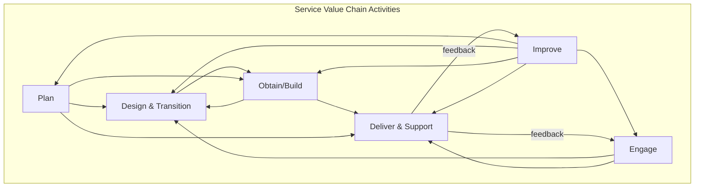

# ITIL 4 — IT Service Management Framework

**Framework:** ITIL 4 (2019; AXELOS / PeopleCert)  
**Predecessor:** ITIL v3 (2007/2011); ITIL v2 (2000); ITIL v1 (1989)  
**Full Name:** Information Technology Infrastructure Library  
**Companion Standard:** ISO/IEC 20000-1:2018 (IT Service Management — certifiable)  
**Audience:** IT service managers, DevOps engineers, SRE teams, ITSM practitioners, CIOs  
**Prerequisites:** Basic IT operations understanding; service management concepts

---

## Chapter 1 — Historical Context & Origin Story

### 1.1 Timeline

| Year | Milestone |
|------|-----------|
| 1986 | UK Government (CCTA) begins ITIL development |
| 1989 | **ITIL v1** published — 30+ books; best practices for IT management |
| 2000 | **ITIL v2** — condensed to 7 books; process-focused; Service Support + Service Delivery |
| 2001 | BS 15000 (first ITSM standard; predecessor to ISO 20000) |
| 2005 | ISO/IEC 20000 published (certifiable ITSM standard) |
| 2007 | **ITIL v3** — lifecycle approach (Strategy → Design → Transition → Operation → CSI) |
| 2011 | ITIL 2011 (refreshed v3; clarifications; widely adopted version) |
| 2013 | AXELOS (joint venture) takes ownership of ITIL |
| 2019 | **ITIL 4** — complete overhaul; Service Value System; value co-creation; Agile/DevOps integration |
| 2020 | ITIL 4 higher-level certifications published (CDS, DSV, HVIT, DPI) |
| 2022 | PeopleCert acquires AXELOS; ITIL continues under PeopleCert |

### 1.2 Evolution Philosophy

| Version | Philosophy | Focus |
|:-------:|------------|:-----:|
| **v1** | "Document everything" | Collection of best practices (unstructured) |
| **v2** | "Process-based IT" | Service Support (incident, problem, change) + Service Delivery (SLA, capacity, availability) |
| **v3** | "Lifecycle management" | 5 stages: Strategy → Design → Transition → Operation → Continual Improvement |
| **ITIL 4** | "Value co-creation" | Service Value System; holistic; integrates Agile, DevOps, Lean; customer-centric |

---

## Chapter 2 — ITIL 4 Architecture

### 2.1 Service Value System (SVS)

```mermaid
graph TB
    subgraph "ITIL 4 Service Value System (SVS)"
        OPP[Opportunity/Demand<br/>━━━━━━━━━<br/>• Business needs<br/>• Customer requests<br/>• Market opportunities]
        
        subgraph "SVS Components"
            GP[Guiding Principles (7)<br/>━━━━━━━━━<br/>1. Focus on value<br/>2. Start where you are<br/>3. Progress iteratively<br/>4. Collaborate & promote visibility<br/>5. Think & work holistically<br/>6. Keep it simple & practical<br/>7. Optimize & automate]
            
            GOV_I[Governance<br/>━━━━━━━━━<br/>• Direct<br/>• Monitor<br/>• Evaluate]
            
            SVC[Service Value Chain (6 activities)<br/>━━━━━━━━━<br/>• Plan • Improve<br/>• Engage • Design & Transition<br/>• Obtain/Build • Deliver & Support]
            
            PRACTICES[Practices (34)<br/>━━━━━━━━━<br/>• General Management (14)<br/>• Service Management (17)<br/>• Technical Management (3)]
            
            CI_I[Continual Improvement<br/>━━━━━━━━━<br/>• PDCA cycle<br/>• Improvement register<br/>• Metrics-driven]
        end
        
        VALUE[Value<br/>━━━━━━━━━<br/>• Outcomes enabled<br/>• Costs optimized<br/>• Risks managed]
    end
    
    OPP --> SVC --> VALUE
    GP -.-> SVC
    GOV_I -.-> SVC
    PRACTICES -.-> SVC
    CI_I -.-> SVC
```

### 2.2 Service Value Chain (6 Activities)

| Activity | Purpose | Key Actions |
|:--------:|---------|-------------|
| **Plan** | Shared understanding of vision, status, improvement direction | Portfolio management; strategy alignment; architecture planning |
| **Improve** | Continual improvement of products, services, practices | Identify improvements; prioritize; implement; measure results |
| **Engage** | Good understanding of stakeholder needs; continual engagement | Relationship management; service desk; demand management |
| **Design & Transition** | Products/services meet stakeholder expectations for quality, costs, time-to-market | Service design; architecture; change enablement; release management |
| **Obtain/Build** | Service components available when needed | Software development; infrastructure provisioning; supplier management |
| **Deliver & Support** | Services delivered and supported per agreed specifications | Incident management; service request fulfillment; monitoring |

### 2.3 Value Chain Interaction



---

## Chapter 3 — 34 ITIL 4 Practices

### 3.1 General Management Practices (14)

| # | Practice | Purpose |
|:-:|:--------:|---------|
| 1 | **Architecture management** | Understand all elements of the organization and their interrelationships |
| 2 | **Continual improvement** | Align practices and services with changing business needs |
| 3 | **Information security management** | Protect information (confidentiality, integrity, availability) |
| 4 | **Knowledge management** | Maintain and improve effective use of organizational knowledge |
| 5 | **Measurement and reporting** | Support decision-making with data-driven insights |
| 6 | **Organizational change management** | Manage human aspects of change |
| 7 | **Portfolio management** | Ensure organization has right mix of programmes, projects, services |
| 8 | **Project management** | Ensure projects are delivered successfully |
| 9 | **Relationship management** | Establish and nurture stakeholder relationships |
| 10 | **Risk management** | Understand and handle risks effectively |
| 11 | **Service financial management** | Support strategies and plans for service management with financial information |
| 12 | **Strategy management** | Formulate organizational goals and adopt courses of action |
| 13 | **Supplier management** | Ensure suppliers and their performance are managed appropriately |
| 14 | **Workforce and talent management** | Ensure organization has right people with right skills |

### 3.2 Service Management Practices (17)

| # | Practice | Purpose |
|:-:|:--------:|---------|
| 1 | **Availability management** | Ensure services deliver agreed levels of availability |
| 2 | **Business analysis** | Analyze business and recommend solutions |
| 3 | **Capacity and performance management** | Ensure services achieve agreed performance |
| 4 | **Change enablement** | Maximize successful changes; manage risk of changes |
| 5 | **Incident management** | Minimize negative impact of incidents; restore service ASAP |
| 6 | **IT asset management** | Plan and manage full lifecycle of IT assets |
| 7 | **Monitoring and event management** | Systematically observe services; record and report events |
| 8 | **Problem management** | Reduce likelihood and impact of incidents by identifying causes |
| 9 | **Release management** | Make new/changed services available for use |
| 10 | **Service catalogue management** | Provide a single source of consistent service information |
| 11 | **Service configuration management** | Ensure accurate information about services and CIs is available |
| 12 | **Service continuity management** | Ensure sufficient service availability in disaster/crisis |
| 13 | **Service design** | Design products and services fit for purpose and use |
| 14 | **Service desk** | Capture demand for incident resolution and service requests |
| 15 | **Service level management** | Set clear business-based targets for service performance |
| 16 | **Service request management** | Support agreed quality by handling pre-defined service requests |
| 17 | **Service validation and testing** | Ensure products and services meet defined requirements |

### 3.3 Technical Management Practices (3)

| # | Practice | Purpose |
|:-:|:--------:|---------|
| 1 | **Deployment management** | Move new/changed components to live environments |
| 2 | **Infrastructure and platform management** | Oversee infrastructure and platforms |
| 3 | **Software development and management** | Ensure applications meet stakeholder needs |

---

## Chapter 4 — Key Practices Deep Dive

### 4.1 Incident Management

| Aspect | Detail |
|:------:|--------|
| **Purpose** | Minimize negative impact of incidents by restoring normal service ASAP |
| **Key concepts** | Incident (unplanned interruption or quality reduction); Major incident (high business impact; requires coordinated response); Incident model (pre-defined steps for common incident types) |
| **Process flow** | Detection → Logging → Classification → Prioritization → Investigation/Diagnosis → Resolution → Closure |
| **Priority matrix** | Priority = f(Impact × Urgency); determines response/resolution targets |
| **Metrics** | MTTR (Mean Time to Restore); Incident count by category; SLA breach rate; First-call resolution rate; Reopened incident rate |

### 4.2 Change Enablement

| Aspect | Detail |
|:------:|--------|
| **Purpose** | Maximize successful service/IT changes while managing risk |
| **Change types** | **Standard** (pre-authorized; low risk; pre-defined procedure); **Normal** (requires assessment; follows change process); **Emergency** (must be implemented ASAP; expedited; post-implementation review) |
| **Key concepts** | Change authority (who approves; varies by risk); Change schedule (planned changes calendar); CAB (Change Advisory Board — for high-risk changes); Automated change enablement (for DevOps: pipeline gates replace manual approval) |
| **DevOps alignment** | Standard changes → fully automated (CI/CD pipeline deploys automatically). Normal changes → automated with gates (approval via PR review; automated tests). Emergency changes → expedited pipeline with post-deployment review. |

### 4.3 Problem Management

| Aspect | Detail |
|:------:|--------|
| **Purpose** | Reduce likelihood and impact of incidents by identifying root causes |
| **Activities** | Problem identification → Problem control (root cause analysis) → Error control (known errors; workarounds; permanent fixes) |
| **Relationship to Incidents** | Incident = symptom; Problem = root cause. Multiple incidents may have one underlying problem. Problem management is PROACTIVE (find problems before incidents) and REACTIVE (find causes of recurring incidents). |
| **Techniques** | 5 Whys; Fishbone diagram (Ishikawa); Kepner-Tregoe; Fault tree analysis; Pareto analysis |

### 4.4 Service Level Management

| Aspect | Detail |
|:------:|--------|
| **Purpose** | Set clear business-based targets for service performance; ensure delivery |
| **Key artifacts** | **SLA** (Service Level Agreement — between provider and customer); **OLA** (Operational Level Agreement — internal teams); **UC** (Underpinning Contract — with external suppliers) |
| **Modern approach (ITIL 4)** | Focus on OUTCOMES not just uptime metrics; customer experience; SLIs/SLOs/SLAs (inspired by SRE) |
| **Metrics** | Availability %; response time; resolution time; customer satisfaction score (CSAT); Net Promoter Score (NPS) |

---

## Chapter 5 — ITIL 4 Guiding Principles

### 5.1 Seven Guiding Principles

| # | Principle | Meaning | Application |
|:-:|:---------:|---------|-------------|
| 1 | **Focus on value** | Everything should link back to value for stakeholders | Ask "who benefits?" for every activity; eliminate non-value activities |
| 2 | **Start where you are** | Don't build from scratch; leverage existing capabilities | Assess current state before starting improvement; reuse what works |
| 3 | **Progress iteratively with feedback** | Don't try to do everything at once; small steps with feedback loops | Agile/iterative delivery; MVPs; frequent retrospectives |
| 4 | **Collaborate and promote visibility** | Work together across boundaries; transparent communication | Cross-functional teams; shared dashboards; no silos |
| 5 | **Think and work holistically** | No service/practice/process works in isolation | Consider end-to-end; system thinking; understand dependencies |
| 6 | **Keep it simple and practical** | Eliminate waste; only do what adds value | Minimum viable process; lean thinking; eliminate bureaucracy |
| 7 | **Optimize and automate** | Optimize first (eliminate waste); THEN automate (don't automate waste) | Automate repetitive tasks; but first ensure the task is necessary |

---

## Chapter 6 — ITIL 4 & ISO/IEC 20000

### 6.1 Relationship

| Aspect | ITIL 4 | ISO/IEC 20000-1:2018 |
|:------:|:------:|:---:|
| **What it is** | Best practice guidance (framework) | International standard (requirements) |
| **Mandatory?** | No (voluntary adoption) | Can be mandatory (regulatory; contractual) |
| **Certification** | Individual certification (Foundation, CDS, DSV, HVIT, DPI, ITIL Master) | Organization certification (by accredited body) |
| **Prescriptive?** | Guidance ("you could...") | Requirements ("you shall...") |
| **Audit** | No formal audit | Formal certification audit (ISO 17021 body) |
| **Alignment** | ITIL 4 aligns with 20000; covers same topics | ISO 20000 requirements can be met using ITIL practices |
| **Scope** | Broader (includes strategy, governance, value) | Focused on SMS (Service Management System) |

### 6.2 ISO 20000-1 Clause Structure

| Clause | Title | ITIL 4 Equivalent |
|:------:|:-----:|:---:|
| 4 | Context of the organization | Strategy management; Architecture management |
| 5 | Leadership | Governance |
| 6 | Planning | Plan (value chain); Risk management |
| 7 | Support of the SMS | Knowledge management; Workforce management |
| 8 | Operation of the SMS | All service management practices |
| 9 | Performance evaluation | Measurement and reporting; Service level management |
| 10 | Improvement | Continual improvement |

---

## Chapter 7 — Comparison: ITIL 4 vs Alternatives

| Criterion | ITIL 4 | COBIT 2019 | VeriSM | SIAM | SRE (Google) |
|:---------:|:------:|:----------:|:------:|:----:|:----:|
| **Focus** | IT service management | IT governance | Service management (enterprise-wide) | Multi-supplier integration | Service reliability engineering |
| **Owner** | PeopleCert (was AXELOS) | ISACA | IFDC | Scopism | Google (open framework) |
| **Scope** | End-to-end service value | Governance + management objectives | All service management (not just IT) | Managing multiple service providers | Production systems reliability |
| **Level** | Operational + tactical + strategic | Strategic + governance | Strategic | Operational integration | Operational |
| **Certification** | Individual (6 levels) | Individual (COBIT Design/Implementation) | Individual (VeriSM Foundation/Plus) | Individual (SIAM Foundation/Professional) | No formal cert (Google SRE books) |
| **Agile/DevOps** | Integrated (HVIT module) | Not primary focus | Integrated | Not primary focus | Core (born from DevOps thinking) |
| **Key concept** | Service Value System | COBIT framework (40 governance/management objectives) | Management Mesh | SIAM ecosystem; service integrator role | SLIs/SLOs/Error budgets |

---

## Chapter 8 — Architecture Diagrams

### 8.1 ITIL 4 Certification Path

```mermaid
graph TB
    subgraph "ITIL 4 Certification Path"
        FOUND[ITIL 4 Foundation<br/>━━━━━━━━━<br/>• Key concepts<br/>• SVS; SVC; 7 principles<br/>• 34 practices overview]
        
        subgraph "Managing Professional (MP) Stream"
            CDS[Create, Deliver & Support (CDS)<br/>• Service design<br/>• Build/test/deploy<br/>• Value streams]
            DSV[Drive Stakeholder Value (DSV)<br/>• Customer journeys<br/>• Relationship management<br/>• SLA design]
            HVIT[High Velocity IT (HVIT)<br/>• Digital operating model<br/>• Agile/DevOps/Cloud<br/>• Product management]
            DPI[Direct, Plan & Improve (DPI)<br/>• Governance<br/>• Planning<br/>• Improvement methods]
        end
        
        subgraph "Strategic Leader (SL) Stream"
            DPI2[DPI (shared with MP)]
            DITS[Digital & IT Strategy (DITS)<br/>• IT strategy<br/>• Digital transformation<br/>• Business alignment]
        end
        
        MP[Managing Professional (MP)<br/>━━━━━━━━━<br/>Requires: CDS + DSV + HVIT + DPI]
        SL[Strategic Leader (SL)<br/>━━━━━━━━━<br/>Requires: DPI + DITS]
        
        MASTER[ITIL Master<br/>━━━━━━━━━<br/>Requires: MP or SL<br/>+ 5 years experience<br/>+ portfolio + interview]
    end
    
    FOUND --> CDS
    FOUND --> DSV
    FOUND --> HVIT
    FOUND --> DPI
    FOUND --> DITS
    CDS --> MP
    DSV --> MP
    HVIT --> MP
    DPI --> MP
    DPI --> SL
    DITS --> SL
    MP --> MASTER
    SL --> MASTER
```

### 8.2 Incident Management Flow

```mermaid
graph TB
    subgraph "Incident Management Process (ITIL 4)"
        DETECT[Detection<br/>• User reports (service desk)<br/>• Monitoring alert<br/>• Event management trigger]
        
        LOG[Logging<br/>• Record in ITSM tool<br/>• Capture: what, when, who, impact<br/>• Auto-classification if possible]
        
        CLASS[Classification & Prioritization<br/>• Category (network, app, hardware...)<br/>• Impact × Urgency = Priority<br/>• SLA clock starts]
        
        DIAG[Investigation & Diagnosis<br/>• Check known errors<br/>• Escalate if needed (L1→L2→L3)<br/>• Root cause investigation]
        
        RESOLVE[Resolution & Recovery<br/>• Apply fix<br/>• Verify resolution<br/>• Confirm with user]
        
        CLOSE[Closure<br/>• Update record<br/>• User confirmation<br/>• Satisfaction survey<br/>• Lessons learned (if major)]
    end
    
    DETECT --> LOG --> CLASS --> DIAG --> RESOLVE --> CLOSE
```

---

## Chapter 9 — Case Studies

### 9.1 Enterprise IT: ITIL 4 + DevOps Integration

| Aspect | Detail |
|--------|--------|
| **Organization** | Insurance company; 1,200 IT staff; 300 applications; traditional ITIL v3 implementation (heavy process) |
| **Problem** | ITIL v3 implemented bureaucratically: change requests taking 3 weeks average; incident resolution slow; developers frustrated; shadow IT growing |
| **ITIL 4 transformation** | Adopted ITIL 4 principles to redesign practices: (1) "Focus on value" → eliminated 40% of change documentation (no business value). (2) "Progress iteratively" → implemented feature flags; smaller changes; more frequent releases. (3) "Optimize & automate" → automated standard changes via CI/CD; no CAB approval needed. (4) "Keep it simple" → simplified incident categorization from 200 categories to 30. |
| **Key changes** | Change enablement: Standard changes automated (90% of changes). Normal: lightweight approval (peer review + automated tests). CAB only for high-risk infrastructure changes (< 5% of changes). Incident management: AI chatbot handles 30% of tickets. Auto-categorization + routing. SRE approach: error budgets replace rigid SLA penalties. |
| **Result** | Change lead time: 3 weeks → 2 hours (standard); 3 days (normal). Deployment frequency: monthly → daily. Incident MTTR: 4 hours → 45 minutes. Developer satisfaction: 3.1/5 → 4.3/5. Shadow IT reduced by 60% (IT became responsive enough that teams didn't need to bypass it). |

### 9.2 Cloud-Native Organization: ITIL 4 Adaptation

| Aspect | Detail |
|--------|--------|
| **Organization** | SaaS fintech; 100% cloud-native; 50 microservices; 20 engineering teams; no ITSM history |
| **Need** | Customer contracts require ITSM maturity demonstration; ISO 20000 certification needed |
| **Approach** | Adopted ITIL 4 practices that ADD VALUE to existing DevOps culture (not imposed bureaucracy): |
| **Practices adopted** | Service level management: defined SLIs/SLOs (99.9% availability; P99 < 500ms); error budgets. Incident management: PagerDuty integration; incident commander rotation; postmortem culture. Problem management: blameless postmortems → identified systemic issues → prevention actions. Change enablement: CI/CD = automated change; deployment frequency = DORA metric. Service configuration management: infrastructure-as-code (Terraform state = CMDB). Continual improvement: quarterly reliability reviews; DORA metrics tracking. |
| **What they did NOT adopt** | Heavy change approval processes (unnecessary; CI/CD + automated testing provides assurance). Manual service catalogue (automated via API documentation + service mesh discovery). Complex priority matrices (everything is either P1-customer-impact or P2-everything-else). |
| **Result** | ISO 20000 certified within 9 months (lightweight ITIL 4 implementation satisfied all ISO 20000 clauses). Customer confidence increased. No slowdown in delivery velocity. |

---

## Chapter 10 — Future Evolution

| Trend | Timeline | Impact on ITIL |
|-------|----------|----------------|
| **AI in ITSM** | 2024+ (now) | AI chatbots; auto-resolution; predictive incident management; AIOps |
| **Platform engineering** | 2024+ | Internal developer platforms replace traditional service catalogue for engineering teams |
| **ITIL 4 Practice Guides** | Ongoing | Detailed practice guides being published continuously (replacing ITIL 4 books) |
| **SRE convergence** | Now | ITIL 4 + SRE practices merging; SLO-based service level management becoming standard |
| **FinOps integration** | 2024+ | Cloud financial management as extension of service financial management |
| **Sustainability** | 2025+ | Green IT practices; carbon-aware operations; sustainable service design |
| **Autonomous operations** | 2025-2030 | Self-healing infrastructure; autonomous incident resolution; reduced human intervention |
| **Value Stream Management** | Now | ITIL 4 + VSM tools (Planview, Plutora) for end-to-end value visibility |

---

## Chapter 11 — Interview Questions & Career Guide

### Tier 1: Entry-Level

**Q1:** What are the 7 ITIL 4 Guiding Principles? Give an example of applying one.

**A:** (See Chapter 5 for full list)

**Example — "Optimize and automate":**
- Scenario: Change approval process takes 5 days; 80% of changes are standard (low-risk; repetitive)
- Optimization: Classify changes; identify standard changes; remove unnecessary approval steps
- Automation: Implement CI/CD pipeline where standard changes are deployed automatically after passing automated tests
- Result: Standard changes deploy in minutes (not days); team freed for high-value work

**Key insight:** "Optimize FIRST, then automate. If you automate a bad process, you just do the wrong thing faster."

### Tier 2: Mid-Level

**Q2:** How does ITIL 4 Change Enablement differ from ITIL v3 Change Management? How does it integrate with DevOps CI/CD?

**A:**

| Aspect | ITIL v3 Change Management | ITIL 4 Change Enablement |
|:------:|:-:|:-:|
| **Name** | Change Management | Change Enablement (word "enablement" = facilitate, not block) |
| **Philosophy** | Control changes; prevent unauthorized changes | ENABLE changes while managing risk appropriately |
| **CAB** | CAB reviews most changes; weekly meeting | CAB only for high-risk; most changes approved via automation or peer review |
| **Standard changes** | Pre-authorized but still logged | Fully automated; CI/CD pipeline IS the change process |
| **Speed** | Days to weeks | Minutes to hours (standard); hours to days (normal) |
| **DevOps alignment** | Retrofitted (not designed for CI/CD) | Native (designed to coexist with CI/CD) |

**Integration with CI/CD:**
1. **Standard change:** PR merged → automated tests pass → deployed automatically = change record auto-created
2. **Normal change:** PR requires human review + approval → deployed → change record auto-created
3. **Emergency change:** Hotfix branch → expedited review → deployed → post-implementation review within 24h

### Tier 3: Senior

**Q3:** Design an ITSM operating model for a hybrid organization (legacy ITIL + cloud-native DevOps teams). How do you balance governance with agility?

**A:**

**Two-speed model with unified governance:**

| Aspect | Legacy (Mode 1) | Cloud-Native (Mode 2) | Unified |
|:------:|:-:|:-:|:-:|
| **Change** | CAB for infrastructure changes; weekly cycle | CI/CD auto-deploy; peer review approval | Risk-based: HIGH risk = CAB; LOW risk = automated |
| **Incident** | Service desk → L1/L2/L3 escalation | PagerDuty → on-call engineer → postmortem | Shared incident priority model; different resolution paths |
| **Service levels** | Traditional SLAs (availability %, response time) | SLOs + error budgets | Unified service level framework; different measurement approaches |
| **CMDB/Config** | Traditional CMDB (ServiceNow) | IaC (Terraform state) + Service mesh discovery | Federated: ServiceNow for legacy; auto-discovery for cloud; unified reporting |
| **Monitoring** | Infrastructure monitoring (Nagios/Zabbix) | Observability stack (Prometheus/Grafana/Jaeger) | Unified alerting (PagerDuty); domain-specific monitoring |
| **Improvement** | PDCA cycle; quarterly reviews | Sprint retrospectives; weekly metrics review | Unified OKRs; domain-specific improvement cadences |

**Governance principles:**
1. ONE incident priority model (P1-P4) regardless of technology
2. ONE change risk model (but different approval paths per risk level)
3. ONE service catalogue (but different consumption models)
4. ONE continual improvement register (unified visibility; different execution speeds)

---

## Chapter 12 — Cheat Sheet & Quick Reference

```
═══════════════════════════════════════════
ITIL 4 — QUICK REFERENCE
═══════════════════════════════════════════

SERVICE VALUE SYSTEM (SVS):
  Input: Opportunity/Demand
  Output: Value
  Components: Guiding Principles + Governance +
    Service Value Chain + Practices + Continual Improvement

═══════════════════════════════════════════
SERVICE VALUE CHAIN (6 ACTIVITIES):
  Plan | Improve | Engage |
  Design & Transition | Obtain/Build | Deliver & Support

═══════════════════════════════════════════
7 GUIDING PRINCIPLES:
  1. Focus on value
  2. Start where you are
  3. Progress iteratively with feedback
  4. Collaborate and promote visibility
  5. Think and work holistically
  6. Keep it simple and practical
  7. Optimize and automate

═══════════════════════════════════════════
34 PRACTICES:
  General Management (14): Architecture, Continual improvement,
    InfoSec, Knowledge, Measurement, OCM, Portfolio,
    Project, Relationship, Risk, Financial, Strategy,
    Supplier, Workforce
  
  Service Management (17): Availability, Business analysis,
    Capacity, Change enablement, Incident, IT asset,
    Monitoring & event, Problem, Release, Service catalogue,
    Service config, Service continuity, Service design,
    Service desk, Service level, Service request,
    Service validation & testing
  
  Technical Management (3): Deployment, Infrastructure &
    platform, Software development

═══════════════════════════════════════════
CHANGE TYPES:
  Standard: Pre-authorized; low risk; automated (CI/CD)
  Normal: Requires assessment/approval; scheduled
  Emergency: Urgent; expedited; post-review

═══════════════════════════════════════════
INCIDENT PRIORITY:
  Priority = Impact × Urgency
  P1: Critical (business down)
  P2: High (significant impact; workaround exists)
  P3: Medium (limited impact)
  P4: Low (minimal impact)

═══════════════════════════════════════════
KEY RELATIONSHIPS:
  Incident = Symptom (restore service ASAP)
  Problem = Root Cause (prevent future incidents)
  Change = Controlled modification (managed risk)
  Known Error = Problem with identified root cause + workaround

═══════════════════════════════════════════
ITIL 4 vs ISO 20000:
  ITIL 4 = Best practice GUIDANCE (individual cert)
  ISO 20000 = REQUIREMENTS standard (org cert)
  Use ITIL 4 practices TO MEET ISO 20000 requirements

═══════════════════════════════════════════
CERTIFICATION PATH:
  Foundation → CDS/DSV/HVIT/DPI → MP or SL → Master

═══════════════════════════════════════════
ITIL v3 → ITIL 4 KEY CHANGES:
  • 5 lifecycle stages → Service Value System
  • 26 processes → 34 practices
  • Process-focused → Value-focused
  • Sequential lifecycle → Flexible value chain
  • Change Management → Change Enablement
  • Agile/DevOps: bolted-on → integrated
```

---

*End of Document — 05_ITIL_4_Service_Management.md*
