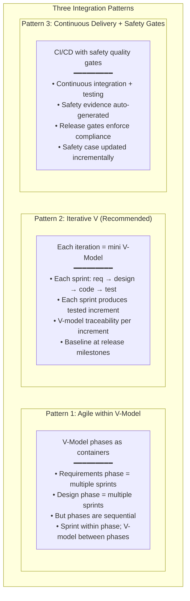

# Agile in Safety-Critical Development

**Topic:** Integrating Agile/Scrum with Safety Standards (ISO 26262, DO-178C, IEC 62304, ASPICE)  
**Frameworks:** SAFe 6.0, LeSS, DAD, agile_SPICE, Scrum + ASPICE  
**Domain:** Automotive, Aerospace, Medical Device, Railway — safety-critical embedded systems  
**Audience:** Scrum Masters in regulated environments, safety managers, ASPICE assessors, Agile coaches in automotive  
**Prerequisites:** Agile/Scrum fundamentals; basic understanding of ISO 26262 or DO-178C; ASPICE awareness

---

## Chapter 1 — Historical Context & Origin Story

### 1.1 Timeline

| Year | Milestone |
|------|-----------|
| 2001 | Agile Manifesto published — SW industry embraces iterative development |
| 2005 | Scrum widely adopted in IT/web; safety-critical domains remain waterfall (V-model) |
| 2010 | First attempts to combine Agile + automotive (BMW, Continental pilot projects) |
| 2011 | ISO 26262:2011 published — assumes V-model but doesn't explicitly forbid Agile |
| 2012 | SAFe 1.0 released (Scaled Agile Framework) |
| 2014 | Industry discussions: "Can you be Agile AND ASPICE-compliant?" |
| 2015 | agile_SPICE white paper (Kugler Maag); first formal guidance on Agile + ASPICE |
| 2017 | ASPICE 3.1 — still V-model-oriented but community developing Agile interpretations |
| 2018 | ISO 26262:2018 (2nd edition) — explicitly acknowledges iterative/incremental development |
| 2020 | SAFe 5.0 with DevOps; automotive industry adopts at scale (VW, BMW, Bosch) |
| 2022 | SAFe 6.0 — AI/ML; flow metrics; automotive-specific guidance |
| 2024 | **ASPICE 4.0** — explicitly supports Agile/iterative; outcome-focused (not document-focused) |

### 1.2 The Tension

| Agile Values | Safety Standards Expectations |
|:---:|:---:|
| "Working software over comprehensive documentation" | Extensive documentation required (SRS, SAD, test plans, traceability) |
| "Responding to change over following a plan" | Change impact analysis required; formal change control |
| "Individuals and interactions over processes and tools" | Process must be defined, followed, assessed (ASPICE CL 2+) |
| "Customer collaboration over contract negotiation" | Formal requirements baseline; contractual deliverables |

**Key insight:** The tension is NOT irreconcilable. Safety standards define WHAT must be achieved (outcomes, evidence, traceability). Agile defines HOW work is organized (iterations, collaboration, feedback). They are COMPLEMENTARY when implemented correctly.

---

## Chapter 2 — Architecture: Agile + Safety Integration Models

### 2.1 Integration Patterns



### 2.2 Recommended Architecture (Iterative V)

```mermaid
graph TB
    subgraph "Iterative V-Model for Safety-Critical Agile"
        subgraph "Sprint N (2-4 weeks)"
            REQ_S[Requirements<br/>(stories with safety req)]
            ARCH_S[Architecture/Design<br/>(update SAD)]
            CODE_S[Implementation<br/>(code + unit test)]
            INT_S[Integration Test<br/>(per architecture)]
            QUAL_S[Sprint Qualification<br/>(subset of SWE.6)]
        end
        
        subgraph "Release (every N sprints)"
            FREEZE[Requirements Freeze<br/>(baseline SRS)]
            FULL_ARCH[Architecture Baseline<br/>(baseline SAD)]
            FULL_INT[Full Integration Test<br/>(complete SWE.5)]
            FULL_QUAL[Full Qualification<br/>(complete SWE.6)]
            SAFETY_CASE[Safety Case Update<br/>(ISO 26262 evidence)]
            RELEASE_D[Release Decision<br/>(release gate)]
        end
    end
    
    REQ_S --> ARCH_S --> CODE_S --> INT_S --> QUAL_S
    QUAL_S -->|"accumulate"| FREEZE
    FREEZE --> FULL_ARCH --> FULL_INT --> FULL_QUAL --> SAFETY_CASE --> RELEASE_D
```

---

## Chapter 3 — Mapping: Agile Artifacts ↔ Safety Standard Requirements

### 3.1 ASPICE Process Mapping

| ASPICE Process | V-Model Artifact | Agile Equivalent | Compliance Strategy |
|:-:|:-:|:-:|---|
| **SWE.1** (SW Requirements) | SW Requirements Specification | Product Backlog (Epics + Stories with acceptance criteria) | Export as SRS at release; maintain traceability in tool (Jira→DOORS) |
| **SWE.2** (SW Architecture) | SW Architecture Document | ADRs + Architecture wiki + component diagrams | Living document; baselined at release; review per sprint when architecture changes |
| **SWE.3** (Detailed Design) | Detailed Design Document | Code (self-documenting) + design comments + developer wiki | Definition of Done includes: design reviewed; coding standards applied |
| **SWE.4** (Unit Verification) | Unit Test Results + Coverage Report | CI pipeline: automated unit tests on every commit | Automated: every commit triggers tests; coverage threshold in pipeline gate |
| **SWE.5** (Integration Test) | Integration Test Specification + Results | CI pipeline: integration test suite; interface tests | Automated; runs on merge; traceable to architecture (interface specs) |
| **SWE.6** (Qualification Test) | Qualification Test Specification + Results | System test suite (automated + manual); regression suite | Traceable to SW requirements; runs per release candidate |
| **SUP.8** (Configuration Mgmt) | CM Plan; Baselines; Release records | Git (branching; tags; semantic versioning); CI/CD pipeline | Git tags = baselines; pipeline = controlled release process |
| **SUP.10** (Change Request Mgmt) | Change Requests; Impact Analysis | Jira CR tickets; linked to stories; impact field mandatory | Jira workflow: CR → impact analysis → approval → implementation → verification |
| **MAN.3** (Project Management) | Project Plan; Status Reports | Sprint planning + burndown + velocity; PI planning (SAFe) | Sprint review = progress report; PI planning = project planning |

### 3.2 ISO 26262 Part 6 Mapping

| ISO 26262 Requirement | Agile Implementation |
|:---:|---|
| **6.5**: SW safety requirements specification | Safety requirements tagged in backlog (ASIL label); safety acceptance criteria mandatory; traced to system safety requirements |
| **6.6**: SW architectural design | Architecture documents safety mechanisms; updated per sprint when architecture changes; formal review at release |
| **6.7**: SW unit design & implementation | Coding guidelines enforced in CI (MISRA checker); design reviewed via PR; no unit deployed without code review |
| **6.8**: SW unit testing | Automated in CI; coverage thresholds per ASIL (branch for ASIL B; MC/DC for ASIL D); runs every commit |
| **6.9**: SW integration & testing | Automated integration tests in CI; interface testing per architecture document; runs every merge |
| **6.10**: SW qualification testing | Requirement-based testing; full regression per release; traceability report auto-generated |
| **6.11**: Confidence in use of SW tools | Tool qualification per TCL; documented once; re-validated on tool version change |

---

## Chapter 4 — SAFe for Automotive/Safety-Critical

### 4.1 SAFe 6.0 Configuration for Automotive

```mermaid
graph TB
    subgraph "SAFe for Automotive Safety-Critical"
        subgraph "Portfolio Level"
            PORT[Portfolio<br/>━━━━━━━━━<br/>• Product line strategy<br/>• Lean budgets<br/>• Safety governance<br/>• Compliance portfolio view]
        end
        
        subgraph "Large Solution Level"
            LS[Solution Train<br/>━━━━━━━━━<br/>• Multiple ARTs (SW + HW + Mech)<br/>• System integration<br/>• Solution demos<br/>• Supplier coordination]
        end
        
        subgraph "Program Level (ART)"
            ART[Agile Release Train (ART)<br/>━━━━━━━━━<br/>• 5-12 Agile teams<br/>• PI Planning (10 weeks)<br/>• System Demo (every 2 weeks)<br/>• Inspect & Adapt]
        end
        
        subgraph "Team Level"
            TEAM[Agile Teams<br/>━━━━━━━━━<br/>• Scrum/Kanban<br/>• 2-week sprints<br/>• Sprint demo<br/>• Definition of Done (safety)]
        end
    end
    
    PORT --> LS --> ART --> TEAM
```

### 4.2 PI Planning for Safety-Critical

| Standard PI Planning Element | Safety-Critical Addition |
|:---:|---|
| **Business context** | + Safety context (ASIL targets; regulatory deadlines; certification milestones) |
| **Architecture vision** | + Safety architecture (safety mechanisms; redundancy; ASIL decomposition) |
| **Team breakout** | + Safety story identification (which stories have safety impact?); + safety review activities in sprint plan |
| **Program risks** | + Safety risks (ASIL capability gaps; tool qualification gaps; assessor availability) |
| **Program board** | + Safety milestones (safety assessment dates; DFA reviews; confirmation measures) |
| **ROAM risks** | + Safety-specific risk handling (resolved/owned/accepted/mitigated) |

### 4.3 Definition of Done (Safety-Critical Extension)

| Standard DoD Item | Safety-Critical DoD Extension |
|:---:|---|
| Code complete | + Coding guidelines enforced (MISRA; CERT); static analysis clean |
| Code reviewed | + Safety-relevant code requires INDEPENDENT reviewer (not same person/team) |
| Unit tests pass | + Coverage targets met per ASIL (branch/MC/DC); negative test cases included |
| Integration tests pass | + Interface tests per architecture; fault injection tests for safety mechanisms |
| Story accepted | + Safety requirements traced; safety test cases traced and passed |
| Documentation updated | + SAD updated if architecture changed; traceability matrix consistent |
| No open blockers | + No open safety anomalies (safety defects have zero tolerance for deployment) |

---

## Chapter 5 — agile_SPICE: Formal Guidance

### 5.1 agile_SPICE Principles (Kugler Maag / VDA)

| Principle | Description |
|:---------:|-------------|
| **Outcome over output** | ASPICE assesses OUTCOMES (did you achieve the purpose?), not specific document format |
| **Evidence, not documents** | Any artifact that demonstrates the practice was performed is valid evidence (Git log; Jira; CI report; PR review) |
| **Continuous compliance** | Compliance is maintained continuously (every sprint), not achieved at the end |
| **Automation as evidence** | Automated tools produce evidence (traceability reports; test results; coverage); manual evidence creation is waste |
| **Living documents** | Architecture and requirements documents are living (updated per sprint); baselined at release milestones |

### 5.2 ASPICE Assessment in Agile Context

| Traditional Expectation | Agile Interpretation (ASPICE 4.0) |
|:---:|---|
| Assessor sees "SRS document" | Assessor sees: product backlog with structured requirements + acceptance criteria + traceability links. Tool export satisfies SRS need. |
| Assessor sees "review minutes" | Assessor sees: PR review comments; sprint review recordings/notes; architecture review in Confluence with comments |
| Assessor sees "test plan" | Assessor sees: CI pipeline configuration (defines test levels, automation, coverage gates) + test strategy document |
| Assessor sees "change impact analysis" | Assessor sees: Jira CR ticket with "impact" field; linked affected stories; regression test selection justification |
| Assessor sees "project plan with milestones" | Assessor sees: PI planning board; sprint plans; release plan with milestones; velocity charts |
| Assessor sees "baselined documents" | Assessor sees: Git tags (release baselines); DOORS baseline IDs; CI build artifacts (immutable) |

---

## Chapter 6 — Scaling Patterns

### 6.1 LeSS (Large-Scale Scrum) for Safety-Critical

| LeSS Element | Safety Adaptation |
|:---:|---|
| **One Product Backlog** | Safety requirements clearly marked (ASIL tag); safety stories prioritized by risk |
| **Cross-functional teams** | Teams include safety expertise (safety engineer embedded or safety chapter) |
| **Sprint Review** | Include safety review activities; demonstrate safety evidence produced this sprint |
| **Overall Retrospective** | Include safety process improvement; discuss assessment feedback |
| **Architecture** | Architectural guidance includes safety architecture; safety decisions as ADRs |

### 6.2 DAD (Disciplined Agile Delivery) for Regulated

| DAD Lifecycle | Safety Application |
|:---:|---|
| **Inception** | Safety concept (ISO 26262 Part 3); HARA; safety goals; ASIL determination |
| **Construction** | Iterative development with safety activities per iteration |
| **Transition** | Safety validation; safety case compilation; release for production |
| **Ongoing (continuous delivery)** | Post-production safety monitoring; OTA update safety validation |

---

## Chapter 7 — Comparison: Agile Approaches for Safety-Critical

| Criterion | SAFe 6.0 | LeSS | Scrum + ASPICE | agile_SPICE | DAD |
|:---------:|:---------:|:----:|:-:|:-:|:---:|
| **Scale** | Large (50-150+ people) | Large (3-8 teams) | Small-medium (1-5 teams) | Guidance (any scale) | Any scale |
| **Prescriptive** | High (roles, events, artifacts) | Low (minimal rules) | Medium (Scrum + ASPICE requirements) | Low (principles only) | Medium (goal-driven) |
| **Safety integration** | Explicit (compliance stories; safety sprints) | Implicit (team self-organizing) | Explicit mapping (artifact ↔ ASPICE work product) | Principles for mapping | Lifecycle phases |
| **ASPICE compatibility** | Good (with tailoring) | Good (if traceability maintained) | Best (designed for ASPICE) | Reference guidance | Good |
| **Industry adoption** | High (BMW, VW, Bosch, Continental) | Medium (some OEMs) | High (supplier level) | Reference (industry-accepted) | Low in automotive |
| **Overhead** | High (many roles; ceremonies) | Low | Medium | Low | Medium |

---

## Chapter 8 — Architecture Diagrams

### 8.1 Sprint Lifecycle with Safety Gates

```mermaid
graph TB
    subgraph "Safety-Critical Sprint Lifecycle"
        PLAN_SP[Sprint Planning<br/>━━━━━━━━━<br/>• Select stories (including safety stories)<br/>• Identify safety activities needed<br/>• Plan safety reviews<br/>• Allocate safety engineer time]
        
        DEV_SP[Development<br/>━━━━━━━━━<br/>• Code (MISRA-compliant)<br/>• Design (update architecture if needed)<br/>• Unit tests (coverage targets)<br/>• Static analysis (every commit)]
        
        REVIEW_SP[Code Review<br/>━━━━━━━━━<br/>• PR review (technical)<br/>• Safety review (if ASIL-relevant)<br/>• Independence level per ASIL<br/>• MISRA findings resolved]
        
        CI_SP[CI Pipeline<br/>━━━━━━━━━<br/>• Build (no warnings)<br/>• Unit tests (100% pass)<br/>• Coverage check (ASIL target met)<br/>• MISRA/static analysis (0 violations)<br/>• Integration tests]
        
        DEMO_SP[Sprint Review/Demo<br/>━━━━━━━━━<br/>• Demonstrate functionality<br/>• Show safety evidence produced<br/>• Stakeholder feedback<br/>• Safety anomaly review]
        
        RETRO_SP[Sprint Retro<br/>━━━━━━━━━<br/>• Process improvement<br/>• Safety process feedback<br/>• Tool improvement ideas<br/>• Assessment preparation progress]
    end
    
    PLAN_SP --> DEV_SP --> REVIEW_SP --> CI_SP --> DEMO_SP --> RETRO_SP
```

### 8.2 Traceability in Agile (Automated)

```mermaid
graph LR
    subgraph "Automated Traceability Chain"
        JIRA[Jira<br/>━━━━━━━━━<br/>Epic → Story → Task<br/>Safety requirements tagged<br/>ASIL labels<br/>Acceptance criteria]
        
        GIT[Git/Bitbucket<br/>━━━━━━━━━<br/>Commits linked to Jira<br/>PRs linked to stories<br/>Architecture docs versioned]
        
        JENKINS[Jenkins/CI<br/>━━━━━━━━━<br/>Build triggered by commit<br/>Tests linked to requirements<br/>Coverage per requirement<br/>Results archived per build]
        
        DOORS[DOORS/Polarion<br/>━━━━━━━━━<br/>Formal traceability matrix<br/>Sync from Jira (automated)<br/>Baseline at release<br/>Gap analysis report]
    end
    
    JIRA -->|"commit message refs"| GIT
    GIT -->|"triggers"| JENKINS
    JIRA -->|"sync requirements"| DOORS
    JENKINS -->|"coverage data"| DOORS
```

---

## Chapter 9 — Case Studies

### 9.1 Automotive OEM: SAFe + ASPICE (Success)

| Aspect | Detail |
|--------|--------|
| **Organization** | Premium OEM; ADAS/AD platform development; 200 SW engineers; 15 Agile teams |
| **Challenge** | Develop L2+ ADAS features (ASIL B/C); OEM supplier chain requires ASPICE CL 2; Scrum teams frustrated by traditional V-model project management |
| **Solution** | SAFe Large Solution configuration: 2 ARTs (one for sensor fusion; one for planning/control). 10-week PI cadence. Safety System Team (cross-cutting). |
| **Key practices** | (1) PI Planning includes safety milestones (DFA review; safety assessment dates). (2) Definition of Done includes safety criteria (traceability; coverage; MISRA clean). (3) Every sprint produces tested increment with safety evidence. (4) "Compliance Stories" in backlog (e.g., "As ASPICE assessor, I need traceability report for SWE.1→SWE.6"). (5) Automated traceability: Jira ↔ Bitbucket ↔ Jenkins ↔ DOORS (daily sync). (6) Safety engineer embedded in each team (chapter model). |
| **Assessment result** | ASPICE CL 2 achieved for all HIS processes. Assessor accepted: PR reviews as review evidence; CI reports as test evidence; Jira backlog export as SRS equivalent; Git tags as CM baselines. |
| **Metrics improvement** | Time-to-market: 18 months → 10 months (first feature increment). Defect escape rate: 60% reduction (shift-left via CI). Developer satisfaction: 3.8 → 4.4 /5. |

### 9.2 Medical Device: Scrum + IEC 62304 (Lessons Learned)

| Aspect | Detail |
|--------|--------|
| **Product** | Patient monitoring device; SW Class C (highest safety); 30 developers; regulatory market: EU (MDR) + US (FDA) |
| **Initial mistake** | Tried to be "fully Agile" — no upfront architecture; minimal documentation; "we'll document later." Regulatory submission FAILED (FDA 510k rejection: insufficient design controls evidence). |
| **Corrected approach** | "Agile with safety guardrails": (1) Upfront: safety concept; SOUP analysis; architecture with safety mechanisms. (2) Per sprint: implement features; produce evidence (design output; V&V records; traceability). (3) Per release: formal design review; safety case update; regulatory submission package. (4) Definition of Done: IEC 62304 §5 (SW development) checklist items per story. |
| **Key lesson** | "Agile doesn't mean no documentation. It means the RIGHT documentation, produced CONTINUOUSLY (not at the end), AUTOMATED where possible." |
| **Result** | FDA 510k cleared on second submission. Development velocity maintained (no slowdown from adding safety practices — automation compensated). Time to market: 14 months (vs 18 months for competitor using pure waterfall). |

---

## Chapter 10 — Future Evolution

| Trend | Timeline | Impact |
|-------|----------|--------|
| **ASPICE 4.0 full adoption** | 2024-2026 | Agile officially supported; assessors trained on Agile evidence; resistance decreasing |
| **Continuous safety assurance** | 2025-2030 | Safety case maintained continuously (not compiled at end); automated safety argument construction |
| **AI-assisted safety analysis** | 2025-2028 | AI generates FMEA entries; predicts safety impact of changes; auto-traces to safety goals |
| **DevOps for automotive** | Now (expanding) | CI/CD for ECU software; OTA updates with safety validation; continuous deployment for non-safety + gated for safety |
| **Model-based + Agile** | 2024-2027 | Model-based design (Simulink) in Agile sprints; auto-code generation; model-in-the-loop testing |
| **Safety of AI/ML** | 2024-2028 | How to develop ML components in Agile while satisfying ISO 26262; new safety argumentation needed |
| **Regulation evolution** | 2025+ | UN R157 (automated lane keeping); EU AI Act; standards may explicitly prescribe Agile-compatible approaches |

---

## Chapter 11 — Interview Questions & Career Guide

### Tier 1: Entry-Level

**Q1:** What is the fundamental tension between Agile and safety standards? How is it resolved?

**A:**

**Tension:** Agile values (working software > documentation; responding to change > following a plan) appear to conflict with safety standards (extensive documentation; formal change control; traceability; defined processes).

**Resolution:** 
- Safety standards define WHAT must be achieved (outcomes: traceability exists; reviews happened; tests demonstrate compliance)
- Agile defines HOW work is organized (sprints; collaboration; iteration)
- They are COMPLEMENTARY, not contradictory
- Key insight: safety standards don't mandate WHEN things are done (sequentially) — they mandate THAT they are done (outcomes achieved)

**Practical resolution:**
- Documentation: produced CONTINUOUSLY in small increments (not at end); AUTOMATED from tools
- Traceability: automated (tool links), not manual Excel maintenance
- Change control: lightweight (Jira workflow) not bureaucratic (paper-based CCB)
- Reviews: PR reviews = code review evidence (not separate formal meeting)

### Tier 2: Mid-Level

**Q2:** You are a Scrum Master in an automotive ASPICE CL 2 environment. Design the Definition of Done for safety-critical software stories.

**A:**

**Definition of Done (Safety-Critical Sprint):**

| Category | DoD Item | Evidence |
|:--------:|----------|:--------:|
| **Functional** | Story acceptance criteria met | Sprint demo; acceptance test pass |
| **Code quality** | MISRA-C compliance (zero mandatory violations) | Static analysis report (CI) |
| **Code quality** | Coding guidelines followed | PR review approved |
| **Review** | Code reviewed by independent reviewer | PR approved (≠ author); comments resolved |
| **Review** | Safety-relevant changes reviewed by safety engineer | Safety engineer sign-off in PR |
| **Testing** | Unit tests pass (100%) | CI test results |
| **Testing** | Code coverage target met (branch ≥ 100% for ASIL B+) | Coverage report (CI) |
| **Testing** | Integration tests pass | CI pipeline results |
| **Traceability** | Story linked to SW requirement in DOORS/Polarion | Traceability report (automated) |
| **Traceability** | Test cases linked to requirements | Traceability matrix updated |
| **Architecture** | If architecture changed: SAD updated | SAD version in Git; review comment |
| **CM** | Code merged to develop branch; build successful | CI build green |
| **Safety** | No open safety anomalies from this story | Safety anomaly list empty |

### Tier 3: Senior

**Q3:** Design an organizational model for running 10 Agile teams developing ADAS software (ASIL B/D) while maintaining ASPICE CL 3 and ISO 26262 compliance.

**A:**

**Organizational model: SAFe Large Solution with Safety Layer**

| Element | Implementation |
|:-------:|----------------|
| **ART structure** | 2 ARTs: ART-Perception (camera, radar, lidar processing) + ART-Planning (path planning, decision, control). Each ART: 5 teams. PI cadence: 10 weeks (5 sprints × 2 weeks). |
| **Safety organization** | Safety Chapter (cross-cutting): 4 safety engineers (one per 2-3 teams); Safety Lead at ART level; safety reviews integrated in sprint cadence; ASIL decomposition decisions at architecture level |
| **ASPICE CL 3 requirement** | Organizational Standard Process defined (process library in Confluence); teams TAILOR from standard (tailoring documented per team in Confluence); measurement program active (defect density; coverage; velocity; cycle time) |
| **Process infrastructure** | SEPG (Software Engineering Process Group): 2 FTE maintaining process library + training + internal assessments. Tools: Jira (requirements + PM); Bitbucket (code); Jenkins (CI); DOORS (formal traceability for assessment); Confluence (architecture + processes) |
| **Compliance strategy** | Sprint-level: DoD enforces per-sprint compliance (every sprint produces compliant increment). Release-level: every 2 PIs (20 weeks) = formal release with full traceability report; baseline; assessment-ready evidence. Continuous: automated traceability sync; automated coverage reporting; automated MISRA scanning |
| **Assessment readiness** | Internal ASPICE assessment annually (mid-year); external assessment before customer milestones. Assessor invited to observe PI planning + sprint reviews (builds confidence in Agile approach). |
| **ISO 26262 compliance** | Safety case maintained as living document (updated per PI). DFA (Dependent Failure Analysis) reviews at architecture changes. Confirmation measures (functional safety audit) per release. Hardware-software interface (HSI) managed at Solution Train level. |
| **Quality metrics (CL 3)** | Process adherence (automated check); defect density trend; test coverage; requirements volatility; cycle time (DORA-like) |

---

## Chapter 12 — Cheat Sheet & Quick Reference

```
═══════════════════════════════════════════
AGILE + SAFETY-CRITICAL — QUICK REFERENCE
═══════════════════════════════════════════

CORE PRINCIPLE:
  Safety standards = WHAT (outcomes; evidence; traceability)
  Agile = HOW (iterations; collaboration; feedback)
  COMPLEMENTARY — not contradictory

═══════════════════════════════════════════
AGILE ↔ ASPICE MAPPING:
  Backlog + Stories = SW Requirements (SWE.1)
  ADRs + Wiki = SW Architecture (SWE.2)
  PR Review = Code Review evidence
  CI Unit Tests = Unit Verification (SWE.4)
  CI Integration Tests = Integration Test (SWE.5)
  System Test Suite = Qualification (SWE.6)
  Git tags/branches = CM baselines (SUP.8)
  Jira CR workflow = Change Requests (SUP.10)
  Sprint plan + PI board = Project Plan (MAN.3)

═══════════════════════════════════════════
DoD SAFETY EXTENSIONS:
  ✓ MISRA compliance (zero mandatory violations)
  ✓ Independent code review (≠ author)
  ✓ Coverage targets met per ASIL
  ✓ Traceability complete (req → design → code → test)
  ✓ Safety anomalies resolved
  ✓ Architecture document updated (if changed)
  ✓ Safety engineer sign-off (if safety-relevant)

═══════════════════════════════════════════
COVERAGE PER ASIL:
  ASIL A: Statement coverage
  ASIL B: Branch coverage (100%)
  ASIL C: Branch + MC/DC recommended
  ASIL D: MC/DC mandatory

═══════════════════════════════════════════
SAFe FOR AUTOMOTIVE:
  Portfolio → Solution Train → ART → Teams
  PI Planning: 10-week cadence; safety milestones included
  System Demo: every 2 weeks (show safety evidence)
  Compliance Stories: "As assessor I need [evidence]"
  Safety Chapter: cross-cutting safety engineers

═══════════════════════════════════════════
ASPICE 4.0 AGILE SUPPORT:
  • Outcome-focused (not document-format-focused)
  • Living documents acceptable (baselined at release)
  • Tool outputs as evidence (CI reports; Git logs)
  • PR reviews as review evidence
  • Sprint demo as stakeholder acceptance

═══════════════════════════════════════════
KEY SUCCESS FACTORS:
  1. Automated traceability (tool-based; not manual)
  2. CI pipeline = quality gate (coverage; MISRA; tests)
  3. Safety expertise IN teams (not external gate)
  4. Continuous compliance (every sprint; not end)
  5. Management commitment (invest in tooling + process)
```

---

*End of Document — 07_Agile_Safety_Critical.md*
