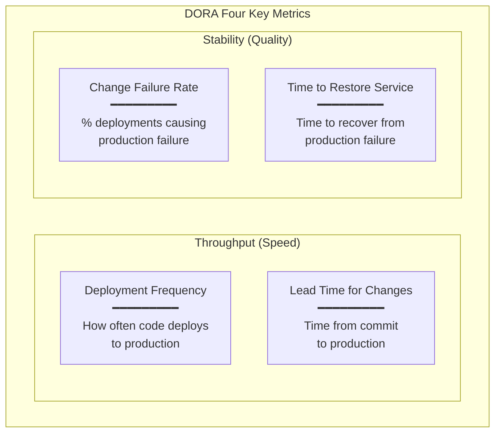
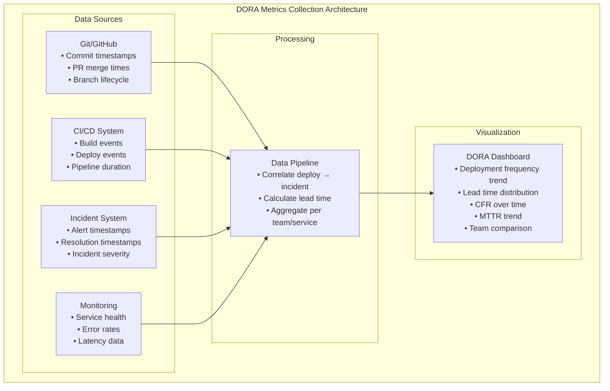
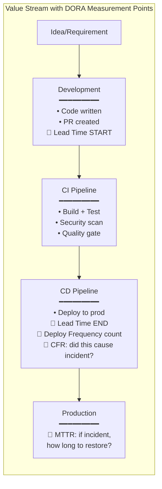

# DevSecOps & DORA Metrics

**Topic:** DevSecOps Pipeline Security + DORA Four Key Metrics  
**Standards/Frameworks:** DORA (DevOps Research & Assessment); NIST SP 800-204D; CDF (Continuous Delivery Foundation); OWASP DevSecOps; SLSA (Supply-chain Levels for Software Artifacts)  
**Domain:** Software delivery performance, CI/CD security, supply chain security  
**Audience:** DevOps engineers, platform engineers, SRE teams, security engineers, engineering managers  
**Prerequisites:** CI/CD fundamentals; Git workflow; containerization basics; software security awareness

---

## Chapter 1 — Historical Context & Origin Story

### 1.1 Timeline

| Year | Milestone |
|------|-----------|
| 2008 | Patrick Debois coins "DevOps" at Agile conference |
| 2009 | First DevOpsDays conference (Ghent, Belgium) |
| 2010 | "Continuous Delivery" book (Humble & Farley) |
| 2012 | DevSecOps concept emerges ("security as code") |
| 2013 | Docker released → containerization accelerates DevOps |
| 2014 | **First State of DevOps Report** (Puppet Labs + IT Revolution + DORA team) |
| 2015 | DORA formalized; four key metrics identified through research |
| 2017 | Kubernetes 1.0 GA; microservices + container orchestration mainstream |
| 2018 | "Accelerate" book published (Forsgren, Humble, Kim) — DORA research summary |
| 2019 | Google acquires DORA; State of DevOps Report becomes Google Cloud report |
| 2020 | SLSA framework proposed (Supply-chain Levels for Software Artifacts) |
| 2021 | Biden Executive Order on Cybersecurity → DevSecOps becomes mandate for US federal; SolarWinds aftermath |
| 2022 | NIST SP 800-218 (SSDF); SLSA v0.1; Sigstore for artifact signing |
| 2023 | SLSA v1.0; OpenSSF Scorecard; DORA adds "Reliability" as 5th metric |
| 2024 | DORA 2024 report: AI impact on DevOps; platform engineering metrics |

### 1.2 The DORA Research Foundation

| Research Element | Detail |
|:---:|---|
| **Methodology** | Multi-year cross-sectional survey research; 39,000+ responses (2014-2024); structural equation modeling; cluster analysis |
| **Key finding** | Software delivery performance (measured by 4 metrics) PREDICTS organizational performance (profitability, market share, productivity) |
| **Implication** | Fast delivery IS NOT opposed to stability — elite performers are BOTH faster AND more stable |
| **Published in** | Annual State of DevOps Reports + "Accelerate" book (2018) |

---

## Chapter 2 — DORA Four Key Metrics

### 2.1 The Four Metrics



### 2.2 Performance Levels (2024 Benchmarks)

| Metric | Elite | High | Medium | Low |
|:------:|:-----:|:----:|:------:|:---:|
| **Deployment Frequency** | On-demand (multiple times/day) | Between daily and weekly | Between weekly and monthly | Between monthly and every 6 months |
| **Lead Time for Changes** | Less than one hour | Between one day and one week | Between one week and one month | Between one month and six months |
| **Change Failure Rate** | 0–5% | 6–10% | 11–15% | 16–30%+ |
| **Time to Restore Service** | Less than one hour | Less than one day | Between one day and one week | More than one week |

### 2.3 Key Insight: Speed + Stability

**Traditional belief:** "Moving fast = breaking things" (speed and stability are trade-offs)

**DORA finding:** Elite performers are BOTH faster AND more stable. They:
- Deploy more frequently (many times per day)
- Have lower change failure rate (0-5%)
- Recover faster from failures (< 1 hour)
- Have shorter lead time (< 1 hour from commit to production)

**Why?** Small, frequent changes are:
- Easier to test → fewer defects escape
- Easier to diagnose when something fails → faster recovery
- Lower risk per change → lower failure rate
- Faster feedback → faster learning

---

## Chapter 3 — DevSecOps Pipeline Architecture

### 3.1 Pipeline Stages

```mermaid
graph LR
    subgraph "DevSecOps Pipeline"
        PLAN[Plan<br/>━━━━━━━━━<br/>• Threat modeling<br/>• Security requirements<br/>• Architecture review]
        
        CODE[Code<br/>━━━━━━━━━<br/>• IDE security plugins<br/>• Pre-commit hooks<br/>• Secret scanning<br/>• Secure coding standards]
        
        BUILD[Build<br/>━━━━━━━━━<br/>• SAST (static analysis)<br/>• SCA (dependency scan)<br/>• License compliance<br/>• Container image scan]
        
        TEST[Test<br/>━━━━━━━━━<br/>• DAST (dynamic testing)<br/>• IAST (interactive)<br/>• Fuzz testing<br/>• API security testing<br/>• Penetration testing]
        
        RELEASE[Release<br/>━━━━━━━━━<br/>• Artifact signing<br/>• SBOM generation<br/>• Security gate (pass/fail)<br/>• Compliance check]
        
        DEPLOY[Deploy<br/>━━━━━━━━━<br/>• IaC scanning<br/>• Runtime protection (RASP)<br/>• Network policies<br/>• Secrets management]
        
        OPERATE[Operate<br/>━━━━━━━━━<br/>• Monitoring & alerting<br/>• Vulnerability management<br/>• Incident response<br/>• Compliance drift detection]
    end
    
    PLAN --> CODE --> BUILD --> TEST --> RELEASE --> DEPLOY --> OPERATE
    OPERATE -->|"feedback"| PLAN
```

### 3.2 Security Testing Types

| Type | Acronym | When | What It Does | Tools (Examples) |
|:----:|:-------:|:----:|:---|:---:|
| **Static Application Security Testing** | SAST | Build time (pre-deploy) | Analyzes source code for vulnerabilities WITHOUT running it | SonarQube, Semgrep, CodeQL, Checkmarx |
| **Software Composition Analysis** | SCA | Build time | Scans dependencies for known vulnerabilities (CVEs) + license issues | Snyk, Dependabot, OWASP Dependency-Check, Trivy |
| **Dynamic Application Security Testing** | DAST | Test environment (running app) | Tests running application from outside (like attacker); finds runtime vulnerabilities | OWASP ZAP, Burp Suite, Nuclei |
| **Interactive Application Security Testing** | IAST | During functional testing | Instruments running app to detect vulnerabilities during normal test execution | Contrast Security, Hdiv |
| **Container Image Scanning** | — | Build/Deploy | Scans container images for known vulnerabilities in OS packages + libraries | Trivy, Grype, Snyk Container, Docker Scout |
| **Infrastructure as Code Scanning** | IaC Scan | Build time | Scans Terraform/CloudFormation/K8s manifests for misconfigurations | Checkov, tfsec, kube-linter |
| **Secret Scanning** | — | Pre-commit / Build | Detects secrets (API keys, passwords, tokens) accidentally committed | GitLeaks, TruffleHog, GitHub Secret Scanning |
| **Fuzz Testing** | Fuzzing | Test | Sends random/malformed inputs to find crashes/vulnerabilities | AFL++, libFuzzer, Atheris |

---

## Chapter 4 — Supply Chain Security

### 4.1 SLSA Framework (Supply-chain Levels for Software Artifacts)

| SLSA Level | Requirements | Protection Against |
|:----------:|:---|---|
| **Level 0** | No guarantees | — (baseline; no protection) |
| **Level 1** | Build process documented; provenance exists (who built what) | Mistakes; some tampering |
| **Level 2** | Build service generates provenance; provenance signed | Tampering after build |
| **Level 3** | Build platform hardened; provenance non-forgeable; build is isolated | Sophisticated attacks; insider threats |

### 4.2 SBOM (Software Bill of Materials)

| Aspect | Detail |
|:------:|--------|
| **What** | Machine-readable list of ALL components in a software product (dependencies, libraries, versions) |
| **Formats** | SPDX (ISO/IEC 5962:2021); CycloneDX (OWASP) |
| **Why** | Know what's in your software → rapidly respond to vulnerability disclosures (e.g., Log4Shell: "are we affected?" → check SBOM) |
| **Mandate** | US Executive Order 14028 (2021) requires SBOM for software sold to federal government; EU Cyber Resilience Act (2024) requires SBOM |
| **Generation** | Automated: Syft, Trivy, SPDX tools, CycloneDX plugins (integrated in CI pipeline) |

### 4.3 Artifact Signing & Verification

```mermaid
graph TB
    subgraph "Supply Chain Security"
        DEV_SIGN[Developer<br/>• Commit signing (GPG/SSH)]
        BUILD_SIGN[Build System<br/>• Build attestation<br/>• SLSA provenance<br/>• Sigstore/cosign signing]
        REGISTRY[Artifact Registry<br/>• Signed images stored<br/>• Signature verification<br/>• Vulnerability scanning]
        DEPLOY_VERIFY[Deployment<br/>• Verify signatures<br/>• Check provenance<br/>• Admission control (Kyverno/OPA)]
    end
    
    DEV_SIGN -->|"signed commit"| BUILD_SIGN
    BUILD_SIGN -->|"signed artifact + attestation"| REGISTRY
    REGISTRY -->|"verified artifact"| DEPLOY_VERIFY
```

---

## Chapter 5 — Implementing DORA Metrics

### 5.1 Measurement Implementation

| Metric | How to Measure | Data Source |
|:------:|:---|:---:|
| **Deployment Frequency** | Count production deployments per time period | CI/CD system (GitHub Actions, Jenkins, ArgoCD deployment events) |
| **Lead Time for Changes** | Time between first commit in a PR and when that code reaches production | Git (commit timestamp) → CI/CD (deployment timestamp) |
| **Change Failure Rate** | Deployments that cause incident / total deployments | CI/CD + Incident management system (PagerDuty/Jira linking deploy to incident) |
| **Time to Restore** | Time from incident detection to service restoration | Monitoring system (alert fired) → Incident system (incident resolved) |

### 5.2 Measurement Architecture



### 5.3 DORA Improvement Playbook

| Current Level | Key Improvement Actions |
|:---:|---|
| **Low → Medium** | (1) Implement CI (automated build + test on every commit). (2) Reduce batch size (smaller PRs; more frequent merges). (3) Implement basic monitoring + alerting. (4) Establish incident response process. |
| **Medium → High** | (1) Implement CD (automated deployment to staging; one-click to production). (2) Trunk-based development (short-lived branches; < 1 day). (3) Feature flags (decouple deploy from release). (4) Improve test automation (fast, reliable test suite). (5) Implement runbooks for common incidents. |
| **High → Elite** | (1) Full CD to production (auto-deploy after tests pass). (2) Progressive delivery (canary; blue-green). (3) Chaos engineering (proactive resilience testing). (4) SLO-based alerting (alert on customer impact, not individual metrics). (5) Platform engineering (golden paths; self-service). |

---

## Chapter 6 — DevSecOps Maturity Model

### 6.1 Maturity Levels

| Level | Name | Characteristics |
|:-----:|:----:|:---|
| 0 | **Ad-hoc** | No security in pipeline; security as afterthought; annual pen test only |
| 1 | **Basic** | Some SAST/SCA in pipeline; security findings in backlog; manual review before release |
| 2 | **Managed** | Security gates in pipeline (blocking); automated DAST; vulnerability SLAs defined; SBOM generated |
| 3 | **Optimized** | Policy-as-code; continuous compliance; security metrics in DORA dashboard; automated remediation; signed artifacts |
| 4 | **Advanced** | AI-assisted security; predictive vulnerability detection; zero-trust pipeline; chaos security testing; automated threat modeling |

### 6.2 Security Gates (Pipeline Quality Gates)

| Gate | Stage | Criteria | Action on Fail |
|:----:|:-----:|:---|:---:|
| **Pre-commit** | Code | No secrets detected; linting passed | Block commit |
| **PR gate** | Code review | SAST: 0 Critical/High findings; SCA: 0 Critical CVEs; code reviewed | Block merge |
| **Build gate** | Build | Container scan: 0 Critical; license compliance passed | Block artifact |
| **Deploy gate** | Release | DAST: 0 Critical; SBOM generated; artifact signed; compliance check passed | Block deployment |
| **Runtime gate** | Operate | No critical runtime vulnerabilities; policies enforced; admission controller verified signatures | Block/Alert |

---

## Chapter 7 — Comparison: DevSecOps Frameworks

| Criterion | OWASP DevSecOps | NIST SP 800-218 (SSDF) | SLSA | CIS Software Supply Chain | SAFe DevOps |
|:---------:|:---:|:---:|:----:|:---:|:---:|
| **Focus** | Application security in DevOps | Secure software development practices | Supply chain integrity | CI/CD pipeline hardening | Enterprise DevOps capability |
| **Scope** | Development pipeline security | Full SDLC security | Build + distribution | CI/CD infrastructure | Organization-wide DevOps |
| **Prescriptive** | Guidelines + checklists | Practice groups + tasks | Levels (0-3) with requirements | Benchmarks + recommendations | Competencies + practices |
| **Compliance** | Reference (not mandated) | US federal reference | Emerging standard | Benchmark | Framework (not standard) |
| **Assessment** | Self-assessment; maturity model | Self-attestation | Level attestation + verification | CIS benchmark assessment | SAFe DevOps health radar |

### 7.1 NIST SP 800-218 (SSDF) Practice Groups

| Group | ID | Practices |
|:-----:|:--:|---|
| **Prepare the Organization** | PO | Define security requirements; implement roles; implement toolchains; archive/protect software |
| **Protect the Software** | PS | Protect source code; verify integrity; protect releases; verify third-party components |
| **Produce Well-Secured Software** | PW | Design for security; review designs; implement security controls; test for security |
| **Respond to Vulnerabilities** | RV | Identify/confirm vulnerabilities; assess impact; fix; disclose to stakeholders |

---

## Chapter 8 — Architecture Diagrams

### 8.1 Zero-Trust CI/CD Pipeline

```mermaid
graph TB
    subgraph "Zero-Trust CI/CD Architecture"
        subgraph "Identity & Access"
            IAM[Identity Layer<br/>• OIDC for workloads<br/>• Short-lived credentials<br/>• Least privilege<br/>• No long-lived secrets]
        end
        
        subgraph "Code"
            SIGNED_COMMIT[Signed Commits<br/>• GPG/SSH signatures<br/>• Verified authors<br/>• Branch protection rules]
        end
        
        subgraph "Build"
            ISOLATED_BUILD[Isolated Build<br/>• Ephemeral runners<br/>• No network access during build<br/>• Hermetic builds<br/>• Reproducible]
            PROVENANCE[Provenance Generation<br/>• SLSA L3 attestation<br/>• Build metadata<br/>• Input hash verification]
        end
        
        subgraph "Artifacts"
            SIGNED_ART[Signed Artifacts<br/>• Cosign/Sigstore signing<br/>• Transparency log (Rekor)<br/>• SBOM attached<br/>• Immutable registry]
        end
        
        subgraph "Deploy"
            ADMISSION[Admission Control<br/>• Verify signatures<br/>• Check provenance<br/>• Policy enforcement (OPA/Kyverno)<br/>• No unsigned images allowed]
        end
    end
    
    SIGNED_COMMIT --> ISOLATED_BUILD --> PROVENANCE --> SIGNED_ART --> ADMISSION
    IAM -.->|"authenticates"| SIGNED_COMMIT
    IAM -.->|"authenticates"| ISOLATED_BUILD
    IAM -.->|"authenticates"| ADMISSION
```

### 8.2 DORA Metrics Value Stream



---

## Chapter 9 — Case Studies

### 9.1 Enterprise: From "Low" to "Elite" DORA (18 months)

| Aspect | Detail |
|--------|--------|
| **Organization** | E-commerce platform; 500 developers; 200 microservices; monorepo |
| **Before (Low performer)** | Deploy: monthly. Lead time: 6 weeks. CFR: 25%. MTTR: 3 days. |
| **Phase 1 (Month 1-6): Low → Medium** | (1) CI for all services (automated build + unit test). (2) Trunk-based development (killed long-lived feature branches). (3) Automated deployment to staging. (4) Basic monitoring (Prometheus + PagerDuty). (5) Incident response runbooks. RESULT: Deploy weekly. Lead time: 2 weeks. CFR: 18%. MTTR: 1 day. |
| **Phase 2 (Month 7-12): Medium → High** | (1) CD to production (auto-deploy after staging tests pass). (2) Feature flags (LaunchDarkly; decouple deploy/release). (3) Expanded test automation (contract tests; E2E; performance). (4) Canary deployments (10% → 50% → 100%). (5) SLO-based alerting. RESULT: Deploy daily. Lead time: 3 days. CFR: 9%. MTTR: 4 hours. |
| **Phase 3 (Month 13-18): High → Elite** | (1) Deploy on merge (fully automated; <10 min from merge to production). (2) Progressive delivery with auto-rollback (error budget gates). (3) Chaos engineering (weekly GameDays). (4) Platform team provides golden CI/CD templates. (5) Automated security (SAST+SCA+DAST in every pipeline). RESULT: Deploy 50+ times/day. Lead time: 45 minutes. CFR: 3%. MTTR: 15 minutes. |
| **Key enablers** | Platform team (10 engineers dedicated to developer experience); investment in test infrastructure; management buy-in (DORA metrics in OKRs) |

### 9.2 Financial Services: DevSecOps Compliance

| Aspect | Detail |
|--------|--------|
| **Organization** | Bank; 2,000 developers; regulated by PRA/FCA (UK); PCI DSS; SOX |
| **Challenge** | Regulators require: change traceability; segregation of duties; security testing; vulnerability management. Traditional approach: manual approval gates → 3-week change lead time |
| **DevSecOps implementation** | (1) Policy-as-code: all security/compliance policies encoded in OPA (Open Policy Agent). (2) Automated segregation of duties: developer cannot approve own PR AND cannot deploy own code (enforced in tooling). (3) Security pipeline: SAST (CodeQL) + SCA (Snyk) + DAST (ZAP) + container scan (Trivy) — blocking on Critical/High. (4) Signed artifacts: every production image signed with Cosign; admission controller rejects unsigned. (5) SBOM: auto-generated for every release; stored in registry; PCI DSS evidence. (6) Audit trail: immutable logs of every build + deploy + approval (in Splunk; 7-year retention). |
| **Regulator acceptance** | Auditor reviewed automated controls; accepted: "automated controls are MORE reliable than manual approvals because they cannot be bypassed." Compliance evidence auto-generated (no manual evidence collection for audit). |
| **Result** | Change lead time: 3 weeks → 4 hours. Deployment frequency: monthly → daily. Audit preparation: 4 weeks → 2 days (reports auto-generated). Security vulnerability SLA compliance: 60% → 98% (automated tracking + blocking). |

---

## Chapter 10 — Future Evolution

| Trend | Timeline | Impact |
|-------|----------|--------|
| **AI in DevSecOps** | 2024+ (now) | AI code review (security focus); AI-generated fixes for vulnerabilities; AI threat modeling |
| **Platform engineering** | 2024+ (now) | Internal developer platforms with built-in security; golden paths; self-service with guardrails |
| **DORA + AI metrics** | 2024+ | AI assistance impact on DORA metrics; new metrics for AI-assisted development |
| **Continuous compliance** | 2024-2027 | Real-time regulatory compliance (not periodic audits); compliance-as-code everywhere |
| **Post-quantum readiness** | 2025-2030 | Pipeline migration to post-quantum cryptography for signing + encryption |
| **Sustainability metrics** | 2025-2028 | Carbon footprint of CI/CD pipelines; energy-efficient build practices |
| **Universal SBOM** | 2024-2026 | SBOM mandatory in more jurisdictions (EU CRA); runtime SBOM; dependency graph as standard practice |
| **AI supply chain security** | 2024-2027 | ML model provenance; training data attestation; model SBOM (AIBOM) |

---

## Chapter 11 — Interview Questions & Career Guide

### Tier 1: Entry-Level

**Q1:** What are the DORA Four Key Metrics? Why are they important?

**A:**

| Metric | Measures | Why Important |
|:------:|:--------:|:---|
| **Deployment Frequency** | How often you deploy to production | Indicator of batch size; smaller batches = less risk |
| **Lead Time for Changes** | Commit to production time | Measures pipeline efficiency; feedback speed |
| **Change Failure Rate** | % of deploys causing failure | Measures quality; ability to test before release |
| **Time to Restore** | Time to recover from failure | Measures resilience; operational maturity |

**Why important:** Research (39,000+ respondents over 10 years) shows these metrics PREDICT organizational performance (profitability, market share). Elite performers on all 4 metrics outperform. Speed and stability are NOT trade-offs — they reinforce each other.

### Tier 2: Mid-Level

**Q2:** Design a DevSecOps pipeline for a microservices application. What security tools would you integrate at each stage?

**A:**

| Pipeline Stage | Security Activities | Tools | Blocking? |
|:-:|---|:---:|:---:|
| **Pre-commit** | Secret scanning; linting | GitLeaks; pre-commit hooks | Yes (local) |
| **PR/Code Review** | SAST; peer review for security-sensitive code | CodeQL/Semgrep; GitHub required reviews | Yes (block merge) |
| **Build** | SCA (dependency vulnerabilities); license check; container image build scan | Snyk/Dependabot; Trivy; FOSSA | Yes (Critical/High block) |
| **Test (staging)** | DAST; API security testing; fuzz testing | OWASP ZAP; Postman security tests; AFL++ | Yes (Critical block) |
| **Release** | Artifact signing; SBOM generation; compliance check | Cosign/Sigstore; Syft; OPA policy check | Yes (no unsigned artifacts) |
| **Deploy** | IaC scanning; admission control; runtime policy | Checkov; Kyverno/OPA Gatekeeper; Falco | Yes (reject non-compliant) |
| **Runtime** | WAF; RASP; vulnerability monitoring; compliance drift | ModSecurity; Falco; Snyk Monitor; AWS GuardDuty | Alert + auto-remediate |

**Key principle:** "Shift left for fast feedback (SAST/SCA at build); shift right for realistic testing (DAST at staging); continuous for runtime (monitoring in production)."

### Tier 3: Senior

**Q3:** You are tasked with improving DORA metrics for an organization stuck at "Low" performance. The culture is risk-averse (financial services). Design the transformation strategy.

**A:**

**Phase 1 (Months 1-4): Build foundation + demonstrate safety**

| Action | Why | Risk Mitigation |
|:------:|-----|:---:|
| Implement CI (automated build + test for all services) | Baseline; fast feedback | Low risk; doesn't change production |
| Introduce trunk-based development (pilot: 2 teams) | Reduce merge pain; smaller batches | Feature flags protect production |
| Implement DORA measurement dashboard | Make current state visible; track improvement | Data; not opinions |
| Security pipeline (SAST + SCA) | Show regulator: "automated security is BETTER" | Builds confidence in automation |

**Phase 2 (Months 5-8): Automated delivery + prove reliability**

| Action | Why | Risk Mitigation |
|:------:|-----|:---:|
| CD to staging (automatic) | Reduce manual deployment errors | Staging only; no production risk |
| Canary deployment to production (10% traffic) | Prove: small, frequent changes are SAFER | Auto-rollback on error budget violation |
| Automated compliance evidence | Show auditor: controls are MORE reliable when automated | Compliance-as-code; immutable audit trail |
| Expand pilot to 5 teams | Build evidence base; refine approach | Incremental; learn from pilot |

**Phase 3 (Months 9-12): Scale + optimize**

| Action | Why | Risk Mitigation |
|:------:|-----|:---:|
| Full CD to production (all teams using canary + auto-rollback) | Achieve "High" DORA level | Progressive delivery; error budgets |
| Platform team providing golden paths | Standardize; reduce cognitive load | All teams get same quality pipeline |
| Chaos engineering (controlled) | Prove resilience; improve MTTR | Controlled blast radius; business-hours only initially |
| Present DORA improvement to regulators | Build trust; regulatory relationship | Data-driven; show improved outcomes |

**Cultural change approach:**
1. "Safety" framing: "We're making changes SAFER, not just faster" (resonates with risk-averse culture)
2. Data-driven: show metrics (CFR went DOWN as frequency went UP)
3. Gradual trust building: canary → percentage rollout → full rollout (prove safety at each step)
4. Regulatory partnership: involve compliance team from day 1; show them automated controls are superior

---

## Chapter 12 — Cheat Sheet & Quick Reference

```
═══════════════════════════════════════════
DevSecOps & DORA METRICS — QUICK REFERENCE
═══════════════════════════════════════════

DORA FOUR KEY METRICS:
  1. Deployment Frequency → throughput
  2. Lead Time for Changes → throughput
  3. Change Failure Rate → stability
  4. Time to Restore Service → stability

ELITE TARGETS:
  Deploy: multiple times/day
  Lead Time: < 1 hour
  CFR: 0-5%
  MTTR: < 1 hour

═══════════════════════════════════════════
KEY INSIGHT:
  Speed + Stability are NOT trade-offs
  Elite performers: FASTER and MORE STABLE
  Small frequent changes = less risk = faster recovery

═══════════════════════════════════════════
DevSecOps PIPELINE SECURITY:
  Plan: Threat modeling; security requirements
  Code: Secret scanning; IDE plugins; SAST (early)
  Build: SAST; SCA (dependencies); container scan
  Test: DAST; IAST; fuzz testing; pen testing
  Release: Artifact signing; SBOM; compliance gate
  Deploy: IaC scanning; admission control; secrets mgmt
  Operate: SIEM; vulnerability monitoring; RASP

═══════════════════════════════════════════
SECURITY TESTING TYPES:
  SAST: Static (source code; no execution)
  SCA: Dependency/composition (CVE lookup)
  DAST: Dynamic (running app; external attacker view)
  IAST: Interactive (instrumented during test)
  Container Scan: Image vulnerabilities
  IaC Scan: Infrastructure misconfigurations
  Secret Scan: Leaked credentials in code/config

═══════════════════════════════════════════
SUPPLY CHAIN SECURITY:
  SLSA: Levels 0-3 (build integrity)
  SBOM: Software Bill of Materials (know your deps)
  Signing: Cosign/Sigstore (verify authenticity)
  Provenance: Build attestation (who built what, how)
  Admission: Only signed/verified images deploy

═══════════════════════════════════════════
IMPROVEMENT PATH:
  Low → Medium: CI; smaller batches; monitoring; incident process
  Medium → High: CD; trunk-based dev; feature flags; test automation
  High → Elite: Full CD; progressive delivery; chaos engineering; platform team

═══════════════════════════════════════════
NIST SSDF (SP 800-218) GROUPS:
  PO: Prepare Organization
  PS: Protect Software
  PW: Produce Well-Secured Software
  RV: Respond to Vulnerabilities

═══════════════════════════════════════════
BLOCKING GATES:
  PR merge: 0 Critical SAST/SCA findings
  Build: Container scan clean; license OK
  Deploy: Artifact signed; SBOM attached; DAST clean
  Runtime: Admission control (signatures verified)
```

---

*End of Document — 08_DevSecOps_DORA_Metrics.md*
