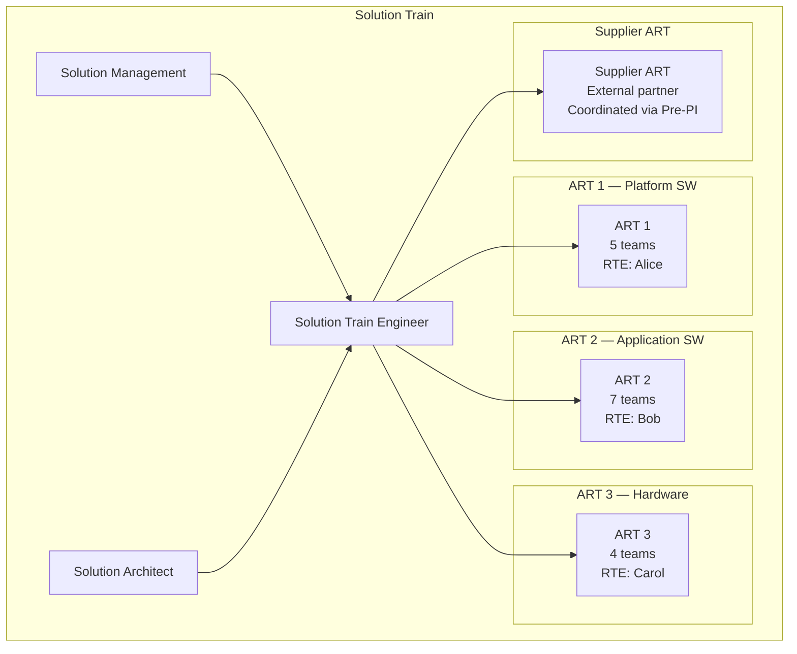

# SAFe 6.0 — Scaled Agile Framework

**Topic:** Scaled Agile Framework (SAFe) version 6.0  
**Standard/Framework:** SAFe 6.0 (Scaled Agile, Inc.)  
**Domain:** Enterprise Agile; large-scale software development; automotive/embedded, IT, financial services  
**Audience:** Release Train Engineers (RTEs), SAFe Program Consultants (SPCs), Agile coaches, engineering managers, product managers  
**Prerequisites:** Agile/Scrum fundamentals; basic organizational structure awareness; product development lifecycle knowledge

---

## Chapter 1 — Historical Context & Origin Story

### 1.1 Timeline

| Year | Milestone |
|------|-----------|
| 2007 | Dean Leffingwell begins developing "Agile Software Requirements" concepts |
| 2011 | SAFe 1.0 released — first "Big Picture" for scaling Agile (2 levels: Team + Program) |
| 2012 | SAFe 2.0 — adds Portfolio level; Lean budgets; Value Streams |
| 2014 | SAFe 3.0 — adds Large Solution level (4 levels complete); WSJF prioritization |
| 2016 | SAFe 4.0 — Lean Enterprise; DevOps; Continuous Delivery Pipeline |
| 2018 | SAFe 4.5 — Lean Portfolio Management; Agile Architecture |
| 2019 | SAFe 4.6 — Core Values; Continuous Learning Culture |
| 2020 | **SAFe 5.0** — Business Agility; 7 core competencies; customer centricity; Design Thinking |
| 2021 | SAFe 5.1 — Flow metrics; OKRs integration; Team Topologies influence |
| 2023 | **SAFe 6.0** — AI/ML; flow acceleration; measure & grow framework; simplified portfolio |

### 1.2 Evolution Philosophy

| Version | Key Addition | Philosophy Shift |
|:-------:|:---:|---|
| 1.0-2.0 | Structure | "How do we organize 100+ people?" |
| 3.0-4.0 | Lean Enterprise | "How do we extend Agile to the whole organization?" |
| 5.0 | Business Agility | "How do we make the BUSINESS Agile (not just engineering)?" |
| 6.0 | Flow + AI | "How do we accelerate value flow and leverage AI?" |

### 1.3 Industry Adoption

| Metric | Data |
|:------:|------|
| Adoption | 70% of Fortune 100 companies use SAFe (as of 2024) |
| Certified professionals | 1,000,000+ globally |
| Domains | Technology (40%), Financial Services (20%), Government (15%), Automotive (10%), Healthcare (8%), Other (7%) |
| Automotive users | BMW, VW Group, Continental, Bosch, ZF, Aptiv, Stellantis |

---

## Chapter 2 — SAFe 6.0 Architecture

### 2.1 Configurations

```mermaid
graph TB
    subgraph "SAFe 6.0 Configurations"
        subgraph "Essential SAFe (minimum)"
            ESS[Essential SAFe<br/>━━━━━━━━━<br/>• Team Level<br/>• ART Level (Program)<br/>• Lean-Agile leadership<br/>• Minimum viable framework]
        end
        
        subgraph "Large Solution SAFe"
            LS_SAF[Large Solution<br/>━━━━━━━━━<br/>• Essential + Solution Level<br/>• Multiple ARTs coordinated<br/>• Solution Train<br/>• Suppliers/partners]
        end
        
        subgraph "Portfolio SAFe"
            PORT_SAF[Portfolio SAFe<br/>━━━━━━━━━<br/>• Essential + Portfolio Level<br/>• Lean Portfolio Management<br/>• Strategy → Execution<br/>• Value Stream budgeting]
        end
        
        subgraph "Full SAFe"
            FULL[Full SAFe<br/>━━━━━━━━━<br/>• All 4 levels<br/>• Portfolio + Large Solution<br/>  + Program + Team<br/>• Largest enterprises]
        end
    end
```

### 2.2 Four Levels

| Level | Scope | Key Roles | Key Events | Key Artifacts |
|:-----:|:-----:|:---------:|:----------:|:---:|
| **Portfolio** | Strategy; funding; governance | Lean Portfolio Management (LPM); Epic Owners; Enterprise Architect | Strategic themes review; portfolio sync; participatory budgeting | Portfolio Backlog; Portfolio Canvas; Lean Business Cases |
| **Large Solution** | Multi-ART coordination | Solution Train Engineer (STE); Solution Management; Solution Architect | Pre-PI Planning; Post-PI Planning; Solution Demo | Solution Backlog; Solution Intent; Solution Context |
| **Program (ART)** | 5-12 teams (50-125 people) | RTE; Product Management; System Architect | PI Planning; System Demo; Inspect & Adapt; ART Sync | Program Backlog; Program Board; PI Objectives |
| **Team** | Individual Agile team (5-11) | Scrum Master; Product Owner; Team Members | Sprint Planning; Daily Standup; Sprint Review; Retrospective | Team Backlog; Iterations; Stories |

---

## Chapter 3 — Core Concepts Deep Dive

### 3.1 Agile Release Train (ART)

| Aspect | Detail |
|:------:|--------|
| **Definition** | Long-lived team-of-teams (5-12 Agile teams) that plan, commit, and execute together |
| **Size** | 50-125 people |
| **Cadence** | Program Increment (PI) = 8-12 weeks (typically 5 iterations × 2 weeks + 1 Innovation & Planning iteration) |
| **Alignment** | All teams on same PI cadence; synchronized start/end |
| **Key property** | The ART is the PRIMARY value delivery mechanism in SAFe |
| **Analogy** | Like a real train: runs on schedule, carries value, predictable departure/arrival |

### 3.2 PI Planning

| Element | Detail |
|:-------:|--------|
| **What** | 2-day face-to-face (or virtual) event where entire ART plans the next PI (8-12 weeks) |
| **Frequency** | Every PI (every 8-12 weeks) |
| **Attendees** | ALL team members + Product Management + System Architect + Business Owners + RTE |
| **Day 1** | Business context; Architecture vision; Team breakout #1 (draft plans); Draft plan review; Management review & problem-solving |
| **Day 2** | Team breakout #2 (finalize plans); Final plan review; PI confidence vote (fist-of-five); Planning retrospective |
| **Outputs** | PI Objectives (per team + ART); Program Board (feature delivery timeline + dependencies); Risks (ROAM'd) |

### 3.3 WSJF (Weighted Shortest Job First)

$$WSJF = \frac{\text{Cost of Delay}}{\text{Job Duration}} = \frac{\text{User-Business Value} + \text{Time Criticality} + \text{Risk Reduction/Opportunity Enablement}}{\text{Job Size}}$$

| Factor | Description | Scale |
|:------:|-------------|:-----:|
| **User-Business Value** | Relative value to user/business | 1-21 (Fibonacci) |
| **Time Criticality** | How much value decays with time | 1-21 |
| **Risk Reduction / Opportunity Enablement** | How much risk is reduced or future opportunity enabled | 1-21 |
| **Job Size** | Relative effort/duration | 1-21 |

**Usage:** Items with HIGHEST WSJF are sequenced first in the backlog.

### 3.4 SAFe Lean-Agile Principles

| # | Principle |
|:-:|-----------|
| 1 | Take an economic view |
| 2 | Apply systems thinking |
| 3 | Assume variability; preserve options |
| 4 | Build incrementally with fast, integrated learning cycles |
| 5 | Base milestones on objective evaluation of working systems |
| 6 | Make value flow without interruptions |
| 7 | Apply cadence; synchronize with cross-domain planning |
| 8 | Unlock the intrinsic motivation of knowledge workers |
| 9 | Decentralize decision-making |
| 10 | Organize around value |

---

## Chapter 4 — SAFe 6.0 New Features

### 4.1 Key Additions in SAFe 6.0

| Feature | Description |
|:-------:|-------------|
| **Measure & Grow** | New competency assessment framework; replaces "Business Agility Value Stream"; focus on measurable outcomes per competency |
| **AI/ML Integration** | Guidance for AI-assisted development; AI in value streams; responsible AI principles |
| **Flow Acceleration** | Enhanced flow metrics (flow time, flow load, flow velocity, flow distribution, flow efficiency); SAFe Flow Predictability metric |
| **Simplified Portfolio** | Leaner portfolio level; reduced bureaucracy; faster epic funding |
| **OKRs** | Objectives & Key Results formally integrated (PI Objectives → OKRs at portfolio level) |
| **Team Topologies** | Platform teams; enabling teams; stream-aligned teams; complicated subsystem teams (influenced by Skelton/Pais) |

### 4.2 Flow Metrics (SAFe 6.0)

| Metric | Formula | What It Measures |
|:------:|:-------:|:---|
| **Flow Velocity** | Items completed per time period | Throughput of value delivery |
| **Flow Time** | Time from item entering system to completion | Total cycle time including wait |
| **Flow Load** | WIP (Work in Progress) count | Amount of work in the system |
| **Flow Efficiency** | Active time / Total time × 100% | How much time is value-adding vs. waiting |
| **Flow Distribution** | % allocation across feature/defect/risk/debt | Balance of investment types |
| **Flow Predictability** | Planned vs. actual PI objectives achieved (%) | Reliability of planning |

### 4.3 Team Topologies in SAFe 6.0

| Team Type | Mission | Example |
|:---------:|:-------:|---------|
| **Stream-aligned** | Deliver value directly to customer/user; end-to-end ownership | Feature team building ADAS parking feature |
| **Platform** | Provide internal services/tools that accelerate stream-aligned teams | CI/CD platform team; middleware platform team |
| **Enabling** | Help stream-aligned teams adopt new skills/technologies | DevOps coaching team; security enablement team |
| **Complicated Subsystem** | Own technically complex components requiring specialist knowledge | Low-level driver team; ML inference engine team |

---

## Chapter 5 — SAFe Implementation (SAFe Implementation Roadmap)

### 5.1 12-Step Implementation Roadmap

| Step | Activity | Duration |
|:----:|----------|:--------:|
| 1 | Reaching the Tipping Point (leadership convinced) | — |
| 2 | Train Lean-Agile Change Agents (SPC training) | 4 days |
| 3 | Train Executives, Managers, and Leaders | 2 days |
| 4 | Create a Lean-Agile Center of Excellence (LACE) | 2-4 weeks |
| 5 | Identify Value Streams and ARTs | 2-4 weeks |
| 6 | Create the Implementation Plan | 2-4 weeks |
| 7 | Prepare for ART Launch | 6-8 weeks |
| 8 | Train Teams and Launch the ART (first PI Planning) | 2 weeks |
| 9 | Coach ART Execution (first PI) | 8-12 weeks |
| 10 | Launch More ARTs and Value Streams | Ongoing |
| 11 | Extend to the Portfolio | 3-6 months |
| 12 | Sustain and Improve (Measure & Grow) | Continuous |

### 5.2 Common Anti-Patterns

| Anti-Pattern | Symptom | Fix |
|:---:|:---|---|
| "SAFe as waterfall" | PI Planning becomes fixed contract; no adaptation during PI | PI Objectives are forecasts, not commitments; encourage adaptation |
| "Feature factory" | Teams deliver features without measuring outcomes | Add outcome metrics (OKRs); kill features that don't deliver value |
| "Dependency hell" | Program board covered in red strings (dependencies) | Reduce dependencies: reorganize teams around value; platform teams; API contracts |
| "RTE as PM" | RTE doing project management (tracking tasks; assigning work) | RTE = servant leader; facilitates events; removes impediments; coaches teams |
| "No innovation" | IP (Innovation & Planning) iteration consumed by spillover work | Protect IP sprint; no feature work allowed; invest in tech debt + learning |
| "WSJF gaming" | Teams inflate scores to get their features prioritized first | Relative scoring in group (not absolute); challenge ratings; trust + transparency |

---

## Chapter 6 — SAFe for Automotive/Embedded

### 6.1 Automotive-Specific Adaptations

| Standard SAFe | Automotive Adaptation |
|:---:|---|
| **Feature** | Feature may span HW + SW + Mechanical → "Capability" at Solution level coordinates |
| **Definition of Done** | Extended with ASPICE compliance criteria; MISRA; coverage targets; traceability |
| **PI cadence** | Align with vehicle program milestones (A-sample, B-sample, C-sample, SOP) |
| **Supplier integration** | Supplier teams participate in PI Planning (or Pre-PI Planning); interface agreements as PI objectives |
| **Architecture** | Safety architecture (ASIL decomposition) as architectural runway; architecture reviews include safety |
| **Compliance** | Compliance stories in backlog; assessor invited to observe PI Planning + demos; evidence automated |
| **Hardware dependency** | HW availability gates; virtual HIL for early integration; shift-left via simulation |

### 6.2 SAFe + ASPICE Mapping

| SAFe Artifact/Event | ASPICE Work Product/Evidence |
|:---:|---|
| PI Planning outputs (PI objectives; program board) | MAN.3 project plan evidence; work planning |
| Sprint Review + System Demo | Review evidence (SWE.1-SWE.6 reviews) |
| Definition of Done (DoD) | Process adherence evidence; quality criteria |
| Program Backlog (features → stories with acceptance criteria) | SWE.1 SW requirements |
| Architecture description (System Architect) | SWE.2 SW architecture |
| CI pipeline (build + test) | SWE.4/SWE.5 unit/integration test evidence |
| Inspect & Adapt (I&A) | Process improvement evidence (ASPICE CL 3) |
| ART metrics (velocity; defect rate) | MAN.3 measurement; process performance |

---

## Chapter 7 — Comparison: Scaling Frameworks

| Criterion | SAFe 6.0 | LeSS | Spotify Model | Nexus | DA (Disciplined Agile) |
|:---------:|:---------:|:----:|:---:|:-----:|:---:|
| **Scale** | 50-10,000+ | 8-2000 (up to 8 teams per LeSS; LeSS Huge for more) | Medium-Large | 3-9 teams | Any |
| **Prescriptive** | High (defined roles, events, artifacts) | Low (minimal additions to Scrum) | Low (culture guidelines) | Medium | Context-sensitive |
| **Roles** | Many (RTE, PM, SA, STE, Epic Owner, etc.) | Few (Product Owner; Scrum Master; teams) | Tribes, Squads, Chapters, Guilds | Nexus Integration Team | Goal-driven roles |
| **Planning** | PI Planning (2 days; all-hands) | Sprint Planning (One or Two) | No prescribed planning events | Nexus Sprint Planning | Context-dependent |
| **Portfolio** | Yes (Lean Portfolio Management) | No (single product focus) | No | No | Yes |
| **Safety-critical support** | Explicit (compliance stories; DoD extensions) | Implicit (needs adaptation) | No | No | Yes (lifecycle selection) |
| **Training/Certification** | Extensive (SA, SPC, RTE, POPM, etc.) | CSM + LESS practitioner | No certification | Nexus certification | DA certifications |
| **Industry adoption** | Highest | Medium | Medium (mostly tech companies) | Low | Medium |
| **Cost to adopt** | High (training + consulting) | Low | Low | Low | Medium |

---

## Chapter 8 — Architecture Diagrams

### 8.1 SAFe ART Structure

```mermaid
graph TB
    subgraph "Agile Release Train (ART)"
        subgraph "Leadership"
            RTE[Release Train Engineer<br/>━━━━━━━━━<br/>Servant leader<br/>Facilitates PI events<br/>Removes impediments]
            PM[Product Management<br/>━━━━━━━━━<br/>Feature definition<br/>Backlog prioritization<br/>Customer voice]
            SA[System Architect<br/>━━━━━━━━━<br/>Architecture decisions<br/>Architectural runway<br/>Non-functional requirements]
        end
        
        subgraph "Teams (5-12)"
            T1[Team 1<br/>SM + PO + Devs]
            T2[Team 2<br/>SM + PO + Devs]
            T3[Team 3<br/>SM + PO + Devs]
            T4[Team N<br/>SM + PO + Devs]
        end
        
        subgraph "Shared Services"
            SS[Shared Services<br/>━━━━━━━━━<br/>• System Team (CI/CD)<br/>• UX/Design<br/>• Security<br/>• Platform]
        end
    end
    
    RTE --> T1
    RTE --> T2
    RTE --> T3
    RTE --> T4
    PM --> T1
    PM --> T2
    SA --> SS
```

### 8.2 PI Cadence

```mermaid
gantt
    title Program Increment (PI) — 12 weeks
    dateFormat  X
    axisFormat %s
    
    section Iterations
    Sprint 1 (2 weeks)      :s1, 0, 2
    Sprint 2 (2 weeks)      :s2, 2, 4
    Sprint 3 (2 weeks)      :s3, 4, 6
    Sprint 4 (2 weeks)      :s4, 6, 8
    Sprint 5 (2 weeks)      :s5, 8, 10
    IP Iteration (2 weeks)  :ip, 10, 12
    
    section Events
    PI Planning             :milestone, m1, 0, 0
    System Demo 1           :milestone, m2, 2, 2
    System Demo 2           :milestone, m3, 4, 4
    System Demo 3           :milestone, m4, 6, 6
    System Demo 4           :milestone, m5, 8, 8
    System Demo 5           :milestone, m6, 10, 10
    Inspect & Adapt         :milestone, m7, 12, 12
```



### 8.3 Solution Train (Large Solution)



---

## Chapter 9 — Case Studies

### 9.1 Automotive OEM: SAFe Transformation (200+ teams)

| Aspect | Detail |
|--------|--------|
| **Organization** | Premium European OEM; Connected Car Platform; 1,500+ SW engineers; 200+ teams |
| **Before** | Waterfall/V-model; 18-month release cycles; late integration (3 months before SOP); 60% of integration issues found in last 20% of timeline; low developer morale |
| **SAFe Implementation** | Full SAFe (4 levels). 6 ARTs organized by vehicle domain (Infotainment, ADAS, Body, Powertrain, Connectivity, Platform). Solution Train for vehicle integration. 12-week PI cadence aligned to vehicle milestones. |
| **Key decisions** | (1) PI Planning physically co-located (rented convention center for 1,500 people). (2) Supplier integration: suppliers attend Pre-PI planning; deliver on same cadence. (3) ASPICE compliance maintained: DoD includes ASPICE criteria; compliance stories in backlog; assessor invited to PI Planning. (4) Vehicle-level System Demo every 2 weeks (on real HW + HIL). |
| **Results (after 18 months)** | Release cycle: 18 months → 3 months (incremental releases). Integration issues: 60% reduction (found early via system demos). Developer satisfaction: 3.2 → 4.3 /5. Feature lead time: 9 months → 6 weeks (from concept to vehicle). ASPICE CL 2: maintained (assessor confirmed). |
| **Challenges** | (1) Initial resistance from experienced engineers ("we're not a startup"). Fix: show it works with first ART success; then others want to join. (2) HW dependency (long lead times). Fix: virtual HIL; shift-left; HW abstraction layer. (3) Supplier resistance. Fix: contractual incentive alignment; co-location during PI Planning. |

### 9.2 Financial Platform: SAFe to Improve DORA Metrics

| Aspect | Detail |
|--------|--------|
| **Organization** | Fintech platform; 400 developers; 40 teams; microservices architecture |
| **Before** | Teams independently Agile but no coordination → integration chaos; conflicting priorities; architectural drift; DORA: Low (monthly deploys; 4-week lead time) |
| **SAFe Implementation** | Portfolio SAFe. 3 ARTs (Payments ART, Lending ART, Platform ART). 10-week PI. WSJF prioritization. Architecture runway investments (20% allocation). |
| **Results** | Deploy frequency: monthly → weekly (ART level) / daily (team level). Lead time: 4 weeks → 5 days. Cross-ART dependency conflicts: 15/PI → 3/PI. Architecture coherence: platform team provides golden paths; teams follow. Regulatory compliance: compliance activities in PI planning; audit evidence automated. |

---

## Chapter 10 — Future Evolution

| Trend | Timeline | Impact on SAFe |
|-------|----------|:---:|
| **AI pair programming** | Now (2024+) | Teams velocity increases; SAFe may need to address how AI changes capacity planning + estimation |
| **Platform engineering** | Now (expanding) | Platform teams in SAFe Team Topologies; internal developer platforms as ART product |
| **Value stream management** | Now (maturing) | VSM tools integrate with SAFe; end-to-end flow visibility from idea to production |
| **Continuous planning** | 2024-2027 | PI Planning evolves from big-batch event to more continuous/lightweight (already trend in SAFe 6.0) |
| **AI portfolio management** | 2025-2028 | AI assists WSJF; predictive portfolio modeling; automated dependency detection |
| **SAFe for hardware** | 2024-2026 | Better guidance for mixed HW/SW; longer PI for HW; virtual prototyping |
| **Outcomes over outputs** | Now | Shift from "features delivered" to "outcomes achieved"; OKR integration deepens |
| **Simplification** | Ongoing | SAFe perceived as "heavy" → trend toward Essential SAFe; less prescriptive; more principles |

---

## Chapter 11 — Interview Questions & Career Guide

### Tier 1: Entry-Level (SA Certification)

**Q1:** Explain the Agile Release Train (ART) and its key events.

**A:**

**ART (Agile Release Train):**
- Long-lived team of teams: 5-12 Agile teams (50-125 people)
- Aligned on a common mission (value stream segment)
- Plans, commits, and executes together in a **Program Increment (PI)** cadence

**Key ART Events:**

| Event | Frequency | Duration | Purpose |
|:-----:|:---------:|:--------:|---------|
| **PI Planning** | Every PI (8-12 weeks) | 2 days | All teams plan the next PI; identify dependencies; commit to PI objectives |
| **System Demo** | Every iteration (2 weeks) | 1-2 hours | Demonstrate integrated working software from all teams; stakeholder feedback |
| **ART Sync** | Weekly | 30 min | RTE + POs + SMs sync on progress, risks, dependencies |
| **Inspect & Adapt** | End of PI | 3-4 hours | Retrospective + problem-solving workshop for the entire ART |
| **Innovation & Planning (IP)** | Last iteration of PI | 2 weeks | Innovation; tech debt; hackathons; preparation for next PI Planning |

### Tier 2: Mid-Level (RTE/SPC)

**Q2:** You are an RTE for an ART of 8 teams. During PI Planning, you identify 15 cross-team dependencies. How do you manage them?

**A:**

**Immediate (during PI Planning):**
1. **Visualize:** All dependencies on Program Board (red strings between teams)
2. **Classify:** For each dependency:
   - Is it a REAL dependency (technical; cannot avoid)?
   - Or a PERCEIVED dependency (organizational; could be eliminated by team reorganization)?
3. **ROAM risks:** Dependencies that threaten PI objectives → mark as Risk; ROAM (Resolved/Owned/Accepted/Mitigated)
4. **Sequence:** Use WSJF + dependency order to sequence work (dependent items go to earlier iterations)

**During PI Execution:**
5. **Track:** Dependencies tracked in ART Sync (weekly); escalate blocked items
6. **Early delivery:** Teams delivering dependent items prioritize them in early sprints
7. **Interface contracts:** Define APIs/interfaces early (sprint 1); implement independently

**Systemic Fix (long-term):**
8. **Reduce dependencies:** 
   - Reorganize teams around value (stream-aligned teams own end-to-end)
   - Platform team provides shared services (reduces cross-team coupling)
   - API-first design (loose coupling)
   - Architecture: modularize to minimize inter-team dependencies
9. **Target:** < 5 dependencies per PI (from 15) within 3 PIs

### Tier 3: Senior/Leadership (SPC/LACE)

**Q3:** Design a SAFe implementation strategy for an automotive company transitioning from traditional V-model. The company has 2,000 SW engineers across 5 product lines.

**A:**

**Phase 0 — Preparation (Months 1-3):**

| Activity | Details |
|:--------:|---------|
| Executive alignment | Workshop with CTO + VP Engineering + VP Product: SAFe overview; why now; expected outcomes; investment required |
| SPC training | Train 8-10 SPCs (internal change agents from LACE); 4-day Leading SAFe + 4-day SPC course |
| Value stream identification | Map 5 product lines to value streams: 3-4 ARTs per product line; 15-20 ARTs total (phased rollout) |
| LACE establishment | 6-person Lean-Agile Center of Excellence: 2 SPCs + 2 Agile coaches + 1 tooling specialist + 1 measurement lead |

**Phase 1 — Pilot ART (Months 4-7):**

| Activity | Details |
|:--------:|---------|
| Select pilot | Most willing product line; smallest risk; highest visibility; ideally new product (less legacy) |
| Organize first ART | 7 teams (stream-aligned); 1 platform team; shared services (CI/CD; test infra) |
| Train all | Leading SAFe (leadership); SAFe for Teams (all members); SAFe PO/PM; SAFe Scrum Master |
| First PI Planning | 2-day event; coached by external SAFe consultants; all 80+ people in one room |
| Execute first PI | Intensive coaching; frequent retrospectives; measure: PI predictability; velocity; quality |
| ASPICE integration | DoD includes ASPICE criteria; traceability automated; assessor reviews approach |
| Demonstrate results | End-of-PI showcase to leadership; present metrics; invite other product line leaders |

**Phase 2 — Scale (Months 8-18):**

| Activity | Details |
|:--------:|---------|
| Launch 2-3 more ARTs per quarter | Following same pattern; pilot ART RTEs mentor new RTEs |
| Solution Train (if needed) | For product lines with 3+ ARTs; Solution Train Engineer; Pre/Post PI Planning |
| Supplier integration | Include key suppliers in PI Planning; align cadence; contractual adaptation |
| Portfolio level | Lean Portfolio Management: value stream funding (not project funding); WSJF for epic prioritization; Lean Business Cases |
| Metrics | DORA metrics per ART; PI predictability; business outcomes (time-to-market; defect escape rate) |

**Phase 3 — Optimize (Months 18+):**

| Activity | Details |
|:--------:|---------|
| Measure & Grow | SAFe 6.0 competency assessment per ART; identify improvement areas; targeted coaching |
| Platform teams | Establish platform ARTs for shared infrastructure; reduce duplication across product lines |
| Continuous improvement | Communities of Practice (CoPs); quarterly Inspect & Adapt at portfolio level |
| Business agility | Extend to non-engineering (marketing, sales, HR); Lean-Agile budgeting; OKRs |

---

## Chapter 12 — Cheat Sheet & Quick Reference

```
═══════════════════════════════════════════
SAFe 6.0 — QUICK REFERENCE
═══════════════════════════════════════════

CONFIGURATIONS:
  Essential SAFe: Team + ART (minimum viable)
  Large Solution: + Solution Train (multi-ART)
  Portfolio: + Lean Portfolio Management
  Full SAFe: All levels combined

═══════════════════════════════════════════
ART (AGILE RELEASE TRAIN):
  • 5-12 teams (50-125 people)
  • PI cadence: 8-12 weeks (typically 5×2wk + 1 IP)
  • Key roles: RTE + Product Mgmt + System Architect
  • Key events: PI Planning → System Demo → I&A

═══════════════════════════════════════════
PI PLANNING (2 days):
  Day 1: Context → Vision → Team Breakout #1 → Draft Plan Review
  Day 2: Team Breakout #2 → Final Plan → Confidence Vote
  Outputs: PI Objectives + Program Board + ROAM'd Risks
  Confidence Vote: Fist-of-five (≥3 average required)

═══════════════════════════════════════════
WSJF (Prioritization):
  WSJF = Cost of Delay / Job Size
  CoD = User Value + Time Criticality + Risk Reduction
  HIGHEST WSJF → sequence FIRST

═══════════════════════════════════════════
SAFe PRINCIPLES (10):
  1. Economic view
  2. Systems thinking
  3. Variability; preserve options
  4. Fast integrated learning cycles
  5. Objective milestones (working systems)
  6. Value flow without interruptions
  7. Cadence + cross-domain synchronization
  8. Intrinsic motivation
  9. Decentralize decisions
  10. Organize around value

═══════════════════════════════════════════
FLOW METRICS (SAFe 6.0):
  Flow Velocity: items completed/time
  Flow Time: entry-to-exit time
  Flow Load: WIP count
  Flow Efficiency: active/total time
  Flow Distribution: feature/defect/risk/debt %
  Flow Predictability: planned vs actual %

═══════════════════════════════════════════
KEY ROLES:
  RTE: Servant leader; facilitates ART events
  Product Management: Feature definition; backlog priority
  System Architect: Architecture decisions; runway
  SPC: Change agent; coaches transformation
  STE: Solution Train facilitator (multi-ART)
  Epic Owner: Portfolio-level feature ownership

═══════════════════════════════════════════
CERTIFICATIONS:
  SA (SAFe Agilist): Leadership; 2-day course
  SPC (SAFe Program Consultant): Change agent; 4-day
  RTE (Release Train Engineer): ART facilitation; 3-day
  POPM (Product Owner/Product Manager): 2-day
  SSM (SAFe Scrum Master): 2-day
  ASE (SAFe Agile Software Engineer): Technical; 3-day

═══════════════════════════════════════════
AUTOMOTIVE TIPS:
  • PI cadence aligned to vehicle program milestones
  • DoD includes ASPICE/safety criteria
  • Supplier participation in PI Planning
  • System Demo on HIL/vehicle (not just slides)
  • Safety architecture = architectural runway
  • Compliance stories in backlog
```

---

*End of Document — 09_SAFe_Scaled_Agile.md*
