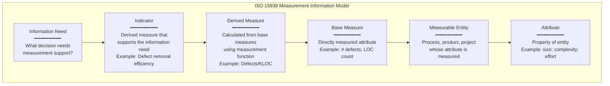
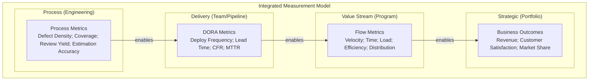

# Process Metrics & Measurement

**Topic:** Software Process Measurement, TSP/PSP, GQM, Statistical Process Control  
**Standards/Frameworks:** ISO/IEC 15939:2017 (Measurement Process); TSP/PSP (SEI/Watts Humphrey); GQM (Goal-Question-Metric, Basili); SPC (Statistical Process Control); CMMI ML4/ML5 Quantitative Management; PSM (Practical Software Measurement)  
**Domain:** Software engineering process improvement; quantitative management; capability maturity  
**Audience:** SEPG (Software Engineering Process Group) members, quality managers, measurement analysts, CMMI assessors, engineering managers  
**Prerequisites:** Basic statistics; CMMI awareness; software development lifecycle knowledge

---

## Chapter 1 — Historical Context & Origin Story

### 1.1 Timeline

| Year | Milestone |
|------|-----------|
| 1968 | NATO Software Engineering Conference — first recognition of "software crisis" |
| 1976 | Tom DeMarco: "You can't control what you can't measure" |
| 1984 | Victor Basili proposes **GQM** (Goal-Question-Metric) paradigm at University of Maryland |
| 1986 | Watts Humphrey joins SEI; begins work on process maturity |
| 1987 | SEI CMM v0.1 draft — introduces maturity levels with measurement at ML4 |
| 1989 | **PSP (Personal Software Process)** developed by Humphrey |
| 1993 | **TSP (Team Software Process)** developed at SEI |
| 1996 | ISO/IEC 15939 (measurement process) first edition |
| 1997 | PSM (Practical Software Measurement) published by DoD/industry |
| 2000 | Balanced Scorecard applied to software organizations |
| 2002 | CMMI v1.1 — Measurement & Analysis (MA) process area; QPM (Quantitative Project Management) at ML4 |
| 2007 | ISO/IEC 15939:2007 update — information model refined |
| 2010 | Lean metrics applied to software (cycle time; throughput; WIP) |
| 2014 | DORA metrics research begins (deployment frequency; lead time; etc.) |
| 2017 | ISO/IEC 15939:2017 — current edition |
| 2018 | CMMI v2.0 — Measuring Performance (MP) + Managing Performance & Measurement (MPM) practice areas |
| 2020 | Flow Framework (Mik Kersten) — value stream metrics for software |
| 2023 | SPACE framework (GitHub/Microsoft) — developer productivity metrics |
| 2024 | AI-assisted measurement; predictive process analytics |

### 1.2 The Measurement Challenge

| Problem | Detail |
|:-------:|--------|
| "Measurement dysfunction" | Measuring the WRONG things incentivizes wrong behavior (e.g., measuring LOC → code bloat) |
| "Vanity metrics" | Metrics that look good but don't inform decisions (e.g., total test cases without test effectiveness) |
| "Gaming" | People optimizing FOR the metric rather than the goal (Goodhart's Law) |
| "Overhead" | Measurement cost exceeding measurement value |
| **Solution** | GQM: derive metrics FROM goals (not reverse); measure to IMPROVE (not to punish); automate collection; minimal set that informs decisions |

---

## Chapter 2 — Measurement Frameworks Architecture

### 2.1 GQM (Goal-Question-Metric) Paradigm

```mermaid
graph TB
    subgraph "GQM Structure"
        subgraph "Conceptual Level"
            G1[GOAL 1<br/>Improve defect detection<br/>effectiveness of code review<br/>from perspective of quality manager]
            G2[GOAL 2<br/>Reduce time-to-market<br/>for new features<br/>from perspective of product owner]
        end
        
        subgraph "Operational Level"
            Q1[Q1: What % of defects<br/>are found in review<br/>vs. testing?]
            Q2[Q2: How long does<br/>review take per KLOC?]
            Q3[Q3: What is feature<br/>lead time from idea<br/>to production?]
            Q4[Q4: Where are<br/>the bottlenecks in<br/>the delivery pipeline?]
        end
        
        subgraph "Quantitative Level"
            M1[M1: Review defect<br/>density (defects/KLOC)]
            M2[M2: Phase containment<br/>effectiveness (%)]
            M3[M3: Review effort<br/>(hours/KLOC)]
            M4[M4: Feature cycle time<br/>(days)]
            M5[M5: Queue time per<br/>pipeline stage (days)]
        end
    end
    
    G1 --> Q1
    G1 --> Q2
    G2 --> Q3
    G2 --> Q4
    Q1 --> M1
    Q1 --> M2
    Q2 --> M3
    Q3 --> M4
    Q4 --> M5
```

### 2.2 GQM Template

| Element | Template | Example |
|:-------:|----------|---------|
| **Goal** | Analyze {object} for the purpose of {purpose} with respect to {quality focus} from the viewpoint of {stakeholder} in the context of {context} | "Analyze code review process for the purpose of improvement with respect to defect detection effectiveness from the viewpoint of quality manager in the context of automotive ADAS development" |
| **Question** | What characterizes/affects the {quality focus} of {object}? | "What % of total defects are detected during code review?" |
| **Metric** | Quantitative measure that answers the question | "Phase containment effectiveness = (defects found in review) / (defects found in review + defects found in testing + field defects) × 100%" |

### 2.3 ISO/IEC 15939 Measurement Information Model



---

## Chapter 3 — TSP/PSP (Team/Personal Software Process)

### 3.1 PSP (Personal Software Process)

| Level | Name | What Developer Tracks |
|:-----:|:----:|---|
| **PSP0** | Baseline | Time spent; defects found & fixed; defect log |
| **PSP0.1** | + Coding Standard | + Size measurement (LOC); process improvement proposals (PIPs) |
| **PSP1** | + Planning | + Size estimation (PROBE method); schedule estimation; earned value |
| **PSP1.1** | + Schedule Planning | + Task planning; schedule tracking; resource planning |
| **PSP2** | + Quality Management | + Design reviews; code reviews (personal); quality planning |
| **PSP2.1** | + Design Templates | + Operational Specification Templates (OST); state specification; logic templates |

### 3.2 PSP Key Metrics (Personal)

| Metric | Formula | Interpretation |
|:------:|:-------:|:---|
| **Defect Density** | Total defects / KLOC | Lower is better; track trend over time |
| **Yield** | Defects removed before compile & test / Total defects × 100% | Target: >70% (defects removed by personal review before running code) |
| **Review Rate** | LOC reviewed / hour | Optimal: 150-200 LOC/hour (slower = more effective) |
| **A/FR (Appraisal to Failure Ratio)** | Appraisal time (review) / Failure time (debugging) | Target: >2.0 (spend 2x more time reviewing than debugging) |
| **PQI (Process Quality Index)** | Composite of: size, time, defects (design review; code review; compile; test) | 0-1; target: >0.4 |
| **CPI (Cost Performance Index)** | Earned Value / Actual Cost | >1.0 = under budget; <1.0 = over budget |

### 3.3 TSP (Team Software Process)

| TSP Element | Description |
|:-----------:|-------------|
| **Launch** | 4-day team formation event: define goals; roles; process; plan; quality strategy |
| **Cycles** | Development in cycles (similar to iterations); each cycle has planning + tracking |
| **Roles** | Team Leader; Planning Manager; Quality/Process Manager; Support Manager; Design Manager; Implementation Manager |
| **Tracking** | Weekly team meeting: earned value; quality metrics; schedule status; risk review |
| **Postmortem** | End of project/cycle: what worked; process improvement; data analysis |

### 3.4 TSP Quality Strategy

| Strategy Element | Detail |
|:---:|---|
| **Quality Plan** | Target defect density at each phase; planned reviews; expected yield per phase |
| **Phase Yield** | Each phase (design review; code review; unit test; integration test) has yield TARGET |
| **Defect removal profile** | Plan WHERE defects will be found (front-loaded = better quality; cheaper) |
| **Quality goal** | Delivered defect density < 0.1 defects/KLOC (near-zero field defects) |
| **Evidence** | PSP data from all team members aggregated → team quality metrics |

---

## Chapter 4 — Statistical Process Control (SPC)

### 4.1 SPC Fundamentals for Software

| Concept | Definition | Software Example |
|:-------:|:---|---|
| **Process** | Repeatable sequence of activities producing output | Code review process; testing process; release process |
| **Measure** | Quantitative characteristic of process output | Review defect density; test execution time; deployment duration |
| **Variation** | Inherent randomness in process output | Different reviewers find different #defects; different stories take different time |
| **Common cause** | Normal variation inherent to process (random) | Reviewer experience variation; story complexity variation |
| **Special cause** | Abnormal variation due to specific assignable cause | New team member (unfamiliar); tool failure; missing requirements |
| **Control chart** | Time-series plot with control limits showing process behavior | Defect density per sprint plotted with UCL/LCL |
| **In control** | Process exhibits only common-cause variation (predictable) | All points within control limits; no patterns |
| **Out of control** | Process exhibits special-cause variation (unpredictable) | Points outside control limits; trends; runs |

### 4.2 Control Chart Construction

$$UCL = \bar{X} + 3\sigma$$
$$CL = \bar{X}$$  
$$LCL = \bar{X} - 3\sigma$$

Where:
- $\bar{X}$ = process mean (average of measurements)
- $\sigma$ = standard deviation of measurements
- $UCL$ = Upper Control Limit (3-sigma above mean)
- $LCL$ = Lower Control Limit (3-sigma below mean)

### 4.3 Control Chart Types for Software

| Chart Type | When to Use | Software Application |
|:----------:|:---|---|
| **X-bar / R** | Continuous data; subgroups | Average defect density per sprint (subgroup = sprint stories) |
| **Individual / Moving Range (I/MR)** | Individual measurements; no subgroups | Deployment duration per release; PI velocity |
| **p-chart** | Proportion defective | % stories with escaped defects per sprint |
| **c-chart** | Count of defects (fixed sample size) | Defects found per code review (same KLOC reviewed) |
| **u-chart** | Defect rate (variable sample size) | Defects per KLOC (different story sizes) |

### 4.4 SPC Rules (Western Electric Rules)

| Rule | Description | Indicates |
|:----:|:---|---|
| **Rule 1** | Single point beyond 3σ (outside UCL or LCL) | Special cause (outlier) |
| **Rule 2** | 9 consecutive points on same side of center line | Process shift (mean changed) |
| **Rule 3** | 6 consecutive points steadily increasing or decreasing | Trend (process drifting) |
| **Rule 4** | 14 consecutive points alternating up and down | Stratification or overcontrol |
| **Rule 5** | 2 out of 3 consecutive points beyond 2σ | Special cause warning |
| **Rule 6** | 4 out of 5 consecutive points beyond 1σ | Process shift developing |

---

## Chapter 5 — CMMI ML4/ML5 Quantitative Management

### 5.1 CMMI v2.0 Measurement Practice Areas

| Practice Area | Level | Focus |
|:---:|:---:|---|
| **Measuring Performance (MP)** | CL 2+ | Establish measurement objectives; specify measures; obtain data; analyze data |
| **Managing Performance & Measurement (MPM)** | CL 4 | Quantitative objectives for process performance; statistical management; process baselines; process models |
| **Causal Analysis & Resolution (CAR)** | CL 5 | Root cause analysis of defects and process issues; implement improvements; verify effectiveness |
| **Process Performance Models (PPM)** | CL 4-5 | Predictive models relating process attributes to outcomes (e.g., "if review rate < 100 LOC/hr, expect yield > 80%") |

### 5.2 Process Performance Baselines (PPB)

| Component | Description | Example |
|:---------:|:---|---|
| **Process Performance Baseline** | Historical data characterizing expected process performance | "Code review defect density: mean = 8.2 defects/KLOC; σ = 2.1; range: 4.0-12.4" |
| **Subprocess baselines** | Performance data for individual subprocesses | "Unit test defect detection rate: mean = 65%; σ = 12%" |
| **Composition** | Combine subprocess baselines to predict overall process performance | "With review yield 72% + unit test 65% + integration test 45% → predicted DRE = 95.2%" |
| **Update** | Baselines refreshed periodically (quarterly) with new data | Add new sprint data; recalculate mean and control limits |

### 5.3 Process Performance Models (PPM)

| Model Type | Description | Example |
|:----------:|:---|---|
| **Linear regression** | Relate independent variable(s) to outcome | "Effort = α + β × size (LOC)" → effort estimation model |
| **Monte Carlo simulation** | Simulate outcomes using distributions | "Given: story size ~ LogNormal(μ,σ); review yield ~ Normal(72%,12%) → what is P(delivered defect density < 0.1)?" |
| **Bayesian network** | Causal model with conditional probabilities | "P(schedule overrun | team_experience=low, requirements_volatility=high) = 0.72" |
| **Control chart-based** | Use historical SPC data to predict if process will meet target | "Process in control with mean=5 defects/sprint; UCL=12. Target: <15 defects/sprint → will achieve with 99.7% confidence" |

---

## Chapter 6 — Modern Measurement Frameworks

### 6.1 SPACE Framework (GitHub/Microsoft, 2021)

| Dimension | What It Measures | Example Metrics |
|:---------:|:---:|---|
| **S** — Satisfaction & Well-being | Developer happiness; sense of accomplishment | Developer satisfaction survey; burnout indicators |
| **P** — Performance | Outcome of work | Code quality; reliability; absence of bugs; customer impact |
| **A** — Activity | Count of actions (use carefully — NOT productivity!) | Commits; PRs; deployments; reviews done (contextual; not KPIs) |
| **C** — Communication & Collaboration | How people work together | PR review turnaround; knowledge sharing; documentation; mentoring |
| **E** — Efficiency & Flow | Ability to do work with minimal interruption | Flow state frequency; handoff count; waiting time; context switches |

**Key principle:** Measure at least 3 of 5 dimensions. NEVER use a single dimension (especially Activity alone) as "developer productivity."

### 6.2 Flow Framework (Mik Kersten)

| Flow Item Type | Description |
|:-:|---|
| **Feature** | New business functionality (value-adding) |
| **Defect** | Quality issues to fix |
| **Risk** | Security vulnerabilities; compliance work |
| **Debt** | Technical debt; infrastructure improvements |

| Flow Metric | Measures |
|:-:|---|
| **Flow Velocity** | # items completed per time |
| **Flow Time** | Duration from start to done |
| **Flow Load** | WIP (items in progress) |
| **Flow Efficiency** | Active work time / Total time |
| **Flow Distribution** | % allocation to Feature/Defect/Risk/Debt |

### 6.3 DORA + Flow Integration



---

## Chapter 7 — Comparison: Measurement Approaches

| Criterion | GQM | PSP/TSP | SPC | CMMI ML4 | DORA | SPACE | Flow Framework |
|:---------:|:---:|:-------:|:---:|:---------:|:----:|:-----:|:-:|
| **Focus** | Goal-driven measurement design | Personal/team process improvement | Process stability & capability | Quantitative project management | Delivery performance | Developer experience | Value stream performance |
| **Granularity** | Org/project/process | Individual → team | Process/subprocess | Project → organization | Team → organization | Individual → team | Value stream → portfolio |
| **Statistical rigor** | Low (design framework) | Medium (personal data) | High (control charts) | High (models; baselines) | Medium (benchmarks) | Medium (surveys + metrics) | Medium (flow metrics) |
| **Automation** | Depends on metrics chosen | Manual (developer logs) | Automated (tool data) | Mixed | Automated (CI/CD data) | Surveys + automated | Automated (tool chain) |
| **Industry adoption** | Academic + government | Declining (high overhead) | Automotive + aerospace + defense | CMMI organizations | High (industry-wide) | Growing (tech companies) | Growing (enterprises) |
| **Overhead** | Low (design only) | High (manual tracking) | Medium (setup + analysis) | High (full infrastructure) | Low (automated) | Low (quarterly surveys) | Medium (tool integration) |

---

## Chapter 8 — Architecture Diagrams

### 8.1 Measurement Program Architecture

```mermaid
graph TB
    subgraph "Organizational Measurement Program"
        subgraph "1. Define"
            GQM_DEF[GQM Definition<br/>━━━━━━━━━<br/>• Business goals<br/>• Information needs<br/>• Questions<br/>• Metrics derived from goals]
        end
        
        subgraph "2. Collect"
            AUTO[Automated Collection<br/>━━━━━━━━━<br/>• CI/CD pipeline data<br/>• Git/SCM data<br/>• Issue tracker data<br/>• Test tool data<br/>• Monitoring data]
            MANUAL[Manual Collection<br/>━━━━━━━━━<br/>• Surveys (SPACE)<br/>• Expert judgment<br/>• Process observations]
        end
        
        subgraph "3. Analyze"
            SPC_A[SPC Analysis<br/>━━━━━━━━━<br/>• Control charts<br/>• Trend analysis<br/>• Capability assessment]
            PPM_A[Process Models<br/>━━━━━━━━━<br/>• Regression models<br/>• Simulation<br/>• Prediction]
        end
        
        subgraph "4. Act"
            REPORT[Reporting<br/>━━━━━━━━━<br/>• Dashboards<br/>• Management reports<br/>• Trend alerts<br/>• Recommendations]
            IMPROVE[Improvement<br/>━━━━━━━━━<br/>• Causal analysis<br/>• Process changes<br/>• Verify effectiveness]
        end
    end
    
    GQM_DEF --> AUTO
    GQM_DEF --> MANUAL
    AUTO --> SPC_A
    AUTO --> PPM_A
    MANUAL --> SPC_A
    SPC_A --> REPORT
    PPM_A --> REPORT
    REPORT --> IMPROVE
    IMPROVE -->|"feedback"| GQM_DEF
```

### 8.2 Defect Removal Efficiency Model

```mermaid
graph LR
    subgraph "Defect Injection & Removal Model"
        REQ_INJ[Requirements Phase<br/>Defects injected: 100]
        
        DES_INJ[Design Phase<br/>Defects injected: 80<br/>Review removes: 50 (62%)]
        
        CODE_INJ[Coding Phase<br/>Defects injected: 120<br/>Code review removes: 100 (of remaining)]
        
        UT[Unit Testing<br/>Removes: 70 (of remaining)]
        
        IT_REM[Integration Testing<br/>Removes: 40 (of remaining)]
        
        ST[System Testing<br/>Removes: 25 (of remaining)]
        
        FIELD[Field<br/>Escapes: 15]
    end
    
    REQ_INJ --> DES_INJ --> CODE_INJ --> UT --> IT_REM --> ST --> FIELD
```

**Defect Removal Efficiency (DRE):**

$$DRE = \frac{\text{Defects removed before release}}{\text{Total defects (removed + escaped)}} \times 100\%$$

$$DRE = \frac{300 - 15}{300} \times 100\% = 95\%$$

**Phase Containment Effectiveness (PCE) for code review:**

$$PCE_{review} = \frac{\text{Defects found in review}}{\text{Defects present at review entry}} \times 100\%$$

---

## Chapter 9 — Case Studies

### 9.1 TSP in Safety-Critical Aerospace

| Aspect | Detail |
|--------|--------|
| **Organization** | Aerospace SW contractor; flight control software; DO-178C Level A; 40 engineers in 5 TSP teams |
| **Challenge** | Customer requirement: delivered defect density < 0.1 defects/KLOC; DO-178C mandates objectives for requirements-based testing + structural coverage (MC/DC); schedule pressure → quality at risk |
| **TSP implementation** | All 40 engineers PSP-trained. TSP team launches every 4 months (cycle). Quality plan: target yield per phase (design review: 70%; code review: 75%; unit test: 80%). A/FR target: 2.5 (spend 2.5x more in reviews than in debugging). |
| **Key metrics tracked** | Defect density per phase; yield per phase; A/FR ratio; estimation accuracy (actual/planned); schedule deviation; delivered defect density |
| **Results** | Delivered defect density: 0.06 defects/KLOC (below 0.1 target). Schedule: within 5% of plan (TSP estimation using PROBE method). Cost: 20% reduction vs. previous project (fewer late-found defects = less rework). DO-178C certification: first pass (no major findings). Customer satisfaction: highest rating. |
| **Why it worked** | (1) PSP trained engineers catch defects in personal review (yield >70%) BEFORE code even compiles. (2) TSP quality plan sets clear targets per phase. (3) Data-driven: every engineer tracks personal defect data → continuous personal improvement. (4) Early defect removal = exponentially cheaper than late testing. |

### 9.2 SPC for CMMI ML4 Automotive

| Aspect | Detail |
|--------|--------|
| **Organization** | Tier-1 automotive supplier; ADAS software; CMMI ML3 → targeting ML4; 200 engineers; 15 projects |
| **ML4 requirement** | "Quantitative objectives for process performance are established and used as criteria for managing processes." → Must have process baselines + control charts + predictive capability. |
| **Implementation** | (1) Identified critical subprocesses: code review; unit testing; integration testing; requirements engineering. (2) Established baselines: 24 months of historical data analyzed. (3) Control charts: defect density per review (I-MR chart); unit test effectiveness (p-chart); requirement volatility (c-chart). (4) Process performance models: regression (effort vs. size); Monte Carlo (schedule prediction with confidence intervals). |
| **Control chart example** | Code review defect density: Mean = 7.8 defects/KLOC; UCL = 14.2; LCL = 1.4. Special cause detected: one project had defect density = 2.0 for 3 sprints → investigation: team was reviewing generated code (not meaningful review). Fix: exclude generated code from review metrics OR flag generated code separately. |
| **ML4 assessment result** | ML4 achieved. Assessor accepted: (1) Process baselines documented with sufficient data points (>25). (2) Control charts showing process in control. (3) Quantitative objectives (e.g., "defect density < UCL") used in project planning. (4) Process models used for prediction (schedule estimation with confidence intervals). |

---

## Chapter 10 — Future Evolution

| Trend | Timeline | Impact |
|-------|----------|--------|
| **AI-powered measurement** | Now (2024+) | AI identifies metrics automatically from codebase; detects anomalies; predicts trends |
| **Continuous measurement** | Now | Real-time dashboards; streaming data from CI/CD; instant feedback (not monthly reports) |
| **Developer experience (DevEx)** | 2024+ | SPACE framework adoption; developer satisfaction as first-class metric alongside delivery |
| **Predictive analytics** | 2024-2027 | ML models predict: defect density based on commit patterns; schedule risk based on velocity trends; quality from code complexity trends |
| **Measurement-as-code** | 2024-2026 | Metrics defined in config files; versioned; auto-collected; dashboards generated from definitions |
| **Ethical measurement** | 2024+ | Guidelines against individual performance tracking; focus on team/system metrics; avoid surveillance |
| **Value stream intelligence** | 2025-2028 | End-to-end visibility from business idea to production outcome; automated value stream mapping |
| **Causal inference** | 2025-2030 | Beyond correlation → causal models: "did this process change CAUSE the quality improvement?" (A/B testing for processes) |

---

## Chapter 11 — Interview Questions & Career Guide

### Tier 1: Entry-Level

**Q1:** Explain GQM (Goal-Question-Metric). Give an example for a software project.

**A:**

**GQM:** A measurement design paradigm that ensures metrics are derived from business goals (not collected randomly).

**Structure:**
1. **Goal:** Define what you want to achieve (object; purpose; quality focus; viewpoint; context)
2. **Question:** What questions need answers to know if goal is achieved?
3. **Metric:** What quantitative data answers each question?

**Example:**

| Level | Content |
|:-----:|---------|
| **Goal** | Improve unit testing effectiveness for the purpose of defect prevention from the viewpoint of quality manager in the context of ADAS software |
| **Question 1** | What % of defects are found during unit testing vs. later phases? |
| **Metric 1** | Phase containment effectiveness = defects found in unit test / (defects found in UT + IT + ST + field) × 100% |
| **Question 2** | Is code coverage sufficient to detect defects? |
| **Metric 2** | Branch coverage % per module; correlation between coverage and escaped defects |
| **Question 3** | Are unit tests catching regressions? |
| **Metric 3** | Regression detection rate = regressions caught by UT / total regressions × 100% |

**Key principle:** Metrics SERVE goals. Never collect metrics without a clear goal and decision they inform.

### Tier 2: Mid-Level

**Q2:** You are implementing SPC (Statistical Process Control) for a software team's code review process. Describe how you would set up control charts.

**A:**

**Step 1: Define the measure**
- Measure: Code review defect density (defects found per KLOC reviewed)
- Rationale: Indicates review effectiveness; stability means process is predictable

**Step 2: Collect historical data (minimum 20-25 data points)**
- Source: Code review tool (pull request data; review findings)
- Period: Last 6 months (25+ reviews with similar scope)
- Data point: For each review session: (# defects found) / (KLOC reviewed)

**Step 3: Calculate control limits**
- Chart type: I-MR (Individual / Moving Range) — because each review is one data point

$$\bar{X} = \text{mean of all defect density values}$$
$$\overline{MR} = \text{mean of moving ranges (consecutive differences)}$$
$$UCL_X = \bar{X} + 2.66 \times \overline{MR}$$
$$LCL_X = \bar{X} - 2.66 \times \overline{MR}$$

**Step 4: Plot and interpret**
- Plot each new review's defect density
- Apply Western Electric rules for special causes
- If in control: process is STABLE → use baseline for prediction
- If out of control: investigate assignable cause → fix or adjust

**Step 5: Act on signals**
- Point above UCL: "This review found unusually many defects" → investigate code quality (was it a junior developer? complex module? missing requirements?)
- Point below LCL: "This review found unusually few defects" → investigate review quality (was reviewer superficial? was code actually trivial? was review too fast?)
- Trend: "Defect density declining over 6 sprints" → investigate: are developers writing better code (good!) OR are reviewers less thorough (bad!)?

### Tier 3: Senior

**Q3:** Design a measurement program for a 200-person software organization targeting CMMI ML4. Include: measurement objectives, metrics selection, infrastructure, and governance.

**A:**

**1. Measurement Objectives (derived from business goals via GQM):**

| Business Goal | Measurement Objective |
|:---:|---|
| Deliver predictable schedules | Establish effort estimation models with ±15% accuracy |
| Reduce customer-found defects | Achieve DRE > 95%; establish defect removal baselines per phase |
| Improve development efficiency | Establish productivity baselines; identify and eliminate waste |
| Maintain process stability | All critical subprocesses in statistical control |

**2. Metrics Selection (organized by CMMI ML4 needs):**

| Category | Metrics | Collection Source | Automation |
|:--------:|---------|:---:|:---:|
| **Size** | Function Points; LOC; Story Points | ALM tool; Git | Automated |
| **Effort** | Hours per phase; hours per story point | Time tracking; sprint data | Semi-auto |
| **Quality** | Defect density per phase; DRE; review yield; test effectiveness | Defect tracker; CI pipeline | Automated |
| **Schedule** | Planned vs. actual duration; earned value (CPI/SPI) | PM tool; sprint data | Automated |
| **Process** | Review rate (LOC/hr); test coverage; cycle time | CI pipeline; review tool | Automated |

**3. Infrastructure:**

| Component | Tool | Purpose |
|:---------:|:----:|---------|
| Data warehouse | Time-series DB (InfluxDB) + Relational (PostgreSQL) | Store all measurement data; historical baselines |
| Collection agents | CI/CD plugins; Git hooks; ALM API integrators | Automated data extraction from development tools |
| Analysis engine | Python (scipy + statsmodels) + custom scripts | SPC calculations; control charts; regression models; Monte Carlo |
| Dashboards | Grafana + custom web app | Real-time visualization; control charts; trend reports |
| Reporting | Automated PDF generation | Monthly measurement reports; special cause alerts |

**4. Governance:**

| Element | Detail |
|:-------:|--------|
| **SEPG ownership** | Measurement program owned by SEPG (2 FTE dedicated to measurement) |
| **Measurement plan** | Documented: objectives; metrics; collection procedures; analysis procedures; reporting |
| **Baseline management** | Baselines reviewed quarterly; updated with new data; control limits recalculated |
| **Training** | All project managers trained on: interpreting control charts; using process models for estimation; handling special causes |
| **Review cadence** | Monthly: measurement report reviewed by quality council. Quarterly: baseline adequacy reviewed. Annually: GQM goals revisited |
| **Data quality** | Automated validation rules; outlier flagging; missing data alerts; quarterly data audit |

---

## Chapter 12 — Cheat Sheet & Quick Reference

```
═══════════════════════════════════════════
PROCESS METRICS & MEASUREMENT — QUICK REFERENCE
═══════════════════════════════════════════

GQM (Goal-Question-Metric):
  Goal: What do you want to improve?
  Question: What do you need to know?
  Metric: What data answers the question?
  RULE: Never collect metrics without a goal!

═══════════════════════════════════════════
KEY FORMULAS:

  DRE = (Defects removed before release) / (Total defects) × 100%
  Target: >95%

  Phase Containment = (Defects found in phase) / (Defects present at entry) × 100%

  Yield = (Defects removed by reviews) / (Total defects) × 100%
  PSP target: >70%

  A/FR = Appraisal time / Failure time
  Target: >2.0

  WSJF = Cost of Delay / Job Size

═══════════════════════════════════════════
SPC CONTROL CHART:
  UCL = X̄ + 3σ (or X̄ + 2.66 × MR̄ for I-MR)
  CL  = X̄
  LCL = X̄ - 3σ (or X̄ - 2.66 × MR̄ for I-MR)
  
  Special cause rules:
  • 1 point beyond 3σ
  • 9 consecutive points same side of CL
  • 6 consecutive trending up/down
  • 2 of 3 beyond 2σ

═══════════════════════════════════════════
PSP LEVELS:
  PSP0: Time + defect logging (baseline)
  PSP1: + estimation (PROBE method)
  PSP2: + personal reviews (quality planning)

TSP ELEMENTS:
  Launch (4 days) → Cycles → Postmortem
  Roles: Team/Planning/Quality/Support Manager
  Quality: Phase yield targets; defect profiles

═══════════════════════════════════════════
CMMI ML4 REQUIREMENTS:
  • Process Performance Baselines (PPB)
  • Process Performance Models (PPM)
  • Quantitative objectives for processes
  • Statistical management (SPC)
  • Subprocesses selected for statistical mgmt
  
CMMI ML5 ADDITIONS:
  • Causal Analysis & Resolution (CAR)
  • Continuous process improvement
  • Innovation deployment

═══════════════════════════════════════════
MODERN FRAMEWORKS:

  SPACE (Developer Productivity):
    S = Satisfaction & Well-being
    P = Performance (outcomes)
    A = Activity (contextual; not KPI!)
    C = Communication & Collaboration
    E = Efficiency & Flow
    Rule: Measure ≥3 of 5 dimensions

  Flow Framework:
    Items: Feature / Defect / Risk / Debt
    Metrics: Velocity / Time / Load / Efficiency / Distribution

  DORA:
    Deploy Frequency / Lead Time / CFR / MTTR
    Elite: multiple/day; <1hr; 0-5%; <1hr

═══════════════════════════════════════════
MEASUREMENT ANTI-PATTERNS:
  ✗ Measuring LOC as productivity (incentivizes bloat)
  ✗ Individual metrics for performance review (gaming)
  ✗ Metrics without goals (data hoarding)
  ✗ Manual collection only (unsustainable)
  ✗ Single metric for complex concept (reductive)
  
BEST PRACTICES:
  ✓ Derive metrics from goals (GQM)
  ✓ Automate collection (CI/CD; tools)
  ✓ Team metrics (not individual KPIs)
  ✓ Act on insights (not just report)
  ✓ Review goals periodically (relevance)
```

---

*End of Document — 10_Process_Metrics_Measurement.md*
